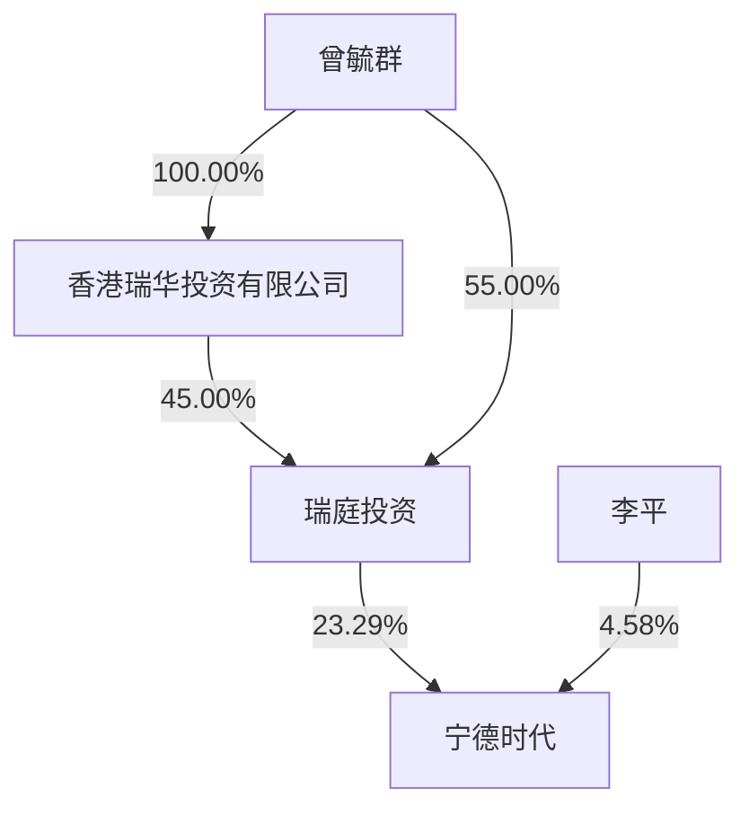

## 第七节 股份变动及股东情况

## 一、股份变动情况

## 1、股份变动情况

单位：股

<table><tr><td rowspan="2"></td><td colspan="2">本次变动前</td><td colspan="5">本次变动增减(+,-)</td><td colspan="2">本次变动后</td></tr><tr><td>数量</td><td>比例</td><td>发行新股</td><td>送股</td><td>公积金转股</td><td>其他</td><td>小计</td><td>数量</td><td>比例</td></tr><tr><td>一、有限售条件股份</td><td>459,804,340</td><td>18.83%</td><td></td><td></td><td>228,154,800</td><td>-183,772,397</td><td>44,382,403</td><td>504,186,743</td><td>11.46%</td></tr><tr><td>1、国家持股</td><td></td><td></td><td></td><td></td><td></td><td></td><td></td><td></td><td></td></tr><tr><td>2、国有法人持股</td><td>19,541,218</td><td>0.80%</td><td></td><td></td><td></td><td>-19,541,218</td><td>-19,541,218</td><td></td><td></td></tr><tr><td>3、其他内资持股</td><td>394,528,102</td><td>16.15%</td><td></td><td></td><td>228,057,520</td><td>-118,426,419</td><td>109,631,101</td><td>504,159,203</td><td>11.46%</td></tr><tr><td>其中:境内法人持股</td><td>44,601,459</td><td>1.83%</td><td></td><td></td><td></td><td>-44,601,459</td><td>-44,601,459</td><td></td><td></td></tr><tr><td>境内自然人持股</td><td>349,926,643</td><td>14.33%</td><td></td><td></td><td>228,057,520</td><td>-73,824,960</td><td>154,232,560</td><td>504,159,203</td><td>11.46%</td></tr><tr><td>4、外资持股</td><td>45,735,020</td><td>1.87%</td><td></td><td></td><td>97,280</td><td>-45,804,760</td><td>-45,707,480</td><td>27,540</td><td>0.00%</td></tr><tr><td>其中:境外法人持股</td><td>45,613,420</td><td>1.87%</td><td></td><td></td><td></td><td>-45,613,420</td><td>-45,613,420</td><td></td><td></td></tr><tr><td>境外自然人持股</td><td>121,600</td><td>0.00%</td><td></td><td></td><td>97,280</td><td>-191,340</td><td>-94,060</td><td>27,540</td><td>0.00%</td></tr><tr><td>二、无限售条件股份</td><td>1,982,710,184</td><td>81.17%</td><td>2,748,301</td><td></td><td>1,725,753,171</td><td>183,642,837</td><td>1,912,144,309</td><td>3,894,854,493</td><td>88.54%</td></tr><tr><td>1、人民币普通股</td><td>1,982,710,184</td><td>81.17%</td><td>2,748,301</td><td></td><td>1,725,753,171</td><td>183,642,837</td><td>1,912,144,309</td><td>3,894,854,493</td><td>88.54%</td></tr><tr><td>三、股份总数</td><td>2,442,514,524</td><td>100.00%</td><td>2,748,301</td><td></td><td>1,953,907,971</td><td>-129,560</td><td>1,956,526,712</td><td>4,399,041,236</td><td>100.00%</td></tr></table>

## （1）股份变动的原因

适用 □不适用

2022年 12月 30日，公司披露了《关于 2022年度向特定对象发行股份解除限售上市流通的提示性公告》，公司2022年度向特定对象发行的109,756,097股限售股于2023年1月4日解除限售并上市流通。

2023年 4月 14日，公司披露了《关于部分限制性股票回购注销完成的公告》，经公司 2022年年度股东大会审议通过，公司完成了2018年和2019年激励计划部分限制性股票的回购注销手续，回购注销共计129,560 股股份，为有限售条件股份。本次回购注销完成后，公司总股本由 2,442,514,524 股减少为2,442,384,964 股。

2023年 4月 18日，公司披露了《2022年年度权益分派实施公告》，经公司 2022年年度股东大会审议通过，公司以资本公积金向全体股东每 10 股转增 8 股。本次资本公积转增完成后，公司总股本由2,442,384,964 股增加为 4,396,292,935 股。

2023年9月13日，公司披露了《关于2022年股票期权与限制性股票激励计划之限制性股票首次及预留授予第一个归属期归属结果暨股份上市的提示性公告》，经公司第三届董事会第二十二次会议审议通过，公司 2022 年激励计划第一个归属期归属条件成就，归属股票数量为 930,952 股，为无限售条件股份，并于 2023 年 9 月 15 日上市流通。本次归属完成后，公司总股本由 4,396,292,935 股增加至 4,397,223,887股。

2023年9月14日，公司披露了《关于2018年限制性股票激励计划首次授予部分第五个限售期解除限售股份上市流通的提示性公告》，经公司第三届董事会二十三次会议审议通过，公司2018年激励计划首次授予部分第四个限售期的股份解除限售条件成就，解除限售股份数量共计 5,862,780股，并于2023年9月19日上市流通。

2023年9月21日，公司披露了《关于2019年限制性股票激励计划第四个限售期解除限售股份上市流通的提示性公告》，经公司第三届董事会二十三次会议审议通过，公司2019年激励计划首次授予部分第四个限售期的股份解除限售条件成就，解除限售股份数量共计 3,323,002股，并于 2023 年 9月 25日上市流通。

2023年 11月 10日，公司披露了《关于 2020年限制性股票激励计划第三个归属期归属结果暨股份上市的提示性公告》，经公司第三届董事会第二十四次会议审议通过，公司2020年激励计划第三个归属期归属条件成就，归属股票数量为1,033,810股，为无限售条件股份，并于2023年11月 14日上市流通。本次归属完成后，公司总股本由 4,397,223,887 股增加至 4,398,257,697 股。

2023年 11月 17日，公司披露了《关于 2021年股票期权与限制性股票激励计划之限制性股票首次及预留授予第二个归属期归属结果暨股份上市的提示性公告》，经公司第三届董事会第二十四次会议审议通过，公司2021年激励计划第二个归属期归属条件成就，归属股票数量为783,539股，为无限售条件股份，并于 2023 年 11 月 21 日上市流通。本次归属完成后，公司总股本由 4,398,257,697 股增加至 4,399,041,236股。

## （2）股份变动的批准情况

适用 □不适用

同“股份变动的原因”。

## （3）股份变动的过户情况

适用 □不适用

同“股份变动的原因”。

## （4）股份变动对最近一年和最近一期基本每股收益和稀释每股收益、归属于公司普通股股东的每股净资产等财务指标的影响

适用 □不适用

股份变动对最近一年和最近一期基本每股收益和稀释每股收益、归属于公司普通股股东的每股净资

产等财务指标的影响，详见“第二节公司简介及主要财务指标之五、主要会计数据和财务指标。

## （6）公司认为必要或证券监管机构要求披露的其他内容

□适用 不适用

## 2、限售股份变动情况

适用 □不适用

单位：股

<table><tr><td>序号</td><td>股东名称</td><td>期初限售股数</td><td>本期增加限售股数</td><td>本期解除限售股数</td><td>期末限售股数</td><td>限售原因</td><td>解除限售日期</td></tr><tr><td>1</td><td>黄世霖</td><td>258,900,728</td><td>155,340,436</td><td>64,725,182</td><td>349,515,982</td><td>董监高锁定股</td><td>离职后全部股份锁定至2023年2月1日,此外在原定任期内和任期届满后6个月内(即2025年6月29日前)每年按持有股份总数的25%解除锁定,其余75%自动锁定</td></tr><tr><td>2</td><td>李平</td><td>83,962,615</td><td>67,170,092</td><td></td><td>151,132,707</td><td>董监高锁定股</td><td>董监高任职期间,每年按持有股份总数的25%解除锁定,其余75%自动锁定</td></tr><tr><td>3</td><td>国泰君安证券股份有限公司</td><td>11,375,365</td><td></td><td>11,375,365</td><td></td><td>向特定对象发行股票限售股</td><td>2023年1月4日</td></tr><tr><td>4</td><td>JPMORGANCHASE BANK,NATIONALASSOCIATION</td><td>9,934,399</td><td></td><td>9,934,399</td><td></td><td>向特定对象发行股票限售股</td><td>2023年1月4日</td></tr><tr><td>5</td><td>BARCLAYSBANK PLC</td><td>8,195,121</td><td></td><td>8,195,121</td><td></td><td>向特定对象发行股票限售股</td><td>2023年1月4日</td></tr><tr><td>6</td><td>申万宏源证券有限公司</td><td>8,165,853</td><td></td><td>8,165,853</td><td></td><td>向特定对象发行股票限售股</td><td>2023年1月4日</td></tr><tr><td>7</td><td>HHLR管理有限公司—HHLR中国基金</td><td>7,317,073</td><td></td><td>7,317,073</td><td></td><td>向特定对象发行股票限售股</td><td>2023年1月4日</td></tr><tr><td>8</td><td>广发证券股份有限公司</td><td>6,829,268</td><td></td><td>6,829,268</td><td></td><td>向特定对象发行股票限售股</td><td>2023年1月4日</td></tr><tr><td>9</td><td>中国太平洋人寿保险股份有限公司-分红-个人分红</td><td>5,390,243</td><td></td><td>5,390,243</td><td></td><td>向特定对象发行股票限售股</td><td>2023年1月4日</td></tr><tr><td>10</td><td>J.P.MorganSecuritiesPLC—自有资金</td><td>4,674,146</td><td></td><td>4,674,146</td><td></td><td>向特定对象发行股票限售股</td><td>2023年1月4日</td></tr><tr><td>11</td><td>其他2022年向特定对象发行股票认购对象</td><td>47,874,629</td><td></td><td>47,874,629</td><td></td><td>向特定对象发行股票限售股</td><td>2023年1月4日</td></tr><tr><td>12</td><td>其他高管锁定股</td><td></td><td>26,015</td><td>1,791</td><td>24,224</td><td>董监高锁定股</td><td>董监高任职期间,每年按持有股份总数的25%解除锁定,其余75%自动锁定</td></tr><tr><td>13</td><td>限制性股票激励计划激励对象</td><td>7,184,900</td><td>5,644,272</td><td>9,315,342(注)</td><td>3,513,830</td><td>股权激励限售股</td><td>自授予登记完成之日起12个月后分五期解除限售</td></tr><tr><td colspan="2">合计</td><td>459,804,340</td><td>228,180,815</td><td>183,798,412</td><td>504,186,743</td><td>--</td><td>--</td></tr></table>

注：上表中“限制性股票激励计划激励对象”对应的“本期解除限售股数”含已完成回购注销的 129,560股限制性股票。

## 二、证券发行与上市情况

## 1、报告期内证券发行（不含优先股）情况

适用 □不适用

单位：股

<table><tr><td>股票及其衍生证券名称</td><td>发行日期</td><td>发行价格</td><td>发行数量</td><td>上市日期</td><td>获准上市交易数量</td><td>交易终止日期</td><td>披露索引</td><td>披露日期</td></tr><tr><td colspan="9">股票类</td></tr><tr><td>限制性股票</td><td>2023年9月15日</td><td>144.48元/股</td><td>930,952</td><td>2023年9月15日</td><td>930,952</td><td>/</td><td>巨潮资讯网《关于2022年股票期权与限制性股票激励计划之限制性股票首次及预留授予第一个归属期归属结果暨股份上市的提示性公告》</td><td>2023年9月13日</td></tr><tr><td>限制性股票</td><td>2023年11月14日</td><td>126.92元/股</td><td>1,033,810</td><td>2023年11月14日</td><td>1,033,810</td><td>/</td><td>巨潮资讯网《关于2020年限制性股票激励计划第三个归属期归属结果暨股份上市的提示性公告》</td><td>2023年11月10日</td></tr><tr><td>限制性股票</td><td>2023年11月21日</td><td>168.26元/股</td><td>783,539</td><td>2023年11月21日</td><td>783,539</td><td>/</td><td>巨潮资讯网《关于2021年股票期权与限制性股票激励计划之限制性股票首次及预留授予第二个归属期归属结果暨股份上市的提示性公告》</td><td>2023年11月17日</td></tr><tr><td colspan="9">可转换公司债券、分离交易的可转换公司债券、公司债类</td></tr><tr><td colspan="9">不适用</td></tr><tr><td colspan="9">其他衍生证券类</td></tr><tr><td colspan="9">不适用</td></tr></table>

报告期内证券发行情况的说明

经公司第三届董事会第二十二次会议审议通过，公司 2022 年激励计划第一个归属期归属条件成就，

归属股票数量为930,952股，为无限售条件股份，并于2023年9月15日上市流通。

经公司第三届董事会第二十四次会议审议通过，公司 2020 年激励计划第三个归属期归属条件成就，归属股票数量为1,033,810股，为无限售条件股份，并于2023年11月14日上市流通。

经公司第三届董事会第二十四次会议审议通过，公司 2021 年激励计划第二个归属期归属条件成就，归属股票数量为783,539股，为无限售条件股份，并于2023年11月21日上市流通。

## 2、公司股份总数及股东结构的变动、公司资产和负债结构的变动情况说明

适用 □不适用

报告期内，公司股份总数及股东结构均发生了变化，具体变化情况详见本报告“第七节 股份变动及股东情况”之“一、股份变动情况”；公司资产和负债结构的变动情况详见“第十节财务报告”相关部分。

## 3、现存的内部职工股情况

□适用 不适用

## 三、股东和实际控制人情况

## 1、公司股东数量及持股情况

## （1）前10名股东持股基本情况

单位：股

<table><tr><td>报告期末普通股股东总数</td><td>260,992</td><td>年度报告披露日前上一月末普通股股东总数</td><td>260,219</td><td>报告期末表决权恢复的优先股股东总数</td><td>0</td><td>年度报告披露日前上一月末表决权恢复的优先股股东总数</td><td>0</td><td>持有特别表决权股份的股东总数</td><td>0</td></tr><tr><td colspan="10">持股5%以上的股东或前10名股东持股情况(不含通过转融通出借股份)</td></tr><tr><td rowspan="2">股东名称</td><td rowspan="2">股东性质</td><td rowspan="2">持股比例</td><td rowspan="2">报告期末持股数量</td><td rowspan="2">报告期内增减变动情况</td><td rowspan="2">持有有限售条件的股份数量</td><td rowspan="2">持有无限售条件的股份数量</td><td colspan="2">质押、标记或冻结情况</td><td></td></tr><tr><td>股份状态</td><td>数量</td><td></td></tr><tr><td>厦门瑞庭投资有限公司</td><td>境内一般法人</td><td>23.29%</td><td>1,024,704,949</td><td>455,224,422</td><td></td><td>1,024,704,949</td><td></td><td></td><td></td></tr><tr><td>黄世霖</td><td>境内自然人</td><td>10.59%</td><td>466,021,310</td><td>207,120,582</td><td>349,515,982</td><td>116,505,328</td><td></td><td></td><td></td></tr><tr><td>香港中央结算有限公司</td><td>境外法人</td><td>9.62%</td><td>423,295,349</td><td>251,791,223</td><td></td><td>423,295,349</td><td></td><td></td><td></td></tr><tr><td>宁波联合创新新能源投资管理合伙企业(有限合伙)</td><td>境内一般法人</td><td>6.46%</td><td>284,220,608</td><td>126,320,270</td><td></td><td>284,220,608</td><td></td><td></td><td></td></tr><tr><td>李平</td><td>境内自然人</td><td>4.58%</td><td>201,510,277</td><td>89,560,123</td><td>151,132,707</td><td>50,377,570</td><td>质押</td><td>29,730,000</td><td></td></tr><tr><td>宁波梅山保税港区博瑞荣合投资合伙企业(有限合伙)</td><td>境内一般法人</td><td>1.19%</td><td>52,226,778</td><td>21,377,128</td><td></td><td>52,226,778</td><td></td><td></td><td></td></tr></table>

<table><tr><td>西藏鸿商资本投资有限公司</td><td>境内一般法人</td><td>1.05%</td><td>46,195,296</td><td>19,969,693</td><td></td><td>46,195,296</td><td></td><td></td></tr><tr><td>本田技研工业(中国)投资有限公司</td><td>境内一般法人</td><td>0.94%</td><td>41,400,000</td><td>18,400,000</td><td></td><td>41,400,000</td><td></td><td></td></tr><tr><td>深圳市招银叁号股权投资合伙企业(有限合伙)</td><td>境内一般法人</td><td>0.85%</td><td>37,459,589</td><td>6,612,025</td><td></td><td>37,459,589</td><td></td><td></td></tr><tr><td>中国工商银行股份有限公司-易方达创业板交易型开放式指数证券投资基金</td><td>基金、理财产品等</td><td>0.85%</td><td>37,335,936</td><td>30,854,553</td><td></td><td>37,335,936</td><td></td><td></td></tr><tr><td colspan="2">战略投资者或一般法人因配售新股成为前10名股东的情况(如有)</td><td colspan="7">不适用</td></tr><tr><td colspan="2">上述股东关联关系或一致行动的说明</td><td colspan="7">1、截至报告期末,瑞庭投资的股东曾毓群和李平为一致行动人。2、除上述情况之外,未知其他股东之前是否存在关联关系,也未知是否属于《上市公司收购管理办法》中规定的一致行动人。</td></tr><tr><td colspan="2">上述股东涉及委托/受托表决权、放弃表决权情况的说明</td><td colspan="7">不适用</td></tr><tr><td colspan="2">前10名股东中存在回购专户的特别说明(如有)</td><td colspan="7">不适用</td></tr><tr><td colspan="9">前10名无限售条件股东持股情况</td></tr><tr><td rowspan="2" colspan="4">股东名称</td><td rowspan="2" colspan="2">报告期末持有无限售条件股份数量</td><td colspan="3">股份种类</td></tr><tr><td colspan="2">股份种类</td><td>数量</td></tr><tr><td colspan="4">厦门瑞庭投资有限公司</td><td colspan="2">1,024,704,949</td><td colspan="2">人民币普通股</td><td>1,024,704,949</td></tr><tr><td colspan="4">香港中央结算有限公司</td><td colspan="2">423,295,349</td><td colspan="2">人民币普通股</td><td>423,295,349</td></tr><tr><td colspan="4">宁波联合创新新能源投资管理合伙企业(有限合伙)</td><td colspan="2">284,220,608</td><td colspan="2">人民币普通股</td><td>284,220,608</td></tr><tr><td colspan="4">黄世霖</td><td colspan="2">116,505,328</td><td colspan="2">人民币普通股</td><td>116,505,328</td></tr><tr><td colspan="4">宁波梅山保税港区博瑞荣合投资合伙企业(有限合伙)</td><td colspan="2">52,226,778</td><td colspan="2">人民币普通股</td><td>52,226,778</td></tr><tr><td colspan="4">李平</td><td colspan="2">50,377,570</td><td colspan="2">人民币普通股</td><td>50,377,570</td></tr><tr><td colspan="4">西藏鸿商资本投资有限公司</td><td colspan="2">46,195,296</td><td colspan="2">人民币普通股</td><td>46,195,296</td></tr><tr><td colspan="4">本田技研工业(中国)投资有限公司</td><td colspan="2">41,400,000</td><td colspan="2">人民币普通股</td><td>41,400,000</td></tr><tr><td colspan="4">深圳市招银叁号股权投资合伙企业(有限合伙)</td><td colspan="2">37,459,589</td><td colspan="2">人民币普通股</td><td>37,459,589</td></tr><tr><td colspan="4">中国工商银行股份有限公司-易方达创业板交易型开放式指数证券投资基金</td><td colspan="2">37,335,936</td><td colspan="2">人民币普通股</td><td>37,335,936</td></tr><tr><td colspan="2">前10名无限售流通股股东之间,以及前10名无限售流通股股东和前10名股东之间关联关系或一致行动的说明</td><td colspan="7">1、截至报告期末,瑞庭投资的股东曾毓群和李平为一致行动人。2、除上述情况之外,未知其他股东之前是否存在关联关系,也未知是否属于《上市公司收购管理办法》中规定的一致行动人。</td></tr><tr><td colspan="2">参与融资融券业务股东情况说明</td><td colspan="7">西藏鸿商资本投资有限公司除通过普通证券账户持有26,511,079股外,还通过华泰证券股份有限公司客户信用交易担保证券账户持有19,684,217股,实际合计持有46,195,296股。</td></tr></table>

## （2）前十名股东参与转融通业务出借股份情况

适用 □不适用

单位：股

<table><tr><td colspan="5">前十名股东参与转融通出借股份情况</td></tr><tr><td>股东名称(全称)</td><td>期初普通账户、信用账户持股</td><td>期初转融通出借股份且尚未归还</td><td>期末普通账户、信用账户持股</td><td>期末转融通出借股份且尚未归还</td></tr></table>

<table><tr><td></td><td>数量合计</td><td>占总股本的比例</td><td>数量合计</td><td>占总股本的比例</td><td>数量合计</td><td>占总股本的比例</td><td>数量合计</td><td>占总股本的比例</td></tr><tr><td>西藏鸿商资本投资有限公司</td><td>26,225,603</td><td>1.07%</td><td>2,165,000</td><td>0.09%</td><td>46,195,296</td><td>1.05%</td><td>-</td><td>-</td></tr><tr><td>中国工商银行股份有限公司—易方达创业板交易型开放式指数证券投资基金</td><td>6,481,383</td><td>0.27%</td><td>2,051,600</td><td>0.08%</td><td>37,335,936</td><td>0.85%</td><td>60,700</td><td>0.00%</td></tr></table>

## （3）前十名股东较上期发生变化

适用 □不适用

单位：股

<table><tr><td colspan="6">前十名股东较上期末发生变化情况</td></tr><tr><td rowspan="2">股东名称(全称)</td><td rowspan="2">本报告期新增/退出</td><td colspan="2">期末转融通出借股份且尚未归还数量</td><td colspan="2">期末股东普通账户、信用账户持股及转融通出借股份且尚未归还的股份数量</td></tr><tr><td>数量合计</td><td>占总股本的比例</td><td>数量合计</td><td>占总股本的比例</td></tr><tr><td>本田技研工业(中国)投资有限公司</td><td>新增</td><td>-</td><td>-</td><td>41,400,000</td><td>0.94%</td></tr><tr><td>中国工商银行股份有限公司-易方达创业板交易型开放式指数证券投资基金</td><td>新增</td><td>60,700</td><td>0.00%</td><td>37,396,636</td><td>0.85%</td></tr><tr><td>湖北长江招银动力投资合伙企业(有限合伙)</td><td>退出</td><td>-</td><td>-</td><td>34,440,293</td><td>0.78%</td></tr><tr><td>HHLR管理有限公司-中国价值基金(交易所)</td><td>退出</td><td>-</td><td>-</td><td>见注1</td><td>见注1</td></tr></table>

注 1：鉴于“HHLR管理有限公司－中国价值基金（交易所）”未在中登公司下发的期末前 200大股东名册中，公司无该数据。

## （4）公司是否具有表决权差异安排

□适用 不适用

## （5）公司前10名普通股股东、前10名无限售条件普通股股东在报告期内是否进行约定购回交易

□是 否

公司前 10名普通股股东、前 10名无限售条件普通股股东在报告期内未进行约定购回交易。

## 2、公司控股股东情况

## （1）控股股东基本情况

控股股东性质：自然人控股

控股股东类型：法人

<table><tr><td>控股股东名称</td><td>法定代表人</td><td>成立日期</td><td>组织机构代码</td><td>主要经营业务</td></tr><tr><td>厦门瑞庭投资有限公司</td><td>曾毓群</td><td>2012年10月15日</td><td>91350902054341492Y</td><td>投资</td></tr><tr><td>控股股东报告期内控股和参股的其他境内外上市公司的股权情况</td><td colspan="4">否</td></tr></table>

## （2）控股股东报告期内变更

□适用 不适用

公司报告期控股股东未发生变更。

## 3、公司实际控制人及其一致行动人

## （1）实际控制人基本情况

实际控制人性质：境内自然人

实际控制人类型：自然人

<table><tr><td>实际控制人姓名</td><td>与实际控制人关系</td><td>国籍</td><td>是否取得其他国家或地区居留权</td></tr><tr><td>曾毓群</td><td>本人</td><td>中国香港</td><td>是</td></tr><tr><td>李平</td><td>本人</td><td>中国</td><td>是</td></tr><tr><td>主要职业及职务</td><td colspan="3">曾毓群先生为公司董事长兼总经理、李平先生为公司副董事长,具体情况详见本报告“第四节 公司治理”之“七、董事、监事和高级管理人员情况”中的“2、任职情况”。</td></tr><tr><td>过去10年曾控股的境内外上市公司情况</td><td colspan="3">无</td></tr></table>

## （2）公司最终控制层面是否存在持股比例在10%以上的股东情况

是 □否

□法人 自然人

最终控制层面持股情况

<table><tr><td>最终控制层面股东姓名</td><td>国籍</td><td>是否取得其他国家或地区居留权</td></tr><tr><td>曾毓群</td><td>中国香港</td><td>是</td></tr><tr><td>主要职业及职务</td><td colspan="2">曾毓群先生为公司董事长兼总经理,具体情况详见本报告“第四节 公司治理”之“七、董事、监事和高级管理人员情况”中的“2、任职情况”。</td></tr><tr><td>过去10年曾控股的境内外上市公司情况</td><td colspan="2">无</td></tr></table>

## （3）实际控制人报告期内变更

□适用 不适用

公司报告期实际控制人未发生变更。此外，公司于 2024年 2月 8日披露《关于实际控制人解除一致行动关系暨变更实际控制人的提示性公告》，鉴于曾毓群先生与李平先生决定解除一致行动关系，公司实际控制人由曾毓群先生、李平先生变更为曾毓群先生。

## （4）公司与实际控制人之间的产权及控制关系的方框图

flowchart

## （5）实际控制人通过信托或其他资产管理方式控制公司

□适用 不适用

## 4、公司控股股东或第一大股东及其一致行动人累计质押股份数量占其所持公司股份数量比例达到 80%

□适用 不适用

## 5、其他持股在10%以上的法人股东

□适用 不适用

## 6、控股股东、实际控制人、重组方及其他承诺主体股份限制减持情况

□适用 不适用

## 四、股份回购在报告期的具体实施情况

股份回购的实施进展情况

适用 □不适用

<table><tr><td>方案披露时间</td><td>拟回购股份数量(股)</td><td>占总股本的比例</td><td>拟回购金额(万元)</td><td>拟回购期间</td><td>回购用途</td><td>已回购数量(股)</td><td>已回购数量占股权激励计划所涉及的标的股票的比例</td></tr><tr><td>2023年10月31日</td><td>拟使用不低于人民币20亿元(含本数)且不超过人民币30亿元(含本数)自有资金;回购价格上限为294.45元/股。假设按照回购资金总额上限30亿元、回购价格上限294.45元/股进行测算,预计回购股份数量为10,188,487股;按照回购资金总额下限20亿元、回购价格上限294.45元/股测算,预计回购股份数量为6,792,325股。</td><td>0.1545%-0.2317%</td><td>不低于人民币20亿元(含本数)且不超过人民币30亿元(含本数)</td><td>自公司董事会审议通过回购股份方案之日起12个月内</td><td>将用于实施股权激励计划或员工持股计划</td><td>9,086,912</td><td>不适用</td></tr></table>

采用集中竞价交易方式减持回购股份的实施进展情况

□适用 不适用
