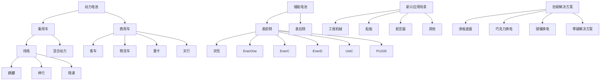

## 第三节 管理层讨论与分析

## 一、报告期内公司所处行业情况

## 1、公司行业分类

公司主要从事动力电池、储能电池和电池回收利用产品的研发、生产和销售。根据国家统计局发布的《国民经济行业分类与代码》（GB/T4754-2017），公司属于门类“C 制造业”中的大类“C38 电气机械和器材制造业”中的小类“C3841锂离子电池制造”。

## 2、行业发展状况及发展趋势

为应对全球气候变化的挑战，推进可持续发展，多个国家提出推动清洁能源转型及构建绿色低碳经济的战略。根据净零倡议组织 Net Zero Tracker 统计，目前全球已有 195 个国家和地区制定并公布了碳减排国家自主贡献目标，重点关注电力、交通、工业等主要碳排放领域。高品质的锂电池凭借高能量密度、长循环寿命、良好稳定性及安全性等性能优势，作为核心蓄能载体，在低碳社会及能源转型中扮演重要的角色，相关产业近年来快速发展。

## （1）动力电池行业

受益于新能源在售车型数量快速增加、智能化水平提升、充换电基础设施不断完善等因素，全球新能源车市场需求持续增长。国内市场，根据中国汽车工业协会数据，2024 年我国新能源乘用车销量为1,105 万辆，同比增长 40.2%，渗透率提升至 48.9%；新能源商用车销量为 53 万辆，同比增长 28.9%，渗透率提升至 17.9%。海外市场，根据欧洲汽车制造商协会数据，2024 年欧洲 31 国实现新能源乘用车注册量295万辆、渗透率为22.7%；根据美国汽车创新联盟数据，2024年前三季度美国新能源轻型车实现销量约114万辆、渗透率约10%。新能源车市场的快速发展、单车带电量的逐步提升带动动力电池市场增长，根据 SNE Research统计，2024年全球新能源车动力电池使用量达 894.4GWh，同比增长 27.2%。

## （2）储能行业

在全球可再生能源发展、储能成本下探、数据中心需求提升等因素驱动下，全球储能市场需求持续增长。国内市场，风电、光伏装机继续提升，根据国家能源局数据，2024 年我国风电光伏新增装机容量356.5GW，同比增长 21.8%；受益于政策支持且储能成本下降提升储能项目经济性，储能需求快速增长，根据中关村储能产业技术联盟统计，2024 年我国新型储能新增装机规模达 109.8GWh，同比增长 136%。海外市场，美国简化发电机组并网流程，并网节奏加快，带动配套储能需求增长；欧洲多国及海外其他地区不断出台支持政策，储能招标规模持续增长。此外，随着智能应用的快速发展，新型数据中心建设加速，成为储能市场发展的新动力。根据 SNE Research 统计，2024 年全球储能电池出货量 301GWh，同

比增长 62.7%。

## （3）电池材料及回收行业

随着动力电池、储能电池市场的持续增长，电池材料的需求也相应增长。根据SMM统计，2024年我国三元与磷酸铁锂正极材料合计产量达 302.7 万吨，同比增长 59.7%。此外，从废旧电池中提取可再生金属资源，已成为实现资源循环利用及推动电池材料行业可持续发展的重要途径。随着早期投放市场的锂电池逐渐进入退役期，退役电池的回收需求逐步提升，根据上海钢联数据，2024 年我国锂电池报废量达75.1万吨，同比增长 8.2%。

## 3、公司行业地位

公司是全球领先的动力电池和储能电池企业。根据SNE Research数据，在动力电池领域，公司 2017-2024 年连续 8年动力电池使用量排名全球第一，2024 年全球市占率为 37.9%，较第二名高出 20.7 个百分点；在储能领域，公司 2021-2024年连续 4年储能电池出货量排名全球第一，2024年全球市占率为 36.5%，较第二名高出 23.3个百分点。

## 4、主要法律法规及行业政策

2024年以来行业有关的主要法律法规及政策如下表所示：

<table><tr><td>时间</td><td>颁布单位</td><td>文件名称及主要内容</td></tr><tr><td>2024年3月</td><td>国务院</td><td>《推动大规模设备更新和消费品以旧换新行动方案》,开展汽车以旧换新,加大政策支持力度,畅通流通堵点,促进汽车梯次消费、更新消费。支持交通运输设备和老旧农业机械更新,持续推进城市公交车电动化替代,支持老旧新能源公交车和动力电池更新换代;加快淘汰国三及以下排放标准营运类柴油货车;加强电动、氢能等绿色航空装备产业化能力建设;加快高耗能高排放老旧船舶报废更新,大力支持新能源动力船舶发展,完善新能源动力船舶配套基础设施和标准规范,逐步扩大电动、液化天然气动力、生物柴油动力、绿色甲醇动力等新能源船舶应用范围。</td></tr><tr><td>2024年4月</td><td>国家能源局</td><td>《关于促进新型储能并网和调度运用的通知》,通过规范并网接入、优化调度方式、加强运行管理等措施,明确新型储能的功能定位和技术要求,持续完善新型储能调度机制,保障新型储能合理高效利用,有力支撑新型电力系统建设。</td></tr><tr><td>2024年5月</td><td>生态环境部、发改委、工信部等十五部门</td><td>《关于建立碳足迹管理体系的实施方案》,优先聚焦锂电池、新能源汽车、光伏和电子电器等重点产品,制定发布核算规则标准。力争在锂电池、新能源汽车、光伏和电子电器等领域推动制定产品碳足迹国际标准。</td></tr><tr><td>2024年6月</td><td>工信部</td><td>《锂离子电池行业规范条件(2024年本)》,引导企业加强技术创新、提高产品质量、降低生产成本。对动力电池、储能电池单体及电池组的能量密度、功率密度、循环寿命、容量保持率等产品性能指标进行了规定。</td></tr><tr><td>2024年6月</td><td>欧洲议会及理事会</td><td>Regulation (EU) 2024/1735《净零工业法案》,提出到2030年欧盟本土净零技术(如太阳能板、风力涡轮机、电池和热泵)制造产能达到部署需求的40%,到2040年欧盟在这些技术上达到世界产量的15%。法案规定了增加绿色技术投资的多项举措,包括简化战略性项目的许可程序、利用公共采购和可再生能源拍卖提升战略性技术产品的市场准入等。</td></tr><tr><td>2024年7月</td><td>欧洲议会及理事会</td><td>Regulation (EU) 2024/1747《欧盟电力市场改革方案》,为应对天然气价格导致电价上涨问题,欧盟电力市场改革旨在降低电价对波动的化石燃料价格的依赖,保护消费者不受价格飙升的影响,加快可再生能源等清洁电力的部署,激励清洁能源转型。关键举措包括:1、通过对长期购电协议(PPA)和差价合约的推广、可再生能源的投资建设,间接驱动储能发展;2、非化石灵活性支持系统“可用容量付费”,使灵活性资源充分满足清洁能源目标,或将直接增加储能机组收益,促进储能发展。</td></tr><tr><td>2024年9月</td><td>国家发改委、国家能源局</td><td>《关于推动车网互动规模化应用试点工作的通知》,按照“创新引导、先行先试”的原则,全面推广新能源汽车有序充电,扩大双向充放电(V2G)项目规模,丰富车网互动应用场景,以城市为主体完善规模化、可持续的车网互动政策机制,以V2G项目为主体探索技术先进、模式清晰、可复制推广的商业模式,力争以市场化机制引导车网互动规模化发展。参与试点的地区应全面执行充电峰谷分时电价,力争年度充电电量60%以上集中在低谷时段,其中通过私人桩充电的电量80%以上集中在低谷时段。参与试点的V2G项目放电总功率原则上不低于500千瓦,年度放电量不低于10万千瓦时,西部地区可适当降低。</td></tr><tr><td>2024年12月</td><td>国家发改委、国家能源局</td><td>《电力系统调节能力优化专项行动实施方案(2025—2027年)》,明确到2027年,通过调节能力的建设优化,支撑2025-2027年年均新增2亿千瓦以上新能源的合理消纳利用,全国新能源利用率不低于90%。优化选择适宜新型储能技术,高质量建设一批技术先进、发挥功效的新型储能电站。优化新型储能调度运行,发挥移峰填谷和顶峰发电作用,增强本地电力供应保障能力,实现应用尽用。在新能源消纳困难时段优先调度新型储能,实现日内应调尽调。完善调节资源参与市场机制,包括完善峰谷电价机制,建立健全调频、备用辅助服务市场体系,加快建立市场化容量补偿机制。</td></tr></table>

## 二、报告期内公司从事的主要业务

公司需遵守《深圳证券交易所上市公司自律监管指引第 4 号——创业板行业信息披露》中的“锂离子电池产业链相关业务”的披露要求。

## 1、主要业务

公司是全球领先的新能源创新科技公司，主要从事动力电池、储能电池的研发、生产、销售，以推动移动式化石能源替代、固定式化石能源替代，并通过电动化和智能化实现市场应用的集成创新。截至报告期末，公司已在全球设立六大研发中心、十三大电池生产制造基地，并覆盖全球最广泛的动力与储能客户群体。

公司在锂电池领域深耕多年，具备了全链条自主、高效的研发能力，在电池材料、电池系统、电池回收等产业链领域拥有核心技术优势及前瞻性研发布局，通过材料及材料体系创新、系统结构创新、绿色极限制造创新及商业模式创新为全球新能源应用提供一流的解决方案和服务，已形成全面、先进的产品矩阵，可应用于乘用车、商用车、表前储能、表后储能等领域，以及工程机械、船舶、航空器等新兴应用场景，能够全方位满足不同客户的多元化需求。

## 2、主要产品及其用途

公司致力于为全球新能源应用提供一流的动力电池和储能电池产品及相关创新解决方案，具体如下：

flowchart

## （1）动力电池系统

公司动力电池产品包括电芯、模组/电箱及电池包。公司可提供磷酸铁锂电池、三元高压中镍电池、三元高镍电池、钠离子电池、M3P 电池、凝聚态电池等覆盖不同能量密度区间的多种化学体系产品系列，能满足快充、长寿命、长续航、高安全、宽温度适应性等多种功能需求。公司根据应用领域及客户要求，通过定制或联合研发等方式设计个性化产品方案，以满足客户对产品性能的不同需求。

乘用车应用领域，公司产品可应用于 BEV、REV、PHEV、HEV 等不同细分市场，广泛应用于私家车、运营车等领域；商业应用领域，公司产品可应用于道路客运、城市配送、重载运输、道路清洁等客车及商用车领域。此外，公司产品还可应用于电动工具、电动两轮车等领域，具备高能量密度、高功率、高安全的特性。

## （2）储能电池系统

公司提供电芯、电池柜、储能集装箱以及交流侧系统等储能产品解决方案。公司的储能电池广泛应用于表前储能和表后储能领域，包括公用事业储能、工商业储能及数据中心储能等。

电芯产品方面，基于多样的应用场景和产品全周期的经济性，公司开发了多款发电侧、输配电侧储能专用电芯以及适用于用户侧的系列电芯，覆盖多种容量并兼具超长寿命、高安全、宽温度适应性等特性。

系统集成方面，在表前领域，公司依托智能液冷控温、高成组 CTP、无热扩散等技术，推出了户外液冷电池柜 EnerOne、EnerOnePlus 以及针对全气候场景的集装箱式液冷电池柜 EnerC、EnerCPlus、EnerD、EnerX。公司进一步推出了天恒储能系统，是全球首款 5 年功率与容量零衰减的产品，单箱能量高达6.25MWh，具有高安全、长寿命、高度集成等优势。在表后储能领域，公司产品已实现从低压、中压到高压平台的全场景覆盖。其中，UniC 系列产品具备长寿命、简运维、低辅源等特点，适配工商储能多元场景应用需求；PU100产品具备高安全、高功率、易维护等特点，可满足数据中心能源管理需求。

## （3）新兴应用领域及创新解决方案

除上述应用领域外，公司的动力电池的应用也不断拓展至工程机械、船舶、航空器等新兴应用场景。公司也持续推出创新解决方案，包括滑板底盘、针对乘用车领域的巧克力换电、针对重卡领域的骐骥换电解决方案等。

## （4）电池材料和回收

公司电池材料产品主要包括锂盐、前驱体及正极材料等。公司亦通过回收方式，对废旧电池中的镍、钴、锰、锂、磷、铁、铝、铜等金属材料及其他材料进行加工、提纯、合成等工艺，生产锂电池生产所需的正极材料、三元前驱体、磷铁前驱体、锂盐等材料，并将收集后的铜、铝等金属材料通过第三方回收利用，使电池生产所需的关键金属资源实现有效循环利用。

此外，为进一步保障电池生产所需的上游关键资源及材料供应，公司通过自建、参股、合资等多种方式参与锂、镍、钴、磷等电池矿产资源及相关产品的投资、建设及运营。

## 3、经营模式

公司拥有独立的研发、采购、生产和销售体系，主要通过销售动力电池、储能电池和电池材料等产品实现盈利。研发方面，公司建立了完备的研发体系，形成以自主研发为主、外部合作为辅的研发模式，通过数字化、智能化的方式，紧紧围绕材料及材料体系、系统结构、绿色极限制造及商业模式领域开展创新，以引领行业技术发展。采购方面，公司通过严格的评估和考核程序遴选合格供应商，并通过技术授权、长期协议、合资合作等方式与供应商紧密合作，以保证原料、设备的技术先进性、产品可靠性以及成本竞争力。生产销售方面，公司综合考虑市场情况以及客户需求安排生产。

报告期内，公司的主要经营模式未发生重大变化。

## 4、主要的业绩驱动因素

## （1）行业持续增长

动力电池方面，全球新能源车销量增长带动动力电池需求持续增长。根据 SNE Research 统计，2024年全球新能源车销量1,763万辆，同比增长26.1%，全球动力电池使用量达894.4GWh，同比增长27.2%。储能电池方面，在各国清洁能源转型目标推动下，随着风电光伏装机比例提升、电力系统灵活性要求提高、储能技术进步及系统成本下降，储能电池市场需求持续快速增长。根据 SNE Research 统计，2024 年全球储能电池出货量301GWh，同比增长62.7%。

## （2）公司竞争力进一步提升

公司坚持技术领先、服务优质、运营卓越的经营理念，致力于为全球客户提供一流产品及解决方案。

基于强大创新基因、深刻行业洞察、高效经营管理，公司在技术研发、极限制造、供应链管理、全球客户合作、可持续发展、新兴市场拓展等方面的竞争力进一步提升，推动业务稳健增长，为股东持续创造价值。

## 三、核心竞争力分析

## 1、全方位的研发优势

锂电池是全球绿色低碳与清洁能源转型的关键部件。研发并大规模生产兼具高安全、高性能、高质量、低成本等特性的锂电池门槛极高，不仅要求公司对电化学、热力学、分子动力学等多学科及覆盖微观、介观、宏观多尺度的基础理论有深刻的理解和综合应用能力，还要求公司具备强大的工艺设计、工程制造和质量管控的能力。

公司的团队深耕锂电行业多年，基于对分子动力学、电化学相场法、相图理论等研究方法和科学理论的理解，依托自身在锂电池行业的丰富经验与技术沉淀，形成了基于第一性原理的独特研发创新体系。截至报告期末，公司拥有六大研发中心，研发人员超过 2 万名。公司将安全、质量、成本贯穿全流程管理，自主研发了高通量材料集成计算、智能化电芯设计、智能化工艺设计等高效研发平台，并基于海量、多场景的客户及终端用户需求反哺研发设计，针对性地提升产品性能，优化产品方案，形成正向良性循环，打造全方位的研发优势。截至报告期末，公司拥有专利及专利申请合计达 43,354 项，其中境内拥有专利及专利申请 25,439项，境外拥有专利及专利申请 17,915项。

## 2、先进的产品矩阵

基于全方位的研发优势，公司已打造出行业内最全面、最先进的产品矩阵。公司产品具备高能量密度、长循环寿命、高充电倍率、宽温度适应性、高安全性等性能优势，广泛适用于乘用车、商用车、储能领域及新兴应用场景。

在乘用车领域，公司推出了以麒麟电池和神行电池为代表的系列产品，满足纯电乘用车用户对于充电速度、续航里程、功率等多元化需求，并针对混动乘用车用户的纯电续航里程短等需求痛点推出了骁遥电池；在商用车领域，公司推出了天行电池系列产品精准适配客车、物流车、重卡等商用车，有效解决商用车续航短、补能慢、寿命衰减快等行业痛点；在储能领域，公司推出的天恒储能系统是全球首款 5年功率与容量零衰减的产品，单箱能量达 6.25MWh，具有高安全、长寿命、高度集成等优势。

## 3、全面的客户合作

公司与全球知名车企、储能系统集成商、储能项目开发商或运营商等客户建立了长期且深度的战略合作，除产品销售外，还通过参股、合资、技术授权等方式与客户开展全面合作，助力客户打造全球领先 的 竞 争 力 。 公 司 的 车 企 客 户 包 括 BMW、Mercedes-Benz、Stellantis、Volkswagen、Ford、Toyota、

Hyundai、Honda、Volvo、上汽、吉利、蔚来、理想、宇通、小米等；公司的储能客户及合作方包括NextEra、Synergy、Wärtsilä、Excelsior、Jupiter Power、Flexgen、国家能源集团、国家电力投资集团、中国华能、中国华电、中石油等。截至报告期末，公司已实现动力电池累计装车超 1,700 万辆，储能电池在全球应用超 1,700个项目。

## 4、领先的可持续发展实践

公司高度重视可持续发展及履行社会责任，近年来ESG评级稳步上升，其中MSCI评级已达AA、标普企业可持续发展评估评分 58 分，均处于行业领先水平。我们于 2023 年发布了“零碳战略”，即 2025 年实现核心运营碳中和，2035 年实现价值链碳中和。为全方位推进零碳目标实现，公司对生产基地进行节能改造与可再生能源利用，积极推进零碳工厂建设与可再生能源项目开发，提升零碳电力使用比例。截至报告期末，公司核心运营零碳电力比例提升至 74.51%，已拥有 9 座“零碳工厂”，单位产品温室气体排放强度下降 20.97%。公司已建立覆盖全球的回收基地，形成了大规模、广泛的回收网络体系，具备 27万吨废旧电池年处理能力，镍钴锰金属回收率可达 99.6%，锂金属回收率可达93.8%。

## 四、主营业务分析

## 1、概述

报告期内，公司实现归属于上市公司股东的净利润 507.45 亿元，同比增长 15.01%。公司实现锂离子电池销量 475GWh，同比增长 21.79%，其中，动力电池系统销量 381GWh，同比增长 18.85%；储能电池系统销量 93GWh，同比增长 34.32%。

报告期内，公司主要经营情况如下：

## （1）持续推出创新产品

乘用车领域，公司在 2023 年发布神行 4C 超充电池的基础上发布神行 Plus 电池，可实现系统能量密度超200Wh/kg，是全球首个兼备1,000km续航以及4C超充特性的磷酸铁锂电池；推出新一代麒麟高功率电池，放电功率超 1,300kW，可助力新能源车实现零百加速 2秒以内；推出全球首款纯电续航达到 400公里以上，同时兼具 4C超充能力的骁遥增混电池，弥补增混车型充电补能效率慢的短板。

商用车领域，针对时效性高的物流与平台接单场景，推出天行 L-超充、天行 L-长续航，使用寿命可达 8年 80万公里；针对客车应用场景，推出天行客车版，使用寿命可达 15年 150万公里；针对重卡应用场景，推出天行电池重型商用车版本，使用寿命可达 15 年 300 万公里，在矿区、建筑工地等恶劣环境下保持可靠性和稳定性。

储能领域，公司发布了全球首款 5 年零衰减、单体 6.25MWh 的天恒储能系统，较上一代产品单位面积能量密度提升 30%，占地面积降低 20%，可进一步提升储能项目收益率；推出了 PU100 储能产品，可支持 6C 放电以满足 10-15 分钟紧急备用电源需求，同时还具备高安全、高功率、易维护等特点，持续助力数据中心能源管理。

## （2）不断升级创新解决方案

公司推出的新一代巧克力换电解决方案适配车型广，灵活性强，已在多款车型落地推广，与车企、运营商、金融机构、服务商等各方合作共同构建换电生态，通过快速换电大幅提升乘用车终端用户的补能效率和体验。公司推出的骐骥换电能够为重卡运输行业带来更环保、更经济、更高效的补能解决方案。公司推出的滑板底盘产品具备上下解耦、高度集成以及对外开放三大特征，助力合作伙伴进行个性化开发，促进联合创新和资源共享。公司推出的超安全磐石底盘在全球范围内首个通过“最高时速+最强冲击”的双重极限安全测试，可适配不同车型，显著缩短整车开发周期，开创电动车开发合作新生态。

## （3）全面深化客户合作

公司在各新能源领域积极推进全方位的深度客户合作。动力电池领域，公司与 Volvo、北京现代、猛士科技、江汽集团、临工重机、中国龙工、陕西交控、奇瑞商用车、上海国际港务集团、上海城投集团、山东重工集团、太原重型机械集团、陕汽商用车、厦门路桥等达成战略合作，与法国达飞海运集团签署合作协议，加深在乘用车、商用车、船舶等领域业务合作。储能电池领域，公司与Quinbrook、NextEra等签署战略合作协议、全面深化合作，与 Rolls-Royce 达成战略合作，拟将天恒储能系统引入欧盟和英国市场。

## （4）稳步推进全球产能建设

公司稳步推进电池产能建设以满足全球客户订单交付需求。国内方面，公司顺利推进中州基地、贵阳基地、厦门基地、济宁基地等建设，部分产线已投产并正在进行产能爬坡；海外方面，公司德国工厂产能逐渐提升，并获得大众汽车集团模组测试实验室及电芯测试实验室双认证，成为全球首家获得大众集团模组认证、欧洲首家获得大众集团电芯认证的电池制造商。此外，公司积极推进匈牙利工厂、与Stellantis合资的西班牙工厂以及印尼电池产业链项目的建设或筹建。

## （5）推进零碳科技产品与解决方案

基于公司在清洁能源领域的产品与技术优势，结合自身减碳经验，积极开发零碳科技产品与解决方案。报告期内，公司与山东东营市、江苏南京市、天津市、澳门特别行政区、横琴粤澳深度合作区等城市或地区签署战略合作协议，同时在海南、盐城、鄂尔多斯、宁德等地开展零碳试点示范，推动公司绿电直供、源网荷储微电网以及构网型储能等相关创新和示范项目落地。公司通过打造零碳城市建设方案，与各界合作伙伴共同推动新能源产品绿色智造、新能源投资开发、交通电动化及基础设施建设、电池回收及梯次利用等领域合作发展，推动各领域绿色低碳转型。

## 2、收入与成本

## （1）营业收入构成

## 1）营业收入整体情况

单位：千元

<table><tr><td rowspan="2">项目</td><td colspan="2">2024 年</td><td colspan="2">2023 年</td><td rowspan="2">同比增减</td></tr><tr><td>金额</td><td>占营业收入比重</td><td>金额</td><td>占营业收入比重</td></tr><tr><td>营业收入合计</td><td>362,012,554</td><td>100.00%</td><td>400,917,045</td><td>100.00%</td><td>-9.70%</td></tr><tr><td colspan="6">分行业</td></tr><tr><td>电气机械及器材制造业</td><td>356,519,551</td><td>98.48%</td><td>393,182,894</td><td>98.07%</td><td>-9.32%</td></tr><tr><td>采选冶炼行业</td><td>5,493,003</td><td>1.52%</td><td>7,734,151</td><td>1.93%</td><td>-28.98%</td></tr><tr><td colspan="6">分产品</td></tr><tr><td>动力电池系统</td><td>253,041,337</td><td>69.90%</td><td>285,252,917</td><td>71.15%</td><td>-11.29%</td></tr><tr><td>储能电池系统</td><td>57,290,460</td><td>15.83%</td><td>59,900,522</td><td>14.94%</td><td>-4.36%</td></tr><tr><td>电池材料及回收</td><td>28,699,935</td><td>7.93%</td><td>33,602,284</td><td>8.38%</td><td>-14.59%</td></tr><tr><td>电池矿产资源</td><td>5,493,003</td><td>1.52%</td><td>7,734,151</td><td>1.93%</td><td>-28.98%</td></tr><tr><td>其他业务</td><td>17,487,818</td><td>4.83%</td><td>14,427,171</td><td>3.60%</td><td>21.21%</td></tr><tr><td colspan="6">分地区</td></tr><tr><td>境内</td><td>251,677,045</td><td>69.52%</td><td>269,924,895</td><td>67.33%</td><td>-6.76%</td></tr><tr><td>境外</td><td>110,335,509</td><td>30.48%</td><td>130,992,150</td><td>32.67%</td><td>-15.77%</td></tr></table>

## 2）公司需遵守《深圳证券交易所上市公司自律监管指引第 4号——创业板行业信息披露》中的“锂离子电池产业链相关业务”的披露要求

报告期内上市公司从事锂离子电池产业链相关业务的海外销售收入占同期营业收入 30%以上

适用 □不适用

报告期内，公司销售境外的主要产品为电池系统，较上年同期相比未发生明显变化。公司境外收入 110,335,509千元，占本期营业收入 30.48%。公司主要业务地区的经营环境未发生重大变化，境外客户回款情况正常。

## （2）占公司营业收入或营业利润 10%以上的行业、产品、地区、销售模式的情况

适用 □不适用

公司需遵守《深圳证券交易所上市公司自律监管指引第 4号——创业板行业信息披露》中的“锂离子电池产业链相关业务”的披露要求

## 1）营业收入及营业成本整体情况

单位：千元

<table><tr><td>项目</td><td>营业收入</td><td>营业成本</td><td>毛利率</td><td>营业收入比上年同期增减</td><td>营业成本比上年同期增减</td><td>毛利率比上年同期增减</td></tr><tr><td colspan="7">分业务</td></tr><tr><td>电气机械及器材制造业</td><td>356,519,551</td><td>268,494,348</td><td>24.69%</td><td>-9.32%</td><td>-15.51%</td><td>5.51%</td></tr><tr><td>采选冶炼行业</td><td>5,493,003</td><td>5,024,611</td><td>8.53%</td><td>-28.98%</td><td>-18.93%</td><td>-11.33%</td></tr><tr><td colspan="7">分产品</td></tr><tr><td>动力电池系统</td><td>253,041,337</td><td>192,461,282</td><td>23.94%</td><td>-11.29%</td><td>-17.59%</td><td>5.81%</td></tr><tr><td>储能电池系统</td><td>57,290,460</td><td>41,914,003</td><td>26.84%</td><td>-4.36%</td><td>-13.98%</td><td>8.19%</td></tr><tr><td>电池材料及回收</td><td>28,699,935</td><td>25,682,916</td><td>10.51%</td><td>-14.59%</td><td>-13.75%</td><td>-0.87%</td></tr><tr><td>电池矿产资源</td><td>5,493,003</td><td>5,024,611</td><td>8.53%</td><td>-28.98%</td><td>-18.93%</td><td>-11.33%</td></tr><tr><td colspan="7">分地区</td></tr><tr><td>境内</td><td>251,677,045</td><td>195,678,188</td><td>22.25%</td><td>-6.76%</td><td>-10.50%</td><td>3.24%</td></tr><tr><td>境外</td><td>110,335,509</td><td>77,840,771</td><td>29.45%</td><td>-15.77%</td><td>-26.12%</td><td>9.88%</td></tr></table>

## 2）公司主营业务数据统计口径在报告期发生调整的情况下，公司最近 1年按报告期末口径调整后的主营业务数据

□适用 不适用

## 3）锂离子电池产业链各环节主要产品或业务相关的关键技术或性能指标

适用□不适用

<table><tr><td rowspan="2">产品种类</td><td rowspan="2">技术路线</td><td rowspan="2">主要产品类型</td><td colspan="4">技术参数情况</td><td rowspan="2">下游主要应用领域</td></tr><tr><td>电芯质量能量密度</td><td>倍率性能</td><td>循环寿命</td><td>安全性</td></tr><tr><td rowspan="3">三元锂离子电池</td><td rowspan="3">正极材料为镍钴锰的锂离子电池</td><td rowspan="2">方形</td><td>220~310Wh/kg</td><td>1~5C</td><td>2,000~6,000次</td><td rowspan="2">满足GB38031、UN38.3、ECE R100.3等标准</td><td rowspan="2">乘用车、商用车</td></tr><tr><td>HEV: 100~130Wh/kg</td><td>HEV: 1C~50C</td><td>HEV: 20,000次</td></tr><tr><td>软包、圆柱</td><td>180-350Wh/kg</td><td>1C~17C</td><td>200-4,000次</td><td>便携式储能: 满足GB31241等标准; 消费无人机: 满足IEC62133 2012/2017等标准;电动工具:(软包)满足IEC 62133 2012/2017、UL1642、IEC62133、UN38.3等标准;电动摩托车: 满足GB/T 36672等标准</td><td>便携式储能、消费无人机、电动工具、电动摩托车等</td></tr><tr><td>磷酸铁锂电池</td><td>正极材料为磷酸铁锂的锂离子电池</td><td>方形、圆柱软包</td><td>180~200Wh/kg140-190Wh/kg</td><td>0.25C~4C0.5C~6C</td><td>4,000-15,000次2,000-15,000次</td><td>乘用车、商用车: 满足GB38031、GB38032、UN38.3、ECE R100.3等标准储能系统: 满足GB/T36276、UN38.3, UL9540A、UL1973、IEC62619等标准电动船舶: 满足《船舶应用电池动力规范》、UN38.3等标准电动自行车: 满足GB/T36972、UN38.3等标准家庭储能:满足GB31241等标准;工商业储能:满足GB31241等标准;UPS:满足GB31241等标准;电动自行车:满足GB/T36972等标准</td><td>乘用车、商用车、储能系统、电动船舶、电动自行车等便携式储能、家庭储能、工商业储能、UPS等</td></tr></table>

## 4）占公司最近一个会计年度销售收入 30%以上产品的销售均价较期初变动幅度超过 30%的

□适用 不适用

## 5）不同产品或业务的产销情况

<table><tr><td>项目</td><td>产能</td><td>在建产能</td><td>产能利用率</td><td>产量</td></tr><tr><td>电池系统(GWh)</td><td>676</td><td>219</td><td>76.33%</td><td>516</td></tr></table>

## （3）公司实物销售收入是否大于劳务收入

是 □否

<table><tr><td>行业分类</td><td>项目</td><td>单位</td><td>2024年</td><td>2023年</td><td>同比增减</td></tr><tr><td rowspan="3">电池系统</td><td>销售量</td><td>GWh</td><td>475</td><td>390</td><td>21.79%</td></tr><tr><td>生产量</td><td>GWh</td><td>516</td><td>389</td><td>32.65%</td></tr><tr><td>库存量</td><td>GWh</td><td>106</td><td>70</td><td>51.43%</td></tr></table>

相关数据同比发生变动 30%以上的原因说明

适用 □不适用

国内外新能源行业持续增长，公司新技术、新产品陆续落地，海外市场拓展加速，客户合作关系进一步深化，公司产品产销两旺。

## （4）公司已签订的重大销售合同、重大采购合同截至本报告期的履行情况

## 1）已签订的重大销售合同截至本报告期的履行情况

适用 □不适用

单位：千元

<table><tr><td>合同标的</td><td>对方当事人</td><td>合同总金额</td><td>本报告期履行金额</td><td>待履行金额</td><td>本期确认的销售收入金额</td><td>应收账款回款情况</td><td>是否正常履行</td><td>影响重大合同履行的各项条件是否发生重大变化</td><td>是否存在合同无法履行的重大风险</td><td>合同未正常履行的说明</td></tr><tr><td>锂离子动力电池供应</td><td>客户A</td><td>-</td><td>54,173,399</td><td>-</td><td>54,173,399</td><td>正常回款</td><td>是</td><td>否</td><td>否</td><td>不适用</td></tr></table>

说明：

1、 基于双方保密协议约定，不便披露客户具体名称；  
2、 该重大销售合同未明确约定合同总金额，最终销售金额以客户后续发出的订单方式确定。

## 2）已签订的重大采购合同截至本报告期的履行情况

□适用 不适用

## （5）营业成本构成

单位：千元

<table><tr><td rowspan="2">行业分类</td><td rowspan="2">项目</td><td colspan="2">2024年</td><td colspan="2">2023年</td><td rowspan="2">同比增减</td></tr><tr><td>金额</td><td>占主营业务成本比重</td><td>金额</td><td>占主营业务成本比重</td></tr><tr><td>电池行业</td><td>直接材料</td><td>202,723,479</td><td>76.48%</td><td>255,662,877</td><td>80.33%</td><td>-3.86%</td></tr></table>

## （6）报告期内合并范围是否发生变动

是 □否

<table><tr><td>公司名称</td><td>报告期内取得和处置子公司方式</td><td>对整体生产经营和业绩的影响</td></tr><tr><td>成都青白江时代新能品牌管理有限公司</td><td>设立</td><td>无重大影响</td></tr><tr><td>鄂尔多斯市时代可再生能源发展有限公司</td><td>设立</td><td>无重大影响</td></tr><tr><td>广东邦普设计有限公司</td><td>设立</td><td>无重大影响</td></tr><tr><td>贵州时代化工有限公司</td><td>设立</td><td>无重大影响</td></tr><tr><td>杭州时代电服科技有限公司</td><td>设立</td><td>无重大影响</td></tr><tr><td>宁德时代(无锡)智慧交通科技有限公司</td><td>设立</td><td>无重大影响</td></tr><tr><td>宁普时代电池科技有限公司下属14家子公司</td><td>设立</td><td>无重大影响</td></tr><tr><td>上海酝电智能科技有限公司</td><td>设立</td><td>无重大影响</td></tr><tr><td>深圳市时代新能源供应链有限公司</td><td>设立</td><td>无重大影响</td></tr><tr><td>厦门实证储能科技研究院有限公司</td><td>设立</td><td>无重大影响</td></tr><tr><td>时代北汽(北京)新能源科技有限公司</td><td>设立</td><td>无重大影响</td></tr><tr><td>时代绿色能源有限公司下属43家项目子公司</td><td>设立</td><td>无重大影响</td></tr><tr><td>时代电服(江苏)科技有限公司</td><td>设立</td><td>无重大影响</td></tr><tr><td>Ampace Corporation(新能安科技公司)</td><td>设立</td><td>无重大影响</td></tr><tr><td>Brunp Recycling Technology Hungary Limited Liability Company(邦普循环科技(匈牙利)有限责任公司)</td><td>设立</td><td>无重大影响</td></tr><tr><td>CATL Operation Service Thuringia GmbH &amp; Co.KG(德国时代新能源科技运营服务(图林根)有限两合公司)</td><td>设立</td><td>无重大影响</td></tr><tr><td>CATL Thuringia Trust GmbH(德国时代新能源科技信托(图林根)有限公司)</td><td>设立</td><td>无重大影响</td></tr><tr><td>Contemporary Amperex Technology Australia Pty. Ltd.(澳洲时代新能源有限公司)</td><td>设立</td><td>无重大影响</td></tr><tr><td>Contemporary Amperex Technology Treasury Management (Hong Kong)Limited(宁德时代财资管理(香港)有限公司)</td><td>设立</td><td>无重大影响</td></tr><tr><td>PT. Contemporary Brunp Indonesia(印尼邦普时代有限公司)</td><td>设立</td><td>无重大影响</td></tr><tr><td>PT. Contemporary Ampere Technology Indonesia(印尼时代科技有限公司)</td><td>设立</td><td>无重大影响</td></tr><tr><td>PT. Contemporary Amperex Technology Indonesia Battery(印尼时代新能源科技有限公司)</td><td>设立</td><td>无重大影响</td></tr><tr><td>PT. Contemporary Energy Solution Indonesia(印尼时代新能源方案有限公司)</td><td>设立</td><td>无重大影响</td></tr><tr><td>宁普时代电池科技有限公司及其下属21家子公司</td><td>非同一控制下合并</td><td>无重大影响</td></tr><tr><td>亳州西甲新能源有限公司</td><td>非同一控制下合并</td><td>无重大影响</td></tr><tr><td>溧阳润福新能源有限公司(原名溧阳乐叶光伏能源有限公司)</td><td>非同一控制下合并</td><td>无重大影响</td></tr><tr><td>Ampace GmbH(德国新能安科技有限公司)</td><td>非同一控制下合并</td><td>无重大影响</td></tr><tr><td>CATTAT AG(奥地利时代新能源科技股份有限公司)</td><td>非同一控制下合并</td><td>无重大影响</td></tr><tr><td>东风时代(武汉)电池系统有限公司</td><td>转让</td><td>无重大影响</td></tr><tr><td>宁普时代数字科技(大连)有限公司</td><td>注销</td><td>无重大影响</td></tr><tr><td>宁普时代数字科技(包头昆都仑区)有限公司</td><td>注销</td><td>无重大影响</td></tr><tr><td>时代绿色能源有限公司下属7家项目子公司</td><td>注销</td><td>无重大影响</td></tr><tr><td>时代电服科技(辽源)有限公司</td><td>注销</td><td>无重大影响</td></tr><tr><td>宜春时代骐骥数字科技有限公司</td><td>注销</td><td>无重大影响</td></tr><tr><td>Singapore Brunp Contemporary Energy PTE.LTD(新加坡邦普时代能源有限公司)</td><td>注销</td><td>无重大影响</td></tr><tr><td>Singapore Brunp Contemporary Holding PTE.LTD(新加坡邦普时代控股有限公司)</td><td>注销</td><td>无重大影响</td></tr></table>

## （7）公司报告期内业务、产品或服务发生重大变化或调整有关情况

□适用 不适用

## （8）主要销售客户和主要供应商情况

1）公司主要销售客户情况

<table><tr><td>前五名客户合计销售金额(千元)</td><td>134,064,232</td></tr><tr><td>前五名客户合计销售金额占年度销售总额比例</td><td>37.03%</td></tr><tr><td>前五名客户销售额中关联方销售额占年度销售总额比例</td><td>0.00%</td></tr></table>

公司前 5大客户资料

<table><tr><td>序号</td><td>客户名称</td><td>销售额(千元)</td><td>占年度销售总额比例</td></tr><tr><td>1</td><td>第一名</td><td>54,173,399</td><td>14.96%</td></tr><tr><td>2</td><td>第二名</td><td>27,868,873</td><td>7.70%</td></tr><tr><td>3</td><td>第三名</td><td>22,441,092</td><td>6.20%</td></tr><tr><td>4</td><td>第四名</td><td>17,447,788</td><td>4.82%</td></tr><tr><td>5</td><td>第五名</td><td>12,133,080</td><td>3.35%</td></tr><tr><td>合计</td><td>--</td><td>134,064,232</td><td>37.03%</td></tr></table>

2）公司主要供应商情况

<table><tr><td>前五名供应商合计采购金额(千元)</td><td>44,342,120</td></tr><tr><td>前五名供应商合计采购金额占年度采购总额比例</td><td>16.33%</td></tr><tr><td>前五名供应商采购额中关联方采购额占年度采购总额比例</td><td>0.00%</td></tr></table>

公司前 5名供应商资料

<table><tr><td>序号</td><td>供应商名称</td><td>采购额(千元)</td><td>占年度采购总额比例</td></tr><tr><td>1</td><td>第一名</td><td>16,264,222</td><td>5.99%</td></tr><tr><td>2</td><td>第二名</td><td>9,058,659</td><td>3.34%</td></tr><tr><td>3</td><td>第三名</td><td>8,218,966</td><td>3.03%</td></tr><tr><td>4</td><td>第四名</td><td>5,781,185</td><td>2.13%</td></tr><tr><td>5</td><td>第五名</td><td>5,019,088</td><td>1.85%</td></tr><tr><td>合计</td><td>--</td><td>44,342,120</td><td>16.33%</td></tr></table>

## 3、费用

单位：千元

<table><tr><td>项目</td><td>2024 年</td><td>2023 年</td><td>同比增减</td><td>重大变动说明</td></tr><tr><td>销售费用</td><td>3,562,797</td><td>3,042,744</td><td>17.09%</td><td></td></tr><tr><td>管理费用</td><td>9,689,839</td><td>8,461,824</td><td>14.51%</td><td></td></tr><tr><td>财务费用</td><td>-4,131,918</td><td>-4,927,697</td><td>-16.15%</td><td></td></tr><tr><td>研发费用</td><td>18,606,756</td><td>18,356,108</td><td>1.37%</td><td></td></tr></table>

## 4、研发投入

## （1）主要研发项目

<table><tr><td>主要研发项目名称</td><td>项目目的</td><td>项目进展</td><td>拟达到的目标</td><td>预计对公司未来发展的影响</td></tr><tr><td>麒麟电池</td><td>提升能量密度、快充性能、放电倍率</td><td>产品已发布,与客户推进落地中</td><td>助力新能源车实现长续航和快速补能</td><td>增强产品竞争力,为客户提供更高性能产品</td></tr><tr><td>神行电池</td><td>提升能量密度、快充性能</td><td>产品已发布,与客户推进落地中</td><td>助力新能源车实现快速补能</td><td>提升新能源车在补能便利性和低温用车体验的竞争力</td></tr><tr><td>骁遥电池</td><td>解决增混车型纯电续航短、低温性能差、充电速度慢、亏电动力差等痛点</td><td>产品已发布,与客户推进落地中</td><td>抢占高速增长的增混市场</td><td>提升公司混动业务市场竞争力</td></tr><tr><td>天行电池</td><td>实现能量密度、快充、寿命、低温、安全等性能全面提升</td><td>产品已发布,与客户推进落地中</td><td>助力商用车实现长续航、长寿命、快速补能</td><td>提升公司新能源商用车业务竞争力</td></tr><tr><td>凝聚态电池</td><td>提升能量密度的同时,提升产品安全性能</td><td>产品已发布,与客户推进落地中</td><td>打造高比能、高安全电池产品</td><td>增强公司产品竞争力,通过创新为客户提供高性能产品</td></tr><tr><td>钠离子电池</td><td>推动电化学体系多元化,进一步降低电池成本,适用更丰富应用场景</td><td>第一代产品已实现量产,正推进第二代产品开发</td><td>推动钠离子电池产业化,发挥特定应用场景使用优势</td><td>突破现有锂离子体系的创新电池,为客户提供差异化产品</td></tr><tr><td>一体化底盘</td><td>为客户提供新能源动力底盘系统解决方案</td><td>产品已发布,与客户推进落地中</td><td>适配不同车型,支持整车平行开发</td><td>为客户缩短整车开发周期,开创电动车开发合作新生态</td></tr></table>

## （2）公司研发人员情况

<table><tr><td></td><td>2024 年</td><td>2023 年</td><td>变动比例</td></tr><tr><td>研发人员数量(人)</td><td>20,346</td><td>20,604</td><td>-1.25%</td></tr><tr><td>研发人员数量占比</td><td>15.42%</td><td>17.75%</td><td>-2.33%</td></tr><tr><td colspan="4">研发人员学历</td></tr><tr><td>本科</td><td>8,247</td><td>7,937</td><td>3.91%</td></tr><tr><td>硕士</td><td>5,083</td><td>3,913</td><td>29.90%</td></tr><tr><td>博士</td><td>573</td><td>361</td><td>58.73%</td></tr><tr><td colspan="4">研发人员年龄构成</td></tr><tr><td>30岁以下</td><td>10,408</td><td>10,419</td><td>-0.11%</td></tr><tr><td>30~40岁</td><td>8,830</td><td>9,022</td><td>-2.13%</td></tr><tr><td>40岁以上</td><td>1,108</td><td>1,163</td><td>-4.73%</td></tr></table>

公司研发人员构成发生重大变化的原因及影响

□适用 不适用

## （3）近三年公司研发投入金额及占营业收入的比例

<table><tr><td>项目</td><td>2024 年</td><td>2023 年</td><td>2022 年</td></tr><tr><td>研发投入金额(千元)</td><td>18,606,756</td><td>18,356,108</td><td>15,510,453</td></tr><tr><td>研发投入占营业收入比例</td><td>5.14%</td><td>4.58%</td><td>4.72%</td></tr></table>

研发投入总额占营业收入的比重较上年发生显著变化的原因

□适用 不适用

研发投入资本化率大幅变动的原因及其合理性说明

□适用 不适用

## 5、现金流

单位：千元

<table><tr><td>项目</td><td>2024 年</td><td>2023 年</td><td>同比增减</td></tr><tr><td>经营活动现金流入小计</td><td>444,879,417</td><td>446,407,497</td><td>-0.34%</td></tr><tr><td>经营活动现金流出小计</td><td>347,889,072</td><td>353,581,373</td><td>-1.61%</td></tr><tr><td>经营活动产生的现金流量净额</td><td>96,990,345</td><td>92,826,124</td><td>4.49%</td></tr><tr><td>投资活动现金流入小计</td><td>4,906,012</td><td>10,618,510</td><td>-53.80%</td></tr><tr><td>投资活动现金流出小计</td><td>53,781,323</td><td>39,806,275</td><td>35.11%</td></tr><tr><td>投资活动产生的现金流量净额</td><td>-48,875,311</td><td>-29,187,764</td><td>-67.45%</td></tr><tr><td>筹资活动现金流入小计</td><td>33,392,735</td><td>50,286,501</td><td>-33.60%</td></tr><tr><td>筹资活动现金流出小计</td><td>47,916,971</td><td>35,570,138</td><td>34.71%</td></tr><tr><td>筹资活动产生的现金流量净额</td><td>-14,524,236</td><td>14,716,363</td><td>-198.69%</td></tr><tr><td>现金及现金等价物净增加额</td><td>31,994,247</td><td>80,536,170</td><td>-60.27%</td></tr></table>

相关数据同比发生重大变动的主要影响因素说明

适用 □不适用

2024年，公司投资活动产生的现金流量净额较上年减少 197亿元，下降 67.45%，主要是收回股权投资现金减少及购买理财产品额增加；

2024年，公司筹资活动产生的现金流量净额较上年减少 292亿元，下降 198.69%，主要是现金分红金额增加及减少银行融资。

报告期内公司经营活动产生的现金净流量与本年度净利润存在重大差异的原因说明

□适用 不适用

## 五、非主营业务情况

单位：千元

<table><tr><td>项目</td><td>金额</td><td>占利润总额比例</td><td>形成原因说明</td><td>是否具有可持续性</td></tr><tr><td>投资收益</td><td>3,987,823</td><td>6.31%</td><td>部分参股公司净利润提升相应增加投资收益</td><td>否</td></tr><tr><td>公允价值变动损益</td><td>664,223</td><td>1.05%</td><td></td><td>否</td></tr><tr><td>资产减值</td><td>-8,423,325</td><td>-13.33%</td><td>固定资产、无形资产可回收金额低于账面价值计算的减值准备;存货成本高于其可变现净值计算的存货跌价准备</td><td>否</td></tr><tr><td>信用减值</td><td>-872,526</td><td>-1.38%</td><td>按照预计损失率计提的应收款项减值损失</td><td>否</td></tr><tr><td>营业外收入</td><td>135,422</td><td>0.21%</td><td></td><td>否</td></tr><tr><td>营业外支出</td><td>1,005,182</td><td>1.59%</td><td></td><td>否</td></tr><tr><td>其他收益</td><td>9,967,630</td><td>15.78%</td><td></td><td>否</td></tr></table>

## 六、资产及负债状况分析

## 1、资产构成重大变动情况

单位：千元

<table><tr><td rowspan="2">项目</td><td colspan="2">2024年末</td><td colspan="2">2024年初</td><td rowspan="2">比重增减</td><td rowspan="2">重大变动说明</td></tr><tr><td>金额</td><td>占总资产比例</td><td>金额</td><td>占总资产比例</td></tr><tr><td>货币资金</td><td>303,511,993</td><td>38.58%</td><td>264,306,515</td><td>36.85%</td><td>1.73%</td><td>无重大变化</td></tr><tr><td>应收账款</td><td>64,135,510</td><td>8.15%</td><td>64,020,533</td><td>8.93%</td><td>-0.78%</td><td>无重大变化</td></tr><tr><td>合同资产</td><td>400,626</td><td>0.05%</td><td>233,964</td><td>0.03%</td><td>0.02%</td><td>无重大变化</td></tr><tr><td>存货</td><td>59,835,533</td><td>7.61%</td><td>45,433,890</td><td>6.34%</td><td>1.27%</td><td>无重大变化</td></tr><tr><td>长期股权投资</td><td>54,791,525</td><td>6.97%</td><td>50,027,694</td><td>6.98%</td><td>-0.01%</td><td>无重大变化</td></tr><tr><td>固定资产</td><td>112,589,053</td><td>14.31%</td><td>115,387,960</td><td>16.09%</td><td>-1.78%</td><td>无重大变化</td></tr><tr><td>在建工程</td><td>29,754,703</td><td>3.78%</td><td>25,011,907</td><td>3.49%</td><td>0.29%</td><td>无重大变化</td></tr><tr><td>使用权资产</td><td>889,995</td><td>0.11%</td><td>377,934</td><td>0.05%</td><td>0.06%</td><td>无重大变化</td></tr><tr><td>短期借款</td><td>19,696,282</td><td>2.50%</td><td>15,181,012</td><td>2.12%</td><td>0.38%</td><td>无重大变化</td></tr><tr><td>合同负债</td><td>27,834,446</td><td>3.54%</td><td>23,982,352</td><td>3.34%</td><td>0.20%</td><td>无重大变化</td></tr><tr><td>长期借款</td><td>81,238,456</td><td>10.33%</td><td>83,448,982</td><td>11.64%</td><td>-1.31%</td><td>无重大变化</td></tr><tr><td>租赁负债</td><td>662,814</td><td>0.08%</td><td>283,296</td><td>0.04%</td><td>0.04%</td><td>无重大变化</td></tr><tr><td>其他非流动负债</td><td>5,400,795</td><td>0.69%</td><td>31,341,466</td><td>4.37%</td><td>-3.68%</td><td>终止确认授予少数股东回售权产生的义务</td></tr></table>

境外资产占比较高

□适用 不适用

## 2、以公允价值计量的资产和负债

单位：千元

<table><tr><td>项目</td><td>期初数</td><td>本期公允价值变动损益</td><td>计入权益的累计公允价值变动</td><td>本期计提的减值</td><td>本期购买金额</td><td>本期出售金额</td><td>其他变动</td><td>期末数</td></tr><tr><td colspan="9">金融资产</td></tr><tr><td>1.交易性金融资产(不含衍生金融资产)</td><td>7,767</td><td>192,135</td><td></td><td></td><td>14,231,073</td><td></td><td></td><td>14,282,253</td></tr><tr><td>2.衍生金融资产</td><td>-3,941,410</td><td></td><td>-2,116,017</td><td></td><td>87,900,883</td><td>132,592,114</td><td></td><td>-2,116,017</td></tr><tr><td>3.其他权益工具投资</td><td>14,128,318</td><td></td><td>432,997</td><td></td><td>1,110,724</td><td>350,649</td><td>171,423</td><td>11,900,901</td></tr><tr><td>4.其他非流动金融资产</td><td>2,816,190</td><td>472,089</td><td></td><td></td><td>195,000</td><td></td><td></td><td>3,135,658</td></tr><tr><td>5.应收款项融资</td><td>55,289,319</td><td></td><td>-118,073</td><td></td><td></td><td>2,161,397</td><td></td><td>53,309,701</td></tr><tr><td>金融资产小计</td><td>68,300,184</td><td>664,223</td><td>-1801,094</td><td></td><td>103,437,680</td><td>135,104,160</td><td>171,423</td><td>80,512,496</td></tr></table>

其他变动的内容：其他权益工具投资的其他变动由于对部分长期股权投资不再具有重大影响转入本项。  
报告期内公司主要资产计量属性是否发生重大变化

□是 否

## 3、截至报告期末的资产权利受限情况

单位：千元

<table><tr><td rowspan="2">项目</td><td colspan="4">期末</td></tr><tr><td>账面余额</td><td>账面价值</td><td>受限类型</td><td>受限原因</td></tr><tr><td>货币资金</td><td>23,339,555</td><td>23,339,555</td><td>质押</td><td>保证金及质押定期存款</td></tr><tr><td>应收票据</td><td>130,403</td><td>130,403</td><td>质押</td><td>已质押但尚未到期的应收票据</td></tr><tr><td>应收账款</td><td>2,028</td><td>2,000</td><td>质押</td><td>以应收账款作为质押取得银行综合授信及借款</td></tr><tr><td>固定资产</td><td>8,279,530</td><td>6,795,491</td><td>抵押</td><td>以机器设备及房屋建筑物作为抵押取得银行综合授信及借款</td></tr><tr><td>无形资产</td><td>1,657,548</td><td>1,550,127</td><td>抵押</td><td>以土地使用权作为抵押取得银行综合授信及借款</td></tr><tr><td>在建工程</td><td>334,977</td><td>334,977</td><td>抵押</td><td>以在建工程作为抵押物向银行取得借款</td></tr><tr><td>股权投资(含权益投资)</td><td>2,712,227</td><td>2,712,227</td><td>限售</td><td>限售股票</td></tr><tr><td>合计</td><td>36,456,268</td><td>34,864,780</td><td></td><td></td></tr></table>

## 七、投资状况分析

## 1、总体情况

适用 □不适用

<table><tr><td>报告期投资额(千元)</td><td>上年同期投资额(千元)</td><td>变动幅度</td></tr><tr><td>34,726,381</td><td>39,274,586</td><td>-11.58%</td></tr></table>

## 2、报告期内获取的重大的股权投资情况

□适用 不适用

## 3、报告期内正在进行的重大的非股权投资情况

适用 □不适用  
单位：千元

<table><tr><td>项目名称</td><td>投资方式</td><td>是否为固定资产投资</td><td>投资项目涉及行业</td><td>本报告期投入金额</td><td>截至报告期末累计实际投入金额</td><td>资金来源</td><td>项目进度</td><td>预计收益</td><td>截止报告期末累计实现的收益</td><td>未达到计划进度和预计收益的原因</td><td>披露日期(如有)</td><td>披露索引(如有)</td></tr><tr><td>宜昌邦普一体化电池材料产业园项目</td><td>自建</td><td>是</td><td>锂离子电池正极材料制造业</td><td>3,873,288</td><td>14,266,075</td><td>自有及自筹资金</td><td>建设中</td><td>不适用</td><td>不适用</td><td>尚在建设中</td><td>2021年10月12日</td><td>巨潮资讯网,公告编号:2021-100</td></tr><tr><td>印度尼西亚动力电池产业链项目</td><td>自建</td><td>是</td><td>电器机械及器材制造业</td><td>590,610</td><td>3,886,307</td><td>自有及自筹资金</td><td>建设中</td><td>不适用</td><td>不适用</td><td>尚在建设中</td><td>2022年4月15日</td><td>巨潮资讯网,公告编号:2022-012</td></tr><tr><td>厦门时代新能源电池产业基地项目</td><td>自建</td><td>是</td><td>电器机械及器材制造业</td><td>1,067,590</td><td>3,134,107</td><td>自有及自筹资金</td><td>建设中</td><td>不适用</td><td>不适用</td><td>尚在建设中</td><td>2022年4月21日</td><td>巨潮资讯网,公告编号:2022-030</td></tr><tr><td>山东时代新能源电池产业基地项目</td><td>自建</td><td>是</td><td>电器机械及器材制造业</td><td>1,627,468</td><td>1,997,927</td><td>自有及自筹资金</td><td>建设中</td><td>不适用</td><td>不适用</td><td>尚在建设中</td><td>2022年7月21日</td><td>巨潮资讯网,公告编号:2022-064</td></tr><tr><td>中州时代新能源电池产业基地项目</td><td>自建</td><td>是</td><td>电器机械及器材制造业</td><td>1,963,574</td><td>1,963,574</td><td>自有及自筹资金</td><td>建设中</td><td>不适用</td><td>不适用</td><td>尚在建设中</td><td>2022年9月28日</td><td>巨潮资讯网,公告编号:2022-103</td></tr><tr><td>匈牙利时代新能源电池产业基地项目</td><td>自建</td><td>是</td><td>电器机械及器材制造业</td><td>3,530,795</td><td>4,605,834</td><td>自有及自筹资金</td><td>建设中</td><td>不适用</td><td>不适用</td><td>尚在建设中</td><td>2022年8月13日</td><td>巨潮资讯网,公告编号:2022-070</td></tr><tr><td>合计</td><td>--</td><td>--</td><td>--</td><td>12,653,326</td><td>29,853,824</td><td>--</td><td>--</td><td>不适用</td><td>不适用</td><td>--</td><td>--</td><td>--</td></tr></table>

## 4、金融资产投资

## （1） 证券投资情况

适用 □不适用  
单位：千元

<table><tr><td>证券品种</td><td>证券代码</td><td>证券简称</td><td>最初投资成本</td><td>会计计量模式</td><td>期初账面价值</td><td>本期公允价值变动损益</td><td>计入权益的累计公允价值变动</td><td>本期购买金额</td><td>本期出售金额</td><td>报告期损益</td><td>期末账面价值</td><td>会计核算科目</td><td>资金来源</td></tr><tr><td>境内外股票</td><td>603993.SH</td><td>洛阳钼业</td><td>26,747,361</td><td>权益法</td><td>28,915,122</td><td></td><td></td><td></td><td></td><td>2,936,119</td><td>31,051,153</td><td>长期股权投资</td><td>自有</td></tr><tr><td>境内外股票</td><td>301358.SZ</td><td>湖南裕能</td><td>200,000</td><td>公允价值计量</td><td>2,031,776</td><td></td><td>2,512,227</td><td></td><td></td><td>25,016</td><td>2,712,227</td><td>其他权益工具投资</td><td>自有</td></tr><tr><td>境内外股票</td><td>300450.SZ</td><td>先导智能</td><td>2,500,000</td><td>权益法</td><td>2,873,903</td><td></td><td></td><td></td><td>772,907</td><td>63,584</td><td>1,994,933</td><td>长期股权投资</td><td>自有</td></tr><tr><td>境内外股票</td><td>ZK.NYSE</td><td>ZK</td><td>1,495,089</td><td>公允价值计量</td><td>1,723,137</td><td></td><td>-414,603</td><td>135,489</td><td></td><td></td><td>1,080,486</td><td>其他权益工具投资</td><td>自有</td></tr><tr><td>境内外股票</td><td>MDKA.IDX</td><td>MDKA</td><td>1,540,298</td><td>公允价值计量</td><td>1,495,509</td><td></td><td>-674,398</td><td></td><td></td><td></td><td>865,899</td><td>其他权益工具投资</td><td>自有</td></tr><tr><td>境内外股票</td><td>DIDIY.OTC</td><td>DIDIY</td><td>355,960</td><td>公允价值计量</td><td></td><td></td><td>69,269</td><td>355,960</td><td></td><td></td><td>425,229</td><td>其他权益工具投资</td><td>自有</td></tr><tr><td>境内外股票</td><td>09660.HK</td><td>地平线</td><td>326,245</td><td>公允价值计量</td><td>589,989</td><td></td><td>55,559</td><td></td><td></td><td></td><td>381,804</td><td>其他权益工具投资</td><td>自有</td></tr><tr><td>境内外股票</td><td>02245.HK</td><td>力勤资源</td><td>729,273</td><td>公允价值计量</td><td>275,147</td><td></td><td>-421,476</td><td></td><td></td><td>9,934</td><td>307,797</td><td>其他权益工具投资</td><td>自有</td></tr><tr><td>境内外股票</td><td>300712.SZ</td><td>永福股份</td><td>211,527</td><td>权益法</td><td>225,330</td><td></td><td>-</td><td></td><td></td><td>4,290</td><td>223,525</td><td>长期股权投资</td><td>自有</td></tr><tr><td>境内外股票</td><td>688531.SH</td><td>日联科技</td><td>48,600</td><td>公允价值计量</td><td>292,556</td><td></td><td>106,693</td><td></td><td>71,946</td><td>3,155</td><td>140,967</td><td>其他权益工具投资</td><td>自有</td></tr><tr><td colspan="3">期末持有的其他证券投资</td><td>465,392</td><td>--</td><td>479,601</td><td></td><td>-88,019</td><td></td><td>270,303</td><td>5,216</td><td>227,373</td><td>--</td><td>--</td></tr><tr><td colspan="3">合计</td><td>34,619,745</td><td>--</td><td>38,902,070</td><td></td><td>1,145,252</td><td>491,449</td><td>1,115,157</td><td>3,047,314</td><td>39,411,394</td><td>--</td><td>--</td></tr><tr><td colspan="3">证券投资审批董事会公告披露日期</td><td colspan="11">2020年8月10日、2021年4月26日</td></tr></table>

说明：权益法计量的证券投资，报告期损益金额包括投资变动产生的损益等。

## （2） 衍生品投资情况

适用 □不适用

## 1）报告期内以套期保值为目的的衍生品投资

适用 □不适用

单位：千元

<table><tr><td>衍生品投资类型</td><td>初始投资金额</td><td>期初金额</td><td>本期公允价值变动损益</td><td>计入权益的累计公允价值变动</td><td>报告期内购入金额</td><td>报告期内售出金额</td><td>期末金额</td><td>期末投资金额占公司报告期末净资产比例</td></tr><tr><td>商品</td><td>5,391,753</td><td>145,150</td><td></td><td>-2,962</td><td>5,336,022</td><td>4,900,743</td><td>445,396</td><td>0.18%</td></tr><tr><td>外汇</td><td>166,217,792</td><td>82,456,396</td><td></td><td>-2,113,055</td><td>82,577,633</td><td>127,694,836</td><td>36,324,037</td><td>14.71%</td></tr><tr><td>合计</td><td>171,609,545</td><td>82,601,545</td><td></td><td>-2,116,017</td><td>87,913,655</td><td>132,595,579</td><td>36,769,433</td><td>14.89%</td></tr><tr><td>报告期内套期保值业务的会计政策、会计核算具体原则,以及与上一报告期相比是否发生重大变化的说明</td><td colspan="8">无重大变化</td></tr><tr><td>报告期实际损益情况的说明</td><td colspan="8">为规避和防范主要产品价格及外汇汇率波动给公司带来的经营风险,公司按照一定比例,针对公司生产经营相关的产品、原材料及外汇开展套期保值、远期结售汇及外汇掉期等业务,业务规模均在预期的采购、销售业务规模内,具备明确的业务基础。报告期内,公司商品及外汇套期保值衍生品合约和现货盈亏相抵后的结果为略有盈利,套期业务实际损益金额合计1.34亿元。</td></tr><tr><td>套期保值效果的说明</td><td colspan="8">公司从事套期保值业务的金融衍生品和商品期货品种与公司生产经营相关的产品、原材料和外汇相挂钩,可抵消现货市场交易中存在的价格风险的交易活动,实现了预期风险管理目标。</td></tr><tr><td>衍生品投资资金来源</td><td colspan="8">自有及自筹资金</td></tr><tr><td>报告期衍生品持仓的风险分析及控制措施说明(包括但不限于市场风险、流动性风险、信用风险、操作风险、法律风险等)</td><td colspan="8">一、公司进行套期保值业务的风险分析通过套期保值操作可以规避商品价格波动、汇率波动对公司造成的影响,有利于公司的正常经营,但同时也可能存在一定风险:1、市场风险:期货、远期合约及其他衍生产品行情变动幅度较大,可能产生价格波动风险,造成套期保值损失;2、系统风险:全球性经济影响导致金融系统风险;3、技术风险:可能因为计算机系统不完备导致技术风险;4、操作风险:由于交易员主观臆断或不完善的操作造成错单,给公司带来损失;5、违约风险:由于对手出现违约,不能按照约定支付公司套期保值盈利而无法对冲公司实际的损失。二、公司进行套期保值的准备工作及风险控制措施1、公司已制定《套期保值业务内部控制及风险管理制度》,在整个套期保值操作过程中所有交易都将严格按照上述制度执行;2、为进一步加强期货、远期合约及其他衍生产品保值管理工作,健全和完善境外期货、远期合约及其他衍生产品运作程序,确保公司生产经营目标的实现,公司成立了套期保值领导小组、工作小组和风控小组,配备投资决策、业务操作、风险控制等专业人员,明确相应人员的职责;3、工作小组根据公司业务需求,对政治经济形势、产业发展、期货市场等情况进行综合研判分析,在董事会审议的套期保值计划范围内制定套期保值方案,提报领导小组审批。此外,工作小组实时关注市场走势、资金头寸等情况,发现异常情况及时报告领导小组,并定期向领导小组提交业务情况报告;4、公司领导小组对工作小组提报的具体套期保值方案进行审批后,将交易指令传达给工作小组,工作小组严格按照指令进行开、平仓,并将操作情况及时报告领导小组;5、风控小组在套期保值业务具体执行过程中,实时关注市场风险、资金风险、操作风险、基差风险等,及时监测、评估公司敞口风险。当出现市场波动风险及其他异常风险时,制定相应的风险控制方案,并及时报告领导小组。风控小组、审计部根据情况对套期保值业务的实际操作情况、资金使用情况及盈亏情况进行检查或审计。</td></tr><tr><td>已投资衍生品报告期内市场价格或产品公允价值变动的情况,对衍生品公允价值的分析应披露具体使用的方法及相关假设与参数的设定</td><td colspan="8">每月底根据外部金融机构的市场报价确定公允价值变动。</td></tr><tr><td>涉诉情况</td><td colspan="8">无</td></tr><tr><td>衍生品投资审批董事会公告披露日期</td><td colspan="8">2024年3月16日</td></tr><tr><td>衍生品投资审批股东会公告披露日期</td><td colspan="8">2024年4月19日</td></tr></table>

说明：  
1、以上“初始投资金额”为名义本金；  
2、截至 2024 年12 月31 日，公司开展套期保值业务使用的保证金余额为 42.48亿元，在公司董事会及股东大会审议的额度范围内；  
3、以上衍生品投资情况根据衍生品投资类型进行分类汇总披露。

## 2） 报告期内以投机为目的的衍生品投资

□适用 不适用

公司报告期不存在以投机为目的的衍生品投资。

## 5、募集资金使用情况

适用 □不适用

## （1）募集资金总体使用情况

适用 □不适用

单位：千元

<table><tr><td>募集年份</td><td>募集方式</td><td>证券上市日期</td><td>募集资金总额</td><td>募集资金净额(1)</td><td>本期已使用募集资金总额</td><td>已累计使用募集资金总额(2)</td><td>报告期末募集资金使用比例(3)=(2)/(1)</td><td>报告期内变更用途的募集资金总额</td><td>累计变更用途的募集资金总额</td><td>累计变更用途的募集资金总额比例</td><td>尚未使用募集资金总额</td><td>尚未使用募集资金用途及去向</td><td>闲置两年以上募集资金金额</td></tr><tr><td>2022年</td><td>向特定对象发行股票募集资金</td><td>2022年7月4日</td><td>45,000,000</td><td>44,870,113</td><td>2,826,583</td><td>37,668,391</td><td>83.95%</td><td>0</td><td>0</td><td>0.00%</td><td>7,946,247</td><td>存放于募集资金专户和现金管理</td><td>0</td></tr><tr><td>合计</td><td>--</td><td>--</td><td>45,000,000</td><td>44,870,113</td><td>2,826,583</td><td>37,668,391</td><td>83.95%</td><td>0</td><td>0</td><td>0.00%</td><td>7,946,247</td><td>--</td><td>0</td></tr><tr><td colspan="14">募集资金总体使用情况说明</td></tr><tr><td colspan="14">1、经中国证监会《关于同意宁德时代新能源科技股份有限公司向特定对象发行股票注册的批复》(证监许可〔2022〕901号)核准,公司向特定对象发行人民币普通股109,756,097股,募集资金总额人民币45,000,000千元,扣除各项发行费用人民币129,887千元(不含税),实际募集资金净额为人民币44,870,113千元。上述资金到位情况已由致同会计师事务所(特殊普通合伙)审验,并已于2022年6月21日出具“致同验字(2022)第351C000348号”《验资报告》。2、上述募集资金已经全部存放于募集资金专户管理,并与保荐机构、存放募集资金的商业银行签署了募集资金监管协议。3、截至2024年12月31日,公司已累计投入募集资金总额37,668,391千元,合计尚未使用募集资金7,946,247千元(含扣除手续费后的相关利息收入)。</td></tr></table>

## （2）募集资金承诺项目情况

适用 □不适用  
单位：千元

<table><tr><td>融资项目名称</td><td>证券上市日期</td><td>承诺投资项目和超募资金投向</td><td>项目性质</td><td>是否已变更项目(含部分变更)</td><td>募集资金承诺投资总额</td><td>调整后投资总额(1)</td><td>本报告期投入金额</td><td>截至期末累计投入金额(2)</td><td>截至期末投资进度(3)=(2)/(1)</td><td>项目达到预定可使用状态日期</td><td>本报告期实现的效益</td><td>截止报告期末累计实现的效益</td><td>是否达到预计效益</td><td>项目可行性是否发生重大变化</td></tr><tr><td colspan="15">承诺投资项目</td></tr><tr><td>2022年向特定对象发行股票项目</td><td>2022年7月4日</td><td>1.福鼎时代锂离子电池生产基地项目</td><td>生产建设</td><td>否</td><td>15,200,000</td><td>15,200,000</td><td>332,751</td><td>15,397,434</td><td>101.30%</td><td>2024年12月1日</td><td>8,221,086</td><td>14,380,448</td><td>是</td><td>否</td></tr><tr><td>2022年向特定对象发行股票项目</td><td>2022年7月4日</td><td>2.广东瑞庆时代锂离子电池生产项目一期</td><td>生产建设</td><td>否</td><td>11,700,000</td><td>11,700,000</td><td>648,823</td><td>6,596,085</td><td>56.38%</td><td>2026年12月31日</td><td>2,885,220</td><td>7,194,592</td><td>是</td><td>否</td></tr><tr><td>2022年向特定对象发行股票项目</td><td>2022年7月4日</td><td>3.江苏时代动力及储能锂离子电池研发与生产项目(四期)</td><td>生产建设</td><td>否</td><td>6,500,000</td><td>6,500,000</td><td>1,429,581</td><td>6,366,460</td><td>97.95%</td><td>2024年12月1日</td><td>2,934,244</td><td>9,191,886</td><td>是</td><td>否</td></tr><tr><td>2022年向特定对象发行股票项目</td><td>2022年7月4日</td><td>4.宁德蕉城时代锂离子动力电池生产基地项目(车里湾项目)</td><td>生产建设</td><td>否</td><td>4,600,000</td><td>4,600,000</td><td>0</td><td>4,607,773</td><td>100.17%</td><td>2024年06月1日</td><td>930,949</td><td>2,022,346</td><td>不适用</td><td>否</td></tr><tr><td>2022年向特定对象发行股票项目</td><td>2022年7月4日</td><td>5.宁德时代新能源先进技术研发与应用项目</td><td>研发项目</td><td>否</td><td>6,870,113</td><td>6,870,113</td><td>415,428</td><td>4,700,639</td><td>68.42%</td><td>2026年7月1日</td><td>不适用</td><td>不适用</td><td>不适用</td><td>否</td></tr><tr><td colspan="4">承诺投资项目小计</td><td>--</td><td>44,870,113</td><td>44,870,113</td><td>2,826,583</td><td>37,668,391</td><td>--</td><td>--</td><td>14,971,498</td><td>32,789,273</td><td>--</td><td>--</td></tr><tr><td colspan="15">超募资金投向</td></tr><tr><td colspan="15">无</td></tr><tr><td colspan="4">合计</td><td>--</td><td>44,870,113</td><td>44,870,113</td><td>2,826,583</td><td>37,668,391</td><td>--</td><td>--</td><td>14,971,498</td><td>32,789,273</td><td>--</td><td>--</td></tr><tr><td colspan="2">分项目说明未达到计划进度、预计收益的情况和原因(含“是否达到预计效益”选择“不适用”的原因)</td><td colspan="13">1、2024年7月26日,公司召开的第三届董事会第二十九次会议审议通过了《关于部分募集资金投资项目延期的议案》,根据“广东瑞庆时代锂离子电池生产项目一期”实际建设情况和投资进度,在募投项目实施主体、募集资金投资用途及投资规模不发生变更的情况下,同意公司将该募投项目达到预定可使用状态日期延期至2026年12月31日。公司保荐机构、监事会对前述募集资金投资项目延期事项均发表了明确的同意意见。具体情况详见公司于2024年7月27日披露的《关于部分募集资金投资项目延期的公告》。2、“宁德蕉城时代锂离子动力电池生产基地项目(车里湾项目)”对应的募集资金已全部投入,目前处于产能爬坡阶段。</td></tr><tr><td colspan="2">项目可行性发生重大变化的情况说明</td><td colspan="13">不适用</td></tr><tr><td colspan="2">超募资金的金额、用途及使用进展情况</td><td colspan="13">不适用</td></tr><tr><td colspan="2">募集资金投资项目实施地点变更情况</td><td colspan="13">不适用</td></tr><tr><td colspan="2">募集资金投资项目实施方式调整情况</td><td colspan="13">不适用</td></tr><tr><td colspan="2">募集资金投资项目先期投入及置换情况</td><td colspan="13">2022年6月27日,公司召开的第三届董事会第六次会议审议通过了《关于使用募集资金置换先期投入募投项目自筹资金的议案》,同意公司使用向特定对象发行股票募集资金置换先期投入募投项目的自筹资金人民币13,106,263千元。致同会计师事务所(特殊普通合伙)对宁德时代以自筹资金预先投入募集资金投资项目的情况进行了审验,并出具了《关于宁德时代新能源科技股份有限公司以自筹资金预先投入募集资金投资项目情况鉴证报告》(致同专字(2022)第351A013172号)。公司保荐机构、监事会、独立董事对上述以募集资金置换预先投入募集资金投资项目的自筹资金事项均发表了明确的同意意见。</td></tr><tr><td colspan="2">用闲置募集资金暂时补充流动资金情况</td><td colspan="13">不适用</td></tr><tr><td colspan="2">项目实施出现募集资金结余的金额及原因</td><td colspan="13">不适用</td></tr><tr><td colspan="2">尚未使用的募集资金用途及去向</td><td colspan="13">除用于现金管理的6,047,000千元外,其余尚未使用的募集资金存放在公司募集资金专户内。截至2024年12月31日募集资金专户余额为1,899,247千元。前述尚未使用的募集资金未来将全部投入承诺募投项目,并根据募投项目建设进度及资金需求,妥善安排使用计划。</td></tr><tr><td colspan="2">募集资金使用及披露中存在的问题或其他情况</td><td colspan="13">公司严格按照《上市公司监管指引第2号——上市公司募集资金管理和使用的监管要求》和《深圳证券交易所上市公司自律监管指引第2号——创业板上市公司规范运作》等监管要求和公司《募集资金管理制度》的规定进行募集资金管理,并及时、真实、准确、完整披露募集资金的存放与使用情况,不存在募集资金管理违规情况。</td></tr></table>

## （3）募集资金变更项目情况

□适用 不适用

公司报告期不存在募集资金变更项目情况。

## 八、重大资产和股权出售

## 1、出售重大资产情况

□适用 不适用

公司报告期未出售重大资产。

## 2、出售重大股权情况

□适用 不适用

公司报告期未出售重大股权。

## 九、主要控股参股公司分析

□适用 不适用

公司报告期内无应当披露的重要控股参股公司信息。

## 十、公司控制的结构化主体情况

□适用 不适用

## 十一、公司未来发展的展望

## 1、行业格局和趋势

全球气候变化挑战加大，各国对于碳减排和能源转型的关注度持续上升。交通领域的电动化转型以及电力能源的清洁化进程正在全球范围内持续推进，同时，工业领域等也在逐步推广电动化。全球市场正从新能源的产业化阶段迈向产业的新能源化阶段，新能源领域的科技创新和市场应用空间广阔。此外智能技术的快速发展和广泛应用加速了各领域的创新和变革，将进一步增强新能源车的吸引力，加快交通电动化进程，并大幅提升储能配置及应用需求。

## 2、公司发展战略

公司按照“三大战略方向”和“四大创新体系”的指引，推动各项业务发展。公司致力于以革命性的电池技术创新和规模化的商业落地，不断推广动力电池及储能电池的应用，通过集成式创新及零碳解决方案，减少全人类对化石能源的依赖，助力全球实现可持续发展。

## （1）公司的三大战略方向

公司三大战略发展方向：以“电化学储能+可再生能源发电”为核心，实现对固定式化石能源的替代，摆脱对火力发电的依赖；以“动力电池+新能源车”为核心，实现对移动式化石能源的替代，摆脱交通出行领域对石油的依赖；以“电动化+智能化”为核心，推动市场应用的集成创新，为各行各业提供可持续、可普及、可信赖的能量来源，推动区域零碳生态建设及各领域绿色低碳转型。

## （2）公司的四大创新体系

创新是公司的基因，也是公司可持续发展的动力。根据“三大战略方向”的指引，公司构建了“材料及材料体系创新”、“系统结构创新”、“绿色极限制造创新”和“商业模式创新”四大创新体系，支撑各项业务发展，并以“开放式创新”践行四大创新体系。公司将把数字化、智能化贯彻至研发、制造、销售、管理等各个环节，提升材料体系创新、电芯开发设计、制造工艺设计的效率，实现从科学到技术到产品再到商品的高效转化和大规模高质量生产，保障公司在市场竞争中持续领先。

材料及材料体系创新：公司将继续完善高通量材料集成计算平台等智能化开发平台，借助先进的算法和算力，利用已被验证的平台技术，在原子级别对材料进行模拟计算和设计仿真，寻找各种材料基因的结合点，高效筛选有潜质的材料体系，对材料及材料体系进行全面创新，从而快速推进电池设计，在新产品新技术开发方面始终保持前瞻性及领先性。

系统结构创新：公司通过数字化的设计工具和方法，优化电池包和底盘集成的系统结构设计，对CTP、CTC等技术不断迭代和升级，进一步提升电池系统和滑板底盘产品的集成度，推出更高效、更安全、更经济的产品，改善新能源车和储能系统的关键性能，有效助力新能源整车开发和储能系统应用。

绿色极限制造创新：公司致力于打造绿色、高效的极限制造体系，保障电池产品全生命周期的安全性和可靠性。通过持续不断的研发投入和经验积累，公司已推出超级拉线并推广至各生产基地，实现了电芯单体失效率达行业内领先的 DPPB 级。未来公司将继续利用大数据、云计算、数字孪生、3D 打印等技术提升工业数字化能力、优化生产工艺、提升产品质量、提高生产效率，打造“TWh”级别的高质量交付能力。

商业模式创新：公司将充分发挥现有业务的优势，不断探索和拓展新的应用领域，实现创新技术和产品在工程机械、船舶、航空器等更多场景中的应用并推出巧克力换电、骐骥换电等创新解决方案。同时公司将结合自身运营与价值链减碳方面的丰富经验，以区域性试点项目为切入点，积极推动零碳科技产品和解决方案落地，助力区域零碳生态建设及各领域绿色低碳转型。

实现全球绿色低碳转型需要社会各界的共同努力。公司将继续秉承“开放式创新”的精神践行四大创新体系，将内部与外部的创新能力优势互补，实现全社会创新资源高效的配置，共同推动技术进步，进而实现全社会的共享与共赢。

## 3、经营计划

公司将紧抓全球能源革命和科技革命发展机遇，坚持“创新驱动、绿色发展、开放合作、共享共赢”的理念，全力构建新能源产业生态圈，坚定推进数智化、全球化、低碳化经营，实现公司高质量发展。数智化方面，公司将数字化、智能化贯彻至研发、采购、生产、销售、管理等各个运营环节，持续推进材料研发智能平台持续升级，加快制造工艺设计智能化、电芯开发设计智能化，实现从科学到技术到产品再到商品的高效转化和大规模高质量生产；全球化方面，不断推进全球化体系建设，包括海外产能建设运营、海外供应链布局、海外资源及回收布局等，广泛吸纳国际化人才，构建高效的跨国运营体系。低碳化方面，作为新能源科技公司，通过领先技术和卓越运营，全面推进零碳战略，不断降低自身核心生产运营和相关价值链的碳排强度，同时探索区域零碳生态建设，推动公司长期可持续发展。

## 4、可能面对的风险

## （1）宏观经济与市场波动风险

全球宏观经济存在不确定性，若未来出现经济增长放缓和市场需求下滑，将影响整个新能源以及动力和储能电池行业的发展，进而对公司的经营业绩和财务状况产生不利影响。

应对措施：公司积极推进材料及材料体系、系统结构、绿色极限制造、商业模式等方面的创新，不断推出行业领先、具有市场竞争力的新技术、新产品，满足客户多元化需求。同时，不断探索和拓展新的应用领域，实现创新技术和产品在更多场景中的应用，推动市场发展。此外，公司还灵活运用创新的业务合作模式，积极开拓海外市场，增强全球竞争力。

## （2）市场竞争加剧风险

近年来，随着全球新能源市场快速发展，国内外企业电池产能快速扩张，存在市场竞争加剧的风险。

应对措施：公司将以更优质的产品和服务应对市场竞争。公司持续将研发创新作为发展的根本驱动力，不断升级产品性能和质量、提升运营效率及降低生产成本，从而保持公司的产品竞争力持续大幅领先。在前期累积的广泛、深度客户关系基础上，积极推进创新商业合作模式，服务终端消费者多元化需求。公司加速品牌推广，充分利用线上及线下传播渠道，提升终端消费者对公司产品及品牌的认知，提升产品的综合竞争力。此外，公司设立服务品牌，为终端消费者提供包括维修、电池保养、健康检测等一站式的全方位服务。

## （3）新产品和新技术开发风险

由于对能量密度、安全性、快充等更高性能电池技术的追求，全球知名的车企、电池企业、材料企业、研究机构纷纷加大对新技术路线的研究开发。公司如果不能有效预判且始终保持研发能力的行业领先，市场竞争力和盈利能力可能会受到影响。

应对措施：公司基于先进的研发体系及强大的研发能力，通过高强度的研发投入、优秀的研发人才团队，利用算力驱动的智能化开发平台高效筛选有潜质的材料体系、快速推进电池设计、提升制造运营效率，在新产品新技术开发方面始终保持前瞻性及领先性，通过快速的电池工程化能力以及供应链体系快速推动新产品和新技术的商业化落地，以实现公司的高质量发展。

## （4）原材料价格波动及供应风险

公司生产经营所需主要原材料包括正极材料、负极材料、隔膜和电解液等，上述原材料受锂、镍、钴等大宗商品或化工原料价格影响较大。受相关材料价格变动及市场供需情况的影响，公司原材料的采购价格及规模也会出现一定波动。

应对措施：公司不断深化全球供应链布局，并持续完善供应链管理体系，及时追踪重要原材料市场供求和价格变动，保障原材料供应及优化采购成本。公司已采取自制开采、投资合作、签署长协订单等措施保障供应链安全及稳定。公司持续重视回收技术的发展与应用，实现资源的可持续利用。

## 十二、报告期内接待调研、沟通、采访等活动登记表

适用 □不适用

<table><tr><td>接待时间</td><td>接待地点</td><td>接待方式</td><td>接待对象类型</td><td>接待对象</td><td>谈论的主要内容及提供的资料</td><td>调研的基本情况索引</td></tr><tr><td>2024年3月15日</td><td>电话会议</td><td>电话沟通</td><td>机构及个人投资者</td><td>参与单位名称详见巨潮资讯网披露内容</td><td>参见巨潮资讯网</td><td>参见巨潮资讯网《2024年3月15日投资者关系活动记录表》</td></tr><tr><td>2024年4月15日</td><td>电话会议</td><td>电话沟通</td><td>机构及个人投资者</td><td>参与单位名称详见巨潮资讯网披露内容</td><td>参见巨潮资讯网</td><td>参见巨潮资讯网《2024年4月15日投资者关系活动记录表》</td></tr><tr><td>2024年6月21日</td><td>公司会议室</td><td>实地调研</td><td>机构</td><td>参与单位名称详见巨潮资讯网披露内容</td><td>参见巨潮资讯网</td><td>参见巨潮资讯网《2024年6月21日投资者关系活动记录表》</td></tr><tr><td>2024年7月2日</td><td>公司会议室</td><td>实地调研</td><td>机构</td><td>参与单位名称详见巨潮资讯网披露内容</td><td>参见巨潮资讯网</td><td>参见巨潮资讯网《2024年7月2日投资者关系活动记录表》</td></tr><tr><td>2024年7月26日</td><td>电话会议</td><td>电话沟通</td><td>机构及个人投资者</td><td>参与单位名称详见巨潮资讯网披露内容</td><td>参见巨潮资讯网</td><td>参见巨潮资讯网《2024年7月26日投资者关系活动记录表》</td></tr><tr><td>2024年10月18日</td><td>电话会议</td><td>电话沟通</td><td>机构及个人投资者</td><td>参与单位名称详见巨潮资讯网披露内容</td><td>参见巨潮资讯网</td><td>参见巨潮资讯网《2024年10月18日投资者关系活动记录表》</td></tr></table>

## 十三、市值管理制度和估值提升计划的制定落实情况

公司是否制定了市值管理制度。

是 □否

2025年3月13日，公司召开的第四届董事会第二次会议审议通过《关于制定及修订公司制度的议案》，其中新增制定了《市值管理制度》，该制度与《2024年年度报告》一同披露。

公司是否披露了估值提升计划。

□是 否

## 十四、“质量回报双提升”行动方案贯彻落实情况

公司是否披露了“质量回报双提升”行动方案公告。

是 □否

为践行以“投资者为本”的上市公司发展理念，维护公司全体股东利益，基于对公司未来发展前景的信心及价值的认可，公司制定了“质量回报双提升”行动方案。该方案围绕“创新引领高质量发展”、“以投资者为本，重视投资者回报”、“进一步加强投资者交流”等方面，制定了相应的行动举措。具体详见公司于 2024年 2月 28日在巨潮资讯网披露的《关于“质量回报双提升”行动方案的公告》。

报告期内，公司积极推进“质量回报双提升”行动方案。在投资者回报方面，一方面实施了 2023 年度利润分配方案，向全体股东每 10股派发 20.11元作为年度现金分红及 30.17元作为特别现金分红，合计分红金额高达220.60亿元；另一方面实施了2024年特别分红方案，向全体股东每10股派发现金分红12.30元，合计分红金额高达54亿元；此外，公司完成股份回购方案，截至报告期末已累计回购27.11亿元。在投资者关系管理方面，加强与投资者的沟通交流，增加沟通的频率、深度和针对性，通过组织投资者实地参观调研、召开电话会议、参加策略会、互动易回复、投资者热线电话接听等多元化的沟通渠道，积极主动向市场传导公司的长期投资价值，提高信息传播的效率和透明度，重视投资者的期望和建议，构建与投资者良好互动的生态，为投资者创造长期价值。
