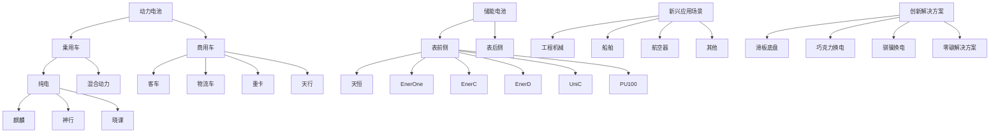

## 2、主要产品及其用途

公司致力于为全球新能源应用提供一流的动力电池和储能电池产品及相关创新解决方案，具体如下：

flowchart

```mermaid
graph TD
  A["动力电池"] --> B["乘用车"]
  A --> C["商用车"]
  B --> D["纯电"]
  B --> E["混合动力"]
  C --> F["客车"]
  C --> G["物流车"]
  C --> H["重卡"]
  D --> I["麒麟"]
  D --> J["神行"]
  D --> K["晓课"]
  C --> L["天行"]
    
  M["储能电池"] --> N["表前侧"]
  M --> O["表后侧"]
  N --> P["天恒"]
  N --> Q["EnerOne"]
  N --> R["EnerC"]
  N --> S["EnerD"]
  N --> T["UniC"]
  N --> U["PU100"]
    
  V["新兴应用场景"] --> W["工程机械"]
  V --> X["船舶"]
  V --> Y["航空器"]
  V --> Z["其他"]
    
  AA["创新解决方案"] --> AB["滑板底盘"]
  AA --> AC["巧克力换电"]
  AA --> AD["骐骥换电"]
  AA --> AE["零碳解决方案"]
```

