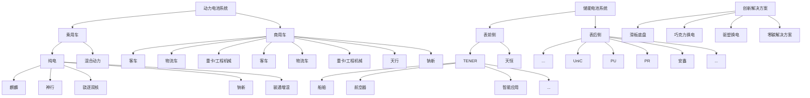

# 第三节 管理层讨论与分析

## 一、报告期内公司从事的主要业务

公司需遵守《深圳证券交易所上市公司自律监管指引第 4 号——创业板行业信息披露》中的“锂离子电池产业链相关业务”的披露要求。

### 1、主要业务

公司是全球领先的零碳新能源科技公司，主要从事动力电池、储能电池的研发、生产、销售，以推动移动式化石能源替代、固定式化石能源替代，并通过电动化和智能化实现市场应用的集成创新。截至报告期末，公司已在全球设立六大研发中心、24家电池工厂，覆盖全球广泛的新能源应用客户群体。

公司在锂电池领域深耕多年，具备了全链条自主、高效的研发能力，在电池材料、电池系统、电池回收等产业链领域拥有核心技术优势及前瞻性研发布局，通过材料及材料体系创新、系统结构创新、绿色极限制造创新及商业模式创新为全球新能源应用提供一流的解决方案和服务。公司将锂电池领域的深厚沉淀延展至钠电池等其他化学体系，形成全面、先进的产品矩阵，可应用于乘用车、商用车、表前储能、表后储能等领域，以及船舶、航空器、数据中心等新兴应用场景，推出复杂应用场景下的创新解决方案，包括助推全面电动化的换电业务、完善产业生态并延伸价值链条的零碳生态建设等，能够全方位满足不同客户的多元化、跨场景的需求，引领全球零碳新经济发展。

### 2、主要产品及其用途

公司致力于为全球新能源应用提供一流的动力电池和储能电池产品及相关创新解决方案，具体如下：

flowchart

#### （1）动力电池系统

公司动力电池产品包括电芯、模组/电箱及电池包。公司可提供磷酸铁锂电池、三元高压中镍电池、三元高镍电池、超混电池、钠离子电池、凝聚态电池等覆盖不同能量密度区间的多种化学体系产品系列，能满足快充、长寿命、长续航、高安全、宽温度适应性等多种功能需求。公司亦可通过在单个电池包里采用双核/多核架构以实现多元化学体系的集成，进而充分发挥各类化学体系的性能优势。公司根据应用领域及客户要求，通过定制或联合研发等方式设计个性化产品方案，以满足客户对产品性能的不同需求。

乘用车应用领域，公司产品可应用于 BEV、REV、PHEV、HEV 等不同细分市场，广泛应用于私家车、运营车等领域；商业应用领域，公司产品可应用于道路客运、城市配送、重载运输、道路清洁等客车及商用车领域。此外，公司产品还可应用于船舶、航空器、电动工具、电动两轮车等领域。

#### （2）储能电池系统

公司提供电芯、电池柜、储能集装箱以及系统集成等储能解决方案。公司的储能电池广泛应用于表前储能和表后储能领域，包括公用事业储能、工商业储能及数据中心储能等。

在表前领域，公司依托智能液冷控温、高成组 CTP、无热扩散等技术，推出了 EnerOne、EnerOnePlus等户外液冷电池柜，针对全气候场景的 EnerC、EnerC Plus、EnerD、EnerX等集装箱式液冷电池柜，以及单体6.25MWh的天恒储能系统、全球首款可量产的 9MWh超大容量储能系统解决方案TENER Stack、其他适应众多应用场景的 TENER 系列解决方案。在表后领域，公司产品已实现从低压、中压到高压平台的全场景覆盖。其中，PR系列、Unic系列及安鑫系列、PU系列分别可满足家庭储能、工商储能、数据中心能源管理需求。

根据相关需求，公司开发了适用于表前、表后市场的多场景、多工况的不同规格电芯，具备超长寿命、零衰减、高安全、宽温度适应性等特性。

#### （3）电池材料、回收及矿产资源

公司电池材料产品主要包括锂盐、前驱体及正极材料等。公司亦通过回收方式，对废旧电池中的镍、钴、锰、锂、磷、铁、铝、铜等金属材料及其他材料进行加工、提纯、合成等工艺，生产锂电池生产所需的正极材料、三元前驱体、磷铁前驱体、锂盐等材料，并将收集后的铜、铝等金属材料通过第三方回收利用，使电池生产所需的关键金属资源实现有效循环利用。

此外，为进一步保障电池生产所需的上游关键资源及材料供应，公司通过自建、参股、合资等多种方式参与锂、镍、钴、磷等电池矿产资源及相关产品的投资、建设及运营。

### 3、经营模式

公司拥有独立的研发、采购、生产和销售体系，主要通过销售动力电池、储能电池和电池材料等产品和解决方案实现盈利。研发方面，公司建立了完备的研发体系，形成以自主研发为主、外部合作为辅的研发模式，通过数字化、智能化的方式，紧密围绕材料及材料体系、系统结构、绿色极限制造及商业模式领域开展创新，以引领行业技术发展。采购方面，公司通过严格的评估和考核程序遴选合格供应商，并通过长期协议、合资合作等方式与全球供应商紧密合作，以保证原材料和设备的技术先进性、产品的可靠性以及成本的竞争力。生产销售方面，公司综合考虑市场情况及客户需求安排生产，公司以自建生产基地为主，并通过合资建厂、技术授权等方式扩充产能，以满足全球客户需求。此外，公司将电动化延伸至低空、船舶、智能应用等更广阔领域，并推进换电网络及零碳生态构建。

### 4、主要的业绩驱动因素

#### （1）行业持续增长

动力电池方面，全球新能源车销量增长带动动力电池需求持续增长。根据 SNE Research 数据，2025年全球新能源车销量 2,147.0万辆，同比增长 21.5%，全球动力电池使用量达 1,187GWh，同比增长 31.7%。储能电池方面，在各国清洁能源转型目标推动下，随着风电光伏装机比例提升、电力系统灵活性要求提高、储能技术进步及系统成本下降、数据中心等新兴领域需求拉动，储能电池市场需求持续快速增长。根据 SNE Research 统计，2025 年全球储能电池出货量 550GWh，同比增长 79%。

#### （2）公司竞争优势进一步提升

公司坚持技术领先、服务优质、运营卓越的经营理念，致力于为全球客户提供一流产品及解决方案。基于强大创新基因、深刻行业洞察、高效经营管理，公司在技术研发、产品创新、品牌及市场推广、极限制造、生态布局、零碳拓展等方面的竞争优势进一步提升，综合竞争力行业领先，实现业务稳健增长，为股东持续创造价值。

## 二、报告期内公司所处行业情况

### 1、行业发展状况及发展趋势

为应对全球气候变化的挑战，推进可持续发展，多个国家提出推动清洁能源转型及构建绿色低碳经济的战略。截至报告期末，根据《联合国气候变化框架公约》（UNFCCC）的国家自主贡献登记处数据，全球共有 195 个国家提交了首批国家自主贡献目标（NDC），以控制全球温升，推动低碳转型、共建气候治理体系。

全球碳排放来自电力、交通、工业等领域，其中电力、交通贡献主要排放量，电力行业碳减排的主要方式为提高风电、光伏等绿色清洁能源发电占比，交通行业碳减排的主要方式为提升出行工具的电动化率且使用绿色、清洁能源。近年来，智能化、电动化趋势下，电力和交通行业迎来能源转型的深刻变革。作为核心蓄能载体，高品质的锂电池凭借高能量密度、长循环寿命、良好稳定性及安全性等性能优势，在下一代以可再生能源为主体的新型能源系统中，不再只是交通工具或储能设备的组成部分，而将成为支撑能源系统缓冲、稳定与调度的关键单元，其相关产业迎来快速、长足发展机遇。

#### （1）动力电池行业

受益于新能源在售车型数量增加、智能化加速、充换电基础设施持续完善等因素，全球新能源车市场需求持续增长。根据 SNE Research数据，2025年全球新能源车销量为 2,147.0万辆，同比增长 21.5%。国内市场，根据中国汽车工业协会数据，2025 年中国新能源车销量为 1,387.5 万辆，其中新能源乘用车销量为 1,300.5 万辆，同比增长 17.7%，渗透率提升至 54.0%；新能源商用车销量为 87.1 万辆，同比增长63.7%，渗透率提升至 26.9%；海外市场，根据欧洲汽车制造商协会数据，2025 年欧洲新能源乘用车销量为 385.8 万辆，同比增长 30.9%，渗透率达 29.1%。新能源车销量增长、单车带电量提升带动动力电池需求持续增长，根据 SNE Research数据，2025年全球动力电池使用量为 1,187GWh，同比增长 31.7%。

#### （2）储能行业

在全球电力需求增长、低碳转型趋势下，全球储能市场需求快速增长。根据IEA，全球电力需求持续增长，其推动力来自于工业、交通及建筑领域日益提升的电气化程度，全球电力消费的增长亦受新兴经济领域驱动，如人工智能（AI）、数据中心以及不断演进的创新场景。同时，全球电力供应结构正向低碳化快速转型，尽管电力需求强劲增长，受益于可再生能源的快速部署以及核电发电量的提升，化石燃料发电受到抑制，电力行业排放增长已明显放缓。

国内市场，根据国家能源局数据，2025 年我国新增并网风电光伏装机容量 438GW，同比增长 22.3%，光伏、风电累计装机容量首次超过煤电装机，标志着以风光为代表的新能源正从补充能源加速向主体能源迈进；受益于政策支持、商业模式改善且储能成本下降，储能需求快速增长，根据中关村储能产业技术联盟统计，2025年我国新型储能新增装机规模达189.5GWh，同比增长73%。海外市场，数据中心能源需求及灵活性资源调节需求增加，峰谷价差拉大提升项目经济性，带动储能需求增长；欧洲及海外其他地区不断出台支持政策，推动储能招标规模增长。根据 SNE Research 统计，2025 年全球储能电池出货量550GWh，同比增长 79%。

#### （3）电池材料及回收行业

随着动力电池、储能电池市场的持续增长，电池材料及回收的需求也相应增长。根据 SMM 统计，2025年我国三元与磷酸铁锂正极材料合计产量达456.5万吨，同比增长51%。随着早期投放市场的锂电池逐渐进入退役期，退役电池的回收需求逐步提升，根据上海钢联数据，2025 年我国锂电池报废量达 81.9万吨，同比增长 9%。

### 2、公司行业地位

公司动力电池和储能电池业务全球领先。根据SNE Research数据，在动力电池领域， 2025年公司动力电池使用量全球市占率为39.2%，较去年同期提升1.2个百分点，公司已连续9年（2017-2025年）动力电池使用量排名全球第一。在储能领域，公司已连续 5 年（2021-2025 年）储能电池出货量排名全球第一。

### 3、主要法律法规及行业政策

2025年以来国内有关的行业主要法律法规及政策如下表所示：

<table><tr><td>时间</td><td>颁布单位</td><td>文件名称及主要内容</td></tr><tr><td>2025年1月</td><td>国家发展改革委、财政部</td><td>文件名称:《关于2025年加力扩围实施大规模设备更新和消费品以旧换新政策的通知》主要内容:推动设备更新升级,扩围支持老旧营运货车报废更新,将补贴范围扩大至国四及以下排放标准营运货车;提高新能源城市公交车及动力电池更新补贴标准;扩大汽车报废更新支持范围,将符合条件的国四排放标准乘用车纳入支持;完善汽车置换更新补贴标准。</td></tr><tr><td>2025年1月</td><td>国家发展改革委、国家能源局</td><td>文件名称:《关于深化新能源上网电价市场化改革促进新能源高质量发展的通知》主要内容:取消“强制配储”政策,即不得将配置储能作为新建新能源项目核准、并网、上网等的前置条件;推动新能源上网电量全面进入电力市场,通过市场交易形成价格;完善适应新能源发展的现货交易机制、中长期交易机制和绿色电力交易政策;推动新能源公平参与市场交易;建立新能源可持续发展价格结算机制,区分存量与增量项目,保持政策衔接并稳定收益预期;完善电力市场体系,更好支撑新能源发展规划目标实现。</td></tr><tr><td>2025年4月</td><td>国家发展改革委、国家能源局</td><td>文件名称:《关于全面加快电力现货市场建设工作的通知》主要内容:围绕构建全国统一大市场要求,建设全国统一电力市场;全面加快电力现货市场建设,力争在2025年底前基本实现电力现货市场全覆盖;全面开展连续结算运行,发挥现货市场发现价格和调节供需的关键作用;正式运行和连续结算试运行地区,建立适应新型经营主体需求的准入要求、注册程序、报价方式、考核结算等机制;要求开展技术系统校验与第三方评估;强化市场监管、风险防范与运行保障。</td></tr><tr><td>2025年6月</td><td>生态环境部、海关总署、国家发展改革委、工业和信息化部、商务部、国家市场监督管理总局</td><td>文件名称:《关于规范锂离子电池用再生黑粉原料、再生钢铁原料进口管理有关事项的公告》主要内容:对锂离子电池用再生黑粉原料实行规范管理,重点包括:(一)明确进口标准,符合要求的再生黑粉原料不属于固体废物,可作为非固体废物自由进口;必须分类包装,不得混装;同一报关单仅限申报同类再生原料;禁止散装运输,不同类别须分区存放。(二)明确商品编码,规定锂离子电池用再生黑粉原料的海关商品编号。(三)强化检验监管,海关依据行业技术规范开展检验,对疑似固体废物委托专业机构开展属性鉴别并依法处理。明确再生钢铁原料的配套管理要求与检验规则。</td></tr><tr><td>2025年9月</td><td>国家发展改革委、国家能源局</td><td>文件名称:《新型储能规模化建设专项行动方案(2025—2027年)》主要内容:提出到2027年全国新型储能装机规模达到1.8亿千瓦以上,带动直接投资约2,500亿元。重点包括:(一)场景应用:电源侧促进新能源电站与配建新型储能联合运行;电网侧推进构网型储能在高比例新能源电网、弱电网和孤岛电网中应用;推进绿电直连、虚拟电厂、智能微电网、源网荷储一体化、车网互动等模式;探索“人工智能+”应用场景。(二)提升利用率:积极开展新型储能与电源协同优化调节。(三)推进创新融合:依托试点促进技术多元化发展。(四)完善市场机制:推动“新能源+储能”一体化参与电能量市场交易;完善容量电价机制和容量补偿机制;推动各类调节资源规范参与市场。</td></tr><tr><td>2025年12月</td><td>工业和信息化部</td><td>文件名称:《关于开展汽车动力电池碳足迹申报工作的通知》主要内容:按照“需求牵引、系统推进、开放合作、持续完善”原则,明确动力电池碳足迹核算规则;建立健全运行管理体系;协同推进标准规范、背景数据、监测计量和评价认证建设;促进规则、标准与数据等的国际互认;推动形成碳足迹核算、数据报送、核查认证的运行体系;助力动力电池产业高质量发展。</td></tr><tr><td>2025年12月</td><td>国家发展改革委、财政部</td><td>文件名称:《关于2026年实施大规模设备更新和消费品以旧换新政策的通知》主要内容:2026年汽车“以旧换新”补贴方案在保持汽车补贴上限不变的基础上,将定额补贴调整为按车价比例进行补贴;明确新能源乘用车、燃油乘用车的补贴比例与对应上限;并提出在整体政策框架下持续实施大规模设备更新和消费品以旧换新政策。</td></tr><tr><td>2025年12月</td><td>国家发展改革委、工业和信息化部、国家能源局</td><td>文件名称:《关于印发国家级零碳园区建设名单(第一批)的通知》主要内容:公布国家级零碳园区建设名单(第一批),并通知各地区发展改革委、工业和信息化主管部门、能源局要会同有关方面加强对建设名单内园区的指导、要积极支持本地区国家级零碳园区建设。各地区发展改革委要会同有关方面加强对国家级零碳园区建设进展的跟踪调度。各地区发展改革委、工业和信息化主管部门、能源局要加强经验总结,发挥国家级零碳园区示范引领作用。</td></tr></table>

2025年以来海外有关的行业主要法律法规及政策如下表所示：

<table><tr><td>时间</td><td>颁布单位</td><td>文件名称及主要内容</td></tr><tr><td>2025年3月</td><td>欧盟委员会</td><td>文件名称:《欧洲汽车行业工业行动计划》(Industrial Action Plan for the European automotive sector)主要内容:为解决欧洲汽车行业面临电动化和智能化竞争力不足,以及部分整车制造商(OEM)面临排放法规趋严、合规成本上升并可能产生高额罚款等挑战。该行动计划提出了一揽子拟实施的政策措施。其中,围绕促进电动化转型的重点举措包括:1.鼓励成员国实施“社会租赁计划(Social Leasing Scheme)”,通过降低使用门槛,提升低收入群体对电动车的可负担性和电动车的渗透率;2.制定“企业车队法规(Corporate Fleet Regulation)”,以促进零排放汽车占企业集中采购的比例达到60%左右;3.与成员国研究欧盟层面(而非由各成员国单独实施)推出统一的电动汽车刺激计划,包括财政补贴等支持措施;4.研究并推动支持清洁公交车的专项行动方案,加快公共交通领域的电动化进程;5.加快充电基础设施建设,重点布局重型商用车辆充电网络;6.通过拨款等方式,提供最高不超过30亿欧元的资金支持,用于推动欧洲本土电池制造能力建设。</td></tr><tr><td>2025年5月</td><td>欧盟委员会</td><td>文件名称:《国家能源与气候计划》(National Energy and Climate Plans)主要内容:系欧盟成员国为实现2030年气候与能源目标而编制并提交的十年期国家规划工具。在可再生能源与电力系统转型方面,成员国普遍在NECPs中强调通过长期合同机制(例如购电协议,PPA)提升项目收益确定性,并结合储能、需求响应等灵活性资源强化系统调节能力。欧盟委员会在对NECPs的评估与政策引导中亦强调,应进一步完善市场设计与监管安排,降低储能、需求响应等主体参与电力市场与系统服务的制度性障碍,以支撑可再生能源的规模化并网与消纳。</td></tr><tr><td>2025年12月</td><td>欧盟委员会</td><td>文件名称:《电网一揽子计划》(European Grids Package)主要内容:加快电网基础设施扩容与现代化改造,以提升电力系统对可再生能源、电气化负荷增长及灵活性资源接入的承载能力。以实现2030年可再生能源占比42.5%以及2030年温室气体净减排55%等既定目标为牵引,推动成员国加快关键基础设施项目落地。同时,通过提出加速许可授予与并网效率提升的政策组合,缓解电网建设与接入环节的周期性瓶颈,支撑2040年前电网全面现代化。</td></tr></table>

## 三、核心竞争力分析

宁德时代的长期核心竞争力，根植于以技术创新和领先产品为基石，持续驱动商业模式的进化和客户市场的拓展，并形成正向反馈循环，以“飞轮效应”推动公司整体价值持续增长，不断加固“全球领先的零碳新能源科技公司”的竞争壁垒。

具体而言，公司核心竞争力体现在以下方面：一是研发为核，产品矩阵持续迭代。依托行业顶尖的研发团队与持续高强度的研发投入，公司构建起覆盖材料、电芯、系统及回收的全链条自主研发能力，是行业唯一入选“全球百强创新机构”的企业，助力宁德市跻身全球创新强度第四名。报告期内，公司拥有及申请的国内外专利总数达 54,538 项，创新成果密集落地。基于此，公司相继推出“二代神行超充”、“骁遥双核”及“钠新电池”等前沿产品，以全面领先的产品力为市场拓展提供坚实支撑。二是市场领跑，全球化根基稳固。公司动力与储能电池市占率已连续多年领跑全球。在乘用车领域，中高端市场主导地位稳固，经济型市场持续突破；在储能领域，系统集成能力不断增强，并与多家全球领先的科技企业建立合作。同时，公司稳步推进海外工厂建设，持续完善全球服务网络，以坚实的全球化布局，巩固长期竞争优势。三是极限制造，铸就品质与效率标杆。公司拥有全球规模最大的现有及在建产能，并以严苛的品控标准与自主研发的超级拉线PSL，持续探索制造效率、质量及安全的一致极限，电芯缺陷率水平较同行实现数量级领先。公司拥有行业最多的“灯塔工厂”及唯一“可持续灯塔工厂”。四是全域增量，拓宽生态护城河。公司将电动化延伸至低空、船舶等更广阔领域，吨级 eVTOL 已完成关键性飞行验证，电动船舶安全运营规模持续扩大。同时，巧克力换电、骐骥换电等创新解决方案快速拓展，协同产业链伙伴共同构筑开放、共赢的产业生态，为全面电动化注入持续动能。五是零碳引领，重构产业价值链条。公司已率先实现核心运营碳中和，并实现废旧电池的大规模综合回收利用。通过携手多地推进零碳示范项目，助力高碳排产业实现新能源转型。公司正以“零碳”理念深度重构产业生态，发掘并释放全产业链的绿色价值。

## 四、主营业务分析

### 1、概述

公司于 2025年 5 月 20 日在香港联交所主板成功挂牌上市，全球发售股份总数为 155,915,300股（行使超额配售权之后），发行价格为263.00港元/股，募集资金总额为410亿港元，并将上述募集资金用于匈牙利项目建设及营运资金、一般企业用途。公司通过本次 H 股上市搭建了海外资本运作平台，有助于进一步融入全球资本市场，加快推进全球化战略布局，提升综合竞争力。

报告期内，公司实现锂离子电池销量 661GWh，同比增长 39.16%；实现归属于上市公司股东的净利润 722 亿元，同比增长 42.28%；经营活动产生的现金流量净额 1,332 亿元，同比增长 37.35%。主要经营情况如下：

#### （1）动力业务

报告期内，公司实现动力电池销量 541GWh，同比增长 41.85%，全球市占率突破历史新高。根据SNE Research统计，2025年公司全球动力电池使用量市占率提升 1.2个百分点至 39.2%，连续 9年市占率位居全球第一。国内方面，根据中国汽车动力电池产业创新联盟统计，2025 年公司国内动力电池装机量市占率 43.42%。海外方面，根据 SNE Research统计，2025年公司海外动力电池使用量市占率实现突破，提升至 30.0%。

前沿技术引领全球，创新产品持续落地。乘用车领域，公司发布了二代神行超充电池、神行Pro电池、骁遥双核电池、钠新乘用车动力电池等新产品。其中，二代神行超充电池是全球首款兼具800公里续航和峰值12C超充速度的磷酸铁锂电池；神行Pro电池搭载了先进的NP3.0技术，针对欧洲市场低温、长途、租赁等多元化的需求可提供百万公里长寿命版本和 12C 超充版本；骁遥双核开创了跨化学体系的全新设计，通过在电池包里组合不同化学体系电芯，实现电池包综合性能全面提升，可满足用户的定制化需求；钠新乘用车动力电池拥有优异的低温能量保持率与安全表现，凭借钠的丰富储量可有效降低对锂资源的依赖。公司推出超混电池，通过材料层级混合创新，超越单一化学体系实现性能全面提升，可满足乘用车细分市场的性价比需求。商用车领域，公司在去年天行系列的基础上进一步发布了适用于重卡领域的钠新启驻一体蓄电池及面向高效物流场景的坤势底盘商用车生态解决方案。同时，公司创新产品规模化量产提速，在公司乘用车、商用车产品解决方案交付中占比持续提升。

高端市场主导地位稳固，细分市场取得突破。公司以性能溢价、优质服务铸就长期口碑，在乘用车中高端市场持续独占鳌头。2025 年福布斯中国智能纯电汽车新豪华度评选榜单中，超 6 成上榜车型搭载公司电池；公司还凭借骁遥增混电池，全面开启增混“大电量”时代，搭载超 40款 REV车型，助力公司在REV 市场占据主导地位。此外，公司亦通过开发周期短、适配成本低的大单品解决方案，助力乘用车客户成功推出多款热销车型。

深化战略客户合作，落地多元场景。公司以有针对性的场景解决方案、各类优势资源的高效整合持续获得商用车客户认可。报告期内，公司与一汽解放、北汽福田、东风商用车等深化战略合作，共同引领商用车电动化进程加速；公司还与多个合作伙伴共同推进无人物流、无人矿山等场景的绿色、低碳转型。

海外业务稳步推进，售后体系持续完善。随着公司海外基地建设、运营的逐渐成熟，及与海外客户战略合作的逐渐深入，报告期内，公司海外市场份额及交付能力稳步提升，并以领先的产品及优质的服务，持续获得VW、BMW、Stellantis、Volvo、DMG等海外客户诸多定点。为支持业务发展，公司持续完善售后服务体系。截至报告期末，公司售后服务网络覆盖 75 个国家或地区、约 1,200 家售后服务站。公司设有全球“宁家服务”直营体验中心 11 家，依托于“宁家服务”品牌，将售后服务延伸至整车端，为用户提供包括维修、电池保养、健康检测、年检及移动救援等在内的一站式的全方位服务。

#### （2）储能业务

报告期内，公司实现储能电池销量 121GWh，同比增长 29.13%，持续构建储能系统解决方案和服务能力。根据 SNE Research 统计，2025年公司储能电池出货量连续 5年位居全球第一。公司在维持领先地位的基础上，秉承“合作共赢”理念，深度整合全球供应链资源，提升储能系统整站优化与工程设计能力，系统集成业务全球共计交付超 70个项目，出货规模同比增长超160%。

持续推出创新产品，引领行业标准。国内市场，公司天恒 6.25MWh 集装箱式液冷电池舱实现批量交付并网，相对上一代系统单位面积能量密度提升 30%，整站占地面积减少 20%，其搭载的 587Ah 大容量储能专用电芯在安全可靠性、能量密度、寿命衰减及系统效率等核心性能指标实现全面升级；海外市场，公司发布全球首款可量产的 9MWh 超大容量储能系统解决方案 TENER Stack，可大幅提升体积利用率及能量密度；公司推出适配高温场景的 TENER H 集装箱系统，采用行业领先的高温电池技术，可降低电站运营过程中的辅源消耗，助力项目收益率提升。

推进生态协同，开放合作实现共赢。公司秉承“开放共赢”的合作理念，与全球系统集成商、投资商、开发商、电网公司及 EPC 总包商、核心供应链企业等客户及伙伴推进生态共建及合作共赢，并探索通过投资方式开展储能电站建设。报告期内，公司与海博思创、中车株洲所、思源电气等合作伙伴达成长期战略合作；进一步实现海外系统集成 GWh 级的项目交付，并在海外多个主流市场斩获系统集成订单，技术实力与项目经验获得海外客户广泛认可。

持续构建系统解决方案和服务能力。公司通过研发合作、投资布局及专业人才引进等方式，以提升储能系统解决方案能力；在海外重点市场增设多家子公司、代表处或服务网点，实时掌握市场动态，并为客户现场提供从方案探讨、产品交付到售后运维的全方位服务。同时，公司建设的容量规模全球领先的厦门电化学储能实证平台，具备极端条件、复杂条件下储能系统安全性和可靠性一站式实证检测的能力，可有效节省现场并网调试的试验时间。

#### （3）新兴领域

除上述业务外，公司将电动化延伸至低空、船舶、数据中心等更广阔领域，快速拓展换电网络及服务，推进零碳生态建设，完善产业生态并延伸价值链条。

## 换电产业生态初具势能

为提升补能效率，优化用户体验，公司携手产业各方加速构建巧克力换电生态。截至报告期末，公司巧克力换电建站超 1,000 座，分布于全国 45 座城市，涵盖长三角、京津冀、川渝、大湾区四大核心经济带，并已率先在重庆实现盈利；公司已与广汽、长安、一汽、上汽、奇瑞等多家车企达成换电战略合作，上述车企已发布 20 款以上换电车型，包括埃安 UT super 等多款轿车及 SUV，覆盖营运出行、家庭出行、行政商务、年轻化代步等多元场景；报告期内，公司与中石化、国网、南网、滴滴、京东、神州租车、招银金租等生态伙伴达成战略合作，在换电网络建设、运营车辆应用、电池租赁方案优化等领域合作，形成资源共享、优势互补的生态协同效应。

在商用车领域，公司骐骥换电业务截至报告期末建站超 300 座，分布于全国 26 个省份，实现多条国家高速公路关键节点覆盖，为核心物流线路的电动化转型提供了基础支撑。报告期内，骐骥换电与整车企业的战略合作持续深化，与一汽解放、陕重汽等10余家企业，共同推出30余款标准化换电车型，涵盖牵引车、载货车等多品系车辆，为实现重卡全场景电动化提供产品保障。公司还与重庆高速、赣粤高速、河南交投等全国 30多家高速及交投公司建立战略合作，共同布局重卡换电网络新基建。

报告期内，巧克力换电及骐骥换电为用户提供的换电服务合计超 115万次，累计换电量约 8,000 万度。

## 推进零碳生态建设

公司凭借产品和业务的优势，结合自身降碳实践，致力于打造绿电直供、零碳园区、源网荷储、构网型储能等全景式、一体化的零碳解决方案。

截至报告期末，公司已与海南省、山东东营、福建厦门、江苏盐城、福建宁德等政府签订了合作协议，推进零碳项目示范建设。福建宁德福鼎工业园区、四川宜宾临港经济开发区东部产业园、山东东营垦利经济开发区、海南海口国家高新技术产业开发区等项目被列入国家级零碳园区建设名单。福建省宁德市宁德时代虚拟电厂项目被列入国家能源局新型电力系统建设能力提升试点名单，该项目将利用先进的大数据、云平台、物联网等技术，搭建面向集团管理和各区域虚拟电厂运营的应用场景。

此外，公司亦携手中石化、海螺集团、辽宁方大集团、中天钢铁等企业，联合推进源网荷储一体化、零碳工厂解决方案落地，拓展零碳场景布局，探索高碳排行业零碳发展路径。

## 迈入“全域增量”时代

报告期内，公司旗下成员企业峰飞航空成功开发了全球首架获颁适航三证的吨级以上 eVTOL 航空器凯瑞鸥，成功推出了全球首个零碳水上起降平台，已具备将低空基础设施拓展到江河湖海的能力。公司为峰飞航空开发的载物版动力电池通过中国民航局制造符合性审查，同时公司亦取得 AS9100D 航空质量体系认证。

船舶领域，公司发布全球首个可实现船舶兆瓦级充电、分钟级换电补能及云端多源数据高精度融合的 “船-岸-云”零碳航运一体化解决方案，持续推进港航物贸、金融产投、船舶修造、科研院所等行业上下游伙伴的战略合作，截至报告期末，公司配套电动船舶累计安全运营近900艘，助力全球水上交通低碳转型。

此外，公司亦推出 E30P 两轮圆柱锂电池、雪豹电池系列等产品，具备高性能、长寿命与强动力等特性，满足电动摩托车、电动两轮、电动工具、数据中心等领域客户需求。

#### （4）供应链及产能

公司致力于打造高效敏捷、技术创新、持续降本、绿色低碳的韧性供应链。公司推动技术、采购及质量体系紧密配合，通过搭建快速导入机制、签订长期协议、合资合作等方式保障供应稳定，通过强化大宗金属管理、推进低成本替代方案落地、助力供应商工艺优化升级等方式实现降低成本。此外，为进一步保障电池生产所需的上游关键资源及材料供应，公司亦积极推动自有及合作矿产资源项目的投资、建设及运营。

为满足市场及客户需求，报告期内，公司加大境内外锂电池生产基地建设投入，持续提升交付能力。公司稳步推进中州基地、济宁基地、福鼎基地、溧阳基地、宜宾基地、匈牙利工厂及印尼电池产业链等项目的建设。报告期内公司锂电池产能 772GWh，期末在建产能 321GWh。

#### （5）可持续发展

公司高度重视可持续发展及履行社会责任。报告期内，ESG 评级持续提升，管理成效获得广泛国际认可，MSCI ESG评级维持 AA级，EcoVadis荣获可持续发展银牌认证。公司首次入选标普《可持续发展年鉴（全球版）》及富时罗素 FTSE4GOOD 新兴市场指数。同时，公司有序推进“零碳战略”，以零碳电力和工厂能效优化等零碳科技为抓手，实现核心运营碳中和，郑重兑现气候承诺，并持续深化价值链绿色低碳，推动实现价值链碳中和目标。公司领衔发起全球能源循环计划（GECC），开展针对电池循环经济的系统性研究、构建全球生态网络、分享电池循环前沿实践，打造电池循环经济标杆城市。报告期内，公司废旧电池及材料综合回收量达到 21.0万吨，同比增长 63.2%，再生锂盐2.4万吨，同比增长40.4%。

### 2、收入与成本

#### （1）营业收入构成

##### 1）营业收入整体情况

单位：千元

<table><tr><td rowspan="2">项目</td><td colspan="2">2025 年</td><td colspan="2">2024 年</td><td rowspan="2">同比增减</td></tr><tr><td>金额</td><td>占营业收入比重</td><td>金额</td><td>占营业收入比重</td></tr><tr><td>营业收入合计</td><td>423,701,834</td><td>100.00%</td><td>362,012,554</td><td>100.00%</td><td>17.04%</td></tr><tr><td colspan="6">分行业</td></tr><tr><td>电气机械及器材制造业</td><td>417,723,738</td><td>98.59%</td><td>356,519,551</td><td>98.48%</td><td>17.17%</td></tr><tr><td>采选冶炼行业</td><td>5,978,096</td><td>1.41%</td><td>5,493,003</td><td>1.52%</td><td>8.83%</td></tr><tr><td colspan="6">分产品</td></tr><tr><td>动力电池系统</td><td>316,506,369</td><td>74.70%</td><td>253,041,337</td><td>69.90%</td><td>25.08%</td></tr><tr><td>储能电池系统</td><td>62,439,820</td><td>14.74%</td><td>57,290,460</td><td>15.83%</td><td>8.99%</td></tr><tr><td>电池材料及回收</td><td>21,860,936</td><td>5.16%</td><td>28,699,935</td><td>7.93%</td><td>-23.83%</td></tr><tr><td>电池矿产资源</td><td>5,978,096</td><td>1.41%</td><td>5,493,003</td><td>1.52%</td><td>8.83%</td></tr><tr><td>其他业务</td><td>16,916,612</td><td>3.99%</td><td>17,487,818</td><td>4.83%</td><td>-3.27%</td></tr><tr><td colspan="6">分地区</td></tr><tr><td>境内</td><td>294,060,576</td><td>69.40%</td><td>251,677,045</td><td>69.52%</td><td>16.84%</td></tr><tr><td>境外</td><td>129,641,258</td><td>30.60%</td><td>110,335,509</td><td>30.48%</td><td>17.50%</td></tr></table>

公司需遵守《深圳证券交易所上市公司自律监管指引第 4号——创业板行业信息披露》中的“锂离子电池产业链相关业务”的披露要求

##### 2）报告期内上市公司从事锂离子电池产业链相关业务的海外销售收入占同期营业收入 30%以上

适用 □不适用

报告期内，公司销售境外的主要产品为电池系统，较上年同期相比未发生明显变化。公司境外收入 129,641,258千元，占本期营业收入 30.60%。公司主要业务地区的经营环境未发生重大变化，境外客户回款情况正常。

#### （2）占公司营业收入或营业利润 10%以上的行业、产品、地区、销售模式的情况

适用 □不适用

公司需遵守《深圳证券交易所上市公司自律监管指引第 4号——创业板行业信息披露》中的“锂离子电池产业链相关业务”的披露要求

##### 1）营业收入及营业成本整体情况

单位：千元

<table><tr><td>项目</td><td>营业收入</td><td>营业成本</td><td>毛利率</td><td>营业收入比上年同期增减</td><td>营业成本比上年同期增减</td><td>毛利率比上年同期增减</td></tr><tr><td colspan="7">分业务</td></tr><tr><td>电气机械及器材制造业</td><td>417,723,738</td><td>307,077,698</td><td>26.49%</td><td>17.17%</td><td>14.37%</td><td>1.80%</td></tr><tr><td>采选冶炼行业</td><td>5,978,096</td><td>5,305,599</td><td>11.25%</td><td>8.83%</td><td>5.59%</td><td>2.72%</td></tr><tr><td colspan="7">分产品</td></tr><tr><td>动力电池系统</td><td>316,506,369</td><td>241,064,397</td><td>23.84%</td><td>25.08%</td><td>25.25%</td><td>-0.10%</td></tr><tr><td>储能电池系统</td><td>62,439,820</td><td>45,763,689</td><td>26.71%</td><td>8.99%</td><td>9.18%</td><td>-0.13%</td></tr><tr><td>电池材料及回收</td><td>21,860,936</td><td>15,899,813</td><td>27.27%</td><td>-23.83%</td><td>-38.09%</td><td>16.76%</td></tr><tr><td>电池矿产资源</td><td>5,978,096</td><td>5,305,599</td><td>11.25%</td><td>8.83%</td><td>5.59%</td><td>2.72%</td></tr><tr><td colspan="7">分地区</td></tr><tr><td>境内</td><td>294,060,576</td><td>223,497,885</td><td>24.00%</td><td>16.84%</td><td>14.22%</td><td>1.75%</td></tr><tr><td>境外</td><td>129,641,258</td><td>88,885,412</td><td>31.44%</td><td>17.50%</td><td>14.19%</td><td>1.99%</td></tr></table>

##### 2）公司主营业务数据统计口径在报告期发生调整的情况下，公司最近 1年按报告期末口径调整后的主营业务数据

□适用 不适用

##### 3）锂离子电池产业链各环节主要产品或业务相关的关键技术或性能指标

适用 □不适用

<table><tr><td rowspan="2">产品种类</td><td rowspan="2">技术路线</td><td rowspan="2">主要产品类型</td><td colspan="4">技术参数情况</td><td rowspan="2">下游主要应用领域</td></tr><tr><td>电芯质量能量密度</td><td>倍率性能</td><td>循环寿命</td><td>安全性</td></tr><tr><td rowspan="3">三元锂离子电池</td><td rowspan="3">正极材料为镍钴锰的锂离子电池</td><td rowspan="2">方形</td><td>220~310Wh/kg</td><td>1~5C</td><td>2,000~6,000次</td><td rowspan="2">满足GB38031、UN38.3、ECE R100.3等标准</td><td rowspan="2">乘用车、商用车</td></tr><tr><td>HEV: 100~150Wh/kg</td><td>HEV: 1C~50C</td><td>HEV: 60,000次</td></tr><tr><td>软包、圆柱</td><td>180-350Wh/kg</td><td>1C~17C</td><td>200-4,000次</td><td>消费无人机: 满足IEC621332012/2017等标准;电动工具:(软包)满足IEC621332012/2017、UL1642、IEC62133、UN38.3等标准;电动摩托车: 满足GB/T36672等标准</td><td>消费无人机、电动工具、电动摩托车等</td></tr><tr><td rowspan="2">磷酸铁锂电池</td><td rowspan="2">正极材料为磷酸铁锂的锂离子电池</td><td>方形、圆柱</td><td>180~200Wh/kg</td><td>0.25C~5C</td><td>4,000-15,000次</td><td>乘用车、商用车: 满足GB38031、GB38032、UN38.3、ECE R100.3等标准储能系统: 满足GB/T36276、UN38.3,UL9540A、UL1973、IEC62619等标准电动船舶: 满足《船舶应用电池动力规范》、UN38.3等标准电动自行车: 满足GB/T36972、UN38.3等标准</td><td>乘用车、商用车、储能系统、电动船舶、电动自行车等</td></tr><tr><td>软包</td><td>140-190Wh/kg</td><td>0.5C~6C</td><td>2,000-15,000次</td><td>家庭储能: 满足GB31241等标准;工商业储能: 满足GB31241等标准;数据中心: 满足GB31241等标准;电动自行车: 满足GB/T36972等标准</td><td>家庭储能、工商业储能、数据中心等</td></tr><tr><td>其他</td><td>正极材料为磷酸铁锂混镍钴锰的锂离子电池</td><td>方形</td><td>210-220Wh/kg</td><td>2C~4C</td><td>2,000~4,000次</td><td>乘用车: 满足GB38031、UN38.3等标准</td><td>乘用车</td></tr></table>

##### 4）占公司最近一个会计年度销售收入 30%以上产品的销售均价较期初变动幅度超过 30%的

□适用 不适用

##### 5）不同产品或业务的产销情况

<table><tr><td>项目</td><td>产能</td><td>在建产能</td><td>产能利用率</td><td>产量</td></tr><tr><td>电池系统(GWh)</td><td>772</td><td>321</td><td>96.9%</td><td>748</td></tr></table>

#### （3）公司实物销售收入是否大于劳务收入

是 □否

<table><tr><td>行业分类</td><td>项目</td><td>单位</td><td>2025年</td><td>2024年</td><td>同比增减</td></tr><tr><td>电池系统</td><td>销售量</td><td>GWh</td><td>661</td><td>475</td><td>39.16%</td></tr><tr><td rowspan="2"></td><td>生产量</td><td>GWh</td><td>748</td><td>516</td><td>44.96%</td></tr><tr><td>库存量</td><td>GWh</td><td>186</td><td>106</td><td>75.47%</td></tr></table>

相关数据同比发生变动 30%以上的原因说明

适用 □不适用

国内外新能源行业持续增长，公司新技术、新产品陆续落地，海外市场拓展加速，客户合作关系进一步深化，公司产品产销两旺。

#### （4）公司已签订的重大销售合同、重大采购合同截至本报告期的履行情况

适用 □不适用

已签订的重大销售合同截至本报告期的履行情况

适用 □不适用

单位：千元

<table><tr><td>合同标的</td><td>对方当事人</td><td>合同总金额</td><td>本报告期履行金额</td><td>待履行金额</td><td>本期确认的销售收入金额</td><td>应收账款回款情况</td><td>是否正常履行</td><td>影响重大合同履行的各项条件是否发生重大变化</td><td>是否存在合同无法履行的重大风险</td><td>合同未正常履行的说明</td></tr><tr><td>锂电池供应</td><td>客户A(1)</td><td>-</td><td>58,159,202</td><td>-</td><td>58,159,202</td><td>正常回款</td><td>是</td><td>否</td><td>否</td><td>不适用</td></tr></table>

注：

(1) 基于双方保密协议约定，不便披露客户具体名称；  
(2) 该重大销售合同未明确约定合同总金额，最终销售金额以客户后续发出的订单方式确定。

已签订的重大采购合同截至本报告期的履行情况

□适用 不适用

#### （5）营业成本构成

行业分类

单位：千元

<table><tr><td rowspan="2">行业分类</td><td rowspan="2">项目</td><td colspan="2">2025年</td><td colspan="2">2024年</td><td rowspan="2">同比增减</td></tr><tr><td>金额</td><td>占营业成本比重</td><td>金额</td><td>占营业成本比重</td></tr><tr><td>电池行业</td><td>直接材料</td><td>221,152,510</td><td>71.79%</td><td>202,723,479</td><td>76.48%</td><td>-4.68%</td></tr></table>

注：以上数据口径为主营业务。

#### （6）报告期内合并范围是否发生变动

是 □否

详见本报告“第八节 财务报告”之“九、合并范围的变更”。

#### （7）公司报告期内业务、产品或服务发生重大变化或调整有关情况

□适用 不适用

#### （8）主要销售客户和主要供应商情况

公司主要销售客户情况

<table><tr><td>前五名客户合计销售金额(千元)</td><td>165,061,533</td></tr><tr><td>前五名客户合计销售金额占年度销售总额比例</td><td>38.96%</td></tr><tr><td>前五名客户销售额中关联方销售额占年度销售总额比例</td><td>0.00%</td></tr></table>

公司前 5大客户资料

<table><tr><td>序号</td><td>客户名称</td><td>销售额(千元)</td><td>占年度销售总额比例</td></tr><tr><td>1</td><td>第一名</td><td>58,159,202</td><td>13.73%</td></tr><tr><td>2</td><td>第二名</td><td>47,127,609</td><td>11.12%</td></tr><tr><td>3</td><td>第三名</td><td>30,201,701</td><td>7.13%</td></tr><tr><td>4</td><td>第四名</td><td>15,419,319</td><td>3.64%</td></tr><tr><td>5</td><td>第五名</td><td>14,153,702</td><td>3.34%</td></tr><tr><td>合计</td><td>--</td><td>165,061,533</td><td>38.96%</td></tr></table>

主要客户其他情况说明

□适用 不适用

公司主要供应商情况

<table><tr><td>前五名供应商合计采购金额(千元)</td><td>59,938,203</td></tr><tr><td>前五名供应商合计采购金额占年度采购总额比例</td><td>10.38%</td></tr><tr><td>前五名供应商采购额中关联方采购额占年度采购总额比例</td><td>0.00%</td></tr></table>

公司前 5名供应商资料

<table><tr><td>序号</td><td>供应商名称</td><td>采购额(千元)</td><td>占年度采购总额比例</td></tr><tr><td>1</td><td>第一名</td><td>23,318,360</td><td>4.04%</td></tr><tr><td>2</td><td>第二名</td><td>11,601,437</td><td>2.01%</td></tr><tr><td>3</td><td>第三名</td><td>9,241,133</td><td>1.60%</td></tr><tr><td>4</td><td>第四名</td><td>8,258,913</td><td>1.43%</td></tr><tr><td>5</td><td>第五名</td><td>7,518,360</td><td>1.30%</td></tr><tr><td>合计</td><td>--</td><td>59,938,203</td><td>10.38%</td></tr></table>

主要供应商其他情况说明

□适用 不适用

报告期内公司贸易业务收入占营业收入比例超过 10%

□适用 不适用

### 3、费用

单位：千元

<table><tr><td>项目</td><td>2025 年</td><td>2024 年</td><td>同比增减</td><td>重大变动说明</td></tr><tr><td>销售费用</td><td>3,735,118</td><td>3,562,797</td><td>4.84%</td><td></td></tr><tr><td>管理费用</td><td>11,666,741</td><td>9,689,839</td><td>20.40%</td><td></td></tr><tr><td>财务费用</td><td>-7,939,863</td><td>-4,131,918</td><td>92.16%</td><td>利息支出减少、利息收入增加及持有的外币货币性项目因外币汇率变动所产生的汇兑收益增加</td></tr><tr><td>研发费用</td><td>22,146,581</td><td>18,606,756</td><td>19.02%</td><td></td></tr></table>

### 4、研发投入

适用 □不适用

（1）主要研发项目

<table><tr><td>主要研发项目名称</td><td>项目目的</td><td>项目进展</td><td>拟达到的目标</td><td>预计对公司未来发展的影响</td></tr><tr><td>骁遥双核电池</td><td>确保动力输出的连续性与安全性,灵活设计适应不同场景</td><td>产品已发布,与客户推进落地中</td><td>突破单一化学体系边界,实现解决方案性能全面提升</td><td>助力新能源车实现安全冗余和多场景的应用突破</td></tr><tr><td>钠新电池</td><td>突破常规锂电体系,推动电化学体系多元化,适用更丰富应用场景</td><td>产品已发布,与客户推进落地中</td><td>通过钠电池实现应用场景广域化、加速全面电动化</td><td>为客户提供不同场景差异化产品,提升公司竞争力</td></tr><tr><td>超混电池</td><td>超越常规体系,实现更高比能、更长寿命及更加安全</td><td>产品已发布,与客户推进落地中</td><td>为新能源乘用车、商用车细分市场打造更具竞争力产品</td><td>为客户提供差异化产品,提升公司竞争力</td></tr><tr><td>凝聚态电池</td><td>超越常规体系,实现高安全、高比能、高功率</td><td>产品已发布,与客户推进落地中</td><td>为高端新能源车、航空器等提供先进解决方案</td><td>助力拓展低空、航空等新兴应用场景,提升公司竞争力</td></tr><tr><td>神行电池</td><td>进一步提升能量密度、快充性能、循环寿命等性能</td><td>神行二代、神行Pro产品已发布,与客户推进落地中</td><td>助力新能源车实现长续航、长寿命、快补能、高残值</td><td>作为行业快充技术标杆,持续延展产品能力,提升公司竞争力</td></tr><tr><td>天行电池</td><td>进一步提升能量密度、快充性能、温度适应性、循环寿命等性能</td><td>天行II轻商产品已发布,与客户推进落地中</td><td>拓宽场景适配性和用户使用经济性</td><td>为客户提供差异化产品,提升公司竞争力</td></tr><tr><td>大容量储能电芯</td><td>定义行业下一代大容量电芯标准,全面提升各项性能</td><td>产品已发布,与客户推进落地中</td><td>助力进一步降低储能系统成本,适配更丰富应用场景</td><td>引领下一代储能电池技术方向,提高储能产品竞争力</td></tr><tr><td>储能系统:TENER Stack</td><td>开发“Two in One”模块化突破运输限制,助力整站高集成和快速安装</td><td>产品已发布,与客户推进落地中</td><td>助力储能系统实现高效率、性价比</td><td>提升海外储能产品竞争力,助力市场开拓</td></tr><tr><td>自生成负极</td><td>超越常规体系,打造高比能产品</td><td>产品已发布,与客户推进落地中</td><td>通过自生成负极助力能量密度实现跃升</td><td>为客户提供差异化产品,提升公司竞争力</td></tr><tr><td>智能电芯设计平台</td><td>通过AI+数据驱动实现电池研发范式变革</td><td>推动广泛应用,助力提质增效</td><td>实现研发范式革命、成本效率双升</td><td>重塑电池设计的底层逻辑,保障公司高效研发的领先性</td></tr></table>

（2）公司研发人员情况

<table><tr><td>项目</td><td>2025 年</td><td>2024 年</td><td>变动比例</td></tr><tr><td>研发人员数量(人)</td><td>22,901</td><td>20,346</td><td>12.56%</td></tr><tr><td>研发人员数量占比</td><td>12.32%</td><td>15.42%</td><td>-3.1%</td></tr><tr><td colspan="4">研发人员学历</td></tr><tr><td>本科</td><td>9,418</td><td>8,247</td><td>14.20%</td></tr><tr><td>硕士</td><td>5,242</td><td>5,083</td><td>3.13%</td></tr><tr><td>博士</td><td>745</td><td>573</td><td>30.02%</td></tr><tr><td colspan="4">研发人员年龄构成</td></tr><tr><td>30岁以下</td><td>11,837</td><td>10,408</td><td>13.73%</td></tr><tr><td>30~40岁</td><td>9,740</td><td>8,830</td><td>10.31%</td></tr><tr><td>40岁以上</td><td>1,324</td><td>1,108</td><td>19.49%</td></tr></table>

#### （3）近三年公司研发投入金额及占营业收入的比例

<table><tr><td>项目</td><td>2025年</td><td>2024年</td><td>2023年</td></tr><tr><td>研发投入金额(千元)</td><td>22,146,581</td><td>18,606,756</td><td>18,356,108</td></tr><tr><td>研发投入占营业收入比例</td><td>5.23%</td><td>5.14%</td><td>4.58%</td></tr></table>

□适用 不适用

研发投入总额占营业收入的比重较上年发生显著变化的原因

□适用 不适用

研发投入资本化率大幅变动的原因及其合理性说明

□适用 不适用

### 5、现金流

单位：千元

<table><tr><td>项目</td><td>2025 年</td><td>2024 年</td><td>同比增减</td></tr><tr><td>经营活动现金流入小计</td><td>511,868,353</td><td>444,879,417</td><td>15.06%</td></tr><tr><td>经营活动现金流出小计</td><td>378,648,372</td><td>347,889,072</td><td>8.84%</td></tr><tr><td>经营活动产生的现金流量净额</td><td>133,219,982</td><td>96,990,345</td><td>37.35%</td></tr><tr><td>投资活动现金流入小计</td><td>8,303,785</td><td>4,906,012</td><td>69.26%</td></tr><tr><td>投资活动现金流出小计</td><td>102,779,575</td><td>53,781,323</td><td>91.11%</td></tr><tr><td>投资活动产生的现金流量净额</td><td>-94,475,790</td><td>-48,875,311</td><td>-93.30%</td></tr><tr><td>筹资活动现金流入小计</td><td>85,607,537</td><td>33,392,735</td><td>156.37%</td></tr><tr><td>筹资活动现金流出小计</td><td>91,917,080</td><td>47,916,971</td><td>91.83%</td></tr><tr><td>筹资活动产生的现金流量净额</td><td>-6,309,543</td><td>-14,524,236</td><td>56.56%</td></tr><tr><td>现金及现金等价物净增加额</td><td>29,770,008</td><td>31,994,247</td><td>-6.95%</td></tr></table>

相关数据同比发生重大变动的主要影响因素说明

适用 □不适用

2025 年，公司经营活动产生的现金流量净额较上年增加 362亿元，上升 37.35%，主要是销售规模增长，销售回款增加；

2025 年，公司投资活动产生的现金流量净额较上年减少 456 亿元，下降 93.30%，主要是购买理财产品额增加；

2025 年，公司筹资活动产生的现金流量净额较上年增加 82 亿元，上升 56.56%，主要是 H股 IPO收到募集资金。

报告期内公司经营活动产生的现金净流量与本年度净利润存在重大差异的原因说明

□适用 不适用

## 五、非主营业务情况

适用 □不适用

单位：千元

<table><tr><td></td><td>金额</td><td>占利润总额比例</td><td>形成原因说明</td><td>是否具有可持续性</td></tr><tr><td>投资收益</td><td>7,970,552</td><td>8.90%</td><td>主要为按持股比例应享有的参股公司净利润</td><td>权益法核算的长期股权投资收益具有可持续性</td></tr><tr><td>公允价值变动损益</td><td>974,079</td><td>1.09%</td><td>理财产品及其他非流动金融资产估值变动</td><td>否</td></tr><tr><td>资产减值</td><td>-8,660,164</td><td>-9.67%</td><td>固定资产、无形资产可回收金额低于账面价值计算的减值准备;存货成本高于其可变现净值计算的存货跌价准备</td><td>否</td></tr><tr><td>信用减值</td><td>-418,585</td><td>-0.47%</td><td>按照预计损失率计提减值损失</td><td>否</td></tr><tr><td>营业外收入</td><td>463,520</td><td>0.52%</td><td></td><td>否</td></tr><tr><td>营业外支出</td><td>455,611</td><td>0.51%</td><td></td><td>否</td></tr><tr><td>其他收益</td><td>10,600,477</td><td>11.84%</td><td></td><td>否</td></tr></table>

## 六、资产及负债状况分析

### 1、资产构成重大变动情况

单位：千元

<table><tr><td rowspan="2">项目</td><td colspan="2">2025年末</td><td colspan="2">2025年初</td><td rowspan="2">比重增减</td><td rowspan="2">重大变动说明</td></tr><tr><td>金额</td><td>占总资产比例</td><td>金额</td><td>占总资产比例</td></tr><tr><td>货币资金</td><td>333,512,927</td><td>34.21%</td><td>303,511,993</td><td>38.58%</td><td>-4.37%</td><td>其他资产占比上升</td></tr><tr><td>交易性金融资产</td><td>58,993,528</td><td>6.05%</td><td>14,282,253</td><td>1.82%</td><td>4.23%</td><td>加强资金管理,新增购买理财产品</td></tr><tr><td>应收账款</td><td>76,403,264</td><td>7.84%</td><td>64,135,510</td><td>8.15%</td><td>-0.31%</td><td>无重大变化</td></tr><tr><td>合同资产</td><td>375,468</td><td>0.04%</td><td>400,626</td><td>0.05%</td><td>-0.01%</td><td>无重大变化</td></tr><tr><td>存货</td><td>94,526,239</td><td>9.70%</td><td>59,835,533</td><td>7.61%</td><td>2.09%</td><td>业务规模扩大,存货相应增加</td></tr><tr><td>长期股权投资</td><td>64,884,321</td><td>6.66%</td><td>54,791,525</td><td>6.97%</td><td>-0.31%</td><td>无重大变化</td></tr><tr><td>固定资产</td><td>146,400,592</td><td>15.02%</td><td>112,589,053</td><td>14.31%</td><td>0.71%</td><td>无重大变化</td></tr><tr><td>在建工程</td><td>29,733,108</td><td>3.05%</td><td>29,754,703</td><td>3.78%</td><td>-0.73%</td><td>无重大变化</td></tr><tr><td>使用权资产</td><td>3,268,966</td><td>0.34%</td><td>889,995</td><td>0.11%</td><td>0.23%</td><td>无重大变化</td></tr><tr><td>短期借款</td><td>12,935,498</td><td>1.33%</td><td>19,696,282</td><td>2.50%</td><td>-1.17%</td><td>无重大变化</td></tr><tr><td>合同负债</td><td>49,233,377</td><td>5.05%</td><td>27,834,446</td><td>3.54%</td><td>1.51%</td><td>无重大变化</td></tr><tr><td>长期借款</td><td>78,234,935</td><td>8.03%</td><td>81,238,456</td><td>10.33%</td><td>-2.30%</td><td>本期偿还借款</td></tr><tr><td>租赁负债</td><td>2,805,081</td><td>0.29%</td><td>662,814</td><td>0.08%</td><td>0.21%</td><td>无重大变化</td></tr></table>

境外资产占比较高  
□适用 不适用

### 2、以公允价值计量的资产和负债

适用 □不适用

单位：千元

<table><tr><td>项目</td><td>期初数</td><td>本期公允价值变动损益</td><td>计入权益的累计公允价值变动</td><td>本期计提的减值</td><td>本期购买金额</td><td>本期出售金额</td><td>其他变动</td><td>期末数</td></tr><tr><td colspan="9">金融资产</td></tr><tr><td>1.交易性金融资产(不含衍生金融资产)</td><td>14,282,253</td><td>441,408</td><td></td><td></td><td>44,269,867</td><td></td><td></td><td>58,993,528</td></tr><tr><td>2.衍生金融资产</td><td>-2,116,017</td><td></td><td>1,133,502</td><td></td><td>291,673,084</td><td>213,886,303</td><td></td><td>1,133,502</td></tr><tr><td>3.其他权益工具投资</td><td>11,900,901</td><td></td><td>6,444,364</td><td></td><td>1,153,593</td><td>2,744,902</td><td>-255,330</td><td>16,296,853</td></tr><tr><td>4.其他非流动金融资产</td><td>3,135,658</td><td>535,385</td><td></td><td></td><td>100,000</td><td></td><td>-888,779</td><td>2,882,264</td></tr><tr><td>5.应收款项融资</td><td>53,309,701</td><td></td><td>-100,346</td><td></td><td></td><td>10,122,136</td><td></td><td>43,205,292</td></tr><tr><td>金融资产小计合计</td><td>80,512,496</td><td>976,793</td><td>7,477,520</td><td></td><td>337,196,543</td><td>226,753,341</td><td>-1,144,109</td><td>122,511,440</td></tr><tr><td>金融负债</td><td></td><td>-2,715</td><td>393,224</td><td></td><td>41,313,504</td><td>26,548,835</td><td></td><td>393,224</td></tr></table>

其他变动的内容

其他权益工具投资的其他变动，系对部分被投资企业追加投资并具有重大影响转入长期股权投资。其他非流动金融资产的其他变动系收到分红。

报告期内公司主要资产计量属性是否发生重大变化

□是 否

### 3、截至报告期末的资产权利受限情况

详见本报告“第八节 财务报告”之“七、合并财务报表项目注释”之“25、所有权或使用权受到限制的资产”

## 七、投资状况分析

### 1、总体情况

适用 □不适用

<table><tr><td>报告期投资额(千元)</td><td>上年同期投资额(千元)</td><td>变动幅度</td></tr><tr><td>49,031,517</td><td>34,726,381</td><td>41.19%</td></tr></table>

### 2、报告期内获取的重大的股权投资情况

□适用 不适用

### 3、报告期内正在进行的重大的非股权投资情况

适用 □不适用

单位：千元

<table><tr><td>项目名称</td><td>投资方式</td><td>是否为固定资产投资</td><td>投资项目涉及行业</td><td>本报告期投入金额</td><td>截至报告期末累计实际投入金额</td><td>资金来源</td><td>项目进度</td><td>预计收益</td><td>截止报告期末累计实现的收益</td><td>未达到计划进度和预计收益的原因</td><td>披露日期</td><td>披露索引</td></tr><tr><td>宜昌邦普一体化电池材料产业园项目</td><td>自建</td><td>是</td><td>锂离子电池正极材料制造业</td><td>2,262,305</td><td>16,528,380</td><td>自有及自筹资金</td><td>建设中</td><td>不适用</td><td>不适用</td><td>尚在建设中</td><td>2021年10月12日</td><td>巨潮资讯网,公告编号:2021-100</td></tr><tr><td>印度尼西亚动力电池产业链项目</td><td>自建</td><td>是</td><td>电器机械及器材制造业</td><td>1,483,482</td><td>5,369,789</td><td>自有及自筹资金</td><td>建设中</td><td>不适用</td><td>不适用</td><td>尚在建设中</td><td>2022年4月15日</td><td>巨潮资讯网,公告编号:2022-012</td></tr><tr><td>山东时代新能源电池产业基地项目</td><td>自建</td><td>是</td><td>电器机械及器材制造业</td><td>6,801,291</td><td>8,799,218</td><td>自有及自筹资金</td><td>建设中</td><td>不适用</td><td>不适用</td><td>尚在建设中</td><td>2022年7月21日</td><td>巨潮资讯网,公告编号:2022-064</td></tr><tr><td>中州时代新能源电池生产基地项目</td><td>自建</td><td>是</td><td>电器机械及器材制造业</td><td>7,804,396</td><td>9,767,971</td><td>自有及自筹资金</td><td>建设中</td><td>不适用</td><td>不适用</td><td>尚在建设中</td><td>2022年9月28日、2024年9月9日</td><td>巨潮资讯网,公告编号:2022-103、2024-046</td></tr><tr><td>匈牙利时代新能源电池产业基地项目</td><td>自建</td><td>是</td><td>电器机械及器材制造业</td><td>5,200,179</td><td>9,806,013</td><td>自有、自筹及募集资金</td><td>建设中</td><td>不适用</td><td>不适用</td><td>尚在建设中</td><td>2022年8月13日</td><td>巨潮资讯网,公告编号:2022-070</td></tr><tr><td colspan="4">合计</td><td>23,551,653</td><td>50,271,370</td><td>--</td><td>--</td><td>--</td><td>--</td><td>--</td><td>--</td><td>--</td></tr></table>

### 4、金融资产投资

#### （1）证券投资情况

适用 □不适用

单位：千元

<table><tr><td>证券品种</td><td>证券代码</td><td>证券简称</td><td>最初投资成本</td><td>会计计量模式</td><td>期初账面价值</td><td>本期公允价值变动损益</td><td>计入权益的累计公允价值变动</td><td>本期购买金额</td><td>本期出售金额</td><td>报告期损益</td><td>期末账面价值</td><td>会计核算科目</td><td>资金来源</td></tr><tr><td>境内外股票</td><td>09973.HK</td><td>奇瑞汽车</td><td>1,494,848</td><td>公允价值计量</td><td>724,364</td><td></td><td>3,312,845</td><td>774,206</td><td></td><td>58,895</td><td>4,807,693</td><td>其他权益工具投资</td><td>自有</td></tr><tr><td>境内外股票</td><td>301358.SZ</td><td>湖南裕能</td><td>200,000</td><td>公允价值计量</td><td>2,712,227</td><td></td><td>3,669,651</td><td></td><td></td><td>9,396</td><td>3,869,651</td><td>其他权益工具投资</td><td>自有</td></tr><tr><td>境内外股票</td><td>MDKA.IDX</td><td>MDKA</td><td>1,540,298</td><td>公允价值计量</td><td>865,899</td><td></td><td>-389,042</td><td></td><td></td><td></td><td>1,151,256</td><td>其他权益工具投资</td><td>自有</td></tr><tr><td>境内外股票</td><td>00175.HK</td><td>吉利汽车</td><td>1,000,284</td><td>公允价值计量</td><td></td><td></td><td>52,930</td><td>1,000,284</td><td></td><td></td><td>1,053,214</td><td>其他权益工具投资</td><td>自有</td></tr><tr><td>境内外股票</td><td>DIDIY.OO</td><td>滴滴出行-ADR</td><td>355,960</td><td>公允价值计量</td><td>425,229</td><td></td><td>124,425</td><td></td><td></td><td></td><td>480,385</td><td>其他权益工具投资</td><td>自有</td></tr><tr><td>境内外股票</td><td>301658.SZ</td><td>首航新能</td><td>231,959</td><td>公允价值计量</td><td>207,332</td><td></td><td>86,029</td><td></td><td></td><td>1,403</td><td>317,988</td><td>其他权益工具投资</td><td>自有</td></tr><tr><td>境内外股票</td><td>AIRJ.NASDAQ</td><td>AIRJ</td><td>25,122</td><td>公允价值计量</td><td>92,903</td><td></td><td>11,077</td><td></td><td>19,913</td><td></td><td>34,511</td><td>其他权益工具投资</td><td>自有</td></tr><tr><td>境内外股票</td><td>301150.SZ</td><td>中一科技</td><td>30,959</td><td>公允价值计量</td><td>11,079</td><td></td><td>-2,752</td><td></td><td></td><td></td><td>28,207</td><td>其他权益工具投资</td><td>自有</td></tr><tr><td>境内外股票</td><td>02245.HK</td><td>力勤资源</td><td>729,273</td><td>公允价值计量</td><td>307,797</td><td></td><td>-748</td><td></td><td>818,876</td><td>17,299</td><td>20,539</td><td>其他权益工具投资</td><td>自有</td></tr><tr><td>境内外股票</td><td>NEXM.TSX</td><td>NEXM</td><td>56,592</td><td>公允价值计量</td><td>10,080</td><td></td><td>-50,291</td><td></td><td></td><td></td><td>6,301</td><td>其他权益工具投资</td><td>自有</td></tr><tr><td colspan="3">期末持有的其他证券投资</td><td>2,055,608</td><td>--</td><td>1,716,568</td><td></td><td></td><td></td><td>1,906,234</td><td>2,991</td><td></td><td>--</td><td>--</td></tr><tr><td colspan="3">合计</td><td>7,720,903</td><td>--</td><td>7,073,480</td><td></td><td>6,814,125</td><td>1,774,490</td><td>2,745,022</td><td>89,983</td><td>11,769,745</td><td>--</td><td>--</td></tr><tr><td colspan="3">证券投资审批董事会公告披露日期</td><td colspan="11">2020年8月10日、2021年4月26日</td></tr></table>

#### （2）衍生品投资情况

##### 1） 报告期内以套期保值为目的的衍生品投资

适用 □不适用

注：  
(1) 以上“初始投资金额”为名义本金；  
单位：千元  
(2) 截至 2025 年 12 月 31 日，公司开展套期保值业务使用的保证金余额为 64.86 亿元，在公司董事会及股东会审议的额度范围内；

<table><tr><td>衍生品投资类型</td><td>初始投资金额(1)</td><td>期初金额</td><td>本期公允价值变动损益</td><td>计入权益的累计公允价值变动</td><td>报告期内购入金额</td><td>报告期内售出金额</td><td>期末金额</td><td>期末投资金额占公司报告期末净资产比例</td></tr><tr><td>商品</td><td>11,272,644</td><td>445,396</td><td>-2,715</td><td>-141,135</td><td>10,824,286</td><td>6,376,459</td><td>5,080,849</td><td>1.51%</td></tr><tr><td>外汇</td><td>358,406,422</td><td>36,324,037</td><td></td><td>881,413</td><td>322,162,302</td><td>234,058,679</td><td>126,264,723</td><td>37.46%</td></tr><tr><td>合计</td><td>369,679,066</td><td>36,769,433</td><td>-2,715</td><td>740,278</td><td>332,986,588</td><td>240,435,138</td><td>131,345,572</td><td>38.96%</td></tr><tr><td>报告期内套期保值业务的会计政策、会计核算具体原则,以及与上一报告期相比是否发生重大变化的说明</td><td colspan="8">无重大变化</td></tr><tr><td>报告期实际损益情况的说明</td><td colspan="8">为规避和防范主要产品价格及外汇汇率波动给公司带来的经营风险,公司按照一定比例,针对公司生产经营相关的产品、原材料及外汇开展套期保值、远期结售汇及外汇掉期等业务,业务规模均在预期的采购、销售业务规模内,具备明确的业务基础。报告期内,公司商品及外汇套期保值衍生品合约和现货盈亏相抵后的结果为略有盈利,套期业务实际损益金额3.60亿元。</td></tr><tr><td>套期保值效果的说明</td><td colspan="8">公司从事套期保值业务的金融衍生品和商品期货品种与公司生产经营相关的产品、原材料和外汇相挂钩,可抵消现货市场交易中存在的价格风险的交易活动,实现了预期风险管理目标。</td></tr><tr><td>衍生品投资资金来源</td><td colspan="8">自有及自筹资金</td></tr><tr><td>报告期衍生品持仓的风险分析及控制措施说明(包括但不限于市场风险、流动性风险、</td><td colspan="8">一、公司进行套期保值业务的风险分析通过套期保值操作可以规避商品价格波动、汇率波动对公司造成的影响,有利于公司的正常经营,但同时也可能存在一定风险:1、市场风险:期货、远期合约及其他衍生产品行情变动幅度较大,可能产生价格波动风险,造成套期保值损失;2、系统风险:全球性经济影响导致金融系统风险;3、技术风险:可能因为计算机系统不完备导致技术风险;4、操作风险:由于交易员主观臆断或不完善的操作造成错单,给公司带来损失;5、违约风险:由于对手出现违约,不能按照约定支付公司套期保值盈利而无法对冲公司实际的损失。二、公司进行套期保值的准备工作及风险控制措施1、公司已制定《套期保值业务内部控制及风险管理制度》,在整个套期保值操作过程中所有交易都将严格按照上述制度执行;2、为进一步加强期货、远期合约及其他衍生产品保值管理工作,健全和完善境外期货、远期合约及其他衍生</td></tr><tr><td>信用风险、操作风险、法律风险等)</td><td colspan="8">产品运作程序,确保公司生产经营目标的实现,公司成立了套期保值领导小组、工作小组和风控小组,配备投资决策、业务操作、风险控制等专业人员,明确相应人员的职责;3、工作小组根据公司业务需求,对政治经济形势、产业发展、期货市场等情况进行综合研判分析,在董事会审议的套期保值计划范围内制定套期保值方案,提报领导小组审批。此外,工作小组实时关注市场走势、资金头寸等情况,发现异常情况及时报告领导小组,并定期向领导小组提交业务情况报告;4、公司领导小组对工作小组提报的具体套期保值方案进行审批后,将交易指令传达给工作小组,工作小组严格按照指令进行开、平仓,并将操作情况及时报告领导小组;5、风控小组在套期保值业务具体执行过程中,实时关注市场风险、资金风险、操作风险、基差风险等,及时监测、评估公司敞口风险。当出现市场波动风险及其他异常风险时,制定相应的风险控制方案,并及时报告领导小组。风控小组、审计部根据情况对套期保值业务的实际操作情况、资金使用情况及盈亏情况进行检查或审计。</td></tr><tr><td>已投资衍生品报告期内市场价格或产品公允价值变动的情况,对衍生品公允价值的分析应披露具体使用的方法及相关假设与参数的设定</td><td colspan="8">每月底根据外部金融机构的市场报价确定公允价值变动。</td></tr><tr><td>涉诉情况</td><td colspan="8">无</td></tr><tr><td>衍生品投资审批董事会公告披露日期</td><td colspan="8">2025年3月15日</td></tr><tr><td>衍生品投资审批股东会公告披露日期</td><td colspan="8">2025年4月8日</td></tr></table>

(3) 以上衍生品投资情况根据衍生品投资类型进行分类汇总披露。

##### 2） 报告期内以投机为目的的衍生品投资

□适用 不适用

公司报告期不存在以投机为目的的衍生品投资。

## 八、重大资产和股权出售

### 1、出售重大资产情况

□适用 不适用

公司报告期未出售重大资产。

### 2、出售重大股权情况

□适用 不适用

## 九、主要控股参股公司分析

□适用 不适用

公司报告期内无应当披露的重要控股参股公司信息。

## 十、公司控制的结构化主体情况

□适用 不适用

## 十一、公司未来发展的展望

### 1、行业格局和趋势

随着全球气候变化挑战加大，各国对于碳减排和能源转型的关注度持续上升。交通领域的电动化转型以及电力能源的清洁化进程正在全球范围内持续推进，同时，工业等领域也在逐步推广电动化。全球市场正从新能源的产业化阶段迈向产业的新能源化阶段，新能源领域的科技创新和市场应用空间广阔。此外，智能技术的快速发展和广泛应用加速了各领域的创新和变革，将进一步增强新能源车的吸引力，加快交通电动化进程，并大幅提升储能配置及应用需求。

### 2、公司发展战略

公司按照“三大战略方向”和“四大创新体系”的指引，推动各项业务发展，致力于以革命性的电池技术创新和规模化的商业落地，不断推广动力电池及储能电池的应用，通过集成式创新及零碳解决方案，减少全人类对化石能源的依赖，助力全球实现可持续发展。

#### （1）公司的三大战略方向

公司三大战略发展方向为：以“电化学储能+可再生能源发电”为核心，实现对固定式化石能源的替代，摆脱对火力发电的依赖；以“动力电池+新能源车”为核心，实现对移动式化石能源的替代，摆脱交通出行领域对石油的依赖；以“电动化+智能化”为核心，推动市场应用的集成创新，为各行各业提供可持续、可普及、可信赖的能量来源，推动区域零碳生态建设及各领域绿色低碳转型。

#### （2）公司的四大创新体系

创新是公司的基因，也是公司可持续发展的动力。根据“三大战略方向”的指引，公司构建了“材料及材料体系创新”、“系统结构创新”、“绿色极限制造创新”和“商业模式创新”四大创新体系，支撑各项业务发展，并以“开放式创新”践行四大创新体系。公司将把数字化、智能化贯彻至研发、制造、销售、管理等各个环节，提升材料体系创新、电芯开发设计、制造工艺设计的效率，实现从科学到技术到产品再到商品的高效转化和大规模高质量生产，保障公司在市场竞争中持续领先。

材料及材料体系创新：公司将继续完善高通量材料集成计算平台等智能化开发平台，借助先进的算法和算力，利用已被验证的平台技术，在原子层级对材料进行模拟计算和设计仿真，高效筛选有潜质的材料体系，对材料及材料体系进行全面创新。同时，公司推进智能电芯设计平台的应用，通过智能化和数据驱动实现电池研发范式变革，提高电池设计效率，在新产品新技术开发方面始终保持前瞻性及领先性。

系统结构创新：公司通过数字化的设计工具和方法，优化电池包和底盘集成的系统结构设计，对CTP、CTC等技术不断迭代和升级，进一步提升电池系统和滑板底盘产品的集成度，推出更高效、更安全、更经济的产品，改善新能源车和储能系统的关键性能，有效助力新能源整车开发和储能系统应用。

绿色极限制造创新：公司致力于打造绿色、高效的极限制造体系，保障电池产品全生命周期的安全性和可靠性。通过持续不断的研发投入和经验积累，公司不断升级超级拉线并在新基地实现应用，持续提升生产效率，同时电芯单体失效率达行业内领先的DPPB级。未来公司将继续利用大数据、云计算、数字孪生、3D打印等技术提升工业数字化能力、优化生产工艺、提升产品质量、提高生产效率，打造“TWh”级别的高质量交付能力。

商业模式创新：公司将充分发挥现有业务的优势，不断探索和拓展新的应用领域，实现创新技术和产品在船舶、航空器等更多场景中的应用，并推出巧克力换电、骐骥换电等创新解决方案。同时公司将结合自身运营与价值链减碳方面的丰富经验，以区域性试点项目为切入点，积极推动零碳科技产品和解决方案落地，助力区域零碳生态建设及各领域绿色低碳转型。

实现全球绿色低碳转型需要社会各界的共同努力。公司将继续秉承“开放式创新”的精神践行四大创新体系，将内部与外部的创新能力优势互补，实现全社会创新资源高效的配置，共同推动技术进步，进而实现全社会的共享与共赢。

### 3、经营计划

立足全球能源革命与科技革命的历史性交汇，公司秉持“创新驱动、绿色发展、开放合作、共享共赢”的核心理念，致力于打造世界一流的零碳新能源科技企业，构建全场景、全链条的新能源产业生态圈。

面向未来，公司将以“零碳科技”为核心引擎，以数智化、全球化、低碳化经营导向，全面挖掘“全域增量”战略机遇，驱动公司实现高质量、可持续的跨越式发展。

在数智化领域，公司将数字与智能技术全面融入研发、采购、制造、销售及管理各环节，持续推进材料科学与智能平台的融合创新，加快制造工艺与电芯设计的智能化进程，通过构建虚实互联的数字孪生体系，确保从基础科学突破到技术应用，再到产品商品化的高效价值转化，实现大规模、高质量、敏捷交付的极限制造能力。

在全球化方面，公司将以“零碳新能源科技”推动全球业务发展，系统性构建支撑全球业务增长的“全域增量”价值链，同时加速推进海外产能的规模化建设与运营，完善全球供应链网络及关键资源与回收产业布局，广泛汇聚国际化顶尖人才，打造高效协同、合规稳健的跨国运营管控体系。

低碳化维度，公司全面推进零碳工厂与零碳生态建设，在实现自身核心运营碳中和的基础上，协同上下游产业链，系统性降低产品全生命周期的碳足迹。此外，公司积极协同产业链伙伴，探索并构建区域性的零碳生态圈，将低碳竞争力转化为开辟新增长曲线、定义未来能源格局的战略优势。

### 4、可能面对的风险

#### （1）宏观经济与市场波动风险

全球宏观经济存在不确定性，若未来出现经济增长放缓和市场需求下滑，将影响整个新能源以及动力和储能电池行业的发展，进而对公司的经营业绩和财务状况产生不利影响。

应对措施：公司积极推进材料及材料体系、系统结构、绿色极限制造、商业模式等方面的创新，不断推出行业领先、具有市场竞争力的新技术、新产品，满足客户多元化需求。同时，不断探索和拓展新的应用领域，实现创新技术和产品在更多场景中的应用，推动市场发展。此外，公司还灵活运用创新的业务合作模式，积极开拓海外市场，增强全球竞争力。

#### （2）市场竞争加剧风险

近年来，随着全球新能源市场快速发展，国内外企业电池产能快速扩张，存在市场竞争加剧的风险。

应对措施：公司将以更优质的产品和服务应对市场竞争。公司持续将研发创新作为发展的根本驱动力，不断升级产品性能和质量、提升运营效率及降低生产成本，从而保持公司的产品竞争力持续大幅领先。在前期累积的广泛、深度客户关系基础上，积极推进创新商业合作模式，服务终端消费者多元化需求。公司加速品牌推广，充分利用线上及线下传播渠道，提升终端消费者对公司产品及品牌的认知，提升产品的综合竞争力。此外，公司设立服务品牌，为终端消费者提供包括维修、电池保养、健康检测等一站式的全方位服务。

#### （3）新产品和新技术开发风险

由于对能量密度、循环寿命、补能效率及安全性等更高性能电池技术的追求，全球知名的车企、电池企业、材料企业、研究机构纷纷加大对新技术路线的研究开发。公司如果不能有效预判且始终保持研发能力的行业领先，市场竞争力和盈利能力可能会受到影响。

应对措施：公司基于先进的研发体系及强大的研发能力，通过高强度的研发投入、优秀的研发人才团队，利用算力驱动的智能化开发平台高效筛选有潜质的材料体系、快速推进电池设计、提升制造运营效率，在新产品新技术开发方面始终保持前瞻性及领先性，通过领先的电池工程化能力以及供应链体系，快速推动新产品和新技术的商业化落地，以实现公司的高质量发展。

#### （4）原材料价格波动及供应风险

公司生产经营所需主要原材料包括正极材料、负极材料、隔膜和电解液等，上述原材料受锂、镍、钴等大宗商品或化工原料价格影响较大。受相关材料价格变动及市场供需情况的影响，公司原材料的采购价格及规模也会出现一定波动。

应对措施：公司不断深化全球供应链布局，并持续完善供应链管理体系，及时追踪重要原材料市场供求和价格变动，保障原材料供应及优化采购成本。公司已采取自制开采、投资合作、签署长协订单等措施保障供应链安全及稳定。公司持续重视回收技术的发展与应用，实现资源的可持续利用。

## 十二、报告期内接待调研、沟通、采访等活动登记表

适用 □不适用

<table><tr><td>接待时间</td><td>接待地点</td><td>接待方式</td><td>接待对象类型</td><td>接待对象</td><td>谈论的主要内容及提供的资料</td><td>调研的基本情况索引</td></tr><tr><td>2025年3月14日</td><td>电话会议</td><td>电话沟通</td><td>机构及个人投资者</td><td>参与单位名称详见巨潮资讯网披露内容</td><td>参见巨潮资讯网</td><td>参见巨潮资讯网《2025年3月14日投资者关系活动记录表》</td></tr><tr><td>2025年4月14日</td><td>电话会议</td><td>电话沟通</td><td>机构及个人投资者</td><td>参与单位名称详见巨潮资讯网披露内容</td><td>参见巨潮资讯网</td><td>参见巨潮资讯网《2025年4月14日投资者关系活动记录表》</td></tr><tr><td>2025年5月14日</td><td>网络远程</td><td>其他</td><td>社会公众、投资者等</td><td>参与单位名称详见巨潮资讯网披露内容</td><td>参见巨潮资讯网</td><td>参见巨潮资讯网《2025年5月14日投资者关系活动记录表》</td></tr><tr><td>2025年7月30日</td><td>电话会议</td><td>电话沟通</td><td>机构及个人投资者</td><td>参与单位名称详见巨潮资讯网披露内容</td><td>参见巨潮资讯网</td><td>参见巨潮资讯网《2025年7月30日投资者关系活动记录表》</td></tr><tr><td>2025年10月20日</td><td>电话会议</td><td>电话沟通</td><td>机构及个人投资者</td><td>参与单位名称详见巨潮资讯网披露内容</td><td>参见巨潮资讯网</td><td>参见巨潮资讯网《2025年10月20日投资者关系活动记录表》</td></tr></table>

## 十三、市值管理制度和估值提升计划的制定落实情况

公司是否制定了市值管理制度。

是 □否

2025年3月13日，公司召开的第四届董事会第二次会议审议通过《关于制定及修订公司制度的议案》，其中新增制定了《市值管理制度》。

公司是否披露了估值提升计划。

□是 否

## 十四、“质量回报双提升”行动方案贯彻落实情况

公司是否披露了“质量回报双提升”行动方案公告。

是 □否

报告期内，公司积极推进“质量回报双提升”行动方案，具体进展情况如下：

1、在投资者回报方面。公司自上市以来持续优化股东回报机制，通过多渠道、高频率的现金分红与股份回购相结合，切实增强投资者获得感。具体实施如下分红方案：（1）2024 年特别分红方案，向全体股东每 10股派发现金分红 12.30元（含税），合计派发现金分红金额达 53.97亿元；（2）2024年度利润分配方案，向全体股东每 10 股派发现金分红 45.53 元（含税），合计派发现金分红金额 199.76 亿元；（3）2025年中期分红方案，向全体股东每10股派发现金分红10.07元（含税），合计派发现金分红金额达45.68亿元。同时，公司于 2025 年 4月 7日公布了总金额不低于人民币 40 亿元且不超过人民币 80 亿元的回购方案，截止报告期末，该回购方案累计回购金额已达到 43.86亿元，有效彰显了对公司未来发展的信心。  
2、在投资者关系管理方面。公司严格遵循合规透明原则，持续深化与投资者的沟通交流，通过增加沟通的频率、深挖沟通深度、提升沟通精准度，多措并举增强与市场的互动。依托投资者实地参观调研、电话会议、行业策略会、互动易平台回复及投资者热线接听等多元化沟通渠道，积极主动向市场传导公司长期投资价值，提高信息传播效率与透明度，高度重视投资者的期望和建议，构建互信共赢的良好投资者关系生态，致力于为全体股东创造长期价值。
