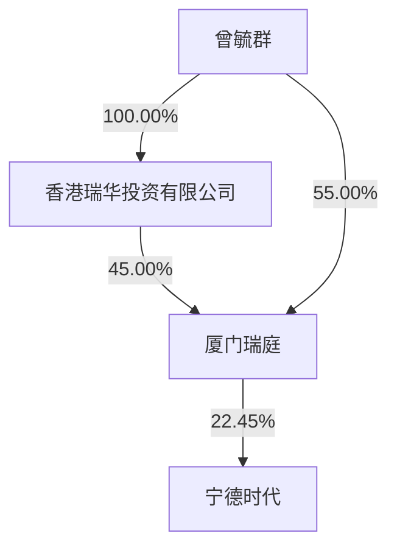

# 第六节 股份变动及股东情况

## 一、股份变动情况

### 1、股份变动情况

单位：股 

<table><tr><td rowspan="2"></td><td colspan="2">本次变动前</td><td colspan="5">本次变动增减(+,-)</td><td colspan="2">本次变动后</td></tr><tr><td>数量</td><td>比例</td><td>发行新股</td><td>送股</td><td>公积金转股</td><td>其他</td><td>小计</td><td>数量</td><td>比例</td></tr><tr><td>一、有限售条件股份</td><td>500,910,125</td><td>11.38%</td><td>46,513</td><td></td><td></td><td>-349,641,808</td><td>-349,595,295</td><td>151,314,830</td><td>3.32%</td></tr><tr><td>1、国家持股</td><td></td><td></td><td></td><td></td><td></td><td></td><td></td><td></td><td></td></tr><tr><td>2、国有法人持股</td><td></td><td></td><td></td><td></td><td></td><td></td><td></td><td></td><td></td></tr><tr><td>3、其他内资持股</td><td>500,910,125</td><td>11.38%</td><td>46,513</td><td></td><td></td><td>-349,641,808</td><td>-349,595,295</td><td>151,314,830</td><td>3.32%</td></tr><tr><td>其中:境内法人持股</td><td></td><td></td><td></td><td></td><td></td><td></td><td></td><td></td><td></td></tr><tr><td>境内自然人持股</td><td>500,910,125</td><td>11.38%</td><td>46,513</td><td></td><td></td><td>-349,641,808</td><td>-349,595,295</td><td>151,314,830</td><td>3.32%</td></tr><tr><td>4、外资持股</td><td></td><td></td><td></td><td></td><td></td><td></td><td></td><td></td><td></td></tr><tr><td>其中:境外法人持股</td><td></td><td></td><td></td><td></td><td></td><td></td><td></td><td></td><td></td></tr><tr><td>境外自然人持股</td><td></td><td></td><td></td><td></td><td></td><td></td><td></td><td></td><td></td></tr><tr><td>二、无限售条件股份</td><td>3,902,556,333</td><td>88.62%</td><td>160,362,064</td><td></td><td></td><td>349,570,261</td><td>509,932,325</td><td>4,412,488,658</td><td>96.68%</td></tr><tr><td>1、人民币普通股</td><td>3,902,556,333</td><td>88.62%</td><td>4,446,764</td><td></td><td></td><td>349,570,261</td><td>354,017,025</td><td>4,256,573,358</td><td>93.27%</td></tr><tr><td>2、境内上市的外资股</td><td></td><td></td><td></td><td></td><td></td><td></td><td></td><td></td><td></td></tr><tr><td>3、境外上市的外资股</td><td></td><td></td><td>155,915,300</td><td></td><td></td><td></td><td>155,915,300</td><td>155,915,300</td><td>3.42%</td></tr><tr><td>4、其他</td><td></td><td></td><td></td><td></td><td></td><td></td><td></td><td></td><td></td></tr><tr><td>三、股份总数</td><td>4,403,466,458</td><td>100.00%</td><td>160,408,577</td><td></td><td></td><td>-71,547</td><td>160,337,030</td><td>4,563,803,488</td><td>100.00%</td></tr></table>

#### （1）股份变动的原因

## 适用 □不适用

1、公司2024年第一次临时股东大会审议通过《关于回购注销部分限制性股票及调整回购价格和回购数量的议案》。2025年 2月 21日，公司完成了 2019 年限制性股票激励计划部分限制性股票的回购注销手续，回购注销有限售条件的 71,547股A股股份。本次回购注销完成后，公司总股本减少 71,547股。  
2、经香港联合交易所有限公司批准，公司发行的135,578,600股H股股份（行使超额配售权之前）于2025年 5月 20日在香港联合交易所有限公司主板挂牌并上市交易。同日，公司同意由整体协调人（代表国际承销商）悉数行使超额配售权，并于2025年5月23日完成20,336,700股H股股份的发行。前述超额配售权悉数行使后，本次共计发行 155,915,300 股 H 股股份。本次发行完成后，公司总股本增加155,915,300 股。  
3、2025年 9月 12日，公司披露了《关于 2022年股票期权与限制性股票激励计划第三个归属期归属结果暨股份上市的提示性公告》，经公司第四届董事会第八次会议审议通过，公司2022年股票期权与限制性股票激励计划第三个归属期归属条件成就，归属股票数量 1,650,424 股，并于 2025年 9 月 16 日上市流通。本次归属完成后，公司总股本增加1,650,424股。  
4、2025年11月18日，公司披露了《关于2021年股票期权与限制性股票激励计划第四个归属期归属结果暨股份上市的提示性公告》，经公司第四届董事会第九次会议审议通过，公司2021年股票期权与限制性股票激励计划第四个归属期归属条件成就，归属股票数量 300,382 股，并于 2025 年 11 月 20 日上市流通。本次归属完成后，公司总股本增加 300,382股。  
5、2025年 6月 11日至 2025年 12月 31日，公司 2021年及 2022年股票期权与限制性股票激励计划部分激励对象进行股票期权行权，行权数量为2,542,471股，行权后公司总股本增加 2,542,471股。

以上变更完成后，公司总股本由 4,403,466,458 股变更为 4,563,803,488 股。

#### （2）股份变动的批准情况

适用 □不适用

同“股份变动的原因”。

#### （3）股份变动的过户情况

适用 □不适用

同“股份变动的原因”。

#### （4）股份变动对最近一年和最近一期基本每股收益和稀释每股收益、归属于公司普通股股东的每股净资产等财务指标的影响

适用 □不适用

股份变动对最近一年和最近一期基本每股收益和稀释每股收益、归属于公司普通股股东的每股净资

产等财务指标的影响，详见“第二节公司简介及主要财务指标之五、主要会计数据和财务指标。

#### （5）公司认为必要或证券监管机构要求披露的其他内容

□适用 不适用

### 2、限售股份变动情况

适用 □不适用

单位：股 

<table><tr><td>股东名称</td><td>期初限售股数</td><td>本期增加限售股数</td><td>本期解除限售股数</td><td>期末限售股数</td><td>限售原因</td><td>解除限售日期</td></tr><tr><td>黄世霖</td><td>349,515,982</td><td></td><td>349,515,982</td><td></td><td>董高锁定股</td><td>离职后全部股份锁定至2023年2月1日,此外在原定任期内和任期届满后6个月内(即2025年6月29日前)每年按持有股份总数的25%解除锁定,其余75%自动锁定</td></tr><tr><td>李平</td><td>151,132,708</td><td></td><td></td><td>151,132,708</td><td>董高锁定股</td><td>董事任职期间,每年按持有股份总数的25%解除锁定,其余75%自动锁定</td></tr><tr><td>其他高管锁定股</td><td>189,888</td><td>46,513</td><td>54,279</td><td>182,122</td><td>董高锁定股</td><td>董事及高级管理人员任职期间,每年按持有股份总数的25%解除锁定,其余75%自动锁定</td></tr><tr><td>限制性股票激励计划激励对象</td><td>71,547</td><td></td><td> $71,547^{(1)}$ </td><td></td><td>股权激励限售股</td><td>自授予登记完成之日起12个月后分五期解除限售</td></tr><tr><td>合计</td><td>500,910,125</td><td>46,513</td><td>349,641,808</td><td>151,314,830</td><td>--</td><td>--</td></tr></table>

注：  
(1) 上表中“限制性股票激励计划激励对象”对应的“本期解除限售股数”为已完成回购注销的 71,547股限制性股票。

## 二、证券发行与上市情况

### 1、报告期内证券发行（不含优先股）情况

适用 □不适用

注：  
(1) 2022年股票期权与限制性股票激励计划之股票期权首次及预留授予第二个行权期发行价格差异系 2025年8月20日公司实施 2025年 A股中期分红，董事会对相关股票期权行权价格进行调整所致。  
(2) 报告期内证券发行具体情况说明详见本报告“第六节股份变动及股东情况”之“1、股份变动情况”“（1）股份变动的原因”。

<table><tr><td>股票及其衍生证券名称</td><td>发行日期</td><td>发行价格(或利率)</td><td>发行数量</td><td>上市日期</td><td>获准上市交易数量</td><td>交易终止日期</td><td>披露索引</td><td>披露日期</td></tr><tr><td>宁德时代-境外上市股份</td><td>2025年5月20日</td><td>263港元/股</td><td>135,578,600</td><td>2025年5月20日</td><td>135,578,600</td><td>/</td><td>巨潮资讯网《关于境外上市外资股(H股)挂牌并上市交易的公告》</td><td>2025年5月20日</td></tr><tr><td>宁德时代-境外上市股份之超额配售股份</td><td>2025年5月23日</td><td>263港元/股</td><td>20,336,700</td><td>2025年5月23日</td><td>20,336,700</td><td>/</td><td>巨潮资讯网《H股公告(翌日披露报表)》</td><td>2025年5月23日</td></tr><tr><td>限制性股票</td><td>2025年11月20日</td><td>156.44元/股</td><td>300,382</td><td>2025年11月20日</td><td>300,382</td><td>/</td><td>巨潮资讯网《关于2021年股票期权与限制性股票激励计划第四个归属期归属结果暨股份上市的提示性公告》</td><td>2025年11月18日</td></tr><tr><td>限制性股票</td><td>2025年9月16日</td><td>132.66元/股</td><td>1,650,424</td><td>2025年9月16日</td><td>1,650,424</td><td>/</td><td>巨潮资讯网《关于2022年股票期权与限制性股票激励计划第三个归属期归属结果暨股份上市的提示性公告》</td><td>2025年9月12日</td></tr><tr><td>股票期权</td><td>2025年9月4日-2025年11月18日</td><td>326.46元/股</td><td>1,190,698</td><td>2025年9月4日-2025年9月19日</td><td>1,190,698</td><td>/</td><td>巨潮资讯网《关于2021年股票期权与限制性股票激励计划第三个行权期自主行权的提示性公告》</td><td>2024年11月22日</td></tr><tr><td>股票期权</td><td>2025年12月19日-2025年12月31日</td><td>326.46元/股</td><td>190,145</td><td>2025年12月19日-2025年12月31日</td><td>190,145</td><td>/</td><td>巨潮资讯网《关于2021年股票期权与限制性股票激励计划第四个行权期自主行权的提示性公告》</td><td>2025年12月16日</td></tr><tr><td rowspan="2">股票期权</td><td>2025年6月10日-2025年8月8日</td><td>279.91元/股</td><td>120</td><td>2025年6月10日-2025年8月8日</td><td>120</td><td>/</td><td rowspan="2">巨潮资讯网《关于2022年股票期权与限制性股票激励计划之股票期权首次及预留授予第二个行权期自主行权的提示性公告》</td><td rowspan="2">2024年9月13日</td></tr><tr><td>2025年8月22日-2025年9月5日</td><td>278.90元/股</td><td>531,446</td><td>2025年8月22日-2025年9月5日</td><td>531,446</td><td></td></tr><tr><td>股票期权</td><td>2025年9月22日-2025年12月26日</td><td>278.90元/股</td><td>630,062</td><td>2025年9月22日-2025年12月26日</td><td>630,062</td><td>/</td><td>巨潮资讯网《关于2022年股票期权与限制性股票激励计划之股票期权首次及预留授予第三个行权期自主行权的提示性公告》</td><td>2025年9月18日</td></tr></table>

### 2、公司股份总数及股东结构的变动、公司资产和负债结构的变动情况说明

适用 □不适用

报告期内，公司股份总数及股东结构均发生了变化，具体变化情况详见本报告“第六节 股份变动及股东情况”之“一、股份变动情况”；公司资产和负债结构的变动情况详见本报告“第八节 财务报告”相关部分。

### 3、现存的内部职工股情况

□适用 不适用

## 三、股东和实际控制人情况

### 1、公司股东数量及持股情况

#### （1）前10名股东持股基本情况

单位：股 

<table><tr><td>报告期末普通股股东总数</td><td>249,777</td><td>年度报告披露日前上一月末普通股股东总数</td><td>257,489</td><td>报告期末表决权恢复的优先股股东总数</td><td>0</td><td>年度报告披露日前上一月末表决权恢复的优先股股东总数</td><td>0</td><td>持有特别表决权股份的股东总数</td><td>0</td></tr><tr><td colspan="10">持股5%以上的股东或前10名股东持股情况(不含通过转融通出借股份)</td></tr><tr><td rowspan="2">股东名称</td><td rowspan="2">股东性质</td><td rowspan="2">持股比例</td><td rowspan="2">报告期末持股数量</td><td rowspan="2">报告期内增减变动情况</td><td rowspan="2">持有有限售条件的股份数量</td><td colspan="2" rowspan="2">持有无限售条件的股份数量</td><td colspan="2">质押、标记或冻结情况</td></tr><tr><td>股份状态</td><td>数量</td></tr><tr><td>厦门瑞庭投资有限公司</td><td>境内一般法人</td><td>22.45%</td><td>1,024,704,949</td><td></td><td></td><td colspan="2">1,024,704,949</td><td></td><td></td></tr><tr><td>香港中央结算有限公司</td><td>境外法人</td><td>15.17%</td><td>692,541,784</td><td>151,000,312</td><td></td><td colspan="2">692,541,784</td><td></td><td></td></tr><tr><td>黄世霖</td><td>境内自然人</td><td>9.21%</td><td>420,388,947</td><td>-45,632,363</td><td></td><td colspan="2">420,388,947</td><td></td><td></td></tr><tr><td>宁波联合创新新能源投资管理合伙企业(有限合伙)</td><td>境内一般法人</td><td>6.23%</td><td>284,220,608</td><td></td><td></td><td colspan="2">284,220,608</td><td></td><td></td></tr><tr><td>李平</td><td>境内自然人</td><td>4.33%</td><td>197,460,277</td><td>-4,050,000</td><td>151,132,708</td><td colspan="2">46,327,569</td><td>质押</td><td>31,920,000</td></tr><tr><td>HKSCCNOMINEESLIMITED</td><td>境外法人</td><td>3.42%</td><td>155,906,787</td><td>155,906,787</td><td></td><td colspan="2">155,906,787</td><td></td><td></td></tr><tr><td>中国工商银行股份有限公司-易方达创业板交易型开放式指数证券投资基金</td><td>基金、理财产品等</td><td>1.07%</td><td>49,005,734</td><td>-21,844,489</td><td></td><td colspan="2">49,005,734</td><td>质押</td><td>600,000</td></tr><tr><td>中国工商银行股份有限公司-华泰柏瑞沪深300交易型开放式指数证券投资基金</td><td>基金、理财产品等</td><td>0.96%</td><td>43,712,032</td><td>-1,840,533</td><td></td><td colspan="2">43,712,032</td><td></td><td></td></tr><tr><td>本田技研工业(中国)投资有限公司</td><td>境内一般法人</td><td>0.91%</td><td>41,400,000</td><td>-</td><td></td><td colspan="2">41,400,000</td><td></td><td></td></tr><tr><td>中国建设银行股份有限公司一易方达沪深300交易型开放式指数发起式证券投资基金</td><td>基金、理财产品等</td><td>0.68%</td><td>31,173,566</td><td>-281,216</td><td></td><td colspan="2">31,173,566</td><td></td><td></td></tr><tr><td colspan="2">战略投资者或一般法人因配售新股成为前10名股东的情况</td><td colspan="8">不适用</td></tr><tr><td colspan="2">上述股东关联关系或一致行动的说明</td><td colspan="8">公司未知晓上述股东之间是否存在关联关系或一致行动。</td></tr><tr><td colspan="2">上述股东涉及委托/受托表决权、放弃表决权情况的说明</td><td colspan="8">不适用</td></tr><tr><td colspan="2">前10名股东中存在回购专户的特别说明</td><td colspan="8">截至报告期末,宁德时代新能源科技股份有限公司回购专用证券账户持有公司股份31,982,306股,占公司总股本比例为0.7%,为公司第十大股东,该等股份并未载入上述前十大股东列表。</td></tr><tr><td colspan="10">前10名无限售条件股东持股情况</td></tr><tr><td colspan="4" rowspan="2">股东名称</td><td colspan="2" rowspan="2">报告期末持有无限售条件股份数量</td><td colspan="4">股份种类</td></tr><tr><td>股份种类</td><td colspan="3">数量</td></tr><tr><td colspan="4">厦门瑞庭投资有限公司</td><td colspan="2">1,024,704,949</td><td>人民币普通股</td><td colspan="3">1,024,704,949</td></tr><tr><td colspan="4">香港中央结算有限公司</td><td colspan="2">692,541,784</td><td>人民币普通股</td><td colspan="3">692,541,784</td></tr><tr><td colspan="4">黄世霖</td><td colspan="2">420,388,947</td><td>人民币普通股</td><td colspan="3">420,388,947</td></tr><tr><td colspan="4">宁波联合创新新能源投资管理合伙企业(有限合伙)</td><td colspan="2">284,220,608</td><td>人民币普通股</td><td colspan="3">284,220,608</td></tr><tr><td colspan="4">HKSCC NOMINEES LIMITED</td><td colspan="2">155,906,787</td><td>境外上市外资股</td><td colspan="3">155,906,787</td></tr><tr><td colspan="4">中国工商银行股份有限公司-易方达创业板交易型开放式指数证券投资基金</td><td colspan="2">49,005,734</td><td>人民币普通股</td><td colspan="3">49,005,734</td></tr><tr><td colspan="4">李平</td><td colspan="2">46,327,569</td><td>人民币普通股</td><td colspan="3">46,327,569</td></tr><tr><td colspan="4">中国工商银行股份有限公司-华泰柏瑞沪深300交易型开放式指数证券投资基金</td><td colspan="2">43,712,032</td><td>人民币普通股</td><td colspan="3">43,712,032</td></tr><tr><td colspan="4">本田技研工业(中国)投资有限公司</td><td colspan="2">41,400,000</td><td>人民币普通股</td><td colspan="3">41,400,000</td></tr><tr><td colspan="4">中国建设银行股份有限公司-易方达沪深300交易型开放式指数发起式证券投资基金</td><td colspan="2">31,173,566</td><td>人民币普通股</td><td colspan="3">31,173,566</td></tr><tr><td colspan="2">前10名无限售流通股股东之间,以及前10名无限售流通股股东和前10名股东之间关联关系或一致行动的说明</td><td colspan="8">公司未知晓上述股东之间是否存在关联关系或一致行动。</td></tr><tr><td colspan="2">参与融资融券业务股东情况说明</td><td colspan="8">不适用</td></tr></table>

#### （2）持股5%以上股东、前 10名股东及前10名无限售流通股股东参与转融通业务出借股份情况

□适用 不适用

截至报告期末，持股 5%以上股东、前 10名股东及前10名无限售流通股股东不存在参与转融通业务出借股份情况。

#### （3）前10名股东及前10名无限售流通股股东因转融通出借/归还原因导致较上期发生变化

□适用 不适用

#### （4）公司是否具有表决权差异安排

□适用 不适用

#### （5）公司前10名普通股股东、前 10名无限售条件普通股股东在报告期内是否进行约定购回交易

□是 否

公司前 10名普通股股东、前10名无限售条件普通股股东在报告期内未进行约定购回交易。

### 2、公司控股股东情况

#### （1）控股股东基本情况

控股股东性质：自然人控股

控股股东类型：法人

<table><tr><td>控股股东名称</td><td>法定代表人</td><td>成立日期</td><td>组织机构代码</td><td>主要经营业务</td></tr><tr><td>厦门瑞庭投资有限公司</td><td>曾毓群</td><td>2012年10月15日</td><td>91350902054341492Y</td><td>投资</td></tr><tr><td>控股股东报告期内控股和参股的其他境内外上市公司的股权情况</td><td colspan="4">否</td></tr></table>

#### （2）控股股东报告期内变更

□适用 不适用

公司报告期控股股东未发生变更。

### 3、公司实际控制人及其一致行动人

#### （1）实际控制人基本情况

实际控制人性质：境内自然人

实际控制人类型：自然人

<table><tr><td>实际控制人姓名</td><td>与实际控制人关系</td><td>国籍</td><td>是否取得其他国家或地区居留权</td></tr><tr><td>曾毓群</td><td>本人</td><td>中国香港</td><td>是</td></tr><tr><td>主要职业及职务</td><td colspan="3">曾毓群先生为公司董事长兼总经理,具体情况详见本报告“第四节 公司治理、环境和社会”之“六、董事和高级管理人员情况”中的“2、任职情况”。</td></tr><tr><td>过去10年曾控股的境内外上市公司情况</td><td colspan="3">无</td></tr></table>

#### （2）公司最终控制层面是否存在持股比例在 10%以上的股东情况

是 □否

□法人 自然人

最终控制层面持股情况

<table><tr><td>最终控制层面股东姓名</td><td>国籍</td><td>是否取得其他国家或地区居留权</td></tr><tr><td>曾毓群</td><td>中国香港</td><td>是</td></tr><tr><td>主要职业及职务</td><td colspan="2">曾毓群先生为公司董事长兼总经理,具体情况详见本报告“第四节 公司治理、环境和社会”之“六、董事和高级管理人员情况”中的“2、任职情况”。</td></tr><tr><td>过去10年曾控股的境内外上市公司情况</td><td colspan="2">无</td></tr></table>

#### （3）实际控制人报告期内变更

□适用 不适用

公司报告期实际控制人未发生变更。

#### （4）公司与实际控制人之间的产权及控制关系的方框图

flowchart

#### （5）实际控制人通过信托或其他资产管理方式控制公司

□适用 不适用

### 4、公司控股股东或第一大股东及其一致行动人累计质押股份数量占其所持公司股份数量比例达到 80%

□适用 不适用

### 5、其他持股在10%以上的法人股东

□适用 不适用

### 6、控股股东、实际控制人、重组方及其他承诺主体股份限制减持情况

□适用 不适用

## 四、股份回购在报告期的具体实施情况

股份回购的实施进展情况

适用 □不适用

<table><tr><td>方案披露时间</td><td>拟回购股份数量(股)</td><td>占总股本的比例</td><td>拟回购金额(万元)</td><td>拟回购期间</td><td>回购用途</td><td>已回购数量(股)</td><td>已回购数量占股权激励计划所涉及的标的股票的比例</td></tr><tr><td>2025年4月7日</td><td colspan="3">拟使用不低于人民币40亿元(含本数)且不超过人民币80亿元(含本数),回购价格上限为386.78元/股,具体回购股份的数量以回购结束时实际回购的股份数量为准</td><td>自公司董事会审议通过回购股份方案之日起12个月内</td><td>用于实施股权激励计划或员工持股计划</td><td>15,990,782</td><td>不适用</td></tr></table>

采用集中竞价交易方式减持回购股份的实施进展情况

□适用 不适用

## 五、优先股相关情况

□适用 不适用

报告期公司不存在优先股。
