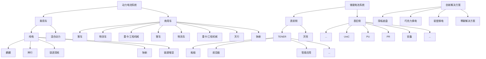

## 一、报告期内公司从事的主要业务

公司需遵守《深圳证券交易所上市公司自律监管指引第 4 号——创业板行业信息披露》中的“锂离子电池产业链相关业务”的披露要求。

### 1、主要业务

公司是全球领先的零碳新能源科技公司，主要从事动力电池、储能电池的研发、生产、销售，以推动移动式化石能源替代、固定式化石能源替代，并通过电动化和智能化实现市场应用的集成创新。截至报告期末，公司已在全球设立六大研发中心、24家电池工厂，覆盖全球广泛的新能源应用客户群体。

公司在锂电池领域深耕多年，具备了全链条自主、高效的研发能力，在电池材料、电池系统、电池回收等产业链领域拥有核心技术优势及前瞻性研发布局，通过材料及材料体系创新、系统结构创新、绿色极限制造创新及商业模式创新为全球新能源应用提供一流的解决方案和服务。公司将锂电池领域的深厚沉淀延展至钠电池等其他化学体系，形成全面、先进的产品矩阵，可应用于乘用车、商用车、表前储能、表后储能等领域，以及船舶、航空器、数据中心等新兴应用场景，推出复杂应用场景下的创新解决方案，包括助推全面电动化的换电业务、完善产业生态并延伸价值链条的零碳生态建设等，能够全方位满足不同客户的多元化、跨场景的需求，引领全球零碳新经济发展。

### 2、主要产品及其用途

公司致力于为全球新能源应用提供一流的动力电池和储能电池产品及相关创新解决方案，具体如下：

flowchart

#### （1）动力电池系统

公司动力电池产品包括电芯、模组/电箱及电池包。公司可提供磷酸铁锂电池、三元高压中镍电池、三元高镍电池、超混电池、钠离子电池、凝聚态电池等覆盖不同能量密度区间的多种化学体系产品系列，能满足快充、长寿命、长续航、高安全、宽温度适应性等多种功能需求。公司亦可通过在单个电池包里采用双核/多核架构以实现多元化学体系的集成，进而充分发挥各类化学体系的性能优势。公司根据应用领域及客户要求，通过定制或联合研发等方式设计个性化产品方案，以满足客户对产品性能的不同需求。

乘用车应用领域，公司产品可应用于 BEV、REV、PHEV、HEV 等不同细分市场，广泛应用于私家车、运营车等领域；商业应用领域，公司产品可应用于道路客运、城市配送、重载运输、道路清洁等客车及商用车领域。此外，公司产品还可应用于船舶、航空器、电动工具、电动两轮车等领域。

#### （2）储能电池系统

公司提供电芯、电池柜、储能集装箱以及系统集成等储能解决方案。公司的储能电池广泛应用于表前储能和表后储能领域，包括公用事业储能、工商业储能及数据中心储能等。

在表前领域，公司依托智能液冷控温、高成组 CTP、无热扩散等技术，推出了 EnerOne、EnerOnePlus等户外液冷电池柜，针对全气候场景的 EnerC、EnerC Plus、EnerD、EnerX等集装箱式液冷电池柜，以及单体6.25MWh的天恒储能系统、全球首款可量产的 9MWh超大容量储能系统解决方案TENER Stack、其他适应众多应用场景的 TENER 系列解决方案。在表后领域，公司产品已实现从低压、中压到高压平台的全场景覆盖。其中，PR系列、Unic系列及安鑫系列、PU系列分别可满足家庭储能、工商储能、数据中心能源管理需求。

根据相关需求，公司开发了适用于表前、表后市场的多场景、多工况的不同规格电芯，具备超长寿命、零衰减、高安全、宽温度适应性等特性。

#### （3）电池材料、回收及矿产资源

公司电池材料产品主要包括锂盐、前驱体及正极材料等。公司亦通过回收方式，对废旧电池中的镍、钴、锰、锂、磷、铁、铝、铜等金属材料及其他材料进行加工、提纯、合成等工艺，生产锂电池生产所需的正极材料、三元前驱体、磷铁前驱体、锂盐等材料，并将收集后的铜、铝等金属材料通过第三方回收利用，使电池生产所需的关键金属资源实现有效循环利用。

此外，为进一步保障电池生产所需的上游关键资源及材料供应，公司通过自建、参股、合资等多种方式参与锂、镍、钴、磷等电池矿产资源及相关产品的投资、建设及运营。

### 3、经营模式

公司拥有独立的研发、采购、生产和销售体系，主要通过销售动力电池、储能电池和电池材料等产品和解决方案实现盈利。研发方面，公司建立了完备的研发体系，形成以自主研发为主、外部合作为辅的研发模式，通过数字化、智能化的方式，紧密围绕材料及材料体系、系统结构、绿色极限制造及商业模式领域开展创新，以引领行业技术发展。采购方面，公司通过严格的评估和考核程序遴选合格供应商，并通过长期协议、合资合作等方式与全球供应商紧密合作，以保证原材料和设备的技术先进性、产品的可靠性以及成本的竞争力。生产销售方面，公司综合考虑市场情况及客户需求安排生产，公司以自建生产基地为主，并通过合资建厂、技术授权等方式扩充产能，以满足全球客户需求。此外，公司将电动化延伸至低空、船舶、智能应用等更广阔领域，并推进换电网络及零碳生态构建。

### 4、主要的业绩驱动因素

#### （1）行业持续增长

动力电池方面，全球新能源车销量增长带动动力电池需求持续增长。根据 SNE Research 数据，2025年全球新能源车销量 2,147.0万辆，同比增长 21.5%，全球动力电池使用量达 1,187GWh，同比增长 31.7%。储能电池方面，在各国清洁能源转型目标推动下，随着风电光伏装机比例提升、电力系统灵活性要求提高、储能技术进步及系统成本下降、数据中心等新兴领域需求拉动，储能电池市场需求持续快速增长。根据 SNE Research 统计，2025 年全球储能电池出货量 550GWh，同比增长 79%。

#### （2）公司竞争优势进一步提升

公司坚持技术领先、服务优质、运营卓越的经营理念，致力于为全球客户提供一流产品及解决方案。基于强大创新基因、深刻行业洞察、高效经营管理，公司在技术研发、产品创新、品牌及市场推广、极限制造、生态布局、零碳拓展等方面的竞争优势进一步提升，综合竞争力行业领先，实现业务稳健增长，为股东持续创造价值。
