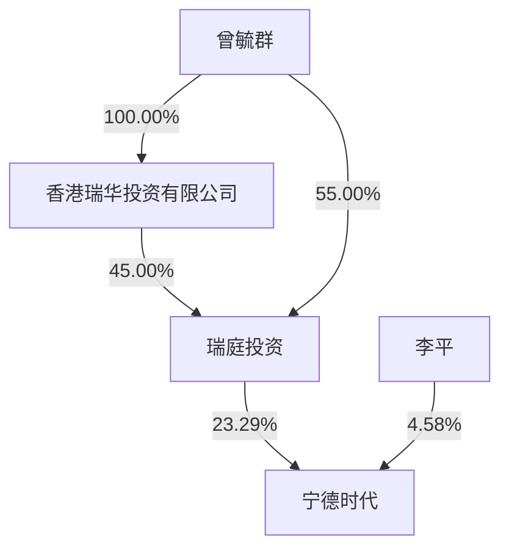

## CATL

# 宁德时代新能源科技股份有限公司

# 2023 年年度报告

2024 年 03 月

## 第一节 重要提示、目录和释义

公司董事会、监事会及董事、监事、高级管理人员保证本年度报告内容的真实、准确、完整，不存在虚假记载、误导性陈述或者重大遗漏，并承担个别和连带的法律责任。

公司负责人曾毓群先生、主管会计工作负责人及会计机构负责人郑舒先生声明：保证本年度报告中财务报告的真实、准确、完整。

所有董事均已出席了审议本年度报告的董事会会议。

本报告中涉及的未来发展规划等前瞻性陈述不构成公司对投资者的实质承诺，敬请广大投资者理性投资，注意风险。

公司在本年度报告中详细阐述了未来可能发生的有关风险因素及对策，详见“第三节 管理层讨论与分析”之“十一、公司未来发展的展望”“（四）可能面对的风险”，敬请广大投资者予以关注。

公司需要遵守锂离子电池产业链相关行业的披露要求。

经公司第三届董事会第二十七次会议审议通过的 2023 年度利润分配预案为：拟以现有总股本 4,399,041,236 股剔除回购专用证券账户中已回购股份11,609,630 股后的股本 4,387,431,606 股为基数，向全体股东每 10 股派发年度现金分红和特别现金分红 50.28 元（含税），合计派发现金分红 22,060,006,114.97元。本年度不送股，不进行资本公积转增股本。本次利润分配预案尚需提交公司股东大会审议。

## 目录

第一节 重要提示、目录和释义.

第二节公司简介和主要财务指标.

第三节 管理层讨论与分析..

第四节 公司治理 . . 42

第五节 环境和社会责任.. 67

第六节 重要事项 . 74

第七节股份变动及股东情况.. . 94

第八节优先股相关情况.. 104

第九节债券相关情况. . 105

第十节财务报告.. .110

## 备查文件目录

一、载有公司法定代表人签字的2023年年度报告原件。  
二、载有公司负责人、主管会计工作负责人、会计机构负责人签名并盖章的财务报表。  
三、载有会计师事务所盖章、注册会计师签名并盖章的审计报告原件。  
四、报告期内在中国证监会指定网站上公开披露过的所有公司文件的正本及公告的原稿。

以上备查文件的备置地点：公司住所（福建省宁德市蕉城区漳湾镇新港路 2 号）及深圳证券交易所（http://www.szse.cn/）。

释义

<table><tr><td>释义项</td><td>指</td><td>释义内容</td></tr><tr><td>本公司、公司、宁德时代</td><td>指</td><td>宁德时代新能源科技股份有限公司</td></tr><tr><td>瑞庭投资</td><td>指</td><td>公司控股股东,厦门瑞庭投资有限公司</td></tr><tr><td>SNE Research</td><td>指</td><td>韩国新能源领域咨询公司,提供电池行业全球市场研究和咨询服务</td></tr><tr><td>Net Zero Tracker</td><td>指</td><td>由 the Energy &amp; Climate Intelligence Unit (ECIU)、the Data-Driven EnviroLab (DDL)、NewClimate Institute 和 Oxford Net Zero 共同开展的国际合作项目,旨在提高国家、地区、城市及公司净零排放目标承诺的责任度及透明度。</td></tr><tr><td>ESG</td><td>指</td><td>Environment、Social and Governance,环境、社会与公司治理</td></tr><tr><td>中国证监会</td><td>指</td><td>中国证券监督管理委员会</td></tr><tr><td>深交所</td><td>指</td><td>深圳证券交易所</td></tr><tr><td>中登公司</td><td>指</td><td>中国证券登记结算有限责任公司深圳分公司</td></tr><tr><td>动力电池系统</td><td>指</td><td>动力电池里的电芯、模组/电箱、电池包</td></tr><tr><td>储能电池系统</td><td>指</td><td>储能电池里的电芯、模组、电箱、电池柜</td></tr><tr><td>GWh</td><td>指</td><td>电功的单位,KWh 是度,1GWh=1,000,000KWh</td></tr><tr><td>MWh</td><td>指</td><td>电功的单位,KWh 是度,1MWh=1,000KWh</td></tr><tr><td>CTP</td><td>指</td><td>Cell To Pack,无模组动力电池包</td></tr><tr><td>CTC</td><td>指</td><td>Cell to Chassis,一体化电动底盘</td></tr><tr><td>BEV</td><td>指</td><td>英文:battery electric vehicle中文:纯电动车</td></tr><tr><td>PHEV</td><td>指</td><td>英文:Plug-in hybrid electric vehicle中文:插电式混合动力车</td></tr><tr><td>HEV</td><td>指</td><td>英文:hybrid electric vehicle中文:混合动力车</td></tr><tr><td>巨潮资讯网</td><td>指</td><td>http://www.cninfo.com.cn</td></tr><tr><td>报告期</td><td>指</td><td>2023年1月1日至2023年12月31日</td></tr></table>

注：本报告中若出现总数与各分项数值之和尾数不符的情况，均为四舍五入原因造成。

## 第二节 公司简介和主要财务指标

## 一、公司信息

<table><tr><td>股票简称</td><td>宁德时代</td><td>股票代码</td><td>300750</td></tr><tr><td>公司的中文名称</td><td colspan="3">宁德时代新能源科技股份有限公司</td></tr><tr><td>公司的中文简称</td><td colspan="3">宁德时代</td></tr><tr><td>公司的外文名称</td><td colspan="3">Contemporary Amperex Technology Co., Ltd.</td></tr><tr><td>公司的外文名称缩写</td><td colspan="3">CATL</td></tr><tr><td>公司的法定代表人</td><td colspan="3">曾毓群</td></tr><tr><td>注册地址</td><td colspan="3">福建省宁德市蕉城区漳湾镇新港路2号</td></tr><tr><td>注册地址的邮政编码</td><td colspan="3">352100</td></tr><tr><td>办公地址</td><td colspan="3">福建省宁德市蕉城区漳湾镇新港路2号</td></tr><tr><td>办公地址的邮政编码</td><td colspan="3">352100</td></tr><tr><td>公司网址</td><td colspan="3">www.catl.com</td></tr><tr><td>电子信箱</td><td colspan="3">CATL-IR@catl.com</td></tr></table>

## 二、联系人和联系方式

<table><tr><td></td><td>董事会秘书</td><td>证券事务代表</td></tr><tr><td>姓名</td><td>蒋理</td><td>陈津</td></tr><tr><td>联系地址</td><td>福建省宁德市蕉城区漳湾镇新港路2号</td><td>福建省宁德市蕉城区漳湾镇新港路2号</td></tr><tr><td>电话</td><td>0593-8901666</td><td>0593-8901666</td></tr><tr><td>传真</td><td>0593-8901999</td><td>0593-8901999</td></tr><tr><td>电子信箱</td><td>CATL-IR@catl.com</td><td>CATL-IR@catl.com</td></tr></table>

## 三、信息披露及备置地点

<table><tr><td>公司披露年度报告的证券交易所网站</td><td>https://www.szse.cn/index/index.html</td></tr><tr><td>公司披露年度报告的媒体名称及网址</td><td>巨潮资讯网</td></tr><tr><td>公司年度报告备置地点</td><td>公司住所</td></tr></table>

## 四、其他有关资料

公司聘请的会计师事务所

<table><tr><td>会计师事务所名称</td><td>致同会计师事务所(特殊普通合伙)</td></tr><tr><td>会计师事务所办公地址</td><td>北京市朝阳区建国门外大街22号赛特广场5层</td></tr><tr><td>签字会计师姓名</td><td>殷雪芳、施旭锋</td></tr></table>

公司聘请的报告期内履行持续督导职责的保荐机构

适用 □不适用

<table><tr><td>保荐机构名称</td><td>保荐机构办公地址</td><td>保荐代表人姓名</td><td>持续督导期间</td></tr><tr><td>中信建投证券股份有限公司</td><td>北京市朝阳区景辉街16号院1号楼泰康集团大厦11层</td><td>吕晓峰、张帅</td><td>2020年8月4日-2024年12月31日</td></tr></table>

公司聘请的报告期内履行持续督导职责的财务顾问

□适用 不适用

## 五、主要会计数据和财务指标

公司是否需追溯调整或重述以前年度会计数据

是 □否

追溯调整或重述原因：2022年、2021年每股收益调整的原因系本公司 2023 年 4月完成资本公积金转增股本，对该指标进行重新计算。

<table><tr><td rowspan="2"></td><td rowspan="2">2023 年</td><td colspan="2">2022 年</td><td>本年比上年增减</td><td colspan="2">2021 年</td></tr><tr><td>调整前</td><td>调整后</td><td>调整后</td><td>调整前</td><td>调整后</td></tr><tr><td>营业收入(万元)</td><td>40,091,704.49</td><td>32,859,398.75</td><td>32,859,398.75</td><td>22.01%</td><td>13,035,579.64</td><td>13,035,579.64</td></tr><tr><td>归属于上市公司股东的净利润(万元)</td><td>4,412,124.83</td><td>3,072,916.35</td><td>3,072,916.35</td><td>43.58%</td><td>1,593,131.79</td><td>1,593,131.79</td></tr><tr><td>归属于上市公司股东的扣除非经常性损益的净利润(万元)</td><td>4,009,167.37</td><td>2,821,309.82</td><td>2,821,309.82</td><td>42.10%</td><td>1,344,236.43</td><td>1,344,236.43</td></tr><tr><td>经营活动产生的现金流量净额(万元)</td><td>9,282,612.44</td><td>6,120,884.33</td><td>6,120,884.33</td><td>51.65%</td><td>4,290,800.87</td><td>4,290,800.87</td></tr><tr><td>基本每股收益(元/股)</td><td>11.7900</td><td>12.9178</td><td>7.1766</td><td>64.28%</td><td>6.8760</td><td>3.8200</td></tr><tr><td>稀释每股收益(元/股)</td><td>11.7790</td><td>12.8795</td><td>7.1553</td><td>64.62%</td><td>6.8392</td><td>3.7996</td></tr><tr><td>加权平均净资产收益率</td><td>24.04%</td><td>24.67%</td><td>24.67%</td><td>-0.63%</td><td>21.52%</td><td>21.52%</td></tr><tr><td rowspan="2"></td><td rowspan="2">2023 年末</td><td colspan="2">2022 年末</td><td>本年末比上年末增减</td><td colspan="2">2021 年末</td></tr><tr><td>调整前</td><td>调整后</td><td>调整后</td><td>调整前</td><td>调整后</td></tr><tr><td>资产总额(万元)</td><td>71,716,804.11</td><td>60,095,235.19</td><td>60,095,235.19</td><td>19.34%</td><td>30,766,686.09</td><td>30,766,686.09</td></tr><tr><td>归属于上市公司股东的净资产(万元)</td><td>19,770,805.24</td><td>16,448,125.16</td><td>16,448,125.16</td><td>20.20%</td><td>8,451,327.13</td><td>8,451,327.13</td></tr></table>

公司最近三个会计年度扣除非经常性损益前后净利润孰低者均为负值，且最近一年审计报告显示公司持续经营能力存在不确定性

□是 否

扣除非经常损益前后的净利润孰低者为负值

□是 否

## 六、分季度主要财务指标

单位：万元

<table><tr><td></td><td>第一季度</td><td>第二季度</td><td>第三季度</td><td>第四季度</td></tr><tr><td>营业收入</td><td>8,903,846.53</td><td>10,020,757.60</td><td>10,543,120.93</td><td>10,623,979.43</td></tr><tr><td>归属于上市公司股东的净利润</td><td>982,226.51</td><td>1,089,499.94</td><td>1,042,820.91</td><td>1,297,577.48</td></tr><tr><td>归属于上市公司股东的扣除非经常性损益的净利润</td><td>780,005.67</td><td>975,294.00</td><td>942,800.53</td><td>1,311,067.17</td></tr><tr><td>经营活动产生的现金流量净额</td><td>2,096,627.85</td><td>1,610,409.13</td><td>1,558,332.25</td><td>4,017,243.21</td></tr></table>

上述财务指标或其加总数是否与公司已披露季度报告、半年度报告相关财务指标存在重大差异

□是 否

## 七、境内外会计准则下会计数据差异

## 1、同时按照国际会计准则与按照中国会计准则披露的财务报告中净利润和净资产差异情况

□适用 不适用

公司报告期不存在按照国际会计准则与按照中国会计准则披露的财务报告中净利润和净资产差异情况。

## 2、同时按照境外会计准则与按照中国会计准则披露的财务报告中净利润和净资产差异情况

□适用 不适用

公司报告期不存在按照境外会计准则与按照中国会计准则披露的财务报告中净利润和净资产差异情况。

## 3、境内外会计准则下会计数据差异原因说明

□适用 不适用

## 八、非经常性损益项目及金额

适用 □不适用

单位：万元

<table><tr><td>项目</td><td>2023年金额</td><td>2022年金额</td><td>2021年金额</td><td>说明</td></tr><tr><td>非流动性资产处置损益(包括已计提资产减值准备的冲销部分)</td><td>-23,594.40</td><td>26,471.26</td><td>-7,504.20</td><td></td></tr><tr><td>计入当期损益的政府补助(与公司正常经营业务密切相关,符合国家政策规定、按照确定的标准享有、对公司损益产生持续影响的政府补助除外)</td><td>572,456.24</td><td>270,202.97</td><td>167,345.41</td><td></td></tr><tr><td>除同公司正常经营业务相关的有效套期保值业务外,非金融企业持有金融资产和金融负债产生的公允价值变动损益以及处置金融资产和金融负债产生的损益</td><td>4,627.04</td><td>40,024.13</td><td></td><td></td></tr><tr><td>委托他人投资或管理资产的损益</td><td>2,675.89</td><td>5,293.73</td><td>6,092.63</td><td></td></tr><tr><td>单独进行减值测试的应收款项减值准备转回</td><td>6,233.87</td><td>3,278.07</td><td>33,127.58</td><td></td></tr><tr><td>除上述各项之外的其他营业外收入和支出</td><td>19,575.12</td><td>-11,119.94</td><td>13,064.25</td><td></td></tr><tr><td>其他符合非经常性损益定义的损益项目</td><td>18,452.77</td><td>4,332.79</td><td>104,097.83</td><td></td></tr><tr><td>减:所得税影响额</td><td>119,402.68</td><td>68,918.71</td><td>50,461.66</td><td></td></tr><tr><td>少数股东权益影响额(税后)</td><td>78,066.39</td><td>17,957.79</td><td>16,866.49</td><td></td></tr><tr><td>合计</td><td>402,957.47</td><td>251,606.53</td><td>248,895.35</td><td>--</td></tr></table>

其他符合非经常性损益定义的损益项目的具体情况：

适用 □不适用

主要系其他非流动金融资产分红确认的投资收益。

将《公开发行证券的公司信息披露解释性公告第 1 号——非经常性损益》中列举的非经常性损益项目界定为经常性损益项目的情况说明

□适用 不适用

公司不存在将《公开发行证券的公司信息披露解释性公告第 1 号——非经常性损益》中列举的非经常性损益项目界定为经常性损益的项目的情形。

## 第三节 管理层讨论与分析

## 一、报告期内公司所处行业情况

## （一）公司行业分类

公司主要从事动力电池、储能电池和电池回收利用产品的研发、生产和销售。根据国家统计局发布的《国民经济行业分类与代码》（GB/T 4754-2017），公司属于门类“C制造业”中的大类“C38电气机械和器材制造业”中的小类“C3841锂离子电池制造”。

## （二）行业发展状况及发展趋势

为应对全球气候变化挑战，各国对绿色低碳和可持续发展的关注度持续提升。根据净零倡议组织 NetZero Tracker 统计，目前已有超 150 个国家宣布了碳中和目标。目前全球碳排放主要来源于电力、交通等领域，电力行业碳减排的主要方式为提高风电、光伏等绿色清洁能源发电占比，交通行业碳减排的主要方式为提升出行工具的电动化率。电化学储能装置是绿色、清洁能源的重要载体之一，在推进各领域的碳减排过程中发挥重要作用。在此背景下，有关清洁能源的生产、转换、存储、使用等行业近年来取得快速发展。

2023 年，近 200个国家在联合国气候变化大会上达成了“阿联酋共识”，这是各国近 30 年来首次就推动能源系统脱离化石燃料向清洁能源转型达成一致，并明确将“公正、有序和公平”作为能源系统转型的核心原则，为全球下一步应对气候变化进程指明了方向。

## 1、动力电池行业

随着新能源车型产品力的不断提升、充换电等基础设施的持续完善，消费者对新能源车认可度和接受度逐渐提高，全球新能源车市场需求持续增长，带动动力电池行业规模较快提升。

根据中国汽车工业协会数据，2023年我国新能源车销量为 949.5万辆、同比增长 37.9%，新能源车渗透率达到 31.6%、同比提升 5.9 个百分点；根据欧洲汽车制造商协会数据，2023 年欧洲 31 国实现新能源乘用车注册量300.9万辆、同比增长16.2%，新能源车渗透率为23.4%、同比提升0.5个百分点；根据美国汽车创新联盟数据，2023年前三季度美国新能源轻型车实现销量103.8万辆、同比增长59%，新能源车渗透率为 9.3%、同比提升 2.8 个百分点。新能源车增长带动动力电池市场增长，根据 SNE Research统计，2023年全球新能源车动力电池使用量达 705.5GWh，同比增长 38.6%，其中中国新能源车动力电池使用量达 386.1GWh、同比增长 34.9%。

## 2、储能行业

近年来，中国储能政策环境持续优化，共享储能示范省份不断增加；美国可再生能源及储能部署进程加快，电价波动加剧下储能经济性提升；欧洲主要国家出台储能支持政策，助推市场较快增长。此外，随着人工智能快速发展带来的算力需求快速增长，将进一步提升电力和储能需求。

2023 年，在风电光伏装机增长、碳酸锂价格回落提升储能经济性的带动下，储能需求持续提升。根据 SNE Research 统计，2023年全球储能电池出货量 185GWh，同比增长 53%。

## 3、电池材料及回收行业

随着动力电池、储能电池市场的持续增长，电池材料的需求也相应增长。根据SMM统计，2023年全球电池三元、磷酸铁锂正极材料合计产量为216.8万吨，同比增长21.2%。

电池回收对于新能源行业的可持续发展至关重要，是实现产业链闭环的关键环节。随着全球新能源车保有量不断增长、电池拆解回收技术不断进步、全球回收渠道逐步拓展，电池回收市场发展迅速。据EV tank 统计，作为全球主要电池回收市场，我国 2023 年回收产能达到 248.4 万吨，同比增长 158.7%。

## （三）公司行业地位

公司是全球领先的动力电池和储能电池企业。根据 SNE Research 统计，2023 年公司全球动力电池使用量市占率为 36.8%，较去年提升0.6个百分点，连续 7年排名全球第一；2023年公司全球储能电池出货量市占率为40%，连续3年排名全球第一。

## （四）主要法律法规及行业政策

2023 年以来行业有关的主要法律法规及政策如下表所示：

<table><tr><td>时间</td><td>文件名称</td><td>颁布单位</td></tr><tr><td>2023年2月</td><td>工业和信息化部等八部门关于组织开展公共领域车辆全面电动化先行区试点工作的通知</td><td>工信部、交通运输部、发改委、财政部、生态环境部、住房城乡建设部、国家能源局、国家邮政局</td></tr><tr><td>2023年3月</td><td>reform of electricity market design-COMMISSION RECOMMENDATION on Energy Storage-Underpinning a decarbonised and secure EU energy system欧盟电力市场改革法案草案</td><td>欧盟委员会</td></tr><tr><td>2023年5月</td><td>关于第三监管周期省级电网输配电价及有关事项的通知</td><td>发改委</td></tr><tr><td>2023年6月</td><td>关于延续和优化新能源汽车车辆购置税减免政策的公告</td><td>财政部、税务总局、工信部</td></tr><tr><td>2023年7月</td><td>关于修改《乘用车企业平均燃料消耗量与新能源汽车积分并行管理办法》的决定</td><td>工信部、财政部、商务部、海关总署、市场监管总局</td></tr><tr><td>2023年9月</td><td>电力现货市场基本规则(试行)</td><td>发改委、国家能源局</td></tr><tr><td>2023年11月</td><td>关于开展智能网联汽车准入和上路通行试点工作的通知</td><td>工信部、公安部、住建部、交通运输部</td></tr><tr><td>2023年11月</td><td>关于加强发电侧电网侧电化学储能电站安全运行风险监测的通知</td><td>国家能源局</td></tr><tr><td>2023年11月</td><td>关于促进新型储能并网和调度运用的通知(征求意见稿)</td><td>国家能源局</td></tr><tr><td>2023年12月</td><td>新能源汽车动力电池综合利用管理办法(征求意见稿)</td><td>工信部</td></tr></table>

## 二、报告期内公司从事的主要业务

公司需遵守《深圳证券交易所上市公司自律监管指引第 4 号——创业板行业信息披露》中的“锂离子电池产业链相关业务”的披露要求。

## （一）主要业务

公司是全球领先的新能源创新科技公司，主要从事动力电池及储能电池的研发、生产及销售，以推动固定式化石能源替代、移动式化石能源替代，并以电动化+智能化为核心，推动市场应用的集成创新。公司在电池材料、电池系统、电池回收等产业链领域拥有核心技术优势及前瞻性研发布局，致力于通过材料及材料体系创新、系统结构创新、绿色极限制造创新及商业模式创新为全球新能源应用提供一流的解决方案和服务。

## （二）主要产品及其用途

公司主要产品包括电池系统及相关电池材料。

## 1、电池系统

## （1）动力电池系统

公司动力电池产品包括电芯、模组/电箱及电池包。公司可提供凝聚态电池、三元高镍电池、三元高压中镍电池、M3P 电池、磷酸铁锂电池以及钠离子电池等覆盖不同能量密度区间的多种化学体系产品系列，能满足快充、长寿命、长续航、高安全、宽温度适应性等多种功能需求。公司根据应用领域及客户要求，通过定制或联合研发等方式设计个性化产品方案，以满足客户对产品性能的不同需求。

乘用车应用领域，公司产品可应用于 BEV、PHEV、HEV 等不同细分市场，广泛应用于私家车、运营车等领域；商业应用领域，公司产品可应用于道路客运、城市配送、重载运输、道路清洁等客车及商用车领域，叉车、装载机、挖掘机等工程机械领域，游船、拖轮、货船等电动船舶领域以及电动商用飞机领域。此外，公司产品还可应用于无人机、吸尘器、电动工具、电动两轮车、泛机器人等领域，具备高能量密度、高功率、高安全的特性。

## （2）储能电池系统

公司提供电芯、电池柜、储能集装箱以及交流侧系统等储能产品解决方案。公司提供的产品主要面向发电侧、输配电侧及用户侧领域。

电芯产品方面，基于多样的应用场景和产品全周期的经济性，公司开发了多款发电侧、输配电侧储能专用电芯以及适用于用户侧的系列电芯，具备超长寿命、高安全、宽温度适应性等特性。

系统集成方面，在发电侧及输配电侧应用领域，公司结合智能液冷控温、高成组 CTP、无热扩散等技术，推出了具备高充放电效率、长寿命、高集成和高安全特点的户外水冷电柜 EnerOne、EnerOne Plus以及针对全气候场景的储能集装箱 EnerC、EnerC Plus及 EnerD等产品；公司推出零辅源光储直流耦合解决方案，可改善电站出力特性、电能质量、能量时移效率。在用户侧应用领域，公司可提供高安全、耐低温、长循环、易安装的家庭储能解决方案，适用于低压、中压到高压平台的全方位应用场景。

## 2、电池材料及回收

公司电池材料产品主要包括锂盐、前驱体及正极材料等。公司亦通过回收方式，对废旧电池中的镍、钴、锰、锂、磷、铁等金属材料及其他材料进行加工、提纯、合成等工艺，生产锂电池生产所需的三元前驱体、磷铁前驱体、碳酸锂等材料，并将收集后的铜、铝等金属材料回收利用，使电池生产所需的关键金属资源实现有效循环利用。

此外，为进一步保障电池生产所需的上游关键资源及材料供应，公司通过自建、参股、合资等多种方式参与锂、镍、钴、磷等电池矿产资源及相关产品的投资、建设及运营。

## （三）经营模式

公司拥有独立的研发、采购、生产和销售体系，主要通过销售动力电池、储能电池和电池材料等产品实现盈利。研发方面，公司建立了完备的研发体系，形成以自主研发为主、外部合作为辅的研发模式，通过数字化、智能化的方式，紧紧围绕材料及材料体系、系统结构、绿色极限制造开展技术创新，以引领行业技术发展。采购方面，公司通过严格的评估和考核程序遴选合格供应商，并通过技术授权、长期协议、合资合作等方式与供应商紧密合作，以保证原料、设备的技术先进性、产品可靠性以及成本竞争力。生产销售方面，公司综合考虑市场情况以及客户需求安排生产。此外，公司通过商业模式创新，为客户提供“EVOGO 换电服务”、“骐骥换电服务”、“电动智慧无人矿山”、“光储充检智能充电站”、“智慧港口”等新能源应用解决方案和服务。

报告期内，公司的主要经营模式未发生重大变化。

## （四）主要的业绩驱动因素

## 1、行业持续快速增长

动力电池方面，全球新能源车市场持续增长带动动力电池行业规模较快提升。根据 SNE Research 统计，2023年全球新能源车销量1,406.1万辆，同比增长33.4%，全球动力电池使用量达705.5GWh，同比增长 38.6%。

储能电池方面，在各国政策支持下，随着清洁能源装机比例的提升、电力系统灵活性要求提高、储能技术进步及系统成本下降，储能电池市场需求持续快速增长。根据 SNE Research 统计，2023年全球储能电池出货量185GWh，同比增长53%。

电池材料方面，其市场规模随动力及储能电池需求增长而迅速扩大。以正极材料为例，根据 SMM统计，2023年全球电池三元、磷酸铁锂正极材料合计产量为216.8万吨，同比增长21.2%。

## 2、公司竞争力优势进一步提升

公司坚持技术领先、服务优质、运营卓越的经营理念，致力于为全球客户提供一流产品及解决方案。基于强大创新基因、深刻行业洞察、高效经营管理，公司报告期内在技术研发、极限制造、供应链管理、客户合作、可持续发展等方面的竞争优势进一步提升，综合竞争力行业领先，公司动力电池和储能电池的全球市场份额连续多年保持第一，实现业务稳健增长，为股东持续创造价值。

## 三、核心竞争力分析

## （一）研发体系先进

公司研发范围涵盖材料研发、产品研发、工程设计、测试分析、智能制造、先进装备、信息系统、项目管理、回收利用等各个领域。报告期内公司持续加大研发投入，不断完善和升级研发平台。基于对电化学及材料科学的深度理解，公司以强大算力、先进算法、海量数据为基础，采用多物理场、多尺度、多参数的工艺建模仿真，通过数字化、智能化研发手段提升研发效率，开展材料及材料体系创新、系统结构创新、绿色极限制造创新，引领行业技术发展。

公司拥有电化学储能技术国家工程研究中心、福建省锂离子电池企业重点实验室、中国合格评定国家认可委员会（CNAS）认证的测试验证中心、21C 创新实验室、未来能源（上海）研究院、厦门研究院、江苏研究院等各具特色的研发机构，并设立了“博士后科研工作站”、“福建省院士专家工作站”。公司与上海交通大学、清华大学、复旦大学、中国科学院等多所知名高校及科研院所在联合人才培养、科技攻关等方面开展深度合作。截至报告期末，公司拥有研发技术人员 20,604 名，其中，拥有博士学历的 361名、硕士学历的3,913名。公司拥有8,137项境内专利及1,850项境外专利，正在申请的境内和境外专利合计 19,500 项。

## （二）引领极限制造

公司致力于打造绿色、高效的极限制造体系，从产品质量、生产效率、安全保障等方面入手不断提升电池制造能力，利用先进分析、数字孪生仿真、5G+、3D 打印、边缘计算/云计算等技术，创新性推进设计、工艺、检测智能化，持续改善品质和效率。报告期内，公司新一代超级拉线开始全面应用；溧阳工厂获评达沃斯世界经济论坛（WEF）“灯塔工厂”。目前全球锂电行业仅有的 3座“灯塔工厂”均来自公司，公司获得瑞欧盈-埃非索管理咨询公司（ROI-EFESO）颁发的“工业 4.0 中国奖”和“工业 4.0 全球奖”。

## （三）供应链体系具韧性

公司积极打造高效敏捷、技术创新、持续降本和绿色低碳的韧性供应链。公司已通过技术授权、长期协议、合资合作等方式，在正极材料、负极材料、隔膜、电解液等材料及设备等上游重要环节与优质供应商进行深度合作，在确保重要原材料及设备供应安全、成本可控的同时，与供应商共同推进新技术研发，共同打造具有持续全球竞争力的供应链体系。同时，公司进一步完善锂、镍、钴、磷等优质电池矿产资源的布局，其中印尼镍铁项目、江西宜春项目、湖北江家墩项目已投入运营。

## （四）全面深化客户合作

公司拥有最广泛的客户群体覆盖，除产品销售外，还通过参股、合资、技术授权等方式与客户开展全面合作，助力客户打造全球领先的竞争力。动力电池方面，公司与 BMW、Daimler、Stellantis、VW、Ford、Hyundai、Honda、Volvo 等海外车企深化全球合作；持续与上汽、吉利、蔚来、理想、宇通、小米、北汽等国内车企强化合作关系。储能电池方面，公司与 Fluence、Wärtsilä、Flexgen、Sungrow、Hyosung等海外新能源行业领先客户深度开展多区域、多领域的业务合作；与国家能源集团、国家电力投资集团、中国华能、中国华电、中国广核集团、中国长江三峡集团、中国能源建设集团等国内客户在新能源领域合作达成战略协议。

## （五）可持续发展受认可

公司高度重视可持续发展及履行社会责任，按照全球一流标准不断提升 ESG 治理。报告期内，公司明晟（MSCI）评级维持 A，标普（S&P）ESG 评分持续提升，晨星 Sustainalytics 评估为低风险，均属行业前列。此外，公司注重自身及全价值链降碳，公司于2023年发布了零碳战略目标，即到2025年实现核心运营碳中和，到2035 年实现价值链碳中和，致力于成为全球首个实现零碳的电池头部企业。

## 四、主营业务分析

## 1、概述

报告期内，公司实现营业总收入 40,091,704.49 万元，同比增长 22.01%，归属于上市公司股东的净利润4,412,124.83万元，同比增长43.58%。报告期内，公司实现锂离子电池销量390GWh，同比增长34.95%，其中，动力电池系统销量321GWh，同比增长32.56%；储能电池系统销量69GWh，同比增长46.81%。

报告期内，公司各业务的主要经营情况如下：

## （1）加大研发投入，持续推出新产品

公司持续加大研发投入，2023年研发费用投入达 183.56亿元，同比增长18.35%。公司基于先进的研发方法论，依托自身在锂电池行业的丰富经验、技术沉淀和海量数据，通过智能化产品研发与设计平台，持续推出高比能、超快充、高安全、长寿命的新产品。动力电池方面，报告期内公司发布了高比能高安全的凝聚态电池、超快充的神行电池，第一代钠离子电池、兼具三元和磷酸铁锂优势的 M3P 电池在奇瑞车型上实现量产，峰值 5C 快充的麒麟电池与理想合作实现量产。神行电池以缓解大众补能焦虑为出发点，目前可实现常温 4C 快充，广受客户青睐，阿维塔、哪吒、奇瑞、北汽新能源、东风岚图、广汽等已官方宣布将配套搭载神行电池。储能电池方面，报告期内公司发布了集长寿命、高安全、高效率多种优势的零辅源光储直流耦合解决方案，并在超级充电站等场景落地公司升级产品 EnerOne Plus、EnerD等，较上一代产品能量密度与充放电效率实现较大幅度提升。

## （2）国内市场领先，持续开拓海外市场

动力电池领域，根据SNE Research统计，报告期内，公司国内动力电池使用量171.9GWh，同比增长28.7%，以 44.5%的市场份额连续 7 年位列第一，助力理想、极氪、蔚来、问界、宝马等客户打造更具竞争力的产品。海外市场方面，公司获得 BMW、Daimler、Stellantis、VW、Hyundai、Honda 等多家海外主流车企新定点；与 Stellantis 签署战略谅解备忘录，在欧洲市场向其供应磷酸铁锂电池，助力欧洲电动化转型；与 Daimler、Volvo 等头部重卡企业达成战略合作。同时，得益于前期海外客户定点陆续交付，公司海外出货量持续提升。根据 SNE Research 统计，2023 年公司海外动力电池使用量市占率为 27.5%，比去年同期提升4.7个百分点。

储能电池领域，公司在国内入围多个电力央企储能系统设备框架采购，与中车株洲、中国电建、晶澳科技、正泰集团等达成战略合作，携手推广储能应用及推进产业创新；海外市场方面，助力 Nextera 实现 1.8GWh规模的全球最大光储单体项目并网；为意大利国家电力公司 ENEL交付6.4GWh规模的全球最大储能项目群；为西澳电力公司 Synergy 交付 3.8GWh 规模的澳洲最大独立储能项目。根据 SNE Research统计，2023年公司全球储能电池出货量市占率为40%，连续3年位列全球第一。

## （3）ESG评级领先，发布零碳战略

公司高度重视可持续发展，切实履行社会责任。报告期内，公司正式加入联合国全球契约组织（United Nations Global Compact，UNGC），承诺支持UNGC关于人权、劳工、环境和反腐败四个领域的十项原则。公司持续优化ESG治理，MSCI评级维持A，S&P ESG分数持续提升，Sustainalytics评估为低风险，表现均属行业前列。同时，公司发布“零碳战略”目标，致力于成为全球首个实现零碳的电池头部企业，即到2025年实现核心运营碳中和，到2035 年实现价值链碳中和。截至报告期末，公司已拥有4座零碳工厂、3座灯塔工厂，公司借助数字化、智能化手段持续推行绿色极限制造，提升生产效率，降低单位能耗。

## （4）探索区域零碳生态建设

除动力、储能电池销售外，公司还通过商业模式创新积极推动零碳生态建设。基于公司在清洁能源领域的产品与技术优势、在自身与价值链减碳方面丰富的经验积累，报告期内公司与北京、深圳、鄂尔多斯、肇庆、大同等城市签署战略合作协议，根据地方政府需求提供零碳城市建设方案及落地支持，共同推动新能源产品绿色智造、新能源投资开发、交通电动化及基础设施建设、电池回收及梯次利用等领域合作发展，推动各领域绿色低碳转型。

## 2、收入与成本

## （1） 营业收入构成

营业收入整体情况

单位：万元

<table><tr><td rowspan="2"></td><td colspan="2">2023年</td><td colspan="2">2022年</td><td rowspan="2">同比增减</td></tr><tr><td>金额</td><td>占营业收入比重</td><td>金额</td><td>占营业收入比重</td></tr><tr><td>营业收入合计</td><td>40,091,704.49</td><td>100%</td><td>32,859,398.75</td><td>100%</td><td>22.01%</td></tr><tr><td colspan="6">分行业</td></tr><tr><td>电气机械及器材制造业</td><td>39,318,289.40</td><td>98.07%</td><td>32,408,535.49</td><td>98.63%</td><td>21.32%</td></tr><tr><td>采选冶炼行业</td><td>773,415.09</td><td>1.93%</td><td>450,863.26</td><td>1.37%</td><td>71.54%</td></tr><tr><td colspan="6">分产品</td></tr><tr><td>动力电池系统</td><td>28,525,291.73</td><td>71.15%</td><td>23,659,349.73</td><td>72.00%</td><td>20.57%</td></tr><tr><td>储能电池系统</td><td>5,990,052.19</td><td>14.94%</td><td>4,498,027.73</td><td>13.69%</td><td>33.17%</td></tr><tr><td>电池材料及回收</td><td>3,360,228.41</td><td>8.38%</td><td>2,603,151.42</td><td>7.92%</td><td>29.08%</td></tr><tr><td>电池矿产资源</td><td>773,415.09</td><td>1.93%</td><td>450,863.26</td><td>1.37%</td><td>71.54%</td></tr><tr><td>其他业务</td><td>1,442,717.07</td><td>3.60%</td><td>1,648,006.61</td><td>5.02%</td><td>-12.46%</td></tr><tr><td colspan="6">分地区</td></tr><tr><td>境内</td><td>26,992,489.50</td><td>67.33%</td><td>25,167,082.73</td><td>76.59%</td><td>7.25%</td></tr><tr><td>境外</td><td>13,099,214.99</td><td>32.67%</td><td>7,692,316.03</td><td>23.41%</td><td>70.29%</td></tr></table>

公司需遵守《深圳证券交易所上市公司自律监管指引第 4号——创业板行业信息披露》中的“锂离子电池产业链相关业务”的披露要求

报告期内上市公司从事锂离子电池产业链相关业务的海外销售收入占同期营业收入 30%以上

适用 □不适用

报告期内，公司销售境外的主要产品为电池系统，较上年同期相比未发生明显变化。公司境外收入 13,099,214.99万元，占本期营业收入 32.67%，主要为随着公司海外业务持续拓展，前期海外客户定点陆续交付，因此境外销售收入相应增长。公司主要业务地区的当地汇率及关税等经济政策未发生重大变化，境外客户回款情况正常。

## （2） 占公司营业收入或营业利润 10%以上的行业、产品、地区、销售模式的情况

适用 □不适用

公司需遵守《深圳证券交易所上市公司自律监管指引第 4号——创业板行业信息披露》中的“锂离子电池产业链相关业务”的披露要求

单位：万元

<table><tr><td></td><td>营业收入</td><td>营业成本</td><td>毛利率</td><td>营业收入比上年同期增减</td><td>营业成本比上年同期增减</td><td>毛利率比上年同期增减</td></tr><tr><td colspan="7">分业务</td></tr><tr><td>电气机械及器材制造业</td><td>39,318,289.40</td><td>30,287,254.38</td><td>22.97%</td><td>21.32%</td><td>17.35%</td><td>2.61%</td></tr><tr><td>采选冶炼行业</td><td>773,415.09</td><td>619,789.01</td><td>19.86%</td><td>71.54%</td><td>56.64%</td><td>7.62%</td></tr><tr><td colspan="7">分产品</td></tr><tr><td>动力电池系统</td><td>28,525,291.73</td><td>22,171,419.30</td><td>22.27%</td><td>20.57%</td><td>13.14%</td><td>5.10%</td></tr><tr><td>储能电池系统</td><td>5,990,052.19</td><td>4,564,778.20</td><td>23.79%</td><td>33.17%</td><td>22.29%</td><td>6.78%</td></tr><tr><td>电池材料及回收</td><td>3,360,228.41</td><td>2,977,774.49</td><td>11.38%</td><td>29.08%</td><td>45.21%</td><td>-9.85%</td></tr><tr><td>电池矿产资源</td><td>773,415.09</td><td>619,789.01</td><td>19.86%</td><td>71.54%</td><td>56.64%</td><td>7.62%</td></tr><tr><td colspan="7">分地区</td></tr><tr><td>境内</td><td>26,992,489.50</td><td>21,107,899.18</td><td>21.80%</td><td>7.25%</td><td>4.68%</td><td>1.92%</td></tr><tr><td>境外</td><td>13,099,214.99</td><td>9,799,144.22</td><td>25.19%</td><td>70.29%</td><td>62.20%</td><td>3.73%</td></tr></table>

公司主营业务数据统计口径在报告期发生调整的情况下，公司最近 1年按报告期末口径调整后的主营业务数据

□适用 不适用

锂离子电池产业链各环节主要产品或业务相关的关键技术或性能指标

适用 □不适用

公司电池产品主要采用三元锂离子电池、磷酸铁锂电池等路线，主要应用于下游新能源车、储能系统及其他电动产品等，具体情况如下：

<table><tr><td rowspan="2">产品种类</td><td rowspan="2">技术路线</td><td rowspan="2">主要产品类型</td><td colspan="4">技术参数情况</td><td rowspan="2">下游主要应用领域</td></tr><tr><td>电芯质量能量密度</td><td>倍率性能</td><td>循环寿命</td><td>安全性</td></tr><tr><td rowspan="2">三元锂离子电池</td><td rowspan="2">正极材料为镍钴锰的锂离子电池</td><td>方形</td><td>BEV: 220~310Wh/kgHEV: 100~130Wh/kg</td><td>BEV:1C~4CHEV:1C~50C</td><td>BEV:2,000-6,000次HEV:20,000次</td><td>满足GB38031、UN38.3、ECER100.3等标准</td><td>乘用车</td></tr><tr><td>软包、圆柱</td><td>190-340Wh/kg</td><td>1C~16C</td><td>200-4,000次</td><td>便携式储能:满足GB31241等标准;消费无人机:满足IEC621332012/2017等标准;电动工具:满足IEC 62133 2012/2017等标准;电动摩托车:满足GB/T 36672等标准</td><td>便携式储能、消费无人机、电动工具等</td></tr><tr><td rowspan="2">磷酸铁锂电池</td><td rowspan="2">正极材料为磷酸铁锂的锂离子电池</td><td>方形、圆柱</td><td>165~200Wh/kg</td><td>1C~4C</td><td>4,000-15,000次</td><td>乘用车、商用车:满足GB38031、GB38032、UN38.3、ECE R100.3等标准储能系统:满足GB/T36276、UN38.3,UL9540A、UL1973、IEC62619等标准电动船舶:满足《船舶应用电池动力规范》、UN38.3等标准电动两轮车:满足GB/T 36972、UN38.3等标准</td><td>乘用车、商用车、储能系统、电动船舶、电动两轮车等</td></tr><tr><td>软包</td><td>140-190Wh/kg</td><td>0.5C~6C</td><td>1,000-15,000次</td><td>家庭储能:满足GB31241等标准;工商业储能:满足GB31241等标准;UPS:满足GB31241等标准;电动自行车:满足GB/T36972等标准</td><td>便携式储能、家庭储能、工商业储能、UPS等</td></tr></table>

占公司最近一个会计年度销售收入 30%以上产品的销售均价较期初变动幅度超过 30%的

□适用 不适用

不同产品或业务的产销情况

<table><tr><td></td><td>产能</td><td>在建产能</td><td>产能利用率</td><td>产量</td></tr><tr><td colspan="5">分业务</td></tr><tr><td>电池系统(GWh)</td><td>552</td><td>100</td><td>70.47%</td><td>389</td></tr></table>

## （3） 公司实物销售收入是否大于劳务收入

是 □否

<table><tr><td>行业分类</td><td>项目</td><td>单位</td><td>2023年</td><td>2022年</td><td>同比增减</td></tr><tr><td rowspan="3">电池系统</td><td>销售量</td><td>GWh</td><td>390</td><td>289</td><td>34.95%</td></tr><tr><td>生产量</td><td>GWh</td><td>389</td><td>325</td><td>19.69%</td></tr><tr><td>库存量</td><td>GWh</td><td>70</td><td>70</td><td></td></tr></table>

相关数据同比发生变动 30%以上的原因说明

适用 □不适用

得益于新能源市场的消费需求的增长，推动公司 2023 年销售量实现较大增长。

## （4） 公司已签订的重大销售合同、重大采购合同截至本报告期的履行情况

适用 □不适用

已签订的重大销售合同截至本报告期的履行情况

适用 □不适用

单位：万元

<table><tr><td>合同标的</td><td>对方当事人</td><td>合同总金额</td><td>本报告期履行金额</td><td>待履行金额</td><td>本期确认的销售收入金额</td><td>应收账款回款情况</td><td>是否正常履行</td><td>影响重大合同履行的各项条件是否发生重大变化</td><td>是否存在合同无法履行的重大风险</td><td>合同未正常履行的说明</td></tr><tr><td>锂离子动力电池供应</td><td>客户A,见注1</td><td>见注2</td><td>5,011,653.70</td><td>-</td><td>5,011,653.70</td><td>正常回款</td><td>是</td><td>否</td><td>否</td><td>不适用</td></tr></table>

注：  
1、基于双方保密协议约定，不便披露客户具体名称。  
2、该重大销售合同未明确约定合同总金额，最终销售金额以客户后续发出的订单方式确定。  
已签订的重大采购合同截至本报告期的履行情况  
□适用 不适用

## （5） 营业成本构成

单位：万元

<table><tr><td rowspan="2">行业分类</td><td rowspan="2">项目</td><td colspan="2">2023年</td><td colspan="2">2022年</td><td rowspan="2">同比增减</td></tr><tr><td>金额</td><td>占营业成本比重</td><td>金额</td><td>占营业成本比重</td></tr><tr><td>电池行业</td><td>直接材料</td><td>25,566,287.74</td><td>84.28%</td><td>22,665,608.27</td><td>87.93%</td><td>-3.65%</td></tr></table>

## （6） 报告期内合并范围是否发生变动

是 □否

<table><tr><td>公司名称</td><td>报告期内取得和处置子公司方式</td><td>对整体生产经营和业绩的影响</td></tr><tr><td>宜春时代智能科技有限公司</td><td>设立</td><td>无重大影响</td></tr><tr><td>上海智科拓能新能源科技有限公司</td><td>设立</td><td>无重大影响</td></tr><tr><td>时代电服(深圳)科技有限公司</td><td>设立</td><td>无重大影响</td></tr><tr><td>珠海先阳新能源有限公司</td><td>设立</td><td>无重大影响</td></tr><tr><td>珠海先阳新基建有限公司</td><td>设立</td><td>无重大影响</td></tr><tr><td>深圳先阳软件技术有限公司</td><td>设立</td><td>无重大影响</td></tr><tr><td>时代长安动力电池有限公司</td><td>设立</td><td>无重大影响</td></tr><tr><td>马尔康时代矿业有限公司</td><td>设立</td><td>无重大影响</td></tr><tr><td>宜宾创能测试分析技术服务有限公司</td><td>设立</td><td>无重大影响</td></tr><tr><td>宁德时代(成都)新能源研究院有限公司</td><td>设立</td><td>无重大影响</td></tr><tr><td>深圳时代未来能源科技有限公司</td><td>设立</td><td>无重大影响</td></tr><tr><td>成都青白江时代新能源科技有限公司</td><td>设立</td><td>无重大影响</td></tr><tr><td>宜昌邦普进出口有限公司</td><td>设立</td><td>无重大影响</td></tr><tr><td>宁波邦亚贸易有限公司</td><td>设立</td><td>无重大影响</td></tr><tr><td>CATL Investment Limited(宁德时代投资有限公司)</td><td>设立</td><td>无重大影响</td></tr><tr><td>Contemporary Innovation(Hong Kong)Co.,Limited(时代创新(香港)有限公司)</td><td>设立</td><td>无重大影响</td></tr><tr><td>Singapore Brunp Contemporary Industry PTE.LTD(新加坡邦普时代工业有限公司)</td><td>设立</td><td>无重大影响</td></tr><tr><td>CATL International Investment Limited(宁德时代国际投资有限公司)</td><td>设立</td><td>无重大影响</td></tr><tr><td>CBL International Development PTE.LTD.(CBL国际发展有限公司)</td><td>设立</td><td>无重大影响</td></tr><tr><td>时代绿色能源有限公司下属27家子公司</td><td>设立</td><td>无重大影响</td></tr><tr><td>雅江县斯诺威矿业发展有限公司</td><td>不构成业务合并</td><td>无重大影响</td></tr><tr><td>洛阳矿业集团有限公司</td><td>不构成业务合并</td><td>无重大影响</td></tr><tr><td>赣州云通新能源有限公司</td><td>非同一控制下企业合并</td><td>无重大影响</td></tr><tr><td>CATT Cells SE(宁德时代图林根电池欧洲公司)</td><td>非同一控制下企业合并</td><td>无重大影响</td></tr><tr><td>PT Feni Haltim(印尼布里园区有限公司)</td><td>非同一控制下企业合并</td><td>无重大影响</td></tr><tr><td>苏州安驰控制系统有限公司</td><td>转让</td><td>无重大影响</td></tr><tr><td>屏南邦普时代新能源科技有限公司</td><td>注销</td><td>无重大影响</td></tr><tr><td>宜丰时代志存新能源材料有限公司</td><td>注销</td><td>无重大影响</td></tr><tr><td>Canada Brunp Contemporary (Investment)Inc.(加拿大邦普时代(投资)股份有限公司)</td><td>注销</td><td>无重大影响</td></tr><tr><td>苏州芯安智控系统有限公司</td><td>注销</td><td>无重大影响</td></tr></table>

## （7） 公司报告期内业务、产品或服务发生重大变化或调整有关情况

□适用 不适用

## （8） 主要销售客户和主要供应商情况

公司主要销售客户情况

<table><tr><td>前五名客户合计销售金额(万元)</td><td>14,745,899.95</td></tr><tr><td>前五名客户合计销售金额占年度销售总额比例</td><td>36.78%</td></tr><tr><td>前五名客户销售额中关联方销售额占年度销售总额比例</td><td>0.03%</td></tr></table>

公司前 5大客户资料

<table><tr><td>序号</td><td>客户名称</td><td>销售额(万元)</td><td>占年度销售总额比例</td></tr><tr><td>1</td><td>第一名</td><td>5,011,653.70</td><td>12.50%</td></tr><tr><td>2</td><td>第二名</td><td>3,235,091.29</td><td>8.07%</td></tr><tr><td>3</td><td>第三名</td><td>2,619,122.64</td><td>6.53%</td></tr><tr><td>4</td><td>第四名</td><td>2,465,736.95</td><td>6.15%</td></tr><tr><td>5</td><td>第五名</td><td>1,414,295.36</td><td>3.53%</td></tr><tr><td>合计</td><td>--</td><td>14,745,899.95</td><td>36.78%</td></tr></table>

主要客户其他情况说明

□适用 不适用

公司主要供应商情况

<table><tr><td>前五名供应商合计采购金额(万元)</td><td>6,082,176.44</td></tr><tr><td>前五名供应商合计采购金额占年度采购总额比例</td><td>20.26%</td></tr><tr><td>前五名供应商采购额中关联方采购额占年度采购总额比例</td><td>0.00%</td></tr></table>

公司前 5名供应商资料

<table><tr><td>序号</td><td>供应商名称</td><td>采购额(万元)</td><td>占年度采购总额比例</td></tr><tr><td>1</td><td>第一名</td><td>1,584,461.22</td><td>5.28%</td></tr><tr><td>2</td><td>第二名</td><td>1,417,473.70</td><td>4.72%</td></tr><tr><td>3</td><td>第三名</td><td>1,104,400.82</td><td>3.68%</td></tr><tr><td>4</td><td>第四名</td><td>1,095,234.86</td><td>3.65%</td></tr><tr><td>5</td><td>第五名</td><td>880,605.83</td><td>2.93%</td></tr><tr><td>合计</td><td>--</td><td>6,082,176.44</td><td>20.26%</td></tr></table>

主要供应商其他情况说明

□适用 不适用

## 3、费用

单位：万元

<table><tr><td></td><td>2023年</td><td>2022年</td><td>同比增减</td><td>重大变动说明</td></tr><tr><td>销售费用</td><td>1,795,444.05</td><td>1,109,940.12</td><td>61.76%</td><td>销售规模增长,计提的售后综合服务费增加</td></tr><tr><td>管理费用</td><td>846,182.43</td><td>697,866.94</td><td>21.25%</td><td>管理费用随业务规模相应增加</td></tr><tr><td>财务费用</td><td>-492,769.74</td><td>-279,998.58</td><td>75.99%</td><td>货币资金增加,资金净收益增加</td></tr><tr><td>研发费用</td><td>1,835,610.84</td><td>1,551,045.35</td><td>18.35%</td><td>持续加大研发投入,研发费用相应增加</td></tr></table>

## 4、研发投入

适用 □不适用

<table><tr><td>主要研发项目名称</td><td>项目目的</td><td>项目进展</td><td>拟达到的目标</td><td>预计对公司未来发展的影响</td></tr><tr><td>神行电池</td><td>实现快充、低温、安全等性能全面提升</td><td>产品已发布,与客户推进落地中</td><td>助力新能源车实现快速补能</td><td>进一步完善公司动力电池产品布局,提升新能源车在补能便利性、低温用车体验的竞争力</td></tr><tr><td>凝聚态电池</td><td>在进一步提升能量密度的同时,提升产品安全性能</td><td>产品已发布,与客户推进落地中</td><td>打造高比能、高安全电池产品</td><td>产品性能领先,拓展公司产品应用领域</td></tr><tr><td>钠离子电池</td><td>推动电化学体系多元化,进一步降低电池成本,适用更丰富应用场景</td><td>第一代产品已实现量产,正推进第二代产品开发</td><td>推动钠离子电池产业化,发挥特定应用场景使用优势</td><td>突破了现有锂离子体系的创新电池,为客户提供差异化产品</td></tr><tr><td>M3P多元磷酸盐电池</td><td>提升能量密度,进一步降低电池成本,适用更丰富应用场景</td><td>产品已实现量产</td><td>打造更高能量密度、低温性能更佳的电池产品</td><td>兼具三元电池和磷酸铁锂电池优势的创新产品</td></tr><tr><td>麒麟电池</td><td>实现更高体积利用率及快充、低温、安全、寿命的全面提升</td><td>产品已实现量产</td><td>助力新能源车实现长续航、超快充</td><td>提升新能源车在续航、补能便利性的竞争力</td></tr><tr><td>零辅源光储直流耦合解决方案</td><td>提升系统效率,优化并网性能</td><td>产品已实现量产</td><td>改善电站出力特性、电能质量、能量时移效率</td><td>有助于解决用户痛点的储能解决方案</td></tr></table>

公司研发人员情况

<table><tr><td></td><td>2023年</td><td>2022年</td><td>变动比例</td></tr><tr><td>研发人员数量(人)</td><td>20,604</td><td>16,322</td><td>26.23%</td></tr><tr><td>研发人员数量占比</td><td>17.75%</td><td>13.73%</td><td>4.02%</td></tr><tr><td colspan="4">研发人员学历</td></tr><tr><td>本科</td><td>7,937</td><td>6,699</td><td>18.48%</td></tr><tr><td>硕士</td><td>3,913</td><td>2,852</td><td>37.20%</td></tr><tr><td>博士</td><td>361</td><td>264</td><td>36.74%</td></tr><tr><td colspan="4">研发人员年龄构成</td></tr><tr><td>30岁以下</td><td>10,419</td><td>8,843</td><td>17.82%</td></tr><tr><td>30~40岁</td><td>9,022</td><td>6,818</td><td>32.33%</td></tr><tr><td>40岁以上</td><td>1,163</td><td>661</td><td>75.95%</td></tr></table>

近三年公司研发投入金额及占营业收入的比例

<table><tr><td></td><td>2023年</td><td>2022年</td><td>2021年</td></tr><tr><td>研发投入金额(万元)</td><td>1,835,610.84</td><td>1,551,045.35</td><td>769,142.76</td></tr><tr><td>研发投入占营业收入比例</td><td>4.58%</td><td>4.72%</td><td>5.90%</td></tr></table>

公司研发人员构成发生重大变化的原因及影响

□适用 不适用

研发投入总额占营业收入的比重较上年发生显著变化的原因

□适用 不适用

研发投入资本化率大幅变动的原因及其合理性说明

□适用 不适用

## 5、现金流

单位：万元

<table><tr><td>项目</td><td>2023年</td><td>2022年</td><td>同比增减</td></tr><tr><td>经营活动现金流入小计</td><td>44,640,749.71</td><td>32,981,115.28</td><td>35.35%</td></tr><tr><td>经营活动现金流出小计</td><td>35,358,137.27</td><td>26,860,230.96</td><td>31.64%</td></tr><tr><td>经营活动产生的现金流量净额</td><td>9,282,612.44</td><td>6,120,884.33</td><td>51.65%</td></tr><tr><td>投资活动现金流入小计</td><td>1,061,851.04</td><td>358,026.99</td><td>196.58%</td></tr><tr><td>投资活动现金流出小计</td><td>3,980,627.46</td><td>6,772,011.12</td><td>-41.22%</td></tr><tr><td>投资活动产生的现金流量净额</td><td>-2,918,776.42</td><td>-6,413,984.13</td><td>54.49%</td></tr><tr><td>筹资活动现金流入小计</td><td>5,028,650.08</td><td>10,362,111.15</td><td>-51.47%</td></tr><tr><td>筹资活动现金流出小计</td><td>3,557,013.81</td><td>2,135,468.04</td><td>66.57%</td></tr><tr><td>筹资活动产生的现金流量净额</td><td>1,471,636.27</td><td>8,226,643.12</td><td>-82.11%</td></tr><tr><td>现金及现金等价物净增加额</td><td>8,053,616.97</td><td>8,212,358.20</td><td>-1.93%</td></tr></table>

相关数据同比发生重大变动的主要影响因素说明

适用 □不适用

2023年，公司经营活动产生的现金流量净额较上年增加 316.17亿元，增长 51.65%，主要是销售规模增长，销售回款增加；

2023 年，公司投资活动产生的现金流量净额由 2022年的净流出 641.40 亿元，变成 2023 年的 291.88 亿元，主要是公司产能投资效率提升，根据市场情况合理进行产能规划及建设；

2023年，公司筹资活动产生的现金流量净额较上年减少 675.50亿元，下降 82.11%，主要是上年完成了定向增发股票融资。

报告期内公司经营活动产生的现金净流量与本年度净利润存在重大差异的原因说明

□适用 不适用

## 五、非主营业务情况

适用 □不适用

单位：万元

<table><tr><td>项目</td><td>金额</td><td>占利润总额比例</td><td>形成原因说明</td><td>是否具有可持续性</td></tr><tr><td>投资收益</td><td>318,920.12</td><td>5.92%</td><td>部分参股公司净利润提升相应增加投资收益</td><td>否</td></tr><tr><td>公允价值变动损益</td><td>4,627.04</td><td>0.09%</td><td></td><td>否</td></tr><tr><td>资产减值</td><td>-585,392.69</td><td>-10.86%</td><td>主要是无形资产、固定资产可回收金额低于账面价值的减值准备</td><td>否</td></tr><tr><td>营业外收入</td><td>50,367.52</td><td>0.93%</td><td></td><td>否</td></tr><tr><td>营业外支出</td><td>30,792.40</td><td>0.57%</td><td></td><td>否</td></tr><tr><td>其他收益</td><td>626,738.80</td><td>11.62%</td><td></td><td>否</td></tr><tr><td>信用减值</td><td>-25,404.14</td><td>-0.47%</td><td></td><td>否</td></tr></table>

## 六、资产及负债状况分析

## 1、资产构成重大变动情况

单位：万元

<table><tr><td rowspan="2">项目</td><td colspan="2">2023年末</td><td colspan="2">2023年初</td><td rowspan="2">比重增减</td><td rowspan="2">重大变动说明</td></tr><tr><td>金额</td><td>占总资产比例</td><td>金额</td><td>占总资产比例</td></tr><tr><td>货币资金</td><td>26,430,651.47</td><td>36.85%</td><td>19,104,340.95</td><td>31.79%</td><td>5.06%</td><td>业务规模增长,货币资金相应增加</td></tr><tr><td>应收账款</td><td>6,402,053.34</td><td>8.93%</td><td>5,796,651.69</td><td>9.65%</td><td>-0.72%</td><td>无重大变化</td></tr><tr><td>合同资产</td><td>23,396.41</td><td>0.03%</td><td>17,486.30</td><td>0.03%</td><td>0.00%</td><td>无重大变化</td></tr><tr><td>存货</td><td>4,543,389.01</td><td>6.34%</td><td>7,666,889.88</td><td>12.76%</td><td>-6.42%</td><td>(1)公司持续加强存货周转,优化库存管理;(2)部分原材料价格下降</td></tr><tr><td>长期股权投资</td><td>5,002,769.41</td><td>6.98%</td><td>1,759,520.74</td><td>2.93%</td><td>4.05%</td><td>主要系新增持有洛阳钼业部分股份</td></tr><tr><td>固定资产</td><td>11,538,796.01</td><td>16.09%</td><td>8,907,083.47</td><td>14.82%</td><td>1.27%</td><td>无重大变化</td></tr><tr><td>在建工程</td><td>2,501,190.71</td><td>3.49%</td><td>3,539,765.06</td><td>5.89%</td><td>-2.40%</td><td>无重大变化</td></tr><tr><td>使用权资产</td><td>37,793.41</td><td>0.05%</td><td>84,913.40</td><td>0.14%</td><td>-0.09%</td><td>无重大变化</td></tr><tr><td>短期借款</td><td>1,518,101.21</td><td>2.12%</td><td>1,441,540.25</td><td>2.40%</td><td>-0.28%</td><td>无重大变化</td></tr><tr><td>合同负债</td><td>2,398,235.19</td><td>3.34%</td><td>2,244,478.53</td><td>3.73%</td><td>-0.39%</td><td>无重大变化</td></tr><tr><td>长期借款</td><td>8,344,898.17</td><td>11.64%</td><td>5,909,935.84</td><td>9.83%</td><td>1.81%</td><td>无重大变化</td></tr><tr><td>租赁负债</td><td>28,329.62</td><td>0.04%</td><td>57,235.02</td><td>0.10%</td><td>-0.06%</td><td>无重大变化</td></tr><tr><td>应收款项融资</td><td>5,528,931.88</td><td>7.71%</td><td>1,896,571.46</td><td>3.16%</td><td>4.55%</td><td>持有的票据增加</td></tr><tr><td>应付票据</td><td>7,751,494.07</td><td>10.81%</td><td>12,622,946.82</td><td>21.00%</td><td>-10.19%</td><td>票据到期兑付,新开具票据减少</td></tr><tr><td>预计负债</td><td>5,163,891.35</td><td>7.20%</td><td>1,969,737.46</td><td>3.28%</td><td>3.92%</td><td>业务规模增长,计提返利及售后综合服务费增加</td></tr></table>

境外资产占比较高  
□适用 不适用

## 2、以公允价值计量的资产和负债

适用 □不适用

单位：万元

<table><tr><td>项目</td><td>期初数</td><td>本期公允价值变动损益</td><td>计入权益的累计公允价值变动</td><td>本期计提的减值</td><td>本期购买金额</td><td>本期出售金额</td><td>其他变动</td><td>期末数</td></tr><tr><td colspan="9">金融资产</td></tr><tr><td>1.交易性金融资产(不含衍生金融资产)</td><td>198,132.81</td><td>38.72</td><td></td><td></td><td></td><td>197,394.81</td><td></td><td>776.72</td></tr><tr><td>2.衍生金融资产</td><td>57,563.80</td><td></td><td>-394,140.96</td><td></td><td>7,297,182.38</td><td>3,939,957.78</td><td></td><td>-394,140.96</td></tr><tr><td>3.其他权益工具投资</td><td>2,049,126.42</td><td></td><td>367,966.53</td><td></td><td>98,072.00</td><td>623,671.91</td><td>78,226.06</td><td>1,412,831.82</td></tr><tr><td>4.其他非流动金融资产</td><td>264,530.66</td><td>4,588.31</td><td></td><td></td><td>12,500.00</td><td></td><td></td><td>281,618.97</td></tr><tr><td>5.应收款项融资</td><td>1,896,571.46</td><td></td><td>-29,985.25</td><td></td><td>3,657,311.65</td><td></td><td></td><td>5,528,931.88</td></tr><tr><td>上述合计</td><td>4,465,925.14</td><td>4,627.04</td><td>-56,159.69</td><td></td><td>11,065,066.03</td><td>4,761,024.51</td><td>78,226.06</td><td>6,830,018.43</td></tr></table>

其他变动的内容：主要系部分长期股权投资转其他权益工具。  
报告期内公司主要资产计量属性是否发生重大变化

□是 否

## 3、截至报告期末的资产权利受限情况

单位：万元

<table><tr><td>项目</td><td>账面余额</td><td>账面价值</td><td>受限类型</td><td>受限原因</td></tr><tr><td>货币资金</td><td>2,247,534.56</td><td>2,247,534.56</td><td>质押</td><td>质押的存单、定期存款及保证金</td></tr><tr><td>应收票据</td><td>175,172.46</td><td>175,172.46</td><td>质押</td><td>已质押但尚未到期的应收票据</td></tr><tr><td>应收账款</td><td>54.39</td><td>53.49</td><td>质押</td><td>以应收账款作为质押取得银行综合授信及借款</td></tr><tr><td>固定资产</td><td>420,611.25</td><td>382,780.51</td><td>抵押</td><td>以机器设备及房屋建筑物作为抵押取得银行综合授信及借款</td></tr><tr><td>无形资产</td><td>136,229.97</td><td>129,217.09</td><td>抵押</td><td>以土地使用权作为抵押取得银行综合授信及借款</td></tr><tr><td>在建工程</td><td>113,976.11</td><td>113,976.11</td><td>抵押</td><td>以在建工程作为抵押物向银行取得借款</td></tr><tr><td>股权投资(含权益投资)</td><td>498,876.66</td><td>498,876.66</td><td>限售</td><td>限售股票</td></tr><tr><td>合计</td><td>3,592,455.40</td><td>3,547,610.88</td><td></td><td></td></tr></table>

## 七、投资状况分析

## 1、总体情况

适用 □不适用

<table><tr><td>报告期投资额(万元)</td><td>上年同期投资额(万元)</td><td>变动幅度</td></tr><tr><td>3,927,458.60</td><td>6,097,992.88</td><td>-35.59%</td></tr></table>

## 2、报告期内获取的重大的股权投资情况

适用 □不适用

单位：万元

<table><tr><td>被投资公司名称</td><td>主要业务</td><td>投资方式</td><td>投资金额</td><td>持股比例</td><td>资金来源</td><td>合作方</td><td>投资期限</td><td>产品类型</td><td>截至资产负债表日的进展情况</td><td>预计收益</td><td>本期投资盈亏</td><td>是否涉诉</td><td>披露日期(如有)</td><td>披露索引(如有)</td></tr><tr><td>洛阳矿业集团有限公司(以下简称“洛矿集团”)</td><td>矿产品的销售、投资管理;矿产资源采选、冶炼、深加工;房屋租赁</td><td>其他</td><td>2,674,870.65</td><td>100.00%</td><td>不适用</td><td>洛阳国宏投资控股集团有限公司(以下简称“国宏集团”)</td><td>长期</td><td>不适用</td><td>股权已交割,公司通过子公司四川时代全资收购洛矿集团实现间接持有洛阳钼业24.68%股权</td><td>不适用</td><td>190,186.12</td><td>否</td><td>2023年03月10日</td><td>巨潮资讯网,公告编号:2023-031</td></tr><tr><td>合计</td><td>--</td><td>--</td><td>2,674,870.65</td><td>--</td><td>--</td><td>--</td><td>--</td><td>--</td><td>--</td><td>--</td><td>190,186.12</td><td>--</td><td>--</td><td>--</td></tr></table>

## 3、报告期内正在进行的重大的非股权投资情况

适用 □不适用  
单位：万元

<table><tr><td>项目名称</td><td>投资方式</td><td>是否为固定资产投资</td><td>投资项目涉及行业</td><td>本报告期投入金额</td><td>截至报告期末累计实际投入金额</td><td>资金来源</td><td>项目进度</td><td>预计收益</td><td>截止报告期末累计实现的收益</td><td>未达到计划进度和预计收益的原因</td><td>披露日期(如有)</td><td>披露索引(如有)</td></tr><tr><td>福鼎时代新能源电池生产项目</td><td>自建</td><td>是</td><td>电器机械及器材制造业</td><td>298,158.91</td><td>1,889,455.39</td><td>自有、自筹及募集资金</td><td>已建成</td><td>不适用</td><td>不适用</td><td>不适用</td><td>2020年12月29日</td><td>巨潮资讯网,公告编号:2020-113</td></tr><tr><td>蕉城时代新能源电池生产项目</td><td>自建</td><td>是</td><td>电器机械及器材制造业</td><td>101,005.28</td><td>995,836.04</td><td>自有、自筹及募集资金</td><td>建设中</td><td>不适用</td><td>不适用</td><td>不适用</td><td>2020年02月26日</td><td>巨潮资讯网,公告编号:2020-011</td></tr><tr><td>宜昌邦普一体化电池材料产业园项目</td><td>自建</td><td>是</td><td>锂离子电池正极材料制造业</td><td>393,465.36</td><td>1,039,278.73</td><td>自有及自筹资金</td><td>建设中</td><td>不适用</td><td>不适用</td><td>不适用</td><td>2021年10月12日</td><td>巨潮资讯网,公告编号:2021-100</td></tr><tr><td>欧洲图林根新能源电池生产项目</td><td>自建</td><td>是</td><td>电器机械及器材制造业</td><td>416,081.99</td><td>1,202,821.26</td><td>自有及自筹资金</td><td>建设中</td><td>不适用</td><td>不适用</td><td>不适用</td><td>2019年06月26日</td><td>巨潮资讯网,公告编号:2019-040</td></tr><tr><td>宜春时代新能源电池生产项目</td><td>自建</td><td>是</td><td>电器机械及器材制造业</td><td>292,261.77</td><td>551,669.45</td><td>自有及自筹资金</td><td>建设中</td><td>不适用</td><td>不适用</td><td>不适用</td><td>2021年09月13日</td><td>巨潮资讯网,公告编号:2021-086</td></tr><tr><td>厦门新能安新能源电池生产项目</td><td>自建</td><td>是</td><td>电器机械及器材制造业</td><td>234,516.56</td><td>458,301.37</td><td>自有及自筹资金</td><td>建设中</td><td>不适用</td><td>不适用</td><td>不适用</td><td>2021年11月05日</td><td>巨潮资讯网,公告编号:2021-119</td></tr><tr><td>三江时代新能源电池生产项目</td><td>自建</td><td>是</td><td>电器机械及器材制造业</td><td>185,779.07</td><td>321,495.85</td><td>自有及自筹资金</td><td>建设中</td><td>不适用</td><td>不适用</td><td>不适用</td><td>2021年12月30日</td><td>巨潮资讯网,公告编号:2021-156</td></tr><tr><td>贵州时代新能源电池生产项目</td><td>自建</td><td>是</td><td>电器机械及器材制造业</td><td>150,846.62</td><td>274,606.87</td><td>自有及自筹资金</td><td>建设中</td><td>不适用</td><td>不适用</td><td>不适用</td><td>2021年11月05日</td><td>巨潮资讯网,公告编号:2021-120</td></tr><tr><td>印度尼西亚动力电池产业链项目</td><td>自建</td><td>是</td><td>电器机械及器材制造业</td><td>329,569.61</td><td>329,569.61</td><td>自有及自筹资金</td><td>建设中</td><td>不适用</td><td>不适用</td><td>不适用</td><td>2022年04月15日</td><td>巨潮资讯网,公告编号:2022-012</td></tr><tr><td>厦门时代新能源电池产业基地项目</td><td>自建</td><td>是</td><td>电器机械及器材制造业</td><td>134,613.48</td><td>206,651.66</td><td>自有及自筹资金</td><td>建设中</td><td>不适用</td><td>不适用</td><td>不适用</td><td>2022年4月21日</td><td>巨潮资讯网,公告编号:2022-030</td></tr><tr><td>济宁时代新能源电池产业基地项目</td><td>自建</td><td>是</td><td>电器机械及器材制造业</td><td>20,840.86</td><td>37,045.86</td><td>自有及自筹资金</td><td>建设中</td><td>不适用</td><td>不适用</td><td>尚在建设中</td><td>2022年7月21日</td><td>巨潮资讯网,公告编号:2022-064</td></tr><tr><td>匈牙利时代新能源电池产业基地项目</td><td>自建</td><td>是</td><td>电器机械及器材制造业</td><td>107,503.89</td><td>107,503.89</td><td>自有及自筹资金</td><td>建设中</td><td>不适用</td><td>不适用</td><td>不适用</td><td>2022年08月13日</td><td>巨潮资讯网,公告编号:2022-070</td></tr><tr><td>广东宁德邦普一体化新材料产业项目</td><td>自建</td><td>是</td><td>锂离子电池正极材料制造业</td><td>90,963.71</td><td>90,963.71</td><td>自有及自筹资金</td><td>建设中</td><td>不适用</td><td>不适用</td><td>不适用</td><td>2023年01月29日</td><td>巨潮资讯网,公告编号:2023-004</td></tr><tr><td>合计</td><td>--</td><td>--</td><td>--</td><td>2,755,607.11</td><td>7,505,199.69</td><td>--</td><td>--</td><td>不适用</td><td>不适用</td><td>--</td><td>--</td><td>--</td></tr></table>

## 4、金融资产投资

## （1） 证券投资情况

适用 □不适用

单位：万元

<table><tr><td>证券品种</td><td>证券代码</td><td>证券简称</td><td>最初投资成本</td><td>会计计量模式</td><td>期初账面价值</td><td>本期公允价值变动损益</td><td>计入权益的累计公允价值变动</td><td>本期购买金额</td><td>本期出售金额</td><td>报告期损益</td><td>期末账面价值</td><td>会计核算科目</td><td>资金来源</td></tr><tr><td>境内外股票</td><td>603993.SH</td><td>洛阳钼业</td><td>2,674,736.10</td><td>权益法</td><td>-</td><td>-</td><td>-</td><td>2,674,736.10</td><td>-</td><td>192,055.63</td><td>2,891,512.21</td><td>长期股权投资</td><td>自有</td></tr><tr><td>境内外股票</td><td>300450.SZ</td><td>先导智能</td><td>250,000.00</td><td>权益法</td><td>270,165.71</td><td>-</td><td>-</td><td>-</td><td>-</td><td>23,231.27</td><td>287,390.27</td><td>长期股权投资</td><td>自有</td></tr><tr><td>境内外股票</td><td>301358.SZ</td><td>湖南裕能</td><td>20,000.00</td><td>公允价值计量</td><td>367,146.06</td><td>-</td><td>183,177.65</td><td>-</td><td>-</td><td>2,381.88</td><td>203,177.65</td><td>其他权益工具投资</td><td>自有</td></tr><tr><td>境内外股票</td><td>MDKA.IDX</td><td>MDKA</td><td>154,029.77</td><td>公允价值计量</td><td>221,024.17</td><td>-</td><td>-7,090.78</td><td>-</td><td>-</td><td>-</td><td>149,550.91</td><td>其他权益工具投资</td><td>自有</td></tr><tr><td>境内外股票</td><td>688531.SH</td><td>日联科技</td><td>4,900.00</td><td>公允价值计量</td><td>11,426.35</td><td>-</td><td>24,395.58</td><td>-</td><td>-</td><td>86.83</td><td>29,255.58</td><td>其他权益工具投资</td><td>自有</td></tr><tr><td>境内外股票</td><td>02245.HK</td><td>力勤资源</td><td>72,927.35</td><td>公允价值计量</td><td>72,680.12</td><td>-</td><td>-46,649.27</td><td>-</td><td>-</td><td>1,476.38</td><td>27,514.72</td><td>其他权益工具投资</td><td>自有</td></tr><tr><td>境内外股票</td><td>300712.SZ</td><td>永福股份</td><td>21,152.65</td><td>权益法</td><td>21,671.02</td><td>-</td><td>-</td><td>-</td><td>-</td><td>414.73</td><td>22,532.96</td><td>长期股权投资</td><td>自有</td></tr><tr><td>境内外股票</td><td>688147.SH</td><td>微导纳米</td><td>12,000.00</td><td>公允价值计量</td><td>16,325.15</td><td>-</td><td>11,004.57</td><td>-</td><td>4,407.22</td><td>-</td><td>20,874.52</td><td>其他权益工具投资</td><td>自有</td></tr><tr><td>境内外股票</td><td>300390.SZ</td><td>天华新能</td><td>32,000.00</td><td>公允价值计量</td><td>48,300.82</td><td>-</td><td>-7,538.29</td><td>-</td><td>29,191.23</td><td>756.29</td><td>12,461.71</td><td>其他权益工具投资</td><td>自有</td></tr><tr><td>境内外股票</td><td>688141.SH</td><td>杰华特</td><td>3,000.00</td><td>公允价值计量</td><td>23,109.11</td><td>-</td><td>5,870.88</td><td>-</td><td>5,662.65</td><td>-</td><td>7,555.20</td><td>其他权益工具投资</td><td>自有</td></tr></table>

宁德时代新能源科技股份有限公司 2023年年度报告全文

<table><tr><td>期末持有的其他证券投资</td><td>15,799.83</td><td>--</td><td>9,688.97</td><td></td><td>-8,590.49</td><td></td><td>-</td><td>119.22</td><td>7,068.70</td><td>--</td><td>--</td></tr><tr><td>合计</td><td>3,260,545.71</td><td>--</td><td>1,061,537.49</td><td></td><td>154,579.85</td><td>2,674,736.10</td><td>39,261.10</td><td>220,522.22</td><td>3,658,894.43</td><td>--</td><td>--</td></tr><tr><td>证券投资审批董事会公告披露日期</td><td colspan="11">2020年8月10日、2021年04月26日</td></tr></table>

## （2） 衍生品投资情况

适用 □不适用

## 1） 报告期内以套期保值为目的的衍生品投资

适用 □不适用

单位：万元

<table><tr><td>衍生品投资类型</td><td>初始投资金额</td><td>期初金额</td><td>本期公允价值变动损益</td><td>计入权益的累计公允价值变动</td><td>报告期内购入金额</td><td>报告期内售出金额</td><td>期末金额</td><td>期末投资金额占公司报告期末净资产比例</td></tr><tr><td>商品</td><td>565,666.84</td><td>19,997.33</td><td></td><td>-4,926.19</td><td>545,060.15</td><td>502,969.35</td><td>14,514.97</td><td>0.07%</td></tr><tr><td>外汇</td><td>11,791,397.01</td><td>4,985,381.11</td><td></td><td>-389,214.77</td><td>6,752,122.24</td><td>3,436,988.43</td><td>8,245,639.57</td><td>41.71%</td></tr><tr><td>合计</td><td>12,357,063.85</td><td>5,005,378.44</td><td></td><td>-394,140.96</td><td>7,297,182.38</td><td>3,939,957.78</td><td>8,260,154.54</td><td>41.78%</td></tr><tr><td>报告期内套期保值业务的会计政策、会计核算具体原则,以及与上一报告期相比是否发生重大变化的说明</td><td colspan="8">无重大变化</td></tr><tr><td>报告期实际损益情况的说明</td><td colspan="8">为规避和防范生产经营相关的产品、原材料价格及外汇汇率波动给公司带来的经营风险,公司按照一定比例,针对公司生产经营相关的产品、原材料及外汇开展套期保值、远期结售汇及外汇掉期等业务,业务规模均在预计的采购、销售业务规模内,具备明确的业务基础。报告期内,公司商品及外汇套期保值衍生品合约和现货盈亏相抵后的结果为略有盈利,套期业务实际损益金额合计1.81亿元。</td></tr><tr><td>套期保值效果的说明</td><td colspan="8">公司从事套期保值业务的金融衍生品和商品期货品种与公司生产经营相关的产品、原材料和外汇相挂钩,可抵消现货市场交易中存在的价格风险的交易活动,实现了预期风险管理目标。</td></tr><tr><td>衍生品投资资金来源</td><td colspan="8">自有及自筹资金</td></tr><tr><td>报告期衍生品持仓的风险分析及控制措施说明(包括但不限于市场风险、流动性风险、信用风险、操作风险、法律风险等)</td><td colspan="8">一、公司进行套期保值业务的风险分析通过套期保值操作可以规避商品价格波动、汇率波动对公司造成的影响,有利于公司的正常经营,但同时也可能存在一定风险:1、市场风险:期货、远期合约及其他衍生产品行情变动幅度较大,可能产生价格波动风险,造成套期保值损失;2、系统风险:全球性经济影响导致金融系统风险;3、技术风险:可能因为计算机系统不完备导致技术风险;4、操作风险:由于交易员主观臆断或不完善的操作造成错单,给公司带来损失;5、违约风险:由于对手出现违约,不能按照约定支付公司套期保值盈利而无法对冲公司实际的损失。二、公司进行套期保值的准备工作及风险控制措施1、公司已制定《套期保值业务内部控制及风险管理制度》,在整个套期保值操作过程中所有交易都将严格按照上述制度执行;2、为进一步加强期货、远期合约及其他衍生产品保值管理工作,健全和完善境外期货、远期合约及其他衍生产品运作程序,确保公司生产经营目标的实现,公司成立了套期保值领导小组、工作小组和风控小组,配备投资决策、业务操作、风险控制等专业人员,明确相应人员的职责;3、工作小组根据公司业务需求,对政治经济形势、产业发展、期货市场等情况进行综合研判分析,在董事会审议的套期保值计划范围内制定套期保值方案,提报领导小组审批。此外,工作小组实时关注市场走势、资金头寸等情况,发现异常情况及时报告领导小组,并定期向领导小组提交业务情况报告;4、公司领导小组对工作小组提报的具体套期保值方案进行审批后,将交易指令传达给工作小组,工作小组严格按照指令进行开、平仓,并将操作情况及时报告领导小组;5、风控小组在套期保值业务具体执行过程中,实时关注市场风险、资金风险、操作风险、基差风险等,及时监测、评估公司敞口风险。当出现市场波动风险及其他异常风险时,制定相应的风险控制方案,并及时报告领导小组。风控小组、审计部根据情况对套期保值业务的实际操作情况、资金使用情况及盈亏情况进行检查或审计。</td></tr><tr><td>已投资衍生品报告期内市场价格或产品公允价值变动的情况,对衍生品公允价值的分析应披露具体使用的方法及相关假设与参数的设定</td><td colspan="8">每月底根据外部金融机构的市场报价确定公允价值变动。</td></tr><tr><td>涉诉情况(如适用)</td><td colspan="8">无</td></tr><tr><td>衍生品投资审批董事会公告披露日期(如有)</td><td colspan="8">2023年03月10日</td></tr><tr><td>衍生品投资审批股东会公告披露日期(如有)</td><td colspan="8">2023年03月31日</td></tr><tr><td>独立董事对公司衍生品投资及风险控制情况的专项意见</td><td colspan="8">适用</td></tr></table>

注：  
1、以上“初始投资金额”为名义本金；  
2、截至 2023 年 12月 31日，公司开展套期保值业务累计使用保证金余额为 80.47亿元，在公司董事会及股东大会审议的额度范围内；  
3、以上衍生品投资情况根据衍生品投资类型进行分类汇总披露。

## 2） 报告期内以投机为目的的衍生品投资

□适用 不适用

公司报告期不存在以投机为目的的衍生品投资。

## 5、募集资金使用情况

适用 □不适用

## （1） 募集资金总体使用情况

适用 □不适用

单位：万元

<table><tr><td>募集年份</td><td>募集方式</td><td>募集资金总额</td><td>募集资金净额</td><td>本期已使用募集资金总额</td><td>已累计使用募集资金总额</td><td>报告期内变更用途的募集资金总额</td><td>累计变更用途的募集资金总额</td><td>累计变更用途的募集资金总额比例</td><td>尚未使用募集资金总额</td><td>尚未使用募集资金用途及去向</td><td>闲置两年以上募集资金金额</td></tr><tr><td>2020年</td><td>非公开发行股票募集资金</td><td>1,969,999.99</td><td>1,961,777.13</td><td>150,983.27</td><td>2,018,712.04</td><td>0</td><td>380,000</td><td>19.29%</td><td>0</td><td>存放于募集资金专户和现金管理</td><td>0</td></tr></table>

宁德时代新能源科技股份有限公司 2023年年度报告全文

<table><tr><td>2022年</td><td>向特定对象发行股票募集资金</td><td>4,499,999.98</td><td>4,487,011.32</td><td>1,966,041.17</td><td>3,484,180.81</td><td>0</td><td>0</td><td>0.00%</td><td>1,061,844.95</td><td>存放于募集资金专户和现金管理</td><td>0</td></tr><tr><td>合计</td><td>--</td><td>6,469,999.97</td><td>6,448,788.45</td><td>2,117,024.43</td><td>5,502,892.86</td><td>0</td><td>380,000</td><td>5.87%</td><td>1,061,844.95</td><td>--</td><td>0</td></tr><tr><td colspan="12">募集资金总体使用情况说明</td></tr><tr><td colspan="12">1、经中国证监会《关于核准宁德时代新能源科技股份有限公司非公开发行股票的批复》(证监许可〔2020〕1268号)核准,公司非公开发行人民币普通股122,360,248股,募集资金总额人民币1,969,999.99万元,扣除各项发行费用人民币8,222.86万元(不含税),实际募集资金净额为人民币1,961,777.13万元。上述资金到位情况已由致同会计师事务所(特殊普通合伙)审验,并已于2020年7月10日出具“致同验字(2020)第351ZC00213号”《验资报告》。2、经中国证监会《关于同意宁德时代新能源科技股份有限公司向特定对象发行股票注册的批复》(证监许可〔2022〕901号)核准,公司向特定对象发行人民币普通股109,756,097股,募集资金总额人民币4,499,999.98万元,扣除各项发行费用人民币12,988.66万元(不含税),实际募集资金净额为人民币4,487,011.32万元。上述资金到位情况已由致同会计师事务所(特殊普通合伙)审验,并已于2022年6月21日出具“致同验字(2022)第351C000348号”《验资报告》。3、上述募集资金已经全部存放于募集资金专户管理,并与保荐机构、存放募集资金的商业银行签署了募集资金监管协议。4、截至2023年12月31日,公司已累计投入募集资金总额5,502,892.86万元,其中2020年非公开发行股票募集资金使用项目累计投入2,018,712.04万元,2022年向特定对象发行股票募集资金使用项目累计投入3,484,180.81万元,合计尚未使用募集资金1,061,844.95万元(含扣除手续费后的相关利息收入)。</td></tr></table>

## （2） 募集资金承诺项目情况

适用 □不适用  
单位：万元

<table><tr><td>承诺投资项目和超募资金投向</td><td>是否已变更项目(含部分变更)</td><td>募集资金承诺投资总额</td><td>调整后投资总额(1)</td><td>本报告期投入金额</td><td>截至期末累计投入金额(2)</td><td>截至期末投资进度(3)=(2)/(1)</td><td>项目达到预定可使用状态日期</td><td>本报告期实现的效益</td><td>截止报告期末累计实现的效益</td><td>是否达到预计效益</td><td>项目可行性是否发生重大变化</td></tr><tr><td colspan="12">承诺投资项目</td></tr><tr><td>宁德时代湖西锂离子电池扩建项目</td><td>否</td><td>400,000</td><td>400,000</td><td>0</td><td>409,578.97</td><td>102.39%</td><td>2022年04月01日</td><td>115,359.77</td><td>226,032.48</td><td>是</td><td>否</td></tr><tr><td>四川时代动力电池项目一期</td><td>是</td><td>300,000</td><td>150,000</td><td>0</td><td>158,247.17</td><td>105.50%</td><td>2021年12月01日</td><td>179,788.60</td><td>346,233.20</td><td>是</td><td>否</td></tr><tr><td>电化学储能前沿技术储备研发项目</td><td>否</td><td>200,000</td><td>200,000</td><td>133,729.26</td><td>215,575.53</td><td>107.79%</td><td>2025年02月25日</td><td>不适用</td><td>不适用</td><td>不适用</td><td>否</td></tr><tr><td>补充流动资金</td><td>否</td><td>511,777.13</td><td>511,777.13</td><td>0</td><td>512,134.31</td><td>100.07%</td><td>不适用</td><td>不适用</td><td>不适用</td><td>不适用</td><td>否</td></tr></table>

宁德时代新能源科技股份有限公司 2023年年度报告全文

<table><tr><td>江苏时代动力及储能锂离子电池研发与生产项目(三期)</td><td>是</td><td>550,000</td><td>320,000</td><td>17,239.76</td><td>337,658.14</td><td>105.52%</td><td>2022年01月01日</td><td>42,299.38</td><td>513,564.46</td><td>是</td><td>否</td></tr><tr><td>江苏时代动力及储能锂离子电池研发与生产项目(四期)</td><td>是</td><td>--</td><td>380,000</td><td>14.24</td><td>385,517.92</td><td>101.45%</td><td rowspan="2">2024年12月01日</td><td rowspan="2">348,602.51</td><td rowspan="2">625,764.21</td><td rowspan="2">是</td><td rowspan="2">否</td></tr><tr><td>江苏时代动力及储能锂离子电池研发与生产项目(四期)</td><td>否</td><td>650,000</td><td>650,000</td><td>445,309.02</td><td>493,687.91</td><td>75.95%</td></tr><tr><td>福鼎时代锂离子电池生产基地项目</td><td>否</td><td>1,520,000</td><td>1,520,000</td><td>693,928.1</td><td>1,506,468.32</td><td>99.11%</td><td>2024年12月01日</td><td>462,691.19</td><td>615,936.25</td><td>是</td><td>否</td></tr><tr><td>广东瑞庆时代锂离子电池生产项目一期</td><td>否</td><td>1,170,000</td><td>1,170,000</td><td>474,049.94</td><td>594,726.12</td><td>50.83%</td><td>2024年06月01日</td><td>288,318.78</td><td>430,937.21</td><td>是</td><td>否</td></tr><tr><td>宁德时代新能源先进技术研发与应用项目</td><td>否</td><td>687,011.32</td><td>687,011.32</td><td>311,359.34</td><td>428,521.18</td><td>62.37%</td><td>2026年07月01日</td><td>不适用</td><td>不适用</td><td>不适用</td><td>否</td></tr><tr><td>宁德蕉城时代锂离子动力电池生产基地项目(车里湾项目)</td><td>否</td><td>460,000</td><td>460,000</td><td>41,394.77</td><td>460,777.28</td><td>100.17%</td><td>2024年06月01日</td><td>83,382.61</td><td>109,139.76</td><td>不适用</td><td>否</td></tr><tr><td>承诺投资项目小计</td><td>--</td><td>6,448,788.45</td><td>6,448,788.45</td><td>2,117,024.43</td><td>5,502,892.86</td><td>--</td><td>--</td><td>1,520,442.84</td><td>2,867,607.57</td><td>--</td><td>--</td></tr><tr><td colspan="12">超募资金投向</td></tr><tr><td>无</td><td></td><td></td><td></td><td></td><td></td><td></td><td></td><td></td><td></td><td></td><td></td></tr><tr><td>合计</td><td>--</td><td>6,448,788.45</td><td>6,448,788.45</td><td>2,117,024.43</td><td>5,502,892.86</td><td>--</td><td>--</td><td>1,520,442.84</td><td>2,867,607.57</td><td>--</td><td>--</td></tr></table>

<table><tr><td>分项目说明未达到计划进度、预计收益的情况和原因(含“是否达到预计效益”选择“不适用”的原因)</td><td>不适用</td></tr><tr><td>项目可行性发生重大变化的情况说明</td><td>不适用</td></tr><tr><td>超募资金的金额、用途及使用进展情况</td><td>不适用</td></tr><tr><td>募集资金投资项目实施地点变更情况</td><td>不适用</td></tr><tr><td>募集资金投资项目实施方式调整情况</td><td>不适用</td></tr><tr><td rowspan="2">募集资金投资项目先期投入及置换情况</td><td>适用</td></tr><tr><td>1、2020年7月21日,公司第二届董事会第十八次会议审议通过了《关于使用募集资金置换先期投入募投项目自筹资金的议案》,同意公司使用非公开发行股票募集资金置换先期投入募集资金投资项目的自筹资金人民币112,164.25万元。致同会计师事务所(特殊普通合伙)对宁德时代以自筹资金预先投入募集资金投资项目的情况进行了审验,并出具了《关于宁德时代新能源科技股份有限公司以自筹资金预先投入募集资金投资项目情况鉴证报告》(致同专字(2020)第351ZA08111号)。公司保荐机构、监事会、独立董事对上述以募集资金置换预先投入募集资金投资项目的自筹资金事项均发表了明确的同意意见。2、2022年6月27日,公司第三届董事会第六次会议审议通过了《关于使用募集资金置换先期投入募投项目自筹资金的议案》,同意公司使用向特定对象发行股票募集资金置换先期投入募投项目的自筹资金人民币1,310,626.28万元。致同会计师事务所(特殊普通合伙)对宁德时代以自筹资金预先投入募集资金投资项目的情况进行了审验,并出具了《关于宁德时代新能源科技股份有限公司以自筹资金预先投入募集资金投资项目情况鉴证报告》(致同专字(2022)第351A013172号)。公司保荐机构、监事会、独立董事对上述以募集资金置换预先投入募集资金投资项目的自筹资金事项均发表了明确的同意意见。</td></tr><tr><td>用闲置募集资金暂时补充流动资金情况</td><td>不适用</td></tr><tr><td>项目实施出现募集资金结余的金额及原因</td><td>不适用</td></tr><tr><td>尚未使用的募集资金用途及去向</td><td>1、2020年非公开发行股票募集资金:2023年6月21日,公司召开的第三届董事会第十九次会议审议通过了《关于2020年度非公开发行股票募投项目结项并注销募集资金专项账户的议案》,截至2023年3月31日,公司2020年度非公开发行股票募集资金已全部使用完毕,募集资金专户内已无余额,同意公司对2020年度非公开发行股票募投项目进行结项并办理募集资金专户注销手续。上述事项经董事会审议通过后,截至2023年6月30日,公司尚未完成募集资金专户的销户流程,在此期间募集资金专户收到2023年第二季度结息0.08万元,故账户内留有少量余额。根据《深圳证券交易所上市公司自律监管指引第2号——创业板上市公司规范运作》相关规定,节余募集资金(包括利息收入)金额低于500万元且低于该项目募集资金净额5%的,可以豁免履行董事会审议及保荐机构发表同意意见等程序,其使用情况应当在年度报告中披露。截至本报告出具日,公司已完成2020年度非公开发行股票募集资金专户的销户手续,上述因结息产生的余额及销户利息已转入公司一般账户用于公司永久性补充流动资金。2、2022年向特定对象发行股票募集资金:除用于现金管理的77.97亿元金额外,其余尚未使用的募集资金存放在公司募集资金专户内。截至2023年12月31日募集资金专户余额为282,144.95万元。前述尚未使用的募集资金未来将全部投入承诺募投项目,并根据募投项目建设进度及资金需求,妥善安排使用计划。</td></tr><tr><td>募集资金使用及披露中存在的问题或其他情况</td><td>公司严格按照《上市公司监管指引第2号——上市公司募集资金管理和使用的监管要求》和《深圳证券交易所上市公司自律监管指引第2号——创业板上市公司规范运作》等监管要求和公司《募集资金管理制度》的规定进行募集资金管理,并及时、真实、准确、完整披露募集资金的存放与使用情况,不存在募集资金管理违规情况。</td></tr></table>

注：上表中募投项目投资进度超过 100%部分为募集资金产生的利息投入。

## （3） 募集资金变更项目情况

适用 □不适用

单位：万元

<table><tr><td>变更后的项目</td><td>对应的原承诺项目</td><td>变更后项目拟投入募集资金总额(1)</td><td>本报告期实际投入金额</td><td>截至期末实际累计投入金额(2)</td><td>截至期末投资进度(3)=(2)/(1)</td><td>项目达到预定可使用状态日期</td><td>本报告期实现的效益</td><td>是否达到预计效益</td><td>变更后的项目可行性是否发生重大变化</td></tr><tr><td>江苏时代动力及储能锂离子电池研发与生产项目(四期)</td><td>江苏时代动力及储能锂离子电池研发与生产项目(三期)、四川时代动力电池项目一期</td><td>380,000</td><td>14.24</td><td>385,517.92</td><td>101.45%</td><td>2024年12月01日</td><td>348,602.51</td><td>是</td><td>否</td></tr><tr><td>合计</td><td>--</td><td>380,000</td><td>14.24</td><td>385,517.92</td><td>--</td><td>--</td><td>348,602.51</td><td>--</td><td>--</td></tr></table>

<table><tr><td>变更原因、决策程序及信息披露情况说明(分具体项目)</td><td>经公司于2021年4月26日召开的第二届董事会第二十八次会议及2021年5月21日召开的2020年度股东大会审议通过,新增“江苏时代动力及储能锂离子电池研发与生产项目(四期)”作为公司2020年度非公开发行股票募集资金投资项目,项目总投资116.5亿元,其中拟使用募集资金38亿元,占2020年非公开发行募集资金的19.37%。上述拟使用的募集资金来自于公司2020年度非公开发行股票的募集资金投资项目“江苏时代动力及储能锂离子电池研发与生产项目(三期)”和“四川时代动力电池项目一期”的部分尚未使用募集资金。其中使用“江苏时代动力及储能锂离子电池研发与生产项目(三期)”23亿元募集资金、使用“四川时代动力电池项目一期”15亿元募集资金。</td></tr><tr><td>未达到计划进度或预计收益的情况和原因(分具体项目)</td><td>不适用</td></tr><tr><td>变更后的项目可行性发生重大变化的情况说明</td><td>不适用</td></tr></table>

## 八、重大资产和股权出售

## 1、出售重大资产情况

□适用 不适用

公司报告期未出售重大资产。

## 2、出售重大股权情况

□适用 不适用

## 九、主要控股参股公司分析

□适用 不适用

公司报告期内无应当披露的重要控股参股公司信息。

## 十、公司控制的结构化主体情况

□适用 不适用

## 十一、公司未来发展的展望

## （一）行业格局和趋势

全球气候变化挑战加大，碳减排引起各国关注度持续上升，全球范围内的交通电动化、电力能源清洁化持续推进，同时工业等其他领域逐步开启电动化进程，全球市场空间广阔。人工智能和数字网络的快速发展和广泛应用推动了各个领域的创新和变革，智能化有望进一步增强新能源车对于终端消费者的吸引力，进一步加速新能源车对燃油车的替代；人工智能、数据中心对电力需求巨大，将进一步拉动清洁能源生产、转换、存储、使用的需求。

## （二）公司发展战略

公司将继续按照三大战略发展方向及四大创新体系的指引推动各项业务发展。

## 1、三大战略发展方向

公司三大战略发展方向：一是以“电化学储能+可再生能源发电”为核心，实现对固定式化石能源的替代，摆脱对火力发电的依赖。二是以“动力电池+新能源车”为核心，实现对移动式化石能源的替代，摆脱交通出行领域对石油的依赖。三是以“电动化+智能化”为核心，推动市场应用的集成创新，为各行各业提供可持续、可普及、可信赖的能量来源。

## 2、四大创新体系

根据三大战略发展方向的指引，公司将持续推进构建材料及材料体系、系统结构、绿色极限制造和商业模式四大创新体系，研究开发高能量密度、高可靠性、高安全性、长寿命的电池产品和解决方案，以产品在技术上领先同侪、实现卓越制造和精益管理的核心理念应对市场竞争。同时，公司持续统筹好公司发展、业绩增长与股东回报的动态平衡，以实现“长期、稳定、可持续”的股东价值回报机制。

材料及材料体系创新方面，公司构建了高通量材料集成计算平台，在原子级别对材料进行模拟计算和设计仿真，借助先进的算法和强大的算力，寻找各种材料基因的结合点，对材料体系进行全面创新，探索多元化技术路线。

系统结构创新方面，公司对CTP技术不断进行升级，可将电芯直接集成到电池包，省去电池模组组装环节，降低动力电池的制造成本，有效提高电动车的续航里程和经济性。此外，公司正在研究将动力电池电芯、有关组件和底盘进行集成的CTC技术，可进一步提升能源使用效率，降低新能源车生产制造成本，改善新能源车性能。

绿色极限制造创新方面，公司力求实现三个目标：一是要将电芯单体安全失效率从 ppm（百万分之一）级别，降到 ppb（十亿分之一）级别；二是要保障电池产品全生命周期的可靠性；三是要大幅提高生产效率，打造“TWh”级别的超大规模高质量交付能力。

商业模式创新方面，公司将积极推动区域零碳生态建设及各领域绿色低碳转型。

## （三）经营计划

公司将继续坚持“三大发展方向”、“四大创新”，坚定推进数智化、全球化、低碳化经营。数智化方面，公司将数字化、智能化贯彻至研发、采购、生产、销售、管理等各个运营环节，持续推进材料研发智能平台持续升级，加快制造工艺设计智能化、电芯开发设计智能化，实现从科学到技术到产品再到商品的高效转化和大规模高质量生产；全球化方面，不断推进全球化体系建设，包括海外产能建设运营、海外供应链布局、海外资源及回收布局等，广泛吸纳国际化人才，构建高效的跨国运营体系。低碳化方面，作为新能源科技公司，通过领先技术和卓越运营，全面推进零碳战略，不断降低自身核心生产运营和相关价值链的碳排强度，同时探索区域零碳生态建设，推动公司长期可持续发展。

## （四）可能面对的风险

## 1、宏观经济与市场波动风险

全球宏观经济存在不确定性，若未来出现经济增长放缓和市场需求下滑，将影响整个新能源以及动力和储能电池行业的发展，进而对公司的经营业绩和财务状况产生不利影响。

应对措施：公司积极推进材料及材料体系、系统结构、绿色极限制造、商业模式等方面的创新，不断推出行业领先、具有市场竞争力的新技术、新产品，满足客户多元化需求。同时，不断探索和拓展新的应用领域，实现创新技术和产品在更多场景中的应用，推动市场发展。此外，公司还将进一步加大市场推广力度，积极开拓新兴市场尤其海外市场，尽可能减少单一产品、单一市场的需求波动所带来的影响。

## 2、市场竞争加剧风险

近年来，随着全球新能源市场快速发展，国内外企业电池产能快速扩张，存在市场竞争加剧的风险。

应对措施：公司将以更优质的产品和服务应对市场竞争。公司持续将研发创新作为发展的根本驱动力，不断升级产品性能和质量、提升运营效率及降低生产成本，从而保持公司的产品竞争力持续大幅领先。同时，在前期累积的广泛、深度客户关系基础上，积极探索创新商业合作模式，服务终端消费者多元化需求。此外，公司将加强品牌推广与宣传力度，提升终端消费者对公司产品及品牌的认知，提升产品的综合竞争力。

## 3、新产品和新技术开发风险

由于对能量密度、安全性、快充等更高性能电池技术的追求，全球知名的车企、电池企业、材料企业、研究机构纷纷加大对新技术路线的研究开发。公司如果不能有效预判且始终保持研发能力的行业领先，市场竞争力和盈利能力可能会受到影响。

应对措施：公司基于先进的研发体系及强大的研发能力，通过持续高强度的研发投入、优秀的研发人才团队，利用已被验证的智能化开发平台高效筛选有潜质的材料体系、快速推进电池设计、提升制造运营效率，在新产品新技术开发方面始终保持前瞻性及领先性，通过快速的电池工程化能力以及供应链体系快速推动新产品和新技术的商业化落地，以实现公司的高质量发展。

## 4、原材料价格波动及供应风险

公司生产经营所需主要原材料包括正极材料、负极材料、隔膜和电解液等，上述原材料受锂、镍、钴等大宗商品或化工原料价格影响较大。受相关材料价格变动及市场供需情况的影响，公司原材料的采购价格及规模也会出现一定波动。以碳酸锂为代表的原材料价格大幅上涨后回落，对成本造成较大波动。

应对措施：公司不断完善供应链管理体系，及时追踪重要原材料市场供求和价格变动，保障原材料供应及优化采购成本。另外，公司已采取自制开采、投资合作、回收利用、签署长协订单等措施保障供应链安全及稳定。

## 十二、报告期内接待调研、沟通、采访等活动登记表

适用 □不适用

<table><tr><td>接待时间</td><td>接待地点</td><td>接待方式</td><td>接待对象类型</td><td>接待对象</td><td>谈论的主要内容及提供的资料</td><td>调研的基本情况索引</td></tr><tr><td>2023年3月9日</td><td>电话会议</td><td>电话沟通</td><td>机构及个人投资者</td><td>参与单位名称详见巨潮资讯网披露内容</td><td>参见巨潮资讯网</td><td>参见巨潮资讯网《2023年3月9日投资者关系活动记录表》</td></tr><tr><td>2023年3月17日</td><td>公司会议室</td><td>实地调研</td><td>机构</td><td>参与单位名称详见巨潮资讯网披露内容</td><td>参见巨潮资讯网</td><td>参见巨潮资讯网《2023年3月17日投资者关系活动记录表》</td></tr><tr><td>2023年3月21/22日</td><td>公司会议室</td><td>实地调研</td><td>机构及个人投资者</td><td>参与单位名称详见巨潮资讯网披露内容</td><td>参见巨潮资讯网</td><td>参见巨潮资讯网《2023年03月21日和22日投资者关系活动记录表》</td></tr><tr><td>2023年3月24日</td><td>网络远程</td><td>其他</td><td>社会公众、投资者等</td><td>社会公众、投资者等</td><td>参见巨潮资讯网</td><td>参见巨潮资讯网《2023年3月24日投资者关系活动记录表》</td></tr><tr><td>2023年4月20日</td><td>电话会议</td><td>电话沟通</td><td>机构及个人投资者</td><td>参与单位名称详见巨潮资讯网披露内容</td><td>参见巨潮资讯网</td><td>参见巨潮资讯网《2023年04月20日投资者关系活动记录表》</td></tr><tr><td>2023年5月15日</td><td>网络远程</td><td>其他</td><td>社会公众、投资者等</td><td>参与单位名称详见巨潮资讯网披露内容</td><td>参见巨潮资讯网</td><td>参见巨潮资讯网《2023年05月15日投资者关系活动记录表》</td></tr><tr><td>2023年7月25日</td><td>电话会议</td><td>电话沟通</td><td>机构及个人投资者</td><td>参与单位名称详见巨潮资讯网披露内容</td><td>参见巨潮资讯网</td><td>参见巨潮资讯网《2023年07月25日投资者关系活动记录表》</td></tr><tr><td>2023年10月19日</td><td>电话会议</td><td>电话沟通</td><td>机构及个人投资者</td><td>参与单位名称详见巨潮资讯网披露内容</td><td>参见巨潮资讯网</td><td>参见巨潮资讯网《2023年10月19日投资者关系活动记录表》</td></tr><tr><td>2023年10月25日</td><td>深交所及网络远程</td><td>现场沟通及其他</td><td>社会公众、投资者等</td><td>参与单位名称详见巨潮资讯网披露内容</td><td>参见巨潮资讯网</td><td>参见巨潮资讯网《2023年10月25日投资者关系活动记录表》</td></tr></table>

## 十三、“质量回报双提升”行动方案贯彻落实情况

公司是否披露了“质量回报双提升”行动方案

□是 否

报告期内，公司未披露“质量回报双提升”行动方案。

## 第四节 公司治理

## 一、公司治理的基本状况

报告期内，公司严格按照《公司法》《证券法》《上市公司治理准则》《深圳证券交易所创业板股票上市规则》《深圳证券交易所上市公司自律监管指引第 2 号——创业板上市公司规范运作》等监管规定，不断完善公司法人治理机构，建立健全内部管理和控制制度，以进一步提高公司治理水平。截至报告期末，公司治理的实际状况符合中国证监会、深交所等监管规则的要求，具体治理情况如下：

## 1、关于公司治理制度

报告期内，公司根据相关法律、法规及规范性文件的变化及公司实际情况，新增制定了《对外捐赠管理制度》《员工借款管理办法》《套期保值业务内部控制及风险管理制度》，并完成了《公司章程》《股东大会议事规则》《董事会议事规则》《独立董事工作制度》《对外担保管理制度》等10项公司治理制度的修订，进一步明确并规范股东大会、董事会、经理层等在公司法人治理中的权责以及对外担保、对外捐赠、对外借款及套期保值等重要方面的运作要求，进一步完善了公司治理制度体系。

## 2、关于股东与股东大会

公司严格按照《公司法》《上市公司股东大会规则》《深圳证券交易所创业板股票上市规则》《深圳证券交易所上市公司自律监管指引第 2 号——创业板上市公司规范运作》等监管规定和《公司章程》《股东大会议事规则》等制度规定召集、召开股东大会，能够平等对待所有股东，保证中小股东享有平等地位，并尽可能为股东参加股东大会提供便利，使其充分行使自己的权利。

报告期内，公司共召开2次股东大会，均由董事会召集，历次股东大会的召集、召开、表决程序符合有关法律法规及《公司章程》的规定，出席会议人员均有权出席，表决结果合法有效。公司未发生重大事项绕过股东大会的情况，也未发生重大事项先实施后审议的情况，公司不存在违反《公司法》《上市公司股东大会规则》《深圳证券交易所创业板股票上市规则》《深圳证券交易所上市公司自律监管指引第2号创业板上市公司规范运作》等监管规定的其他情形。

公司董事会由9名董事组成，其中独立董事3名。董事会的人数及人员构成符合法律法规和规范性文件的要求。公司董事能够依据《公司法》《深圳证券交易所创业板股票上市规则》《深圳证券交易所上市公司自律监管指引第 2 号——创业板上市公司规范运作》等监管规定和《公司章程》《董事会议事规则》等制度规定开展工作，出席董事会和股东大会，勤勉尽责地履行职责和义务。独立董事按照《上市公司独立董事管理办法》《深圳证券交易所上市公司自律监管指引第 2 号——创业板上市公司规范运作》及《公司章程》《独立董事工作制度》等相关规定不受影响地独立履行职责，积极出席公司董事会及其专门委员会会议、股东大会，对关联交易、对外担保等涉及中小投资者利益的事项发表自己的独立意见，确

保公司规范运作。

公司董事会根据《上市公司治理准则》《深圳证券交易所创业板股票上市规则》《深圳证券交易所上市公司自律监管指引第2号——创业板上市公司规范运作》等监管规定及《公司章程》下设审计委员会、战略委员会、提名委员会、薪酬与考核委员会，上述专门委员会严格按照有关法律法规、规范性文件及各专门委员会议事规则履行其职责，为董事会的科学决策提供了有益补充。

报告期内，公司共召开了 11 次董事会，会议的召集、召开和表决程序、决议内容均符合《公司法》《深圳证券交易所创业板股票上市规则》《深圳证券交易所上市公司自律监管指引第2号——创业板上市公司规范运作》等法律、法规及规范性文件和《公司章程》《董事会议事规则》的相关规定。

## 5、关于监事和监事会

公司监事会由3名监事组成，其中职工代表监事1名，监事会的人数和人员构成符合法律法规和规范性文件的要求。公司监事会严格按照《公司法》《深圳证券交易所创业板股票上市规则》《深圳证券交易所上市公司自律监管指引第 2 号——创业板上市公司规范运作》等监管规定和《公司章程》《监事会议事规则》等制度规定履行职责，通过列席董事会和股东大会，对公司生产经营活动、重大事项、财务状况及董事会、高级管理人员履行职责情况等进行监督，有效维护公司利益及股东的合法权益。

报告期内，公司共召开了 10 次监事会，会议的召集、召开和表决程序、决议内容均符合《公司法》《深圳证券交易所创业板股票上市规则》《深圳证券交易所上市公司自律监管指引第2号——创业板上市公司规范运作》等监管规定和《公司章程》《监事会议事规则》的相关规定。

## 6、经营管理层

公司经营管理层按照《公司法》《深圳证券交易所创业板股票上市规则》《深圳证券交易所上市公司自律监管指引第 2 号——创业板上市公司规范运作》等监管规定和《公司章程》《总经理工作细则》等制度的规定履行职责，严格执行董事会和股东大会的各项决议，积极推进业务发展和内部管理，保持公司持续健康稳定的发展。

## 7、关于绩效评价与激励约束机制

公司建立了公正透明的高级管理人员绩效评价标准和程序，高级管理人员的聘任严格按照《公司法》《深圳证券交易所创业板股票上市规则》《深圳证券交易所上市公司自律监管指引第2号——创业板上市公司规范运作》等监管规定和《公司章程》等制度的相关规定执行。报告期内，公司对高级管理人员、中层管理人员实施了股权激励计划，自上市以来每年持续推出股权激励计划，进一步建立健全公司长效激励机制，有效调动员工的积极性、创造性，推动公司稳定、健康、长远发展。

## 8、关于利益相关者

公司充分尊重和维护利益相关者的合法权利，实现股东、职工和社会等各方利益的协调平衡，在公司持续健康发展、实现股东利益的同时，重视公司的社会责任，并根据《上市公司社会责任指引》《深圳证券交易所上市公司自律监管指引第2号——创业板上市公司规范运作》及《深圳证券交易所上市公司业务办理指南第2号——定期报告披露相关事宜》等监管规定出具了2023年度ESG报告，详见公司于2024年3月16日在巨潮资讯网上披露的《宁德时代新能源科技股份有限公司 2023年度环境、社会与公司治理（ESG）报告》。

## 9、关于信息披露与透明度

公司建立了信息披露相关的管理制度，由董事会秘书负责公司信息披露工作。公司指定《中国证券报》《上海证券报》《证券时报》《证券日报》及“巨潮资讯网”为公司信息披露的报纸和网站。报告期内，公司严格遵守中国证监会和深交所有关信息披露的规章制度要求履行信息披露义务，确保所有股东有平等的机会获得信息。

同时，公司严格遵守《上市公司投资者关系管理工作指引》及《公司章程》《投资者关系管理制度》等相关规定，设置了董事会办公室作为投资者关系管理的具体实施机构，致力于以更好的方式和途径使广大投资者能够平等地获取公司经营管理、未来发展等信息。公司通过官方网站投资者关系专栏、投资者“互动易”平台、投资者咨询电话、公开电子信箱等多元的沟通渠道，以及定期开展业绩说明会、投资者调研工作等方式，积极回复投资者关心的重要问题，广泛听取投资者关于公司经营和管理的意见与建议，向投资者提供了畅通的沟通渠道。

报告期内，公司在深交所信息披露考核中再获最高等级A，已连续四年获评深交所年度上市公司信息披露考核A级，并成功入选中国上市公司协会“2023年公司治理最佳实践”“2023年上市公司董事会优秀实践案例”“2023上市公司董办最佳实践案例”。

公司治理的实际状况与中国证监会发布的有关上市公司治理的规范性文件是否存在重大差异

□是 否

公司治理的实际状况与中国证监会发布的有关上市公司治理的规范性文件不存在重大差异。

## 二、公司相对于控股股东、实际控制人在保证公司资产、人员、财务、机构、业务等方面的独立情况

公司与控股股东、实际控制人在业务、人员、财务、机构和资产等方面严格分开，各自独立核算，独立承担责任和风险，公司不存在不能保证独立性、不能保持自主经营能力的情况。

## 1、业务独立方面

公司具有完整的业务体系，能独立面对市场自主经营。公司业务独立于控股股东、实际控制人及其控制的其他企业，不存在与控股股东、实际控制人及其控制的其他企业间同业竞争的情形，公司业务独立。

## 2、人员独立方面

公司已经建立了独立的人事档案、人事聘用和任免制度以及考核、奖惩制度，建立了独立的工资管理、福利与社会保障体系。公司高级管理人员均在本公司领取报酬，没有在控股股东、实际控制人及其控制的其他企业担任除董事以外职务；未有在控股股东、实际控制人及其控制的其他企业领薪的情况。同时，公司的财务人员没有在控股股东、实际控制人控制的其他企业中兼职，公司人员独立。

## 3、财务独立方面

公司设立财经部并配备专职财务人员，具有独立的财务核算体系、规范的财务会计制度和对分公司、子公司的财务管理制度，能够独立作出财务决策。公司不存在与控股股东、实际控制人及其控制的企业共用银行账户的情况。公司作为独立纳税人，依法履行纳税申报和税款缴纳义务。

## 4、机构独立方面

公司已建立健全了股东大会、董事会、监事会的治理结构，并制定了相应的议事规则。同时，公司已建立健全内部经营管理机构，独立行使经营管理职权，不存在与控股股东和实际控制人及其控制的其他企业间机构混同的情形，公司机构独立。

## 5、资产方面

公司已具备与生产经营相关的主要生产系统、辅助生产系统和配套设施，合法拥有与生产经营相关的主要土地、厂房、机器设备以及商标、专利、非专利技术的所有权或使用权，具有独立的原材料采购和产品销售系统。公司与控股股东产权关系明晰，不存在资产、资金被控股股东占用而损害公司其他股东利益的情况。

## 三、同业竞争情况

□适用 不适用

## 四、报告期内召开的年度股东大会和临时股东大会的有关情况

1、本报告期股东大会情况

<table><tr><td>会议届次</td><td>会议类型</td><td>投资者参与比例</td><td>召开日期</td><td>披露日期</td><td>会议决议</td></tr><tr><td>2022年年度股东大会</td><td>年度股东大会</td><td>65.1363%</td><td>2023年3月31日</td><td>2023年3月31日</td><td>巨潮资讯网《2022年年度股东大会决议公告》(2023-034)</td></tr><tr><td>2023年第一次临时股东大会</td><td>临时股东会议</td><td>56.8420%</td><td>2023年8月24日</td><td>2023年8月24日</td><td>巨潮资讯网《2023年第一次临时股东大会决议公告》(2023-069)</td></tr></table>

## 2、表决权恢复的优先股股东请求召开临时股东大会

□适用 不适用

## 五、公司具有表决权差异安排

□适用 不适用

## 六、红筹架构公司治理情况

□适用 不适用

## 七、董事、监事和高级管理人员情况

1、基本情况

<table><tr><td>姓名</td><td>性别</td><td>年龄</td><td>职务</td><td>任职状态</td><td>任期起始日期</td><td>任期终止日期</td><td>期初持股数(股)</td><td>本期增持股份数量(股)</td><td>本期减持股份数量(股)</td><td>其他增减变动(股)</td><td>期末持股数(股)</td><td>股份增减变动的原因</td></tr><tr><td rowspan="2">曾毓群</td><td rowspan="2">男</td><td rowspan="2">55</td><td>董事长</td><td>现任</td><td>2017年6月5日</td><td>2024年12月29日</td><td rowspan="2"></td><td rowspan="2"></td><td rowspan="2"></td><td rowspan="2"></td><td rowspan="2"></td><td rowspan="2"></td></tr><tr><td>总经理</td><td>现任</td><td>2022年8月1日</td><td>2024年12月29日</td></tr><tr><td>李平</td><td>男</td><td>55</td><td>副董事长</td><td>现任</td><td>2015年12月15日</td><td>2024年12月29日</td><td>111,950,154</td><td></td><td></td><td>89,560,123</td><td>201,510,277</td><td>资本公积转增股本</td></tr><tr><td>周佳</td><td>男</td><td>46</td><td>副董事长</td><td>现任</td><td>2015年12月15日</td><td>2024年12月29日</td><td></td><td></td><td></td><td></td><td></td><td></td></tr><tr><td>潘健</td><td>男</td><td>48</td><td>董事</td><td>现任</td><td>2017年6月5日</td><td>2024年12月29日</td><td></td><td></td><td></td><td></td><td></td><td></td></tr><tr><td>忻榕</td><td>女</td><td>60</td><td>董事</td><td>现任</td><td>2022年11月16日</td><td>2024年12月29日</td><td></td><td></td><td></td><td></td><td></td><td></td></tr><tr><td>欧阳楚英</td><td>男</td><td>47</td><td>董事</td><td>现任</td><td>2023年8月24日</td><td>2024年12月29日</td><td></td><td></td><td></td><td></td><td></td><td></td></tr><tr><td>林小雄</td><td>男</td><td>62</td><td>独立董事</td><td>现任</td><td>2023年8月24日</td><td>2024年12月29日</td><td></td><td></td><td></td><td></td><td></td><td></td></tr><tr><td>赵蓓</td><td>女</td><td>65</td><td>独立董事</td><td>现任</td><td>2023年8月24日</td><td>2024年12月29日</td><td></td><td></td><td></td><td></td><td></td><td></td></tr><tr><td>吴育辉</td><td>男</td><td>45</td><td>独立董事</td><td>现任</td><td>2023年8月24日</td><td>2024年12月29日</td><td></td><td></td><td></td><td></td><td></td><td></td></tr><tr><td>吴映明</td><td>男</td><td>57</td><td>监事会主席</td><td>现任</td><td>2015年12月15日</td><td>2024年12月29日</td><td></td><td></td><td></td><td></td><td></td><td></td></tr><tr><td>冯春艳</td><td>女</td><td>49</td><td>监事</td><td>现任</td><td>2016年12月19日</td><td>2024年12月29日</td><td></td><td></td><td></td><td></td><td></td><td></td></tr><tr><td>柳娜</td><td>女</td><td>44</td><td>职工代表监事</td><td>现任</td><td>2021年12月30日</td><td>2024年12月29日</td><td></td><td></td><td></td><td></td><td></td><td></td></tr><tr><td>谭立斌</td><td>男</td><td>55</td><td>副总经理</td><td>现任</td><td>2015年12月15日</td><td>2024年12月29日</td><td></td><td></td><td></td><td>19,102</td><td>19,102</td><td>股权激励</td></tr><tr><td>蒋理</td><td>男</td><td>44</td><td>副总经理、董事会秘书</td><td>现任</td><td>2017年6月5日</td><td>2024年12月29日</td><td></td><td></td><td></td><td>3,548</td><td>3,548</td><td>股权激励</td></tr><tr><td>郑舒</td><td>男</td><td>44</td><td>财务总监</td><td>现任</td><td>2017年6月5日</td><td>2024年12月29日</td><td></td><td></td><td></td><td>2,487</td><td>2,487</td><td>股权激励</td></tr><tr><td rowspan="2">吴凯</td><td rowspan="2">男</td><td rowspan="2">55</td><td>董事</td><td>离任</td><td>2015年12月15日</td><td>2023年6月21日</td><td rowspan="2"></td><td rowspan="2"></td><td rowspan="2"></td><td rowspan="2">7,163</td><td rowspan="2">7,163</td><td rowspan="2">股权激励</td></tr><tr><td>副总经理</td><td>离任</td><td>2021年12月30日</td><td>2023年6月21日</td></tr><tr><td>薛祖云</td><td>男</td><td>60</td><td>独立董事</td><td>离任</td><td>2017年6月5日</td><td>2023年8月24日</td><td></td><td></td><td></td><td></td><td></td><td></td></tr><tr><td>洪波</td><td>男</td><td>64</td><td>独立董事</td><td>离任</td><td>2017年9月8日</td><td>2023年8月24日</td><td></td><td></td><td></td><td></td><td></td><td></td></tr><tr><td>蔡秀玲</td><td>女</td><td>61</td><td>独立董事</td><td>离任</td><td>2017年6月5日</td><td>2023年8月24日</td><td></td><td></td><td></td><td></td><td></td><td></td></tr><tr><td>合计</td><td>--</td><td>--</td><td>--</td><td>--</td><td>--</td><td>--</td><td>111,950,154</td><td></td><td></td><td>89,592,423</td><td>201,542,577</td><td>--</td></tr></table>

## （1）报告期是否存在任期内董事、监事离任和高级管理人员解聘的情况

是 □否

2023年 6月 21日，公司收到董事、副总经理吴凯先生的书面辞职申请，为更加专注于公司新产品、新技术的研发工作，致力于新能源领域的开拓创新和技术引领，吴凯先生申请辞去公司董事、董事会战略委员会委员、副总经理职务。辞去上述职务后，吴凯先生仍继续担任公司首席科学家，同时将担任公司电化学储能技术国家工程研究中心主任。

2023年 8月 24日，公司独立董事薛祖云先生、洪波先生及蔡秀玲女士因任期届满 6年离任，经公司 2023年第一次临时股东大会审议通过，公司完成了新任独立董事选举。

## （2）公司董事、监事、高级管理人员变动情况

适用 □不适用

<table><tr><td>姓名</td><td>担任的职务</td><td>类型</td><td>日期</td><td>原因</td></tr><tr><td>吴凯</td><td>董事、副总经理</td><td>离任</td><td>2023年6月21日</td><td>为更加专注于公司新产品、新技术的研发工作,致力于新能源领域的开拓创新和技术引领,辞去董事、副总经理职务</td></tr><tr><td>薛祖云</td><td>独立董事</td><td>离任</td><td>2023年8月24日</td><td>任期届满离任</td></tr><tr><td>洪波</td><td>独立董事</td><td>离任</td><td>2023年8月24日</td><td>任期届满离任</td></tr><tr><td>蔡秀玲</td><td>独立董事</td><td>离任</td><td>2023年8月24日</td><td>任期届满离任</td></tr><tr><td>欧阳楚英</td><td>董事</td><td>被选举</td><td>2023年8月24日</td><td>被选举为公司第三届董事会非独立董事</td></tr><tr><td>林小雄</td><td>独立董事</td><td>被选举</td><td>2023年8月24日</td><td>被选举为公司第三届董事会独立董事</td></tr><tr><td>赵蓓</td><td>独立董事</td><td>被选举</td><td>2023年8月24日</td><td>被选举为公司第三届董事会独立董事</td></tr><tr><td>吴育辉</td><td>独立董事</td><td>被选举</td><td>2023年8月24日</td><td>被选举为公司第三届董事会独立董事</td></tr></table>

## 2、任职情况

（1）公司现任董事、监事、高级管理人员专业背景、主要工作经历以及目前在公司的主要职责

<table><tr><td>治理机构</td><td>简历</td></tr><tr><td>董事会</td><td>公司现任董事会为第三届董事会,董事会成员9人,其中独立董事3人。各董事简历如下:1、曾毓群先生,董事长、总经理,1968年出生,中国香港永久性居民,中科院物理研究所博士。曾任新能源科技有限公司总裁、CEO、董事,宁德新能源科技有限公司董事长,东莞新能源电子科技有限公司董事长、经理,东莞新能源科技有限公司董事长、经理,东莞新能德科技有限公司执行董事,TDK副总裁、高级副总裁。现任宁德时代董事长、总经理,兼任厦门瑞庭投资有限公司执行董事。2、李平先生,副董事长,1968年出生,中国国籍,持有香港居民身份证,复旦大学学士、中欧国际工商学院EMBA。曾任宁德时代新能源科技有限公司和宁德时代董事长。现任宁德时代副董事长,上海适达投资管理有限公司执行董事兼总经理,宁德永佳投资有限公司执行董事兼总经理,上海盘毅动力科技股份有限公司董事长。3、周佳先生,副董事长,1978年出生,美国国籍,芝加哥大学硕士。曾任宁德时代总经理、常务副总经理、财务总监,贝恩咨询战略咨询顾问,美国资本集团投资经理,鼎晖投资执行董事,宁德新能源科技有限公司财务总监、资深人力资源总监、总裁办主任。现任宁德时代副董事长,兼任上汽时代动力电池系统有限公司副董事长。4、潘健先生,董事,1976年出生,中国香港永久性居民,芝加哥大学硕士。曾任宁德时代新能源科技有限公司董事、宁德时代副董事长,科尔尼咨询咨询顾问,贝恩咨询咨询顾问,MBK Partners投资基金副总裁,新能源科技有限公司董事,绿叶制药集团有限公司非执行董事,上海晨光文具股份有限公司董事。现任宁德时代董事、上海晨光文具股份有限公司独立董事。5、欧阳楚英先生,董事,1976年出生,中国国籍,无境外居留权,中科院物理所获凝聚态物理专业博士,瑞士联邦理工学院(EPFL)物理系博士后。曾任江西师范大学首席教授、韩国科学技术研究院访问学者。现任宁德时代董事、研发体系联席总裁、宁德时代创新实验室常务副主任,兼任江西师范大学教授。6、忻榕(Katherine Rong XIN)女士,董事,1963年出生,美国国籍,美国加州大学管理学博士。曾任教于美国南加州大学、香港科技大学和瑞士洛桑管理学院。现任中欧国际工商学院管理学教授、副教务长(欧洲事务),兼任宁德时代董事以及复星旅游文化集团(开曼)有限公司、德视佳国际眼科有限公司、金蝶国际软件集团有限公司、朗诗绿色生活服务有限公司独立董事。7、林小雄先生,独立董事,1961年出生,中国国籍,无境外居留权,南京工学院(现东南大学)建筑材料工程学士,澳大利亚Latrobe大学工商管理硕士,高级工程师。曾任厦门市经济发展委员会处长、主任助理,厦门金龙汽车集团股份有限公司董事长、总经理、党委书记,厦门国有资产投资公司总经理、副董事长、党委副书记,厦门路桥建设集团有限公司董事长、党委书记;曾兼任集美大学校董、厦门大学管理学院兼职教授、厦门华夏职业学院副董事长。现任宁德时代独立董事、福建省游艇产业发展协会会长、福建省闽商研究会荣誉会长。8、赵蓓女士,独立董事,1958年出生,中国国籍,无境外居留权,厦门大学经济学学士,加拿大达尔豪西大学MBA,香港大学管理学博士。曾任教于加拿大Acadia、Algoma、Mount Allison等大学;曾担任加拿大皇家银行个人理财经理;曾兼任华厦眼科医院集团股份有限公司、福建七匹狼实业股份有限公司独立董事。现任厦门大学管理学院教授、博士生导师,兼任宁德时代独立董事以及厦门金龙汽车集团股份有限公司、安井食品集团股份有限公司、上海恒润达生生物科技股份有限公司(非上市公司)、中乔体育股份有限公司(非上市公司)独立董事。9、吴育辉先生,独立董事,1978年出生,中国国籍,无境外居留权,厦门大学管理学(财务学)博士,中国注册会计师非执业会员。曾任厦门大学管理学院财务学系副主任;曾兼任深圳华大基因股份有限公司、福耀玻璃工业集团股份有限公司、福建七匹狼实业股份有限公司、游族网络股份有限公司、合力泰科技股份有限公司等公司独立董事。现任厦门大学管理学院财务学系主任、教授、博士生导师,兼任宁德时代独立董事以及厦门建发股份有限公司、青岛征和工业股份有限公司、世纪证券有限责任公司(非上市公司)独立董事。</td></tr><tr><td>监事会</td><td>公司现任监事会为第三届监事会,监事会成员3人,其中职工代表监事1人。各监事简历如下:1、吴映明先生,监事会主席,1967年出生,中国国籍,无境外永久居留权,东北工学院学士。曾任东莞新能源科技有限公司采购与信息技术总监,宁德新能源科技有限公司采购总监,宁德时代采购与信息技术总监。现任宁德时代监事会主席,以及江苏时代新能源科技有限公司、时代上汽动力电池有限公司及瑞庭时代(上海)新能源科技有限公司总经理。2、冯春艳女士,监事,1975年出生,中国国籍,无境外永久居留权,佳木斯大学学士。曾任东莞承达制品厂工艺工程师,东莞新科磁电厂部门经理,宁德新能源科技有限公司高级经理。现任宁德时代监事、供应链与运营体系联席总裁,兼任晋江闽投电力储能科技有限公司、广汽时代动力电池系统有限公司、安脉时代智能制造(宁德)有限公司董事。3、柳娜女士,职工代表监事,1979年出生,中国国籍,无境外永久居留权,中科院物理研究所博士。曾任东莞新能源科技有限公司主任工程师,宁德新能源科技有限公司资深主任工程师,宁德时代资深主任工程师。现任宁德时代监事、研究院副院长。</td></tr><tr><td>高级管理人员</td><td>公司现任高级管理人员共计4人,各高级管理人员简历如下:1、曾毓群先生,总经理,见上述董事会成员中简历介绍。2、谭立斌先生,副总经理,1968年出生,中国国籍,无境外永久居住权,浙江大学学士。曾任宁德时代董事,东莞新科电子厂部门经理,戴尔(中国)计算机公司NPI经理,东莞新能源电子科技有限公司销售经理,东莞新能源科技有限公司销售总监,宁德新能源科技有限公司销售副总裁。现任宁德时代副总经理、首席客户官、市场体系联系总裁,兼任广汽时代动力电池系统有限公司董事长及上海快卜新能源科技有限公司等董事。3、蒋理先生,副总经理、董事会秘书,1979年出生,中国国籍,无境外永久居留权,北京大学硕士。曾任中国银河证券股份有限公司投资银行部业务经理,瑞银证券有限责任公司投资银行部副董事、董事、执行董事,国开证券有限责任公司董事会办公室主任。现任宁德时代副总经理、董事会秘书,兼任天津市滨海产业基金管理有限公司、宁普时代电池科技有限公司、小康人寿保险有限责任公司等董事。4、郑舒先生,财务总监,1979年出生,中国国籍,无境外永久居留权,福州大学会计学、计算机科学与技术双学士,会计师。曾任宁德时代财务部负责人,中国铁通集团福建分公司财务部副经理,华为技术有限公司海外区域预算经理、子公司财务负责人,万鼎硅钢集团有限公司财务部总经理,搜狐畅游(纳斯达克股票代码:CYOU)财务总监。现任宁德时代财务总监,兼任晋江闽投电力储能科技有限公司、北京普</td></tr></table>

莱德新材料有限公司及上海捷能智电新能源科技有限公司董事。

## （2）在股东单位任职情况

适用 □不适用

<table><tr><td>任职人员姓名</td><td>股东单位名称</td><td>在股东单位担任的职务</td><td>任期起始日期</td><td>任期终止日期</td><td>在股东单位是否领取报酬津贴</td></tr><tr><td>曾毓群</td><td>厦门瑞庭投资有限公司</td><td>执行董事</td><td>2012年10月</td><td></td><td>否</td></tr><tr><td>在股东单位任职情况的说明</td><td colspan="5">曾毓群通过直接或间接方式合计持有厦门瑞庭投资有限公司100%股权</td></tr></table>

## （3）在其他单位任职情况

适用 □不适用

<table><tr><td>任职人员姓名</td><td>其他单位名称</td><td>在其他单位担任的职务</td><td>任期起始日期</td><td>任期终止日期</td><td>在其他单位是否领取报酬津贴</td></tr><tr><td rowspan="5">曾毓群</td><td>宁德瑞合投资有限公司</td><td>执行董事</td><td>2016年04月</td><td></td><td>否</td></tr><tr><td>宁德瑞庭投资有限公司</td><td>执行董事</td><td>2016年04月</td><td></td><td>否</td></tr><tr><td>香港瑞华投资有限公司</td><td>董事</td><td>2017年09月</td><td></td><td>否</td></tr><tr><td>瑞友投资有限公司</td><td>董事</td><td>2017年10月</td><td></td><td>否</td></tr><tr><td>TOP UNION HOLDINGS LIMITED</td><td>董事</td><td>2019年09月</td><td></td><td>否</td></tr><tr><td rowspan="9">李平</td><td>RCS INVESTMENT CO., LTD</td><td>董事</td><td>2005年02月</td><td></td><td>否</td></tr><tr><td>RAINBOW RICH PROFITS LTD.</td><td>董事</td><td>2005年06月</td><td></td><td>否</td></tr><tr><td>宁德永佳投资有限公司</td><td>执行董事兼总经理</td><td>2012年10月</td><td></td><td>否</td></tr><tr><td>RAINBOW CASTLE DEVELOPMENTS LIMITED</td><td>董事</td><td>2013年11月</td><td></td><td>否</td></tr><tr><td>上海适达投资管理有限公司</td><td>执行董事兼总经理</td><td>2014年01月</td><td></td><td>是</td></tr><tr><td>PERFECT LINK VENTURES LIMITED</td><td>董事</td><td>2019年01月</td><td></td><td>否</td></tr><tr><td>上海盘毂动力科技股份有限公司</td><td>董事长</td><td>2019年05月</td><td></td><td>否</td></tr><tr><td>TOP UNION HOLDINGS LIMITED</td><td>董事</td><td>2019年09月</td><td></td><td>否</td></tr><tr><td>海南柏睿投资有限公司</td><td>执行董事兼总经理</td><td>2022年04月</td><td></td><td>否</td></tr><tr><td>周佳</td><td>上汽时代动力电池系统有限公司</td><td>副董事长</td><td>2017年06月</td><td></td><td>否</td></tr><tr><td rowspan="5">潘健</td><td>EMERRALD INDUSTRIES LIMITED</td><td>董事</td><td>2015年02月</td><td></td><td>否</td></tr><tr><td>Glenorchy International Ltd.</td><td>董事</td><td>2020年01月</td><td></td><td>否</td></tr><tr><td>Trisara International Ltd.</td><td>董事</td><td>2020年01月</td><td></td><td>否</td></tr><tr><td>Andaman International Ltd.</td><td>董事</td><td>2020年01月</td><td></td><td>否</td></tr><tr><td>上海晨光文具股份有限公司</td><td>独立董事</td><td>2023年04月</td><td></td><td>是</td></tr><tr><td rowspan="6">忻榕</td><td>中欧国际工商学院</td><td>管理学教授</td><td>2010年01月</td><td></td><td>是</td></tr><tr><td>上海智篆文化传播有限公司</td><td>董事</td><td>2012年05月</td><td></td><td>否</td></tr><tr><td>复星旅游文化集团(开曼)有限公司</td><td>独立董事</td><td>2018年11月</td><td></td><td>是</td></tr><tr><td>上海卡恩文化传播股份有限公司</td><td>独立董事</td><td>2020年07月</td><td></td><td>否</td></tr><tr><td>德視佳國際眼科有限公司</td><td>独立董事</td><td>2021年04月</td><td></td><td>是</td></tr><tr><td>金蝶國際軟件集團有限公司朗诗绿色生活服务有限公司</td><td>独立董事独立董事</td><td>2021年12月2022年04月</td><td></td><td>是是</td></tr><tr><td rowspan="2">欧阳楚英</td><td>江西师范大学</td><td>教授</td><td>2000年08月</td><td></td><td>是</td></tr><tr><td>昆山协鑫光电材料有限公司</td><td>董事</td><td>2020年09月</td><td></td><td>否</td></tr><tr><td rowspan="5">赵蓓</td><td>厦门大学管理学院</td><td>教授</td><td>2004年08月</td><td></td><td>是</td></tr><tr><td>厦门金龙汽车集团股份有限公司</td><td>独立董事</td><td>2020年09月</td><td></td><td>是</td></tr><tr><td>上海恒润达生生物科技股份有限公司(非上市公司)</td><td>独立董事</td><td>2021年06月</td><td></td><td>是</td></tr><tr><td>中乔体育股份有限公司</td><td>独立董事</td><td>2022年06月</td><td></td><td>是</td></tr><tr><td>安井食品集团股份有限公司(非上市公司)</td><td>独立董事</td><td>2023年05月</td><td></td><td>是</td></tr><tr><td rowspan="7">吴育辉</td><td>厦门大学管理学院</td><td>财务学系主任</td><td>2023年10月</td><td></td><td>是</td></tr><tr><td>世纪证券有限责任公司(非上市公司)</td><td>独立董事</td><td>2019年06月</td><td></td><td>是</td></tr><tr><td>青岛征和工业股份有限公司</td><td>独立董事</td><td>2019年11月</td><td></td><td>是</td></tr><tr><td>厦门建发股份有限公司</td><td>独立董事</td><td>2022年05月</td><td></td><td>是</td></tr><tr><td>环创(厦门)科技股份有限公司</td><td>独立董事</td><td>2020年01月</td><td>2023年10月</td><td>是</td></tr><tr><td>厦门美科安防科技股份有限公司</td><td>独立董事</td><td>2020年08月</td><td>2023年08月</td><td>是</td></tr><tr><td>深圳硅基仿生科技股份有限公司</td><td>独立董事</td><td>2022年12月</td><td>2023年12月</td><td>是</td></tr><tr><td rowspan="3">吴映明</td><td>宁波梅山保税港区倍道投资管理有限公司</td><td>执行董事兼总经理</td><td>2015年12月</td><td></td><td>否</td></tr><tr><td>上汽时代动力电池系统有限公司</td><td>副总经理</td><td>2018年01月</td><td></td><td>否</td></tr><tr><td>深圳盛德新能源科技有限公司</td><td>董事</td><td>2022年01月</td><td></td><td>否</td></tr><tr><td rowspan="3">冯春艳</td><td>晋江闽投电力储能科技有限公司</td><td>董事</td><td>2018年06月</td><td></td><td>否</td></tr><tr><td>广汽时代动力电池系统有限公司</td><td>董事</td><td>2018年12月</td><td></td><td>否</td></tr><tr><td>安脉时代智能制造(宁德)有限公司</td><td>董事</td><td>2021年05月</td><td></td><td>否</td></tr><tr><td rowspan="7">谭立斌</td><td>广汽时代动力电池系统有限公司</td><td>董事长</td><td>2018年12月</td><td></td><td>否</td></tr><tr><td>宁德时代科士达科技有限公司</td><td>董事</td><td>2019年07月</td><td></td><td>否</td></tr><tr><td>上海快卜新能源科技有限公司</td><td>董事</td><td>2020年03月</td><td></td><td>否</td></tr><tr><td>福建永福电力设计股份有限公司</td><td>董事</td><td>2021年11月</td><td></td><td>否</td></tr><tr><td>广州汇宁时代新能源发展有限公司</td><td>董事长</td><td>2021年12月</td><td></td><td>否</td></tr><tr><td>福建时代星云科技有限公司</td><td>董事</td><td>2022年12月</td><td></td><td>否</td></tr><tr><td>能建时代新能源科技有限公司</td><td>董事</td><td>2023年08月</td><td></td><td>否</td></tr><tr><td rowspan="8">蒋理</td><td>南京市卡睿创新创业管理服务有限公司</td><td>董事</td><td>2018年09月</td><td></td><td>否</td></tr><tr><td>天津市滨海产业基金管理有限公司</td><td>董事</td><td>2020年08月</td><td></td><td>否</td></tr><tr><td>宁普时代电池科技有限公司</td><td>董事</td><td>2020年12月</td><td></td><td>否</td></tr><tr><td>小康人寿保险有限责任公司</td><td>董事</td><td>2021年09月</td><td></td><td>否</td></tr><tr><td>广州汇宁时代新能源发展有限公司</td><td>董事</td><td>2021年12月</td><td></td><td>否</td></tr><tr><td>厦门新能达科技有限公司</td><td>董事</td><td>2022年06月</td><td></td><td>否</td></tr><tr><td>解放时代新能源科技有限公司</td><td>董事</td><td>2023年03月</td><td></td><td>否</td></tr><tr><td>时代宏宇(厦门)智能科技有限公司洛阳栾川钼业集团股份有限公司</td><td>执行董事兼总经理董事</td><td>2023年06月2023年06月</td><td></td><td>否否</td></tr><tr><td></td><td>重庆蚂蚁消费金融有限公司</td><td>董事</td><td>2021年06月</td><td>2023年06月</td><td>否</td></tr><tr><td rowspan="4">郑舒</td><td>晋江闽投电力储能科技有限公司</td><td>董事</td><td>2018年06月</td><td></td><td>否</td></tr><tr><td>北京普莱德新材料有限公司</td><td>董事</td><td>2020年12月</td><td></td><td>否</td></tr><tr><td>上海捷能智电新能源科技有限公司</td><td>董事</td><td>2022年09月</td><td></td><td>否</td></tr><tr><td>福田时代新能源科技有限公司</td><td>董事</td><td>2023年08月</td><td></td><td>否</td></tr><tr><td>在其他单位任职情况的说明</td><td colspan="5">--</td></tr></table>

## （4）公司现任及报告期内离任董事、监事和高级管理人员近三年证券监管机构处罚的情况

□适用 不适用

## 3、董事、监事、高级管理人员报酬情况

（1）董事、监事、高级管理人员报酬的决策程序、确定依据、实际支付情况

<table><tr><td>事项</td><td>具体情况</td></tr><tr><td>董事、监事、高级管理人员报酬的决策程序</td><td>董事的薪酬方案经董事会薪酬与考核委员会审议确认后,提交董事会、股东大会审议通过;公司高级管理人员的薪酬方案经董事会薪酬与考核委员会审议确认后,提交董事会审议通过。</td></tr><tr><td>董事、监事、高级管理人员报酬确定依据</td><td>在公司或子公司任职的董事、监事、高级管理人员的薪酬由工资、奖金和福利补贴组成,按各自所在岗位职务依据公司或子公司相关薪酬标准和制度领取,公司不再另行支付任期内担任董事、监事的报酬;未在公司担任职务的非独立董事忻榕女士以及独立董事原则每年领取20万元的固定津贴(其中林小雄先生不领取固定津贴);其余未在公司或子公司担任职务的董事、监事任期内不领取薪酬。</td></tr><tr><td>董事、监事和高级管理人员报酬的实际支付情况</td><td>报告期内,公司实际支付董事、监事、高级管理人员报酬共计3,653.44万元。</td></tr></table>

## （2）公司报告期内董事、监事和高级管理人员报酬情况

单位：万元

<table><tr><td>姓名</td><td>职务</td><td>性别</td><td>年龄</td><td>任职状态</td><td>从公司获得的税前报酬总额</td><td>是否在公司关联方获取报酬</td></tr><tr><td>曾毓群</td><td>董事长、总经理</td><td>男</td><td>55</td><td>现任</td><td>640.65</td><td>否</td></tr><tr><td>李平</td><td>副董事长</td><td>男</td><td>55</td><td>现任</td><td>32.40</td><td>是(注)</td></tr><tr><td>周佳</td><td>副董事长</td><td>男</td><td>46</td><td>现任</td><td>418.67</td><td>否</td></tr><tr><td>潘健</td><td>董事</td><td>男</td><td>48</td><td>现任</td><td>13.73</td><td>否</td></tr><tr><td>忻榕</td><td>董事</td><td>女</td><td>60</td><td>现任</td><td>20.00</td><td>否</td></tr><tr><td>欧阳楚英</td><td>董事</td><td>男</td><td>47</td><td>现任</td><td>539.04</td><td>否</td></tr><tr><td>林小雄</td><td>独立董事</td><td>男</td><td>62</td><td>现任</td><td>-</td><td>否</td></tr><tr><td>赵蓓</td><td>独立董事</td><td>女</td><td>65</td><td>现任</td><td>5.43</td><td>否</td></tr><tr><td>吴育辉</td><td>独立董事</td><td>男</td><td>45</td><td>现任</td><td>5.43</td><td>否</td></tr><tr><td>吴映明</td><td>监事会主席</td><td>男</td><td>57</td><td>现任</td><td>216.54</td><td>否</td></tr><tr><td>冯春艳</td><td>监事</td><td>女</td><td>49</td><td>现任</td><td>347.69</td><td>否</td></tr><tr><td>柳娜</td><td>职工代表监事</td><td>女</td><td>44</td><td>现任</td><td>197.97</td><td>否</td></tr><tr><td>谭立斌</td><td>副总经理</td><td>男</td><td>55</td><td>现任</td><td>332.88</td><td>否</td></tr><tr><td>蒋理</td><td>副总经理、董事会秘书</td><td>男</td><td>44</td><td>现任</td><td>259.47</td><td>否</td></tr><tr><td>郑舒</td><td>财务总监</td><td>男</td><td>44</td><td>现任</td><td>291.46</td><td>否</td></tr><tr><td>吴凯</td><td>董事、副总经理</td><td>男</td><td>55</td><td>离任</td><td>288.21</td><td>否</td></tr><tr><td>薛祖云</td><td>独立董事</td><td>男</td><td>60</td><td>离任</td><td>14.62</td><td>否</td></tr><tr><td>洪波</td><td>独立董事</td><td>男</td><td>64</td><td>离任</td><td>14.62</td><td>否</td></tr><tr><td>蔡秀玲</td><td>独立董事</td><td>女</td><td>61</td><td>离任</td><td>14.62</td><td>否</td></tr><tr><td>合计</td><td>--</td><td>--</td><td>--</td><td>--</td><td>3,653.44</td><td>-</td></tr></table>

注：  
1、 李平先生在其控股并担任执行董事的上海适达投资管理有限公司领取薪酬；  
2、 薛祖云先生、洪波先生及蔡秀玲女士因报告期内任期届满6年，已于2023年8月24日离任；吴育辉先生、林小雄先生及赵蓓女士于 2023年 8月 24日开始担任公司第三届董事会独立董事；吴凯先生于 2023年 6月 21日辞任公司董事、副总经理职务，前述人员报告期内领取的薪酬/津贴按其实际任期计算并予以发放。

## 八、报告期内董事履行职责的情况

## 1、本报告期董事会情况

<table><tr><td>会议届次</td><td>召开日期</td><td>披露日期</td><td>会议决议</td></tr><tr><td>第三届董事会第十六次会议</td><td>2023年1月28日</td><td>2023年1月30日</td><td>巨潮资讯网《第三届董事会第十六次会议决议公告》(公告编号:2023-002)</td></tr><tr><td>第三届董事会第十七次会议</td><td>2023年3月8日</td><td>2023年3月10日</td><td>巨潮资讯网《第三届董事会第十七次会议决议公告》(公告编号:2023-014)</td></tr><tr><td>第三届董事会第十八次会议</td><td>2023年4月20日</td><td>2023年4月21日</td><td>巨潮资讯网《第三届董事会第十八次会议决议公告》(公告编号:2023-039)</td></tr><tr><td>第三届董事会第十九次会议</td><td>2023年6月21日</td><td>2023年6月21日</td><td>巨潮资讯网《第三届董事会第十九次会议决议公告》(公告编号:2023-049)</td></tr><tr><td>第三届董事会第二十次会议</td><td>2023年7月25日</td><td>2023年7月26日</td><td>巨潮资讯网《第三届董事会第二十次会议决议公告》(公告编号:2023-055)</td></tr><tr><td>第三届董事会第二十一次会议</td><td>2023年8月4日</td><td>2023年8月5日</td><td>巨潮资讯网《第三届董事会第二十一次会议决议公告》(公告编号:2023-058)</td></tr><tr><td>第三届董事会第二十二次会议</td><td>2023年8月31日</td><td>2023年8月31日</td><td>巨潮资讯网《第三届董事会第二十二次会议决议公告》(公告编号:2023-071)</td></tr><tr><td>第三届董事会第二十三次会议</td><td>2023年9月8日</td><td>2023年9月8日</td><td>巨潮资讯网《第三届董事会第二十三次会议决议公告》(公告编号:2023-077)</td></tr><tr><td>第三届董事会第二十四次会议</td><td>2023年10月19日</td><td>2023年10月20日</td><td>巨潮资讯网《第三届董事会第二十四次会议决议公告》(公告编号:2023-092)</td></tr><tr><td>第三届董事会第二十五次会议</td><td>2023年10月30日</td><td>2023年10月31日</td><td>巨潮资讯网《第三届董事会第二十五次会议决议公告》(公告编号:2023-103)</td></tr><tr><td>第三届董事会第二十六次会议</td><td>2023年12月11日</td><td>2023年12月12日</td><td>巨潮资讯网《第三届董事会第二十六次会议决议公告》(公告编号:2023-113)</td></tr></table>

2、董事出席董事会及股东大会的情况

<table><tr><td colspan="8">董事出席董事会及股东大会的情况</td></tr><tr><td>董事姓名</td><td>本报告期应参加董事会次数</td><td>现场出席董事会次数</td><td>以通讯方式参加董事会次数</td><td>委托出席董事会次数</td><td>缺席董事会次数</td><td>是否连续两次未亲自参加董事会会议</td><td>出席股东大会次数</td></tr><tr><td>曾毓群</td><td>11</td><td>1</td><td>10</td><td>0</td><td>0</td><td>否</td><td>2</td></tr><tr><td>李平</td><td>11</td><td>1</td><td>10</td><td>0</td><td>0</td><td>否</td><td>0</td></tr><tr><td>周佳</td><td>11</td><td>0</td><td>11</td><td>0</td><td>0</td><td>否</td><td>0</td></tr><tr><td>潘健</td><td>11</td><td>1</td><td>10</td><td>0</td><td>0</td><td>否</td><td>0</td></tr><tr><td>忻榕</td><td>11</td><td>1</td><td>10</td><td>0</td><td>0</td><td>否</td><td>0</td></tr><tr><td>欧阳楚英</td><td>5</td><td>1</td><td>4</td><td>0</td><td>0</td><td>否</td><td>1</td></tr><tr><td>吴育辉</td><td>5</td><td>1</td><td>4</td><td>0</td><td>0</td><td>否</td><td>1</td></tr><tr><td>林小雄</td><td>5</td><td>1</td><td>4</td><td>0</td><td>0</td><td>否</td><td>1</td></tr><tr><td>赵蓓</td><td>5</td><td>1</td><td>4</td><td>0</td><td>0</td><td>否</td><td>1</td></tr><tr><td>吴凯</td><td>4</td><td>0</td><td>4</td><td>0</td><td>0</td><td>否</td><td>0</td></tr><tr><td>薛祖云</td><td>6</td><td>0</td><td>6</td><td>0</td><td>0</td><td>否</td><td>1</td></tr><tr><td>洪波</td><td>6</td><td>0</td><td>6</td><td>0</td><td>0</td><td>否</td><td>1</td></tr><tr><td>蔡秀玲</td><td>6</td><td>0</td><td>6</td><td>0</td><td>0</td><td>否</td><td>1</td></tr></table>

## 3、董事对公司有关事项提出异议的情况

董事对公司有关事项是否提出异议

□是 否

报告期内董事对公司有关事项未提出异议。

## 4、董事履行职责的其他说明

董事对公司有关建议是否被采纳

是 □否

报告期内，公司董事根据《公司法》《证券法》《深圳证券交易所创业板股票上市规则》等法律法规、规范性文件和《公司章程》《董事会议事规则》等制度的规定，勤勉尽责地履行职责和义务，对公司日常经营决策和内控制度完善等方面提出了宝贵的专业性意见，有效提高了公司科学决策和规范运作水平。公司全体董事通过自评和互评方式对履职情况进行了评价，评价结果均为“称职”。

## 九、董事会下设专门委员会在报告期内的情况

<table><tr><td>委员会名称</td><td>成员情况</td><td>召开会议次数</td><td>召开日期</td><td>会议内容</td><td>提出的重要意见和建议</td><td>其他履行职责的情况</td><td>异议事项具体情况</td></tr><tr><td rowspan="4">审计委员会</td><td rowspan="3">薛祖云、蔡秀玲、潘健</td><td rowspan="3">3</td><td>2023年3月1日</td><td>审议通过《关于&lt;2022年度财务报告&gt;的议案》《关于2022年度计提减值准备的议案》《关于续聘公司2023年度审计机构的议案》《关于&lt;审计部2022年度工作报告及2023年度工作计划&gt;的议案》《关于&lt;2022年度内部控制评价报告&gt;的议案》《关于2023年度套期保值计划的议案》</td><td rowspan="3">审计委员会严格按照相关法律法规及《公司章程》《董事会审计委员会议事规则》等相关制度的规定开展工作,勤勉尽责,根据公司的实际情况,提出了相关的意见,经过充分沟通讨论,一致通过所有议案</td><td rowspan="3">无</td><td rowspan="3">无</td></tr><tr><td>2023年4月16日</td><td>审议通过《关于&lt;2023年第一季度报告&gt;的议案》《关于&lt;审计部2023年第一季度工作报告&gt;的议案》</td></tr><tr><td>2023年7月15日</td><td>审议通过《关于&lt;2023年半年度报告及其摘要&gt;的议案》《关于&lt;审计部2023年第二季度工作报告&gt;的议案》</td></tr><tr><td>吴育辉、赵蓓、潘健</td><td>1</td><td>2023年10月16日</td><td>审议通过《关于&lt;2023年第三季度报告&gt;的议案》《关于2023年前三季度计提减值准备的议案》《关于&lt;审计部2023年第三季度工作报告&gt;的议案》</td><td>审计委员会严格按照相关法律法规及《公司章程》《董事会审计委员会议事规则》等相关制度的规定开展工作,勤勉尽责,根据公司的实际情况,提出了相关的意见,经过充分沟通讨论,一致通过所有议案</td><td>无</td><td>无</td></tr><tr><td rowspan="2">战略委员会</td><td rowspan="2">曾毓群、李平、周佳、潘健、吴凯</td><td rowspan="2">2</td><td>2023年1月17日</td><td>审议通过《关于控股子公司投资建设广东宁德邦普一体化新材料产业项目的议案》《关于对控股子公司增资暨关联交易的议案》</td><td rowspan="2">战略委员会按照相关法律法规及《公司章程》《董事会战略委员会议事规则》等相关制度的规定,开展工作,勤勉尽责,根据公司的实际情况,提出了相关的意见,经过充分沟通讨论,一致通过所有议案。</td><td rowspan="2">无</td><td rowspan="2">无</td></tr><tr><td>2023年4月16日</td><td>审议通过《关于对控股子公司增资暨关联交易的议案》</td></tr><tr><td rowspan="3">提名委员会</td><td rowspan="3">蔡秀玲、曾毓群、洪波</td><td rowspan="3">3</td><td>2023年2月28日</td><td>审议通过《关于董事、高级管理人员2022年度履职情况的议案》</td><td rowspan="3">提名委员会严格按照相关法律法规及《公司章程》《提名委员会议事规则》等相关制度的规定开展工作,对公司董事和经理的候选人资格进行了审查,一致通过所有议案。</td><td rowspan="3">无</td><td rowspan="3">无</td></tr><tr><td>2023年6月18日</td><td>审议通过《关于选举公司第三届董事会非独立董事的议案》</td></tr><tr><td>2023年8月1日</td><td>审议通过《关于选举公司第三届董事会独立董事的议案》</td></tr><tr><td rowspan="2">薪酬与考核委员会</td><td rowspan="2">洪波、李平、薛祖云</td><td rowspan="2">4</td><td>2023年2月26日</td><td>审议通过《关于确认2022年度董事薪酬及拟定2023年度薪酬方案的议案》《关于确认2022年度高级管理人员薪酬和拟定2023年度薪酬方案的议案》《关于公司为董事、监事及高级管理人员购买责任险的议案》《关于制定&lt;董事、监事及高级管理人员薪酬与考核管理实施细则&gt;的议案》《关于回购注销部分限制性股票的议案》</td><td rowspan="2">薪酬与考核委员会严格按照相关法律法规及《公司章程》《薪酬与考核委员会议事规则》等相关制度的规定开展工作,根据公司的实际情况,提出了相关的意见,经过充分沟通讨论,一致通过所有议案。</td><td rowspan="2">无</td><td rowspan="2">无</td></tr><tr><td>2023年4月16日</td><td>审议通过《关于作废部分已授予但尚未归属的限制性股票的议案》《关于注销部分已授予但尚未行权的股票期权的议案》《关于调整股票期权行权价格及数量和限制性股票授予价格及数量的议案》</td></tr><tr><td rowspan="5"></td><td rowspan="2"></td><td rowspan="2"></td><td>2023年7月15日</td><td>审议通过《关于公司&lt;2023年限制性股票激励计划(草案)&gt;及其摘要的议案》《关于公司&lt;2023年限制性股票激励计划实施考核管理办法&gt;的议案》《关于提请股东大会授权董事会办理股权激励相关事宜的议案》</td><td rowspan="2"></td><td rowspan="2"></td><td rowspan="2"></td></tr><tr><td>2023年8月23日</td><td>审议通过《关于作废部分已授予尚未归属的限制性股票的议案》《关于注销2022年股票期权与限制性股票激励计划部分股票期权的议案》《关于2022年股票期权与限制性股票激励计划之限制性股票首次及预留授予第一个归属期归属条件成就的议案》《关于2022年股票期权与限制性股票激励计划之股票期权首次及预留授予第一个行权期行权条件成就的议案》</td></tr><tr><td rowspan="3">赵蓓、林小雄、李平</td><td rowspan="3">3</td><td>2023年9月5日</td><td>审议通过《关于调整2023年限制性股票激励计划首次授予部分激励对象名单和授予数量的议案》《关于公司向2023年限制性股票激励计划激励对象首次授予限制性股票的议案》《关于公司向2023年限制性股票激励计划激励对象授予预留部分限制性股票的议案》《关于回购注销部分限制性股票及调整回购价格和回购数量的议案》《关于2018年限制性股票激励计划首次授予部分第五个限售期解除限售条件成就的议案》《关于2019年限制性股票激励计划第四个限售期解除限售条件成就的议案》</td><td rowspan="3">薪酬与考核委员会严格按照相关法律法规及《公司章程》《薪酬与考核委员会议事规则》等相关制度的规定开展工作,根据公司的实际情况,提出了相关的意见,经过充分沟通讨论,一致通过所有议案。</td><td rowspan="3">无</td><td rowspan="3">无</td></tr><tr><td>2023年10月16日</td><td>审议通过《关于作废部分已授予尚未归属的限制性股票的议案》《关于注销部分已授予尚未行权的股票期权的议案》《关于2020年限制性股票激励计划第三个归属期归属条件成就的议案》《关于2021年股票期权与限制性股票激励计划之限制性股票首次及预留授予第二个归属期归属条件成就的议案》《关于2021年股票期权与限制性股票激励计划之股票期权首次及预留授予第二个行权期行权条件成就的议案》</td></tr><tr><td>2023年12月8日</td><td>审议通过《关于注销2021年股票期权与限制性股票激励计划部分股票期权的议案》</td></tr></table>

## 监事会工作情况

会在报告期内的监督活动中发现公司是否存在风险

否

会对报告期内的监督事项无异议。

## 一、公司员工情况

员工数量、专业构成及教育程度

<table><tr><td>后期末母公司在职员工的数量(人)</td><td>30,461</td></tr><tr><td>报告期末主要子公司在职员工的数量(人)</td><td>85,594</td></tr><tr><td>报告期末在职员工的数量合计(人)</td><td>116,055</td></tr><tr><td>当期领取薪酬员工总人数(人)</td><td>116,055</td></tr><tr><td>母公司及主要子公司需承担费用的离退休职工人数(人)</td><td>0</td></tr><tr><td colspan="2">专业构成</td></tr><tr><td>专业构成类别</td><td>专业构成人数(人)</td></tr><tr><td>生产人员</td><td>81,817</td></tr><tr><td>销售人员</td><td>2,367</td></tr><tr><td>技术人员</td><td>20,604</td></tr><tr><td>财务人员</td><td>639</td></tr><tr><td>行政人员</td><td>10,628</td></tr><tr><td>合计</td><td>116,055</td></tr><tr><td colspan="2">教育程度</td></tr><tr><td>教育程度类别</td><td>数量(人)</td></tr><tr><td>博士</td><td>403</td></tr><tr><td>硕士</td><td>6,195</td></tr><tr><td>本科</td><td>21,976</td></tr><tr><td>大专及以下</td><td>87,481</td></tr><tr><td>合计</td><td>116,055</td></tr></table>

## 2、薪酬政策

为确保公司健康发展的内在动力，公司提供科学合理的、有市场竞争力的整体薪酬体系。以打造世界一流创新科技公司为使命，以高绩效文化为牵引，以创业成功、前沿创新成果、长期贡献为分配基础，促进集团战略性跨越式发展目标实现。

公司基于岗位价值和个人业绩贡献能力，确定员工的基本薪酬。结合公平、公正的绩效考核机制确定浮动奖金，同时持续优化中长期激励计划，充分调动公司管理人员及核心骨干员工的积极性，有效地将股东利益、公司利益和核心团队个人利益结合在一起，使各方共同关注公司的长远发展目标并为之奋斗，实现企业和员工共赢发展。

## 3、培训计划

公司致力于打造系统的人才培养体系以及健全的培训制度流程。通过持续提高员工的综合能力，建设基本功扎实的各级人才梯队，以此提升组织能力，支撑公司业务快速成长及战略目标的达成。

公司培训体系主要由通用力培训、专业力培训及领导力培训三个核心模块组成，并配备有优秀的培训团队进行人才培训项目设计及落地运营管理。同时公司积极推动知识与技能的沉淀与传承，建立了完善的知识管理及内训师管理与激励制度，致力于自主开发学习资源，鼓励员工自我学习和自我提升，打

造自育型学习组织。

## 4、劳务外包情况

□适用 不适用

公司不存在劳务外包数量较大情况。

## 十二、公司利润分配及资本公积金转增股本情况

## 1、报告期内普通股利润分配政策，特别是现金分红政策的制定、执行或调整情况

是 □否

报告期内，公司严格按照《公司章程》相关利润分配政策审议和实施利润分配方案，分红标准和分红比例明确清晰，相关的决策程序和机制完备，利润分配方案审议通过后在规定时间内进行实施，保证了全体股东的利益。报告期内，公司未进行利润分配政策的变更。

2023年3月8日、2023年3月31日，公司分别召开的第三届董事会第十七次会议和2022年年度股东大会审议通过了《关于<2022 年度利润分配暨资本公积转增股本预案>的议案》，以公司当前总股本2,442,384,964股为基数，向全体股东每 10股派 25.20元人民币现金（含税），同时以资本公积金向全体股东每10股转增8股。公司独立董事就本次利润分配方案发表了同意的独立意见。2023年4月26日，公司实施了上述利润分配实施方案。本次利润分配方案实施的决策程序完备，分红标准和比例明确清晰，符合《公司章程》和股东大会决议的要求。

<table><tr><td colspan="2">现金分红政策的专项说明</td></tr><tr><td>是否符合公司章程的规定或股东大会决议的要求:</td><td>是</td></tr><tr><td>分红标准和比例是否明确和清晰:</td><td>是</td></tr><tr><td>相关的决策程序和机制是否完备:</td><td>是</td></tr><tr><td>独立董事是否履职尽责并发挥了应有的作用:</td><td>是</td></tr><tr><td>中小股东是否有充分表达意见和诉求的机会,其合法权益是否得到了充分保护:</td><td>是</td></tr><tr><td>现金分红政策进行调整或变更的,条件及程序是否合规、透明:</td><td>不适用</td></tr></table>

## 2、公司报告期利润分配预案及资本公积金转增股本预案与公司章程和分红管理办法等的相关规定一致

是 □否 □不适用

公司报告期利润分配预案及资本公积金转增股本预案符合《公司章程》等的相关规定。

## 3、本年度利润分配及资本公积金转增股本情况

<table><tr><td>每 10 股送红股数(股)</td><td>0</td></tr><tr><td>每10股派息数(元)(含税)</td><td>50.28</td></tr><tr><td>每10股转增数(股)</td><td>0</td></tr><tr><td>分配预案的股本基数(股)</td><td>4,387,431,606</td></tr><tr><td>现金分红金额(元)(含税)</td><td>22,060,006,114.97</td></tr><tr><td>以其他方式(如回购股份)现金分红金额(元)</td><td>0.00</td></tr><tr><td>现金分红总额(含其他方式)(元)</td><td>22,060,006,114.97</td></tr><tr><td>可分配利润(元)</td><td>69,389,702,554.28</td></tr><tr><td>现金分红总额(含其他方式)占利润分配总额的比例</td><td>100.00%</td></tr><tr><td colspan="2">本次现金分红情况</td></tr><tr><td colspan="2">公司发展阶段属成长期且有重大资金支出安排的,进行利润分配时,现金分红在本次利润分配中所占比例最低应达到20%。</td></tr><tr><td colspan="2">利润分配或资本公积金转增预案的详细情况说明</td></tr><tr><td colspan="2">本着积极回报股东、与股东共享公司经营成果的原则,在保证公司正常经营业务发展的前提下,根据《公司法》及《公司章程》的相关规定,提出2023年年度利润分配预案如下:(一)年度现金分红:以公司2023年度实现合并报表口径归属于上市公司股东的净利润的20%作为分配额实施年度现金分红,即以现有总股本4,399,041,236股剔除回购专用证券账户中已回购股份11,609,630股后的股本4,387,431,606股为基数,向全体股东每10股派发现金分红20.11元(含税)。(二)特别现金分红:为积极贯彻落实“质量回报双提升”专项行动,更好回报股东,本年度拟向股东实施特别现金分红,具体情况为:以公司2023年度实现合并报表口径归属于上市公司股东的净利润的30%作为分配额实施特别现金分红,即以现有总股本4,399,041,236股剔除回购专用证券账户中已回购股份11,609,630股后的股本4,387,431,606股为基数,向全体股东每10股派发现金分红30.17元(含税)。综上,2023年度公司以现有总股本4,399,041,236股剔除回购专用证券账户中已回购股份11,609,630股后的股本4,387,431,606股为基数,向全体股东每10股派发现金分红50.28元(含税),合计派发现金分红22,060,006,114.97元。本预案需提交公司2023年年度股东大会审议通过后方可实施,若本次利润分配预案披露之日起至实施权益分派股权登记日期间公司总股本及已回购股份数量发生变动的,则以实施分配方案时股权登记日的总股本剔除回购专用证券账户中已回购股份为基数,公司将按照“现金分红分配比例固定不变”的原则对现金分红总额进行调整。</td></tr></table>

公司报告期内盈利且母公司可供股东分配利润为正但未提出现金红利分配预案  
□适用 不适用

## 十三、公司股权激励计划、员工持股计划或其他员工激励措施的实施情况

适用 □不适用

## 1、股权激励

## （1）具体实施情况

报告期内，公司共有六期股权激励计划处于实施状态，具体情况如下：

<table><tr><td>股权激励计划名称</td><td>股权激励计划实施进展情况</td></tr><tr><td>2018年限制性股票激励计划</td><td>2018年7月,公司分别召开的董事会和股东大会审议通过2018年激励计划。本激励计划采用的激励工具为第一类限制性股票,以2018年8月30日为授予日,向1,628名激励对象合计授予2,258.04万股限制性股票。截至报告期末,2018年激励计划已授予尚未解除限售的限制性股票数量为126,720股(即待回购注销部分)。报告期内主要进展情况如下:1、2023年3月31日,公司召开的2022年年度股东大会审议通过了《关于回购注销部分限制性股票的议案》,同意公司回购注销2018年激励计划中的部分激励对象已获授尚未解除限售的63,200股限制性股票,并于2023年4月14日办理完成了回购注销手续;2、2023年9月8日,公司召开的第三届董事会第二十三次会议审议通过了《关于回购注销部分限制性股票及调整回购价格和回购数量的议案》,同意回购注销部分激励对象已获授尚未解除限售的126,720股限制性股票,并对回购价格进行调整,该回购注销事项尚待提交公司2023年年度股东大会审议;同次董事会审议通过了《关于2018年限制性股票激励计划首次授予部分第五个限售期解除限售条件成就的议案》,2018年激励计划首次授予部分第五个限售期解除限售条件已经成就,符合解除限售条件的激励对象人数为171人,可解除限售的股票数量为5,862,780股,并于2023年9月19日上市流通。</td></tr><tr><td>2019年限制性股票激励计划</td><td>2019年7月,公司分别召开的董事会和股东大会审议通过2019年激励计划。本激励计划采用的激励工具为第一类限制性股票,以2019年9月2日为授予日,向3,105名激励对象合计授予1,395.47万股限制性股票。截至报告期末,2019年激励计划已授予尚未解除限售的限制性股票数量为3,387,110股(含待回购注销部分)。报告期内主要进展情况如下:1、2023年3月31日,公司召开的2022年年度股东大会审议通过了《关于回购注销部分限制性股票的议案》,同意回购注销部分激励对象已获授尚未解除限售的66,360股限制性股票,并于2023年4月14日办理完成了回购注销手续;2、2023年9月8日,公司召开的第三届董事会第二十三次会议审议通过了《关于回购注销部分限制性股票及调整回购价格和回购数量的议案》,同意回购注销部分激励对象已获授尚未解除限售的60,350股限制性股票,并对回购价格进行调整,该回购注销事项尚待提交公司2023年年度股东大会审议;同次董事会审议通过了《关于2019年限制性股票激励计划第四个限售期解除限售条件成就的议案》,2019年激励计划第四个限售期解除限售条件已经成就,符合解除限售条件的激励对象人数为890人,可解除限售的股票数量为3,323,002股,并于2023年9月25日上市流通。</td></tr><tr><td>2020年限制性股票激励计划</td><td>2020年10月,公司分别召开的董事会和股东大会审议通过2020年激励计划。本激励计划采用的激励工具为第二类限制性股票,以2020年11月4日为授予日,向4,573名激励对象合计授予452.06万股限制性股票。截至报告期末,2020年激励计划不存在已授予尚未归属的限制性股票。报告期内主要进展情况如下:1、2023年4月20日,公司召开的第三届董事会第十八次会议审议通过了《关于作废部分已授予但尚未归属的限制性股票的议案》,同意作废部分激励对象已获授尚未归属的12,705股限制性股票;2、2023年4月20日,公司召开的第三届董事会第十八次会议审议通过了《关于调整股票期权行权价格及数量和限制性股票授予价格及数量的议案》,鉴于公司实施了2022年年度权益分派方案,2020年激励计划的授予价格由“230.97元/股”调整为“126.92元/股”,授予数量由“598,290股”调整为“1,076,922股”。3、2023年10月19日,公司召开的第三届董事会第二十四次会议审议通过了《关于作废部分已授予尚未归属的限制性股票的议案》,同意作废部分激励对象已获授尚未归属的42,710股限制性股票。同次董事会审议通过了《关于2020年限制性股票激励计划第三个归属期归属条件成就的议案》,2020年激励计划第三个归属期归属条件已经成就,符合归属条件的激励对象人数为175人,可归属的股票数量1,033,810股,并于2023年11月14日上市流通。此外,在限制性股票资金缴纳、股份登记过程中,1名激励对象放弃本次归属的部分股票,该放弃的402股限制性股票作废失效。</td></tr><tr><td>2021年股票期权与限制性股票激励计划</td><td>2021年10月、11月,公司分别召开的董事会和股东大会审议通过2021年激励计划。本激励计划采用的激励工具为第二类限制性股票及股票期权,以2021年11月19日为授予日,向350名激励对象合计授予241.205万份股票期权(最终授予登记的数量为239.2590万份);向4,254名激励对象合计授予187.918万股限制性股票。截至报告期末,2021年激励计划已授予尚未归属的限制性股票数量为1,535,541股、尚未行权的股票期权数量为3,157,459份(含已符合行权条件尚未行权的股票期权)。1、限制性股票激励计划2023年4月20日,公司召开的第三届董事会第十八次会议审议通过了《关于作废部分已授予但尚未</td></tr></table>

归属的限制性股票的议案》，同意作废部分激励对象已获授尚未归属的 27,184 股限制性股票；

2023年 4月 20日，公司召开的第三届董事会第十八次会议审议通过了《关于调整股票期权行权价格及数量和限制性股票授予价格及数量的议案》，鉴于公司实施了2022年年度权益分派方案，2021年激励计划之限制性股票的授予价格由“305.39 元/股”调整为“168.26 元/股”，授予数量由“1,384,680 股”调整为“2,492,424 股”；

2023年10月19日，公司召开的第三届董事会第二十四次会议审议通过了《关于作废部分已授予尚未归属的限制性股票的议案》，同意作废部分激励对象已获授尚未归属的 109,277 股限制性股票；同次董事会审议通过了《关于 2021 年股票期权与限制性股票激励计划之限制性股票首次及预留授予第二个归属期归属条件成就的议案》，2021 年激励计划第二个归属期归属条件已经成就，符合归属条件的激励对象人数为 3,429人，可归属的股票数量为 783,539股，并于 2023年 11月 21日上市流通。此外，在限制性股票资金缴纳、股份登记过程中，部分激励对象放弃本次归属的全部或部分股票、部分激励对象离职， 前述人员持有的已获授尚未归属的 64,067股限制性股票予以作废。

## 2、股票期权激励计划

2023年 4月 20日，公司召开的第三届董事会第十八次会议审议通过了《关于注销部分已授予但尚未行权的股票期权的议案》，同意注销部分激励对象已获授尚未行权的 66,810份股票期权，并于 2023年 5月9日办理完成了注销手续；

2023年 4月 20日，公司召开的第三届董事会第十八次会议审议通过了《关于调整股票期权行权价格及数量和限制性股票授予价格及数量的议案》，鉴于公司实施了2022年年度权益分派方案，2021年激励计划之股票期权的行权价格由“611.43 元/份”调整为“338.28 元/份”，股票期权数量由“2,278,796 份”调整为“4,101,832 份”；

2023年 10月 19日，公司召开的第三届董事会第二十四次会议审议通过了《关于注销 2021 年股票期权与限制性股票激励计划首次及预留授予股票期权的议案》，同意注销部分激励对象已获授尚未行权的126,319份股票期权；同次董事会审议通过了《关于 2021年股票期权与限制性股票激励计划之股票期权首次及预留授予第二个行权期行权条件成就的议案》，2021 年激励计划第二个行权期行权条件已经成就，符合行权条件的激励对象人数为 320人，可行权数量为 1,052,882份，行权价格为 338.28元/份，实际可行权期限为 2023年 11月 21日至 2024年 11月 18日。此外，在前述董事会审议通过之日至发布行权提示性公告期间，鉴于 1 名激励对象离职、1 名激励对象放弃其部分已获授尚未行权的股票期权，因此前述人员已获授尚未行权的 11,794份股票期权予以注销；

2023年 12月 11日，公司召开的第三届董事会第二十六次会议审议通过了《关于注销 2021 年股票期权与限制性股票激励计划部分股票期权的议案》，同意注销部分激励对象已获授尚未行权的 818,054 份股票期权，并于 2023年 12月 29日办理完成了注销手续。

<table><tr><td>2022年股票期权与限制性股票激励计划</td><td>2022年7月、9月,公司分别召开的董事会和股东大会审议通过2022年激励计划。本激励计划采用的激励工具为第二类限制性股票及股票期权,以2022年9月8日为授予日,向167名激励对象合计授予166.0619万份股票期权(最终授予登记的数量为163.7712万份);向4,609名激励对象合计授予290.6129万股限制性股票。截至报告期末,2022年激励计划已授予尚未归属的限制性股票数量为3,906,756股、尚未行权的股票期权数量为2,888,954份(含已符合行权条件尚未行权的股票期权)。1、限制性股票激励计划2023年4月20日,公司召开的第三届董事会第十八次会议审议通过了《关于作废部分已授予但尚未归属的限制性股票的议案》,同意作废部分激励对象已获授尚未归属的138,014股限制性股票;2023年4月20日,公司召开的第三届董事会第十八次会议审议通过了《关于调整股票期权行权价格及数量和限制性股票授予价格及数量的议案》,鉴于公司实施了2022年年度权益分派方案,2022年激励计划之限制性股票的授予价格由“262.58元/股”调整为“144.48元/股”,授予数量由“2,768,115股”调整为“4,982,607股”;2023年8月31日,公司召开的第三届董事会第二十二次会议审议通过了《关于作废部分已授予尚未归属的限制性股票的议案》,同意作废部分激励对象已获授尚未归属的144,899股限制性股票;同次董事会审议通过了《关于2022年股票期权与限制性股票激励计划之限制性股票首次及预留授予第一个归属期归属条件成就的议案》,2022年激励计划第一个归属期归属条件已经成就,符合归属条件的激励对象人数为4,166人,可归属的股票数量为930,952股,并于2023年9月15日上市流通。2、股票期权激励计划2023年4月20日,公司召开的第三届董事会第十八次会议审议通过了《关于注销部分已授予但尚未行权的股票期权的议案》,同意注销部分激励对象已获授尚未行权的22,510份股票期权,并于2023年5月9日办理完成了注销手续;2023年4月20日,公司召开的第三届董事会第十八次会议审议通过了《关于调整股票期权行权价格及数量和限制性股票授予价格及数量的议案》,鉴于公司实施了2022年年度权益分派方案,2022年激励计划之股票期权的行权价格由“525.81元/份”调整为“290.72元/份”,股票期权数量由“1,615,202份”调整为“2,907,363份”;2023年8月31日,公司召开的第三届董事会第二十二次会议审议通过了《关于注销2022年股票期权与限制性股票激励计划首次及预留授予股票期权的议案》,同意注销部分激励对象已获授尚未行权的18,409份股票期权;同次董事会审议通过了《关于2022年股票期权与限制性股票激励计划之股票期权首次及预留授予第一个行权期行权条件成就的议案》,2022年激励计划第一个行权期行权条件已经成就,符合行权条件的激励对象人数为156人,可行权数量为565,336份,行权价格为290.72元/份,实际可行权期限为2023年9月15日至2024年9月6日。</td></tr><tr><td>2023年限制性股票激励计划</td><td>2023年7月、8月,公司分别召开的董事会和股东大会审议通过2023年激励计划。本激励计划采用的激励工具为第二类限制性股票,以2023年9月8日为授予日,向426名激励对象合计授予1113.0003万股限制性股票,授予价格为112.71元/股。截至报告期末,前述限制性股票尚未达到归属条件。</td></tr></table>

## （2）董事、高级管理人员获得的股权激励

适用 □不适用

单位：股

<table><tr><td>姓名</td><td>任职状态</td><td>职务</td><td>年初持有股票期权数量</td><td>报告期新授予股票期权数量</td><td>报告期内可行权股数</td><td>报告期内已行权股数</td><td>报告期内已行权股数行权价格(元/股)</td><td>期末持有股票期权数量</td><td>报告期末市价(元/股)</td><td>期初持有限制性股票数量</td><td>本期已解锁股份数量</td><td>报告期新授予限制性股票数量</td><td>限制性股票的授予价格(元/股)</td><td>期末持有限制性股票数量</td></tr><tr><td>周佳</td><td>现任</td><td>副董事长</td><td>263,474</td><td></td><td>94,850</td><td></td><td></td><td>474,253</td><td>163.26</td><td></td><td></td><td></td><td></td><td></td></tr><tr><td>谭立斌</td><td>现任</td><td>副总经理</td><td></td><td></td><td></td><td></td><td></td><td></td><td></td><td>53,064</td><td>19,102</td><td>242,617</td><td>112.71</td><td>319,030</td></tr><tr><td>蒋理</td><td>现任</td><td>副总经理、董事会秘书</td><td></td><td></td><td></td><td></td><td></td><td></td><td></td><td>12,161</td><td>3,548</td><td>185,216</td><td>112.71</td><td>203,558</td></tr><tr><td>郑舒</td><td>现任</td><td>财务总监</td><td></td><td></td><td></td><td></td><td></td><td></td><td></td><td>9,213</td><td>2,487</td><td>189,383</td><td>112.71</td><td>203,479</td></tr><tr><td>吴凯</td><td>离任</td><td>董事、副总经理</td><td>92,861</td><td></td><td>33,430</td><td></td><td></td><td>167,150</td><td></td><td>19,899</td><td>7,163</td><td>272,321</td><td>112.71</td><td>300,976</td></tr><tr><td colspan="3">合计</td><td>356,335</td><td></td><td>128,280</td><td></td><td>--</td><td>641,403</td><td>--</td><td>94,337</td><td>32,300</td><td>889,537</td><td>--</td><td>1,027,043</td></tr><tr><td colspan="3">备注</td><td colspan="12">无</td></tr></table>

高级管理人员的考评机制及激励情况

公司高级管理人员均由董事会聘任，对董事会负责。公司董事会下设薪酬与考核委员会，负责对高级管理人员的能力、履职情况、责任目标完成情况等进行年终考评。

报告期内，公司高级管理人员严格按照《公司法》《公司章程》及有关法律法规履行职责，积极落实公司股东大会和董事会相关决议，完成了本年度的经营任务。

## 2、员工持股计划的实施情况

□适用 不适用

## 3、其他员工激励措施

□适用 不适用

## 十四、报告期内的内部控制制度建设及实施情况

## 1、内部控制建设及实施情况

报告期内，公司严格依照《公司法》《企业内部控制基本规范》及其配套指引、中国证监会及深交所等有关内部控制监管要求，结合公司的实际情况、自身特点和管理需要，制定了涵盖公司经营管理各环节的内部控制体系，不存在重大遗漏，并确保其有效运行。\

报告期内，公司依据企业内部控制规范体系及公司内部控制评价方法规定的程序组织开展了内部控制评价工作。纳入评价范围的单位、业务和事项以及高风险领域涵盖了公司经营管理的主要方面，不存在重大遗漏；根据公司内部控制重大缺陷的认定情况，于内部控制评价报告基准日，公司不存在财务报告、非财务报告的内部控制重大缺陷。董事会认为，公司已经按照企业内部控制规范体系和相关规定的要求在所有重大方面保持了有效的财务报告及非财务报告的内部控制。

## 2、报告期内发现的内部控制重大缺陷的具体情况

□是 否

## 十五、公司报告期内对子公司的管理控制情况

报告期内，公司根据《公司法》及各子公司章程、相关投资协议等，依法对子公司享有股东权利，并负有对子公司进行指导、监督和提供相关服务的义务。公司建立了《子公司管理制度》，并通过委派人员、设置专门投后管理团队等方式对子公司进行管理，其中重点关注子公司规范运作、会计核算、信息披露、资金安全、安全生产、合规运营等方面。此外，公司还定期、不定期对子公司的经营管理情况开展专项审计。报告期内，公司未发现子公司内部控制存在重大缺陷的情形。

报告期内，公司通过收购方式取得的子公司整合情况如下：

<table><tr><td>公司名称</td><td>整合计划</td><td>整合进展</td><td>整合中遇到的问题</td><td>已采取的解决措施</td><td>解决进展</td><td>后续解决计划</td></tr><tr><td>雅江县斯诺威矿业发展有限公司</td><td>公司通过破产重整实现对雅江县斯诺威矿业发展有限公司100%股权收购,进而公司实现并表</td><td>已完成</td><td>无</td><td>不适用</td><td>不适用</td><td>不适用</td></tr><tr><td>洛阳矿业集团有限公司</td><td>洛阳国宏投资集团有限公司以其持有的洛阳矿业集团有限公司100%股权对公司控股子公司四川时代进行增资,进而公司实现并表</td><td>已完成</td><td>无</td><td>不适用</td><td>不适用</td><td>不适用</td></tr><tr><td>赣州云通新能源有限公司</td><td>公司控股子公司时代绿色能源有限公司收购赣州云通新能源有限公司100%的股权,进而公司实现并表</td><td>已完成</td><td>无</td><td>不适用</td><td>不适用</td><td>不适用</td></tr><tr><td>印尼布里园区有限公司</td><td>公司控股子公司普勤时代国际有限公司收购印尼布里园区有限公司60%股权,进而公司实现并表</td><td>已完成</td><td>无</td><td>不适用</td><td>不适用</td><td>不适用</td></tr><tr><td>Youco B23-M168Vorrats-SE(后更名为CATT Cells SE,宁德时代图林根电池欧洲公司)</td><td>公司控股子公司卢森堡时代新能源科技有限公司收购CATT Cells SE 100%的股权,进而公司实现并表</td><td>已完成</td><td>无</td><td>不适用</td><td>不适用</td><td>不适用</td></tr></table>

## 十六、内部控制评价报告或内部控制审计报告

1、内控评价报告

<table><tr><td>内部控制评价报告全文披露日期</td><td colspan="2">2024年3月16日</td></tr><tr><td>内部控制评价报告全文披露索引</td><td colspan="2">巨潮资讯网</td></tr><tr><td>纳入评价范围单位资产总额占公司合并财务报表资产总额的比例</td><td colspan="2">100.00%</td></tr><tr><td>纳入评价范围单位营业收入占公司合并财务报表营业收入的比例</td><td colspan="2">100.00%</td></tr><tr><td colspan="3">缺陷认定标准</td></tr><tr><td>类别</td><td>财务报告</td><td>非财务报告</td></tr><tr><td>定性标准</td><td>一、重大缺陷:是指一项内部控制缺陷单独或连同其他缺陷具备合理可能性导致不能及时防止或发现并纠正财务报告中的重大错报。出现下列情形的,认定为重大缺陷:1控制环境无效;董事、监事和高级管理人员舞弊,内控系统未能发现或进行事前的约束控制;2外部审计师发现财务报表存在重大错报,而内部控制在运行过程中未能发现该错报;3其他可能影响报表使用者正确判断的重大缺陷。二、重要缺陷:是指一项内部控制缺陷单独或连同其他缺陷具备合理可能性导致不能及时防止或发现并纠正财务报告中虽然未达到和超过重要性水平、但仍应引起董事会和管理层重视的错报,其严重程度与经济后果低于重大缺陷,但仍有可能导致企业偏离控制目标。出现下列情形的,认定为重要缺陷:企业更正已公布的财务报告一般性错误。三、一般缺陷:是指除重大、重要缺陷外的其他控制缺陷。</td><td>一、重大缺陷:是指一个或多个控制缺陷的组合,可能导致企业严重偏离控制目标。如存在以下任一缺陷,应被认定为重大缺陷:1公司重大事项缺乏决策程序或决策程序不科学,导致重大失误;2严重违法违规受到监管部门处罚;3多项重要业务缺乏制度控制或制度系统失效;4公司中高级管理人员或关键技术人员流失严重,对公司经营造成重大影响;5媒体重大负面新闻频现,给公司声誉带来长期无法弥补的损害;6重大缺陷未得到整改;7其他可能对公司产生重大负面影响的情形。二、重要缺陷:是指一个或多个控制缺陷的组合,其严重程度和经济后果低于重大缺陷,但仍有可能导致企业偏离控制目标。如出现下列情形的,应判定为重要缺陷:发生上述非财务报告重大缺陷所列情形或其他情形虽未达到重大缺陷标准,但对公司产生重要负面影响的。三、一般缺陷:是指除重大、重要缺陷外的其他控制缺陷。</td></tr><tr><td>定量标准</td><td>一、重大缺陷:错报≥利润总额的5%;错报≥资产总额的1.5%二、重要缺陷:利润总额的5%&gt;错报≥利润总额的1.5%;资产总额的1.5%&gt;错报≥资产总额的0.5%三、一般缺陷:错报&lt;利润总额的1.5%;错报&lt;资产总额的0.5%</td><td>一、重大缺陷:直接财务损失≥资产总额1%二、重要缺陷:资产总额1%&gt;直接财务损失≥资产总额0.5%三、一般缺陷:直接财务损失&lt;资产总额0.5%</td></tr><tr><td>财务报告重大缺陷数量(个)</td><td colspan="2">0</td></tr><tr><td>非财务报告重大缺陷数量(个)</td><td colspan="2">0</td></tr><tr><td>财务报告重要缺陷数量(个)</td><td colspan="2">0</td></tr><tr><td>非财务报告重要缺陷数量(个)</td><td colspan="2">0</td></tr></table>

## 2、内部控制审计报告或鉴证报告

□适用 不适用

## 十七、上市公司治理专项行动自查问题整改情况

□适用 不适用

## 第五节 环境和社会责任

## 一、重大环保问题

上市公司及其子公司是否属于环境保护部门公布的环境监管重点单位

是 □否

2023 年度属环境监管重点单位的公司及子公司包含宁德时代、江苏时代、福鼎时代、青海时代、瑞庆时代、瑞庭时代、时代上汽、时代一汽、江苏力泰、广东邦普、湖南邦普、湖南邦普汽车循环、宁德安普、龙岩思康及时代思康。

## 1、环境保护相关政策和行业标准

报告期内，公司及属于环境监管重点单位的子公司在日常生产经营中严格遵守《中华人民共和国环境保护法》《中华人民共和国大气污染防治法》《中华人民共和国水污染防治法》《中华人民共和国固体废物污染环境防治法》《中华人民共和国环境噪声污染防治法》《中华人民共和国土壤污染防治法》《中华人民共和国环境影响评价法》等环境保护相关法律法规；严格执行《污水综合排放标准》（GB 8978）《大气污染物综合排放标准》（GB 16279）《锅炉大气污染物排放标准》（GB 13271）《工业企业厂界环境噪声排放标准》（GB 12348）《一般工业固体废物贮存和填埋污染控制标准》（GB 18599）《危险废物贮存污染控制标准》（GB 18597）《电池工业污染物排放标准》（GB 30484）《无机化学工业污染物排放标准》（GB31573）等环境保护相关国家、行业标准，及《锅炉大气污染物排放标准》（DB32/4385）《污水综合排放标准》（DB31/199）等地方标准。

## 2、环境保护行政许可情况

报告期内，公司及属于环境监管重点单位的子公司均按照环境保护相关法律法规要求，开展建设项目环境影响评价及排污许可工作，严格按照建设项目环境影响评价中的要求进行项目建设及生产，建设项目均符合环境影响评价制度及环境保护行政许可要求，无未经许可项目。

## 3、行业排放标准及生产经营活动中涉及的污染物排放的具体情况

<table><tr><td>公司或子公司名称</td><td>主要污染物及特征污染物的种类</td><td>主要污染物及特征污染物的名称</td><td>排放方式</td><td>排放口数量</td><td>排放口分布情况</td><td>平均排放浓度</td><td>执行的污染物排放标准</td><td>年度排放总量</td><td>核定的年度排放总量</td><td>超标排放情况</td></tr><tr><td rowspan="2">宁德时代</td><td>水体污染物</td><td>化学需氧量(COD)</td><td>间接排放</td><td>3个</td><td>宁德厂区</td><td>15 mg/L</td><td>《电池工业污染物排放标准》(GB 30484-2013)表2中的间接排放标准:150mg/L</td><td>8.0136吨/年</td><td>16.42吨/年</td><td>无</td></tr><tr><td>水体污染物大气污染物</td><td>氨氮氮氧化物</td><td>间接排放有组织排放</td><td>3个42个</td><td>宁德厂区宁德厂区</td><td>2.67mg/L $76mg/m^3$ </td><td>《电池工业污染物排放标准》(GB 30484-2013)表2中的间接排放标准:30mg/L《锅炉大气污染物排放标准》(GB 13271-2014)表2中的燃气锅炉标准: $200mg/m^3$ </td><td>0.8014吨/年92.3467吨/年</td><td>2.2吨/年232.23吨/年</td><td>无无</td></tr><tr><td></td><td>大气污染物</td><td>二氧化硫</td><td>有组织排放</td><td>42个</td><td>宁德厂区</td><td> $3mg/m^3$ </td><td>《锅炉大气污染物排放标准》(GB 13271-2014)表2中的燃气锅炉标准: $50mg/m^3$ </td><td>1.9097吨/年</td><td>39.25吨/年</td><td>无</td></tr><tr><td rowspan="2">江苏时代新能源科技有限公司</td><td>大气污染物</td><td>氮氧化物</td><td>有组织排放</td><td>13个</td><td>溧阳厂区</td><td> $27mg/m^3$ </td><td>《锅炉大气污染物排放标准》(DB32/4385-2022)表1中的燃气锅炉标准: $50mg/m^3$ </td><td>18.4834吨/年</td><td>62.505吨/年</td><td>无</td></tr><tr><td>大气污染物</td><td>二氧化硫</td><td>有组织排放</td><td>13个</td><td>溧阳厂区</td><td> $3mg/m^3$ </td><td>《锅炉大气污染物排放标准》(DB32/4385-2022)表1中的燃气锅炉标准: $35mg/m^3$ </td><td>1.5994吨/年</td><td>--</td><td>无</td></tr><tr><td rowspan="4">福鼎时代新能源科技有限公司</td><td>水体污染物</td><td>化学需氧量(COD)</td><td>间接排放</td><td>2个</td><td>福鼎厂区</td><td> $10mg/L$ </td><td>《电池工业污染物排放标准》(GB 30484-2013)表2中的间接排放标准:150mg/L</td><td>1.8537吨/年</td><td>13.4吨/年</td><td>无</td></tr><tr><td>水体污染物</td><td>氨氮</td><td>间接排放</td><td>2个</td><td>福鼎厂区</td><td> $5.37mg/L$ </td><td>《电池工业污染物排放标准》(GB 30484-2013)表2中的间接排放标准:30mg/L</td><td>0.1854吨/年</td><td>1.34吨/年</td><td>无</td></tr><tr><td>大气污染物</td><td>氮氧化物</td><td>有组织排放</td><td>26个</td><td>福鼎厂区</td><td> $42mg/m^3$ </td><td>《锅炉大气污染物排放标准》(GB 13271-2014)表2中的燃气锅炉标准: $200mg/m^3$ </td><td>30.3199吨/年</td><td>229.22吨/年</td><td>无</td></tr><tr><td>大气污染物</td><td>二氧化硫</td><td>有组织排放</td><td>26个</td><td>福鼎厂区</td><td> $3mg/m^3$ </td><td>《锅炉大气污染物排放标准》(GB 13271-2014)表2中的燃气锅炉标准: $50mg/m^3$ </td><td>1.4097吨/年</td><td>102.93吨/年</td><td>无</td></tr><tr><td rowspan="4">青海时代新能源科技有限公司</td><td>水体污染物</td><td>化学需氧量(COD)</td><td>间接排放</td><td>1个</td><td>西宁厂区</td><td> $12mg/L$ </td><td>《电池工业污染物排放标准》(GB 30484-2013)表2中的间接排放标准:150mg/L</td><td>0.1682吨/年</td><td>--</td><td>无</td></tr><tr><td>水体污染物</td><td>氨氮</td><td>间接排放</td><td>1个</td><td>西宁厂区</td><td> $0.17mg/L$ </td><td>《电池工业污染物排放标准》(GB 30484-2013)表2中的间接排放标准:30mg/L</td><td>0.0023吨/年</td><td>--</td><td>无</td></tr><tr><td>大气污染物</td><td>氮氧化物</td><td>有组织排放</td><td>3个</td><td>西宁厂区</td><td> $113mg/m^3$ </td><td>《锅炉大气污染物排放标准》(GB 13271-2014)表2中的燃气锅炉标准: $200mg/m^3$ </td><td>6.2469吨/年</td><td>9.4吨/年</td><td>无</td></tr><tr><td>大气污染物</td><td>二氧化硫</td><td>有组织排放</td><td>3个</td><td>西宁厂区</td><td> $3mg/m^3$ </td><td>《锅炉大气污染物排放标准》(GB 13271-2014)表2中的燃气锅炉标准: $50mg/m^3$ </td><td>0.1193吨/年</td><td>--</td><td>无</td></tr><tr><td rowspan="2">广东瑞庆时代新能源科技有</td><td>水体污染物</td><td>化学需氧量(COD)</td><td>间接排放</td><td>1个</td><td>肇庆厂区</td><td> $15mg/L$ </td><td>《水污染物排放限值》(DB44/26-2001)第二时段一级标准:90mg/L</td><td>0.0873吨/年</td><td>1.701吨/年</td><td>无</td></tr><tr><td>水体污染物</td><td>氨氮</td><td>间接排放</td><td>1个</td><td>肇庆厂区</td><td> $0.10mg/L$ </td><td>《水污染物排放限值》(DB44/26-2001)第二时段一级标准:10mg/L</td><td>0.0006吨/年</td><td>0.189吨/年</td><td>无</td></tr><tr><td rowspan="2">限公司</td><td>大气污染物</td><td>氮氧化物</td><td>有组织排放</td><td>3个</td><td>肇庆厂区</td><td> $3mg/m^3$ </td><td>《大气污染物排放限值》(DB44/27-2001)第二时段大气污染物排放限值: $120mg/m^3$ (DA027/028),《涂料、油墨及胶粘剂工业大气污染物排放标准》(GB37824-2019)限值:  $200mg/m^3$ (DA009)</td><td>0.2413吨/年</td><td>0.315吨/年</td><td>无</td></tr><tr><td>大气污染物</td><td>二氧化硫</td><td>有组织排放</td><td>2个</td><td>肇庆厂区</td><td> $3mg/m^3$ </td><td>《涂料、油墨及胶粘剂工业大气污染物排放标准》(GB37824-2019)排放限值: $200mg/m^3$ </td><td>0.0889吨/年</td><td>--</td><td>无</td></tr><tr><td rowspan="2">瑞庭时代(上海)新能源科技有限公司</td><td>水体污染物</td><td>化学需氧量(COD)</td><td>间接排放</td><td>1个</td><td>临港厂区</td><td>15mg/L</td><td>《污水综合排放标准》(DB31/199-2018)表2三级标准:500mg/L</td><td>0.0770吨/年</td><td>2.17吨/年</td><td>无</td></tr><tr><td>水体污染物</td><td>氨氮</td><td>间接排放</td><td>1个</td><td>临港厂区</td><td>0.10mg/L</td><td>《污水综合排放标准》(DB31/199-2018)表2三级标准:45mg/L</td><td>0.0005吨/年</td><td>0.03吨/年</td><td>无</td></tr><tr><td rowspan="2">时代上汽动力电池有限公司</td><td>大气污染物</td><td>氮氧化物</td><td>有组织排放</td><td>10个</td><td>溧阳厂区</td><td> $30mg/m^3$ </td><td>《锅炉大气污染物排放标准》(DB32/4385-2022)表1中的燃气锅炉标准: $50mg/m^3$ </td><td>9.5472吨/年</td><td>57.8719吨/年</td><td>无</td></tr><tr><td>大气污染物</td><td>二氧化硫</td><td>有组织排放</td><td>10个</td><td>溧阳厂区</td><td> $3mg/m^3$ </td><td>《锅炉大气污染物排放标准》(DB32/4385-2022)表1中的燃气锅炉标准: $35mg/m^3$ </td><td>0.6496吨/年</td><td>--</td><td>无</td></tr><tr><td rowspan="4">时代一汽动力电池有限公司</td><td>水体污染物</td><td>化学需氧量(COD)</td><td>间接排放</td><td>1个</td><td>霞浦厂区</td><td>106mg/L</td><td>《电池工业污染物排放标准》(GB 30484-2013)表2中的间接排放标准:150mg/L</td><td>0.7819吨/年</td><td>1.935吨/年</td><td>无</td></tr><tr><td>水体污染物</td><td>氨氮</td><td>间接排放</td><td>1个</td><td>霞浦厂区</td><td>4.39mg/L</td><td>《电池工业污染物排放标准》(GB 30484-2013)表2中的间接排放标准:30mg/L</td><td>0.0782吨/年</td><td>0.193吨/年</td><td>无</td></tr><tr><td>大气污染物</td><td>氮氧化物</td><td>有组织排放</td><td>6个</td><td>霞浦厂区</td><td> $32mg/m^3$ </td><td>《锅炉大气污染物排放标准》(GB 13271-2014)表2中的燃气锅炉标准: $200mg/m^3$ </td><td>8.7523吨/年</td><td>29.872吨/年</td><td>无</td></tr><tr><td>大气污染物</td><td>二氧化硫</td><td>有组织排放</td><td>6个</td><td>霞浦厂区</td><td> $3mg/m^3$ </td><td>《锅炉大气污染物排放标准》(GB 13271-2014)表2中的燃气锅炉标准: $50mg/m^3$ </td><td>0.4162吨/年</td><td>4.704吨/年</td><td>无</td></tr><tr><td rowspan="3">广东邦普循环科技有限公司</td><td>水体污染物</td><td>化学需氧量(COD)</td><td>间接排放</td><td>1个</td><td>佛山厂区</td><td>26 mg/L</td><td>《无机化学工业污染物排放标准》(GB31573-2015)表1中的直接排放限值:50mg/L</td><td>0.7403吨/年</td><td>--</td><td>无</td></tr><tr><td>水体污染物</td><td>氨氮</td><td>间接排放</td><td>1个</td><td>佛山厂区</td><td>2.67mg/L</td><td>《无机化学工业污染物排放标准》(GB31573-2015)表1中的直接排放限值:10mg/L</td><td>0.0755吨/年</td><td>--</td><td>无</td></tr><tr><td>大气污染物</td><td>氮氧化物</td><td>有组织排放</td><td>2个</td><td>佛山厂区</td><td> $0.7mg/m^3$ </td><td>GB 31573-2015《无机化学工业污染物标准》表4中氮氧化物排放限值: $100mg/m^3$ </td><td>0.0267吨/年</td><td>0.174吨/年</td><td>无</td></tr><tr><td rowspan="4">湖南邦普循环科技有限公司</td><td>水体污染物</td><td>化学需氧量(COD)</td><td>间接排放</td><td>2个</td><td>宁乡厂区</td><td>133mg/L</td><td>《污水综合排放标准》(GB8978-1996)表4中的三级标准:500mg/L</td><td>28.9594吨/年</td><td>121.21吨/年</td><td>无</td></tr><tr><td>水体污染物</td><td>氨氮</td><td>间接排放</td><td>2个</td><td>宁乡厂区</td><td>6.55mg/L</td><td>《无机化学工业污染物排放标准》(GB31573-2015)表1排放标准:40mg/L(CS1-DW002);《污水排入城镇下水道水质标准》(GB/T31962-2015)B级标准:45mg/L(CS2-DW002)</td><td>0.9930吨/年</td><td>18.539吨/年</td><td>无</td></tr><tr><td>大气污染物</td><td>氮氧化物</td><td>有组织排放</td><td>6个</td><td>宁乡厂区</td><td> $14mg/m^3$ </td><td>《长沙市燃气锅炉(设施)低氮改造指导意见(试行)》要求: $30mg/m^3$ (CS2-DA059、CS2-DA060); $50mg/m^3$ (CS1-DA025);《大气污染物综合排放标准》(GB16297-1996)表2标准:240 $mg/m^3$ (CS2DA001、CS2-DA043;CS1-DA001)</td><td>3.0644吨/年</td><td>8.842吨/年</td><td>无</td></tr><tr><td>大气污染物</td><td>二氧化硫</td><td>有组织排放</td><td>6个</td><td>宁乡厂区</td><td> $3mg/m^3$ </td><td>《锅炉大气污染物排放标准》(GB13271-2014)表3排放标准: $50mg/m^3$ (CS2DA059、CS2-DA60;CS1-DA025);《湖南省工业窑炉大气污染物综合治理实施方案》(湘环发[2020]6号)要求:200 $mg/m^3$ (CS2-DA001、CS2-DA043;CS1-DA001)</td><td>0.4490吨/年</td><td>3.601吨/年</td><td>无</td></tr><tr><td rowspan="2">湖南邦普汽车循环有限公司</td><td>水体污染物</td><td>化学需氧量(COD)</td><td>间接排放</td><td>1个</td><td>宁乡厂区</td><td>18mg/L</td><td>《污水综合排放标准》(GB8978-1996)表4中的三级标准:500mg/L</td><td>0.0119吨/年</td><td>--</td><td>无</td></tr><tr><td>水体污染物</td><td>氨氮</td><td>间接排放</td><td>1个</td><td>宁乡厂区</td><td>0.06mg/L</td><td>《污水排入城镇下水道水质标准》(GB/T31962-2015)B等级标准:45mg/L</td><td>0.0003吨/年</td><td>--</td><td>无</td></tr><tr><td rowspan="2">宁德安普环保科技有限公司</td><td>水体污染物</td><td>化学需氧量(COD)</td><td>直接排放</td><td>1个</td><td>福鼎厂区</td><td>23mg/L</td><td>《污水综合排放标准》(GB8978-1996)表4一级标准:100mg/L</td><td>21.9920吨/年</td><td>467.42吨/年</td><td>无</td></tr><tr><td>水体污染物</td><td>氨氮</td><td>直接排放</td><td>1个</td><td>福鼎厂区</td><td>2.46mg/L</td><td>《污水综合排放标准》(GB8978-1996)表4一级标准:15mg/L</td><td>2.3078吨/年</td><td>74.02吨/年</td><td>无</td></tr><tr><td rowspan="2">龙岩思康新材料有限公司</td><td>水体污染物</td><td>化学需氧量(COD)</td><td>间接排放</td><td>1个</td><td>龙岩厂区</td><td>68mg/L</td><td>《污水排入城镇下水道水质标准》(GB/T31962-2015)表1B级标准:500mg/L</td><td>0.0597吨/年</td><td>0.34吨/年</td><td>无</td></tr><tr><td>水体污染物</td><td>氨氮</td><td>间接排放</td><td>1个</td><td>龙岩厂区</td><td>5.83mg/L</td><td>《污水排入城镇下水道水质标准》(GB/T31962-2015)表1B级标准:45mg/L</td><td>0.0030吨/年</td><td>0.024吨/年</td><td>无</td></tr><tr><td>时代思康新材料有</td><td>水体污染物</td><td>化学需氧量(COD)</td><td>间接排放</td><td>1个</td><td>龙岩厂区</td><td>17mg/L</td><td>《无机化学工业污染物排放标准》(GB31573-2015)表1间接排放标准:200mg/L</td><td>0.4205吨/年</td><td>6.865吨/年</td><td>无</td></tr><tr><td rowspan="3">限公司</td><td>水体污染物</td><td>氨氮</td><td>间接排放</td><td>1个</td><td>龙岩厂区</td><td>1.73mg/L</td><td>《无机化学工业污染物排放标准》(GB31573-2015)表1间接排放标准:40mg/L</td><td>0.0211吨/年</td><td>0.6864吨/年</td><td>无</td></tr><tr><td>大气污染物</td><td>氮氧化物</td><td>有组织排放</td><td>5个</td><td>龙岩厂区</td><td> $13mg/m^3$ </td><td>《锅炉大气污染物排放标准》(GB13271-2014)表2燃气锅炉排放限值: $200mg/m^3(DA001)$ 、《无机化学工业污染物排放标准》(GB31573-2015)表3排放限值: $200mg/m^3(DA004/008~010)$ </td><td>0.8371吨/年</td><td>16.5065吨/年</td><td>无</td></tr><tr><td>大气污染物</td><td>二氧化硫</td><td>有组织排放</td><td>2个</td><td>龙岩厂区</td><td> $3mg/m^3$ </td><td>《锅炉大气污染物排放标准》(GB13271-2014)表2燃气锅炉排放限值: $50mg/m^3(DA001)$ 、《无机化学工业污染物排放标准》(GB31573-2015)表3排放限值: $100mg/m^3(DA004)$ </td><td>0.0508吨/年</td><td>1.1221吨/年</td><td>无</td></tr></table>

注：  
1、江苏力泰锂能科技有限公司经相关政府部门许可后工业废水作危险废物委外处置，无氮氧化物、二氧化硫排放源。因此其不涉及工业废水污染物COD、氨氮及大气污染物氮氧化物、二氧化硫的排放；  
2、“--”表示该污染物指标在公司所在地区无总量核定要求，或根据标在公司所在地污染物总量核定要求，对应排放口无需进行污染物总量核定，故公司或子公司无核定年度排放量。

## 4、对污染物的处理

报告期内，公司及属于环境监管重点单位的子公司的污染防治设施、系统等均运行正常，除宁德安普废水处理达标后直接排放、江苏力泰工业废水作危险废物委外处置外，其他公司产生的工业废水和生活污水经厂区废水治理设施预处理后达标排放入市政污水管网，经园区污水厂深度处理后排入外环境；生产废气经相应废气治理设施处理后达标排放；产生的生活垃圾、一般工业固废、危险废物按相关规定分类收集、合规暂存，其中生活垃圾交由环卫部门处置，一般工业固废交由有主体资格和技术能力的回收商回收利用，危险废物交由有对应资质的处置单位处置；厂界噪声均符合相关排放标准。

## 5、环境自行监测方案

公司及属于环境监管重点单位的子公司均按照相关法律法规的要求，制定了环境自行监测方案，并按要求安装自动监测设备或委托具备资质的第三方监测机构在稳定工况下开展自行监测工作，其监测结果均满足相关排放标准。

## 6、突发环境事件应急预案

公司及属于环境监管重点单位的子公司依据《国家突发环境事件应急预案》等相关文件，结合实际情况，制定了突发环境事件应急预案，并经当地生态环境主管部门备案。同时，各公司均按照要求定期开展应急预案演练，提高突发环境事件应急处置能力。

## 7、环境治理和保护的投入及缴纳环境保护税的相关情况

为保证各类污染物持续稳定达标，助力企业可持续发展，公司及属于环境监管重点单位的子公司不断加强环保投入。报告期内，公司及属于环境监管重点单位的子公司共计投入环保相关费用 30,968.49 万元，并按照相关法律法规要求及时足额缴纳了相应的环境保护税 828.92万元。

## 8、在报告期内为减少其碳排放所采取的措施及效果

报告期内，公司坚定绿色发展理念，制定覆盖投资、研发、生产运营及价值链全生命周期的应对气候变化策略，坚定不移地推进三大战略发展方向与四大创新体系，在为全球新能源应用提供一流的解决方案和服务的同时不断加强气候变化应对能力建设。具体工作开展情况如下：

（1）2023年4月，宁德时代发布零碳战略，即“到2025年实现核心运营碳中和，到2035年实现价值链碳中和”，致力于成为第一家实现碳中和的全球头部电池企业。  
（2）报告期内，公司实现了零碳工厂升级，已拥有四家零碳工厂，分别为四川时代、瑞庆时代、新津时代、时代吉利。其中四川时代作为全球首家电池零碳工厂，致力于通过绿色能源、绿色交通及绿色制造三大关键低碳路径迈向持续碳中和；瑞庆时代作为公司首个储能电池为主的零碳工厂，将数字化、智能化技术融入节能技改中，为公司高质量碳中和注入了强劲动力。  
（3）报告期内，公司不断提升零碳电力比例，其中厂区内分布式光伏发电总量达 241,548.61 兆瓦时，相当于减少197,103.66吨二氧化碳当量排放。

## 9、报告期内因环境问题受到行政处罚的情况

报告期内，公司及子公司未发生因环境问题受到行政处罚的情形。

## 10、其他环保相关信息

无。

## 二、社会责任情况

公司始终以成为企业社会责任的实践者、推动者和引领者为己任，在不断提升经营业绩同时，高度重视股东和债权人权益保护、职工权益保护、供应商、客户和消费者权益保护、环境保护与可持续发展、公共关系、社会公益等社会责任。报告期内社会责任履行情况详见公司于 2024年3月16日在巨潮资讯网上披露的《宁德时代新能源科技股份有限公司2023年度环境、社会与公司治理（ESG）报告》。

## 三、巩固拓展脱贫攻坚成果、乡村振兴的情况

报告期内公司积极探索助力乡村振兴的长效机制，发挥自身资源与能力，持续开展就业帮扶、教育振兴、产业振兴等多元化乡村振兴工作，提升当地经济的自主造血能力，推动脱贫攻坚成果同乡村振兴的有效衔接。具体工作开展情况详见公司于2024年3月16日在巨潮资讯网上披露的《宁德时代新能源科技股份有限公司2023年度环境、社会与公司治理（ESG）报告》。

## 第六节 重要事项

## 一、承诺事项履行情况

## 1、公司实际控制人、股东、关联方、收购人以及公司等承诺相关方在报告期内履行完毕及截至报告期末尚未履行完毕的承诺事项

适用 □不适用

<table><tr><td>承诺来源</td><td>承诺方</td><td>承诺类型</td><td>承诺内容</td><td>承诺时间</td><td>承诺期限</td><td>履行情况</td></tr><tr><td rowspan="3">首次公开发行或再融资时所作承诺</td><td>国泰君安证券股份有限公司、JPMORGAN CHASE BANK,NATIONAL ASSOCIATION、BARCLAYS BANK PLC等2022年向特定对象发行股票认购者</td><td>股份限售承诺</td><td>自公司股票在证券交易所上市之日起6个月内,本企业不转让或者委托他人管理本企业于2022年7月认购的宁德时代向特定对象发行股份,也不由公司回购该部分股份。</td><td>2022年7月4日</td><td>2022年7月4日-2023年1月3日</td><td>履行完毕</td></tr><tr><td>瑞庭投资、曾毓群、李平</td><td>股份减持承诺</td><td>本人/本企业在持有公司股票锁定期届满后两年内拟减持公司股票的,减持价格将不低于公司股票的发行价,并通过公司在减持前3个交易日予以公告,并在相关信息披露文件中披露大股东减持原因、拟减持数量、未来持股意向、减持行为对公司治理结构、股权结构及持续经营的影响。若公司上市后发生派息、送股、资本公积转增股本等除权、除息行为的,上述发行价为除权除息后的价格。</td><td>2021年6月11日</td><td>2021年6月11日-2023年6月10日</td><td>履行完毕</td></tr><tr><td>黄世霖瑞庭投资、曾毓群、李平</td><td>股份减持承诺关于避免同业竞争的承诺</td><td>本人在持有公司股票锁定期届满后两年内拟减持公司股票的,减持价格将不低于公司股票的发行价,并通过公司在减持前三个交易日予以公告,并在相关信息披露文件中披露大股东减持原因、拟减持数量、未来持股意向、减持行为对公司治理结构、股权结构及持续经营的影响。若公司上市后发生派息、送股、资本公积转增股本等除权、除息行为的,上述发行价为除权除息后的价格1、于本承诺函签署之日,本公司及本公司(本人及本人)直接或间接控制的除宁德时代及其控股子公司以外的其他企业,未从事或参与任何与宁德时代主营业务构成竞争的业务;2、自本承诺函签署之日起,本公司及本公司(本人及本人)直接或间接控制的除宁德时代及其控股子公司以外的其他企业将不会从事或参与任何与宁德时代主营业务构成竞争或可能存在竞争的业务;3、自本承诺函签署之日起,如宁德时代进一步拓展其主营业务范围,本公司及本公司(本人及本人)直接或间接控制的除宁德时代及其子公司以外的其他企业将不与宁德时代拓展后的主营业务相竞争;若与宁德时代拓展后的主营业务产生竞争,本公司及本公司直接或间接控制的除宁德时代及其控股子公司外的其他企业将以停止经营相竞争业务、或者将相竞争业务纳入到宁德时代经营、或者将相竞争业务转让给无关联关系第三方等方式避免同业竞争;4、上述承诺在本公司(本人)作为宁德时代控股股东(实际控制人)期间持续有效。</td><td>2021年6月11日2017年11月2日</td><td>2021年6月11日-2023年6月10日2017年11月2日-长期</td><td>履行完毕正常履行中</td></tr><tr><td rowspan="2"></td><td>曾毓群</td><td>关于避免同业竞争的承诺</td><td>针对本人投资、控制或拟投资、控制企业拥有的与宁德时代投资、控制企业相同种类的矿产资源探矿权转换为采矿权的潜在同业竞争问题,承诺在本人投资、控制或拟投资、控制的企业探矿业务取得成果后、开采锂矿等矿产资源前,本人将本人持有的该等企业全部股权对外出售,本人承诺以市场公允价格将本人持有的该等企业全部股权转让给宁德时代或其控股子公司,宁德时代按照关联交易程序决定是否购买;如宁德时代或其控股子公司放弃购买本人持有的该等企业全部股权;则本人承诺将本人持有的该等企业全部股权转让给无关联第三方。</td><td>2018年3月5日</td><td>2018年3月5日-宁德时代不再持有任何矿业公司股权之日起自动终止</td><td>正常履行中</td></tr><tr><td>瑞庭投资、曾毓群、李平</td><td>关于规范和减少关联交易的承诺</td><td>1、本公司及本公司(本人及本人)控制的除宁德时代及其控股子公司以外的其他企业与宁德时代及其控股子公司之间将尽量减少关联交易;在进行确有必要且无法避免的关联交易时,保证按市场化原则和公允价格进行公平操作,并按相关法律、法规、规章、规范性文件及宁德时代《公司章程》的规定履行交易程序及信息披露义务;保证不通过关联交易损害宁德时代及其他股东的合法权益。2、上述承诺在本公司(本人)作为宁德时代控股股东(实际控制人)期间持续有效。</td><td>2017年11月2日</td><td>2017年11月2日-长期</td><td>正常履行中</td></tr><tr><td>承诺是否按时履行</td><td colspan="6">是</td></tr><tr><td>如承诺超期未履行完毕的,应当详细说明未完成履行的具体原因及下一步的工作计划</td><td colspan="6">不适用</td></tr></table>

## 2、公司资产或项目存在盈利预测，且报告期仍处在盈利预测期间，公司就资产或项目达到原盈利预测及其原因做出说明

□适用 不适用

## 二、控股股东及其他关联方对上市公司的非经营性占用资金情况

□适用 不适用

公司报告期不存在控股股东及其他关联方对上市公司的非经营性占用资金。

## 三、违规对外担保情况

□适用 不适用

公司报告期无违规对外担保情况。

## 四、董事会对最近一期“非标准审计报告”相关情况的说明

□适用 不适用

## 五、董事会、监事会、独立董事（如有）对会计师事务所本报告期“非标准审计报告”的说明

□适用 不适用

## 六、董事会关于报告期会计政策、会计估计变更或重大会计差错更正的说明

□适用 不适用

## 七、与上年度财务报告相比，合并报表范围发生变化的情况说明

适用 □不适用

详见本报告“第三节 管理层讨论与分析” 之“四 主营业务分析”“2、收入与成本”“（6）报告期内合并范围是否发生变动”。

## 八、聘任、解聘会计师事务所情况

现聘任的会计师事务所

<table><tr><td>境内会计师事务所名称</td><td>致同会计师事务所(特殊普通合伙)</td></tr><tr><td>境内会计师事务所报酬(万元)</td><td>496</td></tr><tr><td>境内会计师事务所审计服务的连续年限</td><td>9</td></tr><tr><td>境内会计师事务所注册会计师姓名</td><td>殷雪芳、施旭锋</td></tr><tr><td>境内会计师事务所注册会计师审计服务的连续年限</td><td>殷雪芳 2年、施旭锋 5年</td></tr></table>

是否改聘会计师事务所

□是 否

是否在审计期间改聘会计师事务所

□是 否

聘请内部控制审计会计师事务所、财务顾问或保荐人情况

□适用 不适用

## 九、年度报告披露后面临退市情况

□适用 不适用

## 十、破产重整相关事项

□适用 不适用

公司报告期未发生破产重整相关事项。

## 十一、重大诉讼、仲裁事项

## 1、重大诉讼仲裁事项

□适用 不适用

本报告期公司无重大诉讼、仲裁事项。

## 2、其他诉讼事项

适用 □不适用

报告期内，公司未达到重大诉讼仲裁披露标准的其他诉讼仲裁案件涉案总金额为 388,025.98 万元（其中公司作为原告/申请人的涉案总金额为132,362.07万元，作为被告/被申请人的涉案总金额为255,663.91万元），截至报告期末前述案件尚未结案的涉案总金额为 383,806.57万元，该等诉讼仲裁事项不会对公司的财务状况和持续经营能力构成重大不利影响。

## 十二、处罚及整改情况

□适用 不适用

报告期内，公司不存在重大行政处罚情况。

## 十三、公司及其控股股东、实际控制人的诚信状况

□适用 不适用

## 十四、重大关联交易

## 1、与日常经营相关的关联交易

适用 □不适用

2023年 3月 10日，公司披露了《关于 2023年度日常关联交易预计的公告》（公告编号：2023-021），公司及控股子公司预计 2023年度将与厦门新能达科技有限公司、宁德时代科士达科技有限公司、安脉时代智能制造（宁德）有限公司等关联方发生日常关联交易不超过 623,140.00万元。前述日常关联交易预计情况在报告期内具体执行情况如下：

<table><tr><td>关联交易方</td><td>关联关系</td><td>关联交易类型</td><td>关联交易内容</td><td>关联交易定价原则</td><td>关联交易价格</td><td>关联交易金额(万元)</td><td>占同类交易金额的比例</td><td>获批的交易额度(万元)</td><td>是否超过获批额度</td><td>关联交易结算方式</td><td>可获得的同类交易市价</td><td>披露日期</td><td>披露索引</td></tr><tr><td rowspan="2">安脉时代智能制造(宁德)有限公司</td><td rowspan="2">公司监事冯春艳女士担任董事</td><td>向关联方采购商品</td><td>锂电池生产设备、配件</td><td>参考市场价格公允定价</td><td>协议约定</td><td>31,141.64</td><td>0.10%</td><td>46,700</td><td>否</td><td>按协议约定结算</td><td>不适用</td><td>2023年03月10日</td><td>巨潮资讯网,公告编号:2023-021</td></tr><tr><td>向关联方销售商品</td><td>电气设备</td><td>参考市场价格公允定价</td><td>协议约定</td><td>1.77</td><td>0.00%</td><td>240</td><td>否</td><td>按协议约定结算</td><td>不适用</td><td>2023年03月10日</td><td>巨潮资讯网,公告编号:2023-021</td></tr><tr><td rowspan="2">福建时代星云科技有限公司</td><td rowspan="2">持股5%以上自然人股东黄世霖先生担任董事长,公司副总经理谭立斌先生担任董事</td><td>向关联方采购商品</td><td>储能电柜加工</td><td>参考市场价格公允定价</td><td>协议约定</td><td>2,545.58</td><td>0.01%</td><td>15,100</td><td>否</td><td>按协议约定结算</td><td>不适用</td><td>2023年03月10日</td><td>巨潮资讯网,公告编号:2023-021</td></tr><tr><td>向关联方销售商品</td><td>储能电池系统、设备、原材料</td><td>参考市场价格公允定价</td><td>协议约定</td><td>28,904.74</td><td>0.07%</td><td>35,800</td><td>否</td><td>按协议约定结算</td><td>不适用</td><td>2023年03月10日</td><td>巨潮资讯网,公告编号:2023-021</td></tr><tr><td rowspan="2">厦门新能达科技有限公司</td><td rowspan="2">公司副总经理、董事会秘书蒋理先生担任董事</td><td>向关联方采购商品</td><td>委托加工电池产品</td><td>参考市场价格公允定价</td><td>协议约定</td><td>78,334.27</td><td>0.26%</td><td rowspan="2">195,200</td><td rowspan="2">否</td><td rowspan="2">按协议约定结算</td><td rowspan="2">不适用</td><td rowspan="2">2023年03月10日</td><td rowspan="2">巨潮资讯网,公告编号:2023-021</td></tr><tr><td>向关联方提供服务</td><td>租金、咨询服务</td><td>参考市场价格公允定价</td><td>协议约定</td><td>6,872.01</td><td>0.02%</td></tr><tr><td>福建永福电力设计股份有限公司</td><td>公司副总经理谭立斌先生担任董事</td><td>向关联方采购商品</td><td>光伏项目工程设计及建设</td><td>参考市场价格公允定价</td><td>协议约定</td><td>10,618.97</td><td>0.04%</td><td>28,000</td><td>否</td><td>按协议约定结算</td><td>不适用</td><td>2023年03月10日</td><td>巨潮资讯网,公告编号:2023-021</td></tr><tr><td>宁德时代科士达科技有限公司</td><td>公司副总经理谭立斌先生担任董事</td><td>向关联方销售商品</td><td>储能电池系统</td><td>参考市场价格公允定价</td><td>协议约定</td><td>84,211.85</td><td>0.22%</td><td>255,000</td><td>否</td><td>按协议约定结算</td><td>不适用</td><td>2023年03月10日</td><td>巨潮资讯网,公告编号:2023-021</td></tr><tr><td>上海快卜新能源科技有限公司</td><td>公司副总经理谭立斌先生担任董事</td><td>向关联方销售商品</td><td>储能电池系统</td><td>参考市场价格公允定价</td><td>协议约定</td><td>1,236.65</td><td>0.00%</td><td>24,800</td><td>否</td><td>按协议约定结算</td><td>不适用</td><td>2023年03月10日</td><td>巨潮资讯网,公告编号:2023-021</td></tr><tr><td>上汽时代动力电池系统有限公司</td><td>公司副董事长周佳先生担任副董事长、监事会主席吴映明先生担任副总经理</td><td>向关联方销售商品</td><td>动力电池产品</td><td>参考市场价格公允定价</td><td>协议约定</td><td>11,626.25</td><td>0.03%</td><td>22,300</td><td>否</td><td>按协议约定结算</td><td>不适用</td><td>2023年03月10日</td><td>巨潮资讯网,公告编号:2023-021</td></tr></table>

<table><tr><td>合计</td><td>--</td><td>--</td><td>255,493.73</td><td>--</td><td>623,140</td><td>--</td><td>--</td><td>--</td><td>--</td><td>--</td></tr><tr><td>大额销货退回的详细情况</td><td colspan="10">不适用</td></tr><tr><td>按类别对本期将发生的日常关联交易进行总金额预计的,在报告期内的实际履行情况(如有)</td><td colspan="10">公司2023年度与上述关联方之间发生的关联交易符合公司生产经营及业务发展实际需要,实际交易金额均在董事会和股东大会审议的额度范围内,实际发生情况与预计产生差异主要是受公司及相关关联方业务发展情况、市场需求波动等因素影响。公司2023年度与关联方实际发生的关联交易定价公允,对公司日常经营及业绩不会产生重大不利影响,不存在损害公司和股东利益的情形。除上述披露的日常关联交易情况外,报告期内公司未发生触及披露标准的其他日常关联交易事项。</td></tr><tr><td>交易价格与市场参考价格差异较大的原因(如适用)</td><td colspan="10">不适用</td></tr></table>

## 2、资产或股权收购、出售发生的关联交易

□适用 不适用

公司报告期未发生资产或股权收购、出售的关联交易。

## 3、共同对外投资的关联交易

适用 □不适用

单位：万元

<table><tr><td>共同投资方</td><td>关联关系</td><td>被投资企业名称</td><td>被投资企业的主营业务</td><td>被投资企业的注册资本</td><td>被投资企业的总资产</td><td>被投资企业的净资产</td><td>被投资企业的净利润</td></tr><tr><td>厦门瑞庭投资有限公司</td><td>公司控股股东,公司董事长兼总经理曾毓群先生通过直接和间接方式持有瑞庭投资100%股权并担任其执行董事</td><td>宁波普勤时代有限公司</td><td>镍资源开发及冶炼;新能源电池及电池材料的生产、销售;电池回收;工业园区管理</td><td>666,666.67</td><td>453,786.58</td><td>264,334.45</td><td>-4,967.28</td></tr></table>

注：  
1、2023年1月，公司与宁波力勤新能源有限公司、厦门瑞庭投资有限公司签订《宁波普勤时代有限公司增资协议》，拟向宁波普勤时代有限公司增资人民币256,666.67万元，其中公司现金出资154,000万元，增资后维持原持股比例60%（合计认缴出资额160,000万元），公司关联方厦门瑞庭投资有限公司现金出资25,666.67万元，增资后持股占比10%（认缴出资额26,666.67万元），本次交易构成关联共同投资。截至报告期末，各方均已完成出资。  
2、2023年4月，公司与宁波力勤新能源有限公司、厦门瑞庭投资有限公司签订《宁波普勤时代有限公司增资协议》，拟向宁波普勤时代有限公司增资人民币400,000.00万元，其中公司现金出资342,857.14万元，增资后持股占比75.43%（合计认缴出资额502,857.14万元），公司关联方厦门瑞庭投资有限公司现金出资57,142.86万元，增资后持股占比12.57%（认缴出资额83,809.53万元），本次交易构成关联共同投资，截至报告期末，各方尚未完成出资。

## 4、关联债权债务往来

□适用 不适用

公司报告期不存在关联债权债务往来。

## 5、与存在关联关系的财务公司的往来情况

□适用 不适用

公司与存在关联关系的财务公司与关联方之间不存在存款、贷款、授信或其他金融业务。

## 6、公司控股的财务公司与关联方的往来情况

□适用 不适用

公司控股的财务公司与关联方之间不存在存款、贷款、授信或其他金融业务。

## 7、其他重大关联交易

□适用 不适用

公司报告期无其他重大关联交易。

## 十五、重大合同及其履行情况

## 1、托管、承包、租赁事项情况

## （1） 托管情况

□适用 不适用

公司报告期不存在托管情况。

## （2） 承包情况

□适用 不适用

公司报告期不存在为公司带来的损益达到公司报告期利润总额 10%以上的承包项目。

## （3） 租赁情况

□适用 不适用

公司报告期不存在为公司带来的损益达到公司报告期利润总额 10%以上的租赁项目。

## 2、重大担保

适用 □不适用

单位：万元

<table><tr><td colspan="11">公司及其子公司对外担保情况(不包括对子公司的担保)</td></tr><tr><td>担保对象名称</td><td>担保额度相关公告披露日期</td><td>担保额度</td><td>实际发生日期</td><td>实际担保金额</td><td>担保类型</td><td>担保物(如有)</td><td>反担保情况(如有)</td><td>担保期</td><td>是否履行完毕</td><td>是否为关联方担保</td></tr><tr><td>青海兴川开发建设有限公司</td><td>上市前发生</td><td>19,000.00</td><td>2016年03月16日</td><td>1,000.00</td><td>抵押</td><td>土地、厂房</td><td></td><td>7年-8年</td><td>是</td><td>否</td></tr><tr><td rowspan="2">晋江闽投电力储能科技有限公司</td><td rowspan="2">2019年04月25日</td><td rowspan="2">8,316.00</td><td>2019年07月19日</td><td>528.00</td><td>连带责任保证</td><td></td><td></td><td>3年-4年</td><td>是</td><td>是</td></tr><tr><td>2019年07月19日</td><td>6,336.00</td><td>连带责任保证</td><td></td><td></td><td>4年-15年</td><td>否</td><td>是</td></tr><tr><td rowspan="2">洛阳国宏投资控股集团有限公司</td><td rowspan="2">2022年11月16日</td><td rowspan="2">1,000,000</td><td>2022年12月07日</td><td>223,000.00</td><td>连带责任保证</td><td></td><td>已提供反担保</td><td>1个月-8个月</td><td>是</td><td>否</td></tr><tr><td>2022年12月07日-2023年08月07日</td><td>427,000.00</td><td>连带责任保证</td><td></td><td>已提供反担保</td><td>1年-3年</td><td>否</td><td>否</td></tr><tr><td rowspan="5">宁普时代电池科技有限公司及其全资子公司</td><td rowspan="2">2021年4月28日、2021年10月27日</td><td rowspan="2">22,050.00</td><td>2022年01月25日-2022年10月27日</td><td>5,212.74</td><td>连带责任保证</td><td></td><td></td><td>3个月-1年</td><td>是</td><td>是</td></tr><tr><td>2022年01月25日-2022年10月27日</td><td>4,177.45</td><td>连带责任保证</td><td></td><td></td><td>3个月-1年</td><td>否</td><td>是</td></tr><tr><td rowspan="2">2022年04月22日</td><td rowspan="2">4,900.00</td><td>2022年09月23日-2022年10月20日</td><td>725.38</td><td>连带责任保证</td><td></td><td></td><td>3个月-1年</td><td>是</td><td>是</td></tr><tr><td>2022年09月23日-2022年10月20日</td><td>2,503.53</td><td>连带责任保证</td><td></td><td></td><td>4年</td><td>否</td><td>是</td></tr><tr><td>2023年03月10日</td><td>349,000.00</td><td></td><td></td><td></td><td></td><td></td><td></td><td>否</td><td>是</td></tr><tr><td rowspan="2">佛山华普气体科技有限公司</td><td>2022年04月22日</td><td>5,880.00</td><td>2023年01月01日-2023年12月20日</td><td>2,515.32</td><td>连带责任保证</td><td></td><td></td><td>4年-5年</td><td>否</td><td>否</td></tr><tr><td>2023年03月10日</td><td>3,900.00</td><td></td><td></td><td></td><td></td><td></td><td></td><td>否</td><td>否</td></tr><tr><td rowspan="2">宜春龙蟠时代锂业科技有限公司</td><td rowspan="2">2023年03月10日</td><td rowspan="2">63,000.00</td><td>2023年04月11日-2023年12月15日</td><td>14,790.00</td><td>连带责任保证</td><td></td><td></td><td>1个月-4个月</td><td>是</td><td>否</td></tr><tr><td>2023年08月23日-2023年12月15日</td><td>30,955.00</td><td>连带责任保证</td><td></td><td></td><td>6年-8年</td><td>否</td><td>否</td></tr><tr><td>格林美股份有限公司</td><td>2023年03月10日</td><td>21,248.10</td><td></td><td></td><td></td><td></td><td></td><td></td><td>否</td><td>否</td></tr><tr><td>宜昌城市发展投资集团有限公司</td><td>2023年03月10日</td><td>43,600.00</td><td></td><td></td><td></td><td></td><td></td><td></td><td>否</td><td>否</td></tr><tr><td colspan="2">报告期内审批的对外担保额度合计(A1)</td><td colspan="2">480,748.10</td><td colspan="2">报告期内对外担保实际发生额合计(A2)</td><td colspan="5">718,743.42</td></tr><tr><td colspan="2">报告期末已审批的对外担保额度合计(A3)</td><td colspan="2">1,540,894.10</td><td colspan="2">报告期末实际对外担保余额合计(A4)</td><td colspan="5">473,487.30</td></tr><tr><td colspan="11">公司对子公司的担保情况</td></tr><tr><td>担保对象名称</td><td>担保额度相关公告披露日期</td><td>担保额度</td><td>实际发生日期</td><td>实际担保金额</td><td>担保类型</td><td>担保物(如有)</td><td>反担保情况(如有)</td><td>担保期</td><td>是否履行完毕</td><td>是否为关联方担保</td></tr><tr><td rowspan="3">香港邦普时代新能源有限公司及其控股子公司</td><td>2021年04月28日、2021年10月14日、2021年10月27日</td><td>371,345.96</td><td>2021年07月29日-2022年01月04日</td><td>347,052.30</td><td>连带责任保证</td><td></td><td>已提供反担保</td><td>2年-5年</td><td>否</td><td>否</td></tr><tr><td>2022年04月22日</td><td>208,231.38</td><td>2023年05月18日-2023年09月12日</td><td>208,231.38</td><td>连带责任保证</td><td></td><td>已提供反担保</td><td>3年</td><td>否</td><td>否</td></tr><tr><td>2023年03月10日</td><td>331,470.36</td><td></td><td></td><td></td><td></td><td></td><td></td><td>否</td><td>否</td></tr><tr><td>匈牙利时代新能源科技有限责任公司</td><td>2023年03月10日</td><td>1,501,893.12</td><td>2023年07月10日</td><td>29,564.94</td><td>连带责任保证</td><td></td><td></td><td>1年-2年</td><td>否</td><td>否</td></tr><tr><td rowspan="2">宜昌邦普时代新能源有限公司</td><td rowspan="2">2022年04月22日</td><td rowspan="2">447,860.00</td><td>2022年07月26日</td><td>19,495.96</td><td>连带责任保证</td><td></td><td>已提供反担保</td><td>3年</td><td>是</td><td>否</td></tr><tr><td>2022年12月22日</td><td>37,559.76</td><td>连带责任保证</td><td></td><td>已提供反担保</td><td>9年</td><td>否</td><td>否</td></tr><tr><td>宜昌邦普宜化新材料有限公司及其控股子公司</td><td>2022年04月22日</td><td>221,144.00</td><td>2022年06月28日-2023年03月15日</td><td>68,901.62</td><td>连带责任保证</td><td></td><td>已提供反担保</td><td>10年</td><td>否</td><td>否</td></tr><tr><td rowspan="4">宜春时代新能源科技有限公司</td><td>2021年10月27日</td><td>100,000.00</td><td>2022年01月26日-2022年08月26日</td><td>64,458.72</td><td>连带责任保证</td><td></td><td></td><td>5个月-1年</td><td>是</td><td>否</td></tr><tr><td rowspan="2">2022年04月22日</td><td rowspan="2">246,000.00</td><td>2022年06月24日-2023年01月16日</td><td>120,807.55</td><td>连带责任保证</td><td></td><td></td><td>7个月</td><td>是</td><td>否</td></tr><tr><td>2023年01月17日-2023年06月28日</td><td>245,118.25</td><td>连带责任保证</td><td></td><td></td><td>7年-8年</td><td>否</td><td>否</td></tr><tr><td>2023年03月10日</td><td>318,800.00</td><td>2023年05月18日-2023年08月29日</td><td>32,526.26</td><td>连带责任保证</td><td></td><td></td><td>6年-7年</td><td>否</td><td>否</td></tr><tr><td rowspan="3">宜春时代新能源资源有限公司及其控股子公司</td><td rowspan="2">2022年04月22日</td><td rowspan="2">346,040.00</td><td>2022年06月29日-2023年09月16日</td><td>118,174.61</td><td>连带责任保证</td><td></td><td></td><td>6个月-2年</td><td>是</td><td>否</td></tr><tr><td>2022年10月28日-2023年12月12日</td><td>120,980.13</td><td>连带责任保证</td><td></td><td></td><td>6个月-2年</td><td>否</td><td>否</td></tr><tr><td>2023年03月10日</td><td>768,400.00</td><td>2023年06月25日-2023年12月26日</td><td>194,521.62</td><td>连带责任保证</td><td></td><td></td><td>1年-8年</td><td>否</td><td>否</td></tr><tr><td rowspan="2">成都金堂时代新材料科技有限公司</td><td>2022年04月22日</td><td>40,000.00</td><td>2022年01月17日-2023年06月26日</td><td>39,844.66</td><td>连带责任保证</td><td></td><td></td><td>7年-8年</td><td>否</td><td>否</td></tr><tr><td>2023年03月10日</td><td>54,000.00</td><td>2023年05月19日-2023年08月28日</td><td>2,986.85</td><td>连带责任保证</td><td></td><td></td><td>7年-8年</td><td>否</td><td>否</td></tr><tr><td rowspan="2">成都市新津时代新能源科技有限公司</td><td>2022年04月22日</td><td>105,000.00</td><td>2022年05月26日-2023年07月26日</td><td>80,430.03</td><td>连带责任保证</td><td></td><td></td><td>6年-8年</td><td>否</td><td>否</td></tr><tr><td>2023年03月10日</td><td>144,000.00</td><td></td><td></td><td></td><td></td><td></td><td></td><td>否</td><td>否</td></tr><tr><td rowspan="2">德国时代新能源科技(图林根)有限公司</td><td>2020年04月25日</td><td>45,583.36</td><td>2020年08月19日-2023年01月24日</td><td>25,542.40</td><td>连带责任保证</td><td></td><td></td><td>8个月-3年</td><td>是</td><td>否</td></tr><tr><td>2023年03月10日</td><td>157,184.00</td><td></td><td></td><td></td><td></td><td></td><td></td><td>否</td><td>否</td></tr><tr><td rowspan="4">福鼎时代新能源科技有限公司</td><td rowspan="2">2021年04月28日、2021年10月14日</td><td rowspan="2">278,183.22</td><td>2022年03月18日-2022年04月24日</td><td>7,826.08</td><td>连带责任保证</td><td></td><td></td><td>1.5年</td><td>是</td><td>否</td></tr><tr><td>2021年11月30日-2022年03月18日</td><td>257,115.88</td><td>连带责任保证</td><td></td><td></td><td>7年-8年</td><td>否</td><td>否</td></tr><tr><td rowspan="2">2022年04月22日</td><td rowspan="2">197,498.51</td><td>2022年06月29日-2023年03月28日</td><td>157,940.97</td><td>连带责任保证</td><td></td><td></td><td>5个月-2年</td><td>是</td><td>否</td></tr><tr><td>2023年01月10日-2023年06月26日</td><td>8,978.19</td><td>连带责任保证</td><td></td><td></td><td>1年-8年</td><td>否</td><td>否</td></tr><tr><td rowspan="2"></td><td rowspan="2">2023年03月10日</td><td rowspan="2">249,600.00</td><td>2023年04月12日-2023年06月27日</td><td>11,477.95</td><td>连带责任保证</td><td></td><td></td><td>6个月-1年</td><td>是</td><td>否</td></tr><tr><td>2023年04月12日-2023年10月13日</td><td>38,742.92</td><td>连带责任保证</td><td></td><td></td><td>6个月-10年</td><td>否</td><td>否</td></tr><tr><td>广东瑞庆时代新能源科技有限公司</td><td>2021年04月28日</td><td>489,000.00</td><td>2022年04月25日-2022年11月10日</td><td>49,522.50</td><td>连带责任保证</td><td></td><td></td><td>7年-8年</td><td>否</td><td>否</td></tr><tr><td rowspan="2">江苏时代新能源科技有限公司</td><td rowspan="2">2022年04月22日</td><td rowspan="2">135,627.57</td><td>2023年01月16日-2023年3月28日</td><td>39,173.81</td><td>连带责任保证</td><td></td><td></td><td>6个月-1年</td><td>是</td><td>否</td></tr><tr><td>2022年09月15日-2023年03月20日</td><td>95,453.75</td><td>连带责任保证</td><td></td><td></td><td>8年</td><td>否</td><td>否</td></tr><tr><td rowspan="2">宁波邦普时代新能源有限公司</td><td>2021年04月28日</td><td>11,452.73</td><td>2022年10月25日</td><td>8,575.00</td><td>连带责任保证</td><td></td><td>已提供反担保</td><td>3个月</td><td>是</td><td>否</td></tr><tr><td>2023年03月10日</td><td>100,800.00</td><td></td><td></td><td></td><td></td><td></td><td></td><td>否</td><td>否</td></tr><tr><td rowspan="2">宁德邦普循环科技有限公司</td><td rowspan="2">2021年04月28日、2021年10月27日</td><td rowspan="2">220,500.00</td><td>2021年06月30日</td><td>24.50</td><td>连带责任保证</td><td></td><td>已提供反担保</td><td>2年</td><td>是</td><td>否</td></tr><tr><td>2021年06月30日-2023年12月14日</td><td>98,393.10</td><td>连带责任保证</td><td></td><td>已提供反担保</td><td>3年-10年</td><td>否</td><td>否</td></tr><tr><td rowspan="4">宁德蕉城时代新能源科技有限公司</td><td>2021年04月28日</td><td>194,091.34</td><td>2021年12月17日-2022年06月29日</td><td>191,946.42</td><td>连带责任保证</td><td></td><td></td><td>7年-8年</td><td>否</td><td>否</td></tr><tr><td>2022年04月22日</td><td>193,021.74</td><td>2023年06月28日-2023年03月28日</td><td>193,021.74</td><td>连带责任保证</td><td></td><td></td><td>6个月-2年</td><td>是</td><td>否</td></tr><tr><td rowspan="2">2023年03月10日</td><td rowspan="2">174,600.00</td><td>2023年04月12日-2023年06月27日</td><td>3,001.86</td><td>连带责任保证</td><td></td><td></td><td>6个月-1年</td><td>是</td><td>否</td></tr><tr><td>2023年04月12日-2023年08月22日</td><td>19,967.58</td><td>连带责任保证</td><td></td><td></td><td>6个月-1年</td><td>否</td><td>否</td></tr><tr><td rowspan="3">宁德时代(贵州)新能源科技有限公司</td><td rowspan="2">2022年04月22日</td><td rowspan="2">139,880.07</td><td>2023年07月28日-2023年02月13日</td><td>33,155.20</td><td>连带责任保证</td><td></td><td></td><td>2个月-1年</td><td>是</td><td>否</td></tr><tr><td>2023年06月27日-2023年03月27日</td><td>55,900.84</td><td>连带责任保证</td><td></td><td></td><td>1年-8年</td><td>否</td><td>否</td></tr><tr><td>2023年03月10日</td><td>482,500.00</td><td>2023年04月13日-2023年08月14日</td><td>62,504.00</td><td>连带责任保证</td><td></td><td></td><td>7年-8年</td><td>否</td><td>否</td></tr><tr><td rowspan="6">屏南时代新材料技术有限公司</td><td rowspan="2">2018年08月24日</td><td rowspan="2">24,155.00</td><td>2018年12月18日-2020年11月20日</td><td>3,490.00</td><td>连带责任保证</td><td></td><td>已提供反担保</td><td>2年-5年</td><td>是</td><td>否</td></tr><tr><td>2018年12月18日-2020年11月20日</td><td>15,710.00</td><td>连带责任保证</td><td></td><td>已提供反担保</td><td>6年-8年</td><td>否</td><td>否</td></tr><tr><td rowspan="2">2021年04月28日、2021年10月27日</td><td rowspan="2">25,000.00</td><td>2022年01月25日-2023年05月09日</td><td>1,106.40</td><td>连带责任保证</td><td></td><td>已提供反担保</td><td>1个月-2年</td><td>是</td><td>否</td></tr><tr><td>2022年01月25日-2023年05月09日</td><td>8,773.48</td><td>连带责任保证</td><td></td><td>已提供反担保</td><td>8年-10年</td><td>否</td><td>否</td></tr><tr><td rowspan="2">2022年04月22日</td><td rowspan="2">45,700.00</td><td>2022年10月28日-2023年11月10日</td><td>592.60</td><td>连带责任保证</td><td></td><td>已提供反担保</td><td>1个月-1年</td><td>是</td><td>否</td></tr><tr><td>2022年08月25日-2023年11月10日</td><td>26,910.38</td><td>连带责任保证</td><td></td><td>已提供反担保</td><td>8年-10年</td><td>否</td><td>否</td></tr><tr><td rowspan="2">普勤时代国际有限公司及其控股子公司</td><td rowspan="2">2023年03月10日</td><td rowspan="2">745,808.31</td><td>2023年12月21日</td><td>345.26</td><td>连带责任保证</td><td></td><td>已提供反担保</td><td>1个月</td><td>是</td><td>否</td></tr><tr><td>2023年12月21日</td><td>66,182.74</td><td>连带责任保证</td><td></td><td>已提供反担保</td><td>7年</td><td>否</td><td>否</td></tr><tr><td>瑞庭时代(上海)新能源科技有限公司</td><td>2022年04月22日</td><td>64,000.00</td><td>2022年06月29日-2022年10月27日2022年06月30日-2023年06月15日</td><td>14,949.2333,472.72</td><td>连带责任保证连带责任保证</td><td></td><td></td><td>1年-2年2年-3年</td><td>是否</td><td>否否</td></tr><tr><td></td><td>2023年03月10日</td><td>193,200.00</td><td>2023年11月10日-2023年12月06日</td><td>14,900.00</td><td>连带责任保证</td><td></td><td></td><td>7年-8年</td><td>否</td><td>否</td></tr><tr><td rowspan="3">厦门时代新能源科技有限公司</td><td>2022年04月22日</td><td>55,333.48</td><td>2022年11月28日-2023年04月13日</td><td>50,257.90</td><td>连带责任保证</td><td></td><td></td><td>6个月-1年</td><td>是</td><td>否</td></tr><tr><td rowspan="2">2023年03月10日</td><td rowspan="2">472,800.00</td><td>2023年04月14日-2023年06月13日</td><td>9,715.91</td><td>连带责任保证</td><td></td><td></td><td>7年-8年</td><td>是</td><td>否</td></tr><tr><td>2023年04月27日-2023年09月25日</td><td>101,131.22</td><td>连带责任保证</td><td></td><td></td><td>6个月-1年</td><td>否</td><td>否</td></tr><tr><td rowspan="5">厦门新能安科技有限公司</td><td>2021年10月27日</td><td>63,118.52</td><td>2022年05月05日-2022年07月13日</td><td>56,840.98</td><td>连带责任保证</td><td></td><td></td><td>8个月-1年</td><td>是</td><td>否</td></tr><tr><td rowspan="2">2022年04月22日</td><td rowspan="2">121,000.00</td><td>2022年07月28日-2023年02月13日</td><td>36,803.98</td><td>连带责任保证</td><td></td><td></td><td>5个月-1年</td><td>是</td><td>否</td></tr><tr><td>2022年12月26日-2023年04月28日</td><td>49,931.58</td><td>连带责任保证</td><td></td><td></td><td>7年-8年</td><td>否</td><td>否</td></tr><tr><td rowspan="2">2023年03月10日</td><td rowspan="2">350,000.00</td><td>2023年10月13日</td><td>51.73</td><td>连带责任保证</td><td></td><td></td><td>1个月</td><td>是</td><td>否</td></tr><tr><td>2023年05月12日-2023年12月26日</td><td>134,512.78</td><td>连带责任保证</td><td></td><td></td><td>7年-8年</td><td>否</td><td>否</td></tr><tr><td>时代电服科技有限公司</td><td>2022年11月01日</td><td>338,000.00</td><td>2022年11月25日-2022年12月13日</td><td>257,441.39</td><td>连带责任保证</td><td></td><td></td><td>4年-5年</td><td>否</td><td>否</td></tr><tr><td rowspan="2">时代瑞鼎发展有限公司</td><td>2020年04月25日</td><td>1,062,405.00</td><td>2020年09月17日</td><td>1,062,405.00</td><td>连带责任保证</td><td></td><td></td><td>5年-10年</td><td>否</td><td>否</td></tr><tr><td>2021年04月28日</td><td>354,135.00</td><td>2021年09月10日</td><td>354,135.00</td><td>连带责任保证</td><td></td><td></td><td>5年</td><td>否</td><td>否</td></tr><tr><td rowspan="8">时代思康新材料有限公司</td><td rowspan="2">2020年04月25日</td><td rowspan="2">30,000.00</td><td>2020年12月20日</td><td>12,074.02</td><td>连带责任保证</td><td></td><td></td><td>2年</td><td>是</td><td>否</td></tr><tr><td>2020年12月20日</td><td>17,925.98</td><td>连带责任保证</td><td></td><td></td><td>3年-7年</td><td>否</td><td>否</td></tr><tr><td rowspan="2">2021年04月28日</td><td rowspan="2">40,000.00</td><td>2021年11月01日-2022年06月02日</td><td>29,477.47</td><td>连带责任保证</td><td></td><td></td><td>1年-2年</td><td>是</td><td>否</td></tr><tr><td>2022年6月2日</td><td>9,160.00</td><td>连带责任保证</td><td></td><td></td><td>2年-3年</td><td>否</td><td>否</td></tr><tr><td rowspan="2">2022年04月22日</td><td rowspan="2">30,000.00</td><td>2022年04月06日</td><td>210.00</td><td>连带责任保证</td><td></td><td></td><td>5个月</td><td>是</td><td>否</td></tr><tr><td>2022年04月06日</td><td>24,900.00</td><td>连带责任保证</td><td></td><td></td><td>1年-3年</td><td>否</td><td>否</td></tr><tr><td rowspan="2">2023年03月10日</td><td rowspan="2">50,000.00</td><td>2023年07月04日</td><td>123.96</td><td>连带责任保证</td><td></td><td></td><td>5个月</td><td>是</td><td>否</td></tr><tr><td>2023年07月04日</td><td>2,833.84</td><td>连带责任保证</td><td></td><td></td><td>3年</td><td>否</td><td>否</td></tr><tr><td rowspan="7">四川时代新能源科技有限公司</td><td rowspan="2">2020年04月25日</td><td rowspan="2">280,000.00</td><td>2020年10月21日-2021年04月06日</td><td>23,678.57</td><td>连带责任保证</td><td></td><td></td><td>1年-3年</td><td>是</td><td>否</td></tr><tr><td>2020年10月21日-2021年04月06日</td><td>161,678.55</td><td>连带责任保证</td><td></td><td></td><td>7年-8年</td><td>否</td><td>否</td></tr><tr><td rowspan="2">2021年04月28日</td><td rowspan="2">494,700.00</td><td>2021年12月10日-2022年11月14日</td><td>93,409.74</td><td>连带责任保证</td><td></td><td></td><td>1年-2年</td><td>是</td><td>否</td></tr><tr><td>2022年02月24日-2023年07月28日</td><td>339,682.46</td><td>连带责任保证</td><td></td><td></td><td>6年-8年</td><td>否</td><td>否</td></tr><tr><td rowspan="2">2022年04月22日</td><td rowspan="2">464,000.00</td><td>2022年05月27日</td><td>2,783.53</td><td>连带责任保证</td><td></td><td></td><td>1年零2个月</td><td>是</td><td>否</td></tr><tr><td>2022年05月27日-2023年08月30日</td><td>293,252.73</td><td>连带责任保证</td><td></td><td></td><td>6年-8年</td><td>否</td><td>否</td></tr><tr><td>2023年03月10日</td><td>629,500.00</td><td>2023年08月30日</td><td>8,399.74</td><td>连带责任保证</td><td></td><td></td><td>7年</td><td>否</td><td>否</td></tr><tr><td>美国时代新能源科技(肯塔基)有限公司</td><td>2023年03月10日</td><td>35,413.50</td><td></td><td></td><td></td><td></td><td></td><td></td><td>否</td><td>否</td></tr><tr><td>贵州时代矿业有限公司</td><td>2023年03月10日</td><td>135,900.00</td><td></td><td></td><td></td><td></td><td></td><td></td><td>否</td><td>否</td></tr><tr><td>贵州时代思康新材料有限公司</td><td>2023年03月10日</td><td>50,000.00</td><td></td><td></td><td></td><td></td><td></td><td></td><td>否</td><td>否</td></tr><tr><td>宁德时代(上海)智能科技有限公司</td><td>2023年03月10日</td><td>33,500.00</td><td></td><td></td><td></td><td></td><td></td><td></td><td>否</td><td>否</td></tr><tr><td>宜宾三江时代新能源科技有限公司</td><td>2023年03月10日</td><td>567,400.00</td><td></td><td></td><td></td><td></td><td></td><td></td><td>否</td><td>否</td></tr><tr><td>时代绿能及其全资子公司</td><td>2023年03月10日</td><td>362,100.00</td><td></td><td></td><td></td><td></td><td></td><td></td><td>否</td><td>否</td></tr><tr><td>山东时代新能源科技有限公司</td><td>2023年03月10日</td><td>445,800.00</td><td></td><td></td><td></td><td></td><td></td><td></td><td>否</td><td>否</td></tr><tr><td>眉山时代力泰新材料科技有限公司</td><td>2023年03月10日</td><td>175,000.00</td><td></td><td></td><td></td><td></td><td></td><td></td><td>否</td><td>否</td></tr><tr><td>云南时代新能源科技有限公司</td><td>2023年03月10日</td><td>167,400.00</td><td></td><td></td><td></td><td></td><td></td><td></td><td>否</td><td>否</td></tr><tr><td>宁德时代未来能源(上海)研究院有限公司</td><td>2023年03月10日</td><td>109,600.00</td><td></td><td></td><td></td><td></td><td></td><td></td><td>否</td><td>否</td></tr><tr><td>中州时代新能源科技有限公司</td><td>2023年03月10日</td><td>80,400.00</td><td></td><td></td><td></td><td></td><td></td><td></td><td>否</td><td>否</td></tr><tr><td>屏南润能新材料科技有限公司</td><td>2023年03月10日</td><td>41,200.00</td><td></td><td></td><td></td><td></td><td></td><td></td><td>否</td><td>否</td></tr><tr><td>湖北宜化江家墩矿业有限公司</td><td>2023年03月10日</td><td>27,700.00</td><td></td><td></td><td></td><td></td><td></td><td></td><td>否</td><td>否</td></tr><tr><td colspan="2">报告期内审批对子公司担保额度合计(B1)</td><td colspan="2">8,955,969.29</td><td colspan="2">报告期内对子公司担保实际发生额合计(B2)</td><td colspan="5">6,408,170.21</td></tr><tr><td colspan="2">报告期末已审批的对子公司担保额度合计(B3)</td><td colspan="2">16,437,976.17</td><td colspan="2">报告期末对子公司实际担保余额合计(B4)</td><td colspan="5">5,269,582.57</td></tr><tr><td colspan="11">子公司对子公司的担保情况</td></tr><tr><td>担保对象名称</td><td>担保额度相关公告披露日期</td><td>担保额度</td><td>实际发生日期</td><td>实际担保金额</td><td>担保类型</td><td>担保物(如有)</td><td>反担保情况(如有)</td><td>担保期</td><td>是否履行完毕</td><td>是否为关联方担保</td></tr><tr><td rowspan="4">广东邦普循环科技有限公司</td><td>2020年04月25日</td><td>20,000.00</td><td>2022年01月26日-2023年01月16日</td><td>20,500.00</td><td>连带责任保证</td><td></td><td></td><td>3个月-1年</td><td>是</td><td>否</td></tr><tr><td rowspan="2">2021年04月28日</td><td rowspan="2">160,000.00</td><td>2021年12月24日-2023年08月22日</td><td>2,633.52</td><td>连带责任保证</td><td></td><td></td><td>3个月-2年</td><td>是</td><td>否</td></tr><tr><td>2021年12月24日-2023年08月22日</td><td>63,204.48</td><td>连带责任保证</td><td></td><td></td><td>6年-8年</td><td>否</td><td>否</td></tr><tr><td>2023年03月10日</td><td>1,122,200.00</td><td></td><td></td><td></td><td></td><td></td><td></td><td>否</td><td>否</td></tr><tr><td>湖南邦普汽车循环有限公司</td><td>2021年04月28日</td><td>24,000.00</td><td>2022年07月28日-2023年1月20日</td><td>2,800.00</td><td>连带责任保证</td><td></td><td></td><td>6个月-1年</td><td>是</td><td>否</td></tr><tr><td rowspan="4">湖南邦普循环科技有限公司</td><td rowspan="2">2019年04月25日、2020年04月25日</td><td rowspan="2">61,603.48</td><td>2020年03月04日-2020年09月14日</td><td>31,355.55</td><td>连带责任保证</td><td></td><td></td><td>2年-3年</td><td>是</td><td>否</td></tr><tr><td>2021年06月24日-2021年09月10日</td><td>10,000.00</td><td>连带责任保证</td><td></td><td></td><td>2年-3年</td><td>否</td><td>否</td></tr><tr><td>2021年04月28日、2021年10月27日</td><td>145,300.00</td><td>2021年12月28日-2023年03月08日</td><td>141,104.91</td><td>连带责任保证</td><td></td><td></td><td>6个月-2年</td><td>是</td><td>否</td></tr><tr><td>2023年03月10日</td><td>37,000.00</td><td></td><td></td><td></td><td></td><td></td><td></td><td>否</td><td>否</td></tr><tr><td rowspan="2">宁波邦普时代新能源有限公司</td><td>2021年04月28日</td><td>11,920.18</td><td>2022年10月25日</td><td>8,925.00</td><td>连带责任保证</td><td></td><td>已提供反担保</td><td>3个月</td><td>是</td><td>否</td></tr><tr><td>2023年03月10日</td><td>104,900.00</td><td></td><td></td><td></td><td></td><td></td><td></td><td>否</td><td>否</td></tr><tr><td rowspan="2">宁波邦普循环科技有限公司</td><td>2021年04月28日</td><td>21,248.10</td><td>2022年12月27日</td><td>19,389.56</td><td>连带责任保证</td><td></td><td></td><td>6个月</td><td>是</td><td>否</td></tr><tr><td>2022年04月22日</td><td>62,496.20</td><td>2022年07月14日-2022年07月26日</td><td>40,663.57</td><td>连带责任保证</td><td></td><td></td><td>6个月</td><td>是</td><td>否</td></tr><tr><td>宁德邦普循环科技有限公司</td><td>2021年04月28日</td><td>229,500.00</td><td>2021年06月30日2021年06月30日-2023年12月14日</td><td>25.50102,409.15</td><td>连带责任保证连带责任保证</td><td></td><td>已提供反担保已提供反担保</td><td>2年3年-10年</td><td>是否</td><td>否否</td></tr><tr><td rowspan="2">普勤时代国际有限公司及其控股子公司</td><td rowspan="2">2023年03月10日</td><td rowspan="2">1,133,232.00</td><td>2023年11月21日-2023年12月21日</td><td>334,413.81</td><td>连带责任保证</td><td></td><td>已提供反担保</td><td>1个月</td><td>是</td><td>否</td></tr><tr><td>2023年12月21日</td><td>68,884.12</td><td>连带责任保证</td><td></td><td>已提供反担保</td><td>7年</td><td>否</td><td>否</td></tr><tr><td rowspan="3">香港邦普时代新能源有限公司及其子公司</td><td>2021年04月28日、2021年10月27日</td><td>386,502.94</td><td>2021年07月29日-2022年01月04日</td><td>361,217.70</td><td>连带责任保证</td><td></td><td>已提供反担保</td><td>2年-5年</td><td>否</td><td>否</td></tr><tr><td>2022年04月22日</td><td>216,730.62</td><td>2023年05月18日-2023年9月12日</td><td>216,730.62</td><td>连带责任保证</td><td></td><td>已提供反担保</td><td>3年</td><td>否</td><td>否</td></tr><tr><td>2023年03月10日</td><td>344,927.49</td><td></td><td></td><td></td><td></td><td></td><td></td><td>否</td><td>否</td></tr><tr><td rowspan="2">宜昌邦普时代新能源有限公司</td><td rowspan="2">2022年04月22日</td><td rowspan="2">466,140.00</td><td>2022年07月26日</td><td>20,291.72</td><td>连带责任保证</td><td></td><td>已提供反担保</td><td>3年</td><td>是</td><td>否</td></tr><tr><td>2022年12月22日</td><td>39,092.81</td><td>连带责任保证</td><td></td><td>已提供反担保</td><td>9年</td><td>否</td><td>否</td></tr><tr><td rowspan="2">宜昌邦普循环科技有限公司及其控股子公司</td><td>2022年04月22日</td><td>707,000.00</td><td>2022年03月21日</td><td>277,292.30</td><td>连带责任保证</td><td></td><td></td><td>10年</td><td>否</td><td>否</td></tr><tr><td>2023年03月10日</td><td>120,000.00</td><td></td><td></td><td></td><td></td><td></td><td></td><td>否</td><td>否</td></tr><tr><td>宜昌邦普宜化新材料有限公司及其控股子公司</td><td>2022年04月22日</td><td>230,183.50</td><td>2022年06月28日-2023年03月15日</td><td>71,716.71</td><td>连带责任保证</td><td></td><td>已提供反担保</td><td>10年</td><td>否</td><td>否</td></tr><tr><td rowspan="2">印尼普青循环科技有限公司</td><td>2022年04月22日、2022年09月01日</td><td>30,000.00</td><td>2022年09月26日-2023年05月31日</td><td>27,877.87</td><td>质押</td><td>存单</td><td></td><td>4年-5年</td><td>否</td><td>否</td></tr><tr><td>2023年03月10日</td><td>49,578.90</td><td></td><td></td><td></td><td></td><td></td><td></td><td>否</td><td>否</td></tr><tr><td>宁德邦普资源循环科技有限公司</td><td>2023年03月10日</td><td>176,000.00</td><td></td><td></td><td></td><td></td><td></td><td></td><td>否</td><td>否</td></tr><tr><td>香港邦普循环科技有限公司</td><td>2023年03月10日</td><td>212,481.00</td><td></td><td></td><td></td><td></td><td></td><td></td><td></td><td></td></tr><tr><td>湖北宜化江家墩矿业有限公司</td><td>2023年03月10日</td><td>28,800.00</td><td></td><td></td><td></td><td></td><td></td><td></td><td></td><td></td></tr><tr><td rowspan="2">宁德时代新能源科技股份有限公司</td><td rowspan="2">2023年03月10日</td><td rowspan="2">50,700.00</td><td>2023年06月16日</td><td>1,050.28</td><td>连带责任保证</td><td></td><td>已提供反担保</td><td>1个月-6个月</td><td>是</td><td>否</td></tr><tr><td>2023年06月16日</td><td>27,470.02</td><td>连带责任保证</td><td></td><td>已提供反担保</td><td>9年</td><td>否</td><td>否</td></tr><tr><td colspan="2">报告期内审批对子公司担保额度合计(C1)</td><td colspan="2">3,379,819.39</td><td colspan="2">报告期内对子公司担保实际发生额合计(C2)</td><td colspan="5">1,889,049.19</td></tr><tr><td colspan="2">报告期末已审批的对子公司担保额度合计(C3)</td><td colspan="2">6,152,444.41</td><td colspan="2">报告期末对子公司实际担保余额合计(C4)</td><td colspan="5">1,265,895.78</td></tr><tr><td colspan="11">公司担保总额(即前三大项的合计)</td></tr><tr><td colspan="2">报告期内审批担保额度合计(A1+B1+C1)</td><td colspan="2">12,816,536.78</td><td colspan="2">报告期内担保实际发生额合计(A2+B2+C2)</td><td colspan="5">9,015,962.82</td></tr><tr><td colspan="2">报告期末已审批的担保额度合计(A3+B3+C3)</td><td colspan="2">24,131,314.68</td><td colspan="2">报告期末实际担保余额合计(A4+B4+C4)</td><td colspan="5">7,008,965.65</td></tr><tr><td colspan="4">实际担保总额(即A4+B4+C4)占公司净资产的比例</td><td colspan="7">35.45%</td></tr><tr><td colspan="11">其中:</td></tr><tr><td colspan="4">为股东、实际控制人及其关联方提供担保的余额(D)</td><td colspan="7"></td></tr><tr><td colspan="4">直接或间接为资产负债率超过70%的被担保对象提供的债务担保余额(E)</td><td colspan="7">3,939,795.34</td></tr><tr><td colspan="4">担保总额超过净资产50%部分的金额(F)</td><td colspan="7">14,245,912.06</td></tr><tr><td colspan="4">上述三项担保金额合计(D+E+F)</td><td colspan="7">18,185,707.41</td></tr><tr><td colspan="4">对未到期担保合同,报告期内发生担保责任或有证据表明有可能承担连带清偿责任的情况说明(如有)</td><td colspan="7">无</td></tr><tr><td colspan="4">违反规定程序对外提供担保的说明(如有)</td><td colspan="7">无</td></tr></table>

## 3、委托他人进行现金资产管理情况

## （1） 委托理财情况

适用 □不适用

报告期内委托理财概况

单位：万元

<table><tr><td>具体类型</td><td>委托理财的资金来源</td><td>委托理财发生额</td><td>未到期余额</td><td>逾期未收回的金额</td><td>逾期未收回理财已计提减值金额</td></tr><tr><td>银行理财产品</td><td>自有资金</td><td>238,419.21</td><td>776.72</td><td></td><td></td></tr><tr><td colspan="2">合计</td><td>238,419.21</td><td>776.72</td><td></td><td></td></tr></table>

单项金额重大或安全性较低、流动性较差的高风险委托理财具体情况

□适用 不适用

委托理财出现预期无法收回本金或存在其他可能导致减值的情形

□适用 不适用

## （2） 委托贷款情况

□适用 不适用

公司报告期不存在委托贷款。

## 4、其他重大合同

□适用 不适用

公司报告期不存在其他重大合同。

## 十六、其他重大事项的说明

□适用 不适用

## 十七、公司子公司重大事项

□适用 不适用

## 第七节 股份变动及股东情况

## 一、股份变动情况

## 1、股份变动情况

单位：股

<table><tr><td rowspan="2"></td><td colspan="2">本次变动前</td><td colspan="5">本次变动增减(+,-)</td><td colspan="2">本次变动后</td></tr><tr><td>数量</td><td>比例</td><td>发行新股</td><td>送股</td><td>公积金转股</td><td>其他</td><td>小计</td><td>数量</td><td>比例</td></tr><tr><td>一、有限售条件股份</td><td>459,804,340</td><td>18.83%</td><td></td><td></td><td>228,154,800</td><td>-183,772,397</td><td>44,382,403</td><td>504,186,743</td><td>11.46%</td></tr><tr><td>1、国家持股</td><td></td><td></td><td></td><td></td><td></td><td></td><td></td><td></td><td></td></tr><tr><td>2、国有法人持股</td><td>19,541,218</td><td>0.80%</td><td></td><td></td><td></td><td>-19,541,218</td><td>-19,541,218</td><td></td><td></td></tr><tr><td>3、其他内资持股</td><td>394,528,102</td><td>16.15%</td><td></td><td></td><td>228,057,520</td><td>-118,426,419</td><td>109,631,101</td><td>504,159,203</td><td>11.46%</td></tr><tr><td>其中:境内法人持股</td><td>44,601,459</td><td>1.83%</td><td></td><td></td><td></td><td>-44,601,459</td><td>-44,601,459</td><td></td><td></td></tr><tr><td>境内自然人持股</td><td>349,926,643</td><td>14.33%</td><td></td><td></td><td>228,057,520</td><td>-73,824,960</td><td>154,232,560</td><td>504,159,203</td><td>11.46%</td></tr><tr><td>4、外资持股</td><td>45,735,020</td><td>1.87%</td><td></td><td></td><td>97,280</td><td>-45,804,760</td><td>-45,707,480</td><td>27,540</td><td>0.00%</td></tr><tr><td>其中:境外法人持股</td><td>45,613,420</td><td>1.87%</td><td></td><td></td><td></td><td>-45,613,420</td><td>-45,613,420</td><td></td><td></td></tr><tr><td>境外自然人持股</td><td>121,600</td><td>0.00%</td><td></td><td></td><td>97,280</td><td>-191,340</td><td>-94,060</td><td>27,540</td><td>0.00%</td></tr><tr><td>二、无限售条件股份</td><td>1,982,710,184</td><td>81.17%</td><td>2,748,301</td><td></td><td>1,725,753,171</td><td>183,642,837</td><td>1,912,144,309</td><td>3,894,854,493</td><td>88.54%</td></tr><tr><td>1、人民币普通股</td><td>1,982,710,184</td><td>81.17%</td><td>2,748,301</td><td></td><td>1,725,753,171</td><td>183,642,837</td><td>1,912,144,309</td><td>3,894,854,493</td><td>88.54%</td></tr><tr><td>三、股份总数</td><td>2,442,514,524</td><td>100.00%</td><td>2,748,301</td><td></td><td>1,953,907,971</td><td>-129,560</td><td>1,956,526,712</td><td>4,399,041,236</td><td>100.00%</td></tr></table>

## （1）股份变动的原因

适用 □不适用

2022年 12月 30日，公司披露了《关于 2022年度向特定对象发行股份解除限售上市流通的提示性公告》，公司2022年度向特定对象发行的109,756,097股限售股于2023年1月4日解除限售并上市流通。

2023年 4月 14日，公司披露了《关于部分限制性股票回购注销完成的公告》，经公司 2022年年度股东大会审议通过，公司完成了2018年和2019年激励计划部分限制性股票的回购注销手续，回购注销共计129,560 股股份，为有限售条件股份。本次回购注销完成后，公司总股本由 2,442,514,524 股减少为2,442,384,964 股。

2023年 4月 18日，公司披露了《2022年年度权益分派实施公告》，经公司 2022年年度股东大会审议通过，公司以资本公积金向全体股东每 10 股转增 8 股。本次资本公积转增完成后，公司总股本由2,442,384,964 股增加为 4,396,292,935 股。

2023年9月13日，公司披露了《关于2022年股票期权与限制性股票激励计划之限制性股票首次及预留授予第一个归属期归属结果暨股份上市的提示性公告》，经公司第三届董事会第二十二次会议审议通过，公司 2022 年激励计划第一个归属期归属条件成就，归属股票数量为 930,952 股，为无限售条件股份，并于 2023 年 9 月 15 日上市流通。本次归属完成后，公司总股本由 4,396,292,935 股增加至 4,397,223,887股。

2023年9月14日，公司披露了《关于2018年限制性股票激励计划首次授予部分第五个限售期解除限售股份上市流通的提示性公告》，经公司第三届董事会二十三次会议审议通过，公司2018年激励计划首次授予部分第四个限售期的股份解除限售条件成就，解除限售股份数量共计 5,862,780股，并于2023年9月19日上市流通。

2023年9月21日，公司披露了《关于2019年限制性股票激励计划第四个限售期解除限售股份上市流通的提示性公告》，经公司第三届董事会二十三次会议审议通过，公司2019年激励计划首次授予部分第四个限售期的股份解除限售条件成就，解除限售股份数量共计 3,323,002股，并于 2023 年 9月 25日上市流通。

2023年 11月 10日，公司披露了《关于 2020年限制性股票激励计划第三个归属期归属结果暨股份上市的提示性公告》，经公司第三届董事会第二十四次会议审议通过，公司2020年激励计划第三个归属期归属条件成就，归属股票数量为1,033,810股，为无限售条件股份，并于2023年11月 14日上市流通。本次归属完成后，公司总股本由 4,397,223,887 股增加至 4,398,257,697 股。

2023年 11月 17日，公司披露了《关于 2021年股票期权与限制性股票激励计划之限制性股票首次及预留授予第二个归属期归属结果暨股份上市的提示性公告》，经公司第三届董事会第二十四次会议审议通过，公司2021年激励计划第二个归属期归属条件成就，归属股票数量为783,539股，为无限售条件股份，并于 2023 年 11 月 21 日上市流通。本次归属完成后，公司总股本由 4,398,257,697 股增加至 4,399,041,236股。

## （2）股份变动的批准情况

适用 □不适用

同“股份变动的原因”。

## （3）股份变动的过户情况

适用 □不适用

同“股份变动的原因”。

## （4）股份变动对最近一年和最近一期基本每股收益和稀释每股收益、归属于公司普通股股东的每股净资产等财务指标的影响

适用 □不适用

股份变动对最近一年和最近一期基本每股收益和稀释每股收益、归属于公司普通股股东的每股净资

产等财务指标的影响，详见“第二节公司简介及主要财务指标之五、主要会计数据和财务指标。

## （6）公司认为必要或证券监管机构要求披露的其他内容

□适用 不适用

## 2、限售股份变动情况

适用 □不适用

单位：股

<table><tr><td>序号</td><td>股东名称</td><td>期初限售股数</td><td>本期增加限售股数</td><td>本期解除限售股数</td><td>期末限售股数</td><td>限售原因</td><td>解除限售日期</td></tr><tr><td>1</td><td>黄世霖</td><td>258,900,728</td><td>155,340,436</td><td>64,725,182</td><td>349,515,982</td><td>董监高锁定股</td><td>离职后全部股份锁定至2023年2月1日,此外在原定任期内和任期届满后6个月内(即2025年6月29日前)每年按持有股份总数的25%解除锁定,其余75%自动锁定</td></tr><tr><td>2</td><td>李平</td><td>83,962,615</td><td>67,170,092</td><td></td><td>151,132,707</td><td>董监高锁定股</td><td>董监高任职期间,每年按持有股份总数的25%解除锁定,其余75%自动锁定</td></tr><tr><td>3</td><td>国泰君安证券股份有限公司</td><td>11,375,365</td><td></td><td>11,375,365</td><td></td><td>向特定对象发行股票限售股</td><td>2023年1月4日</td></tr><tr><td>4</td><td>JPMORGANCHASE BANK,NATIONALASSOCIATION</td><td>9,934,399</td><td></td><td>9,934,399</td><td></td><td>向特定对象发行股票限售股</td><td>2023年1月4日</td></tr><tr><td>5</td><td>BARCLAYSBANK PLC</td><td>8,195,121</td><td></td><td>8,195,121</td><td></td><td>向特定对象发行股票限售股</td><td>2023年1月4日</td></tr><tr><td>6</td><td>申万宏源证券有限公司</td><td>8,165,853</td><td></td><td>8,165,853</td><td></td><td>向特定对象发行股票限售股</td><td>2023年1月4日</td></tr><tr><td>7</td><td>HHLR管理有限公司—HHLR中国基金</td><td>7,317,073</td><td></td><td>7,317,073</td><td></td><td>向特定对象发行股票限售股</td><td>2023年1月4日</td></tr><tr><td>8</td><td>广发证券股份有限公司</td><td>6,829,268</td><td></td><td>6,829,268</td><td></td><td>向特定对象发行股票限售股</td><td>2023年1月4日</td></tr><tr><td>9</td><td>中国太平洋人寿保险股份有限公司-分红-个人分红</td><td>5,390,243</td><td></td><td>5,390,243</td><td></td><td>向特定对象发行股票限售股</td><td>2023年1月4日</td></tr><tr><td>10</td><td>J.P.MorganSecuritiesPLC—自有资金</td><td>4,674,146</td><td></td><td>4,674,146</td><td></td><td>向特定对象发行股票限售股</td><td>2023年1月4日</td></tr><tr><td>11</td><td>其他2022年向特定对象发行股票认购对象</td><td>47,874,629</td><td></td><td>47,874,629</td><td></td><td>向特定对象发行股票限售股</td><td>2023年1月4日</td></tr><tr><td>12</td><td>其他高管锁定股</td><td></td><td>26,015</td><td>1,791</td><td>24,224</td><td>董监高锁定股</td><td>董监高任职期间,每年按持有股份总数的25%解除锁定,其余75%自动锁定</td></tr><tr><td>13</td><td>限制性股票激励计划激励对象</td><td>7,184,900</td><td>5,644,272</td><td>9,315,342(注)</td><td>3,513,830</td><td>股权激励限售股</td><td>自授予登记完成之日起12个月后分五期解除限售</td></tr><tr><td colspan="2">合计</td><td>459,804,340</td><td>228,180,815</td><td>183,798,412</td><td>504,186,743</td><td>--</td><td>--</td></tr></table>

注：上表中“限制性股票激励计划激励对象”对应的“本期解除限售股数”含已完成回购注销的 129,560股限制性股票。

## 二、证券发行与上市情况

## 1、报告期内证券发行（不含优先股）情况

适用 □不适用

单位：股

<table><tr><td>股票及其衍生证券名称</td><td>发行日期</td><td>发行价格</td><td>发行数量</td><td>上市日期</td><td>获准上市交易数量</td><td>交易终止日期</td><td>披露索引</td><td>披露日期</td></tr><tr><td colspan="9">股票类</td></tr><tr><td>限制性股票</td><td>2023年9月15日</td><td>144.48元/股</td><td>930,952</td><td>2023年9月15日</td><td>930,952</td><td>/</td><td>巨潮资讯网《关于2022年股票期权与限制性股票激励计划之限制性股票首次及预留授予第一个归属期归属结果暨股份上市的提示性公告》</td><td>2023年9月13日</td></tr><tr><td>限制性股票</td><td>2023年11月14日</td><td>126.92元/股</td><td>1,033,810</td><td>2023年11月14日</td><td>1,033,810</td><td>/</td><td>巨潮资讯网《关于2020年限制性股票激励计划第三个归属期归属结果暨股份上市的提示性公告》</td><td>2023年11月10日</td></tr><tr><td>限制性股票</td><td>2023年11月21日</td><td>168.26元/股</td><td>783,539</td><td>2023年11月21日</td><td>783,539</td><td>/</td><td>巨潮资讯网《关于2021年股票期权与限制性股票激励计划之限制性股票首次及预留授予第二个归属期归属结果暨股份上市的提示性公告》</td><td>2023年11月17日</td></tr><tr><td colspan="9">可转换公司债券、分离交易的可转换公司债券、公司债类</td></tr><tr><td colspan="9">不适用</td></tr><tr><td colspan="9">其他衍生证券类</td></tr><tr><td colspan="9">不适用</td></tr></table>

报告期内证券发行情况的说明

经公司第三届董事会第二十二次会议审议通过，公司 2022 年激励计划第一个归属期归属条件成就，

归属股票数量为930,952股，为无限售条件股份，并于2023年9月15日上市流通。

经公司第三届董事会第二十四次会议审议通过，公司 2020 年激励计划第三个归属期归属条件成就，归属股票数量为1,033,810股，为无限售条件股份，并于2023年11月14日上市流通。

经公司第三届董事会第二十四次会议审议通过，公司 2021 年激励计划第二个归属期归属条件成就，归属股票数量为783,539股，为无限售条件股份，并于2023年11月21日上市流通。

## 2、公司股份总数及股东结构的变动、公司资产和负债结构的变动情况说明

适用 □不适用

报告期内，公司股份总数及股东结构均发生了变化，具体变化情况详见本报告“第七节 股份变动及股东情况”之“一、股份变动情况”；公司资产和负债结构的变动情况详见“第十节财务报告”相关部分。

## 3、现存的内部职工股情况

□适用 不适用

## 三、股东和实际控制人情况

## 1、公司股东数量及持股情况

## （1）前10名股东持股基本情况

单位：股

<table><tr><td>报告期末普通股股东总数</td><td>260,992</td><td>年度报告披露日前上一月末普通股股东总数</td><td>260,219</td><td>报告期末表决权恢复的优先股股东总数</td><td>0</td><td>年度报告披露日前上一月末表决权恢复的优先股股东总数</td><td>0</td><td>持有特别表决权股份的股东总数</td><td>0</td></tr><tr><td colspan="10">持股5%以上的股东或前10名股东持股情况(不含通过转融通出借股份)</td></tr><tr><td rowspan="2">股东名称</td><td rowspan="2">股东性质</td><td rowspan="2">持股比例</td><td rowspan="2">报告期末持股数量</td><td rowspan="2">报告期内增减变动情况</td><td rowspan="2">持有有限售条件的股份数量</td><td rowspan="2">持有无限售条件的股份数量</td><td colspan="2">质押、标记或冻结情况</td><td></td></tr><tr><td>股份状态</td><td>数量</td><td></td></tr><tr><td>厦门瑞庭投资有限公司</td><td>境内一般法人</td><td>23.29%</td><td>1,024,704,949</td><td>455,224,422</td><td></td><td>1,024,704,949</td><td></td><td></td><td></td></tr><tr><td>黄世霖</td><td>境内自然人</td><td>10.59%</td><td>466,021,310</td><td>207,120,582</td><td>349,515,982</td><td>116,505,328</td><td></td><td></td><td></td></tr><tr><td>香港中央结算有限公司</td><td>境外法人</td><td>9.62%</td><td>423,295,349</td><td>251,791,223</td><td></td><td>423,295,349</td><td></td><td></td><td></td></tr><tr><td>宁波联合创新新能源投资管理合伙企业(有限合伙)</td><td>境内一般法人</td><td>6.46%</td><td>284,220,608</td><td>126,320,270</td><td></td><td>284,220,608</td><td></td><td></td><td></td></tr><tr><td>李平</td><td>境内自然人</td><td>4.58%</td><td>201,510,277</td><td>89,560,123</td><td>151,132,707</td><td>50,377,570</td><td>质押</td><td>29,730,000</td><td></td></tr><tr><td>宁波梅山保税港区博瑞荣合投资合伙企业(有限合伙)</td><td>境内一般法人</td><td>1.19%</td><td>52,226,778</td><td>21,377,128</td><td></td><td>52,226,778</td><td></td><td></td><td></td></tr></table>

<table><tr><td>西藏鸿商资本投资有限公司</td><td>境内一般法人</td><td>1.05%</td><td>46,195,296</td><td>19,969,693</td><td></td><td>46,195,296</td><td></td><td></td></tr><tr><td>本田技研工业(中国)投资有限公司</td><td>境内一般法人</td><td>0.94%</td><td>41,400,000</td><td>18,400,000</td><td></td><td>41,400,000</td><td></td><td></td></tr><tr><td>深圳市招银叁号股权投资合伙企业(有限合伙)</td><td>境内一般法人</td><td>0.85%</td><td>37,459,589</td><td>6,612,025</td><td></td><td>37,459,589</td><td></td><td></td></tr><tr><td>中国工商银行股份有限公司-易方达创业板交易型开放式指数证券投资基金</td><td>基金、理财产品等</td><td>0.85%</td><td>37,335,936</td><td>30,854,553</td><td></td><td>37,335,936</td><td></td><td></td></tr><tr><td colspan="2">战略投资者或一般法人因配售新股成为前10名股东的情况(如有)</td><td colspan="7">不适用</td></tr><tr><td colspan="2">上述股东关联关系或一致行动的说明</td><td colspan="7">1、截至报告期末,瑞庭投资的股东曾毓群和李平为一致行动人。2、除上述情况之外,未知其他股东之前是否存在关联关系,也未知是否属于《上市公司收购管理办法》中规定的一致行动人。</td></tr><tr><td colspan="2">上述股东涉及委托/受托表决权、放弃表决权情况的说明</td><td colspan="7">不适用</td></tr><tr><td colspan="2">前10名股东中存在回购专户的特别说明(如有)</td><td colspan="7">不适用</td></tr><tr><td colspan="9">前10名无限售条件股东持股情况</td></tr><tr><td rowspan="2" colspan="4">股东名称</td><td rowspan="2" colspan="2">报告期末持有无限售条件股份数量</td><td colspan="3">股份种类</td></tr><tr><td colspan="2">股份种类</td><td>数量</td></tr><tr><td colspan="4">厦门瑞庭投资有限公司</td><td colspan="2">1,024,704,949</td><td colspan="2">人民币普通股</td><td>1,024,704,949</td></tr><tr><td colspan="4">香港中央结算有限公司</td><td colspan="2">423,295,349</td><td colspan="2">人民币普通股</td><td>423,295,349</td></tr><tr><td colspan="4">宁波联合创新新能源投资管理合伙企业(有限合伙)</td><td colspan="2">284,220,608</td><td colspan="2">人民币普通股</td><td>284,220,608</td></tr><tr><td colspan="4">黄世霖</td><td colspan="2">116,505,328</td><td colspan="2">人民币普通股</td><td>116,505,328</td></tr><tr><td colspan="4">宁波梅山保税港区博瑞荣合投资合伙企业(有限合伙)</td><td colspan="2">52,226,778</td><td colspan="2">人民币普通股</td><td>52,226,778</td></tr><tr><td colspan="4">李平</td><td colspan="2">50,377,570</td><td colspan="2">人民币普通股</td><td>50,377,570</td></tr><tr><td colspan="4">西藏鸿商资本投资有限公司</td><td colspan="2">46,195,296</td><td colspan="2">人民币普通股</td><td>46,195,296</td></tr><tr><td colspan="4">本田技研工业(中国)投资有限公司</td><td colspan="2">41,400,000</td><td colspan="2">人民币普通股</td><td>41,400,000</td></tr><tr><td colspan="4">深圳市招银叁号股权投资合伙企业(有限合伙)</td><td colspan="2">37,459,589</td><td colspan="2">人民币普通股</td><td>37,459,589</td></tr><tr><td colspan="4">中国工商银行股份有限公司-易方达创业板交易型开放式指数证券投资基金</td><td colspan="2">37,335,936</td><td colspan="2">人民币普通股</td><td>37,335,936</td></tr><tr><td colspan="2">前10名无限售流通股股东之间,以及前10名无限售流通股股东和前10名股东之间关联关系或一致行动的说明</td><td colspan="7">1、截至报告期末,瑞庭投资的股东曾毓群和李平为一致行动人。2、除上述情况之外,未知其他股东之前是否存在关联关系,也未知是否属于《上市公司收购管理办法》中规定的一致行动人。</td></tr><tr><td colspan="2">参与融资融券业务股东情况说明</td><td colspan="7">西藏鸿商资本投资有限公司除通过普通证券账户持有26,511,079股外,还通过华泰证券股份有限公司客户信用交易担保证券账户持有19,684,217股,实际合计持有46,195,296股。</td></tr></table>

## （2）前十名股东参与转融通业务出借股份情况

适用 □不适用

单位：股

<table><tr><td colspan="5">前十名股东参与转融通出借股份情况</td></tr><tr><td>股东名称(全称)</td><td>期初普通账户、信用账户持股</td><td>期初转融通出借股份且尚未归还</td><td>期末普通账户、信用账户持股</td><td>期末转融通出借股份且尚未归还</td></tr></table>

<table><tr><td></td><td>数量合计</td><td>占总股本的比例</td><td>数量合计</td><td>占总股本的比例</td><td>数量合计</td><td>占总股本的比例</td><td>数量合计</td><td>占总股本的比例</td></tr><tr><td>西藏鸿商资本投资有限公司</td><td>26,225,603</td><td>1.07%</td><td>2,165,000</td><td>0.09%</td><td>46,195,296</td><td>1.05%</td><td>-</td><td>-</td></tr><tr><td>中国工商银行股份有限公司—易方达创业板交易型开放式指数证券投资基金</td><td>6,481,383</td><td>0.27%</td><td>2,051,600</td><td>0.08%</td><td>37,335,936</td><td>0.85%</td><td>60,700</td><td>0.00%</td></tr></table>

## （3）前十名股东较上期发生变化

适用 □不适用

单位：股

<table><tr><td colspan="6">前十名股东较上期末发生变化情况</td></tr><tr><td rowspan="2">股东名称(全称)</td><td rowspan="2">本报告期新增/退出</td><td colspan="2">期末转融通出借股份且尚未归还数量</td><td colspan="2">期末股东普通账户、信用账户持股及转融通出借股份且尚未归还的股份数量</td></tr><tr><td>数量合计</td><td>占总股本的比例</td><td>数量合计</td><td>占总股本的比例</td></tr><tr><td>本田技研工业(中国)投资有限公司</td><td>新增</td><td>-</td><td>-</td><td>41,400,000</td><td>0.94%</td></tr><tr><td>中国工商银行股份有限公司-易方达创业板交易型开放式指数证券投资基金</td><td>新增</td><td>60,700</td><td>0.00%</td><td>37,396,636</td><td>0.85%</td></tr><tr><td>湖北长江招银动力投资合伙企业(有限合伙)</td><td>退出</td><td>-</td><td>-</td><td>34,440,293</td><td>0.78%</td></tr><tr><td>HHLR管理有限公司-中国价值基金(交易所)</td><td>退出</td><td>-</td><td>-</td><td>见注1</td><td>见注1</td></tr></table>

注 1：鉴于“HHLR管理有限公司－中国价值基金（交易所）”未在中登公司下发的期末前 200大股东名册中，公司无该数据。

## （4）公司是否具有表决权差异安排

□适用 不适用

## （5）公司前10名普通股股东、前10名无限售条件普通股股东在报告期内是否进行约定购回交易

□是 否

公司前 10名普通股股东、前 10名无限售条件普通股股东在报告期内未进行约定购回交易。

## 2、公司控股股东情况

## （1）控股股东基本情况

控股股东性质：自然人控股

控股股东类型：法人

<table><tr><td>控股股东名称</td><td>法定代表人</td><td>成立日期</td><td>组织机构代码</td><td>主要经营业务</td></tr><tr><td>厦门瑞庭投资有限公司</td><td>曾毓群</td><td>2012年10月15日</td><td>91350902054341492Y</td><td>投资</td></tr><tr><td>控股股东报告期内控股和参股的其他境内外上市公司的股权情况</td><td colspan="4">否</td></tr></table>

## （2）控股股东报告期内变更

□适用 不适用

公司报告期控股股东未发生变更。

## 3、公司实际控制人及其一致行动人

## （1）实际控制人基本情况

实际控制人性质：境内自然人

实际控制人类型：自然人

<table><tr><td>实际控制人姓名</td><td>与实际控制人关系</td><td>国籍</td><td>是否取得其他国家或地区居留权</td></tr><tr><td>曾毓群</td><td>本人</td><td>中国香港</td><td>是</td></tr><tr><td>李平</td><td>本人</td><td>中国</td><td>是</td></tr><tr><td>主要职业及职务</td><td colspan="3">曾毓群先生为公司董事长兼总经理、李平先生为公司副董事长,具体情况详见本报告“第四节 公司治理”之“七、董事、监事和高级管理人员情况”中的“2、任职情况”。</td></tr><tr><td>过去10年曾控股的境内外上市公司情况</td><td colspan="3">无</td></tr></table>

## （2）公司最终控制层面是否存在持股比例在10%以上的股东情况

是 □否

□法人 自然人

最终控制层面持股情况

<table><tr><td>最终控制层面股东姓名</td><td>国籍</td><td>是否取得其他国家或地区居留权</td></tr><tr><td>曾毓群</td><td>中国香港</td><td>是</td></tr><tr><td>主要职业及职务</td><td colspan="2">曾毓群先生为公司董事长兼总经理,具体情况详见本报告“第四节 公司治理”之“七、董事、监事和高级管理人员情况”中的“2、任职情况”。</td></tr><tr><td>过去10年曾控股的境内外上市公司情况</td><td colspan="2">无</td></tr></table>

## （3）实际控制人报告期内变更

□适用 不适用

公司报告期实际控制人未发生变更。此外，公司于 2024年 2月 8日披露《关于实际控制人解除一致行动关系暨变更实际控制人的提示性公告》，鉴于曾毓群先生与李平先生决定解除一致行动关系，公司实际控制人由曾毓群先生、李平先生变更为曾毓群先生。

## （4）公司与实际控制人之间的产权及控制关系的方框图

flowchart

## （5）实际控制人通过信托或其他资产管理方式控制公司

□适用 不适用

## 4、公司控股股东或第一大股东及其一致行动人累计质押股份数量占其所持公司股份数量比例达到 80%

□适用 不适用

## 5、其他持股在10%以上的法人股东

□适用 不适用

## 6、控股股东、实际控制人、重组方及其他承诺主体股份限制减持情况

□适用 不适用

## 四、股份回购在报告期的具体实施情况

股份回购的实施进展情况

适用 □不适用

<table><tr><td>方案披露时间</td><td>拟回购股份数量(股)</td><td>占总股本的比例</td><td>拟回购金额(万元)</td><td>拟回购期间</td><td>回购用途</td><td>已回购数量(股)</td><td>已回购数量占股权激励计划所涉及的标的股票的比例</td></tr><tr><td>2023年10月31日</td><td>拟使用不低于人民币20亿元(含本数)且不超过人民币30亿元(含本数)自有资金;回购价格上限为294.45元/股。假设按照回购资金总额上限30亿元、回购价格上限294.45元/股进行测算,预计回购股份数量为10,188,487股;按照回购资金总额下限20亿元、回购价格上限294.45元/股测算,预计回购股份数量为6,792,325股。</td><td>0.1545%-0.2317%</td><td>不低于人民币20亿元(含本数)且不超过人民币30亿元(含本数)</td><td>自公司董事会审议通过回购股份方案之日起12个月内</td><td>将用于实施股权激励计划或员工持股计划</td><td>9,086,912</td><td>不适用</td></tr></table>

采用集中竞价交易方式减持回购股份的实施进展情况

□适用 不适用

## 第八节 优先股相关情况

□适用 不适用

报告期公司不存在优先股。

## 第九节 债券相关情况

## 一、企业债券

□适用 不适用

报告期公司不存在企业债券。

## 二、公司债券

适用 □不适用

## 1、公司债券基本信息

单位：万元

<table><tr><td>债券名称</td><td>债券简称</td><td>债券代码</td><td>发行日</td><td>起息日</td><td>到期日</td><td>币种</td><td>债券余额</td><td>利率</td><td>还本付息方式</td><td>交易场所</td></tr><tr><td>宁德时代新能源科技股份有限公司2019年面向合格投资者公开发行公司债券(第一期)</td><td>19CATL01</td><td>112988</td><td>2019年10月25日</td><td>2019年10月28日</td><td>2024年10月28日</td><td>人民币</td><td>21,000</td><td>前三年3.68%、后两年2.55%</td><td>每年付息一次,到期一次还本,最后一期利息随本金的兑付一起支付</td><td>深圳证券交易所</td></tr><tr><td>时代瑞鼎发展有限公司10亿美元债</td><td>--</td><td>40381</td><td>2020年9月10日</td><td>2020年9月17日</td><td>2025年9月17日</td><td>美元</td><td>100,000</td><td>1.875%</td><td rowspan="3">每半年付息一次,到期一次还本,最后一期利息随本金的兑付一起支付</td><td rowspan="3">香港联合交易所有限公司</td></tr><tr><td>时代瑞鼎发展有限公司5亿美元债</td><td>--</td><td>40382</td><td>2020年9月10日</td><td>2020年9月17日</td><td>2030年9月17日</td><td>美元</td><td>50,000</td><td>2.625%</td></tr><tr><td>时代瑞鼎发展有限公司5亿美元债</td><td>--</td><td>40833</td><td>2021年9月2日</td><td>2021年9月9日</td><td>2026年9月9日</td><td>美元</td><td>50,000</td><td>1.50%</td></tr><tr><td colspan="3">投资者适当性安排(如有)</td><td colspan="8">“112988”面向合格投资者发行;“40381”“40382”“40833”面向专业投资者发行。</td></tr><tr><td colspan="3">适用的交易机制</td><td colspan="8">“112988”在深圳证券交易所集中竞价系统和综合协议交易平台双边挂牌交易,并面向合格投资者交易;“40381”“40382”“40833”在香港联合交易所面向专业投资者交易。</td></tr><tr><td colspan="3">是否存在终止上市交易的风险(如有)和应对措施</td><td colspan="8">不存在终止上市交易的风险。</td></tr></table>

注：1、时代瑞鼎发展有限公司（Contemporary Ruiding Development Limited）为公司合并报表范围内全资子公司。  
2、“20CATL01”债券于 2023 年 1 月 16 日已全部完成回售。

逾期未偿还债券

□适用 不适用

## 2、发行人或投资者选择权条款、投资者保护条款的触发和执行情况

适用 □不适用

根据《宁德时代新能源科技股份有限公司 2020年面向合格投资者公开发行公司债券（第一期）募集说明书》的约定，公司选择将宁德时代新能源科技股份有限公司 2020 年面向合格投资者公开发行公司债券（第一期）（债券简称：20CATL01，债券代码：149028）存续期后 2 年票面利率调整为 2.80%，“20CATL01”债券持有人选择将该期债券全部回售给公司，回售金额 30亿元。2023年 1月 16日，公司已按时足额向投资者支付利息及回售本金，同日“20CATL01”在深圳证券交易所摘牌。

## 3、中介机构的情况

报告期内上述机构是否发生变化

□是 否

<table><tr><td>债券项目名称</td><td>中介机构名称</td><td>办公地址</td><td>签字会计师姓名</td><td>中介机构联系人</td><td>联系电话</td></tr><tr><td rowspan="4">宁德时代新能源科技股份有限公司2019年面向合格投资者公开发行公司债券(第一期)</td><td>中信建投证券股份有限公司</td><td>北京市朝阳区景辉街16号院1号楼泰康集团大厦11层</td><td rowspan="4">殷雪芳、余丽娜</td><td>张帅、胡德波</td><td>010-85156309</td></tr><tr><td>致同会计师事务所(特殊普通合伙)</td><td>北京朝阳区建国门外大街22号赛特广场5层</td><td>施旭锋</td><td>010-85665588</td></tr><tr><td>上海市通力律师事务所</td><td>上海市银城中路68号时代金融中心19楼</td><td>蔡若思</td><td>021-31358666</td></tr><tr><td>联合资信评估股份有限公司</td><td>北京市朝阳区建国门外大街2号中国人保财险大厦17层</td><td>李晶</td><td>010-85679696</td></tr><tr><td rowspan="5">时代瑞鼎发展有限公司15亿美元债(40381、40382)</td><td>香港上海汇丰银行有限公司</td><td>香港皇后大道中1号汇丰总行大厦17楼</td><td rowspan="5">蔡志良、施旭锋</td><td>马梦龙</td><td>852-39411084</td></tr><tr><td>美银证券</td><td>香港中环皇后大道中2号长江集团中心55楼</td><td>陈晨</td><td>852-35083545</td></tr><tr><td>工银国际证券有限公司</td><td>香港中环花园道3号中国工商银行大厦37楼</td><td>秦旭嘉</td><td>852-60507350</td></tr><tr><td>招银国际融资有限公司</td><td>香港中环花园道三号冠君大厦45楼</td><td>黄小燕</td><td>852-37618810</td></tr><tr><td>致同会计师事务所(特殊普通合伙)</td><td>北京朝阳区建国门外大街22号赛特广场5层</td><td>施旭锋</td><td>010-85665588</td></tr><tr><td rowspan="4">时代瑞鼎发展有限公司5亿美元债(40833)</td><td>香港上海汇丰银行有限公司</td><td>香港皇后大道中1号汇丰总行大厦17楼</td><td rowspan="4">蔡志良、施旭锋</td><td>马梦龙</td><td>852-39411084</td></tr><tr><td>美银证券</td><td>香港中环皇后大道中2号长江集团中心55楼</td><td>李涵汀、陈晨</td><td>852-35083739852-35083545</td></tr><tr><td>工银国际证券有限公司</td><td>香港中环花园道3号中国工商银行大厦37楼</td><td>秦旭嘉</td><td>852-60507350</td></tr><tr><td>致同会计师事务所(特殊普通合伙)</td><td>北京朝阳区建国门外大街22号赛特广场5层</td><td>施旭锋</td><td>010-85665588</td></tr></table>

## 4、募集资金使用情况

单位：万元

<table><tr><td>债券项目名称</td><td>币种</td><td>募集资金总金额</td><td>已使用金额</td><td>未使用金额</td><td>募集资金专项账户运作情况(如有)</td><td>募集资金违规使用的整改情况(如有)</td><td>是否与募集说明书承诺的用途、使用计划及其他约定一致</td></tr><tr><td>宁德时代新能源科技股份有限公司2019年面向合格投资者公开发行公司债券(第一期)</td><td>人民币</td><td>150,000.00</td><td>150,000.00</td><td>0</td><td>根据相关法律法规的规定指定募集资金专项账户,用于债券募集资金的接收、存储、划转。截至报告期末,募集资金已依照募集说明书中的资金运用计划用于补充公司流动资金。</td><td>不适用</td><td>是</td></tr><tr><td>时代瑞鼎发展有限公司 20 亿美元债</td><td>美元</td><td>200,000.00</td><td>200,000.00</td><td>25,301.26</td><td>不适用</td><td>不适用</td><td>是</td></tr></table>

募集资金用于建设项目

适用 □不适用

时代瑞鼎发展有限公司 20亿美元债，其中已投入 11亿美元用于投资建设境外项目。

公司报告期内变更上述债券募集资金用途

□适用 不适用

## 5、报告期内信用评级结果调整情况

适用□不适用

报告期内，美元债相关的惠誉主体评级从 BBB+上调至 A-。

## 6、担保情况、偿债计划及其他偿债保障措施在报告期内的执行情况和变化情况及对债券投资者权益的影响

□适用 不适用

报告期内，上述公司债券的增信机制、偿债计划及其他偿债保障措施未发生变更。

## 三、非金融企业债务融资工具

适用 □不适用

## 1、非金融企业债务融资工具基本信息

单位：万元

<table><tr><td>债券名称</td><td>债券简称</td><td>债券代码</td><td>发行日</td><td>起息日</td><td>到期日</td><td>债券余额</td><td>利率</td><td>还本付息方式</td><td>交易场所</td></tr><tr><td>宁德时代新能源科技股份有限公司2022年度第一期绿色中期票据</td><td>22宁德时代GN001</td><td>132280119</td><td>2022年12月12日</td><td>2022年12月14日</td><td>2027年12月14日</td><td>500,000.00</td><td>2.90%</td><td>每年付息一次,到期一次还本,最后一期利息随本金的兑付一起支付</td><td>银行间债券市场</td></tr><tr><td colspan="3">投资者适当性安排(如有)</td><td colspan="7">全国银行间债券市场的机构投资者(国家法律、法规禁止购买者除外)</td></tr><tr><td colspan="3">适用的交易机制</td><td colspan="7">在全国银行间债券市场流通转让,其上市流通按照全国银行间同业拆借中心颁布的相关规定进行。</td></tr><tr><td colspan="3">是否存在终止上市交易的风险(如有)和应对措施</td><td colspan="7">不存在终止上市交易的风险。</td></tr></table>

逾期未偿还债券

□适用 不适用

## 2、发行人或投资者选择权条款、投资者保护条款的触发和执行情况

□适用 不适用

## 3、中介机构的情况

<table><tr><td>债券项目名称</td><td>中介机构名称</td><td>办公地址</td><td>签字会计师姓名</td><td>中介机构联系人</td><td>联系电话</td></tr><tr><td rowspan="6">宁德时代新能源科技股份有限公司2022年度第一期绿色中期票据</td><td>兴业银行股份有限公司</td><td>福建省福州市台江区江滨中大道398号兴业银行大厦</td><td rowspan="6">蔡志良施旭锋</td><td>刘媛、郑善乐</td><td>010-89926570、0593-2539317</td></tr><tr><td>中国工商银行股份有限公司</td><td>北京市西城区复兴门内大街55号</td><td>王思源</td><td>010-81013642</td></tr><tr><td>致同会计师事务所(特殊普通合伙)</td><td>北京朝阳区建国门外大街22号赛特广场5层</td><td>施旭锋</td><td>010-85665588</td></tr><tr><td>上海市通力律师事务所</td><td>上海市银城中路68号时代金融中心19楼</td><td>蔡若思</td><td>021-31358666</td></tr><tr><td>联合资信评估股份有限公司</td><td>北京市朝阳区建国门外大街2号中国人保财险大厦17层</td><td>李晶</td><td>010-85679696</td></tr><tr><td>联合赤道环境评价股份有限公司</td><td>天津市和平区小白楼街曲阜道80号503室</td><td>刘景允</td><td>022-58356817</td></tr></table>

报告期内上述机构是否发生变化

□是 否

## 4、募集资金使用情况

单位：万元

<table><tr><td>债券项目名称</td><td>募集资金总金额</td><td>已使用金额</td><td>未使用金额</td><td>募集资金专项账户运作情况</td><td>募集资金违规使用的整改情况(如有)</td><td>是否与募集说明书承诺的用途、使用计划及其他约定一致</td></tr><tr><td>宁德时代新能源科技股份有限公司2022年度第一期绿色中期票据</td><td>500,000.00</td><td>500,255.40</td><td>0.28</td><td>根据相关法律法规的规定指定募集资金专项账户,用于债券募集资金的接收、存储、划转。截至报告期末,募集资金已依照募集说明书中的资金运用计划,用于锂离子电池生产项目运营。</td><td>不适用</td><td>是</td></tr></table>

注：上表中募集资金已使用金额与未使用金额加总超过 50亿元部分为募集资金产生的利息收入。

募集资金用于建设项目

□适用 不适用

公司报告期内变更上述债券募集资金用途

□适用 不适用

## 5、报告期内信用评级结果调整情况

□适用 不适用

报告期内，公司主体及上述绿色中期票据不存在信用评级结果调整的情况，主体评级和债项评级均为 AAA。

## 6、担保情况、偿债计划及其他偿债保障措施在报告期内的执行情况和变化情况及对债券投资者权益的影响

□适用 不适用

报告期内，公司上述债务融资工具偿债计划及其他偿债保障措施未发生变化。

## 四、可转换公司债券

□适用 不适用

报告期公司不存在可转换公司债券。

## 五、报告期内合并报表范围亏损超过上年末净资产 10%

□适用 不适用

## 六、报告期末除债券外的有息债务逾期情况

□适用 不适用

## 七、报告期内是否有违反规章制度的情况

□是 否

## 八、截至报告期末公司近两年的主要会计数据和财务指标

单位：万元

<table><tr><td>项目</td><td>本报告期末</td><td>上年末</td><td>本报告期末比上年末增减</td></tr><tr><td>流动比率</td><td>1.57</td><td>1.31</td><td>19.85%</td></tr><tr><td>资产负债率</td><td>69.34%</td><td>70.56%</td><td>-1.22%</td></tr><tr><td>速动比率</td><td>1.41</td><td>1.05</td><td>34.29%</td></tr><tr><td>有息负债率</td><td>17.61%</td><td>16.78%</td><td>0.83%</td></tr><tr><td></td><td>本报告期</td><td>上年同期</td><td>本报告期比上年同期增减</td></tr><tr><td>扣除非经常性损益后净利润</td><td>4,195,079.59</td><td>3,076,150.03</td><td>36.37%</td></tr><tr><td>EBITDA全部债务比</td><td>39.18%</td><td>22.69%</td><td>16.49%</td></tr><tr><td>利息保障倍数</td><td>15.35</td><td>17.74</td><td>-13.47%</td></tr><tr><td>现金利息保障倍数</td><td>27.47</td><td>31.80</td><td>-13.62%</td></tr><tr><td>EBITDA利息保障倍数</td><td>21.37</td><td>23.57</td><td>-9.33%</td></tr><tr><td>贷款偿还率</td><td>100.00%</td><td>100.00%</td><td>0.00%</td></tr><tr><td>利息偿付率</td><td>100.00%</td><td>100.00%</td><td>0.00%</td></tr></table>