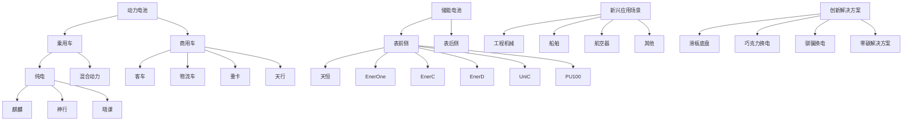
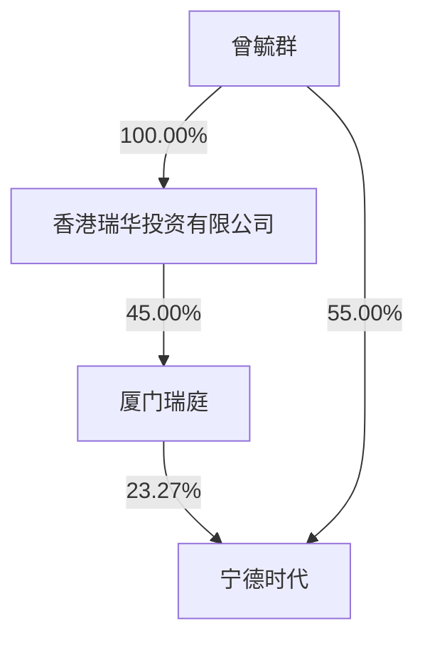

## CATL

# 宁德时代新能源科技股份有限公司

# 2024 年年度报告

2025 年 03 月

## 第一节 重要提示、目录和释义

## 一、董事、监事、高级管理人员是否存在对年度报告内容存在异议或无法保证其真实、准确、完整的情况

□是 否

公司董事会、监事会及董事、监事、高级管理人员保证年度报告内容的真实、准确、完整，不存在虚假记载、误导性陈述或者重大遗漏，并承担个别和连带的法律责任。

公司负责人曾毓群先生、主管会计工作负责人及会计机构负责人郑舒先生声明：保证本年度报告中财务报告的真实、准确、完整。

所有董事均已出席了审议本报告的董事会会议。

## 二、非标准审计意见提示

□适用 不适用

## 三、内部控制重大缺陷提示

□适用 不适用

## 四、业绩大幅下滑或亏损的风险提示

□适用 不适用

## 五、对年度报告涉及未来计划等前瞻性陈述的风险提示

适用 □不适用

本报告中涉及的未来发展规划等前瞻性陈述不构成公司对投资者的实质承诺，敬请广大投资者理性投资，注意风险。

## 六、公司上市时未盈利且目前未实现盈利

□适用 不适用

## 七、公司是否需要遵守特殊行业的披露要求

适用 □不适用

公司需要遵守锂离子电池产业链相关行业的披露要求。

## 八、董事会审议的报告期利润分配预案或公积金转增股本预案

适用 □不适用

经公司第四届董事会第二次会议审议通过的 2024 年度利润分配预案为：本次年度现金分红及特别现金分红合计可派发的现金分红总额为 19,975,746,623.17 元，即以可参与分配的股本 4,387,403,387 股为基数，向全体股东每 10股派发现金分红 45.53元（含税）。2024年度，公司不实施资本公积金转增股本，不送红股。本次利润分配预案尚需提交公司股东会审议。

## 目录

第一节重要提示、目录和释义..

第二节公司简介和主要财务指标. 8

第三节管理层讨论与分析.

第四节公司治理.. . 42

第五节环境和社会责任.. 67

第六节重要事项... . 76

第七节股份变动及股东情况... . 95

第八节优先股相关情况. . 104

第九节债券相关情况.. . 105

第十节财务报告. . 110

## 备查文件目录

一、载有公司法定代表人签字的 2024年年度报告原件。  
二、载有公司负责人、主管会计工作负责人、会计机构负责人签名并盖章的财务报表。  
三、载有会计师事务所盖章、注册会计师签名并盖章的审计报告原件。  
四、报告期内在中国证监会指定网站上公开披露过的所有公司文件的正本及公告的原稿。

以上备查文件的备置地点：公司住所（福建省宁德市蕉城区漳湾镇新港路 2 号）及深圳证券交易所（http://www.szse.cn/）。

释义

<table><tr><td>释义项</td><td>指</td><td>释义内容</td></tr><tr><td>本公司、公司、宁德时代</td><td>指</td><td>宁德时代新能源科技股份有限公司</td></tr><tr><td>厦门瑞庭</td><td>指</td><td>公司控股股东,厦门瑞庭投资有限公司</td></tr><tr><td>厦门时代</td><td>指</td><td>公司合并报表子公司,厦门时代新能源科技有限公司</td></tr><tr><td>宜春时代</td><td>指</td><td>公司合并报表子公司,宜春时代新能源科技有限公司</td></tr><tr><td>贵州时代</td><td>指</td><td>公司合并报表子公司,宁德时代(贵州)新能源科技有限公司</td></tr><tr><td>三江时代</td><td>指</td><td>公司合并报表子公司,宜宾三江时代新能源科技有限公司</td></tr><tr><td>江苏时代</td><td>指</td><td>公司合并报表子公司,江苏时代新能源科技有限公司</td></tr><tr><td>中州时代</td><td>指</td><td>公司合并报表子公司,中州时代新能源科技有限公司</td></tr><tr><td>时代广汽</td><td>指</td><td>公司合并报表子公司,时代广汽动力电池有限公司</td></tr><tr><td>时代绿能</td><td>指</td><td>公司合并报表子公司,时代绿色能源有限公司</td></tr><tr><td>广东邦普</td><td>指</td><td>公司合并报表子公司,广东邦普循环科技有限公司</td></tr><tr><td>SNE Research</td><td>指</td><td>韩国新能源领域咨询公司,提供电池行业全球市场研究和咨询服务</td></tr><tr><td>Net Zero Tracker</td><td>指</td><td>由 the Energy &amp; Climate Intelligence Unit (ECIU)、the Data-Driven EnviroLab (DDL)、NewClimate Institute 和 Oxford Net Zero 共同开展的国际合作项目,旨在提高国家、地区、城市及公司净零排放目标承诺的责任度及透明度。</td></tr><tr><td>ESG</td><td>指</td><td>Environment、Social and Governance,环境、社会与公司治理</td></tr><tr><td>中国证监会</td><td>指</td><td>中国证券监督管理委员会</td></tr><tr><td>深交所</td><td>指</td><td>深圳证券交易所</td></tr><tr><td>中登公司</td><td>指</td><td>中国证券登记结算有限责任公司深圳分公司</td></tr><tr><td>巨潮资讯网</td><td>指</td><td>http://www.cninfo.com.cn</td></tr><tr><td>动力电池系统</td><td>指</td><td>动力电池里的电芯、模组/电箱、电池包</td></tr><tr><td>储能电池系统</td><td>指</td><td>储能电池里的电芯、模组/电箱、电池柜</td></tr><tr><td>CTP</td><td>指</td><td>电芯一电池包,一种将电芯直接集成到电池包的技术,不需要通过模组</td></tr><tr><td>CTC</td><td>指</td><td>电芯一底盘,一种将电芯直接集成到整车底盘的技术,不需要通过模组或电池包</td></tr><tr><td>NEV</td><td>指</td><td>新能源汽车,包括电动汽车和氢燃料等新型燃料电池车</td></tr><tr><td>BEV</td><td>指</td><td>英文:battery electric vehicle中文:纯电动车</td></tr><tr><td>PHEV</td><td>指</td><td>英文:Plug-in hybrid electric vehicle中文:插电式混合动力车</td></tr><tr><td>HEV</td><td>指</td><td>英文:hybrid electric vehicle中文:混合动力车</td></tr><tr><td>DPPB</td><td>指</td><td>十亿分之一的失效率,制造过程中的质量度量标准</td></tr><tr><td>DPPM</td><td>指</td><td>百万分之一的失效率,制造过程中的质量度量标准</td></tr><tr><td>GWh</td><td>指</td><td>吉瓦时,一种电能单位, $1GWh=10$ 亿瓦时</td></tr><tr><td>MWh</td><td>指</td><td>兆瓦时,一种电能单位, $1MWh=1$ 百万瓦时</td></tr><tr><td>TWh</td><td>指</td><td>太瓦时,一种电能单位, $1TWh=10$ 亿千瓦时</td></tr><tr><td>报告期</td><td>指</td><td>2024年1月1日至2024年12月31日</td></tr></table>

注：本报告中若出现总数与各分项数值之和尾数不符的情况，均为四舍五入原因造成。

## 第二节 公司简介和主要财务指标

## 一、公司信息

<table><tr><td>股票简称</td><td>宁德时代</td><td>股票代码</td><td>300750</td></tr><tr><td>公司的中文名称</td><td colspan="3">宁德时代新能源科技股份有限公司</td></tr><tr><td>公司的中文简称</td><td colspan="3">宁德时代</td></tr><tr><td>公司的外文名称</td><td colspan="3">Contemporary Amperex Technology Co.,Ltd.</td></tr><tr><td>公司的外文名称缩写</td><td colspan="3">CATL</td></tr><tr><td>公司的法定代表人</td><td colspan="3">曾毓群</td></tr><tr><td>注册地址</td><td colspan="3">福建省宁德市蕉城区漳湾镇新港路2号</td></tr><tr><td>注册地址的邮政编码</td><td colspan="3">352100</td></tr><tr><td>公司注册地址历史变更情况</td><td colspan="3">无</td></tr><tr><td>办公地址</td><td colspan="3">福建省宁德市蕉城区漳湾镇新港路2号</td></tr><tr><td>办公地址的邮政编码</td><td colspan="3">352100</td></tr><tr><td>公司网址</td><td colspan="3">www.catl.com</td></tr><tr><td>电子信箱</td><td colspan="3">CATL-IR@catl.com</td></tr></table>

## 二、联系人和联系方式

<table><tr><td></td><td>董事会秘书</td><td>证券事务代表</td></tr><tr><td>姓名</td><td>蒋理</td><td>陈津</td></tr><tr><td>联系地址</td><td>福建省宁德市蕉城区漳湾镇新港路2号</td><td>福建省宁德市蕉城区漳湾镇新港路2号</td></tr><tr><td>电话</td><td>0593-8901666</td><td>0593-8901666</td></tr><tr><td>传真</td><td>0593-8901999</td><td>0593-8901999</td></tr><tr><td>电子信箱</td><td>CATL-IR@catl.com</td><td>CATL-IR@catl.com</td></tr></table>

## 三、信息披露及备置地点

<table><tr><td>公司披露年度报告的证券交易所网站</td><td>https://www.szse.cn/index/index.html</td></tr><tr><td>公司披露年度报告的媒体名称及网址</td><td>巨潮资讯网</td></tr><tr><td>公司年度报告备置地点</td><td>公司住所</td></tr></table>

## 四、其他有关资料

## 1、公司聘请的会计师事务所

<table><tr><td>会计师事务所名称</td><td>致同会计师事务所(特殊普通合伙)</td></tr><tr><td>会计师事务所办公地址</td><td>北京市朝阳区建国门外大街22号赛特广场5层</td></tr><tr><td>签字会计师姓名</td><td>殷雪芳、郑海霞</td></tr></table>

## 2、公司聘请的报告期内履行持续督导职责的保荐机构

适用 □不适用

<table><tr><td></td><td>保荐机构办公地址</td><td>保荐代表人姓名</td><td>持续督导期间</td></tr><tr><td>中信建投证券股份有限公司</td><td>北京市朝阳区景辉街16号院1号楼泰康集团大厦11层</td><td>吕晓峰、张帅</td><td>2020年8月4日-2024年12月31日</td></tr></table>

## 3、公司聘请的报告期内履行持续督导职责的财务顾问

□适用 不适用

## 五、主要会计数据和财务指标

公司是否需追溯调整或重述以前年度会计数据

是 □否

追溯调整或重述原因：2022年每股收益调整原因系公司 2023 年 4月完成资本公积金转增股本，对该指标进行重新计算。

<table><tr><td rowspan="2">项目</td><td rowspan="2">2024 年</td><td rowspan="2">2023 年</td><td rowspan="2">本年比上年增减</td><td colspan="2">2022 年</td></tr><tr><td>调整前</td><td>调整后</td></tr><tr><td>营业收入(千元)</td><td>362,012,554</td><td>400,917,045</td><td>-9.70%</td><td>328,593,988</td><td>328,593,988</td></tr><tr><td>归属于上市公司股东的净利润(千元)</td><td>50,744,682</td><td>44,121,248</td><td>15.01%</td><td>30,729,163</td><td>30,729,163</td></tr><tr><td>归属于上市公司股东的扣除非经常性损益的净利润(千元)</td><td>44,992,919</td><td>40,091,674</td><td>12.23%</td><td>28,213,098</td><td>28,213,098</td></tr><tr><td>经营活动产生的现金流量净额(千元)</td><td>96,990,345</td><td>92,826,124</td><td>4.49%</td><td>61,208,843</td><td>61,208,843</td></tr><tr><td>基本每股收益(元/股)</td><td>11.58</td><td>10.06</td><td>15.11%</td><td>12.92</td><td>7.18</td></tr><tr><td>稀释每股收益(元/股)</td><td>11.58</td><td>10.05</td><td>15.22%</td><td>12.88</td><td>7.16</td></tr><tr><td>加权平均净资产收益率</td><td>24.13%</td><td>24.04%</td><td>0.09%</td><td>24.67%</td><td>24.67%</td></tr><tr><td rowspan="2">项目</td><td rowspan="2">2024 年末</td><td rowspan="2">2023 年末</td><td rowspan="2">本年末比上年末增减</td><td colspan="2">2022 年末</td></tr><tr><td>调整前</td><td>调整后</td></tr><tr><td>资产总额(千元)</td><td>786,658,123</td><td>717,168,041</td><td>9.69%</td><td>600,952,352</td><td>600,952,352</td></tr><tr><td>归属于上市公司股东的净资产(千元)</td><td>246,930,033</td><td>197,708,052</td><td>24.90%</td><td>164,481,252</td><td>164,481,252</td></tr></table>

公司最近三个会计年度扣除非经常性损益前后净利润孰低者均为负值，且最近一年审计报告显示公司持续经营能力存在不确定性

□是 否

扣除非经常损益前后的净利润孰低者为负值

□是 否

## 六、分季度主要财务指标

单位：千元

<table><tr><td>项目</td><td>第一季度</td><td>第二季度</td><td>第三季度</td><td>第四季度</td></tr><tr><td>营业收入</td><td>79,770,779</td><td>86,996,055</td><td>92,277,915</td><td>102,967,805</td></tr><tr><td>归属于上市公司股东的净利润</td><td>10,509,923</td><td>12,355,064</td><td>13,136,086</td><td>14,743,608</td></tr><tr><td>归属于上市公司股东的扣除非经常性损益的净利润</td><td>9,247,439</td><td>10,806,502</td><td>12,122,470</td><td>12,816,508</td></tr><tr><td>经营活动产生的现金流量净额</td><td>28,357,911</td><td>16,351,044</td><td>22,734,647</td><td>29,546,744</td></tr></table>

上述财务指标或其加总数是否与公司已披露季度报告、半年度报告相关财务指标存在重大差异

□是 否

## 七、境内外会计准则下会计数据差异

## 1、同时按照国际会计准则与按照中国会计准则披露的财务报告中净利润和净资产差异情况

□适用 不适用

公司报告期不存在按照国际会计准则与按照中国会计准则披露的财务报告中净利润和净资产差异情况。

## 2、同时按照境外会计准则与按照中国会计准则披露的财务报告中净利润和净资产差异情况

□适用 不适用

公司报告期不存在按照境外会计准则与按照中国会计准则披露的财务报告中净利润和净资产差异情况。

## 八、非经常性损益项目及金额

适用 □不适用

单位：千元

<table><tr><td>项目</td><td>2024 年金额</td><td>2023 年金额</td><td>2022 年金额</td><td>说明</td></tr><tr><td>非流动性资产处置损益(包括已计提资产减值准备的冲销部分)</td><td>169,816</td><td>-235,944</td><td>264,713</td><td></td></tr><tr><td>除同公司正常经营业务相关的有效套期保值业务外,非金融企业持有金融资产和金融负债产生的公允价值变动损益以及处置金融资产和金融负债产生的损益</td><td>664,223</td><td>46,270</td><td>400,241</td><td></td></tr><tr><td>委托他人投资或管理资产的损益</td><td>179,608</td><td>26,759</td><td>52,937</td><td></td></tr><tr><td>单独进行减值测试的应收款项减值准备转回</td><td>2,687</td><td>62,339</td><td>32,781</td><td></td></tr><tr><td>除上述各项之外的其他营业外收入和支出</td><td>-612,613</td><td>195,751</td><td>-111,199</td><td></td></tr><tr><td>其他符合非经常性损益定义的损益项目</td><td>8,128,318</td><td>5,909,090</td><td>2,745,358</td><td></td></tr><tr><td>减:所得税影响额</td><td>1,665,244</td><td>1,194,027</td><td>689,187</td><td></td></tr><tr><td>少数股东权益影响额(税后)</td><td>1,115,034</td><td>780,664</td><td>179,578</td><td></td></tr><tr><td>合计</td><td>5,751,762</td><td>4,029,575</td><td>2,516,065</td><td>--</td></tr></table>

其他符合非经常性损益定义的损益项目的具体情况：

适用 □不适用

主要是部分股权投资的持股比例变动产生的投资收益、其他非流动金融资产投资分红收益及其他收益等。

将《公开发行证券的公司信息披露解释性公告第 1号——非经常性损益》中列举的非经常性损益项目界定为经常性损益项目的情况说明

□适用 不适用

公司不存在将《公开发行证券的公司信息披露解释性公告第 1号——非经常性损益》中列举的非经常性损益项目界定为经常性损益的项目的情形。

## 第三节 管理层讨论与分析

## 一、报告期内公司所处行业情况

## 1、公司行业分类

公司主要从事动力电池、储能电池和电池回收利用产品的研发、生产和销售。根据国家统计局发布的《国民经济行业分类与代码》（GB/T4754-2017），公司属于门类“C 制造业”中的大类“C38 电气机械和器材制造业”中的小类“C3841锂离子电池制造”。

## 2、行业发展状况及发展趋势

为应对全球气候变化的挑战，推进可持续发展，多个国家提出推动清洁能源转型及构建绿色低碳经济的战略。根据净零倡议组织 Net Zero Tracker 统计，目前全球已有 195 个国家和地区制定并公布了碳减排国家自主贡献目标，重点关注电力、交通、工业等主要碳排放领域。高品质的锂电池凭借高能量密度、长循环寿命、良好稳定性及安全性等性能优势，作为核心蓄能载体，在低碳社会及能源转型中扮演重要的角色，相关产业近年来快速发展。

## （1）动力电池行业

受益于新能源在售车型数量快速增加、智能化水平提升、充换电基础设施不断完善等因素，全球新能源车市场需求持续增长。国内市场，根据中国汽车工业协会数据，2024 年我国新能源乘用车销量为1,105 万辆，同比增长 40.2%，渗透率提升至 48.9%；新能源商用车销量为 53 万辆，同比增长 28.9%，渗透率提升至 17.9%。海外市场，根据欧洲汽车制造商协会数据，2024 年欧洲 31 国实现新能源乘用车注册量295万辆、渗透率为22.7%；根据美国汽车创新联盟数据，2024年前三季度美国新能源轻型车实现销量约114万辆、渗透率约10%。新能源车市场的快速发展、单车带电量的逐步提升带动动力电池市场增长，根据 SNE Research统计，2024年全球新能源车动力电池使用量达 894.4GWh，同比增长 27.2%。

## （2）储能行业

在全球可再生能源发展、储能成本下探、数据中心需求提升等因素驱动下，全球储能市场需求持续增长。国内市场，风电、光伏装机继续提升，根据国家能源局数据，2024 年我国风电光伏新增装机容量356.5GW，同比增长 21.8%；受益于政策支持且储能成本下降提升储能项目经济性，储能需求快速增长，根据中关村储能产业技术联盟统计，2024 年我国新型储能新增装机规模达 109.8GWh，同比增长 136%。海外市场，美国简化发电机组并网流程，并网节奏加快，带动配套储能需求增长；欧洲多国及海外其他地区不断出台支持政策，储能招标规模持续增长。此外，随着智能应用的快速发展，新型数据中心建设加速，成为储能市场发展的新动力。根据 SNE Research 统计，2024 年全球储能电池出货量 301GWh，同

比增长 62.7%。

## （3）电池材料及回收行业

随着动力电池、储能电池市场的持续增长，电池材料的需求也相应增长。根据SMM统计，2024年我国三元与磷酸铁锂正极材料合计产量达 302.7 万吨，同比增长 59.7%。此外，从废旧电池中提取可再生金属资源，已成为实现资源循环利用及推动电池材料行业可持续发展的重要途径。随着早期投放市场的锂电池逐渐进入退役期，退役电池的回收需求逐步提升，根据上海钢联数据，2024 年我国锂电池报废量达75.1万吨，同比增长 8.2%。

## 3、公司行业地位

公司是全球领先的动力电池和储能电池企业。根据SNE Research数据，在动力电池领域，公司 2017-2024 年连续 8年动力电池使用量排名全球第一，2024 年全球市占率为 37.9%，较第二名高出 20.7 个百分点；在储能领域，公司 2021-2024年连续 4年储能电池出货量排名全球第一，2024年全球市占率为 36.5%，较第二名高出 23.3个百分点。

## 4、主要法律法规及行业政策

2024年以来行业有关的主要法律法规及政策如下表所示：

<table><tr><td>时间</td><td>颁布单位</td><td>文件名称及主要内容</td></tr><tr><td>2024年3月</td><td>国务院</td><td>《推动大规模设备更新和消费品以旧换新行动方案》,开展汽车以旧换新,加大政策支持力度,畅通流通堵点,促进汽车梯次消费、更新消费。支持交通运输设备和老旧农业机械更新,持续推进城市公交车电动化替代,支持老旧新能源公交车和动力电池更新换代;加快淘汰国三及以下排放标准营运类柴油货车;加强电动、氢能等绿色航空装备产业化能力建设;加快高耗能高排放老旧船舶报废更新,大力支持新能源动力船舶发展,完善新能源动力船舶配套基础设施和标准规范,逐步扩大电动、液化天然气动力、生物柴油动力、绿色甲醇动力等新能源船舶应用范围。</td></tr><tr><td>2024年4月</td><td>国家能源局</td><td>《关于促进新型储能并网和调度运用的通知》,通过规范并网接入、优化调度方式、加强运行管理等措施,明确新型储能的功能定位和技术要求,持续完善新型储能调度机制,保障新型储能合理高效利用,有力支撑新型电力系统建设。</td></tr><tr><td>2024年5月</td><td>生态环境部、发改委、工信部等十五部门</td><td>《关于建立碳足迹管理体系的实施方案》,优先聚焦锂电池、新能源汽车、光伏和电子电器等重点产品,制定发布核算规则标准。力争在锂电池、新能源汽车、光伏和电子电器等领域推动制定产品碳足迹国际标准。</td></tr><tr><td>2024年6月</td><td>工信部</td><td>《锂离子电池行业规范条件(2024年本)》,引导企业加强技术创新、提高产品质量、降低生产成本。对动力电池、储能电池单体及电池组的能量密度、功率密度、循环寿命、容量保持率等产品性能指标进行了规定。</td></tr><tr><td>2024年6月</td><td>欧洲议会及理事会</td><td>Regulation (EU) 2024/1735《净零工业法案》,提出到2030年欧盟本土净零技术(如太阳能板、风力涡轮机、电池和热泵)制造产能达到部署需求的40%,到2040年欧盟在这些技术上达到世界产量的15%。法案规定了增加绿色技术投资的多项举措,包括简化战略性项目的许可程序、利用公共采购和可再生能源拍卖提升战略性技术产品的市场准入等。</td></tr><tr><td>2024年7月</td><td>欧洲议会及理事会</td><td>Regulation (EU) 2024/1747《欧盟电力市场改革方案》,为应对天然气价格导致电价上涨问题,欧盟电力市场改革旨在降低电价对波动的化石燃料价格的依赖,保护消费者不受价格飙升的影响,加快可再生能源等清洁电力的部署,激励清洁能源转型。关键举措包括:1、通过对长期购电协议(PPA)和差价合约的推广、可再生能源的投资建设,间接驱动储能发展;2、非化石灵活性支持系统“可用容量付费”,使灵活性资源充分满足清洁能源目标,或将直接增加储能机组收益,促进储能发展。</td></tr><tr><td>2024年9月</td><td>国家发改委、国家能源局</td><td>《关于推动车网互动规模化应用试点工作的通知》,按照“创新引导、先行先试”的原则,全面推广新能源汽车有序充电,扩大双向充放电(V2G)项目规模,丰富车网互动应用场景,以城市为主体完善规模化、可持续的车网互动政策机制,以V2G项目为主体探索技术先进、模式清晰、可复制推广的商业模式,力争以市场化机制引导车网互动规模化发展。参与试点的地区应全面执行充电峰谷分时电价,力争年度充电电量60%以上集中在低谷时段,其中通过私人桩充电的电量80%以上集中在低谷时段。参与试点的V2G项目放电总功率原则上不低于500千瓦,年度放电量不低于10万千瓦时,西部地区可适当降低。</td></tr><tr><td>2024年12月</td><td>国家发改委、国家能源局</td><td>《电力系统调节能力优化专项行动实施方案(2025—2027年)》,明确到2027年,通过调节能力的建设优化,支撑2025-2027年年均新增2亿千瓦以上新能源的合理消纳利用,全国新能源利用率不低于90%。优化选择适宜新型储能技术,高质量建设一批技术先进、发挥功效的新型储能电站。优化新型储能调度运行,发挥移峰填谷和顶峰发电作用,增强本地电力供应保障能力,实现应用尽用。在新能源消纳困难时段优先调度新型储能,实现日内应调尽调。完善调节资源参与市场机制,包括完善峰谷电价机制,建立健全调频、备用辅助服务市场体系,加快建立市场化容量补偿机制。</td></tr></table>

## 二、报告期内公司从事的主要业务

公司需遵守《深圳证券交易所上市公司自律监管指引第 4 号——创业板行业信息披露》中的“锂离子电池产业链相关业务”的披露要求。

## 1、主要业务

公司是全球领先的新能源创新科技公司，主要从事动力电池、储能电池的研发、生产、销售，以推动移动式化石能源替代、固定式化石能源替代，并通过电动化和智能化实现市场应用的集成创新。截至报告期末，公司已在全球设立六大研发中心、十三大电池生产制造基地，并覆盖全球最广泛的动力与储能客户群体。

公司在锂电池领域深耕多年，具备了全链条自主、高效的研发能力，在电池材料、电池系统、电池回收等产业链领域拥有核心技术优势及前瞻性研发布局，通过材料及材料体系创新、系统结构创新、绿色极限制造创新及商业模式创新为全球新能源应用提供一流的解决方案和服务，已形成全面、先进的产品矩阵，可应用于乘用车、商用车、表前储能、表后储能等领域，以及工程机械、船舶、航空器等新兴应用场景，能够全方位满足不同客户的多元化需求。

## 2、主要产品及其用途

公司致力于为全球新能源应用提供一流的动力电池和储能电池产品及相关创新解决方案，具体如下：

flowchart

## （1）动力电池系统

公司动力电池产品包括电芯、模组/电箱及电池包。公司可提供磷酸铁锂电池、三元高压中镍电池、三元高镍电池、钠离子电池、M3P 电池、凝聚态电池等覆盖不同能量密度区间的多种化学体系产品系列，能满足快充、长寿命、长续航、高安全、宽温度适应性等多种功能需求。公司根据应用领域及客户要求，通过定制或联合研发等方式设计个性化产品方案，以满足客户对产品性能的不同需求。

乘用车应用领域，公司产品可应用于 BEV、REV、PHEV、HEV 等不同细分市场，广泛应用于私家车、运营车等领域；商业应用领域，公司产品可应用于道路客运、城市配送、重载运输、道路清洁等客车及商用车领域。此外，公司产品还可应用于电动工具、电动两轮车等领域，具备高能量密度、高功率、高安全的特性。

## （2）储能电池系统

公司提供电芯、电池柜、储能集装箱以及交流侧系统等储能产品解决方案。公司的储能电池广泛应用于表前储能和表后储能领域，包括公用事业储能、工商业储能及数据中心储能等。

电芯产品方面，基于多样的应用场景和产品全周期的经济性，公司开发了多款发电侧、输配电侧储能专用电芯以及适用于用户侧的系列电芯，覆盖多种容量并兼具超长寿命、高安全、宽温度适应性等特性。

系统集成方面，在表前领域，公司依托智能液冷控温、高成组 CTP、无热扩散等技术，推出了户外液冷电池柜 EnerOne、EnerOnePlus 以及针对全气候场景的集装箱式液冷电池柜 EnerC、EnerCPlus、EnerD、EnerX。公司进一步推出了天恒储能系统，是全球首款 5 年功率与容量零衰减的产品，单箱能量高达6.25MWh，具有高安全、长寿命、高度集成等优势。在表后储能领域，公司产品已实现从低压、中压到高压平台的全场景覆盖。其中，UniC 系列产品具备长寿命、简运维、低辅源等特点，适配工商储能多元场景应用需求；PU100产品具备高安全、高功率、易维护等特点，可满足数据中心能源管理需求。

## （3）新兴应用领域及创新解决方案

除上述应用领域外，公司的动力电池的应用也不断拓展至工程机械、船舶、航空器等新兴应用场景。公司也持续推出创新解决方案，包括滑板底盘、针对乘用车领域的巧克力换电、针对重卡领域的骐骥换电解决方案等。

## （4）电池材料和回收

公司电池材料产品主要包括锂盐、前驱体及正极材料等。公司亦通过回收方式，对废旧电池中的镍、钴、锰、锂、磷、铁、铝、铜等金属材料及其他材料进行加工、提纯、合成等工艺，生产锂电池生产所需的正极材料、三元前驱体、磷铁前驱体、锂盐等材料，并将收集后的铜、铝等金属材料通过第三方回收利用，使电池生产所需的关键金属资源实现有效循环利用。

此外，为进一步保障电池生产所需的上游关键资源及材料供应，公司通过自建、参股、合资等多种方式参与锂、镍、钴、磷等电池矿产资源及相关产品的投资、建设及运营。

## 3、经营模式

公司拥有独立的研发、采购、生产和销售体系，主要通过销售动力电池、储能电池和电池材料等产品实现盈利。研发方面，公司建立了完备的研发体系，形成以自主研发为主、外部合作为辅的研发模式，通过数字化、智能化的方式，紧紧围绕材料及材料体系、系统结构、绿色极限制造及商业模式领域开展创新，以引领行业技术发展。采购方面，公司通过严格的评估和考核程序遴选合格供应商，并通过技术授权、长期协议、合资合作等方式与供应商紧密合作，以保证原料、设备的技术先进性、产品可靠性以及成本竞争力。生产销售方面，公司综合考虑市场情况以及客户需求安排生产。

报告期内，公司的主要经营模式未发生重大变化。

## 4、主要的业绩驱动因素

## （1）行业持续增长

动力电池方面，全球新能源车销量增长带动动力电池需求持续增长。根据 SNE Research 统计，2024年全球新能源车销量1,763万辆，同比增长26.1%，全球动力电池使用量达894.4GWh，同比增长27.2%。储能电池方面，在各国清洁能源转型目标推动下，随着风电光伏装机比例提升、电力系统灵活性要求提高、储能技术进步及系统成本下降，储能电池市场需求持续快速增长。根据 SNE Research 统计，2024 年全球储能电池出货量301GWh，同比增长62.7%。

## （2）公司竞争力进一步提升

公司坚持技术领先、服务优质、运营卓越的经营理念，致力于为全球客户提供一流产品及解决方案。

基于强大创新基因、深刻行业洞察、高效经营管理，公司在技术研发、极限制造、供应链管理、全球客户合作、可持续发展、新兴市场拓展等方面的竞争力进一步提升，推动业务稳健增长，为股东持续创造价值。

## 三、核心竞争力分析

## 1、全方位的研发优势

锂电池是全球绿色低碳与清洁能源转型的关键部件。研发并大规模生产兼具高安全、高性能、高质量、低成本等特性的锂电池门槛极高，不仅要求公司对电化学、热力学、分子动力学等多学科及覆盖微观、介观、宏观多尺度的基础理论有深刻的理解和综合应用能力，还要求公司具备强大的工艺设计、工程制造和质量管控的能力。

公司的团队深耕锂电行业多年，基于对分子动力学、电化学相场法、相图理论等研究方法和科学理论的理解，依托自身在锂电池行业的丰富经验与技术沉淀，形成了基于第一性原理的独特研发创新体系。截至报告期末，公司拥有六大研发中心，研发人员超过 2 万名。公司将安全、质量、成本贯穿全流程管理，自主研发了高通量材料集成计算、智能化电芯设计、智能化工艺设计等高效研发平台，并基于海量、多场景的客户及终端用户需求反哺研发设计，针对性地提升产品性能，优化产品方案，形成正向良性循环，打造全方位的研发优势。截至报告期末，公司拥有专利及专利申请合计达 43,354 项，其中境内拥有专利及专利申请 25,439项，境外拥有专利及专利申请 17,915项。

## 2、先进的产品矩阵

基于全方位的研发优势，公司已打造出行业内最全面、最先进的产品矩阵。公司产品具备高能量密度、长循环寿命、高充电倍率、宽温度适应性、高安全性等性能优势，广泛适用于乘用车、商用车、储能领域及新兴应用场景。

在乘用车领域，公司推出了以麒麟电池和神行电池为代表的系列产品，满足纯电乘用车用户对于充电速度、续航里程、功率等多元化需求，并针对混动乘用车用户的纯电续航里程短等需求痛点推出了骁遥电池；在商用车领域，公司推出了天行电池系列产品精准适配客车、物流车、重卡等商用车，有效解决商用车续航短、补能慢、寿命衰减快等行业痛点；在储能领域，公司推出的天恒储能系统是全球首款 5年功率与容量零衰减的产品，单箱能量达 6.25MWh，具有高安全、长寿命、高度集成等优势。

## 3、全面的客户合作

公司与全球知名车企、储能系统集成商、储能项目开发商或运营商等客户建立了长期且深度的战略合作，除产品销售外，还通过参股、合资、技术授权等方式与客户开展全面合作，助力客户打造全球领先 的 竞 争 力 。 公 司 的 车 企 客 户 包 括 BMW、Mercedes-Benz、Stellantis、Volkswagen、Ford、Toyota、

Hyundai、Honda、Volvo、上汽、吉利、蔚来、理想、宇通、小米等；公司的储能客户及合作方包括NextEra、Synergy、Wärtsilä、Excelsior、Jupiter Power、Flexgen、国家能源集团、国家电力投资集团、中国华能、中国华电、中石油等。截至报告期末，公司已实现动力电池累计装车超 1,700 万辆，储能电池在全球应用超 1,700个项目。

## 4、领先的可持续发展实践

公司高度重视可持续发展及履行社会责任，近年来ESG评级稳步上升，其中MSCI评级已达AA、标普企业可持续发展评估评分 58 分，均处于行业领先水平。我们于 2023 年发布了“零碳战略”，即 2025 年实现核心运营碳中和，2035 年实现价值链碳中和。为全方位推进零碳目标实现，公司对生产基地进行节能改造与可再生能源利用，积极推进零碳工厂建设与可再生能源项目开发，提升零碳电力使用比例。截至报告期末，公司核心运营零碳电力比例提升至 74.51%，已拥有 9 座“零碳工厂”，单位产品温室气体排放强度下降 20.97%。公司已建立覆盖全球的回收基地，形成了大规模、广泛的回收网络体系，具备 27万吨废旧电池年处理能力，镍钴锰金属回收率可达 99.6%，锂金属回收率可达93.8%。

## 四、主营业务分析

## 1、概述

报告期内，公司实现归属于上市公司股东的净利润 507.45 亿元，同比增长 15.01%。公司实现锂离子电池销量 475GWh，同比增长 21.79%，其中，动力电池系统销量 381GWh，同比增长 18.85%；储能电池系统销量 93GWh，同比增长 34.32%。

报告期内，公司主要经营情况如下：

## （1）持续推出创新产品

乘用车领域，公司在 2023 年发布神行 4C 超充电池的基础上发布神行 Plus 电池，可实现系统能量密度超200Wh/kg，是全球首个兼备1,000km续航以及4C超充特性的磷酸铁锂电池；推出新一代麒麟高功率电池，放电功率超 1,300kW，可助力新能源车实现零百加速 2秒以内；推出全球首款纯电续航达到 400公里以上，同时兼具 4C超充能力的骁遥增混电池，弥补增混车型充电补能效率慢的短板。

商用车领域，针对时效性高的物流与平台接单场景，推出天行 L-超充、天行 L-长续航，使用寿命可达 8年 80万公里；针对客车应用场景，推出天行客车版，使用寿命可达 15年 150万公里；针对重卡应用场景，推出天行电池重型商用车版本，使用寿命可达 15 年 300 万公里，在矿区、建筑工地等恶劣环境下保持可靠性和稳定性。

储能领域，公司发布了全球首款 5 年零衰减、单体 6.25MWh 的天恒储能系统，较上一代产品单位面积能量密度提升 30%，占地面积降低 20%，可进一步提升储能项目收益率；推出了 PU100 储能产品，可支持 6C 放电以满足 10-15 分钟紧急备用电源需求，同时还具备高安全、高功率、易维护等特点，持续助力数据中心能源管理。

## （2）不断升级创新解决方案

公司推出的新一代巧克力换电解决方案适配车型广，灵活性强，已在多款车型落地推广，与车企、运营商、金融机构、服务商等各方合作共同构建换电生态，通过快速换电大幅提升乘用车终端用户的补能效率和体验。公司推出的骐骥换电能够为重卡运输行业带来更环保、更经济、更高效的补能解决方案。公司推出的滑板底盘产品具备上下解耦、高度集成以及对外开放三大特征，助力合作伙伴进行个性化开发，促进联合创新和资源共享。公司推出的超安全磐石底盘在全球范围内首个通过“最高时速+最强冲击”的双重极限安全测试，可适配不同车型，显著缩短整车开发周期，开创电动车开发合作新生态。

## （3）全面深化客户合作

公司在各新能源领域积极推进全方位的深度客户合作。动力电池领域，公司与 Volvo、北京现代、猛士科技、江汽集团、临工重机、中国龙工、陕西交控、奇瑞商用车、上海国际港务集团、上海城投集团、山东重工集团、太原重型机械集团、陕汽商用车、厦门路桥等达成战略合作，与法国达飞海运集团签署合作协议，加深在乘用车、商用车、船舶等领域业务合作。储能电池领域，公司与Quinbrook、NextEra等签署战略合作协议、全面深化合作，与 Rolls-Royce 达成战略合作，拟将天恒储能系统引入欧盟和英国市场。

## （4）稳步推进全球产能建设

公司稳步推进电池产能建设以满足全球客户订单交付需求。国内方面，公司顺利推进中州基地、贵阳基地、厦门基地、济宁基地等建设，部分产线已投产并正在进行产能爬坡；海外方面，公司德国工厂产能逐渐提升，并获得大众汽车集团模组测试实验室及电芯测试实验室双认证，成为全球首家获得大众集团模组认证、欧洲首家获得大众集团电芯认证的电池制造商。此外，公司积极推进匈牙利工厂、与Stellantis合资的西班牙工厂以及印尼电池产业链项目的建设或筹建。

## （5）推进零碳科技产品与解决方案

基于公司在清洁能源领域的产品与技术优势，结合自身减碳经验，积极开发零碳科技产品与解决方案。报告期内，公司与山东东营市、江苏南京市、天津市、澳门特别行政区、横琴粤澳深度合作区等城市或地区签署战略合作协议，同时在海南、盐城、鄂尔多斯、宁德等地开展零碳试点示范，推动公司绿电直供、源网荷储微电网以及构网型储能等相关创新和示范项目落地。公司通过打造零碳城市建设方案，与各界合作伙伴共同推动新能源产品绿色智造、新能源投资开发、交通电动化及基础设施建设、电池回收及梯次利用等领域合作发展，推动各领域绿色低碳转型。

## 2、收入与成本

## （1）营业收入构成

## 1）营业收入整体情况

单位：千元

<table><tr><td rowspan="2">项目</td><td colspan="2">2024 年</td><td colspan="2">2023 年</td><td rowspan="2">同比增减</td></tr><tr><td>金额</td><td>占营业收入比重</td><td>金额</td><td>占营业收入比重</td></tr><tr><td>营业收入合计</td><td>362,012,554</td><td>100.00%</td><td>400,917,045</td><td>100.00%</td><td>-9.70%</td></tr><tr><td colspan="6">分行业</td></tr><tr><td>电气机械及器材制造业</td><td>356,519,551</td><td>98.48%</td><td>393,182,894</td><td>98.07%</td><td>-9.32%</td></tr><tr><td>采选冶炼行业</td><td>5,493,003</td><td>1.52%</td><td>7,734,151</td><td>1.93%</td><td>-28.98%</td></tr><tr><td colspan="6">分产品</td></tr><tr><td>动力电池系统</td><td>253,041,337</td><td>69.90%</td><td>285,252,917</td><td>71.15%</td><td>-11.29%</td></tr><tr><td>储能电池系统</td><td>57,290,460</td><td>15.83%</td><td>59,900,522</td><td>14.94%</td><td>-4.36%</td></tr><tr><td>电池材料及回收</td><td>28,699,935</td><td>7.93%</td><td>33,602,284</td><td>8.38%</td><td>-14.59%</td></tr><tr><td>电池矿产资源</td><td>5,493,003</td><td>1.52%</td><td>7,734,151</td><td>1.93%</td><td>-28.98%</td></tr><tr><td>其他业务</td><td>17,487,818</td><td>4.83%</td><td>14,427,171</td><td>3.60%</td><td>21.21%</td></tr><tr><td colspan="6">分地区</td></tr><tr><td>境内</td><td>251,677,045</td><td>69.52%</td><td>269,924,895</td><td>67.33%</td><td>-6.76%</td></tr><tr><td>境外</td><td>110,335,509</td><td>30.48%</td><td>130,992,150</td><td>32.67%</td><td>-15.77%</td></tr></table>

## 2）公司需遵守《深圳证券交易所上市公司自律监管指引第 4号——创业板行业信息披露》中的“锂离子电池产业链相关业务”的披露要求

报告期内上市公司从事锂离子电池产业链相关业务的海外销售收入占同期营业收入 30%以上

适用 □不适用

报告期内，公司销售境外的主要产品为电池系统，较上年同期相比未发生明显变化。公司境外收入 110,335,509千元，占本期营业收入 30.48%。公司主要业务地区的经营环境未发生重大变化，境外客户回款情况正常。

## （2）占公司营业收入或营业利润 10%以上的行业、产品、地区、销售模式的情况

适用 □不适用

公司需遵守《深圳证券交易所上市公司自律监管指引第 4号——创业板行业信息披露》中的“锂离子电池产业链相关业务”的披露要求

## 1）营业收入及营业成本整体情况

单位：千元

<table><tr><td>项目</td><td>营业收入</td><td>营业成本</td><td>毛利率</td><td>营业收入比上年同期增减</td><td>营业成本比上年同期增减</td><td>毛利率比上年同期增减</td></tr><tr><td colspan="7">分业务</td></tr><tr><td>电气机械及器材制造业</td><td>356,519,551</td><td>268,494,348</td><td>24.69%</td><td>-9.32%</td><td>-15.51%</td><td>5.51%</td></tr><tr><td>采选冶炼行业</td><td>5,493,003</td><td>5,024,611</td><td>8.53%</td><td>-28.98%</td><td>-18.93%</td><td>-11.33%</td></tr><tr><td colspan="7">分产品</td></tr><tr><td>动力电池系统</td><td>253,041,337</td><td>192,461,282</td><td>23.94%</td><td>-11.29%</td><td>-17.59%</td><td>5.81%</td></tr><tr><td>储能电池系统</td><td>57,290,460</td><td>41,914,003</td><td>26.84%</td><td>-4.36%</td><td>-13.98%</td><td>8.19%</td></tr><tr><td>电池材料及回收</td><td>28,699,935</td><td>25,682,916</td><td>10.51%</td><td>-14.59%</td><td>-13.75%</td><td>-0.87%</td></tr><tr><td>电池矿产资源</td><td>5,493,003</td><td>5,024,611</td><td>8.53%</td><td>-28.98%</td><td>-18.93%</td><td>-11.33%</td></tr><tr><td colspan="7">分地区</td></tr><tr><td>境内</td><td>251,677,045</td><td>195,678,188</td><td>22.25%</td><td>-6.76%</td><td>-10.50%</td><td>3.24%</td></tr><tr><td>境外</td><td>110,335,509</td><td>77,840,771</td><td>29.45%</td><td>-15.77%</td><td>-26.12%</td><td>9.88%</td></tr></table>

## 2）公司主营业务数据统计口径在报告期发生调整的情况下，公司最近 1年按报告期末口径调整后的主营业务数据

□适用 不适用

## 3）锂离子电池产业链各环节主要产品或业务相关的关键技术或性能指标

适用□不适用

<table><tr><td rowspan="2">产品种类</td><td rowspan="2">技术路线</td><td rowspan="2">主要产品类型</td><td colspan="4">技术参数情况</td><td rowspan="2">下游主要应用领域</td></tr><tr><td>电芯质量能量密度</td><td>倍率性能</td><td>循环寿命</td><td>安全性</td></tr><tr><td rowspan="3">三元锂离子电池</td><td rowspan="3">正极材料为镍钴锰的锂离子电池</td><td rowspan="2">方形</td><td>220~310Wh/kg</td><td>1~5C</td><td>2,000~6,000次</td><td rowspan="2">满足GB38031、UN38.3、ECE R100.3等标准</td><td rowspan="2">乘用车、商用车</td></tr><tr><td>HEV: 100~130Wh/kg</td><td>HEV: 1C~50C</td><td>HEV: 20,000次</td></tr><tr><td>软包、圆柱</td><td>180-350Wh/kg</td><td>1C~17C</td><td>200-4,000次</td><td>便携式储能: 满足GB31241等标准; 消费无人机: 满足IEC62133 2012/2017等标准;电动工具:(软包)满足IEC 62133 2012/2017、UL1642、IEC62133、UN38.3等标准;电动摩托车: 满足GB/T 36672等标准</td><td>便携式储能、消费无人机、电动工具、电动摩托车等</td></tr><tr><td>磷酸铁锂电池</td><td>正极材料为磷酸铁锂的锂离子电池</td><td>方形、圆柱软包</td><td>180~200Wh/kg140-190Wh/kg</td><td>0.25C~4C0.5C~6C</td><td>4,000-15,000次2,000-15,000次</td><td>乘用车、商用车: 满足GB38031、GB38032、UN38.3、ECE R100.3等标准储能系统: 满足GB/T36276、UN38.3, UL9540A、UL1973、IEC62619等标准电动船舶: 满足《船舶应用电池动力规范》、UN38.3等标准电动自行车: 满足GB/T36972、UN38.3等标准家庭储能:满足GB31241等标准;工商业储能:满足GB31241等标准;UPS:满足GB31241等标准;电动自行车:满足GB/T36972等标准</td><td>乘用车、商用车、储能系统、电动船舶、电动自行车等便携式储能、家庭储能、工商业储能、UPS等</td></tr></table>

## 4）占公司最近一个会计年度销售收入 30%以上产品的销售均价较期初变动幅度超过 30%的

□适用 不适用

## 5）不同产品或业务的产销情况

<table><tr><td>项目</td><td>产能</td><td>在建产能</td><td>产能利用率</td><td>产量</td></tr><tr><td>电池系统(GWh)</td><td>676</td><td>219</td><td>76.33%</td><td>516</td></tr></table>

## （3）公司实物销售收入是否大于劳务收入

是 □否

<table><tr><td>行业分类</td><td>项目</td><td>单位</td><td>2024年</td><td>2023年</td><td>同比增减</td></tr><tr><td rowspan="3">电池系统</td><td>销售量</td><td>GWh</td><td>475</td><td>390</td><td>21.79%</td></tr><tr><td>生产量</td><td>GWh</td><td>516</td><td>389</td><td>32.65%</td></tr><tr><td>库存量</td><td>GWh</td><td>106</td><td>70</td><td>51.43%</td></tr></table>

相关数据同比发生变动 30%以上的原因说明

适用 □不适用

国内外新能源行业持续增长，公司新技术、新产品陆续落地，海外市场拓展加速，客户合作关系进一步深化，公司产品产销两旺。

## （4）公司已签订的重大销售合同、重大采购合同截至本报告期的履行情况

## 1）已签订的重大销售合同截至本报告期的履行情况

适用 □不适用

单位：千元

<table><tr><td>合同标的</td><td>对方当事人</td><td>合同总金额</td><td>本报告期履行金额</td><td>待履行金额</td><td>本期确认的销售收入金额</td><td>应收账款回款情况</td><td>是否正常履行</td><td>影响重大合同履行的各项条件是否发生重大变化</td><td>是否存在合同无法履行的重大风险</td><td>合同未正常履行的说明</td></tr><tr><td>锂离子动力电池供应</td><td>客户A</td><td>-</td><td>54,173,399</td><td>-</td><td>54,173,399</td><td>正常回款</td><td>是</td><td>否</td><td>否</td><td>不适用</td></tr></table>

说明：

1、 基于双方保密协议约定，不便披露客户具体名称；  
2、 该重大销售合同未明确约定合同总金额，最终销售金额以客户后续发出的订单方式确定。

## 2）已签订的重大采购合同截至本报告期的履行情况

□适用 不适用

## （5）营业成本构成

单位：千元

<table><tr><td rowspan="2">行业分类</td><td rowspan="2">项目</td><td colspan="2">2024年</td><td colspan="2">2023年</td><td rowspan="2">同比增减</td></tr><tr><td>金额</td><td>占主营业务成本比重</td><td>金额</td><td>占主营业务成本比重</td></tr><tr><td>电池行业</td><td>直接材料</td><td>202,723,479</td><td>76.48%</td><td>255,662,877</td><td>80.33%</td><td>-3.86%</td></tr></table>

## （6）报告期内合并范围是否发生变动

是 □否

<table><tr><td>公司名称</td><td>报告期内取得和处置子公司方式</td><td>对整体生产经营和业绩的影响</td></tr><tr><td>成都青白江时代新能品牌管理有限公司</td><td>设立</td><td>无重大影响</td></tr><tr><td>鄂尔多斯市时代可再生能源发展有限公司</td><td>设立</td><td>无重大影响</td></tr><tr><td>广东邦普设计有限公司</td><td>设立</td><td>无重大影响</td></tr><tr><td>贵州时代化工有限公司</td><td>设立</td><td>无重大影响</td></tr><tr><td>杭州时代电服科技有限公司</td><td>设立</td><td>无重大影响</td></tr><tr><td>宁德时代(无锡)智慧交通科技有限公司</td><td>设立</td><td>无重大影响</td></tr><tr><td>宁普时代电池科技有限公司下属14家子公司</td><td>设立</td><td>无重大影响</td></tr><tr><td>上海酝电智能科技有限公司</td><td>设立</td><td>无重大影响</td></tr><tr><td>深圳市时代新能源供应链有限公司</td><td>设立</td><td>无重大影响</td></tr><tr><td>厦门实证储能科技研究院有限公司</td><td>设立</td><td>无重大影响</td></tr><tr><td>时代北汽(北京)新能源科技有限公司</td><td>设立</td><td>无重大影响</td></tr><tr><td>时代绿色能源有限公司下属43家项目子公司</td><td>设立</td><td>无重大影响</td></tr><tr><td>时代电服(江苏)科技有限公司</td><td>设立</td><td>无重大影响</td></tr><tr><td>Ampace Corporation(新能安科技公司)</td><td>设立</td><td>无重大影响</td></tr><tr><td>Brunp Recycling Technology Hungary Limited Liability Company(邦普循环科技(匈牙利)有限责任公司)</td><td>设立</td><td>无重大影响</td></tr><tr><td>CATL Operation Service Thuringia GmbH &amp; Co.KG(德国时代新能源科技运营服务(图林根)有限两合公司)</td><td>设立</td><td>无重大影响</td></tr><tr><td>CATL Thuringia Trust GmbH(德国时代新能源科技信托(图林根)有限公司)</td><td>设立</td><td>无重大影响</td></tr><tr><td>Contemporary Amperex Technology Australia Pty. Ltd.(澳洲时代新能源有限公司)</td><td>设立</td><td>无重大影响</td></tr><tr><td>Contemporary Amperex Technology Treasury Management (Hong Kong)Limited(宁德时代财资管理(香港)有限公司)</td><td>设立</td><td>无重大影响</td></tr><tr><td>PT. Contemporary Brunp Indonesia(印尼邦普时代有限公司)</td><td>设立</td><td>无重大影响</td></tr><tr><td>PT. Contemporary Ampere Technology Indonesia(印尼时代科技有限公司)</td><td>设立</td><td>无重大影响</td></tr><tr><td>PT. Contemporary Amperex Technology Indonesia Battery(印尼时代新能源科技有限公司)</td><td>设立</td><td>无重大影响</td></tr><tr><td>PT. Contemporary Energy Solution Indonesia(印尼时代新能源方案有限公司)</td><td>设立</td><td>无重大影响</td></tr><tr><td>宁普时代电池科技有限公司及其下属21家子公司</td><td>非同一控制下合并</td><td>无重大影响</td></tr><tr><td>亳州西甲新能源有限公司</td><td>非同一控制下合并</td><td>无重大影响</td></tr><tr><td>溧阳润福新能源有限公司(原名溧阳乐叶光伏能源有限公司)</td><td>非同一控制下合并</td><td>无重大影响</td></tr><tr><td>Ampace GmbH(德国新能安科技有限公司)</td><td>非同一控制下合并</td><td>无重大影响</td></tr><tr><td>CATTAT AG(奥地利时代新能源科技股份有限公司)</td><td>非同一控制下合并</td><td>无重大影响</td></tr><tr><td>东风时代(武汉)电池系统有限公司</td><td>转让</td><td>无重大影响</td></tr><tr><td>宁普时代数字科技(大连)有限公司</td><td>注销</td><td>无重大影响</td></tr><tr><td>宁普时代数字科技(包头昆都仑区)有限公司</td><td>注销</td><td>无重大影响</td></tr><tr><td>时代绿色能源有限公司下属7家项目子公司</td><td>注销</td><td>无重大影响</td></tr><tr><td>时代电服科技(辽源)有限公司</td><td>注销</td><td>无重大影响</td></tr><tr><td>宜春时代骐骥数字科技有限公司</td><td>注销</td><td>无重大影响</td></tr><tr><td>Singapore Brunp Contemporary Energy PTE.LTD(新加坡邦普时代能源有限公司)</td><td>注销</td><td>无重大影响</td></tr><tr><td>Singapore Brunp Contemporary Holding PTE.LTD(新加坡邦普时代控股有限公司)</td><td>注销</td><td>无重大影响</td></tr></table>

## （7）公司报告期内业务、产品或服务发生重大变化或调整有关情况

□适用 不适用

## （8）主要销售客户和主要供应商情况

1）公司主要销售客户情况

<table><tr><td>前五名客户合计销售金额(千元)</td><td>134,064,232</td></tr><tr><td>前五名客户合计销售金额占年度销售总额比例</td><td>37.03%</td></tr><tr><td>前五名客户销售额中关联方销售额占年度销售总额比例</td><td>0.00%</td></tr></table>

公司前 5大客户资料

<table><tr><td>序号</td><td>客户名称</td><td>销售额(千元)</td><td>占年度销售总额比例</td></tr><tr><td>1</td><td>第一名</td><td>54,173,399</td><td>14.96%</td></tr><tr><td>2</td><td>第二名</td><td>27,868,873</td><td>7.70%</td></tr><tr><td>3</td><td>第三名</td><td>22,441,092</td><td>6.20%</td></tr><tr><td>4</td><td>第四名</td><td>17,447,788</td><td>4.82%</td></tr><tr><td>5</td><td>第五名</td><td>12,133,080</td><td>3.35%</td></tr><tr><td>合计</td><td>--</td><td>134,064,232</td><td>37.03%</td></tr></table>

2）公司主要供应商情况

<table><tr><td>前五名供应商合计采购金额(千元)</td><td>44,342,120</td></tr><tr><td>前五名供应商合计采购金额占年度采购总额比例</td><td>16.33%</td></tr><tr><td>前五名供应商采购额中关联方采购额占年度采购总额比例</td><td>0.00%</td></tr></table>

公司前 5名供应商资料

<table><tr><td>序号</td><td>供应商名称</td><td>采购额(千元)</td><td>占年度采购总额比例</td></tr><tr><td>1</td><td>第一名</td><td>16,264,222</td><td>5.99%</td></tr><tr><td>2</td><td>第二名</td><td>9,058,659</td><td>3.34%</td></tr><tr><td>3</td><td>第三名</td><td>8,218,966</td><td>3.03%</td></tr><tr><td>4</td><td>第四名</td><td>5,781,185</td><td>2.13%</td></tr><tr><td>5</td><td>第五名</td><td>5,019,088</td><td>1.85%</td></tr><tr><td>合计</td><td>--</td><td>44,342,120</td><td>16.33%</td></tr></table>

## 3、费用

单位：千元

<table><tr><td>项目</td><td>2024 年</td><td>2023 年</td><td>同比增减</td><td>重大变动说明</td></tr><tr><td>销售费用</td><td>3,562,797</td><td>3,042,744</td><td>17.09%</td><td></td></tr><tr><td>管理费用</td><td>9,689,839</td><td>8,461,824</td><td>14.51%</td><td></td></tr><tr><td>财务费用</td><td>-4,131,918</td><td>-4,927,697</td><td>-16.15%</td><td></td></tr><tr><td>研发费用</td><td>18,606,756</td><td>18,356,108</td><td>1.37%</td><td></td></tr></table>

## 4、研发投入

## （1）主要研发项目

<table><tr><td>主要研发项目名称</td><td>项目目的</td><td>项目进展</td><td>拟达到的目标</td><td>预计对公司未来发展的影响</td></tr><tr><td>麒麟电池</td><td>提升能量密度、快充性能、放电倍率</td><td>产品已发布,与客户推进落地中</td><td>助力新能源车实现长续航和快速补能</td><td>增强产品竞争力,为客户提供更高性能产品</td></tr><tr><td>神行电池</td><td>提升能量密度、快充性能</td><td>产品已发布,与客户推进落地中</td><td>助力新能源车实现快速补能</td><td>提升新能源车在补能便利性和低温用车体验的竞争力</td></tr><tr><td>骁遥电池</td><td>解决增混车型纯电续航短、低温性能差、充电速度慢、亏电动力差等痛点</td><td>产品已发布,与客户推进落地中</td><td>抢占高速增长的增混市场</td><td>提升公司混动业务市场竞争力</td></tr><tr><td>天行电池</td><td>实现能量密度、快充、寿命、低温、安全等性能全面提升</td><td>产品已发布,与客户推进落地中</td><td>助力商用车实现长续航、长寿命、快速补能</td><td>提升公司新能源商用车业务竞争力</td></tr><tr><td>凝聚态电池</td><td>提升能量密度的同时,提升产品安全性能</td><td>产品已发布,与客户推进落地中</td><td>打造高比能、高安全电池产品</td><td>增强公司产品竞争力,通过创新为客户提供高性能产品</td></tr><tr><td>钠离子电池</td><td>推动电化学体系多元化,进一步降低电池成本,适用更丰富应用场景</td><td>第一代产品已实现量产,正推进第二代产品开发</td><td>推动钠离子电池产业化,发挥特定应用场景使用优势</td><td>突破现有锂离子体系的创新电池,为客户提供差异化产品</td></tr><tr><td>一体化底盘</td><td>为客户提供新能源动力底盘系统解决方案</td><td>产品已发布,与客户推进落地中</td><td>适配不同车型,支持整车平行开发</td><td>为客户缩短整车开发周期,开创电动车开发合作新生态</td></tr></table>

## （2）公司研发人员情况

<table><tr><td></td><td>2024 年</td><td>2023 年</td><td>变动比例</td></tr><tr><td>研发人员数量(人)</td><td>20,346</td><td>20,604</td><td>-1.25%</td></tr><tr><td>研发人员数量占比</td><td>15.42%</td><td>17.75%</td><td>-2.33%</td></tr><tr><td colspan="4">研发人员学历</td></tr><tr><td>本科</td><td>8,247</td><td>7,937</td><td>3.91%</td></tr><tr><td>硕士</td><td>5,083</td><td>3,913</td><td>29.90%</td></tr><tr><td>博士</td><td>573</td><td>361</td><td>58.73%</td></tr><tr><td colspan="4">研发人员年龄构成</td></tr><tr><td>30岁以下</td><td>10,408</td><td>10,419</td><td>-0.11%</td></tr><tr><td>30~40岁</td><td>8,830</td><td>9,022</td><td>-2.13%</td></tr><tr><td>40岁以上</td><td>1,108</td><td>1,163</td><td>-4.73%</td></tr></table>

公司研发人员构成发生重大变化的原因及影响

□适用 不适用

## （3）近三年公司研发投入金额及占营业收入的比例

<table><tr><td>项目</td><td>2024 年</td><td>2023 年</td><td>2022 年</td></tr><tr><td>研发投入金额(千元)</td><td>18,606,756</td><td>18,356,108</td><td>15,510,453</td></tr><tr><td>研发投入占营业收入比例</td><td>5.14%</td><td>4.58%</td><td>4.72%</td></tr></table>

研发投入总额占营业收入的比重较上年发生显著变化的原因

□适用 不适用

研发投入资本化率大幅变动的原因及其合理性说明

□适用 不适用

## 5、现金流

单位：千元

<table><tr><td>项目</td><td>2024 年</td><td>2023 年</td><td>同比增减</td></tr><tr><td>经营活动现金流入小计</td><td>444,879,417</td><td>446,407,497</td><td>-0.34%</td></tr><tr><td>经营活动现金流出小计</td><td>347,889,072</td><td>353,581,373</td><td>-1.61%</td></tr><tr><td>经营活动产生的现金流量净额</td><td>96,990,345</td><td>92,826,124</td><td>4.49%</td></tr><tr><td>投资活动现金流入小计</td><td>4,906,012</td><td>10,618,510</td><td>-53.80%</td></tr><tr><td>投资活动现金流出小计</td><td>53,781,323</td><td>39,806,275</td><td>35.11%</td></tr><tr><td>投资活动产生的现金流量净额</td><td>-48,875,311</td><td>-29,187,764</td><td>-67.45%</td></tr><tr><td>筹资活动现金流入小计</td><td>33,392,735</td><td>50,286,501</td><td>-33.60%</td></tr><tr><td>筹资活动现金流出小计</td><td>47,916,971</td><td>35,570,138</td><td>34.71%</td></tr><tr><td>筹资活动产生的现金流量净额</td><td>-14,524,236</td><td>14,716,363</td><td>-198.69%</td></tr><tr><td>现金及现金等价物净增加额</td><td>31,994,247</td><td>80,536,170</td><td>-60.27%</td></tr></table>

相关数据同比发生重大变动的主要影响因素说明

适用 □不适用

2024年，公司投资活动产生的现金流量净额较上年减少 197亿元，下降 67.45%，主要是收回股权投资现金减少及购买理财产品额增加；

2024年，公司筹资活动产生的现金流量净额较上年减少 292亿元，下降 198.69%，主要是现金分红金额增加及减少银行融资。

报告期内公司经营活动产生的现金净流量与本年度净利润存在重大差异的原因说明

□适用 不适用

## 五、非主营业务情况

单位：千元

<table><tr><td>项目</td><td>金额</td><td>占利润总额比例</td><td>形成原因说明</td><td>是否具有可持续性</td></tr><tr><td>投资收益</td><td>3,987,823</td><td>6.31%</td><td>部分参股公司净利润提升相应增加投资收益</td><td>否</td></tr><tr><td>公允价值变动损益</td><td>664,223</td><td>1.05%</td><td></td><td>否</td></tr><tr><td>资产减值</td><td>-8,423,325</td><td>-13.33%</td><td>固定资产、无形资产可回收金额低于账面价值计算的减值准备;存货成本高于其可变现净值计算的存货跌价准备</td><td>否</td></tr><tr><td>信用减值</td><td>-872,526</td><td>-1.38%</td><td>按照预计损失率计提的应收款项减值损失</td><td>否</td></tr><tr><td>营业外收入</td><td>135,422</td><td>0.21%</td><td></td><td>否</td></tr><tr><td>营业外支出</td><td>1,005,182</td><td>1.59%</td><td></td><td>否</td></tr><tr><td>其他收益</td><td>9,967,630</td><td>15.78%</td><td></td><td>否</td></tr></table>

## 六、资产及负债状况分析

## 1、资产构成重大变动情况

单位：千元

<table><tr><td rowspan="2">项目</td><td colspan="2">2024年末</td><td colspan="2">2024年初</td><td rowspan="2">比重增减</td><td rowspan="2">重大变动说明</td></tr><tr><td>金额</td><td>占总资产比例</td><td>金额</td><td>占总资产比例</td></tr><tr><td>货币资金</td><td>303,511,993</td><td>38.58%</td><td>264,306,515</td><td>36.85%</td><td>1.73%</td><td>无重大变化</td></tr><tr><td>应收账款</td><td>64,135,510</td><td>8.15%</td><td>64,020,533</td><td>8.93%</td><td>-0.78%</td><td>无重大变化</td></tr><tr><td>合同资产</td><td>400,626</td><td>0.05%</td><td>233,964</td><td>0.03%</td><td>0.02%</td><td>无重大变化</td></tr><tr><td>存货</td><td>59,835,533</td><td>7.61%</td><td>45,433,890</td><td>6.34%</td><td>1.27%</td><td>无重大变化</td></tr><tr><td>长期股权投资</td><td>54,791,525</td><td>6.97%</td><td>50,027,694</td><td>6.98%</td><td>-0.01%</td><td>无重大变化</td></tr><tr><td>固定资产</td><td>112,589,053</td><td>14.31%</td><td>115,387,960</td><td>16.09%</td><td>-1.78%</td><td>无重大变化</td></tr><tr><td>在建工程</td><td>29,754,703</td><td>3.78%</td><td>25,011,907</td><td>3.49%</td><td>0.29%</td><td>无重大变化</td></tr><tr><td>使用权资产</td><td>889,995</td><td>0.11%</td><td>377,934</td><td>0.05%</td><td>0.06%</td><td>无重大变化</td></tr><tr><td>短期借款</td><td>19,696,282</td><td>2.50%</td><td>15,181,012</td><td>2.12%</td><td>0.38%</td><td>无重大变化</td></tr><tr><td>合同负债</td><td>27,834,446</td><td>3.54%</td><td>23,982,352</td><td>3.34%</td><td>0.20%</td><td>无重大变化</td></tr><tr><td>长期借款</td><td>81,238,456</td><td>10.33%</td><td>83,448,982</td><td>11.64%</td><td>-1.31%</td><td>无重大变化</td></tr><tr><td>租赁负债</td><td>662,814</td><td>0.08%</td><td>283,296</td><td>0.04%</td><td>0.04%</td><td>无重大变化</td></tr><tr><td>其他非流动负债</td><td>5,400,795</td><td>0.69%</td><td>31,341,466</td><td>4.37%</td><td>-3.68%</td><td>终止确认授予少数股东回售权产生的义务</td></tr></table>

境外资产占比较高

□适用 不适用

## 2、以公允价值计量的资产和负债

单位：千元

<table><tr><td>项目</td><td>期初数</td><td>本期公允价值变动损益</td><td>计入权益的累计公允价值变动</td><td>本期计提的减值</td><td>本期购买金额</td><td>本期出售金额</td><td>其他变动</td><td>期末数</td></tr><tr><td colspan="9">金融资产</td></tr><tr><td>1.交易性金融资产(不含衍生金融资产)</td><td>7,767</td><td>192,135</td><td></td><td></td><td>14,231,073</td><td></td><td></td><td>14,282,253</td></tr><tr><td>2.衍生金融资产</td><td>-3,941,410</td><td></td><td>-2,116,017</td><td></td><td>87,900,883</td><td>132,592,114</td><td></td><td>-2,116,017</td></tr><tr><td>3.其他权益工具投资</td><td>14,128,318</td><td></td><td>432,997</td><td></td><td>1,110,724</td><td>350,649</td><td>171,423</td><td>11,900,901</td></tr><tr><td>4.其他非流动金融资产</td><td>2,816,190</td><td>472,089</td><td></td><td></td><td>195,000</td><td></td><td></td><td>3,135,658</td></tr><tr><td>5.应收款项融资</td><td>55,289,319</td><td></td><td>-118,073</td><td></td><td></td><td>2,161,397</td><td></td><td>53,309,701</td></tr><tr><td>金融资产小计</td><td>68,300,184</td><td>664,223</td><td>-1801,094</td><td></td><td>103,437,680</td><td>135,104,160</td><td>171,423</td><td>80,512,496</td></tr></table>

其他变动的内容：其他权益工具投资的其他变动由于对部分长期股权投资不再具有重大影响转入本项。  
报告期内公司主要资产计量属性是否发生重大变化

□是 否

## 3、截至报告期末的资产权利受限情况

单位：千元

<table><tr><td rowspan="2">项目</td><td colspan="4">期末</td></tr><tr><td>账面余额</td><td>账面价值</td><td>受限类型</td><td>受限原因</td></tr><tr><td>货币资金</td><td>23,339,555</td><td>23,339,555</td><td>质押</td><td>保证金及质押定期存款</td></tr><tr><td>应收票据</td><td>130,403</td><td>130,403</td><td>质押</td><td>已质押但尚未到期的应收票据</td></tr><tr><td>应收账款</td><td>2,028</td><td>2,000</td><td>质押</td><td>以应收账款作为质押取得银行综合授信及借款</td></tr><tr><td>固定资产</td><td>8,279,530</td><td>6,795,491</td><td>抵押</td><td>以机器设备及房屋建筑物作为抵押取得银行综合授信及借款</td></tr><tr><td>无形资产</td><td>1,657,548</td><td>1,550,127</td><td>抵押</td><td>以土地使用权作为抵押取得银行综合授信及借款</td></tr><tr><td>在建工程</td><td>334,977</td><td>334,977</td><td>抵押</td><td>以在建工程作为抵押物向银行取得借款</td></tr><tr><td>股权投资(含权益投资)</td><td>2,712,227</td><td>2,712,227</td><td>限售</td><td>限售股票</td></tr><tr><td>合计</td><td>36,456,268</td><td>34,864,780</td><td></td><td></td></tr></table>

## 七、投资状况分析

## 1、总体情况

适用 □不适用

<table><tr><td>报告期投资额(千元)</td><td>上年同期投资额(千元)</td><td>变动幅度</td></tr><tr><td>34,726,381</td><td>39,274,586</td><td>-11.58%</td></tr></table>

## 2、报告期内获取的重大的股权投资情况

□适用 不适用

## 3、报告期内正在进行的重大的非股权投资情况

适用 □不适用  
单位：千元

<table><tr><td>项目名称</td><td>投资方式</td><td>是否为固定资产投资</td><td>投资项目涉及行业</td><td>本报告期投入金额</td><td>截至报告期末累计实际投入金额</td><td>资金来源</td><td>项目进度</td><td>预计收益</td><td>截止报告期末累计实现的收益</td><td>未达到计划进度和预计收益的原因</td><td>披露日期(如有)</td><td>披露索引(如有)</td></tr><tr><td>宜昌邦普一体化电池材料产业园项目</td><td>自建</td><td>是</td><td>锂离子电池正极材料制造业</td><td>3,873,288</td><td>14,266,075</td><td>自有及自筹资金</td><td>建设中</td><td>不适用</td><td>不适用</td><td>尚在建设中</td><td>2021年10月12日</td><td>巨潮资讯网,公告编号:2021-100</td></tr><tr><td>印度尼西亚动力电池产业链项目</td><td>自建</td><td>是</td><td>电器机械及器材制造业</td><td>590,610</td><td>3,886,307</td><td>自有及自筹资金</td><td>建设中</td><td>不适用</td><td>不适用</td><td>尚在建设中</td><td>2022年4月15日</td><td>巨潮资讯网,公告编号:2022-012</td></tr><tr><td>厦门时代新能源电池产业基地项目</td><td>自建</td><td>是</td><td>电器机械及器材制造业</td><td>1,067,590</td><td>3,134,107</td><td>自有及自筹资金</td><td>建设中</td><td>不适用</td><td>不适用</td><td>尚在建设中</td><td>2022年4月21日</td><td>巨潮资讯网,公告编号:2022-030</td></tr><tr><td>山东时代新能源电池产业基地项目</td><td>自建</td><td>是</td><td>电器机械及器材制造业</td><td>1,627,468</td><td>1,997,927</td><td>自有及自筹资金</td><td>建设中</td><td>不适用</td><td>不适用</td><td>尚在建设中</td><td>2022年7月21日</td><td>巨潮资讯网,公告编号:2022-064</td></tr><tr><td>中州时代新能源电池产业基地项目</td><td>自建</td><td>是</td><td>电器机械及器材制造业</td><td>1,963,574</td><td>1,963,574</td><td>自有及自筹资金</td><td>建设中</td><td>不适用</td><td>不适用</td><td>尚在建设中</td><td>2022年9月28日</td><td>巨潮资讯网,公告编号:2022-103</td></tr><tr><td>匈牙利时代新能源电池产业基地项目</td><td>自建</td><td>是</td><td>电器机械及器材制造业</td><td>3,530,795</td><td>4,605,834</td><td>自有及自筹资金</td><td>建设中</td><td>不适用</td><td>不适用</td><td>尚在建设中</td><td>2022年8月13日</td><td>巨潮资讯网,公告编号:2022-070</td></tr><tr><td>合计</td><td>--</td><td>--</td><td>--</td><td>12,653,326</td><td>29,853,824</td><td>--</td><td>--</td><td>不适用</td><td>不适用</td><td>--</td><td>--</td><td>--</td></tr></table>

## 4、金融资产投资

## （1） 证券投资情况

适用 □不适用  
单位：千元

<table><tr><td>证券品种</td><td>证券代码</td><td>证券简称</td><td>最初投资成本</td><td>会计计量模式</td><td>期初账面价值</td><td>本期公允价值变动损益</td><td>计入权益的累计公允价值变动</td><td>本期购买金额</td><td>本期出售金额</td><td>报告期损益</td><td>期末账面价值</td><td>会计核算科目</td><td>资金来源</td></tr><tr><td>境内外股票</td><td>603993.SH</td><td>洛阳钼业</td><td>26,747,361</td><td>权益法</td><td>28,915,122</td><td></td><td></td><td></td><td></td><td>2,936,119</td><td>31,051,153</td><td>长期股权投资</td><td>自有</td></tr><tr><td>境内外股票</td><td>301358.SZ</td><td>湖南裕能</td><td>200,000</td><td>公允价值计量</td><td>2,031,776</td><td></td><td>2,512,227</td><td></td><td></td><td>25,016</td><td>2,712,227</td><td>其他权益工具投资</td><td>自有</td></tr><tr><td>境内外股票</td><td>300450.SZ</td><td>先导智能</td><td>2,500,000</td><td>权益法</td><td>2,873,903</td><td></td><td></td><td></td><td>772,907</td><td>63,584</td><td>1,994,933</td><td>长期股权投资</td><td>自有</td></tr><tr><td>境内外股票</td><td>ZK.NYSE</td><td>ZK</td><td>1,495,089</td><td>公允价值计量</td><td>1,723,137</td><td></td><td>-414,603</td><td>135,489</td><td></td><td></td><td>1,080,486</td><td>其他权益工具投资</td><td>自有</td></tr><tr><td>境内外股票</td><td>MDKA.IDX</td><td>MDKA</td><td>1,540,298</td><td>公允价值计量</td><td>1,495,509</td><td></td><td>-674,398</td><td></td><td></td><td></td><td>865,899</td><td>其他权益工具投资</td><td>自有</td></tr><tr><td>境内外股票</td><td>DIDIY.OTC</td><td>DIDIY</td><td>355,960</td><td>公允价值计量</td><td></td><td></td><td>69,269</td><td>355,960</td><td></td><td></td><td>425,229</td><td>其他权益工具投资</td><td>自有</td></tr><tr><td>境内外股票</td><td>09660.HK</td><td>地平线</td><td>326,245</td><td>公允价值计量</td><td>589,989</td><td></td><td>55,559</td><td></td><td></td><td></td><td>381,804</td><td>其他权益工具投资</td><td>自有</td></tr><tr><td>境内外股票</td><td>02245.HK</td><td>力勤资源</td><td>729,273</td><td>公允价值计量</td><td>275,147</td><td></td><td>-421,476</td><td></td><td></td><td>9,934</td><td>307,797</td><td>其他权益工具投资</td><td>自有</td></tr><tr><td>境内外股票</td><td>300712.SZ</td><td>永福股份</td><td>211,527</td><td>权益法</td><td>225,330</td><td></td><td>-</td><td></td><td></td><td>4,290</td><td>223,525</td><td>长期股权投资</td><td>自有</td></tr><tr><td>境内外股票</td><td>688531.SH</td><td>日联科技</td><td>48,600</td><td>公允价值计量</td><td>292,556</td><td></td><td>106,693</td><td></td><td>71,946</td><td>3,155</td><td>140,967</td><td>其他权益工具投资</td><td>自有</td></tr><tr><td colspan="3">期末持有的其他证券投资</td><td>465,392</td><td>--</td><td>479,601</td><td></td><td>-88,019</td><td></td><td>270,303</td><td>5,216</td><td>227,373</td><td>--</td><td>--</td></tr><tr><td colspan="3">合计</td><td>34,619,745</td><td>--</td><td>38,902,070</td><td></td><td>1,145,252</td><td>491,449</td><td>1,115,157</td><td>3,047,314</td><td>39,411,394</td><td>--</td><td>--</td></tr><tr><td colspan="3">证券投资审批董事会公告披露日期</td><td colspan="11">2020年8月10日、2021年4月26日</td></tr></table>

说明：权益法计量的证券投资，报告期损益金额包括投资变动产生的损益等。

## （2） 衍生品投资情况

适用 □不适用

## 1）报告期内以套期保值为目的的衍生品投资

适用 □不适用

单位：千元

<table><tr><td>衍生品投资类型</td><td>初始投资金额</td><td>期初金额</td><td>本期公允价值变动损益</td><td>计入权益的累计公允价值变动</td><td>报告期内购入金额</td><td>报告期内售出金额</td><td>期末金额</td><td>期末投资金额占公司报告期末净资产比例</td></tr><tr><td>商品</td><td>5,391,753</td><td>145,150</td><td></td><td>-2,962</td><td>5,336,022</td><td>4,900,743</td><td>445,396</td><td>0.18%</td></tr><tr><td>外汇</td><td>166,217,792</td><td>82,456,396</td><td></td><td>-2,113,055</td><td>82,577,633</td><td>127,694,836</td><td>36,324,037</td><td>14.71%</td></tr><tr><td>合计</td><td>171,609,545</td><td>82,601,545</td><td></td><td>-2,116,017</td><td>87,913,655</td><td>132,595,579</td><td>36,769,433</td><td>14.89%</td></tr><tr><td>报告期内套期保值业务的会计政策、会计核算具体原则,以及与上一报告期相比是否发生重大变化的说明</td><td colspan="8">无重大变化</td></tr><tr><td>报告期实际损益情况的说明</td><td colspan="8">为规避和防范主要产品价格及外汇汇率波动给公司带来的经营风险,公司按照一定比例,针对公司生产经营相关的产品、原材料及外汇开展套期保值、远期结售汇及外汇掉期等业务,业务规模均在预期的采购、销售业务规模内,具备明确的业务基础。报告期内,公司商品及外汇套期保值衍生品合约和现货盈亏相抵后的结果为略有盈利,套期业务实际损益金额合计1.34亿元。</td></tr><tr><td>套期保值效果的说明</td><td colspan="8">公司从事套期保值业务的金融衍生品和商品期货品种与公司生产经营相关的产品、原材料和外汇相挂钩,可抵消现货市场交易中存在的价格风险的交易活动,实现了预期风险管理目标。</td></tr><tr><td>衍生品投资资金来源</td><td colspan="8">自有及自筹资金</td></tr><tr><td>报告期衍生品持仓的风险分析及控制措施说明(包括但不限于市场风险、流动性风险、信用风险、操作风险、法律风险等)</td><td colspan="8">一、公司进行套期保值业务的风险分析通过套期保值操作可以规避商品价格波动、汇率波动对公司造成的影响,有利于公司的正常经营,但同时也可能存在一定风险:1、市场风险:期货、远期合约及其他衍生产品行情变动幅度较大,可能产生价格波动风险,造成套期保值损失;2、系统风险:全球性经济影响导致金融系统风险;3、技术风险:可能因为计算机系统不完备导致技术风险;4、操作风险:由于交易员主观臆断或不完善的操作造成错单,给公司带来损失;5、违约风险:由于对手出现违约,不能按照约定支付公司套期保值盈利而无法对冲公司实际的损失。二、公司进行套期保值的准备工作及风险控制措施1、公司已制定《套期保值业务内部控制及风险管理制度》,在整个套期保值操作过程中所有交易都将严格按照上述制度执行;2、为进一步加强期货、远期合约及其他衍生产品保值管理工作,健全和完善境外期货、远期合约及其他衍生产品运作程序,确保公司生产经营目标的实现,公司成立了套期保值领导小组、工作小组和风控小组,配备投资决策、业务操作、风险控制等专业人员,明确相应人员的职责;3、工作小组根据公司业务需求,对政治经济形势、产业发展、期货市场等情况进行综合研判分析,在董事会审议的套期保值计划范围内制定套期保值方案,提报领导小组审批。此外,工作小组实时关注市场走势、资金头寸等情况,发现异常情况及时报告领导小组,并定期向领导小组提交业务情况报告;4、公司领导小组对工作小组提报的具体套期保值方案进行审批后,将交易指令传达给工作小组,工作小组严格按照指令进行开、平仓,并将操作情况及时报告领导小组;5、风控小组在套期保值业务具体执行过程中,实时关注市场风险、资金风险、操作风险、基差风险等,及时监测、评估公司敞口风险。当出现市场波动风险及其他异常风险时,制定相应的风险控制方案,并及时报告领导小组。风控小组、审计部根据情况对套期保值业务的实际操作情况、资金使用情况及盈亏情况进行检查或审计。</td></tr><tr><td>已投资衍生品报告期内市场价格或产品公允价值变动的情况,对衍生品公允价值的分析应披露具体使用的方法及相关假设与参数的设定</td><td colspan="8">每月底根据外部金融机构的市场报价确定公允价值变动。</td></tr><tr><td>涉诉情况</td><td colspan="8">无</td></tr><tr><td>衍生品投资审批董事会公告披露日期</td><td colspan="8">2024年3月16日</td></tr><tr><td>衍生品投资审批股东会公告披露日期</td><td colspan="8">2024年4月19日</td></tr></table>

说明：  
1、以上“初始投资金额”为名义本金；  
2、截至 2024 年12 月31 日，公司开展套期保值业务使用的保证金余额为 42.48亿元，在公司董事会及股东大会审议的额度范围内；  
3、以上衍生品投资情况根据衍生品投资类型进行分类汇总披露。

## 2） 报告期内以投机为目的的衍生品投资

□适用 不适用

公司报告期不存在以投机为目的的衍生品投资。

## 5、募集资金使用情况

适用 □不适用

## （1）募集资金总体使用情况

适用 □不适用

单位：千元

<table><tr><td>募集年份</td><td>募集方式</td><td>证券上市日期</td><td>募集资金总额</td><td>募集资金净额(1)</td><td>本期已使用募集资金总额</td><td>已累计使用募集资金总额(2)</td><td>报告期末募集资金使用比例(3)=(2)/(1)</td><td>报告期内变更用途的募集资金总额</td><td>累计变更用途的募集资金总额</td><td>累计变更用途的募集资金总额比例</td><td>尚未使用募集资金总额</td><td>尚未使用募集资金用途及去向</td><td>闲置两年以上募集资金金额</td></tr><tr><td>2022年</td><td>向特定对象发行股票募集资金</td><td>2022年7月4日</td><td>45,000,000</td><td>44,870,113</td><td>2,826,583</td><td>37,668,391</td><td>83.95%</td><td>0</td><td>0</td><td>0.00%</td><td>7,946,247</td><td>存放于募集资金专户和现金管理</td><td>0</td></tr><tr><td>合计</td><td>--</td><td>--</td><td>45,000,000</td><td>44,870,113</td><td>2,826,583</td><td>37,668,391</td><td>83.95%</td><td>0</td><td>0</td><td>0.00%</td><td>7,946,247</td><td>--</td><td>0</td></tr><tr><td colspan="14">募集资金总体使用情况说明</td></tr><tr><td colspan="14">1、经中国证监会《关于同意宁德时代新能源科技股份有限公司向特定对象发行股票注册的批复》(证监许可〔2022〕901号)核准,公司向特定对象发行人民币普通股109,756,097股,募集资金总额人民币45,000,000千元,扣除各项发行费用人民币129,887千元(不含税),实际募集资金净额为人民币44,870,113千元。上述资金到位情况已由致同会计师事务所(特殊普通合伙)审验,并已于2022年6月21日出具“致同验字(2022)第351C000348号”《验资报告》。2、上述募集资金已经全部存放于募集资金专户管理,并与保荐机构、存放募集资金的商业银行签署了募集资金监管协议。3、截至2024年12月31日,公司已累计投入募集资金总额37,668,391千元,合计尚未使用募集资金7,946,247千元(含扣除手续费后的相关利息收入)。</td></tr></table>

## （2）募集资金承诺项目情况

适用 □不适用  
单位：千元

<table><tr><td>融资项目名称</td><td>证券上市日期</td><td>承诺投资项目和超募资金投向</td><td>项目性质</td><td>是否已变更项目(含部分变更)</td><td>募集资金承诺投资总额</td><td>调整后投资总额(1)</td><td>本报告期投入金额</td><td>截至期末累计投入金额(2)</td><td>截至期末投资进度(3)=(2)/(1)</td><td>项目达到预定可使用状态日期</td><td>本报告期实现的效益</td><td>截止报告期末累计实现的效益</td><td>是否达到预计效益</td><td>项目可行性是否发生重大变化</td></tr><tr><td colspan="15">承诺投资项目</td></tr><tr><td>2022年向特定对象发行股票项目</td><td>2022年7月4日</td><td>1.福鼎时代锂离子电池生产基地项目</td><td>生产建设</td><td>否</td><td>15,200,000</td><td>15,200,000</td><td>332,751</td><td>15,397,434</td><td>101.30%</td><td>2024年12月1日</td><td>8,221,086</td><td>14,380,448</td><td>是</td><td>否</td></tr><tr><td>2022年向特定对象发行股票项目</td><td>2022年7月4日</td><td>2.广东瑞庆时代锂离子电池生产项目一期</td><td>生产建设</td><td>否</td><td>11,700,000</td><td>11,700,000</td><td>648,823</td><td>6,596,085</td><td>56.38%</td><td>2026年12月31日</td><td>2,885,220</td><td>7,194,592</td><td>是</td><td>否</td></tr><tr><td>2022年向特定对象发行股票项目</td><td>2022年7月4日</td><td>3.江苏时代动力及储能锂离子电池研发与生产项目(四期)</td><td>生产建设</td><td>否</td><td>6,500,000</td><td>6,500,000</td><td>1,429,581</td><td>6,366,460</td><td>97.95%</td><td>2024年12月1日</td><td>2,934,244</td><td>9,191,886</td><td>是</td><td>否</td></tr><tr><td>2022年向特定对象发行股票项目</td><td>2022年7月4日</td><td>4.宁德蕉城时代锂离子动力电池生产基地项目(车里湾项目)</td><td>生产建设</td><td>否</td><td>4,600,000</td><td>4,600,000</td><td>0</td><td>4,607,773</td><td>100.17%</td><td>2024年06月1日</td><td>930,949</td><td>2,022,346</td><td>不适用</td><td>否</td></tr><tr><td>2022年向特定对象发行股票项目</td><td>2022年7月4日</td><td>5.宁德时代新能源先进技术研发与应用项目</td><td>研发项目</td><td>否</td><td>6,870,113</td><td>6,870,113</td><td>415,428</td><td>4,700,639</td><td>68.42%</td><td>2026年7月1日</td><td>不适用</td><td>不适用</td><td>不适用</td><td>否</td></tr><tr><td colspan="4">承诺投资项目小计</td><td>--</td><td>44,870,113</td><td>44,870,113</td><td>2,826,583</td><td>37,668,391</td><td>--</td><td>--</td><td>14,971,498</td><td>32,789,273</td><td>--</td><td>--</td></tr><tr><td colspan="15">超募资金投向</td></tr><tr><td colspan="15">无</td></tr><tr><td colspan="4">合计</td><td>--</td><td>44,870,113</td><td>44,870,113</td><td>2,826,583</td><td>37,668,391</td><td>--</td><td>--</td><td>14,971,498</td><td>32,789,273</td><td>--</td><td>--</td></tr><tr><td colspan="2">分项目说明未达到计划进度、预计收益的情况和原因(含“是否达到预计效益”选择“不适用”的原因)</td><td colspan="13">1、2024年7月26日,公司召开的第三届董事会第二十九次会议审议通过了《关于部分募集资金投资项目延期的议案》,根据“广东瑞庆时代锂离子电池生产项目一期”实际建设情况和投资进度,在募投项目实施主体、募集资金投资用途及投资规模不发生变更的情况下,同意公司将该募投项目达到预定可使用状态日期延期至2026年12月31日。公司保荐机构、监事会对前述募集资金投资项目延期事项均发表了明确的同意意见。具体情况详见公司于2024年7月27日披露的《关于部分募集资金投资项目延期的公告》。2、“宁德蕉城时代锂离子动力电池生产基地项目(车里湾项目)”对应的募集资金已全部投入,目前处于产能爬坡阶段。</td></tr><tr><td colspan="2">项目可行性发生重大变化的情况说明</td><td colspan="13">不适用</td></tr><tr><td colspan="2">超募资金的金额、用途及使用进展情况</td><td colspan="13">不适用</td></tr><tr><td colspan="2">募集资金投资项目实施地点变更情况</td><td colspan="13">不适用</td></tr><tr><td colspan="2">募集资金投资项目实施方式调整情况</td><td colspan="13">不适用</td></tr><tr><td colspan="2">募集资金投资项目先期投入及置换情况</td><td colspan="13">2022年6月27日,公司召开的第三届董事会第六次会议审议通过了《关于使用募集资金置换先期投入募投项目自筹资金的议案》,同意公司使用向特定对象发行股票募集资金置换先期投入募投项目的自筹资金人民币13,106,263千元。致同会计师事务所(特殊普通合伙)对宁德时代以自筹资金预先投入募集资金投资项目的情况进行了审验,并出具了《关于宁德时代新能源科技股份有限公司以自筹资金预先投入募集资金投资项目情况鉴证报告》(致同专字(2022)第351A013172号)。公司保荐机构、监事会、独立董事对上述以募集资金置换预先投入募集资金投资项目的自筹资金事项均发表了明确的同意意见。</td></tr><tr><td colspan="2">用闲置募集资金暂时补充流动资金情况</td><td colspan="13">不适用</td></tr><tr><td colspan="2">项目实施出现募集资金结余的金额及原因</td><td colspan="13">不适用</td></tr><tr><td colspan="2">尚未使用的募集资金用途及去向</td><td colspan="13">除用于现金管理的6,047,000千元外,其余尚未使用的募集资金存放在公司募集资金专户内。截至2024年12月31日募集资金专户余额为1,899,247千元。前述尚未使用的募集资金未来将全部投入承诺募投项目,并根据募投项目建设进度及资金需求,妥善安排使用计划。</td></tr><tr><td colspan="2">募集资金使用及披露中存在的问题或其他情况</td><td colspan="13">公司严格按照《上市公司监管指引第2号——上市公司募集资金管理和使用的监管要求》和《深圳证券交易所上市公司自律监管指引第2号——创业板上市公司规范运作》等监管要求和公司《募集资金管理制度》的规定进行募集资金管理,并及时、真实、准确、完整披露募集资金的存放与使用情况,不存在募集资金管理违规情况。</td></tr></table>

## （3）募集资金变更项目情况

□适用 不适用

公司报告期不存在募集资金变更项目情况。

## 八、重大资产和股权出售

## 1、出售重大资产情况

□适用 不适用

公司报告期未出售重大资产。

## 2、出售重大股权情况

□适用 不适用

公司报告期未出售重大股权。

## 九、主要控股参股公司分析

□适用 不适用

公司报告期内无应当披露的重要控股参股公司信息。

## 十、公司控制的结构化主体情况

□适用 不适用

## 十一、公司未来发展的展望

## 1、行业格局和趋势

全球气候变化挑战加大，各国对于碳减排和能源转型的关注度持续上升。交通领域的电动化转型以及电力能源的清洁化进程正在全球范围内持续推进，同时，工业领域等也在逐步推广电动化。全球市场正从新能源的产业化阶段迈向产业的新能源化阶段，新能源领域的科技创新和市场应用空间广阔。此外智能技术的快速发展和广泛应用加速了各领域的创新和变革，将进一步增强新能源车的吸引力，加快交通电动化进程，并大幅提升储能配置及应用需求。

## 2、公司发展战略

公司按照“三大战略方向”和“四大创新体系”的指引，推动各项业务发展。公司致力于以革命性的电池技术创新和规模化的商业落地，不断推广动力电池及储能电池的应用，通过集成式创新及零碳解决方案，减少全人类对化石能源的依赖，助力全球实现可持续发展。

## （1）公司的三大战略方向

公司三大战略发展方向：以“电化学储能+可再生能源发电”为核心，实现对固定式化石能源的替代，摆脱对火力发电的依赖；以“动力电池+新能源车”为核心，实现对移动式化石能源的替代，摆脱交通出行领域对石油的依赖；以“电动化+智能化”为核心，推动市场应用的集成创新，为各行各业提供可持续、可普及、可信赖的能量来源，推动区域零碳生态建设及各领域绿色低碳转型。

## （2）公司的四大创新体系

创新是公司的基因，也是公司可持续发展的动力。根据“三大战略方向”的指引，公司构建了“材料及材料体系创新”、“系统结构创新”、“绿色极限制造创新”和“商业模式创新”四大创新体系，支撑各项业务发展，并以“开放式创新”践行四大创新体系。公司将把数字化、智能化贯彻至研发、制造、销售、管理等各个环节，提升材料体系创新、电芯开发设计、制造工艺设计的效率，实现从科学到技术到产品再到商品的高效转化和大规模高质量生产，保障公司在市场竞争中持续领先。

材料及材料体系创新：公司将继续完善高通量材料集成计算平台等智能化开发平台，借助先进的算法和算力，利用已被验证的平台技术，在原子级别对材料进行模拟计算和设计仿真，寻找各种材料基因的结合点，高效筛选有潜质的材料体系，对材料及材料体系进行全面创新，从而快速推进电池设计，在新产品新技术开发方面始终保持前瞻性及领先性。

系统结构创新：公司通过数字化的设计工具和方法，优化电池包和底盘集成的系统结构设计，对CTP、CTC等技术不断迭代和升级，进一步提升电池系统和滑板底盘产品的集成度，推出更高效、更安全、更经济的产品，改善新能源车和储能系统的关键性能，有效助力新能源整车开发和储能系统应用。

绿色极限制造创新：公司致力于打造绿色、高效的极限制造体系，保障电池产品全生命周期的安全性和可靠性。通过持续不断的研发投入和经验积累，公司已推出超级拉线并推广至各生产基地，实现了电芯单体失效率达行业内领先的 DPPB 级。未来公司将继续利用大数据、云计算、数字孪生、3D 打印等技术提升工业数字化能力、优化生产工艺、提升产品质量、提高生产效率，打造“TWh”级别的高质量交付能力。

商业模式创新：公司将充分发挥现有业务的优势，不断探索和拓展新的应用领域，实现创新技术和产品在工程机械、船舶、航空器等更多场景中的应用并推出巧克力换电、骐骥换电等创新解决方案。同时公司将结合自身运营与价值链减碳方面的丰富经验，以区域性试点项目为切入点，积极推动零碳科技产品和解决方案落地，助力区域零碳生态建设及各领域绿色低碳转型。

实现全球绿色低碳转型需要社会各界的共同努力。公司将继续秉承“开放式创新”的精神践行四大创新体系，将内部与外部的创新能力优势互补，实现全社会创新资源高效的配置，共同推动技术进步，进而实现全社会的共享与共赢。

## 3、经营计划

公司将紧抓全球能源革命和科技革命发展机遇，坚持“创新驱动、绿色发展、开放合作、共享共赢”的理念，全力构建新能源产业生态圈，坚定推进数智化、全球化、低碳化经营，实现公司高质量发展。数智化方面，公司将数字化、智能化贯彻至研发、采购、生产、销售、管理等各个运营环节，持续推进材料研发智能平台持续升级，加快制造工艺设计智能化、电芯开发设计智能化，实现从科学到技术到产品再到商品的高效转化和大规模高质量生产；全球化方面，不断推进全球化体系建设，包括海外产能建设运营、海外供应链布局、海外资源及回收布局等，广泛吸纳国际化人才，构建高效的跨国运营体系。低碳化方面，作为新能源科技公司，通过领先技术和卓越运营，全面推进零碳战略，不断降低自身核心生产运营和相关价值链的碳排强度，同时探索区域零碳生态建设，推动公司长期可持续发展。

## 4、可能面对的风险

## （1）宏观经济与市场波动风险

全球宏观经济存在不确定性，若未来出现经济增长放缓和市场需求下滑，将影响整个新能源以及动力和储能电池行业的发展，进而对公司的经营业绩和财务状况产生不利影响。

应对措施：公司积极推进材料及材料体系、系统结构、绿色极限制造、商业模式等方面的创新，不断推出行业领先、具有市场竞争力的新技术、新产品，满足客户多元化需求。同时，不断探索和拓展新的应用领域，实现创新技术和产品在更多场景中的应用，推动市场发展。此外，公司还灵活运用创新的业务合作模式，积极开拓海外市场，增强全球竞争力。

## （2）市场竞争加剧风险

近年来，随着全球新能源市场快速发展，国内外企业电池产能快速扩张，存在市场竞争加剧的风险。

应对措施：公司将以更优质的产品和服务应对市场竞争。公司持续将研发创新作为发展的根本驱动力，不断升级产品性能和质量、提升运营效率及降低生产成本，从而保持公司的产品竞争力持续大幅领先。在前期累积的广泛、深度客户关系基础上，积极推进创新商业合作模式，服务终端消费者多元化需求。公司加速品牌推广，充分利用线上及线下传播渠道，提升终端消费者对公司产品及品牌的认知，提升产品的综合竞争力。此外，公司设立服务品牌，为终端消费者提供包括维修、电池保养、健康检测等一站式的全方位服务。

## （3）新产品和新技术开发风险

由于对能量密度、安全性、快充等更高性能电池技术的追求，全球知名的车企、电池企业、材料企业、研究机构纷纷加大对新技术路线的研究开发。公司如果不能有效预判且始终保持研发能力的行业领先，市场竞争力和盈利能力可能会受到影响。

应对措施：公司基于先进的研发体系及强大的研发能力，通过高强度的研发投入、优秀的研发人才团队，利用算力驱动的智能化开发平台高效筛选有潜质的材料体系、快速推进电池设计、提升制造运营效率，在新产品新技术开发方面始终保持前瞻性及领先性，通过快速的电池工程化能力以及供应链体系快速推动新产品和新技术的商业化落地，以实现公司的高质量发展。

## （4）原材料价格波动及供应风险

公司生产经营所需主要原材料包括正极材料、负极材料、隔膜和电解液等，上述原材料受锂、镍、钴等大宗商品或化工原料价格影响较大。受相关材料价格变动及市场供需情况的影响，公司原材料的采购价格及规模也会出现一定波动。

应对措施：公司不断深化全球供应链布局，并持续完善供应链管理体系，及时追踪重要原材料市场供求和价格变动，保障原材料供应及优化采购成本。公司已采取自制开采、投资合作、签署长协订单等措施保障供应链安全及稳定。公司持续重视回收技术的发展与应用，实现资源的可持续利用。

## 十二、报告期内接待调研、沟通、采访等活动登记表

适用 □不适用

<table><tr><td>接待时间</td><td>接待地点</td><td>接待方式</td><td>接待对象类型</td><td>接待对象</td><td>谈论的主要内容及提供的资料</td><td>调研的基本情况索引</td></tr><tr><td>2024年3月15日</td><td>电话会议</td><td>电话沟通</td><td>机构及个人投资者</td><td>参与单位名称详见巨潮资讯网披露内容</td><td>参见巨潮资讯网</td><td>参见巨潮资讯网《2024年3月15日投资者关系活动记录表》</td></tr><tr><td>2024年4月15日</td><td>电话会议</td><td>电话沟通</td><td>机构及个人投资者</td><td>参与单位名称详见巨潮资讯网披露内容</td><td>参见巨潮资讯网</td><td>参见巨潮资讯网《2024年4月15日投资者关系活动记录表》</td></tr><tr><td>2024年6月21日</td><td>公司会议室</td><td>实地调研</td><td>机构</td><td>参与单位名称详见巨潮资讯网披露内容</td><td>参见巨潮资讯网</td><td>参见巨潮资讯网《2024年6月21日投资者关系活动记录表》</td></tr><tr><td>2024年7月2日</td><td>公司会议室</td><td>实地调研</td><td>机构</td><td>参与单位名称详见巨潮资讯网披露内容</td><td>参见巨潮资讯网</td><td>参见巨潮资讯网《2024年7月2日投资者关系活动记录表》</td></tr><tr><td>2024年7月26日</td><td>电话会议</td><td>电话沟通</td><td>机构及个人投资者</td><td>参与单位名称详见巨潮资讯网披露内容</td><td>参见巨潮资讯网</td><td>参见巨潮资讯网《2024年7月26日投资者关系活动记录表》</td></tr><tr><td>2024年10月18日</td><td>电话会议</td><td>电话沟通</td><td>机构及个人投资者</td><td>参与单位名称详见巨潮资讯网披露内容</td><td>参见巨潮资讯网</td><td>参见巨潮资讯网《2024年10月18日投资者关系活动记录表》</td></tr></table>

## 十三、市值管理制度和估值提升计划的制定落实情况

公司是否制定了市值管理制度。

是 □否

2025年3月13日，公司召开的第四届董事会第二次会议审议通过《关于制定及修订公司制度的议案》，其中新增制定了《市值管理制度》，该制度与《2024年年度报告》一同披露。

公司是否披露了估值提升计划。

□是 否

## 十四、“质量回报双提升”行动方案贯彻落实情况

公司是否披露了“质量回报双提升”行动方案公告。

是 □否

为践行以“投资者为本”的上市公司发展理念，维护公司全体股东利益，基于对公司未来发展前景的信心及价值的认可，公司制定了“质量回报双提升”行动方案。该方案围绕“创新引领高质量发展”、“以投资者为本，重视投资者回报”、“进一步加强投资者交流”等方面，制定了相应的行动举措。具体详见公司于 2024年 2月 28日在巨潮资讯网披露的《关于“质量回报双提升”行动方案的公告》。

报告期内，公司积极推进“质量回报双提升”行动方案。在投资者回报方面，一方面实施了 2023 年度利润分配方案，向全体股东每 10股派发 20.11元作为年度现金分红及 30.17元作为特别现金分红，合计分红金额高达220.60亿元；另一方面实施了2024年特别分红方案，向全体股东每10股派发现金分红12.30元，合计分红金额高达54亿元；此外，公司完成股份回购方案，截至报告期末已累计回购27.11亿元。在投资者关系管理方面，加强与投资者的沟通交流，增加沟通的频率、深度和针对性，通过组织投资者实地参观调研、召开电话会议、参加策略会、互动易回复、投资者热线电话接听等多元化的沟通渠道，积极主动向市场传导公司的长期投资价值，提高信息传播的效率和透明度，重视投资者的期望和建议，构建与投资者良好互动的生态，为投资者创造长期价值。

## 第四节 公司治理

## 一、公司治理的基本状况

报告期内，公司严格按照《公司法》《证券法》《上市公司治理准则》《上市公司独立董事管理办法》《深圳证券交易所创业板股票上市规则》《深圳证券交易所上市公司自律监管指引第 2 号——创业板上市公司规范运作》等法律法规及规范性文件（以下统称为“相关监管规则”）规定，不断完善公司法人治理机构，建立健全内部管理和控制制度，以进一步提高公司治理水平。截至报告期末，公司治理的实际状况符合中国证监会、深交所等监管规则的要求，具体治理情况如下：

## 1、关于公司治理制度

报告期内，公司根据相关监管规则的变化及公司实际情况，修订了《公司章程》《股东会议事规则》《董事会议事规则》《监事会议事规则》《委托理财管理制度》《套期保值业务内部控制风险管理制度》《募集资金管理制度》《证券投资管理制度》《关联交易管理制度》《内部审计制度》等系列公司治理制度，进一步明确并规范股东会、董事会、经理层等不同主体在法人治理中的权责，以及募集资金管理、委托理财、套期保值、证券投资、关联交易等重要事项的运作要求，公司治理制度体系得到进一步完善。此外，公司拟发行 H 股股票并在香港联合交易所有限公司主板上市，相应修订《公司章程》及其附件的草案，并新增制定了《境外发行证券和上市相关保密和档案管理工作制度》，以满足相关法律法规及监管规则的需要。

## 2、关于股东与股东（大）会

公司严格按照相关监管规则及《公司章程》《股东大会议事规则》等制度规定召集、召开股东（大）会，平等对待所有股东，保证中小股东享有平等地位，并尽可能为股东参加股东会提供便利，使其充分行使自己的权利。

报告期内，公司共召开2次股东（大）会，均由董事会召集，历次股东（大）会会议的召集、召开、表决程序符合相关监管规则及《公司章程》的规定，出席会议人员资格合法有效，表决结果合法有效。公司未发生重大事项绕过股东（大）会，或先实施后审议的情况。

## 3、关于董事和董事会

公司董事会由 9 名董事组成，其中独立董事 3 名。董事会的人数及人员构成符合相关监管规则的要求。公司董事能够依据相关监管规则及《公司章程》《董事会议事规则》等规定开展工作，出席董事会和股东会，勤勉尽责地履行职责和义务。独立董事按照相关监管规则及《公司章程》《独立董事工作制度》等相关规定不受影响地独立履行职责，积极出席公司董事会及其专门委员会会议、股东（大）会，针对关联交易等涉及中小投资者利益的事项，参加独立董事专门会议，并基于独立、客观及审慎的原则发表意见，保证了公司的规范运作。

公司董事会根据相关监管规则及《公司章程》下设审计委员会、战略委员会、提名委员会、薪酬与考核委员会，上述专门委员会严格按照相关监管规则及各专门委员会议事规则履行其职责，为董事会的科学决策提供了有益补充。

报告期内，公司共召开了7次董事会，会议的召集、召开和表决程序、决议内容均符合相关监管规则和《公司章程》《董事会议事规则》的相关规定。

## 4、关于监事和监事会

公司监事会由3名监事组成，其中职工代表监事 1名，监事会的人数和人员构成符合相关监管规则的要求。公司监事会严格按照相关监管规则及《公司章程》《监事会议事规则》等制度规定履行职责，通过列席董事会和股东会，对公司生产经营活动、重大事项、财务状况及董事会、高级管理人员履行职责情况等进行监督，有效维护公司利益及股东的合法权益。

报告期内，公司共召开了7次监事会，会议的召集、召开和表决程序、决议内容均符合相关监管规则及《公司章程》《监事会议事规则》的相关规定。

## 5、关于经营管理层

公司高级管理人员共计4名，包括总经理、副总经理、董事会秘书及财务总监。公司经营管理层按照相关监管规则及《公司章程》《总经理工作细则》等制度的规定履行职责，严格执行董事会和股东（大）会的各项决议，积极推动业务发展及内部管理提升，较好地完成了年度各项业务指标和管理目标。

## 6、关于绩效评价与激励约束机制

公司建立了公正透明的高级管理人员绩效评价标准和程序，高级管理人员的聘任严格按照相关监管规则及《公司章程》等制度的相关规定执行。为进一步建立健全长效激励机制，公司自上市以来已累计推出六期股权激励计划，激励工具涵盖一类/二类限制性股票及股票期权，覆盖公司董事、高级管理人员、中层管理人员及核心骨干，充分调动管理层和核心员工的积极性、创造性，推动公司稳定、健康及长远发展。

## 7、关于利益相关者

公司充分尊重和维护利益相关者的合法权利，以实现股东、职工和社会等各方利益的协调平衡，在公司持续健康发展、实现股东利益的同时，重视公司的社会责任，并根据《上市公司社会责任指引》《深圳证券交易所上市公司自律监管指引第2号——创业板上市公司规范运作》及《深圳证券交易所上市公司业务办理指南第 2号——定期报告披露相关事宜》等法律法规及规范性文件出具了 2024年度 ESG报告，详见公司于2025年3月15日在巨潮资讯网上披露的《宁德时代新能源科技股份有限公司2024年度环境、

社会与公司治理（ESG）报告》。

## 8、关于信息披露与透明度

公司建立了信息披露相关的管理制度，由董事会秘书负责公司信息披露工作。公司指定《中国证券报》《上海证券报》《证券时报》《证券日报》及“巨潮资讯网”为公司信息披露的报纸和网站。报告期内，公司严格遵守中国证监会和深交所有关信息披露的规章制度要求履行信息披露义务，确保所有股东有平等的机会获得信息。

同时，公司严格遵守《上市公司投资者关系管理工作指引》及《公司章程》《投资者关系管理制度》等相关规定，设置了董事会办公室作为投资者关系管理的具体实施机构，致力于以更好的方式和途径使广大投资者能够平等地获取公司经营管理、未来发展等信息。公司通过官方网站投资者关系专栏、投资者“互动易”平台、投资者咨询电话、公开电子信箱等多元的沟通渠道，以及定期开展业绩说明会、投资者调研工作等方式，积极回复投资者关心的重要问题，广泛听取投资者关于公司经营和管理的意见与建议，向投资者提供了畅通的沟通渠道。

报告期内，公司在深交所信息披露考核中再获最高等级A，已连续五年获评深交所年度上市公司信息披露考核A级，并成功入选中国上市公司协会“2024年度上市公司董办最佳实践案例”“2024年上市公司董事会优秀实践案例”。

公司治理的实际状况与法律、行政法规和中国证监会发布的关于上市公司治理的规定是否存在重大差异

□是 否

公司治理的实际状况与法律、行政法规和中国证监会发布的关于上市公司治理的规定不存在重大差异。

## 二、公司相对于控股股东、实际控制人在保证公司资产、人员、财务、机构、业务等方面的独立情况

公司与控股股东、实际控制人在业务、人员、财务、机构和资产等方面严格分离，各自独立核算，独立承担责任和风险，公司不存在不能保证独立性、不能保持自主经营能力的情况。

## 1、业务独立方面

公司构建了完整且成熟的业务体系，可直接面向市场独立开展各项经营活动。公司业务独立于控股股东、实际控制人及其控制的其他企业，不存在与控股股东、实际控制人及其控制的其他企业间同业竞争的情形，公司业务独立。

## 2、人员独立方面

公司已经建立了独立的人事档案、人事聘用和任免制度以及考核、奖惩制度，建立了独立的工资管理、福利与社会保障体系。公司高级管理人员均在本公司领取报酬，没有在控股股东、实际控制人及其控制的其他企业担任除董事以外职务；未有在控股股东、实际控制人及其控制的其他企业领薪的情况。同时，公司的财务人员没有在控股股东、实际控制人控制的其他企业中兼职，公司人员独立。

## 3、财务独立方面

公司设立财经部并配备专职财务人员，具有独立的财务核算体系、规范的财务会计制度和对分公司、子公司的财务管理制度，能够独立作出财务决策。公司不存在与控股股东、实际控制人及其控制的企业共用银行账户的情况。公司作为独立纳税人，依法履行纳税申报和税款缴纳义务。

## 4、机构独立方面

公司已建立健全了股东会、董事会、监事会的治理结构，并制定了相应的议事规则。同时，公司已建立健全内部经营管理机构，独立行使经营管理职权，不存在与控股股东和实际控制人及其控制的其他企业间机构混同的情形，公司机构独立。

## 5、资产方面

公司已具备与生产经营相关的主要生产系统、辅助生产系统和配套设施，合法拥有与生产经营相关的主要土地、厂房、机器设备以及商标、专利、非专利技术的所有权或使用权，具备独立的原材料采购和产品销售系统。公司与控股股东产权关系明晰，不存在资产、资金被控股股东占用而损害公司其他股东利益的情况。

## 三、同业竞争情况

□适用 不适用

## 四、报告期内召开的年度股东大会和临时股东大会的有关情况

1、本报告期股东大会情况

<table><tr><td>会议届次</td><td>会议类型</td><td>投资者参与比例</td><td>召开日期</td><td>披露日期</td><td>会议决议</td></tr><tr><td>2023年年度股东大会</td><td>年度股东大会</td><td>64.5162%</td><td>2024年4月19日</td><td>2024年4月19日</td><td>巨潮资讯网《2023年年度股东大会决议公告》(2024-029)</td></tr><tr><td>2024年第一次临时股东大会</td><td>临时股东大会</td><td>62.7670%</td><td>2024年12月26日</td><td>2024年12月27日</td><td>巨潮资讯网《2024年第一次临时股东大会决议公告》(2024-089)</td></tr></table>

## 2、表决权恢复的优先股股东请求召开临时股东大会

□适用 不适用

## 五、公司具有表决权差异安排

□适用 不适用

## 六、红筹架构公司治理情况

□适用 不适用

## 七、董事、监事和高级管理人员情况

1、基本情况

<table><tr><td>姓名</td><td>性别</td><td>年龄</td><td>任职状态</td><td>职务</td><td>任期起始日期</td><td>任期终止日期</td><td>期初持股数(股)</td><td>本期增持股份数量(股)</td><td>本期减持股份数量(股)</td><td>其他增减变动(股)</td><td>期末持股数(股)</td><td>股份增减变动的原因</td></tr><tr><td rowspan="2">曾毓群</td><td rowspan="2">男</td><td rowspan="2">56</td><td rowspan="2">现任</td><td>董事长</td><td>2017年6月5日</td><td>2027年12月25日</td><td rowspan="2"></td><td rowspan="2"></td><td rowspan="2"></td><td rowspan="2"></td><td rowspan="2"></td><td rowspan="2"></td></tr><tr><td>总经理</td><td>2022年8月1日</td><td>2027年12月25日</td></tr><tr><td rowspan="2">潘健</td><td rowspan="2">男</td><td rowspan="2">49</td><td rowspan="2">现任</td><td>董事</td><td>2017年6月5日</td><td>2027年12月25日</td><td></td><td></td><td></td><td></td><td></td><td></td></tr><tr><td>联席董事长</td><td>2025年1月17日</td><td>2027年12月25日</td><td></td><td></td><td></td><td></td><td></td><td></td></tr><tr><td rowspan="2">李平</td><td rowspan="2">男</td><td rowspan="2">56</td><td rowspan="2">现任</td><td>董事长</td><td>2015年12月15日</td><td>2017年6月5日</td><td rowspan="2">201,510,277</td><td rowspan="2"></td><td rowspan="2"></td><td rowspan="2"></td><td rowspan="2">201,510,277</td><td rowspan="2"></td></tr><tr><td>副董事长</td><td>2017年6月5日</td><td>2027年12月25日</td></tr><tr><td rowspan="2">周佳</td><td rowspan="2">男</td><td rowspan="2">47</td><td rowspan="2">现任</td><td>董事</td><td>2015年12月15日</td><td>2027年12月25日</td><td></td><td></td><td></td><td></td><td></td><td></td></tr><tr><td>副董事长</td><td>2022年8月1日</td><td>2027年12月25日</td><td></td><td></td><td></td><td></td><td></td><td></td></tr><tr><td>欧阳楚英</td><td>男</td><td>48</td><td>现任</td><td>董事</td><td>2023年8月24日</td><td>2027年12月25日</td><td></td><td></td><td></td><td></td><td></td><td></td></tr><tr><td>赵丰刚</td><td>男</td><td>58</td><td>现任</td><td>董事</td><td>2024年12月26日</td><td>2027年12月25日</td><td></td><td></td><td></td><td></td><td></td><td></td></tr><tr><td>吴育辉</td><td>男</td><td>46</td><td>现任</td><td>独立董事</td><td>2023年8月24日</td><td>2027年12月25日</td><td></td><td></td><td></td><td></td><td></td><td></td></tr><tr><td>林小雄</td><td>男</td><td>63</td><td>现任</td><td>独立董事</td><td>2023年8月24日</td><td>2027年12月25日</td><td></td><td></td><td></td><td></td><td></td><td></td></tr><tr><td>赵蓓</td><td>女</td><td>67</td><td>现任</td><td>独立董事</td><td>2023年8月24日</td><td>2027年12月25日</td><td></td><td></td><td></td><td></td><td></td><td></td></tr><tr><td>吴映明</td><td>男</td><td>58</td><td>现任</td><td>监事会主席</td><td>2015年12月15日</td><td>2027年12月25日</td><td></td><td></td><td></td><td></td><td></td><td></td></tr><tr><td>冯春艳</td><td>女</td><td>50</td><td>现任</td><td>监事</td><td>2016年12月19日</td><td>2027年12月25日</td><td></td><td></td><td></td><td></td><td></td><td></td></tr><tr><td>柳娜</td><td>女</td><td>45</td><td>现任</td><td>职工代表监事</td><td>2021年12月30日</td><td>2027年12月25日</td><td></td><td></td><td></td><td></td><td></td><td></td></tr><tr><td>谭立斌</td><td>男</td><td>56</td><td>现任</td><td>副总经理</td><td>2015年12月15日</td><td>2027年12月25日</td><td>19,102</td><td>74,192</td><td></td><td></td><td>93,294</td><td>股权激励</td></tr><tr><td>蒋理</td><td>男</td><td>45</td><td>现任</td><td>副总经理、董事会秘书</td><td>2017年6月5日</td><td>2027年12月25日</td><td>3,548</td><td>41,121</td><td></td><td></td><td>44,669</td><td>股权激励</td></tr><tr><td>郑舒</td><td>男</td><td>45</td><td>现任</td><td>财务总监</td><td>2017年6月5日</td><td>2027年12月25日</td><td>2,487</td><td>40,363</td><td></td><td></td><td>42,850</td><td>股权激励</td></tr><tr><td>忻榕</td><td>女</td><td>61</td><td>离任</td><td>董事</td><td>2022年11月16日</td><td>2024年12月26日</td><td></td><td></td><td></td><td></td><td></td><td></td></tr><tr><td>合计</td><td>--</td><td>--</td><td>--</td><td>--</td><td>--</td><td>--</td><td>201,535,414</td><td>155,676</td><td></td><td></td><td>201,691,090</td><td>--</td></tr></table>

## （1）报告期是否存在任期内董事、监事离任和高级管理人员解聘的情况

是 □否

2024年12月26日，公司董事忻榕女士因任期届满 3年离任，经公司 2024年第一次临时股东大会审议通过，公司完成了新任董事选举。

## （2）公司董事、监事、高级管理人员变动情况

适用 □不适用

<table><tr><td>姓名</td><td>担任的职务</td><td>类型</td><td>日期</td><td>原因</td></tr><tr><td>忻榕</td><td>董事</td><td>离任</td><td>2024年12月26日</td><td>任期届满离任</td></tr><tr><td>赵丰刚</td><td>董事</td><td>被选举</td><td>2024年12月26日</td><td>被选举为公司第四届董事会董事</td></tr></table>

## 2、任职情况

（1）公司现任董事、监事、高级管理人员专业背景、主要工作经历以及目前在公司的主要职责

<table><tr><td>治理机构</td><td>简历</td></tr><tr><td>董事会</td><td>公司现任董事会为第四届董事会,董事会成员9人,其中独立董事3人。各董事简历如下:1、曾毓群先生,56岁,公司董事长兼总经理,主要负责公司总体战略规划与发展。曾先生于2011年12月创立公司,自创立以来至2013年5月担任公司董事,于2017年6月起担任公司董事长,并于2022年8月起担任公司总经理。他目前在公司多家附属公司担任董事职务。在加入公司之前,曾先生曾任:(i)新能源科技有限公司总裁、首席执行官及董事;(ii)宁德新能源科技有限公司董事长;(iii)东莞新能源科技有限公司及东莞新能源电子科技有限公司董事长兼总经理;(iv)东莞新能德科技有限公司执行董事;及(v)TDK株式会社副总裁及高级副总裁等。曾先生于1989年在上海交通大学获得学士学位,并于2006年获得物理博士学位。2、潘健先生,49岁,公司联席董事长,主要负责公司管理及业务发展。潘先生于2014年11月加入公司并担任公司董事,于2017年6月至2025年1月期间历任副董事长、董事职务,并于2025年1月起担任公司联席董事长。在加入公司之前,潘先生曾(i)在科尔尼咨询担任咨询顾问;(ii)在贝恩咨询担任咨询顾问;(iii)在MBK Partners担任投资基金副总裁;及(iv)在CDH Investments Management (Hong Kong) Limited担任董事总经理。潘先生(i)曾在绿叶制药集团有限公司担任非执行董事;及(ii)于2011年至2017年5月在上海晨光文具股份有限公司担任董事并自2023年4月起担任独立董事。潘先生于2005年在芝加哥大学获得工商管理硕士学位。3、李平先生,56岁,公司副董事长,主要负责公司管理及业务发展。李先生于2014年10月加入公司,于2014年11月至2017年6月担任董事长,并于2017年6月起担任副董事长。他目前在公司多家附属公司担任董事职务。此外,李先生(i)于2014年1月起担任上海适达投资管理有限公司执行董事;及(ii)于2019年5月起担任上海盘毂动力科技股份有限公司董事长。李先生于1989年在复旦大学获得学士学位,并于2005年在中欧国际工商学院获得高级管理人员工商管理硕士学位。4、周佳先生,47岁,公司副董事长,主要负责公司管理及业务发展。周先生于2015年12月加入公司,先后担任公司董事、常务副总经理、财务总监及总经理等职务。他于2022年8月起担任公司副董事长。在加入公司之前,周先生曾(i)在贝恩咨询担任战略咨询顾问;(ii)在U.S. Capital Group担任投资经理;(iii)在鼎晖嘉业(天津)股权投资基金合伙企业(有限合伙)担任执行董事;及(iv)在宁德新能源科技有限公司先后担任财务总监、资深人力资源总监及总裁办主任。周先生于2007年在芝加哥大学获得工商管理硕士学位。5、欧阳楚英先生,48岁,公司董事,主要负责公司研发体系管理。欧阳先生于2019年9月加入公司,目前担任公司研发体系联席总裁和创新实验室常务副主任,并于2023年8月起担任董事。在加入公司之前,自上世纪90年代以来,欧阳先生一直从事物理学方向的科学研究。他于2009年11月起担任江西师范大学教授,并曾于2012年至2015年担任该校首席教授。2010年1月至2010年12月,欧阳先生在韩国科学技术研究院担任访问学者。欧阳先生于2005年在中国科学院物理研究所获得博士学位,并于2005年8月至2008年8月在瑞士联邦理工学院(洛桑)开展博士后研究。6、赵丰刚先生,58岁,公司董事,主要负责公司研发及工程制造体系管理。赵先生于2015年12月加入公司,担任公司工程副总裁至2019年12月,目前为公司研发体系及工程制造体系联席总裁,并于2024年12月起担任董事。在加入公司之前,赵先生曾(i)在中国石化集团南京化学工业公司担任高级工程师;(ii)在东莞新科磁电厂担任高级工程师;(iii)在东莞新能源科技有限公司担任研发总监;及(iv)在宁德新能源科技有限公司担任资深工程总监。赵先生于1990年在中国科学技术大学获得化学物理硕士学位。7、吴育辉先生,46岁,公司独立董事,主要负责监督董事会并向其提供独立意见及判断。吴先生于2010年9月起在厦门大学管理学院任教,现为厦门大学管理学院副院长、财务系主任、教授及博士生导师。吴先生在多家上市公司担任或曾任独立董事职务,曾任福耀玻璃工业集团股份有限公司、合力泰科技股份有限公司、游族网络股份有限公司、深圳顺络电子股份有限公司、深圳华大基因股份有限公司及福建七匹狼实业股份有限公司独立董事;现任青岛征和工业股份有限公司、厦门建发股份有限公司独立董事。吴先生于2010年在厦门大学获得管理学(财务学)博士学位。吴先生亦为中国注册会计师协会非执业会员。8、林小雄先生,63岁,公司独立董事,主要负责监督董事会并向其提供独立意见及判断。林先生于2016年起在福建省游艇产业发展协会担任会长,并在福建省闽商研究会担任荣誉会长。在担任该等职务之前,林先生曾(i)在厦门市经济发展委员会担任处长及主任助理;(ii)在厦门金龙汽车集团股份有限公司(原厦门汽车股份有限公司)担任董事长、总经理;(iii)在厦门国有资产投资公司担任总经理;及(iv)在厦门路桥建设集团有限公司担任董事长。林先生于1982年在南京工学院(现称东南大学)获得建筑材料工学学士学位,并于2011年在乐卓博大学获得工商管理硕士学位。林先生亦拥有高级工程师资格。9、赵蓓女士,67岁,公司独立董事,主要负责监督董事会并向其提供独立意见及判断。赵女士于2005年起于厦门大学管理学院担任教授及博士生导师。赵女士曾(i)在阿卡迪亚大学、阿尔格玛大学和蒙特爱立森大学任教;及(ii)在加拿大皇家银行担任个人理财经理。赵女士在多家上市公司担任或曾任独立董事职务,曾任福建七匹狼实业股份有限公司及华厦眼科医院集团股份有限公司独立董事;现任厦门金龙汽车集团股份有限公司、安井食品集团股份有限公司独立董事。赵女士于1982年在厦门大学获得经济学学士学位,于1986年在达尔豪西大学获得工商管理硕士学位,并于2003年在香港大学获得博士学位。</td></tr><tr><td>监事会</td><td>公司现任监事会为第四届监事会,监事会成员3人,其中职工代表监事1人。各监事简历如下:1、吴映明先生,58岁,公司监事会主席,于2015年12月获委任为监事会主席,主要负责监督董事及高级管理层的履职情况。吴先生于2015年12月加入公司,担任公司采购与信息技术总监至2017年5月。目前,吴先生担任公司区域管理总裁。在加入公司之前,吴先生曾(i)在东莞新能源科技有限公司担任采购与信息技术总监;及(ii)在宁德新能源科技有限公司担任采购总监。吴先生于1989年在东北工学院(现称东北大学)获得计算机软件学士学位。2、冯春艳女士,50岁,于2016年12月获委任为监事,主要负责监督董事及高级管理层的履职情况。冯女士于2016年1月加入公司,曾先后担任公司总裁办资深经理、综合管理部总监。目前,冯女士担任公司供应链与运营体系联席总裁。在加入公司之前,冯女士曾(i)在东莞承达制品厂担任工艺工程师;(ii)在东莞新科磁电厂担任部门经理;及(iii)在宁德新能源科技有限公司担任高级经理。冯女士于1997年在佳木斯大学获得学士学位。3、柳娜女士,45岁,于2021年12月获委任为监事,主要负责监督董事及高级管理层的履职情况。柳女士于2016年1月加入公司,曾担任公司资深主任工程师。目前,柳女士担任公司研究院副院长。在加入公司之前,柳女士曾(i)在东莞新能源科技有限公司担任主任工程师;及(ii)在宁德新能源科技有限公司担任资深主任工程师。柳女士于2006年在中国科学院物理研究所获得博士学位。</td></tr><tr><td>高级管理人员</td><td>公司现任高级管理人员共计4人,各高级管理人员简历如下:1、曾毓群先生,56岁,公司总经理。关于其简介,见上述董事会成员中简历介绍。2、谭立斌先生,56岁,公司副总经理,主要负责公司的销售业务。谭先生于2015年12月加入公司,担任公司董事至2017年5月,目前担任公司副总经理、首席客户官及市场体系联席总裁。在加入公司之前,谭先生曾(i)在东莞新科电子厂担任部门经理;(ii)在戴尔(中国)计算机公司担任NPI经理;(iii)在东莞新能源电子科技有限公司担任销售经理;(iv)在东莞新能源科技有限公司担任销售总监;及(v)在宁德新能源科技有限公司担任销售副总裁。谭先生于1991年在浙江大学获得机械设计与制造学士学位。3、蒋理先生,45岁,公司副总经理兼董事会秘书。蒋先生于2017年6月加入公司,主要负责公司的董事会相关事务、资本市场及公司治理。在加入公司之前,蒋先生曾(i)在中国银河证券股份有限公司担任投资银行部业务经理;(ii)在瑞银证券有限责任公司先后担任投资银行部副董事、董事及执行董事;及(iii)在国开证券有限责任公司担任董事会办公室主任。蒋先生于2004年在北京大学获得金融学硕士学位。4、郑舒先生,45岁,公司财务总监,主要负责公司的整体财务事务。郑先生于2016年4月加入公司,担任公司财务部负责人,并自2017年6月起担任公司财务总监。在加入公司之前,郑先生曾(i)在中国铁通集团有限公司福建分公司担任财务部副经理;(ii)在华为技术有限公司担任海外区域预算经理及其子公司财务负责人;(iii)在万鼎硅钢集团有限公司担任财务部总经理;及(iv)在搜狐畅游(纳斯达克上市的公司,股票代码:CYOU)担任财务总监。郑先生于2002年在福州大学获得会计学、计算机科学与技术双学士学位。郑先生亦为英国特许管理会计师公会会计师(CIMA)和全球特许管理会计师(CGMA)。</td></tr></table>

## （2）在股东单位任职情况

适用□不适用

<table><tr><td>任职人员姓名</td><td>股东单位名称</td><td>在股东单位担任的职务</td><td>任期起始日期</td><td>任期终止日期</td><td>在股东单位是否领取报酬津贴</td></tr><tr><td>曾毓群</td><td>厦门瑞庭投资有限公司</td><td>执行董事</td><td>2012年10月</td><td></td><td>否</td></tr><tr><td>在股东单位任职情况的说明</td><td colspan="5">曾毓群通过直接或间接方式合计持有厦门瑞庭投资有限公司100%股权</td></tr></table>

## （3）在其他单位任职情况

适用 □不适用

除公司及子公司外，公司现任董事、监事及高级管理人员在其他单位担任董事或者高级管理人员职务情况如下：

<table><tr><td>任职人员姓名</td><td>其他单位名称</td><td>在其他单位担任的职务</td><td>任期起始日期</td><td>任期终止日期</td><td>在其他单位是否领取报酬津贴</td></tr><tr><td rowspan="3">曾毓群</td><td>宁德瑞庭投资有限公司</td><td>执行董事</td><td>2016年04月</td><td>2024年04月</td><td>否</td></tr><tr><td>宁德瑞合投资有限公司</td><td>执行董事</td><td>2016年04月</td><td>2024年04月</td><td>否</td></tr><tr><td>香港瑞华投资有限公司瑞友投资有限公司</td><td>董事董事</td><td>2017年09月2017年10月</td><td></td><td>否否</td></tr><tr><td rowspan="2"></td><td>TOP UNION HOLDINGS LIMITED</td><td>董事</td><td>2019年09月</td><td></td><td>否</td></tr><tr><td>香港安勝礦業投資有限公司</td><td>董事</td><td>2024年08月</td><td></td><td>否</td></tr><tr><td rowspan="10">李平</td><td>RCS INVESTMENT CO., LTD</td><td>董事</td><td>2005年02月</td><td></td><td>否</td></tr><tr><td>RAINBOW RICH PROFITS LTD.</td><td>董事</td><td>2005年06月</td><td></td><td>否</td></tr><tr><td>宁德永佳投资有限公司</td><td>执行董事兼总经理</td><td>2012年10月</td><td>2024年07月</td><td>否</td></tr><tr><td>RAINBOW CASTLE DEVELOPMENTS LIMITED</td><td>董事</td><td>2013年11月</td><td></td><td>否</td></tr><tr><td>上海适达投资管理有限公司</td><td>执行董事兼总经理</td><td>2014年01月</td><td></td><td>是</td></tr><tr><td>PERFECT LINK VENTURES LIMITED</td><td>董事</td><td>2019年01月</td><td></td><td>否</td></tr><tr><td>上海盘毂动力科技股份有限公司</td><td>董事长</td><td>2019年05月</td><td></td><td>否</td></tr><tr><td>TOP UNION HOLDINGS LIMITED</td><td>董事</td><td>2019年09月</td><td></td><td>否</td></tr><tr><td>海南柏睿投资有限公司</td><td>执行董事兼总经理</td><td>2022年04月</td><td></td><td>否</td></tr><tr><td>SHIDA INVESTMENT HOLDINGS LIMITED</td><td>董事</td><td>2024年02月</td><td></td><td>否</td></tr><tr><td>周佳</td><td>上汽时代动力电池系统有限公司</td><td>副董事长</td><td>2017年06月</td><td></td><td>否</td></tr><tr><td rowspan="5">潘健</td><td>EMERRALD INDUSTRIES LIMITED</td><td>董事</td><td>2015年02月</td><td></td><td>否</td></tr><tr><td>Glenorchy International Ltd.</td><td>董事</td><td>2020年01月</td><td></td><td>否</td></tr><tr><td>Trisara International Ltd.</td><td>董事</td><td>2020年01月</td><td></td><td>否</td></tr><tr><td>Andaman International Ltd.</td><td>董事</td><td>2020年01月</td><td></td><td>否</td></tr><tr><td>上海晨光文具股份有限公司</td><td>独立董事</td><td>2023年04月</td><td></td><td>是</td></tr><tr><td>欧阳楚英</td><td>昆山协鑫光电材料有限公司</td><td>董事</td><td>2020年09月</td><td></td><td>否</td></tr><tr><td rowspan="7">赵丰刚</td><td>宁波梅山保税港区积发投资管理有限公司</td><td>执行董事兼总经理</td><td>2015年12月</td><td></td><td>否</td></tr><tr><td>宜宾市天宜锂业科创有限公司</td><td>董事</td><td>2018年11月</td><td></td><td>否</td></tr><tr><td>曲靖市麟铁科技有限公司</td><td>董事</td><td>2019年10月</td><td></td><td>否</td></tr><tr><td>安脉时代智能制造(宁德)有限公司</td><td>董事</td><td>2020年07月</td><td></td><td>否</td></tr><tr><td>常州孟腾智能装备有限公司</td><td>董事</td><td>2021年04月</td><td>2025年02月</td><td>否</td></tr><tr><td>上汽时代动力电池系统有限公司</td><td>董事</td><td>2023年06月</td><td></td><td>否</td></tr><tr><td>安脉时代智能制造(杭州)有限公司</td><td>董事</td><td>2024年08月</td><td></td><td>否</td></tr><tr><td rowspan="4">赵蓓</td><td>厦门金龙汽车集团股份有限公司</td><td>独立董事</td><td>2020年09月</td><td></td><td>是</td></tr><tr><td>上海恒润达生生物科技股份有限公司(非上市公司)</td><td>独立董事</td><td>2021年06月</td><td></td><td>是</td></tr><tr><td>中乔体育股份有限公司(非上市公司)</td><td>独立董事</td><td>2022年06月</td><td></td><td>是</td></tr><tr><td>安井食品集团股份有限公司</td><td>独立董事</td><td>2023年05月</td><td></td><td>是</td></tr><tr><td rowspan="3">吴育辉</td><td>青岛征和工业股份有限公司</td><td>独立董事</td><td>2019年11月</td><td></td><td>是</td></tr><tr><td>厦门建发股份有限公司</td><td>独立董事</td><td>2022年05月</td><td></td><td>是</td></tr><tr><td>世纪证券有限责任公司(非上市公司)</td><td>独立董事</td><td>2019年06月</td><td>2024年11月</td><td>是</td></tr><tr><td>吴映明</td><td>宁波梅山保税港区倍道投资管理有限公司上汽时代动力电池系统有限公司</td><td>执行董事兼总经理副总经理</td><td>2015年12月2018年01月</td><td></td><td>否否</td></tr><tr><td></td><td>深圳盛德新能源科技有限公司</td><td>董事</td><td>2022年01月</td><td></td><td>否</td></tr><tr><td rowspan="3">冯春艳</td><td>晋江闽投电力储能科技有限公司</td><td>董事</td><td>2018年06月</td><td></td><td>否</td></tr><tr><td>广汽时代动力电池系统有限公司</td><td>董事</td><td>2018年12月</td><td>2024年11月</td><td>否</td></tr><tr><td>安脉时代智能制造(宁德)有限公司</td><td>董事</td><td>2021年05月</td><td>2024年09月</td><td>否</td></tr><tr><td rowspan="8">谭立斌</td><td>广汽时代动力电池系统有限公司</td><td>董事长</td><td>2018年12月</td><td>2024年11月</td><td>否</td></tr><tr><td>宁德时代科士达科技有限公司</td><td>董事</td><td>2019年07月</td><td></td><td>否</td></tr><tr><td>上海快卜新能源科技有限公司</td><td>董事</td><td>2020年03月</td><td></td><td>否</td></tr><tr><td>福建永福电力设计股份有限公司</td><td>董事</td><td>2021年09月</td><td></td><td>否</td></tr><tr><td>广州汇宁时代新能源发展有限公司</td><td>董事长</td><td>2021年12月</td><td></td><td>否</td></tr><tr><td>福建时代星云科技有限公司</td><td>董事</td><td>2022年12月</td><td></td><td>否</td></tr><tr><td>能建时代新能源科技有限公司</td><td>董事</td><td>2023年08月</td><td></td><td>否</td></tr><tr><td>国宁新储(福建)科技有限公司</td><td>董事</td><td>2024年04月</td><td></td><td>否</td></tr><tr><td rowspan="8">蒋理</td><td>南京市卡睿创新创业管理服务有限公司</td><td>董事</td><td>2018年09月</td><td></td><td>否</td></tr><tr><td>天津市滨海产业基金管理有限公司</td><td>董事</td><td>2020年08月</td><td></td><td>否</td></tr><tr><td>小康人寿保险有限责任公司</td><td>董事</td><td>2021年09月</td><td></td><td>否</td></tr><tr><td>广州汇宁时代新能源发展有限公司</td><td>董事</td><td>2021年12月</td><td></td><td>否</td></tr><tr><td>厦门新能达科技有限公司</td><td>董事</td><td>2022年06月</td><td></td><td>否</td></tr><tr><td>解放时代新能源科技有限公司</td><td>董事</td><td>2023年03月</td><td></td><td>否</td></tr><tr><td>时代宏宇(厦门)智能科技有限公司</td><td>执行董事兼总经理</td><td>2023年06月</td><td></td><td>否</td></tr><tr><td>洛阳栾川钼业集团股份有限公司</td><td>董事</td><td>2023年06月</td><td></td><td>否</td></tr><tr><td rowspan="4">郑舒</td><td>晋江闽投电力储能科技有限公司</td><td>董事</td><td>2018年06月</td><td></td><td>否</td></tr><tr><td>北京普莱德新材料有限公司</td><td>董事</td><td>2020年12月</td><td></td><td>否</td></tr><tr><td>上海捷能智电新能源科技有限公司</td><td>董事</td><td>2022年09月</td><td></td><td>否</td></tr><tr><td>福田时代新能源科技有限公司</td><td>董事</td><td>2023年08月</td><td></td><td>否</td></tr><tr><td>在其他单位任职情况的说明</td><td colspan="5">--</td></tr></table>

## （4）公司现任及报告期内离任董事、监事和高级管理人员近三年证券监管机构处罚的情况

□适用 不适用

## 3、董事、监事、高级管理人员报酬情况

（1）董事、监事、高级管理人员报酬的决策程序、确定依据、实际支付情况

<table><tr><td>事项</td><td>具体情况</td></tr><tr><td>董事、监事、高级管理人员报酬的决策程序</td><td>董事的薪酬方案经董事会薪酬与考核委员会审议确认后,提交董事会、股东(大)会审议通过;公司高级管理人员的薪酬方案经董事会薪酬与考核委员会审议确认后,提交董事会审议通过。</td></tr><tr><td>董事、监事、高级管理人员报酬确定依据</td><td>在公司或子公司任职的董事、监事、高级管理人员的薪酬由工资、奖金和福利补贴组成,按各自所在岗位职务依据公司或子公司相关薪酬标准和制度领取,公司不再另行支付任期内担任董事、监事的报酬;未在公司担任职务的非独立董事忻榕女士以及独立董事原则每年领取20万元的固定津贴(其中林小雄先生不领取固定津贴);其余未在公司或子公司担任职务的董事、监事任期内不领取薪酬。</td></tr><tr><td>董事、监事和高级管理人员报酬的实际支付情况</td><td>报告期内,公司实际支付董事、监事、高级管理人员报酬共计31,950千元。</td></tr></table>

## （2）公司报告期内董事、监事和高级管理人员报酬情况

单位：千元

<table><tr><td>姓名</td><td>性别</td><td>年龄</td><td>职务</td><td>任职状态</td><td>从公司获得的税前报酬总额</td><td>是否在公司关联方获取报酬</td></tr><tr><td>曾毓群</td><td>男</td><td>56</td><td>董事长、总经理</td><td>现任</td><td>5,743</td><td>否</td></tr><tr><td>潘健</td><td>男</td><td>49</td><td>联席董事长</td><td>现任</td><td>328</td><td>否</td></tr><tr><td>李平</td><td>男</td><td>56</td><td>副董事长</td><td>现任</td><td>538</td><td>是</td></tr><tr><td>周佳</td><td>男</td><td>47</td><td>副董事长</td><td>现任</td><td>3,328</td><td>否</td></tr><tr><td>欧阳楚英</td><td>男</td><td>48</td><td>董事</td><td>现任</td><td>3,096</td><td>否</td></tr><tr><td>赵丰刚</td><td>男</td><td>58</td><td>董事</td><td>现任</td><td>3,313</td><td>否</td></tr><tr><td>吴育辉</td><td>男</td><td>46</td><td>独立董事</td><td>现任</td><td>200</td><td>否</td></tr><tr><td>林小雄</td><td>男</td><td>63</td><td>独立董事</td><td>现任</td><td>-</td><td>否</td></tr><tr><td>赵蓓</td><td>男</td><td>67</td><td>独立董事</td><td>现任</td><td>200</td><td>否</td></tr><tr><td>吴映明</td><td>男</td><td>58</td><td>监事会主席</td><td>现任</td><td>2,086</td><td>否</td></tr><tr><td>冯春艳</td><td>女</td><td>50</td><td>监事</td><td>现任</td><td>3,369</td><td>否</td></tr><tr><td>柳娜</td><td>女</td><td>45</td><td>职工代表监事</td><td>现任</td><td>1,746</td><td>否</td></tr><tr><td>谭立斌</td><td>男</td><td>56</td><td>副总经理</td><td>现任</td><td>2,724</td><td>否</td></tr><tr><td>蒋理</td><td>男</td><td>45</td><td>副总经理、董事会秘书</td><td>现任</td><td>2,228</td><td>否</td></tr><tr><td>郑舒</td><td>男</td><td>45</td><td>财务总监</td><td>现任</td><td>2,851</td><td>否</td></tr><tr><td>忻榕</td><td>女</td><td>61</td><td>董事</td><td>离任</td><td>200</td><td>否</td></tr><tr><td>合计</td><td>--</td><td>--</td><td>--</td><td>--</td><td>31,950</td><td>--</td></tr></table>

说明：李平先生在其控股并担任执行董事的上海适达投资管理有限公司领取薪酬。

## 八、报告期内董事履行职责的情况

## 1、本报告期董事会情况

<table><tr><td>会议届次</td><td>召开日期</td><td>披露日期</td><td>会议决议</td></tr><tr><td>第三届董事会第二十七次会议</td><td>2024年3月14日</td><td>2024年3月16日</td><td>巨潮资讯网《第三届董事会第二十七次会议决议公告》(公告编号:2024-009)</td></tr><tr><td>第三届董事会第二十八次会议</td><td>2024年4月15日</td><td>-</td><td>-</td></tr><tr><td>第三届董事会第二十九次会议</td><td>2024年7月26日</td><td>2024年7月27日</td><td>巨潮资讯网《第三届董事会第二十九次会议决议公告》(公告编号:2024-036)</td></tr><tr><td>第三届董事会第三十次会议</td><td>2024年9月9日</td><td>2024年9月9日</td><td>巨潮资讯网《第三届董事会第三十次会议决议公告》(公告编号:2024-044)</td></tr><tr><td>第三届董事会第三十一次会议</td><td>2024年10月18日</td><td>2024年10月19日</td><td>巨潮资讯网《第三届董事会第三十一次会议决议公告》(公告编号:2024-060)</td></tr><tr><td>第三届董事会第三十二次会议</td><td>2024年12月10日</td><td>2024年12月11日</td><td>巨潮资讯网《第三届董事会第三十二次会议决议公告》(公告编号:2024-073)</td></tr><tr><td>第四届董事会第一次会议</td><td>2024年12月26日</td><td>2024年12月27日</td><td>巨潮资讯网《第四届董事会第一次会议决议公告》(公告编号:2024-090)</td></tr></table>

说明：鉴于第三届董事会第二十八次会议仅审议 2024年第三季度报告一项议案且无投反对票及弃权票情形，根据《深圳证券交易所创业板上市公司自律监管指南第 1号——业务办理》，董事会决议可免于公告。

## 2、董事出席董事会及股东大会的情况

<table><tr><td colspan="8">董事出席董事会及股东大会的情况</td></tr><tr><td>董事姓名</td><td>本报告期应参加董事会次数</td><td>现场出席董事会次数</td><td>以通讯方式参加董事会次数</td><td>委托出席董事会次数</td><td>缺席董事会次数</td><td>是否连续两次未亲自参加董事会会议</td><td>出席股东大会次数</td></tr><tr><td>曾毓群</td><td>7</td><td>1</td><td>6</td><td>0</td><td>0</td><td>否</td><td>2</td></tr><tr><td>潘健</td><td>7</td><td>1</td><td>6</td><td>0</td><td>0</td><td>否</td><td>1</td></tr><tr><td>李平</td><td>7</td><td>1</td><td>6</td><td>0</td><td>0</td><td>否</td><td>1</td></tr><tr><td>周佳</td><td>7</td><td>1</td><td>6</td><td>0</td><td>0</td><td>否</td><td>1</td></tr><tr><td>赵丰刚</td><td>1</td><td>0</td><td>1</td><td>0</td><td>0</td><td>否</td><td>1</td></tr><tr><td>欧阳楚英</td><td>7</td><td>0</td><td>7</td><td>0</td><td>0</td><td>否</td><td>1</td></tr><tr><td>吴育辉</td><td>7</td><td>1</td><td>6</td><td>0</td><td>0</td><td>否</td><td>2</td></tr><tr><td>林小雄</td><td>7</td><td>1</td><td>6</td><td>0</td><td>0</td><td>否</td><td>2</td></tr><tr><td>赵蓓</td><td>7</td><td>1</td><td>6</td><td>0</td><td>0</td><td>否</td><td>2</td></tr><tr><td>忻榕</td><td>6</td><td>1</td><td>5</td><td>0</td><td>0</td><td>否</td><td>1</td></tr></table>

## 3、董事对公司有关事项提出异议的情况

董事对公司有关事项是否提出异议

□是 否

报告期内董事对公司有关事项未提出异议。

## 4、董事履行职责的其他说明

董事对公司有关建议是否被采纳

是 □否

报告期内，公司董事根据《公司法》《证券法》《深圳证券交易所创业板股票上市规则》等法律法规、规范性文件和《公司章程》《董事会议事规则》等制度的规定，勤勉尽责地履行职责和义务，对公司日常经营决策和内控制度完善等方面提出了宝贵的专业性意见，有效提高了公司科学决策和规范运作水平。公司全体董事通过自评和互评方式对履职情况进行了评价，评价结果均为“称职”。

## 九、董事会下设专门委员会在报告期内的情况

<table><tr><td>委员会名称</td><td>成员情况</td><td>召开会议次数</td><td>召开日期</td><td>会议内容</td><td>提出的重要意见和建议</td><td>其他履行职责的情况</td><td>异议事项具体情况</td></tr><tr><td rowspan="6">审计委员会</td><td rowspan="5">吴育辉、赵蓓、潘健</td><td rowspan="5">5</td><td>2024年3月4日</td><td>审议通过《关于2023年度财务报告的议案》《关于2023年度计提减值准备的议案》《关于对会计师事务所2023年度履职情况评估及履行监督职责情况的报告》《关于续聘公司2024年度审计机构的议案》《关于2024年度套期保值计划的议案》《关于2023年内部控制评价报告的议案》《关于审计部2023年度工作报告及2024年度工作计划的议案》《关于修订内部审计制度的议案》等议案</td><td rowspan="5">审计委员会严格按照相关法律法规及《公司章程》《董事会审计委员会议事规则》等相关制度的规定开展工作,勤勉尽责,根据公司的实际情况,提出了相关的意见,经过充分沟通讨论,一致通过所有议案</td><td rowspan="5">无</td><td rowspan="5">无</td></tr><tr><td>2024年4月11日</td><td>审议通过《关于2024年第一季度报告的议案》《关于审计部2024年第一季度工作报告的议案》</td></tr><tr><td>2024年7月16日</td><td>审议通过《关于2024年半年度财务报告的议案》《关于审计部2024年二季度工作报告的议案》</td></tr><tr><td>2024年10月15日</td><td>审议通过《关于2024年第三季度报告的议案》《关于2024年前三季度计提减值准备的议案》《关于审计部2024年第三季度工作报告的议案》</td></tr><tr><td>2024年12月23日</td><td>审议通过《关于聘请H股审计机构的议案》</td></tr><tr><td>吴育辉、林小雄、赵蓓</td><td>1</td><td>2024年12月26日</td><td>审议通过《关于选举第四届董事会审计委员会主任的议案》</td><td>审计委员会严格按照相关法律法规及《公司章程》《董事会审计委员会议事规则》等相关制度的规定开展工作,勤勉尽责,根据公司的实际情况,提出了相关的意见,经过充分沟通讨论,一致通过所有议案</td><td>无</td><td>无</td></tr><tr><td rowspan="3">战略委员会</td><td rowspan="3">曾毓群、李平、周佳、潘健、欧阳楚英</td><td rowspan="3">3</td><td>2024年8月31日</td><td>审议通过《关于签署&lt;关于进一步加强和深化合作的协议&gt;的议案》</td><td rowspan="3">战略委员会按照相关法律法规及《公司章程》《董事会战略委员会议事规则》等相关制度的规定开展工作,勤勉尽责,根据公司的实际情况,提出了相关的意见,经过充分沟通讨论,一致通过所有议案。</td><td rowspan="3">无</td><td rowspan="3">无</td></tr><tr><td>2024年12月10日</td><td>审议通过《关于公司与Stellantis合资建厂的议案》</td></tr><tr><td>2024年12月23日</td><td>审议通过《关于公司发行H股股票并在香港联合交易所有限公司上市的议案》《关于公司发行H股股票并在香港联合交易所有限公司上市方案的议案》《关于公司转为境外募集股份有限公司的议案》《关于公司发行H股股票募集资金使用计划的议案》等议案</td></tr><tr><td rowspan="2">提名委员</td><td rowspan="2">林小雄、吴育辉、</td><td rowspan="2">4</td><td>2024年3月4日</td><td>审议通过《关于独立董事2023年度保持独立性情况的专项意见》</td><td rowspan="2">提名委员会严格按照相关法律法规及《公司章程》《提名委员会</td><td rowspan="2">无</td><td rowspan="2">无</td></tr><tr><td>2024年12月10日</td><td>审议通过《关于董事会换届选举暨提名第四届董事会非独立董事候选人的议案》《关于董事会换届选举暨提名第四届董事会独立董事候选人的议案》</td></tr><tr><td rowspan="3">会</td><td rowspan="3">曾毓群</td><td rowspan="3"></td><td></td><td></td><td rowspan="3">议事规则》等相关制度的规定开展工作,根据公司的实际情况,提出了相关的意见,经过充分沟通讨论,一致通过所有议案</td><td rowspan="3"></td><td rowspan="3"></td></tr><tr><td>2024年12月23日</td><td>审议通过《关于聘任高级管理人员的议案》</td></tr><tr><td>2024年12月26日</td><td>审议通过《关于选举第四届董事会提名委员会主任的议案》《关于确定公司董事角色的议案》</td></tr><tr><td rowspan="6">薪酬与考核委员会</td><td rowspan="6">赵蓓、林小雄、李平</td><td rowspan="6">6</td><td>2024年3月4日</td><td>审议通过《关于确认公司董事2023年度薪酬及拟定2024年度薪酬方案的议案》《关于确认公司高级管理人员2023年度薪酬及拟定2024年度薪酬方案的议案》《关于公司为董事、监事及高级管理人员购买责任险的议案》《关于回购注销部分限制性股票及调整回购价格和回购数量的议案》等议案</td><td rowspan="6">薪酬与考核委员会严格按照相关法律法规及《公司章程》《薪酬与考核委员会议事规则》等相关制度的规定开展工作,根据公司的实际情况,提出了相关的意见,经过充分沟通讨论,一致通过所有议案。</td><td rowspan="6">无</td><td rowspan="6">无</td></tr><tr><td>2024年7月16日</td><td>审议通过《关于调整股票期权行权价格和限制性股票授予价格的议案》</td></tr><tr><td>2024年8月31日</td><td>审议通过《关于2019年限制性股票激励计划第五个限售期解除限售条件成就的议案》《关于2022年股票期权与限制性股票激励计划之限制性股票首次及预留授予第二个归属期归属条件成就的议案》《关于2022年股票期权与限制性股票激励计划之股票期权首次及预留授予第二个行权期行权条件成就的议案》《关于2023年限制性股票激励计划首次及预留授予第一个归属期归属条件成就的议案》《关于回购注销部分限制性股票及调整回购价格和回购数量的议案》《关于作废部分已授予尚未归属的限制性股票的议案》《关于注销部分已授予尚未行权的股票期权的议案》等议案</td></tr><tr><td>2024年10月15日</td><td>审议通过《关于2021年股票期权与限制性股票激励计划之限制性股票首次及预留授予第三个归属期归属条件成就的议案》《关于2021年股票期权与限制性股票激励计划之股票期权首次及预留授予第三个行权期行权条件成就的议案》《关于作废部分已授予尚未归属的限制性股票的议案》《关于注销部分已授予尚未行权的股票期权的议案》等议案</td></tr><tr><td>2024年12月10日</td><td>审议通过《关于注销部分已授予尚未行权的股票期权的议案》</td></tr><tr><td>2024年12月26日</td><td>审议通过《关于选举第四届董事会薪酬与考核委员会主任的议案》</td></tr></table>

## 十、监事会工作情况

监事会在报告期内的监督活动中发现公司是否存在风险

□是 否

监事会对报告期内的监督事项无异议。

## 十一、公司员工情况

## 1、员工数量、专业构成及教育程度

<table><tr><td>报告期末母公司在职员工的数量(人)</td><td>32,510</td></tr><tr><td>报告期末主要子公司在职员工的数量(人)</td><td>99,478</td></tr><tr><td>报告期末在职员工的数量合计(人)</td><td>131,988</td></tr><tr><td>当期领取薪酬员工总人数(人)</td><td>131,988</td></tr><tr><td>母公司及主要子公司需承担费用的离退休职工人数(人)</td><td>0</td></tr><tr><td colspan="2">专业构成</td></tr><tr><td>专业构成类别</td><td>专业构成人数(人)</td></tr><tr><td>生产人员</td><td>96,725</td></tr><tr><td>销售人员</td><td>2,806</td></tr><tr><td>技术人员</td><td>20,346</td></tr><tr><td>财务人员</td><td>692</td></tr><tr><td>行政人员</td><td>11,419</td></tr><tr><td>合计</td><td>131,988</td></tr><tr><td colspan="2">教育程度</td></tr><tr><td>教育程度类别</td><td>数量(人)</td></tr><tr><td>博士</td><td>625</td></tr><tr><td>硕士</td><td>8,015</td></tr><tr><td>本科</td><td>26,292</td></tr><tr><td>大专及以下</td><td>97,056</td></tr><tr><td>合计</td><td>131,988</td></tr></table>

## 2、薪酬政策

为确保公司健康发展的内在动力，公司提供科学合理的、有市场竞争力的整体薪酬体系。

公司基于岗位价值和个人业绩贡献，确定员工的基本薪酬。结合公平、公正的绩效考核机制，建立了短期和中长期激励计划，充分调动公司管理人员及核心骨干员工的积极性，有效地将股东利益、公司利益和核心团队个人利益结合在一起，实现企业和员工共赢发展。

## 3、培训计划

公司致力于打造系统的人才培养体系以及健全的培训制度流程。通过持续提高员工的综合能力，建设基本功扎实的各级人才梯队，以此提升组织能力，支撑公司业务快速成长及战略目标的达成。

公司培训体系主要由通用力培训、专业力培训及领导力培训三个核心模块组成，并配备优秀的培训团队进行人才培训项目设计及落地运营管理。同时公司积极推动知识与技能的沉淀与传承，建立了完善的知识管理及内训师管理与激励制度，致力于自主开发学习资源，鼓励员工自我学习和自我提升，打造自育型组织。

## 4、劳务外包情况

□适用 不适用

报告期内，公司不存在劳务外包数量较大情况。

## 十二、公司利润分配及资本公积金转增股本情况

## 1、报告期内普通股利润分配政策，特别是现金分红政策的制定、执行或调整情况

是 □否

报告期内，公司严格按照《公司章程》相关利润分配政策审议和实施利润分配方案，分红标准和分红比例明确清晰，相关的决策程序和机制完备，利润分配方案审议通过后在规定时间内进行实施，保证了全体股东的利益。报告期内，公司未进行利润分配政策的变更。

2024年 3月 14日、2024年 4月 19日，公司分别召开的第三届董事会第二十七次会议和 2023年年度股东大会审议通过了《关于<2023年度利润分配预案>的议案》，并于2024年4月23日披露《2023年年度权益分派实施公告》，以公司当时总股本剔除已回购股份 11,609,630 股后的 4,387,431,606 股为基数，向全体股东每 10股派发现金分红 50.28元（含税）。

2024年 12月 10日、2024年 12月 26日，公司分别召开的第三届董事会第三十二次会议和 2024年第一次临时股东大会审议通过了《关于2024年特别分红方案的议案》，并于2025年1月17日披露《2024年特别分红权益分派实施公告》，以公司当时总股本剔除已回购股份 15,991,524股后的 4,387,474,934股为基数，向全体股东每 10股派发现金分红 12.30元（含税）。

上述利润分配方案实施的决策程序完备，分红标准和比例明确清晰，符合《公司章程》和股东大会决议的要求。

<table><tr><td colspan="2">现金分红政策的专项说明</td></tr><tr><td>是否符合公司章程的规定或股东大会决议的要求:</td><td>是</td></tr><tr><td>分红标准和比例是否明确和清晰:</td><td>是</td></tr><tr><td>相关的决策程序和机制是否完备:</td><td>是</td></tr><tr><td>独立董事是否履职尽责并发挥了应有的作用:</td><td>是</td></tr><tr><td>中小股东是否有充分表达意见和诉求的机会,其合法权益是否得到了充分保护:</td><td>是</td></tr><tr><td>公司未进行现金分红的,应当披露具体原因,以及下一步为增强投资者回报水平拟采取的举措:</td><td>不适用</td></tr><tr><td>现金分红政策进行调整或变更的,条件及程序是否合规、透明:</td><td>不适用</td></tr></table>

## 2、公司报告期利润分配预案及资本公积金转增股本预案与公司章程和分红管理办法等的相关规定一致

是 □否 □不适用

报告期内，公司利润分配预案符合《公司章程》等的相关规定，公司未宣告资本公积金转增股本预案。

## 3、本年度利润分配及资本公积金转增股本情况

<table><tr><td>每10股送红股数(股)</td><td>0</td></tr><tr><td>每10股派息数(元)(含税)</td><td>45.53</td></tr><tr><td>每10股转增数(股)</td><td>0</td></tr><tr><td>分配预案的股本基数(股)</td><td>4,387,403,387</td></tr><tr><td>现金分红金额(元)(含税)</td><td>25,372,340,791.99</td></tr><tr><td>以其他方式(如回购股份)现金分红金额(元)</td><td>1,207,450,756.47</td></tr><tr><td>现金分红总额(含其他方式)(元)</td><td>26,579,791,548.46</td></tr><tr><td>可分配利润(元)</td><td>126,601,541,070.22</td></tr><tr><td>现金分红总额(含其他方式)占利润分配总额的比例</td><td>100.00%</td></tr><tr><td colspan="2">本次现金分红情况</td></tr><tr><td colspan="2">公司发展阶段属成长期且有重大资金支出安排的,进行利润分配时,现金分红在本次利润分配中所占比例最低应达到20%。</td></tr><tr><td colspan="2">利润分配或资本公积金转增预案的详细情况说明</td></tr><tr><td colspan="2">2025年3月13日,公司召开的第四届董事会第二次会议审议通过了《关于&lt;2024年度利润分配预案&gt;的议案》,公司董事会提出2024年度利润分配预案如下:1、年度现金分红:拟以2024年度公司合并报表归属于上市公司股东的净利润的20%即10,148,936,316.80元作为分配额实施年度现金分红;2、特别现金分红:为积极落实《国务院关于加强监管防范风险推动资本市场高质量发展的若干意见》(国发〔2024〕10号)及中国证监会《上市公司监管指引第10号——市值管理》的相关精神和要求,在上述年度现金分红的基础上,拟以2024年度公司合并报表归属于上市公司股东的净利润的30%即15,223,404,475.19元作为分配额实施特别现金分红。综上,公司拟以2024年度公司合并报表归属于上市公司股东的净利润的50%即25,372,340,791.99元作为分配额实施年度现金分红及特别现金分红,但鉴于公司已于2025年1月24日提前实施部分特别现金分红5,396,594,168.82元,因此,本次剩余待分配的年度现金分红及特别现金分红金额为19,975,746,623.17元,即以可参与分配的股本4,387,403,387为基数,向全体股东每10股派发现金分红45.53元(含税,取小数点后两位并四舍五入)。2024年度,公司不实施资本公积金转增股本,不送红股。本次利润分配预案尚需提交公司2024年年度股东会审议。</td></tr></table>

说明：上表中每 10 股派息数及分配预案的股本基数系指《2024年度利润分配预案》中所述的每 10股派息数及股本基数。  
公司报告期内盈利且母公司可供股东分配利润为正但未提出现金红利分配预案

□适用 不适用

## 十三、公司股权激励计划、员工持股计划或其他员工激励措施的实施情况

适用 □不适用

## 1、股权激励

## （1）概览

报告期内，公司共有五期股权激励计划处于实施状态，具体情况如下：

<table><tr><td>股权激励计划</td><td>激励工具</td><td>授予日期</td><td>初始授予人数(人)</td><td>初始授予数量(股)</td><td>截止报告期末尚未解除行权/归属/限售条件数量(股)</td><td>授予/行使价格(调整后)</td><td>解锁期/归属期/行使期</td></tr><tr><td>2018年限制性股票激励计划</td><td>第一类限制性股票</td><td>2018年8月30日</td><td>1,628</td><td>22,580,400</td><td>0</td><td>19.53元/股</td><td>36/72个月</td></tr><tr><td>2019年限制性股票激励计划</td><td>第一类限制性股票</td><td>2019年9月2日</td><td>3,105</td><td>13,954,700</td><td>71,547</td><td>19.74元/股</td><td>36/72个月</td></tr><tr><td rowspan="2">2021年股票期权与限制性股票激励计划</td><td>股票期权</td><td>2021年11月19日</td><td>350</td><td>2,412,050</td><td>758,489</td><td>333.25元/份</td><td>48/60个月</td></tr><tr><td>第二类限制性股票</td><td>2021年11月19日</td><td>4,254</td><td>1,879,180</td><td>346,676</td><td>163.23元/股</td><td>48/60个月</td></tr><tr><td rowspan="2">2022年股票期权与限制性股票激励计划</td><td>股票期权</td><td>2022年9月8日</td><td>167</td><td>1,660,619</td><td>1,534,627</td><td>285.69元/股</td><td>48/60/72个月</td></tr><tr><td>第二类限制性股票</td><td>2022年9月8日</td><td>4,609</td><td>2,906,129</td><td>2,444,788</td><td>139.45元/股</td><td>48/60/72个月</td></tr><tr><td>2023年限制性股票激励计划</td><td>第二类限制性股票</td><td>2023年9月8日</td><td>426</td><td>11,130,003</td><td>8,117,913</td><td>107.68元/股</td><td>36/72个月</td></tr></table>

说明：鉴于公司于 2023年4月实施了资本公积转增股本方案，以资本公积向全体股东每 10股转增 8股，因此，2021年激励计划和 2022年激励计划授予数量相应进行了调整。

## （2）实施进展

<table><tr><td>股权激励计划</td><td>类别</td><td>实施进展情况</td></tr><tr><td>2018年限制性股票激励计划</td><td>回购注销</td><td>2024年4月19日,公司召开的2023年年度股东大会审议通过了《关于回购注销部分限制性股票及调整回购价格和回购数量的议案》,同意公司回购注销2018年激励计划中的部分激励对象已获授尚未解除限售的126,720股限制性股票,并于2024年6月17日办理完成了回购注销手续。</td></tr><tr><td rowspan="2">2019年限制性股票激励计划</td><td>解除限售</td><td>2024年9月9日,公司召开的第三届董事会第三十次会议审议通过了《关于2019年限制性股票激励计划第五个限售期解除限售条件成就的议案》,2019年激励计划第五个限售期解除限售条件已经成就,本次符合解除限售条件的激励对象人数为860人,解除限售的股票数量为3,208,269股,并于2024年9月24日上市流通。</td></tr><tr><td>回购注销</td><td>2024年4月19日,公司召开的2023年年度股东大会审议通过了《关于回购注销部分限制性股票及调整回购价格和回购数量的议案》,同意回购注销部分激励对象已获授尚未解除限售的107,294股限制性股票,并于2024年6月17日办理完成了回购注销手续。2024年9月9日、2024年12月26日,公司分别召开的第三届董事会第三十次会议、2024年第一次临时股东大会审议通过了《关于回购注销部分限制性股票及调整回购价格和回购数量的议案》,同意回购注销部分激励对象已获授尚未解除限售的71,547股限制性股票,并于2025年2月21日办理完成了回购注销手续。</td></tr><tr><td rowspan="4">2021年股票期权与限制性股票激励计划</td><td>归属</td><td>2024年10月18日,公司召开的第三届董事会第三十一次会议审议通过了《关于2021年股票期权与限制性股票激励计划之限制性股票首次及预留授予第三个归属期归属条件成就的议案》,2021年激励计划第三个归属期归属条件已经成就,本次实际归属的人数为3,369人,实际可归属的限制性股票为1,090,773股,并于2024年11月19日上市流通。</td></tr><tr><td>作废</td><td>2024年10月18日,公司召开的第三届董事会第三十一次会议审议通过了《关于作废部分已授予尚未归属的限制性股票的议案》,同意作废部分激励对象已获授尚未归属的86,593股限制性股票。此外,在限制性股票资金缴纳、股份登记过程中,部分激励对象放弃本次归属的全部或部分股票、部分激励对象离职,前述人员持有的已获授尚未归属的11,499股限制性股票予以作废。</td></tr><tr><td>行权</td><td>2023年10月19日,公司召开的第三届董事会第二十四次会议审议通过了《关于2021年股票期权与限制性股票激励计划之股票期权首次及预留授予第二个行权期行权条件成就的议案》,2021年激励计划第二个行权期行权条件已经成就,实际可行权期限为2023年11月21日至2024年11月18日。2024年10月29日,公司2021年激励计划1名激励对象进行股票期权行权,行权数量为15股。2024年10月18日,公司召开的第三届董事会第三十一次会议审议通过了《关于2021年股票期权与限制性股票激励计划之股票期权首次及预留授予第三个行权期行权条件成就的议案》,2021年激励计划第三个行权期行权条件已经成就,本次符合行权条件的激励对象人数实际为309人,可行权数量为1,261,597份,采用自主行权模式,实际可行权期限为2024年11月26日至2025年11月18日。</td></tr><tr><td>注销</td><td>2024年10月18日,公司召开的第三届董事会第三十一次会议审议通过了《关于注销部分已授予尚未行权的股票期权的议案》,同意注销部分激励对象已获授尚未行权的93,753份股票期权,并于2024年11月14日办理完成了注销手续。2024年12月10日,公司召开的第三届董事会第三十二次会议审议通过了《关于注销部分已授予尚未行权的股票期权的议案》,同意注销部分激励对象已获授尚未行权的1,043,620份股票期权,并于2024年12月17日办理完成了注销手续。</td></tr><tr><td rowspan="4">2022年股票期权与限制性股票激励计划</td><td>归属</td><td>2024年9月9日,公司召开的第三届董事会第三十次会议审议通过了《关于2022年股票期权与限制性股票激励计划之限制性股票首次及预留授予第二个归属期归属条件成就的议案》,2022年激励计划第二个归属期归属条件已经成就,本次符合归属条件的激励对象人数为3,903人,实际归属的股票数量为1,209,851股,并于2024年9月20日上市流通。</td></tr><tr><td>作废</td><td>2024年9月9日,公司召开的第三届董事会第三十次会议审议通过了《关于作废部分已授予尚未归属的限制性股票的议案》,同意作废部分激励对象已获授尚未归属的252,117股限制性股票。</td></tr><tr><td>行权</td><td>2024年9月9日,公司召开的第三届董事会第三十次会议审议通过了《关于2022年股票期权与限制性股票激励计划之股票期权首次及预留授予第二个行权期行权条件成就的议案》,2022年激励计划第二个行权期行权条件已经成就,本次符合行权条件的激励对象人数为152人,可行权数量为765,556份,采用自主行权模式,实际可行权期限为2024年9月20日至2025年9月5日。2024年11月13日,公司2022年激励计划1名激励对象进行股票期权行权,行权数量为1股。</td></tr><tr><td>注销</td><td>2024年9月9日,公司召开的第三届董事会第三十次会议审议通过了《关于注销部分已授予尚未行权的股票期权的议案》,同意注销部分激励对象已获授尚未行权的588,771份股票期权,并于2024年9月19日办理完成了注销手续。</td></tr><tr><td rowspan="2">2023年限制性股票激励计划</td><td>归属</td><td>2024年9月9日,公司召开的第三届董事会第三十次会议审议通过了《关于2023年限制性股票激励计划首次及预留授予第一个归属期归属条件成就的议案》,2023年激励计划第一个归属期归属条件已经成就,本次符合归属条件的激励对象人数为407人,实际归属的股票数量为2,358,596股,并于2024年9月20日上市流通。</td></tr><tr><td>作废</td><td>2024年9月9日,公司召开的第三届董事会第三十次会议审议通过了《关于作废部分已授予尚未归属的限制性股票的议案》,同意作废部分激励对象已获授尚未归属的653,494股限制性股票。</td></tr></table>

## （3）董事、高级管理人员获得的股权激励

适用 □不适用

单位：股

<table><tr><td>姓名</td><td>任职状态</td><td>职务</td><td>年初持有股票期权数量</td><td>报告期新授予股票期权数量</td><td>报告期内可行权股数</td><td>报告期内已行权股数</td><td>报告期内已行权股数行权价格(元/股)</td><td>期末持有股票期权数量</td><td>报告期末市价(元/股)</td><td>期初持有限制性股票数量</td><td>本期已解锁股份数量</td><td>报告期新授予限制性股票数量</td><td>限制性股票的授予价格(元/股)</td><td>期末持有限制性股票数量</td></tr><tr><td>周佳</td><td>现任</td><td>副董事长</td><td>474,253</td><td></td><td>225,053</td><td></td><td></td><td>379,403</td><td>266.00</td><td></td><td></td><td></td><td></td><td></td></tr><tr><td>赵丰刚</td><td>现任</td><td>董事</td><td>107,453</td><td></td><td>53,725</td><td></td><td></td><td>85,963</td><td>266.00</td><td>308,197</td><td>67,011</td><td></td><td></td><td>241,186</td></tr><tr><td>谭立斌</td><td>现任</td><td>副总经理</td><td></td><td></td><td></td><td></td><td></td><td></td><td></td><td>319,030</td><td>74,192</td><td></td><td></td><td>244,838</td></tr><tr><td>蒋理</td><td>现任</td><td>副总经理、董事会秘书</td><td></td><td></td><td></td><td></td><td></td><td></td><td></td><td>203,558</td><td>41,121</td><td></td><td></td><td>162,437</td></tr><tr><td>郑舒</td><td>现任</td><td>财务总监</td><td></td><td></td><td></td><td></td><td></td><td></td><td></td><td>203,479</td><td>40,363</td><td></td><td></td><td>163,116</td></tr><tr><td colspan="3">合计</td><td>581,706</td><td></td><td>278,778</td><td></td><td></td><td>465,366</td><td></td><td>1,034,264</td><td>222,687</td><td></td><td>--</td><td>811,577</td></tr><tr><td colspan="3">备注</td><td colspan="12">无</td></tr></table>

高级管理人员的考评机制及激励情况

公司高级管理人员由董事会聘任，并对董事会负责。公司董事会下设薪酬与考核委员会，负责对高级管理人员的专业能力、履职成效及责任目标完成进度进行考评。

报告期内，公司高级管理人员严格依据《公司法》等法律法规、规范性文件，以及《公司章程》《总经理工作细则》的规定，忠实勤勉地履行职责，积极落实公司股东（大）会和董事会相关决议，较好地完成了本年度既定经营任务，保障公司稳健发展与运营。

## 2、员工持股计划的实施情况

□适用 不适用

## 3、其他员工激励措施

□适用 不适用

## 十四、报告期内的内部控制制度建设及实施情况

## 1、内部控制建设及实施情况

报告期内，公司严格依照《公司法》《企业内部控制基本规范》及其配套指引、中国证监会及深交所等有关内部控制监管要求，结合公司的实际情况、自身特点和管理需要，制定了涵盖公司经营管理各环节的内部控制体系，不存在重大遗漏，并确保其有效运行。

报告期内，公司依据企业内部控制规范体系及公司内部控制评价方法规定的程序组织开展了内部控制评价工作。纳入评价范围的单位、业务和事项以及高风险领域涵盖了公司经营管理的主要方面，不存在重大遗漏；根据公司内部控制重大缺陷的认定情况，于内部控制评价报告基准日，公司不存在财务报告、非财务报告的内部控制重大缺陷。董事会认为，公司已经按照企业内部控制规范体系和相关规定的要求在所有重大方面保持了有效的财务报告及非财务报告的内部控制。

## 2、报告期内发现的内部控制重大缺陷的具体情况

□是 否

## 十五、公司报告期内对子公司的管理控制情况

报告期内，公司根据《公司法》及各子公司章程、相关投资协议等，依法对子公司享有股东权利，并负有对子公司进行指导、监督和提供相关服务的义务。公司建立了《子公司管理制度》，并通过委派人员、设置专门投后管理团队等方式对子公司进行管理，其中重点关注子公司规范运作、会计核算、信息披露、资金安全、安全生产、合规运营等方面。此外，公司还定期、不定期对子公司的经营管理情况开展专项审计。报告期内，公司未发现子公司内部控制存在重大缺陷的情形。

报告期内，公司通过收购方式取得的子公司整合情况如下：

<table><tr><td>公司名称</td><td>整合计划</td><td>整合进展</td><td>整合中遇到的问题</td><td>已采取的解决措施</td><td>解决进展</td><td>后续解决计划</td></tr><tr><td>宁普时代电池科技有限公司</td><td>公司收购宁普时代电池科技有限公司(以下简称“宁普时代”)部分股权,上述交易完成后,公司持有宁普时代94.44%股权,宁普时代由公司的联营企业变更为公司控股子公司,进而公司实现对宁普时代及其下属控制的21家子公司并表</td><td>已完成</td><td>无</td><td>不适用</td><td>不适用</td><td>不适用</td></tr><tr><td>溧阳润福新能源有限公司(原名:溧阳乐叶光伏能源有限公司)</td><td>公司控股子公司时代绿色能源有限公司收购溧阳润福新能源有限公司51%的股权,进而公司实现并表</td><td>已完成</td><td>无</td><td>不适用</td><td>不适用</td><td>不适用</td></tr><tr><td>亳州西甲新能源有限公司</td><td>公司控股子公司时代绿色能源有限公司收购亳州西甲新能源有限公司100%的股权,进而公司实现并表</td><td>已完成</td><td>无</td><td>不适用</td><td>不适用</td><td>不适用</td></tr><tr><td>Ampace GmbH(德国新能安科技有限公司)</td><td>公司子公司Ampace Technology Limited(香港新能安科技有限公司)收购Ampace GmbH(德国新能安科技有限公司)100%股权,进而公司实现并表</td><td>已完成</td><td>无</td><td>不适用</td><td>不适用</td><td>不适用</td></tr><tr><td>CATTAT AG(奥地利时代新能源科技股份有限公司)</td><td>公司子公司Contemporary Amperex Technology Thuringia AG(德国时代新能源科技(图林根)股份有限公司)收购CATT ATAG(奥地利时代新能源科技股份有限公司)100%股权,进而公司实现并表</td><td>已完成</td><td>无</td><td>不适用</td><td>不适用</td><td>不适用</td></tr></table>

## 十六、内部控制评价报告及内部控制审计报告

## 1、内控评价报告

<table><tr><td>内部控制评价报告全文披露日期</td><td colspan="2">2025年3月15日</td></tr><tr><td>内部控制评价报告全文披露索引</td><td colspan="2">详见巨潮资讯网《2024年度内部控制评价报告》</td></tr><tr><td>纳入评价范围单位资产总额占公司合并财务报表资产总额的比例</td><td colspan="2">100.00%</td></tr><tr><td>纳入评价范围单位营业收入占公司合并财务报表营业收入的比例</td><td colspan="2">100.00%</td></tr><tr><td colspan="3">缺陷认定标准</td></tr><tr><td>类别</td><td>财务报告</td><td>非财务报告</td></tr><tr><td>定性标准</td><td>一、重大缺陷:是指一项内部控制缺陷单独或连同其他缺陷具备合理可能性导致不能及时防止或发现并纠正财务报告中的重大错报。出现下列情形的,认定为重大缺陷:1控制环境无效;董事、监事和高级管理人员舞弊,内控系统未能发现或进行事前的约束控制;2外部审计师发现财务报表存在重大错报,而内部控制在运行过程中未能发现该错报;3其他可能影响报表使用者正确判断的重大缺陷。二、重要缺陷:是指一项内部控制缺陷单独或连同其他缺陷具备合理可能性导致不能及时防止或发现并纠正财务报告中虽然未达到和超过重要性水平、但仍应引起董事会和管理层重视的错报,其严重程度与经济后果低于重大缺陷,但仍有可能导致企业偏离控制目标。出现下列情形的,认定为重要缺陷:企业更正已公布的财务报告一般性错误。三、一般缺陷:是指除重大、重要缺陷外的其他控制缺陷。</td><td>一、重大缺陷:是指一个或多个控制缺陷的组合,可能导致企业严重偏离控制目标。如存在以下任一缺陷,应被认定为重大缺陷:1公司重大事项缺乏决策程序或决策程序不科学,导致重大失误;2严重违法违规受到监管部门处罚;3多项重要业务缺乏制度控制或制度系统失效;4公司中高级管理人员或关键技术人员流失严重,对公司经营造成重大影响;5媒体重大负面新闻频现,给公司声誉带来长期无法弥补的损害;6重大缺陷未得到整改;7其他可能对公司产生重大负面影响的情形。二、重要缺陷:是指一个或多个控制缺陷的组合,其严重程度和经济后果低于重大缺陷,但仍有可能导致企业偏离控制目标。如出现下列情形的,应判定为重要缺陷:发生上述非财务报告重大缺陷所列情形或其他情形虽未达到重大缺陷标准,但对公司产生重要负面影响的。三、一般缺陷:是指除重大、重要缺陷外的其他控制缺陷。</td></tr><tr><td>定量标准</td><td>一、重大缺陷:错报≥利润总额的5%;错报≥资产总额的1.5%二、重要缺陷:利润总额的5%&gt;错报≥利润总额的1.5%;资产总额的1.5%&gt;错报≥资产总额的0.5%三、一般缺陷:错报&lt;利润总额的1.5%;错报&lt;资产总额的0.5%</td><td>一、重大缺陷:直接财务损失≥资产总额1%二、重要缺陷:资产总额1%&gt;直接财务损失≥资产总额0.5%三、一般缺陷:直接财务损失&lt;资产总额0.5%</td></tr><tr><td>财务报告重大缺陷数量(个)</td><td colspan="2">0</td></tr><tr><td>非财务报告重大缺陷数量(个)</td><td colspan="2">0</td></tr><tr><td>财务报告重要缺陷数量(个)</td><td colspan="2">0</td></tr><tr><td>非财务报告重要缺陷数量(个)</td><td colspan="2">0</td></tr></table>

## 2、内部控制审计报告

适用 □不适用

<table><tr><td colspan="2">内部控制审计报告中的审议意见段</td></tr><tr><td colspan="2">根据致同会计师事务所(特殊普通合伙)出具的《内部控制审计报告》,宁德时代公司于2024年12月31日按照《企业内部控制基本规范》和相关规定在所有重大方面保持了有效的财务报告内部控制。</td></tr><tr><td>内控审计报告披露情况</td><td>披露</td></tr><tr><td>内部控制审计报告全文披露日期</td><td>2025年3月15日</td></tr><tr><td>内部控制审计报告全文披露索引</td><td>详见巨潮资讯网《内部控制审计报告》</td></tr><tr><td>内控审计报告意见类型</td><td>标准无保留意见</td></tr><tr><td>非财务报告是否存在重大缺陷</td><td>否</td></tr></table>

会计师事务所是否出具非标准意见的内部控制审计报告

□是 否

会计师事务所出具的内部控制审计报告与董事会的自我评价报告意见是否一致

是 □否

## 十七、上市公司治理专项行动自查问题整改情况

□适用 不适用

## 第五节 环境和社会责任

## 一、重大环保问题

上市公司及其子公司是否属于环境保护部门公布的重点排污单位

是 □否

报告期内，公司及下属 22家子公司属于环境保护部门公布的环境监管重点单位，具体情况详见本节“3、行业排放标准及生产经营活动中涉及的污染物排放的具体情况”。

## 1、环境保护相关政策和行业标准

报告期内，公司及属于环境监管重点单位的子公司在日常生产经营中严格遵守《中华人民共和国环境保护法》《中华人民共和国大气污染防治法》《中华人民共和国水污染防治法》《中华人民共和国固体废物污染环境防治法》《中华人民共和国环境噪声污染防治法》《中华人民共和国土壤污染防治法》《中华人民共和国环境影响评价法》等环境保护相关法律法规；严格执行《污水综合排放标准》（GB8978）《大气污染物综合排放标准》（GB16297）《锅炉大气污染物排放标准》（GB13271）《工业企业厂界环境噪声排放标准》（GB12348）《一般工业固体废物贮存和填埋污染控制标准》（GB18599）《危险废物贮存污染控制标准》（GB18597）《电池工业污染物排放标准》（GB30484）《无机化学工业污染物排放标准》（GB31573）等环境保护相关国家、行业标准，及《锅炉大气污染物排放标准》（DB32/4385）《污水综合排放标准》（DB31/199）等地方环境保护标准。

## 2、环境保护行政许可情况

报告期内，公司及属于环境监管重点单位的子公司均按照环境保护相关法律法规要求，开展建设项目环境影响评价及排污许可工作，严格按照建设项目环境影响评价中的要求进行项目建设、竣工验收及生产运营，建设项目均符合环境影响评价制度及环境保护行政许可要求，无未经许可建设项目。

## 3、行业排放标准及生产经营活动中涉及的污染物排放的具体情况

<table><tr><td>公司或子公司名称</td><td>主要污染物及特征污染物的种类</td><td>主要污染物及特征污染物的名称</td><td>排放方式</td><td>排放口数量</td><td>排放口分布情况</td><td>排放浓度/强度</td><td>执行的污染物排放标准</td><td>排放总量</td><td>核定的排放总量</td><td>超标排放情况</td></tr><tr><td rowspan="2">宁德时代新能源科技股份有</td><td>水体污染物</td><td>化学需氧量(COD)</td><td>间接排放</td><td>4个</td><td>宁德厂区</td><td>29mg/L</td><td>《电池工业污染物排放标准》(GB30484-2013)表2间接排放标准:150mg/L</td><td>5.2359吨/年</td><td>18.433吨/年</td><td>无</td></tr><tr><td>水体污染物</td><td>氨氮</td><td>间接排放</td><td>4个</td><td>宁德厂区</td><td>1.99mg/L</td><td>《电池工业污染物排放标准》(GB30484-2013)表2间接排放标准:30mg/L</td><td>0.3562吨/年</td><td>2.3878吨/年</td><td>无</td></tr><tr><td rowspan="2">限公司</td><td>大气污染物</td><td>氮氧化物</td><td>有组织排放</td><td>50个</td><td>宁德厂区</td><td> $66\mathrm{mg/m^3}$ </td><td>《锅炉大气污染物排放标准》(GB13271-2014)表2燃气锅炉标准:  $200\mathrm{mg/m^3}$ </td><td>76.9489吨/年</td><td>271.333吨/年</td><td>无</td></tr><tr><td>大气污染物</td><td>二氧化硫</td><td>有组织排放</td><td>50个</td><td>宁德厂区</td><td> $3\mathrm{mg/m^3}$ </td><td>《锅炉大气污染物排放标准》(GB13271-2014)表2燃气锅炉标准:  $50\mathrm{mg/m^3}$ </td><td>2.4737吨/年</td><td>57.3430吨/年</td><td>无</td></tr><tr><td rowspan="4">青海时代新能源科技有限公司</td><td>水体污染物</td><td>化学需氧量(COD)</td><td>间接排放</td><td>1个</td><td>西宁厂区</td><td>15mg/L</td><td>《电池工业污染物排放标准》(GB30484-2013)表2间接排放标准: 150mg/L</td><td>0.1094吨/年</td><td>--</td><td>无</td></tr><tr><td>水体污染物</td><td>氨氮</td><td>间接排放</td><td>1个</td><td>西宁厂区</td><td>0.72mg/L</td><td>《电池工业污染物排放标准》(GB30484-2013)表2间接排放标准: 30mg/L</td><td>0.0051吨/年</td><td>--</td><td>无</td></tr><tr><td>大气污染物</td><td>氮氧化物</td><td>有组织排放</td><td>3个</td><td>西宁厂区</td><td> $99\mathrm{mg/m^3}$ </td><td>《锅炉大气污染物排放标准》(GB13271-2014)表2燃气锅炉标准:  $200\mathrm{mg/m^3}$ </td><td>4.8697吨/年</td><td>9.4吨/年</td><td>无</td></tr><tr><td>大气污染物</td><td>二氧化硫</td><td>有组织排放</td><td>3个</td><td>西宁厂区</td><td> $4\mathrm{mg/m^3}$ </td><td>《锅炉大气污染物排放标准》(GB13271-2014)表2燃气锅炉标准:  $50\mathrm{mg/m^3}$ </td><td>0.1899吨/年</td><td>--</td><td>无</td></tr><tr><td rowspan="2">江苏时代新能源科技有限公司</td><td>大气污染物</td><td>氮氧化物</td><td>有组织排放</td><td>13个</td><td>溧阳厂区</td><td> $24\mathrm{mg/m^3}$ </td><td>《锅炉大气污染物排放标准》(DB32/4385-2022)表1燃气锅炉排放标准:  $50\mathrm{mg/m^3}$ </td><td>15.4392吨/年</td><td>62.505吨/年</td><td>无</td></tr><tr><td>大气污染物</td><td>二氧化硫</td><td>有组织排放</td><td>13个</td><td>溧阳厂区</td><td> $3\mathrm{mg/m^3}$ </td><td>《锅炉大气污染物排放标准》(DB32/4385-2022)表1燃气锅炉排放标准:  $35\mathrm{mg/m^3}$ </td><td>1.0471吨/年</td><td>32.98吨/年</td><td>无</td></tr><tr><td rowspan="2">时代上汽动力电池有限公司</td><td>大气污染物</td><td>氮氧化物</td><td>有组织排放</td><td>10个</td><td>溧阳厂区</td><td> $26\mathrm{mg/m^3}$ </td><td>《锅炉大气污染物排放标准》(DB32/4385-2022)表1燃气锅炉排放标准:  $50\mathrm{mg/m^3}$ </td><td>10.9109吨/年</td><td>57.8719吨/年</td><td>无</td></tr><tr><td>大气污染物</td><td>二氧化硫</td><td>有组织排放</td><td>10个</td><td>溧阳厂区</td><td> $3\mathrm{mg/m^3}$ </td><td>《锅炉大气污染物排放标准》(DB32/4385-2022)表1燃气锅炉排放标准:  $35\mathrm{mg/m^3}$ </td><td>0.6679吨/年</td><td>30.268吨/年</td><td>无</td></tr><tr><td rowspan="4">时代一汽动力电池有限公司</td><td>水体污染物</td><td>化学需氧量(COD)</td><td>间接排放</td><td>1个</td><td>霞浦厂区</td><td>91mg/L</td><td>《电池工业污染物排放标准》(GB30484-2013)表2间接排放标准: 150mg/L</td><td>1.6121吨/年</td><td>1.9345吨/年</td><td>无</td></tr><tr><td>水体污染物</td><td>氨氮</td><td>间接排放</td><td>1个</td><td>霞浦厂区</td><td>0.66mg/L</td><td>《电池工业污染物排放标准》(GB30484-2013)表2间接排放标准: 30mg/L</td><td>0.0116吨/年</td><td>0.193吨/年</td><td>无</td></tr><tr><td>大气污染物</td><td>氮氧化物</td><td>有组织排放</td><td>5个</td><td>霞浦厂区</td><td> $31\mathrm{mg/m^3}$ </td><td>《锅炉大气污染物排放标准》(GB13271-2014)表2燃气锅炉标准:  $200\mathrm{mg/m^3}$ </td><td>13.4246吨/年</td><td>29.872吨/年</td><td>无</td></tr><tr><td>大气污染物</td><td>二氧化硫</td><td>有组织排放</td><td>5个</td><td>霞浦厂区</td><td> $3\mathrm{mg/m^3}$ </td><td>《锅炉大气污染物排放标准》(GB13271-2014)表2燃气锅炉标准:  $50\mathrm{mg/m^3}$ </td><td>0.6432吨/年</td><td>1.792吨/年</td><td>无</td></tr><tr><td rowspan="4">时代广汽动力电池有限公司</td><td>水体污染物</td><td>化学需氧量(COD)</td><td>间接排放</td><td>1个</td><td>番禺厂区</td><td>21mg/L</td><td>《电池工业污染物排放标准》(GB30484-2013)表2间接排放标准: 150mg/L</td><td>0.1343吨/年</td><td>--</td><td>无</td></tr><tr><td>水体污染物</td><td>氨氮</td><td>间接排放</td><td>1个</td><td>番禺厂区</td><td>3.49mg/L</td><td>《电池工业污染物排放标准》(GB30484-2013)表2间接排放标准: 30mg/L</td><td>0.0226吨/年</td><td>--</td><td>无</td></tr><tr><td>大气污染物</td><td>氮氧化物</td><td>有组织排放</td><td>4个</td><td>番禺厂区</td><td> $32\mathrm{mg/m^3}$ </td><td>《锅炉大气污染物排放标准》(DB44/765-2019)表3标准:  $50\mathrm{mg/m^3}$ </td><td>4.6663吨/年</td><td>11.24吨/年</td><td>无</td></tr><tr><td>大气污染物</td><td>二氧化硫</td><td>有组织排放</td><td>4个</td><td>番禺厂区</td><td> $3\mathrm{mg/m^3}$ </td><td>《锅炉大气污染物排放标准》(DB44/765-2019)表3标准:  $35\mathrm{mg/m^3}$ </td><td>0.2212吨/年</td><td>--</td><td>无</td></tr><tr><td>时代吉利(四)</td><td>水体污染物</td><td>化学需氧量(COD)</td><td>间接排放</td><td>1个</td><td>宜宾厂区</td><td>38mg/L</td><td>《电池工业污染物排放标准》(GB30484-2013)表2间接排放标准: 150mg/L</td><td>0.3727吨/年</td><td>--</td><td>无</td></tr><tr><td rowspan="3">川)动力电池有限公司</td><td>水体污染物</td><td>氨氮</td><td>间接排放</td><td>1个</td><td>宜宾厂区</td><td>2.41mg/L</td><td>《电池工业污染物排放标准》(GB30484-2013)表2间接排放标准:30mg/L</td><td>0.0235吨/年</td><td>--</td><td>无</td></tr><tr><td>大气污染物</td><td>氮氧化物</td><td>有组织排放</td><td>6个</td><td>宜宾厂区</td><td> $23mg/m^3$ </td><td>DA003~DA007执行《四川省大气污染物工程减量指导意见(2023-2025年)》(川污防攻坚办[2023]15号)附表5中的燃气锅炉标准: $30mg/m^3$ DA013执行《大气污染物综合排放标准》(GB16297-1996)二级标准,氮氧化物 $240mg/m^3$ </td><td>5.7698吨/年</td><td>19.89吨/年</td><td>无</td></tr><tr><td>大气污染物</td><td>二氧化硫</td><td>有组织排放</td><td>5个</td><td>宜宾厂区</td><td> $3mg/m^3$ </td><td>DA003~DA007执行《四川省大气污染物工程减量指导意见(2023-2025年)》(川污防攻坚办[2023]15号)附表5中的燃气锅炉标准: $10mg/m^3$ </td><td>0.5168吨/年</td><td>--</td><td>无</td></tr><tr><td rowspan="4">成都市新津时代新能源科技有限公司</td><td>水体污染物</td><td>化学需氧量(COD)</td><td>间接排放</td><td>1个</td><td>新津厂区</td><td>28mg/L</td><td>《电池工业污染物排放标准》(GB30484-2013)表2间接排放标准:150mg/L</td><td>0.2009吨/年</td><td>--</td><td>无</td></tr><tr><td>水体污染物</td><td>氨氮</td><td>间接排放</td><td>1个</td><td>新津厂区</td><td>0.14mg/L</td><td>《电池工业污染物排放标准》(GB30484-2013)表2间接排放标准:30mg/L</td><td>0.0010吨/年</td><td>--</td><td>无</td></tr><tr><td>大气污染物</td><td>氮氧化物</td><td>有组织排放</td><td>2个</td><td>新津厂区</td><td> $14mg/m^3$ </td><td>《大气污染物综合排放标准》(GB16297-1996)表2标准限值: $240mg/m^3$ </td><td>0.4246吨/年</td><td>--</td><td>无</td></tr><tr><td>大气污染物</td><td>二氧化硫</td><td>有组织排放</td><td>1个</td><td>新津厂区</td><td> $3mg/m^3$ </td><td>《大气污染物综合排放标准》(GB16297-1996)表2标准限值: $550mg/m^3$ </td><td>0.0392吨/年</td><td>--</td><td>无</td></tr><tr><td rowspan="4">福鼎时代新能源科技有限公司</td><td>水体污染物</td><td>化学需氧量(COD)</td><td>间接排放</td><td>2个</td><td>福鼎厂区</td><td>10mg/L</td><td>《电池工业污染物排放标准》(GB30484-2013)表2间接排放标准:150mg/L</td><td>0.6493吨/年</td><td>12.364吨/年</td><td>无</td></tr><tr><td>水体污染物</td><td>氨氮</td><td>间接排放</td><td>2个</td><td>福鼎厂区</td><td>3.66mg/L</td><td>《电池工业污染物排放标准》(GB30484-2013)表2间接排放标准:30mg/L</td><td>0.2416吨/年</td><td>1.236吨/年</td><td>无</td></tr><tr><td>大气污染物</td><td>氮氧化物</td><td>有组织排放</td><td>26个</td><td>福鼎厂区</td><td> $32mg/m^3$ </td><td>《锅炉大气污染物排放标准》(GB13271-2014)表2燃气锅炉标准: $200mg/m^3$ </td><td>29.8501吨/年</td><td>229.22吨/年</td><td>无</td></tr><tr><td>大气污染物</td><td>二氧化硫</td><td>有组织排放</td><td>26个</td><td>福鼎厂区</td><td> $3mg/m^3$ </td><td>《锅炉大气污染物排放标准》(GB13271-2014)表2燃气锅炉标准: $50mg/m^3$ </td><td>2.4540吨/年</td><td>102.93吨/年</td><td>无</td></tr><tr><td rowspan="4">宁德蕉城时代新能源科技有限公司</td><td>水体污染物</td><td>化学需氧量(COD)</td><td>间接排放</td><td>1个</td><td>车里湾厂区</td><td>53mg/L</td><td>《电池工业污染物排放标准》(GB30484-2013)表2间接排放标准:150mg/L</td><td>1.6921吨/年</td><td>2.886吨/年</td><td>无</td></tr><tr><td>水体污染物</td><td>氨氮</td><td>间接排放</td><td>1个</td><td>车里湾厂区</td><td>0.17mg/L</td><td>《电池工业污染物排放标准》(GB30484-2013)表2间接排放标准:30mg/L</td><td>0.0055吨/年</td><td>0.144吨/年</td><td>无</td></tr><tr><td>大气污染物</td><td>氮氧化物</td><td>有组织排放</td><td>18个</td><td>车里湾厂区</td><td> $34mg/m^3$ </td><td>《锅炉大气污染物排放标准》(GB13271-2014)表2燃气锅炉标准: $200mg/m^3$ </td><td>11.8868吨/年</td><td>152.769吨/年</td><td>无</td></tr><tr><td>大气污染物</td><td>二氧化硫</td><td>有组织排放</td><td>18个</td><td>车里湾厂区</td><td> $6mg/m^3$ </td><td>《锅炉大气污染物排放标准》(GB13271-2014)表2燃气锅炉标准: $50mg/m^3$ </td><td>2.2440吨/年</td><td>68.938吨/年</td><td>无</td></tr><tr><td>广东瑞庆时代</td><td>水体污染物</td><td>化学需氧量(COD)</td><td>间接排放</td><td>1个</td><td>肇庆厂区</td><td>33mg/L</td><td>企业承诺排放限值:90mg/L</td><td>0.2925吨/年</td><td>1.701吨/年</td><td>无</td></tr><tr><td rowspan="3">新能源科技有限公司</td><td>水体污染物</td><td>氨氮</td><td>间接排放</td><td>1个</td><td>肇庆厂区</td><td>0.15mg/L</td><td>企业承诺排放限值:10mg/L</td><td>0.0013吨/年</td><td>0.189吨/年</td><td>无</td></tr><tr><td>大气污染物</td><td>氮氧化物</td><td>有组织排放</td><td>3个</td><td>肇庆厂区</td><td> $1.7mg/m^3$ </td><td>企业承诺排放限值: $120mg/m^3$ </td><td>0.1535吨/年</td><td>0.315吨/年</td><td>无</td></tr><tr><td>大气污染物</td><td>二氧化硫</td><td>有组织排放</td><td>1个</td><td>肇庆厂区</td><td> $1.3mg/m^3$ </td><td>企业承诺排放限值: $200mg/m^3$ </td><td>0.0711吨/年</td><td>--</td><td>无</td></tr><tr><td rowspan="2">瑞庭时代(上海)新能源科技有限公司</td><td>水体污染物</td><td>化学需氧量(COD)</td><td>间接排放</td><td>1个</td><td>上海厂区</td><td>70mg/L</td><td>《污水综合排放标准》(DB31/199-2018)表2三级标准:500mg/L</td><td>0.4901吨/年</td><td>2.17吨/年</td><td>无</td></tr><tr><td>水体污染物</td><td>氨氮</td><td>间接排放</td><td>1个</td><td>上海厂区</td><td>2.74mg/L</td><td>《污水综合排放标准》(DB31/199-2018)表2三级标准:45mg/L</td><td>0.0192吨/年</td><td>0.03吨/年</td><td>无</td></tr><tr><td rowspan="4">四川时代新能源科技有限公司</td><td>水体污染物</td><td>化学需氧量(COD)</td><td>间接排放</td><td>3个</td><td>宜宾厂区</td><td>30mg/L</td><td>《电池工业污染物排放标准》(GB30484-2013)表2间接排放标准:150mg/L</td><td>2.6364吨/年</td><td>--</td><td>无</td></tr><tr><td>水体污染物</td><td>氨氮</td><td>间接排放</td><td>3个</td><td>宜宾厂区</td><td>0.60mg/L</td><td>《电池工业污染物排放标准》(GB30484-2013)表2间接排放标准:30mg/L</td><td>0.0519吨/年</td><td>--</td><td>无</td></tr><tr><td>大气污染物</td><td>氮氧化物</td><td>有组织排放</td><td>27个</td><td>宜宾厂区</td><td> $20mg/m^3$ </td><td>DA032、DA082、DA106执行《大气污染综合排放标准》(GB16297-1996)表2中二级标准:240mg/ $m^3$ 其他排放口执行《锅炉大气污染物排放标准》(GB13271-2014)表3燃气锅炉标准:150mg/ $m^3$ </td><td>23.1605吨/年</td><td>115.794吨/年</td><td>无</td></tr><tr><td>大气污染物</td><td>二氧化硫</td><td>有组织排放</td><td>24个</td><td>宜宾厂区</td><td> $3mg/m^3$ </td><td>《锅炉大气污染物排放标准》(GB13271-2014)表3燃气锅炉标准:50mg/ $m^3$ </td><td>1.7621吨/年</td><td>31.332吨/年</td><td>无</td></tr><tr><td rowspan="2">万载时代新能源材料有限公司</td><td>水体污染物</td><td>化学需氧量(COD)</td><td>间接排放</td><td>1个</td><td>万载时代厂区</td><td>29mg/L</td><td>《无机化学工业污染物排放标准》(GB31573-2015)表1间接排放标准:200mg/L</td><td>3.5022吨/年</td><td>4.04吨/年</td><td>无</td></tr><tr><td>水体污染物</td><td>氨氮</td><td>间接排放</td><td>1个</td><td>万载时代厂区</td><td>1.86mg/L</td><td>《无机化学工业污染物排放标准》(GB31573-2015)表1间接排放标准:40mg/L</td><td>0.2273吨/年</td><td>0.41吨/年</td><td>无</td></tr><tr><td rowspan="2">龙岩思康新材料有限公司</td><td>水体污染物</td><td>化学需氧量(COD)</td><td>间接排放</td><td>1个</td><td>龙岩思康厂区</td><td>62mg/L</td><td>《污水排入城镇下水道水质标准》(GB/T31962-2015)表1B级标准:500mg/L</td><td>0.0344吨/年</td><td>0.34吨/年</td><td>无</td></tr><tr><td>水体污染物</td><td>氨氮</td><td>间接排放</td><td>1个</td><td>龙岩思康厂区</td><td>18.10mg/L</td><td>《污水排入城镇下水道水质标准》(GB/T31962-2015)表1B级标准:45mg/L</td><td>0.0022吨/年</td><td>0.024吨/年</td><td>无</td></tr><tr><td rowspan="2">时代思康新材料有限公司</td><td>水体污染物</td><td>化学需氧量(COD)</td><td>间接排放</td><td>1个</td><td>时代思康厂区</td><td>32mg/L</td><td>《无机化学工业污染物排放标准》(GB31573-2015)表1间接排放标准:200mg/L</td><td>0.7769吨/年</td><td>6.8650吨/年</td><td>无</td></tr><tr><td>水体污染物</td><td>氨氮</td><td>间接排放</td><td>1个</td><td>时代思康厂区</td><td>2.10mg/L</td><td>《无机化学工业污染物排放标准》(GB31573-2015)表1间接排放标准:40mg/L</td><td>0.0383吨/年</td><td>0.6864吨/年</td><td>无</td></tr><tr><td rowspan="2"></td><td>大气污染物</td><td>氮氧化物</td><td>有组织排放</td><td>5个</td><td>时代思康厂区</td><td> $8mg/m^3$ </td><td>DA001执行《锅炉大气污染物排放标准》(GB13271-2014)表2燃气锅炉排放限值:  $200mg/m^3$ 其他排放口执行《无机化学工业污染物排放标准》(GB31573-2015)表3排放限值: $200mg/m^3$ </td><td>0.8547吨/年</td><td>16.5065吨/年</td><td>无</td></tr><tr><td>大气污染物</td><td>二氧化硫</td><td>有组织排放</td><td>2个</td><td>时代思康厂区</td><td> $3mg/m^3$ </td><td>DA001执行《锅炉大气污染物排放标准》(GB13271-2014)表2燃气锅炉排放限值:  $50mg/m^3$ 其他排放口执行《无机化学工业污染物排放标准》(GB31573-2015)表3排放限值: $100mg/m^3$ </td><td>0.1892吨/年</td><td>1.1221吨/年</td><td>无</td></tr><tr><td rowspan="2">江苏力泰锂能科技有限公司</td><td>大气污染物</td><td>氮氧化物</td><td>有组织排放</td><td>8个</td><td>溧阳厂区</td><td> $11mg/m^3$ </td><td>DA010执行《苏大气办[2021]4号》燃气锅炉限值:  $50mg/m^3$ DA015执行《工业炉窑大气污染物排放标准》(DB32/3728-2020)表1标准限值: $180mg/m^3$ 其他排放口执行《大气污染物综合排放标准》(DB32/4041-2021)表1标准限值: $100mg/m^3$ </td><td>0.0331吨/年</td><td>4.067吨/年</td><td>无</td></tr><tr><td>大气污染物</td><td>二氧化硫</td><td>有组织排放</td><td>8个</td><td>溧阳厂区</td><td> $3mg/m^3$ </td><td>DA010执行《锅炉大气污染物排放标准》(GB13271-2014)表3燃气锅炉标准:  $50mg/m^3$ DA015执行《工业炉窑大气污染物排放标准》(DB32/3728-2020)表1标准限值: $80mg/m^3$ 其他排放口执行《大气污染物综合排放标准》(DB32/4041-2021)表1标准限值: $200mg/m^3$ </td><td>0.0088吨/年</td><td>0.253吨/年</td><td>无</td></tr><tr><td rowspan="4">厦门新能安科技有限公司</td><td>水体污染物</td><td>化学需氧量(COD)</td><td>间接排放</td><td>1个</td><td>厦门厂区</td><td> $26mg/L$ </td><td>《电池工业污染物排放标准》(GB30484-2013)表2间接排放标准: 150mg/L</td><td>0.9849吨/年</td><td>1.2385吨/年</td><td>无</td></tr><tr><td>水体污染物</td><td>氨氮</td><td>间接排放</td><td>1个</td><td>厦门厂区</td><td> $0.24mg/L$ </td><td>《电池工业污染物排放标准》(GB30484-2013)表2间接排放标准: 30mg/L</td><td>0.0090吨/年</td><td>0.0619吨/年</td><td>无</td></tr><tr><td>大气污染物</td><td>氮氧化物</td><td>有组织排放</td><td>6个</td><td>厦门厂区</td><td> $40mg/m^3$ </td><td>《厦门市大气污染物排放标准》(DB35/323-2018)表4标准:  $150mg/m^3$ </td><td>6.5661吨/年</td><td>43.5346吨/年</td><td>无</td></tr><tr><td>大气污染物</td><td>二氧化硫</td><td>有组织排放</td><td>6个</td><td>厦门厂区</td><td> $5mg/m^3$ </td><td>《厦门市大气污染物排放标准》(DB35/323-2018)表4标准:  $50mg/m^3$ </td><td>0.7948吨/年</td><td>3.2651吨/年</td><td>无</td></tr><tr><td rowspan="3">广东邦普循环科技有限公司</td><td>水体污染物</td><td>化学需氧量(COD)</td><td>间接排放</td><td>1个</td><td>佛山厂区</td><td> $27mg/L$ </td><td>《无机化学工业污染物排放标准》(GB31573-2015)表1中的直接排放限值: 50mg/L</td><td>0.8269吨/年</td><td>--</td><td>无</td></tr><tr><td>水体污染物</td><td>氨氮</td><td>间接排放</td><td>1个</td><td>佛山厂区</td><td> $0.92mg/L$ </td><td>《无机化学工业污染物排放标准》(GB31573-2015)表1中的直接排放限值: 10mg/L</td><td>0.0283吨/年</td><td>--</td><td>无</td></tr><tr><td>大气污染物</td><td>氮氧化物</td><td>有组织排放</td><td>2个</td><td>佛山厂区</td><td> $0.7mg/m^3$ </td><td>GB31573-2015《无机化学工业污染物标准》表4中氮氧化物排放限值:  $100mg/m^3$ </td><td>0.0311吨/年</td><td>0.174吨/年</td><td>无</td></tr><tr><td rowspan="2">湖南邦普循环科技有限公司</td><td>水体污染物</td><td>化学需氧量(COD)</td><td>间接排放</td><td>2个</td><td>宁乡厂区</td><td> $195mg/L$ </td><td>《污水综合排放标准》(GB8978-1996)表4中的三级标准: 500mg/L</td><td>20.3652吨/年</td><td>114.47吨/年</td><td>无</td></tr><tr><td>水体污染物</td><td>氨氮</td><td>间接排放</td><td>2个</td><td>宁乡厂区</td><td> $11.23mg/L$ </td><td>CS1-DW002执行《无机化学工业污染物排放标准》(GB31573-2015)表1排放标准: 40mg/L; CS2-DW002执行《污水排入城镇下水道水质标准》(GB/T31962-2015)B级标准: 45mg/L</td><td>0.3694吨/年</td><td>11.44吨/年</td><td>无</td></tr><tr><td rowspan="2"></td><td>大气污染物</td><td>氮氧化物</td><td>有组织排放</td><td>4个</td><td>宁乡厂区</td><td> $13mg/m^3$ </td><td>CS2-DA039、CS2-DA040执行《长沙市燃气锅炉(设施)低氮改造指导意见(试行)》要求: $30mg/m^3$ ;CS2-DA042、CS2-DA043执行《大气污染物综合排放标准》(GB16297-1996)表2标准: $240mg/m^3$ </td><td>3.0652吨/年</td><td>8.64吨/年</td><td>无</td></tr><tr><td>大气污染物</td><td>二氧化硫</td><td>有组织排放</td><td>4个</td><td>宁乡厂区</td><td> $3mg/m^3$ </td><td>CS2-DA039、CS2-DA040执行《锅炉大气污染物排放标准》(GB13271-2014)表3排放标准: $50mg/m^3$ ;CS2-DA042、CS2-DA043执行《湖南省工业窑炉大气污染物综合治理实施方案》(湘环发[2020]6号)要求: $200mg/m^3$ </td><td>0.3738吨/年</td><td>3.513吨/年</td><td>无</td></tr><tr><td rowspan="2">湖南邦普汽车循环有限公司</td><td>水体污染物</td><td>化学需氧量(COD)</td><td>间接排放</td><td>1个</td><td>宁乡厂区</td><td>38mg/L</td><td>《污水综合排放标准》(GB8978-1996)表4中的三级标准:500mg/L</td><td>0.0042吨/年</td><td>--</td><td>无</td></tr><tr><td>水体污染物</td><td>氨氮</td><td>间接排放</td><td>1个</td><td>宁乡厂区</td><td>0.09mg/L</td><td>《污水排入城镇下水道水质标准》(GB/T31962-2015)B等级标准:45mg/L</td><td>0.0001吨/年</td><td>--</td><td>无</td></tr><tr><td rowspan="2">宁德安普环保科技有限公司</td><td>水体污染物</td><td>化学需氧量(COD)</td><td>直接排放</td><td>1个</td><td>福鼎厂区</td><td>12mg/L</td><td>《污水综合排放标准》(GB8978-1996)表4一级标准:100mg/L</td><td>17.3161吨/年</td><td>467.42吨/年</td><td>无</td></tr><tr><td>水体污染物</td><td>氨氮</td><td>直接排放</td><td>1个</td><td>福鼎厂区</td><td>3.13mg/L</td><td>《污水综合排放标准》(GB8978-1996)表4一级标准:15mg/L</td><td>4.6716吨/年</td><td>74.02吨/年</td><td>无</td></tr><tr><td rowspan="4">宜昌邦普循环科技有限公司</td><td>水体污染物</td><td>化学需氧量(COD)</td><td>间接排放</td><td>1个</td><td>宜昌邦普厂区</td><td>16mg/L</td><td>《污水综合排放标准》(GB8978-1996):500mg/L</td><td>9.8666吨/年</td><td>645吨/年</td><td>无</td></tr><tr><td>水体污染物</td><td>氨氮</td><td>间接排放</td><td>1个</td><td>宜昌邦普厂区</td><td>7.21mg/L</td><td>田家河污水处理厂接管控制标准:35mg/L</td><td>4.3664吨/年</td><td>45.15吨/年</td><td>无</td></tr><tr><td>大气污染物</td><td>氮氧化物</td><td>有组织排放</td><td>1个</td><td>宜昌邦普厂区</td><td> $40mg/m^3$ </td><td>《大气污染物综合排放标准》(GB16297-1996)表2标准: $240mg/m^3$ </td><td>0.1027吨/年</td><td>101.376吨/年</td><td>无</td></tr><tr><td>大气污染物</td><td>二氧化硫</td><td>有组织排放</td><td>1个</td><td>宜昌邦普厂区</td><td> $3mg/m^3$ </td><td>《工业窑炉大气污染物综合治理方案》(环大气[2019]56号:200mg/ $m^3$ </td><td>0.0039吨/年</td><td>58.51吨/年</td><td>无</td></tr></table>

说明：“--”表示该污染物指标在公司所在地区无总量核定要求，或根据所在地污染物总量核定准则，公司或子公司对应排放口无需进行污染物总量核定，故部分污染物无核定的年度排放总量。

## 4、对污染物的处理

报告期内，公司及属于环境监管重点单位的子公司的污染防治设施、系统等均运行正常，除江苏力泰工业废水作危险废物委外处置、主营业务为废水处理的宁德安普将工业废水处理达标后直接排放外，其他公司产生的工业废水和生活污水经厂区废水治理设施预处理后达标排放入市政污水管网（其中江苏时代及时代上汽制成工艺过程生产废水零排放），经园区污水厂深度处理后排入外环境；生产废气经相应废气治理设施处理后达标排放；产生的生活垃圾、一般工业固废、危险废物按相关规定分类收集、合规暂存，其中生活垃圾交由环卫部门处置，一般工业固废交由有主体资格和技术能力的下游供应商循环利用或无害化处置，危险废物交由有对应资质的单位利用或无害化处置；公司优选低噪声设备，合理规划生产布局，厂界噪声均符合相关排放标准。

## 5、环境自行监测方案

公司及属于环境监管重点单位的子公司均按照相关法律法规的要求，制定了环境自行监测方案，并按要求安装自动监测设备或委托具备资质的第三方监测机构在稳定工况下开展自行监测工作，其监测结果均满足相关排放标准。

## 6、突发环境事件应急预案

公司及属于环境监管重点单位的子公司依据《国家突发环境事件应急预案》等相关文件，结合实际情况，制定了突发环境事件应急预案，并经当地生态环境主管部门备案。同时，各公司均按照要求定期开展应急预案演练，提高突发环境事件应急处置能力。

## 7、环境治理和保护的投入及缴纳环境保护税的相关情况

为保证各类污染物持续稳定达标，助力企业可持续发展，公司及属于环境监管重点单位的子公司不断加强环保投入。报告期内，公司及属于环境监管重点单位的子公司共计投入环保相关费用 482,740千元，并按时足额缴纳了环保税。

## 8、在报告期内为减少其碳排放所采取的措施及效果

自 2023年正式发布“零碳战略”以来，公司通过规划“零碳”设计、“零碳”制造、“零碳”工厂、“零碳”供应、“零碳”电力及循环生态六大专项，组建专项工作团队，全方位推动零碳目标实现。报告期内主要工作开展情况如下：

（1）碳排放核算。针对电池系统、电池材料与回收、电池矿产等对公司碳排放有实质性影响的业务，公司完成相关并表子公司 2024 年度温室气体排放量盘查工作。同时，为确保数据的准确性与可靠性，委托了第三方认证机构（包括 SGS 通标标准技术服务、华测认证及德国 TÜV 莱茵）对 42 家相关基地及子公司开展了独立核查工作。  
（2）推动零碳工厂建设。公司积极推动电池生产基地的节能改造及可再生能源利用。报告期内，公司在电池基地新增分布式光伏装机容量 92.4 兆瓦，分布式光伏发电总量达 349,894.81 兆瓦时，相当于减少约 291,287.43 吨二氧化碳当量排放。截至报告期末，公司电池基地零碳电力比例提升至 74.51%。公司积极挖掘节能改造潜能，报告期内针对电池基地共落地相关项目 285 项，其节能量相当于避免约 21.77 万吨二氧化碳当量排放。报告期内电池基地生产能耗同比下降 14.63%。同时，公司高度重视新建产线的能源利用效率，新投产的厦门时代、三江时代、中州时代等基地已导入多项创新设备及工艺节能技术，提升整体能源利用效率。

报告期内，贵州时代、宜春时代、宁德时代Z工厂、时代广汽、江苏时代等5家电池生产基地新获得认证机构 SGS颁发的PAS 2060:2014碳中和认证证书。截至报告期末，公司累计已有 9家电池生产基地获

得该碳中和认证证书。

（3）加速布局低碳技术研发。公司秉承从产品开发层级实现降碳的理念，依托“时代碳链”平台，持续搭建并完善产品各元素的碳足迹数据库。报告期内，已累计完成产品及原材料模型超 800 款，覆盖130 余家供应商、40 余种物料品类（含 NCM、LFP、人造石墨、天然石墨、铜箔、铝箔、铝壳、顶盖等），其中正负极供应商数据覆盖率达 100%。报告期内，公司基于前瞻性全生命周期预测方法，通过产品碳足迹实景数据库识别减碳热点环节，研发成熟降碳技术，共发布相关专利 70 余篇，导入约 200 项降碳技术。  
（4）全面推进供应链降碳。公司与上游供应商建立减碳沟通机制，定期评估其碳排放表现，并围绕数据质量、降碳空间及措施执行进展等开展深入沟通，并为供应商提供专业支持。报告期内，实现正负极材料碳足迹较2023年度降低18.62%，结构件材料碳足迹下降10.35%。截至报告期末，正负极材料供应商整体零碳电力使用比例达到 57%，铝制品供应商达到 45%。此外，公司大力推行供应链物流电动化，已实现国内全部独资电池基地及部分合资电池基地厂区内（危化品运输除外）轻型商用车 100%电动化。同时，通过“时代碳链”平台，公司已实现成品运输及包装碳排放数据自动化收集。

加强可再生材料循环利用是确保“零碳战略”可持续的关键举措之一。宁德时代及子公司邦普循环在全球范围内持续拓展回收处置渠道，不断增设回收网点，并面向有关企业开展相关回收处置合作。2024年内，宁德时代与60余家海外回收处置合作伙伴建立了合作联系，合作伙伴覆盖26个不同的国家和地区，并将持续扩大。截至报告期末，邦普循环在国内已累计建立 240 余个废旧电池回收网点。报告期内，邦普循环废旧电池综合回收利用量达 12.87万吨，再生出锂盐 1.71万吨。

（5）加强可再生能源开发与利用。公司通过子公司时代绿能积极推动可再生能源项目的开发建设与运营，旨在为公司及价值链伙伴提供可再生能源保障。截至报告期末，时代绿能在集中式可再生能源项目方面已获取总计 4,775.8兆瓦的开发指标。截至报告期末，在建可再生能源项目容量 466.66兆瓦，建成项目并网容量 633.8 兆瓦。这些可再生能源发电项目的稳步实施为公司及价值链能源结构转型提供了重要动能，为实现“零碳战略”目标注入了强劲动力。

## 9、报告期内因环境问题受到行政处罚的情况

报告期内，公司及子公司未发生因环境问题受到行政处罚的情形。

## 10、其他环保相关信息

无。

## 二、社会责任情况

公司始终以成为企业社会责任的实践者、推动者和引领者为己任，在不断提升经营业绩同时，高度重视股东和债权人权益保护、职工权益保护、供应商、客户和消费者权益保护、环境保护与可持续发展、公共关系、社会公益等社会责任。报告期内社会责任履行情况详见公司于 2025年3月 15日在巨潮资讯网上披露的《宁德时代新能源科技股份有限公司 2024年度环境、社会与公司治理（ESG）报告》。

## 三、巩固拓展脱贫攻坚成果、乡村振兴的情况

报告期内公司积极探索助力乡村振兴的长效机制，发挥自身资源与能力，持续开展就业帮扶、教育振兴、产业振兴等多元化乡村振兴工作，提升当地经济的自主造血能力，推动脱贫攻坚成果同乡村振兴的有效衔接。具体工作开展情况详见公司于 2025年 3月 15日在巨潮资讯网上披露的《宁德时代新能源科技股份有限公司 2024年度环境、社会与公司治理（ESG）报告》。

## 第六节 重要事项

## 一、承诺事项履行情况

## 1、公司实际控制人、股东、关联方、收购人以及公司等承诺相关方在报告期内履行完毕及截至报告期末尚未履行完毕的承诺事项

适用 □不适用

<table><tr><td>承诺来源</td><td>承诺方</td><td>承诺类型</td><td>承诺内容</td><td>承诺时间</td><td>承诺期限</td><td>履行情况</td></tr><tr><td rowspan="2">首次公开发行或再融资时所作承诺</td><td>厦门瑞庭投资有限公司、曾毓群</td><td>关于避免同业竞争的承诺</td><td>1、于本承诺函签署之日,本公司及本公司(本人及本人)直接或间接控制的除宁德时代及其控股子公司以外的其他企业,未从事或参与任何与宁德时代主营业务构成竞争的业务;2、自本承诺函签署之日起,本公司及本公司(本人及本人)直接或间接控制的除宁德时代及其控股子公司以外的其他企业将不会从事或参与任何与宁德时代主营业务构成竞争或可能存在竞争的业务;3、自本承诺函签署之日起,如宁德时代进一步拓展其主营业务范围,本公司及本公司(本人及本人)直接或间接控制的除宁德时代及其子公司以外的其他企业将不与宁德时代拓展后的主营业务相竞争;若与宁德时代拓展后的主营业务产生竞争,本公司及本公司(本人及本人)直接或间接控制的除宁德时代及其控股子公司外的其他企业将以停止经营相竞争业务、或者将相竞争业务纳入到宁德时代经营、或者将相竞争业务转让给无关联关系第三方等方式避免同业竞争;4、上述承诺在本公司(本人)作为宁德时代控股股东(实际控制人)期间持续有效。</td><td>2017年11月2日</td><td>2017年11月2日-长期</td><td>正常履行中</td></tr><tr><td>曾毓群李平</td><td>关于避免同业竞争的承诺关于避免同业竞争的承诺</td><td>针对本人投资、控制或拟投资、控制企业拥有的与宁德时代投资、控制企业相同种类的矿产资源探矿权转换为采矿权的潜在同业竞争问题,承诺在本人投资、控制或拟投资、控制的企业探矿业务取得成果后、开采锂矿等矿产资源前,本人将本人持有的该等企业全部股权对外出售,本人承诺以市场公允价格将本人持有的该等企业全部股权转让给宁德时代或其控股子公司,宁德时代按照关联交易程序决定是否购买;如宁德时代或其控股子公司放弃购买本人持有的该等企业全部股权,则本人承诺将本人持有的该等企业全部股权转让给无关联第三方。1、于本承诺函签署之日,本人及本人直接或间接控制的除宁德时代及其控股子公司以外的其他企业,未从事或参与任何与宁德时代主营业务构成竞争的业务;2、自本承诺函签署之日起,本人及本人直接或间接控制的除宁德时代及其控股子公司以外的其他企业将不会从事或参与任何与宁德时代主营业务构成竞争或可能存在竞争的业务;3、自本承诺函签署之日起,如宁德时代进一步拓展其主营业务范围,本人及本人直接或间接控制的除宁德时代及其子公司以外的其他企业将不与宁德时代拓展后的主营业务相竞争;若与宁德时代拓展后的主营业务产生竞争,本人及本人直接或间接控制的除宁德时代及其控股子公司外的其他企业将以停止经营相竞争业务、或者将相竞争业务纳入到宁德时代经营、或者将相竞争业务转让给无关联关系第三方等方式避免同业竞争;4、上述承诺在本人作为宁德时代实际控制人期间持续有效。</td><td>2018年3月5日2017年11月2日</td><td>2018年3月5日-宁德时代不再持有任何矿业公司股权之日起自动终止2017年11月2日-2024年2月8日</td><td>正常履行中履行完毕</td></tr><tr><td rowspan="2"></td><td>厦门瑞庭投资有限公司、曾毓群</td><td>关于规范和减少关联交易的承诺</td><td>1、本公司及本公司(本人及本人)控制的除宁德时代及其控股子公司以外的其他企业与宁德时代及其控股子公司之间将尽量减少关联交易;在进行确有必要且无法避免的关联交易时,保证按市场化原则和公允价格进行公平操作,并按相关法律、法规、规章、规范性文件及宁德时代《公司章程》的规定履行交易程序及信息披露义务;保证不通过关联交易损害宁德时代及其他股东的合法权益。2、上述承诺在本公司(本人)作为宁德时代控股股东(实际控制人)期间持续有效。</td><td>2017年11月2日</td><td>2017年11月2日-长期</td><td>正常履行中</td></tr><tr><td>李平</td><td>关于规范和减少关联交易的承诺</td><td>1、本人及本人控制的除宁德时代及其控股子公司以外的其他企业与宁德时代及其控股子公司之间将尽量减少关联交易;在进行确有必要且无法避免的关联交易时,保证按市场化原则和公允价格进行公平操作,并按相关法律、法规、规章、规范性文件及宁德时代《公司章程》的规定履行交易程序及信息披露义务;保证不通过关联交易损害宁德时代及其他股东的合法权益。2、上述承诺在本人作为宁德时代实际控制人期间持续有效。</td><td>2017年11月2日</td><td>2017年11月2日-2024年2月8日</td><td>履行完毕</td></tr><tr><td rowspan="2">其他承诺</td><td>曾毓群</td><td>关于股份减持的承诺</td><td>自本人与李平先生一致行动关系解除之日起一年内,本人控制的厦门瑞庭投资有限公司减持公司股份时将继续与李平先生合并计算减持额度。</td><td>2024年2月8日</td><td>2024年2月8日-2025年2月7日</td><td>正常履行中</td></tr><tr><td>李平</td><td>关于股份减持的承诺</td><td>自本人与曾毓群先生一致行动关系解除之日起一年内,本人减持公司股份时将继续遵守本次解除一致行动关系前应遵守的关于上市公司实际控制人股份减持的相关规定,本人将继续与曾毓群先生控制的厦门瑞庭投资有限公司合并计算减持额度,将参照上市公司实际控制人的标准履行相应信息披露义务。</td><td>2024年2月8日</td><td>2024年2月8日-2025年2月7日</td><td>正常履行中</td></tr><tr><td>承诺是否按时履行</td><td colspan="6">是</td></tr><tr><td>如承诺超期未履行完毕的,应当详细说明未完成履行的具体原因及下一步的工作计划</td><td colspan="6">不适用</td></tr></table>

## 2、公司资产或项目存在盈利预测，且报告期仍处在盈利预测期间，公司就资产或项目达到原盈利预测及其原因做出说明

□适用 不适用

公司股东、交易对手方对公司或相关资产年度经营业绩作出的承诺情况

□适用 不适用

## 二、控股股东及其他关联方对上市公司的非经营性占用资金情况

□适用 不适用

公司报告期不存在控股股东及其他关联方对上市公司的非经营性占用资金。

## 三、违规对外担保情况

□适用 不适用

公司报告期无违规对外担保情况。

## 四、董事会对最近一期“非标准审计报告”相关情况的说明

□适用 不适用

## 五、董事会、监事会、独立董事（如有）对会计师事务所本报告期“非标准审计报告”的说明

□适用 不适用

## 六、 董事会关于报告期会计政策、会计估计变更或重大会计差错更正的说明

□适用 不适用

## 七、与上年度财务报告相比，合并报表范围发生变化的情况说明

适用 □不适用

详见本报告“第三节 管理层讨论与分析” 之“四 主营业务分析”“2、收入与成本”“（6）报告期内合并范围是否发生变动”。

## 八、聘任、解聘会计师事务所情况

现聘任的会计师事务所

<table><tr><td>境内会计师事务所名称</td><td>致同会计师事务所(特殊普通合伙)</td></tr><tr><td>境内会计师事务所报酬(万元)</td><td>520</td></tr><tr><td>境内会计师事务所审计服务的连续年限</td><td>10</td></tr><tr><td>境内会计师事务所注册会计师姓名</td><td>殷雪芳、郑海霞</td></tr><tr><td>境内会计师事务所注册会计师审计服务的连续年限</td><td>殷雪芳3年、郑海霞1年</td></tr></table>

是否改聘会计师事务所

□是 否

聘请内部控制审计会计师事务所、财务顾问或保荐人情况

适用 □不适用

报告期内，公司聘请致同会计师事务所(特殊普通合伙)为内部控制审计机构，支付的内部控制审计费用为 110万元。

## 九、年度报告披露后面临退市情况

□适用 不适用

## 十、破产重整相关事项

□适用 不适用

公司报告期未发生破产重整相关事项。

## 十一、重大诉讼、仲裁事项

## 1、重大诉讼仲裁事项

□适用 不适用

公司报告期未发生重大诉讼、仲裁事项。

## 2、其他诉讼仲裁事项

适用 □不适用

报告期内，公司未达到重大诉讼仲裁披露标准的其他诉讼仲裁案件涉案总金额为 4,000,942千元（其中公司作为原告/申请人的涉案总金额为 2,180,695千元，作为被告/被申请人的涉案总金额为 1,820,246千元），截至报告期末前述案件尚未结案的涉案总金额为 3,459,700千元，该等诉讼仲裁事项不会对公司的财务状况和持续经营能力构成重大不利影响。

## 十二、处罚及整改情况

□适用 不适用

公司报告期不存在重大处罚及整改情况。

## 十三、公司及其控股股东、实际控制人的诚信状况

□适用 不适用

## 十四、重大关联交易

## 1、与日常经营相关的关联交易

适用 □不适用  
单位：千元

<table><tr><td>关联交易方</td><td>关联关系</td><td>关联交易类型</td><td>关联交易内容</td><td>关联交易定价原则</td><td>关联交易价格</td><td>关联交易金额(千元)</td><td>占同类交易金额的比例</td><td>获批的交易额度(千元)</td><td>是否超过获批额度</td><td>关联交易结算方式</td><td>可获得的同类交易市价</td><td>披露日期</td><td>披露索引</td></tr><tr><td rowspan="2">厦门新能达科技有限公司</td><td rowspan="2">公司副总经理、董事会秘书蒋理先生担任董事</td><td>向关联方采购商品</td><td>委托加工电池产品</td><td>参照市场价格公允定价</td><td>协议约定</td><td>1,430,225</td><td>0.52%</td><td>2,000,000</td><td>否</td><td>按协议约定结算</td><td>不适用</td><td>2024年3月16日</td><td>公告编号:2024-016</td></tr><tr><td>向关联方提供服务</td><td>租金、咨询服务</td><td>参照市场价格公允定价</td><td>协议约定</td><td>218,605</td><td>0.06%</td><td>83,000</td><td>否</td><td>按协议约定结算</td><td>不适用</td><td>2024年3月16日</td><td>公告编号:2024-016</td></tr><tr><td>安脉时代智能制造(宁德)有限公司</td><td>公司监事冯春艳女士过去12个月内曾担任董事、公司董事赵丰刚先生担任董事</td><td>向关联方采购商品</td><td>锂电池生产设备、配件</td><td>参照市场价格公允定价</td><td>协议约定</td><td>176,501</td><td>0.06%</td><td>320,000</td><td>否</td><td>按协议约定结算</td><td>不适用</td><td>2024年3月16日</td><td>公告编号:2024-016</td></tr><tr><td>福建永福电力设计股份有限公司</td><td>公司副总经理谭立斌先生担任董事</td><td>向关联方采购商品</td><td>储能、光伏项目工程设计及建设</td><td>参照市场价格公允定价</td><td>协议约定</td><td>180,969</td><td>0.07%</td><td>250,000</td><td>否</td><td>按协议约定结算</td><td>不适用</td><td>2024年3月16日</td><td>公告编号:2024-016</td></tr><tr><td rowspan="2">福建时代星云科技有限公司</td><td rowspan="2">公司持股5%以上自然人股东黄世霖先生担任董事长,公</td><td>向关联方采购商品</td><td>委托加工储能电池产品</td><td>参照市场价格公允定价</td><td>协议约定</td><td>18,516</td><td>0.01%</td><td>40,000</td><td>否</td><td>按协议约定结算</td><td>不适用</td><td>2024年3月16日</td><td>公告编号:2024-016</td></tr><tr><td>向关联方销售商品</td><td>储能电池系统、设备、原材料</td><td>参照市场价格公允定价</td><td>协议约定</td><td>125,105</td><td>0.03%</td><td>500,000</td><td>否</td><td>按协议约定结算</td><td>不适用</td><td>2024年3月16日</td><td>公告编号:2024-016</td></tr><tr><td></td><td>司副总经理谭立斌先生担任董事</td><td></td><td></td><td></td><td></td><td></td><td></td><td></td><td></td><td></td><td></td><td></td><td></td></tr><tr><td>宁德时代科士达科技有限公司</td><td>公司副总经理谭立斌先生担任董事</td><td>向关联方销售商品</td><td>储能电池系统</td><td>参照市场价格公允定价</td><td>协议约定</td><td>29,770</td><td>0.01%</td><td>180,000</td><td>否</td><td>按协议约定结算</td><td>不适用</td><td>2024年3月16日</td><td>公告编号:2024-016</td></tr><tr><td>上汽时代动力电池系统有限公司</td><td>公司副董事长周佳先生担任副董事长、监事会主席吴映明先生担任副总经理</td><td>向关联方销售商品</td><td>动力电池产品</td><td>参照市场价格公允定价</td><td>协议约定</td><td>23,714</td><td>0.01%</td><td>90,000</td><td>否</td><td>按协议约定结算</td><td>不适用</td><td>2024年3月16日</td><td>公告编号:2024-016</td></tr><tr><td>上海快卜新能源科技有限公司</td><td>公司副总经理谭立斌先生担任董事</td><td>向关联方销售商品</td><td>储能电池系统</td><td>参照市场价格公允定价</td><td>协议约定</td><td>12,172</td><td>0.00%</td><td>70,000</td><td>否</td><td>按协议约定结算</td><td>不适用</td><td>2024年3月16日</td><td>公告编号:2024-016</td></tr><tr><td>上海捷能智电新能源科技有限公司</td><td>公司财务总监郑舒先生担任董事</td><td>向关联方销售商品</td><td>动力电池产品</td><td>参照市场价格公允定价</td><td>协议约定</td><td>1,922</td><td>0.00%</td><td>25,000</td><td>否</td><td>按协议约定结算</td><td>不适用</td><td>2024年3月16日</td><td>公告编号:2024-016</td></tr><tr><td colspan="4">合计</td><td>--</td><td>--</td><td>2,217,499</td><td>--</td><td>3,558,000</td><td>--</td><td>--</td><td>--</td><td>--</td><td>--</td></tr><tr><td colspan="4">大额销货退回的详细情况</td><td colspan="10">不适用</td></tr><tr><td colspan="4">按类别对本期将发生的日常关联交易进行总金额预计的,在报告期内的实际履行情况</td><td colspan="10">公司2024年度与上述关联方之间发生的关联交易符合公司生产经营及业务发展实际需要,实际交易金额均在董事会和股东大会审议的额度范围内(其中与厦门新能达发生的关联采购及销售合计金额未超过预计的与其关联采购及销售合计金额),实际发生情况与预计产生差异主要是受公司及相关关联方业务发展情况、市场需求波动等因素影响。公司2024年度与关联方实际发生的关联交易定价公允,对公司日常经营及业绩不会产生重大不利影响,不存在损害公司和股东利益的情形。除上述披露的日常关联交易情况外,报告期内公司未发生触及披露标准的其他日常关联交易事项。</td></tr><tr><td colspan="4">交易价格与市场参考价格差异较大的原因</td><td colspan="10">不适用</td></tr></table>

## 2、资产或股权收购、出售发生的关联交易

□适用 不适用

公司报告期未发生资产或股权收购、出售的关联交易。

## 3、共同对外投资的关联交易

□适用 不适用

公司报告期未发生共同对外投资的关联交易。

## 4、关联债权债务往来

□适用 不适用

公司报告期不存在关联债权债务往来。

## 5、与存在关联关系的财务公司的往来情况

□适用 不适用

公司与存在关联关系的财务公司与关联方之间不存在存款、贷款、授信或其他金融业务。

## 6、公司控股的财务公司与关联方的往来情况

□适用 不适用

公司控股的财务公司与关联方之间不存在存款、贷款、授信或其他金融业务。

## 7、其他重大关联交易

□适用 不适用

公司报告期无其他重大关联交易。

## 十五、重大合同及其履行情况

## 1、托管、承包、租赁事项情况

## （1） 托管情况

□适用 不适用

公司报告期不存在托管情况。

## （2） 承包情况

□适用 不适用

公司报告期不存在为公司带来的损益达到公司报告期利润总额 10%以上的承包项目。

## （3） 租赁情况

□适用 不适用

公司报告期不存在为公司带来的损益达到公司报告期利润总额 10%以上的租赁项目。

## 2、重大担保

适用 □不适用

单位：千元

<table><tr><td colspan="11">公司及其子公司对外担保情况(不包括对子公司的担保)</td></tr><tr><td>担保对象名称</td><td>担保额度相关公告披露日期</td><td>担保额度</td><td>实际发生日期</td><td>实际担保金额</td><td>担保类型</td><td>担保物</td><td>反担保情况</td><td>担保期</td><td>是否履行完毕</td><td>是否为关联方担保</td></tr><tr><td rowspan="2">晋江闽投电力储能科技有限公司</td><td rowspan="2">2019年4月25日</td><td rowspan="2">83,160</td><td>2019年7月19日</td><td>5,500</td><td>连带责任保证</td><td></td><td></td><td>4年-6年</td><td>是</td><td>是</td></tr><tr><td>2019年7月19日</td><td>57,860</td><td>连带责任保证</td><td></td><td></td><td>5年-15年</td><td>否</td><td>是</td></tr><tr><td rowspan="2">洛阳国宏投资控股集团有限公司</td><td rowspan="2">2022年11月1日</td><td rowspan="2">10,000,000</td><td>2022年12月7日</td><td>2,000,000</td><td>连带责任保证</td><td></td><td>已提供反担保</td><td>1年-2年</td><td>是</td><td>否</td></tr><tr><td>2022年12月7日-2024年10月25日</td><td>3,670,000</td><td>连带责任保证</td><td></td><td>已提供反担保</td><td>1年-3年</td><td>否</td><td>否</td></tr><tr><td>佛山华普气体科技有限公司</td><td>2022年4月22日</td><td>58,800</td><td>2023年1月1日-2024年6月25日</td><td>39,363</td><td>连带责任保证</td><td></td><td></td><td>3年-5年</td><td>否</td><td>否</td></tr><tr><td rowspan="3">宜春龙蟠时代锂业科技有限公司</td><td rowspan="2">2023年3月10日</td><td rowspan="2">450,000</td><td>2023年8月23日</td><td>13,683</td><td>连带责任保证</td><td></td><td></td><td>1年</td><td>是</td><td>否</td></tr><tr><td>2023年8月23日-2024年12月9日</td><td>354,169</td><td>连带责任保证</td><td></td><td></td><td>2年-8年</td><td>否</td><td>否</td></tr><tr><td>2024年3月16日</td><td>90,000</td><td></td><td></td><td></td><td></td><td></td><td></td><td>否</td><td>否</td></tr><tr><td>宜昌城市发展投资集团有限公司</td><td>2023年3月10日</td><td>225,000</td><td>2024年1月16日</td><td>122,500</td><td>连带责任保证</td><td></td><td></td><td>1年-14年</td><td>否</td><td>否</td></tr><tr><td>湖北宜化磷化工有限公司</td><td>2024年3月16日</td><td>900,000</td><td></td><td></td><td></td><td></td><td></td><td></td><td>否</td><td>否</td></tr><tr><td>湖北宜化肥业有限公司</td><td>2024年3月16日</td><td>287,000</td><td>2024年9月25日</td><td>3,500</td><td>连带责任保证</td><td></td><td></td><td>2年-10年</td><td>否</td><td>否</td></tr><tr><td>青美邦新能源材料有限公司</td><td>2024年3月16日</td><td>86,261</td><td>2024年12月10日</td><td>86,261</td><td>连带责任保证</td><td></td><td></td><td>4年-5年</td><td>否</td><td>否</td></tr><tr><td colspan="2">报告期内审批的对外担保额度合计(A1)</td><td colspan="2">1,363,261</td><td colspan="2">报告期内对外担保实际发生额合计(A2)</td><td colspan="5">6,352,835</td></tr><tr><td colspan="2">报告期末已审批的对外担保额度合计(A3)</td><td colspan="2">12,180,221</td><td colspan="2">报告期末实际对外担保余额合计(A4)</td><td colspan="5">4,333,653</td></tr><tr><td colspan="11">公司对子公司的担保情况</td></tr><tr><td>担保对象名称</td><td>担保额度相关公告披露日期</td><td>担保额度</td><td>实际发生日期</td><td>实际担保金额</td><td>担保类型</td><td>担保物</td><td>反担保情况</td><td>担保期</td><td>是否履行完毕</td><td>是否为关联方担保</td></tr><tr><td rowspan="3">宁普时代电池科技有限公司及其控股子公司</td><td>2021年4月28日、2021年10月27日、2022年4月22日</td><td>0</td><td>2022年1月25日-2022年10月27日</td><td>66,810</td><td>连带责任保证</td><td></td><td></td><td>1年-3年</td><td>是</td><td>否</td></tr><tr><td rowspan="2">2024年3月16日</td><td rowspan="2">5,270,000</td><td>2024年8月30日</td><td>5,720</td><td>连带责任保证</td><td></td><td></td><td>1个月-3个月</td><td>是</td><td>否</td></tr><tr><td>2024年8月30日-2024年9月29日</td><td>40,280</td><td>连带责任保证</td><td></td><td></td><td>3个月-10年</td><td>否</td><td>否</td></tr><tr><td rowspan="3">香港邦普时代新能源有限公司</td><td rowspan="2">2021年4月28日、2021年10月14日、2021年10月27日、2022年4月22日</td><td rowspan="2">5,882,268</td><td>2021年12月14日</td><td>352,232</td><td>连带责任保证</td><td></td><td>已提供反担保</td><td>2年-3年</td><td>是</td><td>否</td></tr><tr><td>2021年7月29日-2023年9月12日</td><td>5,283,474</td><td>连带责任保证</td><td></td><td>已提供反担保</td><td>2年-5年</td><td>否</td><td>否</td></tr><tr><td>2024年3月16日</td><td>1,761,158</td><td></td><td></td><td></td><td></td><td></td><td></td><td>否</td><td>否</td></tr><tr><td rowspan="3">匈牙利时代新能源科技有限责任公司</td><td rowspan="2">2023年3月10日</td><td rowspan="2">112,904</td><td>2023年7月10日</td><td>169,355</td><td>连带责任保证</td><td></td><td></td><td>1年-2年</td><td>是</td><td>否</td></tr><tr><td>2023年7月10日</td><td>112,904</td><td>连带责任保证</td><td></td><td></td><td>21年-22年</td><td>否</td><td>否</td></tr><tr><td>2024年3月16日</td><td>19,566,820</td><td>2024年9月30日-2024年12月17日</td><td>1,730,911</td><td>连带责任保证</td><td></td><td></td><td>4年-5年</td><td>否</td><td>否</td></tr><tr><td>宜昌邦普时代新能源有限公司</td><td>2022年4月22日</td><td>3,841,600</td><td>2022年12月22日-2024年10月23日</td><td>533,868</td><td>连带责任保证</td><td></td><td>已提供反担保</td><td>3年-9年</td><td>否</td><td>否</td></tr><tr><td></td><td>2024年3月16日</td><td>637,000</td><td></td><td></td><td></td><td></td><td></td><td></td><td>否</td><td>否</td></tr><tr><td>宜昌邦普宜化新材料有限公司及其控股子公司</td><td>2022年4月22日</td><td>2,211,440</td><td>2022年6月28日-2024年6月25日</td><td>974,547</td><td>连带责任保证</td><td></td><td>已提供反担保</td><td>3年-10年</td><td>否</td><td>否</td></tr><tr><td rowspan="3">宜春时代新能源科技有限公司</td><td rowspan="2">2022年4月22日、2023年3月10日</td><td rowspan="2">3,260,000</td><td>2023年1月17日-2023年8月29日</td><td>52,652</td><td>连带责任保证</td><td></td><td></td><td>1年-2年</td><td>是</td><td>否</td></tr><tr><td>2023年1月17日-2023年8月29日</td><td>2,723,793</td><td>连带责任保证</td><td></td><td></td><td>2年-8年</td><td>否</td><td>否</td></tr><tr><td>2024年3月16日</td><td>1,740,000</td><td></td><td></td><td></td><td></td><td></td><td></td><td>否</td><td>否</td></tr><tr><td rowspan="3">宜春时代新能源资源有限公司及其控股子公司</td><td rowspan="2">2022年4月22日、2023年3月10日</td><td rowspan="2">2,775,200</td><td>2022年10月28日-2024年7月29日</td><td>1,430,372</td><td>连带责任保证</td><td></td><td></td><td>6个月-2年</td><td>是</td><td>否</td></tr><tr><td>2023年6月25日-2024年9月23日</td><td>2,123,849</td><td>连带责任保证</td><td></td><td></td><td>1年-8年</td><td>否</td><td>否</td></tr><tr><td>2024年3月16日</td><td>3,852,000</td><td>2024年12月12日-2024年12月13日</td><td>733,348</td><td>连带责任保证</td><td></td><td></td><td>1年-8年</td><td>否</td><td>否</td></tr><tr><td>成都金堂时代新材料科技有限公司</td><td>2022年4月22日、2023年3月10日</td><td>500,000</td><td>2022年1月17日-2023年8月28日</td><td>428,315</td><td>连带责任保证</td><td></td><td></td><td>7年-8年</td><td>否</td><td>否</td></tr><tr><td rowspan="2">成都市新津时代新能源科技有限公司</td><td rowspan="2">2022年4月22日、2023年3月10日</td><td rowspan="2">1,250,000</td><td>2022年5月26日-2023年7月26日</td><td>11,043</td><td>连带责任保证</td><td></td><td></td><td>2年-3年</td><td>是</td><td>否</td></tr><tr><td>2022年5月26日-2023年7月26日</td><td>793,257</td><td>连带责任保证</td><td></td><td></td><td>2年-8年</td><td>否</td><td>否</td></tr><tr><td rowspan="3">福鼎时代新能源科技有限公司</td><td rowspan="2">2021年4月28日、2021年10月14日、2022年4月22日、2023年3月10日</td><td rowspan="2">3,581,251</td><td>2021年11月30日-2023年10月13日</td><td>694,939</td><td>连带责任保证</td><td></td><td></td><td>6个月-3年</td><td>是</td><td>否</td></tr><tr><td>2021年11月30日-2023年10月13日</td><td>2,353,431</td><td>连带责任保证</td><td></td><td></td><td>2年-10年</td><td>否</td><td>否</td></tr><tr><td>2024年3月16日</td><td>924,000</td><td></td><td></td><td></td><td></td><td></td><td></td><td>否</td><td>否</td></tr><tr><td rowspan="2">广东瑞庆时代新能源科技有限公司</td><td rowspan="2">2021年4月28日</td><td rowspan="2">4,890,000</td><td>2022年4月25日-2022年11月10日</td><td>10,317</td><td>连带责任保证</td><td></td><td></td><td>1年-3年</td><td>是</td><td>否</td></tr><tr><td>2022年4月25日-2022年11月10日</td><td>484,908</td><td>连带责任保证</td><td></td><td></td><td>3年-8年</td><td>否</td><td>否</td></tr><tr><td rowspan="2">江苏时代新能源科技有限公司</td><td rowspan="2">2022年4月22日</td><td rowspan="2">986,409</td><td>2022年9月15日-2023年3月20日</td><td>44,932</td><td>连带责任保证</td><td></td><td></td><td>1年-3年</td><td>是</td><td>否</td></tr><tr><td>2022年9月15日-2023年3月20日</td><td>909,606</td><td>连带责任保证</td><td></td><td></td><td>3年-8年</td><td>否</td><td>否</td></tr><tr><td>宁波邦普时代新能源有限公司</td><td>2024年3月16日</td><td>1,008,000</td><td></td><td></td><td></td><td></td><td></td><td></td><td>否</td><td>否</td></tr><tr><td rowspan="2">宁德邦普循环科技有限公司</td><td rowspan="2">2021年4月28日、2021年10月27日</td><td rowspan="2">2,058,000</td><td>2021年6月30日</td><td>181,727</td><td>连带责任保证</td><td></td><td>已提供反担保</td><td>6个月-3年</td><td>是</td><td>否</td></tr><tr><td>2021年12月28日-2024年6月14日</td><td>902,360</td><td>连带责任保证</td><td></td><td>已提供反担保</td><td>7年-10年</td><td>否</td><td>否</td></tr><tr><td rowspan="2">宁德蕉城时代新能源科技有限公司</td><td rowspan="2">2021年4月28日、2021年10月27日</td><td rowspan="2">1,940,913</td><td>2021年12月17日-2023年8月22日</td><td>351,622</td><td>连带责任保证</td><td></td><td></td><td>6个月-3年</td><td>是</td><td>否</td></tr><tr><td>2021年12月17日-2022年6月29日</td><td>1,767,518</td><td>连带责任保证</td><td></td><td></td><td>3年-8年</td><td>否</td><td>否</td></tr><tr><td rowspan="4">宁德时代(贵州)新能源科技有限公司</td><td rowspan="2">2022年4月22日、2021年10月27日</td><td rowspan="2">1,000,000</td><td>2022年6月27日-2022年12月12日</td><td>523,292</td><td>连带责任保证</td><td></td><td></td><td>1年-2年</td><td>是</td><td>否</td></tr><tr><td>2023年3月27日-2023年8月14日</td><td>660,757</td><td>连带责任保证</td><td></td><td></td><td>2年-8年</td><td>否</td><td>否</td></tr><tr><td rowspan="2">2024年3月16日</td><td rowspan="2">1,153,000</td><td>2024年7月19日</td><td>59,107</td><td>连带责任保证</td><td></td><td></td><td>3个月</td><td>是</td><td>否</td></tr><tr><td>2024年6月26日-2024年7月19日</td><td>542,994</td><td>连带责任保证</td><td></td><td></td><td>2年-7年</td><td>否</td><td>否</td></tr><tr><td rowspan="2">屏南时代新材料技术有限公司</td><td rowspan="2">2018年8月24日、2021年4月28日、2021年10月27日、2022年4月22日</td><td rowspan="2">948,550</td><td>2018年12月18日-2023年11月10日</td><td>86,668</td><td>连带责任保证</td><td></td><td>已提供反担保</td><td>6个月-6年</td><td>是</td><td>否</td></tr><tr><td>2018年12月18日-2024年5月16日</td><td>432,170</td><td>连带责任保证</td><td></td><td>已提供反担保</td><td>6个月-10年</td><td>否</td><td>否</td></tr><tr><td rowspan="2">普勤时代国际有限公司及其控股子公司</td><td>2023年3月10日</td><td>665,280</td><td>2023年12月21日</td><td>661,827</td><td>连带责任保证</td><td></td><td>已提供反担保</td><td>7年</td><td>否</td><td>否</td></tr><tr><td>2024年3月16日</td><td>2,063,071</td><td></td><td></td><td></td><td></td><td></td><td></td><td>否</td><td>否</td></tr><tr><td rowspan="3">瑞庭时代(上海)新能源科技有限公司</td><td rowspan="2">2022年4月22日、2023年3月10日</td><td rowspan="2">483,730</td><td>2022年6月30日-2023年6月15日</td><td>334,727</td><td>连带责任保证</td><td></td><td></td><td>7个月-2年</td><td>是</td><td>否</td></tr><tr><td>2023年11月10日-2024年1月10日</td><td>483,727</td><td>连带责任保证</td><td></td><td></td><td>2年-8年</td><td>否</td><td>否</td></tr><tr><td>2024年3月16日</td><td>552,000</td><td></td><td></td><td></td><td></td><td></td><td></td><td>否</td><td>否</td></tr><tr><td rowspan="2">厦门时代新能源科技有限公司</td><td>2023年3月10日</td><td>1,496,520</td><td>2023年4月27日-2023年9月25日</td><td>1,011,312</td><td>连带责任保证</td><td></td><td></td><td>2年-8年</td><td>否</td><td>否</td></tr><tr><td>2024年3月16日</td><td>1,621,000</td><td></td><td></td><td></td><td></td><td></td><td></td><td>否</td><td>否</td></tr><tr><td rowspan="3">厦门新能安科技有限公司</td><td rowspan="2">2022年4月22日、2023年3月10日</td><td rowspan="2">2,520,000</td><td>2023年12月11日</td><td>3</td><td>连带责任保证</td><td></td><td></td><td>4个月</td><td>是</td><td>否</td></tr><tr><td>2022年12月26日-2024年5月16日</td><td>2,090,261</td><td>连带责任保证</td><td></td><td></td><td>2年-8年</td><td>否</td><td>否</td></tr><tr><td>2024年3月16日</td><td>1,820,000</td><td></td><td></td><td></td><td></td><td></td><td></td><td>否</td><td>否</td></tr><tr><td>时代电服科技有限公司</td><td>2022年11月1日</td><td>3,380,000</td><td>2022年11月25日-2022年12月13日</td><td>2,574,414</td><td>连带责任保证</td><td></td><td></td><td>2年-5年</td><td>否</td><td>否</td></tr><tr><td>时代瑞鼎发展有限公司</td><td>2020年4月25日、2021年4月28日</td><td>14,376,800</td><td>2020年9月17日-2021年9月10日</td><td>14,376,800</td><td>连带责任保证</td><td></td><td></td><td>5年-10年</td><td>否</td><td>否</td></tr><tr><td rowspan="3">时代思康新材料有限公司</td><td rowspan="2">2020年4月25日、2021年4月28日、2022年4月22日、2023年3月10日</td><td rowspan="2">639,000</td><td>2020年12月20日-2024年1月3日</td><td>214,993</td><td>连带责任保证</td><td></td><td></td><td>1年-3年</td><td>是</td><td>否</td></tr><tr><td>2022年6月2日-2024年1月3日</td><td>512,526</td><td>连带责任保证</td><td></td><td></td><td>3年</td><td>否</td><td>否</td></tr><tr><td>2024年3月16日</td><td>500,000</td><td></td><td></td><td></td><td></td><td></td><td></td><td>否</td><td>否</td></tr><tr><td rowspan="3">四川时代新能源科技有限公司</td><td rowspan="2">2020年4月25日、2021年4月28日、2022年4月22日、2023年3月10日</td><td rowspan="2">10,387,000</td><td>2020年10月21日-2023年8月30日</td><td>1,148,700</td><td>连带责任保证</td><td></td><td></td><td>6个月-4年</td><td>是</td><td>否</td></tr><tr><td>2020年10月21日-2023年8月30日</td><td>6,881,435</td><td>连带责任保证</td><td></td><td></td><td>2年-8年</td><td>否</td><td>否</td></tr><tr><td>2024年3月16日</td><td>1,000,000</td><td></td><td></td><td></td><td></td><td></td><td></td><td>否</td><td>否</td></tr><tr><td>山东时代新能源科技有限公司司</td><td>2024年3月16日</td><td>1,667,000</td><td>2024年5月28日</td><td>18,982</td><td>连带责任保证</td><td></td><td></td><td>3个月-5个月</td><td>是</td><td>否</td></tr><tr><td>湖北宜化江家墩矿业有限公司</td><td>2023年3月10日</td><td>261,170</td><td>2024年9月25日</td><td>3,185</td><td>连带责任保证</td><td></td><td>已提供反担保</td><td>2年-10年</td><td>否</td><td>否</td></tr><tr><td>时代绿色能源有限公司及其控股子公司</td><td>2024年3月16日</td><td>17,300,000</td><td></td><td></td><td></td><td></td><td></td><td></td><td>否</td><td>否</td></tr><tr><td>云南时代新能源科技有限公司</td><td>2024年3月16日</td><td>1,800,000</td><td></td><td></td><td></td><td></td><td></td><td></td><td>否</td><td>否</td></tr><tr><td>宜宾三江时代新能源科技有限公司</td><td>2024年3月16日</td><td>1,676,000</td><td></td><td></td><td></td><td></td><td></td><td></td><td>否</td><td>否</td></tr><tr><td>宁德时代(上海)智能科技有限公司</td><td>2024年3月16日</td><td>700,000</td><td></td><td></td><td></td><td></td><td></td><td></td><td>否</td><td>否</td></tr><tr><td>宁德时代储能发展有限公司</td><td>2024年3月16日</td><td>480,000</td><td></td><td></td><td></td><td></td><td></td><td></td><td>否</td><td>否</td></tr><tr><td>宜春时代智能科技有限公司</td><td>2024年3月16日</td><td>300,000</td><td></td><td></td><td></td><td></td><td></td><td></td><td>否</td><td>否</td></tr><tr><td>宁德时代未来能源(上海)研究院有限公司</td><td>2024年3月16日</td><td>260,000</td><td></td><td></td><td></td><td></td><td></td><td></td><td>否</td><td>否</td></tr><tr><td>时代天源(深圳)科技有限公司</td><td>2024年3月16日</td><td>150,000</td><td></td><td></td><td></td><td></td><td></td><td></td><td>否</td><td>否</td></tr><tr><td>宁德烯铖科技有限公司</td><td>2024年3月16日</td><td>60,000</td><td></td><td></td><td></td><td></td><td></td><td></td><td>否</td><td>否</td></tr><tr><td>宁德时代电船科技有限公司</td><td>2024年3月16日</td><td>32,000</td><td></td><td></td><td></td><td></td><td></td><td></td><td>否</td><td>否</td></tr><tr><td>香港CBC投资有限公司及其控股子公司</td><td>2024年3月16日</td><td>826,666</td><td></td><td></td><td></td><td></td><td></td><td></td><td>否</td><td>否</td></tr><tr><td colspan="2">报告期内审批对子公司担保额度合计(B1)</td><td colspan="2">68,719,715</td><td colspan="2">报告期内对子公司担保实际发生额合计(B2)</td><td colspan="5">57,885,968</td></tr><tr><td colspan="2">报告期末已审批的对子公司担保额度合计(B3)</td><td colspan="2">138,167,750</td><td colspan="2">报告期末对子公司实际担保余额合计(B4)</td><td colspan="5">52,127,777</td></tr><tr><td colspan="11">子公司对子公司的担保情况</td></tr><tr><td>担保对象名称</td><td>担保额度相关公告披露日期</td><td>担保额度</td><td>实际发生日期</td><td>实际担保金额</td><td>担保类型</td><td>担保物</td><td>反担保情况</td><td>担保期</td><td>是否履行完毕</td><td>是否为关联方担保</td></tr><tr><td rowspan="3">广东邦普循环科技有限公司</td><td rowspan="2">2021年4月28日</td><td rowspan="2">1,600,000</td><td>2021年12月24日-2023年8月22日</td><td>105,341</td><td>连带责任保证</td><td></td><td></td><td>7个月-3年</td><td>是</td><td>否</td></tr><tr><td>2021年12月24日-2023年8月22日</td><td>526,704</td><td>连带责任保证</td><td></td><td></td><td>3年-8年</td><td>否</td><td>否</td></tr><tr><td>2024年3月16日</td><td>272,000</td><td></td><td>3,315</td><td>连带责任保证</td><td></td><td></td><td>2年-10年</td><td>否</td><td>否</td></tr><tr><td>湖南邦普循环科技有限公司</td><td>2019年4月25日、2020年4月25日</td><td>0</td><td>2021年6月24日-2021年9月10日</td><td>100,000</td><td>连带责任保证</td><td></td><td></td><td>2年-3年</td><td>是</td><td>否</td></tr><tr><td>宁波邦普时代新能源有限公司</td><td>2024年3月16日</td><td>1,050,000</td><td></td><td></td><td></td><td></td><td></td><td></td><td>否</td><td>否</td></tr><tr><td rowspan="2">宁德邦普循环科技有限公司</td><td rowspan="2">2021年4月28日、2021年10月27日</td><td rowspan="2">2,142,000</td><td>2021年6月30日</td><td>189,144</td><td>连带责任保证</td><td></td><td>已提供反担保</td><td>6个月-3年</td><td>是</td><td>否</td></tr><tr><td>2021年12月28日-2024年6月14日</td><td>939,191</td><td>连带责任保证</td><td></td><td>已提供反担保</td><td>3年-10年</td><td>否</td><td>否</td></tr><tr><td rowspan="2">普勤时代国际有限公司及其控股子公司</td><td>2023年3月10日</td><td>692,435</td><td>2023年12月21日</td><td>688,841</td><td>连带责任保证</td><td></td><td>已提供反担保</td><td>7年</td><td>否</td><td>否</td></tr><tr><td>2024年3月16日</td><td>2,156,520</td><td></td><td></td><td></td><td></td><td></td><td></td><td>否</td><td>否</td></tr><tr><td>香港邦普时代新能源有限公司</td><td>2021年4月28日、2021年10月27日、2022年4月22日</td><td>6,122,360</td><td>2021年12月14日</td><td>366,608</td><td>连带责任保证</td><td></td><td>已提供反担保</td><td>2年-3年</td><td>是</td><td>否</td></tr><tr><td rowspan="2"></td><td></td><td></td><td>2021年7月29日-2023年9月12日</td><td>5,499,126</td><td>连带责任保证</td><td></td><td>已提供反担保</td><td>3年-5年</td><td>否</td><td>否</td></tr><tr><td>2024年3月16日</td><td>1,833,042</td><td></td><td></td><td></td><td></td><td></td><td></td><td>否</td><td>否</td></tr><tr><td rowspan="2">宜昌邦普时代新能源有限公司</td><td>2022年4月22日</td><td>3,998,400</td><td>2022年12月22日-2024年10月23日</td><td>555,658</td><td>连带责任保证</td><td></td><td>已提供反担保</td><td>3年-9年</td><td>否</td><td>否</td></tr><tr><td>2024年3月16日</td><td>663,000</td><td></td><td></td><td></td><td></td><td></td><td></td><td>否</td><td>否</td></tr><tr><td>宜昌邦普循环科技有限公司</td><td>2021年10月27日、2022年4月22日、2023年3月10日</td><td>7,070,000</td><td>2022年3月31日-2024年1月26日</td><td>3,032,923</td><td>连带责任保证</td><td></td><td></td><td>3年-10年</td><td>否</td><td>否</td></tr><tr><td>宜昌邦普宜化新材料有限公司及其控股子公司</td><td>2022年4月22日</td><td>2,301,835</td><td>2022年6月28日-2024年6月25日</td><td>1,014,376</td><td>连带责任保证</td><td></td><td>已提供反担保</td><td>3年-10年</td><td>否</td><td>否</td></tr><tr><td rowspan="3">印尼普青循环科技有限公司</td><td rowspan="2">2022年4月22日、2022年9月1日</td><td rowspan="2">300,000</td><td>2022年9月26日-2023年5月31日</td><td>47,157</td><td></td><td>存单</td><td></td><td>1年-2年</td><td>是</td><td>否</td></tr><tr><td>2022年9月26日-2023年5月31日</td><td>235,783</td><td></td><td>存单</td><td></td><td>2年-5年</td><td>否</td><td>否</td></tr><tr><td>2024年3月16日</td><td>646,956</td><td></td><td></td><td></td><td></td><td></td><td></td><td>否</td><td>否</td></tr><tr><td rowspan="2">香港邦普循环科技有限公司</td><td>2023年3月10日</td><td>575,072</td><td></td><td></td><td></td><td></td><td></td><td></td><td>否</td><td>否</td></tr><tr><td>2024年3月16日</td><td>2,875,360</td><td>2024年5月17日-2024年6月13日</td><td>171,053</td><td>连带责任保证</td><td></td><td></td><td>5个月</td><td>是</td><td>否</td></tr><tr><td>湖北宜化江家墩矿业有限公司</td><td>2023年3月10日</td><td>271,830</td><td>2024年9月25日</td><td>3,315</td><td>连带责任保证</td><td></td><td>已提供反担保</td><td>2年-10年</td><td>否</td><td>否</td></tr><tr><td rowspan="3">宁德时代新能源科技股份有限公司</td><td rowspan="2">2023年3月10日</td><td rowspan="2">507,000</td><td>2023年6月16日-2024年5月16日</td><td>46,324</td><td>连带责任保证</td><td></td><td></td><td>6个月-2年</td><td>是</td><td>否</td></tr><tr><td>2023年6月16日-2024年5月16日</td><td>230,995</td><td>连带责任保证</td><td></td><td></td><td>1个月-9年</td><td>否</td><td>否</td></tr><tr><td>2024年3月16日</td><td>262,000</td><td>2024年9月25日</td><td>3,185</td><td>连带责任保证</td><td></td><td></td><td>2年-10年</td><td>否</td><td>否</td></tr><tr><td rowspan="4">宁普时代电池科技有限公司及其控股子公司</td><td rowspan="2">并表前业务</td><td rowspan="2">200,000</td><td>2022年8月12日-2024年1月2日</td><td>170,263</td><td>连带责任保证</td><td></td><td></td><td>1个月-3年</td><td>是</td><td>否</td></tr><tr><td>2023年4月27日</td><td>33,206</td><td>连带责任保证</td><td></td><td></td><td>1年-3年</td><td>否</td><td>否</td></tr><tr><td rowspan="2">2024年3月16日</td><td rowspan="2">2,000,000</td><td>2024年5月30日-2024年9月30日</td><td>108,824</td><td></td><td>银承</td><td></td><td>1个月-4个月</td><td>是</td><td>否</td></tr><tr><td>2024年9月30日-2024年12月23日</td><td>69,932</td><td></td><td>银承</td><td></td><td>3个月-6个月</td><td>否</td><td>否</td></tr><tr><td>时代绿色能源有限公司及其控股子公司</td><td>2024年3月16日</td><td>400,000</td><td></td><td></td><td></td><td></td><td></td><td></td><td>否</td><td>否</td></tr><tr><td>时代天源(深圳)科技有限公司</td><td>2024年3月16日</td><td>200,000</td><td></td><td></td><td></td><td></td><td></td><td></td><td>否</td><td>否</td></tr><tr><td>珠海先阳新能源有限公司</td><td>2024年3月16日</td><td>200,000</td><td></td><td></td><td></td><td></td><td></td><td></td><td>否</td><td>否</td></tr><tr><td>香港CBC投资有限公司及其控股子公司</td><td>2024年3月16日</td><td>862,608</td><td></td><td></td><td></td><td></td><td></td><td></td><td>否</td><td>否</td></tr><tr><td>印尼时代科技有限公司</td><td>2024年3月16日</td><td>718,840</td><td></td><td></td><td></td><td></td><td></td><td></td><td>否</td><td>否</td></tr><tr><td>德国时代新能源科技有限公司</td><td>2024年3月16日</td><td>1,505,140</td><td></td><td></td><td></td><td></td><td></td><td></td><td>否</td><td>否</td></tr><tr><td colspan="2">报告期内审批对子公司担保额度合计(C1)</td><td colspan="2">15,645,466</td><td colspan="2">报告期内对子公司担保实际发生额合计(C2)</td><td colspan="5">14,141,265</td></tr><tr><td colspan="2">报告期末已审批的对子公司担保额度合计(C3)</td><td colspan="2">41,426,398</td><td colspan="2">报告期末对子公司实际担保余额合计(C4)</td><td colspan="5">12,836,551</td></tr><tr><td colspan="11">公司担保总额(即前三大项的合计)</td></tr><tr><td colspan="2">报告期内审批担保额度合计(A1+B1+C1)</td><td colspan="2">85,728,442</td><td colspan="2">报告期内担保实际发生额合计(A2+B2+C2)</td><td colspan="5">78,380,068</td></tr><tr><td colspan="2">报告期末已审批的担保额度合计(A3+B3+C3)</td><td colspan="2">191,774,369</td><td colspan="2">报告期末实际担保余额合计(A4+B4+C4)</td><td colspan="5">69,297,980</td></tr><tr><td colspan="4">实际担保总额(即A4+B4+C4)占公司净资产的比例</td><td colspan="7">28.06%</td></tr><tr><td colspan="11">其中:</td></tr><tr><td colspan="4">为股东、实际控制人及其关联方提供担保的余额(D)</td><td colspan="7">57,860</td></tr><tr><td colspan="4">直接或间接为资产负债率超过70%的被担保对象提供的债务担保余额(E)</td><td colspan="7">46,537,208</td></tr><tr><td colspan="4">担保总额超过净资产50%部分的金额(F)</td><td colspan="7">68,478,708</td></tr><tr><td colspan="4">上述三项担保金额合计(D+E+F)</td><td colspan="7">115,073,776</td></tr><tr><td colspan="4">对未到期担保合同,报告期内发生担保责任或有证据表明有可能承担连带清偿责任的情况说明</td><td colspan="7">无</td></tr><tr><td colspan="4">违反规定程序对外提供担保的说明</td><td colspan="7">无</td></tr></table>

采用复合方式担保的具体情况说明

□适用 不适用

## 3、委托他人进行现金资产管理情况

## （1） 委托理财情况

适用 □不适用

报告期内委托理财概况

单位：千元

<table><tr><td>具体类型</td><td>委托理财的资金来源</td><td>委托理财发生额</td><td>未到期余额</td><td>逾期未收回的金额</td><td>逾期未收回理财已计提减值金额</td></tr><tr><td>银行理财产品</td><td>自有资金</td><td>27,211,808</td><td>14,282,253</td><td></td><td></td></tr><tr><td colspan="2">合计</td><td>27,211,808</td><td>14,282,253</td><td></td><td></td></tr></table>

单项金额重大或安全性较低、流动性较差的高风险委托理财具体情况

□适用 不适用

委托理财出现预期无法收回本金或存在其他可能导致减值的情形

□适用 不适用

## （2） 委托贷款情况

□适用 不适用

公司报告期不存在委托贷款。

## 4、其他重大合同

□适用 不适用

公司报告期不存在其他重大合同。

## 十六、其他重大事项的说明

适用 □不适用

<table><tr><td>序号</td><td>重大事项</td><td>具体内容</td></tr><tr><td>1</td><td>关于发行H股股票并在香港联合交易所有限公司上市事项</td><td>2024年12月26日、2025年1月17日,公司分别召开的第四届董事会第一次会议、2025年第一次临时股东大会审议通过公司拟发行H股股票并在香港联合交易所有限公司(以下简称“香港联交所”)上市的相关议案,为进一步推进公司全球化战略布局,打造国际化资本运作平台,提高综合竞争力,公司拟发行境外上市外资股(H股)股票并申请在香港联交所主板挂牌上市。公司将充分考虑现有股东的利益和境内外资本市场的情况,在股东大会决议有效期内(即经公司股东大会审议通过之日起18个月或同意延长的其他期限)选择适当的时机和发行窗口完成本次发行并上市。2025年2月11日,公司向香港联交所递交了发行H股股票并在香港联交所的申请,并于同日在香港联交所网站刊登了本次发行并上市的申请资料。上述具体内容详见公司于2024年12月27日、2025年2月11日在巨潮资讯网披露的相关公告。</td></tr></table>

## 十七、公司子公司重大事项

□适用 不适用

## 第七节 股份变动及股东情况

## 一、股份变动情况

## 1、股份变动情况

单位：股

<table><tr><td rowspan="2"></td><td colspan="2">本次变动前</td><td colspan="5">本次变动增减(+,-)</td><td colspan="2">本次变动后</td></tr><tr><td>数量</td><td>比例</td><td>发行新股</td><td>送股</td><td>公积金转股</td><td>其他</td><td>小计</td><td>数量</td><td>比例</td></tr><tr><td>一、有限售条件股份</td><td>504,186,743</td><td>11.46%</td><td>165,664</td><td></td><td></td><td>-3,442,282</td><td>-3,276,618</td><td>500,910,125</td><td>11.38%</td></tr><tr><td>1、国家持股</td><td></td><td></td><td></td><td></td><td></td><td></td><td></td><td></td><td></td></tr><tr><td>2、国有法人持股</td><td></td><td></td><td></td><td></td><td></td><td></td><td></td><td></td><td></td></tr><tr><td>3、其他内资持股</td><td>504,159,203</td><td>11.46%</td><td>165,664</td><td></td><td></td><td>-3,414,742</td><td>-3,249,078</td><td>500,910,125</td><td>11.38%</td></tr><tr><td>其中:境内法人持股</td><td></td><td></td><td></td><td></td><td></td><td></td><td></td><td></td><td></td></tr><tr><td>境内自然人持股</td><td>504,159,203</td><td>11.46%</td><td>165,664</td><td></td><td></td><td>-3,414,742</td><td>-3,249,078</td><td>500,910,125</td><td>11.38%</td></tr><tr><td>4、外资持股</td><td>27,540</td><td>0.00%</td><td></td><td></td><td></td><td>-27,540</td><td>-27,540</td><td></td><td></td></tr><tr><td>其中:境外法人持股</td><td></td><td></td><td></td><td></td><td></td><td></td><td></td><td></td><td></td></tr><tr><td>境外自然人持股</td><td>27,540</td><td>0.00%</td><td></td><td></td><td></td><td>-27,540</td><td>-27,540</td><td></td><td></td></tr><tr><td>二、无限售条件股份</td><td>3,894,854,493</td><td>88.54%</td><td>4,493,572</td><td></td><td></td><td>3,208,268</td><td>7,701,840</td><td>3,902,556,333</td><td>88.62%</td></tr><tr><td>1、人民币普通股</td><td>3,894,854,493</td><td>88.54%</td><td>4,493,572</td><td></td><td></td><td>3,208,268</td><td>7,701,840</td><td>3,902,556,333</td><td>88.62%</td></tr><tr><td>2、境内上市的外资股</td><td></td><td></td><td></td><td></td><td></td><td></td><td></td><td></td><td></td></tr><tr><td>3、境外上市的外资股</td><td></td><td></td><td></td><td></td><td></td><td></td><td></td><td></td><td></td></tr><tr><td>4、其他</td><td></td><td></td><td></td><td></td><td></td><td></td><td></td><td></td><td></td></tr><tr><td>三、股份总数</td><td>4,399,041,236</td><td>100.00%</td><td>4,659,236</td><td></td><td></td><td>-234,014</td><td>4,425,222</td><td>4,403,466,458</td><td>100.00%</td></tr></table>

## （1）股份变动的原因

适用 □不适用

2024年 6月 18日，公司披露了《关于部分限制性股票回购注销完成的公告》，经公司 2023年年度股东大会审议通过，公司完成了2018年及2019年限制性股票激励计划部分限制性股票的回购注销手续，回购注销共计 234,014股股份，为有限售条件股份。本次回购注销完成后，公司总股本由4,399,041,236股变更为 4,398,807,222 股。

2024 年 9月 13 日，公司披露了《关于 2022 年股票期权与限制性股票激励计划第二个归属期及 2023年限制性股票激励计划第一个归属期归属结果暨股份上市的提示性公告》，经公司第三届董事会第三十次会议审议通过，公司 2022年股票期权与限制性股票激励计划第二个归属期及2023年限制性股票激励计划第一个归属期归属条件成就，归属股票数量 3,568,447 股，并于 2024 年 9月 20 日上市流通。本次归属完成后，公司总股本由 4,398,807,222 股增加至 4,402,375,669 股。

2024年9月20日，公司披露了《关于2019年限制性股票激励计划第五个限售期解除限售股份上市流通的提示性公告》，经公司第三届董事会三十次会议审议通过，公司2019年激励计划第五个限售期的股份解除限售条件成就，解除限售股份数量共计 3,208,269股，并于2024年9月24日上市流通。

2024年 10月 29日，公司 2021年股票期权与限制性股票激励计划 1名激励对象进行股票期权行权，行权数量为 15 股，行权后公司总股本由 4,402,375,669 股增加至 4,402,375,684 股。

2024年 11月 13日，公司 2022年股票期权与限制性股票激励计划 1名激励对象进行股票期权行权，行权数量为 1 股，行权后公司总股本由 4,402,375,684 股增加至 4,402,375,685 股。

2024年 11月 14日，公司披露了《关于 2021年股票期权与限制性股票激励计划第三个归属期归属结果暨股份上市的提示性公告》，经公司第三届董事会第三十一次会议审议通过，公司2021年股票期权与限制性股票激励计划第三个归属期归属条件成就，归属股票数量 1,090,773股，并于 2024年 11月 19日上市流通。本次归属完成后，公司总股本由 4,402,375,685 股增加至 4,403,466,458 股。

## （2）股份变动的批准情况

适用 □不适用

同“股份变动的原因”。

## （3）股份变动的过户情况

适用 □不适用

同“股份变动的原因”。

## （4）股份变动对最近一年和最近一期基本每股收益和稀释每股收益、归属于公司普通股股东的每股净资产等财务指标的影响

适用 □不适用

股份变动对最近一年和最近一期基本每股收益和稀释每股收益、归属于公司普通股股东的每股净资产等财务指标的影响，详见“第二节公司简介及主要财务指标之五、主要会计数据和财务指标。

## （5）公司认为必要或证券监管机构要求披露的其他内容

□适用 不适用

## 2、限售股份变动情况

适用 □不适用

单位：股

<table><tr><td>股东名称</td><td>期初限售股数</td><td>本期增加限售股数</td><td>本期解除限售股数</td><td>期末限售股数</td><td>限售原因</td><td>解除限售日期</td></tr><tr><td>黄世霖</td><td>349,515,982</td><td></td><td></td><td>349,515,982</td><td>董监高锁定股</td><td>离职后全部股份锁定至2023年2月1日,此外在原定任期内和任期届满后6个月内(即2025年6月29日前)每年按持有股份总数的25%解除锁定,其余75%自动锁定</td></tr><tr><td>李平</td><td>151,132,707</td><td>1</td><td></td><td>151,132,708</td><td>董监高锁定股</td><td>董监高任职期间,每年按持有股份总数的25%解除锁定,其余75%自动锁定</td></tr><tr><td>其他高管锁定股</td><td>24,224</td><td>165,664</td><td></td><td>189,888</td><td>董监高锁定股</td><td>董监高任职期间,每年按持有股份总数的25%解除锁定,其余75%自动锁定</td></tr><tr><td>限制性股票激励计划激励对象</td><td>3,513,830</td><td></td><td>3,442,283</td><td>71,547</td><td>股权激励限售股</td><td>自授予登记完成之日起12个月后分五期解除限售</td></tr><tr><td>合计</td><td>504,186,743</td><td>165,665</td><td>3,442,283</td><td>500,910,125</td><td>--</td><td>--</td></tr></table>

说明：上表中“限制性股票激励计划激励对象”对应的“本期解除限售股数”含已完成回购注销的 234,014股限制性股票。

## 二、证券发行与上市情况

## 1、报告期内证券发行（不含优先股）情况

适用 □不适用

单位：股

<table><tr><td>股票及其衍生证券名称</td><td>发行日期</td><td>发行价格</td><td>发行数量</td><td>上市日期</td><td>获准上市交易数量</td><td>交易终止日期</td><td>披露索引</td><td>披露日期</td></tr><tr><td colspan="9">股票类</td></tr><tr><td>限制性股票</td><td>2024年9月20日</td><td>139.45元/股</td><td>3,568,447</td><td>2024年9月20日</td><td>3,568,447</td><td>/</td><td>巨潮资讯网《关于2022年股票期权与限制性股票激励计划第二个归属期及2023年限制性股票激励计划第一个归属期归属结果暨股份上市的提示性公告》</td><td>2024年9月13日</td></tr><tr><td>限制性股票</td><td>2024年11月19日</td><td>163.23元/股</td><td>1,090,773</td><td>2024年11月19日</td><td>1,090,773</td><td>/</td><td>巨潮资讯网《关于2021年股票期权与限制性股票激励计划第三个归属期归属结果暨股份上市的提示性公告》</td><td>2024年11月14日</td></tr><tr><td>股票期权</td><td>2024年10月29日</td><td>333.25元/份</td><td>15</td><td>2024年10月29日</td><td>15</td><td>/</td><td>巨潮资讯网《关于2021年股票期权与限制性股票激励计划之股票期权首次及预留授予第二个行权期自主行权的提示性公告》</td><td>2023年11月17日</td></tr><tr><td>股票期权</td><td>2024年11月13日</td><td>285.69元/份</td><td>1</td><td>2024年11月13日</td><td>1</td><td>/</td><td>巨潮资讯网《关于2022年股票期权与限制性股票激励计划第二个行权期自主行权的提示性公告》</td><td>2024年9月13日</td></tr><tr><td colspan="9">可转换公司债券、分离交易的可转换公司债券、公司债类</td></tr><tr><td colspan="9">不适用</td></tr><tr><td colspan="9">其他衍生证券类</td></tr><tr><td colspan="9">不适用</td></tr></table>

报告期内证券发行情况的说明

经公司第三届董事会第三十次会议审议通过，公司 2022 年股票期权与限制性股票激励计划第二个归属期及 2023 年限制性股票激励计划第一个归属期归属条件成就，归属股票数量 3,568,447 股，并于 2024年 9月 20日上市流通。

经公司第三届董事会第三十一次会议审议通过，公司 2021 年股票期权与限制性股票激励计划第三个归属期归属条件成就，归属股票数量 1,090,773股，并于 2024年11月19日上市流通。

经公司第三届董事会第二十四次会议审议通过，公司 2021 年股票期权与限制性股票激励计划第二个行权期行权条件已经成就，采用自主行权模式，实际可行权期限为 2023 年11月21日至 2024 年11月18日。2024 年10月29日，1名激励对象进行股票期权行权，行权数量为15股。

经公司第三届董事会第三十次会议审议通过，公司 2022 年股票期权与限制性股票激励计划第二个行权期行权条件已经成就，采用自主行权模式，实际可行权期限为 2024年 9月 20日至 2025年 9月 5日。2024 年11月 13日，1名激励对象进行股票期权行权，行权数量为 1股。

## 2、公司股份总数及股东结构的变动、公司资产和负债结构的变动情况说明

适用 □不适用

报告期内，公司股份总数及股东结构均发生了变化，具体变化情况详见本报告“第七节股份变动及股东情况”之“一、股份变动情况”；公司资产和负债结构的变动情况详见“第十节财务报告”相关部分。

## 3、现存的内部职工股情况

□适用 不适用

## 三、股东和实际控制人情况

## 1、公司股东数量及持股情况

## （1）前10名股东持股基本情况

单位：股

<table><tr><td>报告期末普通股股东总数</td><td>212,061</td><td>年度报告披露日前上一月末普通股股东总数</td><td>208,828</td><td>报告期末表决权恢复的优先股股东总数</td><td>0</td><td>年度报告披露日前上一月末表决权恢复的优先股股东总数</td><td>0</td><td>持有特别表决权股份的股东总数</td><td>0</td></tr><tr><td colspan="10">持股5%以上的股东或前10名股东持股情况(不含通过转融通出借股份)</td></tr><tr><td rowspan="2">股东名称</td><td rowspan="2">股东性质</td><td rowspan="2">持股比例</td><td rowspan="2">报告期末持股数量</td><td rowspan="2">报告期内增减变动情况</td><td rowspan="2">持有有限售条件的股份数量</td><td rowspan="2">持有无限售条件的股份数量</td><td colspan="2">质押、标记或冻结情况</td><td></td></tr><tr><td>股份状态</td><td>数量</td><td></td></tr><tr><td>厦门瑞庭投资有限公司</td><td>境内一般法人</td><td>23.27%</td><td>1,024,704,949</td><td></td><td></td><td>1,024,704,949</td><td></td><td></td><td></td></tr><tr><td>香港中央结算有限公司</td><td>境外法人</td><td>12.30%</td><td>541,541,472</td><td>118,246,123</td><td></td><td>541,541,472</td><td></td><td></td><td></td></tr><tr><td>黄世霖</td><td>境内自然人</td><td>10.58%</td><td>466,021,310</td><td></td><td>349,515,982</td><td>116,505,328</td><td></td><td></td><td></td></tr><tr><td>宁波联合创新新能源投资管理合伙企业(有限合伙)</td><td>境内一般法人</td><td>6.45%</td><td>284,220,608</td><td></td><td></td><td>284,220,608</td><td></td><td></td><td></td></tr><tr><td>李平</td><td>境内自然人</td><td>4.58%</td><td>201,510,277</td><td></td><td>151,132,708</td><td>50,377,569</td><td>质押</td><td>32,290,000</td><td></td></tr><tr><td>中国工商银行股份有限公司-易方达创业板交易型开放式指数证券投资基金</td><td>基金、理财产品等</td><td>1.61%</td><td>70,850,223</td><td>33,514,287</td><td></td><td>70,850,223</td><td>质押</td><td>600,000</td><td></td></tr><tr><td>中国工商银行股份有限公司-华泰柏瑞沪深300交易型开放式指数证券投资基金</td><td>基金、理财产品等</td><td>1.03%</td><td>45,552,565</td><td>25,788,156</td><td></td><td>45,552,565</td><td></td><td></td><td></td></tr><tr><td>本田技研工业(中国)投资有限公司</td><td>境内一般法人</td><td>0.94%</td><td>41,400,000</td><td></td><td></td><td>41,400,000</td><td></td><td></td><td></td></tr><tr><td>厦门润泰宏裕投资合伙企业(有限合伙)</td><td>境内一般法人</td><td>0.78%</td><td>34,393,473</td><td></td><td></td><td>34,393,473</td><td></td><td></td><td></td></tr><tr><td>深圳市招银叁号股权投资合伙企业(有限合伙)</td><td>境内一般法人</td><td>0.73%</td><td>32,117,613</td><td>-5,341,976</td><td></td><td>32,117,613</td><td></td><td></td><td></td></tr><tr><td colspan="2">战略投资者或一般法人因配售新股成为前10名股东的情况</td><td colspan="8">不适用</td></tr><tr><td colspan="2">上述股东关联关系或一致行动的说明</td><td colspan="8">1、截至2024年2月8日,厦门瑞庭的股东曾毓群和李平为一致行动人;公司于2024年2月8日收到公司实际控制人曾毓群先生及李平先生的通知,双方经协商一致签署了《&lt;一致行动人协议&gt;之终止协议》,决定解除双方于2015年10月23日签署的《一致行动人协议》;2、除上述情况之外,未知其他股东之前是否存在关联关系,也未知是否属于《上市公司收购管理办法》中规定的一致行动人。</td></tr><tr><td colspan="2">上述股东涉及委托/受托表决权、放弃表决权情况的说明</td><td colspan="8">不适用</td></tr><tr><td colspan="2">前10名股东中存在回购专户的特别说明</td><td colspan="8">不适用</td></tr><tr><td colspan="10">前10名无限售条件股东持股情况</td></tr><tr><td colspan="2" rowspan="2">股东名称</td><td rowspan="2">报告期末持有无限售条件股份数量</td><td colspan="7">股份种类</td></tr><tr><td>股份种类</td><td colspan="6">数量</td></tr><tr><td colspan="2">厦门瑞庭投资有限公司</td><td>1,024,704,949</td><td>人民币普通股</td><td colspan="6">1,024,704,949</td></tr><tr><td colspan="2">香港中央结算有限公司</td><td>541,541,472</td><td>人民币普通股</td><td colspan="6">541,541,472</td></tr><tr><td colspan="2">宁波联合创新新能源投资管理合伙企业(有限合伙)</td><td>284,220,608</td><td>人民币普通股</td><td colspan="6">284,220,608</td></tr><tr><td colspan="2">黄世霖</td><td>116,505,328</td><td>人民币普通股</td><td colspan="6">116,505,328</td></tr><tr><td colspan="2">中国工商银行股份有限公司-易方达创业板交易型开放式指数证券投资基金</td><td>70,850,223</td><td>人民币普通股</td><td colspan="6">70,850,223</td></tr><tr><td colspan="2">李平</td><td>50,377,569</td><td>人民币普通股</td><td colspan="6">50,377,569</td></tr><tr><td colspan="2">中国工商银行股份有限公司-华泰柏瑞沪深300交易型开放式指数证券投资基金</td><td>45,552,565</td><td>人民币普通股</td><td colspan="6">45,552,565</td></tr><tr><td colspan="2">本田技研工业(中国)投资有限公司</td><td>41,400,000</td><td>人民币普通股</td><td colspan="6">41,400,000</td></tr><tr><td colspan="2">厦门润泰宏裕投资合伙企业(有限合伙)</td><td>34,393,473</td><td>人民币普通股</td><td colspan="6">34,393,473</td></tr><tr><td colspan="2">深圳市招银叁号股权投资合伙企业(有限合伙)</td><td>32,117,613</td><td>人民币普通股</td><td colspan="6">32,117,613</td></tr><tr><td colspan="2">前10名无限售流通股股东之间,以及前10名无限售流通股股东和前10名股东之间关联关系或一致行动的说明</td><td colspan="8">1、截至2024年2月8日,厦门瑞庭的股东曾毓群和李平为一致行动人;公司于2024年2月8日收到公司实际控制人曾毓群先生及李平先生的通知,双方经协商一致签署了《&lt;一致行动人协议&gt;之终止协议》,决定解除双方于2015年10月23日签署的《一致行动协议》;2、除上述情况之外,未知其他股东之前是否存在关联关系,也未知是否属于《上市公司收购管理办法》中规定的一致行动人。</td></tr><tr><td colspan="2">参与融资融券业务股东情况说明</td><td colspan="8">不适用</td></tr></table>

## （2）持股5%以上股东、前 10名股东及前10名无限售流通股股东参与转融通业务出借股份情况

□适用 不适用

截至报告期末，持股 5%以上股东、前 10名股东及前10名无限售流通股股东不存在参与转融通业务出借股份情况。

## （3）前10名股东及前10名无限售流通股股东因转融通出借/归还原因导致较上期发生变化

□适用 不适用

## （4）公司是否具有表决权差异安排

□适用 不适用

## （5）公司前10名普通股股东、前 10名无限售条件普通股股东在报告期内是否进行约定购回交易

□是 否

公司前 10名普通股股东、前10名无限售条件普通股股东在报告期内未进行约定购回交易。

## 2、公司控股股东情况

## （1）控股股东基本情况

控股股东性质：自然人控股

控股股东类型：法人

<table><tr><td>控股股东名称</td><td>法定代表人</td><td>成立日期</td><td>组织机构代码</td><td>主要经营业务</td></tr><tr><td>厦门瑞庭投资有限公司</td><td>曾毓群</td><td>2012年10月15日</td><td>91350902054341492Y</td><td>投资</td></tr><tr><td>控股股东报告期内控股和参股的其他境内外上市公司的股权情况</td><td colspan="4">否</td></tr></table>

## （2）控股股东报告期内变更

□适用 不适用

公司报告期控股股东未发生变更。

## 3、公司实际控制人及其一致行动人

## （1）实际控制人基本情况

实际控制人性质：境内自然人

实际控制人类型：自然人

<table><tr><td>实际控制人姓名</td><td>与实际控制人关系</td><td>国籍</td><td>是否取得其他国家或地区居留权</td></tr><tr><td>曾毓群</td><td>本人</td><td>中国香港</td><td>是</td></tr><tr><td>主要职业及职务</td><td colspan="3">曾毓群先生为公司董事长兼总经理,具体情况详见本报告“第四节公司治理”之“七、董事、监事和高级管理人员情况”中的“2、任职情况”。</td></tr><tr><td>过去10年曾控股的境内外上市公司情况</td><td colspan="3">无</td></tr></table>

## （2）公司最终控制层面是否存在持股比例在 10%以上的股东情况

是 □否

□法人 自然人

最终控制层面持股情况

<table><tr><td>最终控制层面股东姓名</td><td>国籍</td><td>是否取得其他国家或地区居留权</td></tr><tr><td>曾毓群</td><td>中国香港</td><td>是</td></tr><tr><td>主要职业及职务</td><td colspan="2">曾毓群先生为公司董事长兼总经理,具体情况详见本报告“第四节公司治理”之“七、董事、监事和高级管理人员情况”中的“2、任职情况”。</td></tr><tr><td>过去10年曾控股的境内外上市公司情况</td><td colspan="2">无</td></tr></table>

## （3）实际控制人报告期内变更

适用 □不适用

<table><tr><td>原实际控制人名称</td><td>曾毓群、李平</td></tr><tr><td>新实际控制人名称</td><td>曾毓群</td></tr><tr><td>变更日期</td><td>2024年2月8日</td></tr><tr><td>指定网站查询索引</td><td>巨潮资讯网,《关于实际控制人解除一致行动关系暨变更实际控制人的提示性公告》(公告编号:2024-004)</td></tr><tr><td>指定网站披露主要内容</td><td>公司于2024年2月8日收到实际控制人曾毓群先生及李平先生的通知,双方经协商一致签署了《&lt;一致行动人协议&gt;之终止协议》,决定解除双方于2015年10月23日签署的《一致行动人协议》。曾毓群先生与李平先生解除一致行动关系后,公司实际控制人由曾毓群先生、李平先生变更为曾毓群先生。本次曾毓群先生及李平先生均不涉及股份减持事项。</td></tr><tr><td>指定网站披露日期</td><td>2024年2月8日</td></tr></table>

## （4）公司与实际控制人之间的产权及控制关系的方框图

flowchart

## （5）实际控制人通过信托或其他资产管理方式控制公司

□适用 不适用

## 4、公司控股股东或第一大股东及其一致行动人累计质押股份数量占其所持公司股份数量比例达到 80%

□适用 不适用

## 5、其他持股在10%以上的法人股东

□适用 不适用

## 6、控股股东、实际控制人、重组方及其他承诺主体股份限制减持情况

□适用 不适用

## 四、股份回购在报告期的具体实施情况

股份回购的实施进展情况

适用 □不适用

<table><tr><td>方案披露时间</td><td>拟回购股份数量(股)</td><td>占总股本的比例</td><td>拟回购金额(万元)</td><td>拟回购期间</td><td>回购用途</td><td>已回购数量(股)</td><td>已回购数量占股权激励计划所涉及的标的股票的比例</td></tr></table>

<table><tr><td>2023年10月31日</td><td>拟使用不低于人民币20亿元(含本数)且不超过人民币30亿元(含本数),回购价格上限为294.45元/股,具体回购股份的数量以回购结束时实际回购的股份数量为准</td><td>自公司董事会审议通过回购股份方案之日起12个月内</td><td>将用于实施股权激励计划或员工持股计划</td><td>15,991,524</td><td>不适用</td></tr></table>

采用集中竞价交易方式减持回购股份的实施进展情况

□适用 不适用

## 第八节 优先股相关情况

□适用 不适用

报告期公司不存在优先股。

## 第九节 债券相关情况

## 一、企业债券

□适用 不适用

报告期公司不存在企业债券。

## 二、公司债券

适用 □不适用

## 1、公司债券基本信息

单位：千元

<table><tr><td>债券名称</td><td>债券简称</td><td>债券代码</td><td>发行日</td><td>起息日</td><td>到期日</td><td>币种</td><td>债券余额</td><td>利率</td><td>还本付息方式</td><td>交易场所</td></tr><tr><td>时代瑞鼎发展有限公司10亿美元债</td><td>--</td><td>40381</td><td>2020年9月10日</td><td>2020年9月17日</td><td>2025年9月17日</td><td>美元</td><td>1,000,000</td><td>1.875%</td><td rowspan="3">每半年付息一次,到期一次还本,最后一期利息随本金的兑付一起支付</td><td rowspan="3">香港联合交易所有限公司</td></tr><tr><td>时代瑞鼎发展有限公司5亿美元债</td><td>--</td><td>40382</td><td>2020年9月10日</td><td>2020年9月17日</td><td>2030年9月17日</td><td>美元</td><td>500,000</td><td>2.625%</td></tr><tr><td>时代瑞鼎发展有限公司5亿美元债</td><td>--</td><td>40833</td><td>2021年9月2日</td><td>2021年9月9日</td><td>2026年9月9日</td><td>美元</td><td>500,000</td><td>1.50%</td></tr><tr><td colspan="3">投资者适当性安排</td><td colspan="8">“40381”“40382”“40833”面向专业投资者发行。</td></tr><tr><td colspan="3">适用的交易机制</td><td colspan="8">“40381”“40382”“40833”在香港联合交易所面向专业投资者交易。</td></tr><tr><td colspan="3">是否存在终止上市交易的风险和应对措施</td><td colspan="8">不存在终止上市交易的风险。</td></tr></table>

说明：时代瑞鼎发展有限公司（Contemporary Ruiding Development Limited）为公司合并报表范围内全资子公司。

逾期未偿还债券

□适用 不适用

## 2、发行人或投资者选择权条款、投资者保护条款的触发和执行情况

□适用 不适用

## 3、中介机构的情况

<table><tr><td>债券项目名称</td><td>中介机构名称</td><td>办公地址</td><td>签字会计师姓名</td><td>中介机构联系人</td><td>联系电话</td></tr><tr><td rowspan="2">时代瑞鼎发展有限公司15亿美元债(40381、40382)</td><td>香港上海汇丰银行有限公司</td><td>香港皇后大道中1号汇丰总行大厦17楼</td><td rowspan="2">蔡志良、施旭锋</td><td>马梦龙</td><td>852-39411084</td></tr><tr><td>美银证券工银国际证券有限公司</td><td>香港中环皇后大道中2号长江集团中心55楼香港中环花园道3号中国工商银行大厦37楼</td><td>李涵汀秦旭嘉</td><td>852-35083739852-60507350</td></tr><tr><td rowspan="2"></td><td>招银国际融资有限公司</td><td>香港中环花园道三号冠君大厦45楼</td><td rowspan="2"></td><td>黄小燕</td><td>852-37618810</td></tr><tr><td>致同会计师事务所(特殊普通合伙)</td><td>北京朝阳区建国门外大街22号赛特广场5层</td><td>施旭锋</td><td>010-85665588</td></tr><tr><td rowspan="4">时代瑞鼎发展有限公司5亿美元债(40833)</td><td>香港上海汇丰银行有限公司</td><td>香港皇后大道中1号汇丰总行大厦17楼</td><td rowspan="4">蔡志良、施旭锋</td><td>马梦龙</td><td>852-39411084</td></tr><tr><td>美银证券</td><td>香港中环皇后大道中2号长江集团中心55楼</td><td>李涵汀</td><td>852-35083739</td></tr><tr><td>工银国际证券有限公司</td><td>香港中环花园道3号中国工商银行大厦37楼</td><td>秦旭嘉</td><td>852-60507350</td></tr><tr><td>致同会计师事务所(特殊普通合伙)</td><td>北京朝阳区建国门外大街22号赛特广场5层</td><td>施旭锋</td><td>010-85665588</td></tr></table>

报告期内上述机构是否发生变化

□是 否

## 4、募集资金使用情况

单位：千元

<table><tr><td>债券项目名称</td><td>债券简称</td><td>币种</td><td>募集资金总金额</td><td>募集资金约定用途</td><td>已使用金额</td><td>募集资金的实际使用情况(按用途分类,不含临时补流)</td><td>每类实际使用资金情况</td><td>未使用金额</td><td>募集资金专项账户运作情况</td><td>募集资金违规使用的整改情况</td><td>是否与募集说明书承诺的用途、使用计划及其他约定一致</td></tr><tr><td>时代瑞鼎发展有限公司10亿美元债、时代瑞鼎发展有限公司5亿美元债</td><td>--</td><td>美元</td><td>1,500,000</td><td>用于欧洲德国图林根项目新建及扩建项目、补充境外流动资金</td><td>1,500,000</td><td>用于欧洲生产基地新建及扩建项目及补充境外流动资金</td><td>11亿美元用于欧洲德国图林根项目新建及扩建项目,4亿美元用于补充境外流动资金</td><td>0</td><td>不适用</td><td>不适用</td><td>是</td></tr><tr><td>时代瑞鼎发展有限公司5亿美元债</td><td>--</td><td>美元</td><td>500,000</td><td>偿还境外银行借款、原材料采购、补充其他营运资金</td><td>500,000</td><td>用于偿还境外银行借款、原材料采购及补充其他营运资金</td><td>1.5亿美元用于偿还境外银行借款、2亿美元用于原材料采购、1.5亿美元用于补充其他营运资金</td><td>0</td><td>不适用</td><td>不适用</td><td>是</td></tr></table>

募集资金用于建设项目

适用 □不适用

<table><tr><td>债券代码</td><td>债券简称</td><td>项目进展情况及运营效益</td><td>报告期内项目是否发生重大变化且可能影响募集资金投入和使用计划</td><td>项目变化情况及程序履行情况</td><td>报告期内项目是否净收益与募集说明书等披露相比下降50%以上,或者报告期内发生其他可能影响项目运营效益的重大不利变化</td><td>项目净收益变化情况以及对发行人偿债能力和投资者权益的影响、应对措施</td></tr><tr><td>40381、40382</td><td>无</td><td>项目已实现投产,目前尚在产能爬坡期</td><td>否</td><td>不适用</td><td>否</td><td>不适用</td></tr></table>

公司报告期内变更上述债券募集资金用途

□适用 不适用

## 5、报告期内信用评级结果调整情况

适用 □不适用

公司分别于 2024年4月16日、2024年5月 9日披露了《关于公司主体及债券信用评级上调的公告》，穆迪将宁德时代的主体信用评级以及宁德时代担保的美元债的债项评级从“Baa1”上调至“A3”，评级展望为“稳定”；标普将宁德时代的主体信用评级以及宁德时代担保的美元债的债项评级从“BBB+”上调至“A-”，评级展望为“稳定”。

截至报告期末，公司主体信用评级情况为：（1）穆迪投资者服务公司对公司主体信用评级为“A3”；（2）惠誉国际信用评级有限公司对公司主体信用评级为“A-”；（3）标普全球评级对公司主体信用评级为“A-”；（4）联合资信评估股份有限公司对公司主体信用评级为“AAA”。

## 6、担保情况、偿债计划及其他偿债保障措施在报告期内的执行情况和变化情况及对债券投资者权益的影响

□适用 不适用

报告期内，上述公司债券的增信机制、偿债计划及其他偿债保障措施未发生变更。

## 三、非金融企业债务融资工具

适用 □不适用

## 1、非金融企业债务融资工具基本信息

单位：千元

<table><tr><td>债券名称</td><td>债券简称</td><td>债券代码</td><td>发行日</td><td>起息日</td><td>到期日</td><td>债券余额</td><td>利率</td><td>还本付息方式</td><td>交易场所</td></tr><tr><td>宁德时代新能源科技股份有限公司2022年度第一期绿色中期票据</td><td>22宁德时代GN001</td><td>132280119</td><td>2022年12月12日</td><td>2022年12月14日</td><td>2027年12月14日</td><td>5,000,000</td><td>2.90%</td><td>每年付息一次,到期一次还本,最后一期利息随本金的兑付一起支付</td><td>银行间债券市场</td></tr><tr><td colspan="3">投资者适当性安排</td><td colspan="7">全国银行间债券市场的机构投资者(国家法律、法规禁止购买者除外)</td></tr><tr><td colspan="3">适用的交易机制</td><td colspan="7">在全国银行间债券市场流通转让,其上市流通按照全国银行间同业拆借中心颁布的相关规定进行。</td></tr><tr><td colspan="3">是否存在终止上市交易的风险和应对措施</td><td colspan="7">不存在终止上市交易的风险。</td></tr></table>

逾期未偿还债券

□适用 不适用

## 2、发行人或投资者选择权条款、投资者保护条款的触发和执行情况

□适用 不适用

## 3、中介机构的情况

<table><tr><td>债券项目名称</td><td>中介机构名称</td><td>办公地址</td><td>签字会计师姓名</td><td>中介机构联系人</td><td>联系电话</td></tr><tr><td rowspan="6">宁德时代新能源科技股份有限公司2022年度第一期绿色中期票据</td><td>兴业银行股份有限公司</td><td>福建省福州市台江区江滨中大道398号兴业银行大厦</td><td rowspan="6">蔡志良施旭锋</td><td>刘媛、吴黄衍</td><td>010-89926570、0593-2539317</td></tr><tr><td>中国工商银行股份有限公司</td><td>北京市西城区复兴门内大街55号</td><td>王思源</td><td>010-81013642</td></tr><tr><td>致同会计师事务所(特殊普通合伙)</td><td>北京朝阳区建国门外大街22号赛特广场5层</td><td>施旭锋</td><td>010-85665588</td></tr><tr><td>上海市通力律师事务所</td><td>上海市银城中路68号时代金融中心19楼</td><td>蔡若思</td><td>021-31358666</td></tr><tr><td>联合资信评估股份有限公司</td><td>北京市朝阳区建国门外大街2号中国人保财险大厦17层</td><td>高鹏</td><td>010-85679696</td></tr><tr><td>联合赤道环境评价股份有限公司</td><td>天津市和平区小白楼街曲阜道80号503室</td><td>刘景允</td><td>022-58356817</td></tr></table>

报告期内上述机构是否发生变化

□是 否

## 4、募集资金使用情况

单位：千元

<table><tr><td>债券项目名称</td><td>募集资金总金额</td><td>募集资金约定用途</td><td>已使用金额</td><td>未使用金额</td><td>募集资金专项账户运作情况</td><td>募集资金违规使用的整改情况</td><td>是否与募集说明书承诺的用途、使用计划及其他约定一致</td></tr><tr><td>宁德时代新能源科技股份有限公司2022年度第一期绿色中期票据</td><td>5,000,000</td><td>用于公司及子公司下属的锂离子电池生产项目运营,包括原材料购置及偿付购置项目原材料开具的银行承兑汇票</td><td>5,002,557</td><td>0</td><td>根据相关法律法规的规定指定募集资金专项账户,用于债券募集资金的接收、存储、划转。截至报告期末,募集资金已依照募集说明书中的资金运用计划,用于锂离子电池生产项目运营。</td><td>不适用</td><td>是</td></tr></table>

说明：上表中募集资金已使用金额与未使用金额加总超过 50亿元部分为募集资金产生的利息收入。

募集资金用于建设项目

□适用 不适用

公司报告期内变更上述债券募集资金用途

□适用 不适用

## 5、报告期内信用评级结果调整情况

适用 □不适用

同本节“二、公司债券”之“5、报告期内信用评级结果调整情况”。

## 6、担保情况、偿债计划及其他偿债保障措施在报告期内的执行情况和变化情况及对债券投资者权益的影响

□适用 不适用

报告期内，公司上述债务融资工具偿债计划及其他偿债保障措施未发生变化。

## 四、可转换公司债券

□适用 不适用

报告期公司不存在可转换公司债券。

## 五、报告期内合并报表范围亏损超过上年末净资产 10%

□适用 不适用

## 六、报告期末除债券外的有息债务逾期情况

□适用 不适用

## 七、报告期内是否有违反规章制度的情况

□是 否

## 八、截至报告期末公司近两年的主要会计数据和财务指标

单位：千元

<table><tr><td>项目</td><td>本报告期末</td><td>上年末</td><td>本报告期末比上年末增减</td></tr><tr><td>流动比率</td><td>1.61</td><td>1.57</td><td>2.55%</td></tr><tr><td>资产负债率</td><td>65.24%</td><td>69.34%</td><td>-4.10%</td></tr><tr><td>速动比率</td><td>1.42</td><td>1.41</td><td>0.71%</td></tr><tr><td>有息负债率</td><td>17.44%</td><td>17.61%</td><td>-0.17%</td></tr><tr><td>项目</td><td>本报告期</td><td>上年同期</td><td>本报告期比上年同期增减</td></tr><tr><td>扣除非经常性损益后净利润</td><td>47,139,998</td><td>41,950,796</td><td>12.37%</td></tr><tr><td>EBITDA全部债务比</td><td>44.83%</td><td>39.18%</td><td>5.65%</td></tr><tr><td>利息保障倍数</td><td>16.16</td><td>15.35</td><td>5.28%</td></tr><tr><td>现金利息保障倍数</td><td>28.61</td><td>27.47</td><td>4.15%</td></tr><tr><td>EBITDA利息保障倍数</td><td>22.12</td><td>21.37</td><td>3.51%</td></tr><tr><td>贷款偿还率</td><td>100.00%</td><td>100.00%</td><td>0.00%</td></tr><tr><td>利息偿付率</td><td>100.00%</td><td>100.00%</td><td>0.00%</td></tr></table>