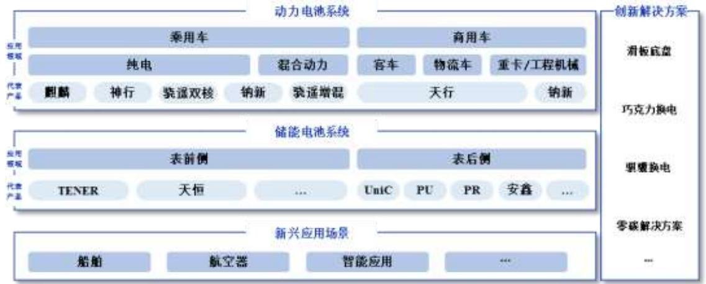
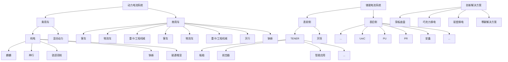
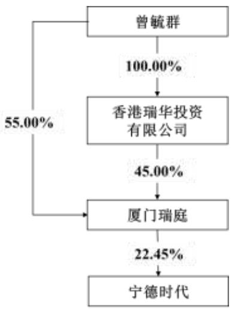
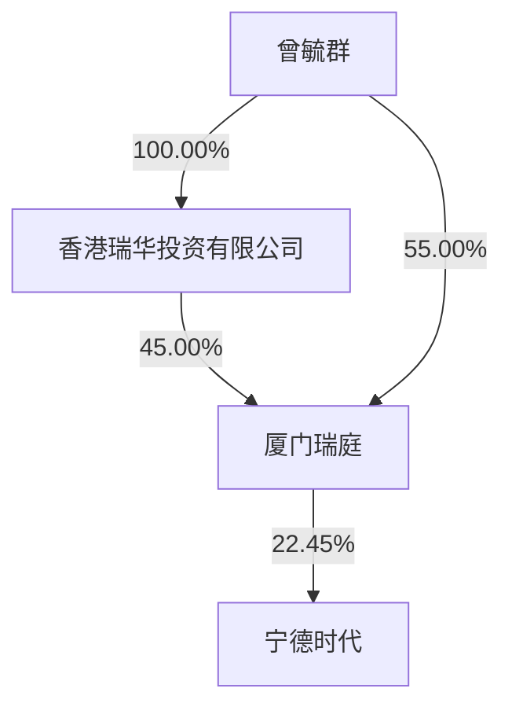

CATL

宁德时代新能源科技股份有限公司

2025 年年度报告

2026 年 3 月

致股东的信

2025年，在全球加速迈向零碳经济的背景下，产业新能源化的进程持续提速。围绕“零碳”重构的产业链、价值链与创新链，正催生全新的增长空间与机遇。稳定、低成本、可持续的清洁能源，业已成为数字化文明的关键生产要素，并重构着能源系统的底层逻辑。在这场能源革命与科技革命交汇、现实与未来叠加的历史进程中，宁德时代始终在以行动回答一个问题：如何在不确定的世界中，构建确定性的长期价值？

这一年，我们的收入结构与增长质量持续优化，动力、储能电池出货量继续领跑全球，锂电池销量同比增长近 4成至661GWh，“全域增量”业务引擎初具规模。

这一年，我们的港股IPO树立了全球资本市场标杆项目，为公司海外战略布局提供稳健的资本支持，也与全球投资者共享了公司的成长。

这一年，我们的产品和服务走向更广阔的场景——在云端、在矿山、在江河湖海、在戈壁沙漠、在零碳园区、在算力中心，宁德时代正在为中国及全球的发展持续注入澎湃动能。

我们清醒地看到，当地缘政治、产业周期与技术变革交织，不确定性成为全球经济常态，宁德时代能够稳健增长，是建立在公司长期坚守的奋斗与创新价值观基石之上，让我们相较于同业，更经得起风浪的洗礼。

“全域增量”，迈向零碳时代

新能源产业正站在新的历史节点：发展目标从“速度”转向“质量”，发展路径从新能源的产业化迈向产业的新能源化。国际能源署（IEA）预测，到2050 年实现净零排放，全球年度能源投资将达4.5万亿美元。一个更广阔、更立体的增长时代正在展开。

面向未来，相较于复制既有成功经验，宁德时代更致力于拓展新能源的边界，推动产业从“局部突破”走向“全域增量”。

从基本功到创新突破，从产品到服务，再到生态构建，我们在电动化的应用上持续拓展边界，产品已从乘用车延伸至商用车、电动船舶、电动航空等领域：在新能源重卡领域，“天行”电池已成为主流选择；在电动船舶领域，搭载宁德时代电池的船舶近900 艘，纯电船舶将在不久的将来驶向远洋；在低空出行领域，公司旗下成员企业峰飞航 2吨级eVTOL 已完成多次复杂环境飞行验证，全球最大的5吨级eVOTL已完成首次公开飞行。

我们持续推动电池从“产品”向“服务”演进，通过车电分离与换电模式提升终端用户体验，与中石化等伙伴一道，在乘用车便捷补能与商用车干线物流两大场景建设高效、便捷、经济的补能网络。截至 2025年底累计建成换电站达 1,325座，其中巧克力换电突破1,000座，骐骥换电突破 300座，并与广汽、长安、一汽、上汽、奇瑞、一汽解放、陕重汽等多家企业联合推出换电车型。

我们也不断推动自身的绿色低碳运营和产业的可持续发展。公司核心运营的电池工厂均实现碳中和，成功达成 2025年核心运营碳中和目标，并向着2035年价值链碳中和稳步迈进。此外，公司旗下邦普循环 2025年以高效环保的方式回收了高达 21万吨废旧电池及材料，同比增长超六成。

新能源产业的终极使命，是推动能源系统的零碳化。围绕这一目标，我们持续投入零碳电网、电力电子、柔性调控、虚拟电厂等关键技术，在山东东营、江苏盐城、福建宁德、四川宜宾等多地推动零碳产业园建设，并助力钢铁、水泥、化工等传统行业转型升级。

“世界第一”之上，更要赢得尊重

我们始终认为，企业真正的竞争力，除了阶段性业绩，更在于是否建立起一个能够长期、稳定、可持续创造价值的体系，推动企业、行业乃至社会的共同进步。

这一体系，首先根植于技术创新的纵深。我们构建了以第一性原理为核心的研发创新体系，通过两万三千余名研发人员的奋斗，不断孵化出更高效率、更高安全性的技术成果，国际专利申请量位列中国企业第二，助力宁德市跻身全球创新强度第四名。我们也将AI深度融合到创新和制造过程中，荣获世界经济论坛（WEF）“AI驱动产业转型全球标杆”MINDS奖项。在前沿技术方向上，我们的研究与技术储备亦处于全球领先行列。

系统性的研发优势，使宁德时代能够围绕真实场景与用户痛点，不断推出“人无我有、人有我优”的解决方案矩阵。2025年，我们相继推出有优异低温表现并降低锂资源依赖的“钠新”电池，突破单一化学体系性能局限的“骁遥”双核系列，解决续航短、补能慢、衰减快等痛点的“天行”商用车电池，以及实现安全寿命最优解的“天恒”“TENER Stack”大容量储能系统。

造电池容易，但造好电池很难。在高度规模化的产业中，任何细微缺陷都会被时间和空间无限放大。宁德时代始终将品质视为生命线，关键质量标准较行业平均实现数量级的领先。我们拥有WEF评选行业最多的灯塔工厂以及唯一“可持续灯塔工厂”。更高的可靠性，让宁德时代的产品能够在更复杂场景、更长生命周期内，为客户创造更优的综合收益。

与此同时，我们坚持“客户导向”，通过技术授权、联合研发、本地建厂和本土化运营，为全球客户提供定制化的产品和本地化的服务。

当前，全球新能源产业方兴未艾，行业应当聚焦价值竞争，而非价格竞争。唯有坚持以长期主义为导向的技术和制造创新、坚守合规经营底线，才能形成可持续的产业复利，赢得世界的尊重。

而尊重也来源于对可持续发展和社会责任的高度重视，正如我们的ESG管理成效获得广泛国际认可，MSCI评级AA级行业领先，并首次入选标普全球《可持续发展年鉴》。此外，我们积极回馈社会，携旗下成员企业峰飞航空向香港大埔火灾救援工作捐赠 1,500万港元，履行企业社会责任。

纵观人类文明的发展历程，科技革命始终伴随着能源革命，而能源利用效率，是文明跃迁的关键变量。

在下一代以可再生能源为主体的新型能源系统中，电池不再只是交通工具或储能设备的组成部分，而将成为支撑能源系统缓冲、稳定与调度的基础单元。新能源也不再是周期性的投资品，而是长期、系统性的基础设施。

依托高度复杂的系统工程能力、长生命周期的可靠性，以及大规模交付的一致性，宁德时代不断降低系统成本、提升整体效率，并参与定义未来能量流动和使用的方式，以零碳科技创新的先锋，推动全球能源结构的根本变革。

而这无限机遇，我们也将始终与股东共同见证、共同分享。公司延续高比例分红的政策，连续三年以净利润的 50%实施现金分红，今年分红完成后累计分红将接近千亿元。在以高强度科技创新驱动业务拓展的同时，持续通过现金分红为股东带来现实回报。

宁德时代将始终坚持创业初心，未雨绸缪、识微见远，秉持修己达人、奋斗创新的价值观，不负各位股东的信任与支持，携手迈向更加光明的未来— 一个更好的“您的时代”。

董事长：曾毓群

宁德时代新能源科技股份有限公司

2026 年 3 月 9 日

# 第一节 重要提示、目录和释义

## 一、董事、高级管理人员是否存在对年度报告内容存在异议或无法保证其真实、准确、完整的情况

□是 否

公司董事会及董事、高级管理人员保证本报告内容的真实、准确、完整，不存在虚假记载、误导性陈述或者重大遗漏，并承担个别和连带的法律责任。

公司负责人曾毓群先生、主管会计工作负责人及会计机构负责人郑舒先生声明：保证本报告中财务报告的真实、准确、完整。

所有董事均已出席了审议本报告的董事会会议。

## 二、非标准审计意见提示

□适用 不适用

## 三、内部控制重大缺陷提示

□适用 不适用

## 四、业绩大幅下滑或亏损的风险提示

□适用 不适用

## 五、对年度报告涉及未来计划等前瞻性陈述的风险提示

适用 □不适用

本报告中涉及的未来发展规划等前瞻性陈述不构成公司对投资者的实质承诺，敬请广大投资者理性投资，注意风险。

## 六、公司上市时未盈利且目前未实现盈利

□适用 不适用

## 七、公司是否需要遵守特殊行业的披露要求

适用 □不适用

公司需要遵守锂离子电池产业链相关行业的披露要求。

## 八、董事会审议的报告期利润分配预案或公积金转增股本预案

适用 □不适用

经公司第四届董事会第十四次会议审议通过的 2025年度利润分配预案为：拟以 4,531,886,650股（即公司现有总股本 4,563,868,956 股剔除 A 股回购专用账户中已回购股份 31,982,306 股）为基数，向全体股东每 10股派发现金分红69.57元（含税）。2025年度，公司不实施资本公积金转增股本，不送红股。本次利润分配预案尚需提交公司 2025年年度股东会审议。

目录

致股东的信.. 2

第一节重要提示、目录和释义.. 5

第二节公司简介和主要财务指标. . 10

第三节管理层讨论与分析.. . 14

第四节公司治理、环境和社会. . 42

第五节重要事项. . 69

第六节股份变动及股东情况. . 93

第七节债券相关情况. . 102

第八节 财务报告.. . 107

备查文件目录

一、载有公司法定代表人签字的 2025年年度报告原件。  
二、载有公司负责人、主管会计工作负责人、会计机构负责人签名并盖章的财务报表。  
三、载有会计师事务所盖章、注册会计师签名并盖章的审计报告原件。  
四、报告期内在中国证监会指定网站上公开披露过的所有公司文件的正本及公告的原稿。

以上备查文件的备置地点：公司住所（福建省宁德市蕉城区漳湾镇新港路 2 号）及深圳证券交易所（http://www.szse.cn/）。

释义

<table><tr><td>释义项</td><td>指</td><td>释义内容</td></tr><tr><td>本公司、公司、宁德时代</td><td>指</td><td>宁德时代新能源科技股份有限公司</td></tr><tr><td>厦门瑞庭</td><td>指</td><td>公司控股股东,厦门瑞庭投资有限公司</td></tr><tr><td>厦门时代</td><td>指</td><td>公司合并报表子公司,厦门时代新能源科技有限公司</td></tr><tr><td>宜春时代</td><td>指</td><td>公司合并报表子公司,宜春时代新能源科技有限公司</td></tr><tr><td>贵州时代</td><td>指</td><td>公司合并报表子公司,宁德时代(贵州)新能源科技有限公司</td></tr><tr><td>三江时代</td><td>指</td><td>公司合并报表子公司,宜宾三江时代新能源科技有限公司</td></tr><tr><td>江苏时代</td><td>指</td><td>公司合并报表子公司,江苏时代新能源科技有限公司</td></tr><tr><td>中州时代</td><td>指</td><td>公司合并报表子公司,中州时代新能源科技有限公司</td></tr><tr><td>时代广汽</td><td>指</td><td>公司合并报表子公司,时代广汽动力电池有限公司</td></tr><tr><td>时代绿能</td><td>指</td><td>公司合并报表子公司,时代绿色能源有限公司</td></tr><tr><td>广东邦普</td><td>指</td><td>公司合并报表子公司,广东邦普循环科技有限公司</td></tr><tr><td>SNE Research</td><td>指</td><td>韩国新能源领域咨询公司,提供电池行业全球市场研究和咨询服务</td></tr><tr><td>SMM</td><td>指</td><td>上海有色网,为有色金属行业综合服务门户</td></tr><tr><td>ESG</td><td>指</td><td>Environment、Social and Governance,环境、社会与公司治理</td></tr><tr><td>中国证监会</td><td>指</td><td>中国证券监督管理委员会</td></tr><tr><td>深交所</td><td>指</td><td>深圳证券交易所</td></tr><tr><td>中登公司</td><td>指</td><td>中国证券登记结算有限责任公司深圳分公司</td></tr><tr><td>巨潮资讯网</td><td>指</td><td>http://www.cninfo.com.cn</td></tr><tr><td>动力电池系统</td><td>指</td><td>动力电池里的电芯、模组/电箱、电池包</td></tr><tr><td>储能电池系统</td><td>指</td><td>储能电池里的电芯、模组/电箱、电池柜</td></tr><tr><td>CTP</td><td>指</td><td>电芯-电池包,一种将电芯直接集成到电池包的技术,不需要通过模组</td></tr><tr><td>CTC</td><td>指</td><td>电芯-底盘,一种将电芯直接集成到整车底盘的技术,不需要通过模组或电池包</td></tr><tr><td>NEV</td><td>指</td><td>新能源汽车,包括电动汽车和氢燃料等新型燃料电池车</td></tr><tr><td>BEV</td><td>指</td><td>英文:battery electric vehicle中文:纯电动车</td></tr><tr><td>PHEV</td><td>指</td><td>英文:Plug-in hybrid electric vehicle中文:插电式混合动力车</td></tr><tr><td>HEV</td><td>指</td><td>英文:hybrid electric vehicle中文:混合动力车</td></tr><tr><td>DPPB</td><td>指</td><td>十亿分之一的失效率,制造过程中的质量度量标准</td></tr><tr><td>DPPM</td><td>指</td><td>百万分之一的失效率,制造过程中的质量度量标准</td></tr><tr><td>GWh</td><td>指</td><td>吉瓦时,一种电能单位, $1GWh=10$ 亿瓦时</td></tr><tr><td>MWh</td><td>指</td><td>兆瓦时,一种电能单位, $1MWh=1$ 百万瓦时</td></tr><tr><td>TWh</td><td>指</td><td>太瓦时,一种电能单位, $1TWh=10$ 亿千瓦时</td></tr><tr><td>报告期</td><td>指</td><td>2025年1月1日至2025年12月31日</td></tr></table>

注：本报告中若出现总数与各分项数值之和尾数不符的情况，均为四舍五入原因造成。

# 第二节 公司简介和主要财务指标

## 一、公司信息

<table><tr><td>A股股票简称</td><td>宁德时代</td><td>A股股票代码</td><td>300750</td></tr><tr><td>H股股票简称</td><td>寧德時代</td><td>H股股票代码</td><td>03750</td></tr><tr><td>A股股票上市证券交易所</td><td colspan="3">深圳证券交易所</td></tr><tr><td>H股股票上市证券交易所</td><td colspan="3">香港联合交易所有限公司</td></tr><tr><td>公司的中文名称</td><td colspan="3">宁德时代新能源科技股份有限公司</td></tr><tr><td>公司的中文简称</td><td colspan="3">宁德时代</td></tr><tr><td>公司的外文名称</td><td colspan="3">Contemporary Amperex Technology Co.,Ltd.</td></tr><tr><td>公司的外文名称缩写</td><td colspan="3">CATL</td></tr><tr><td>公司的法定代表人</td><td colspan="3">曾毓群</td></tr><tr><td>注册地址</td><td colspan="3">福建省宁德市蕉城区漳湾镇新港路2号</td></tr><tr><td>注册地址的邮政编码</td><td colspan="3">352100</td></tr><tr><td>公司注册地址历史变更情况</td><td colspan="3">无</td></tr><tr><td>办公地址</td><td colspan="3">福建省宁德市蕉城区漳湾镇新港路2号</td></tr><tr><td>办公地址的邮政编码</td><td colspan="3">352100</td></tr><tr><td>公司网址</td><td colspan="3">www.catl.com</td></tr><tr><td>电子信箱</td><td colspan="3">CATL-IR@catl.com</td></tr></table>

## 二、联系人和联系方式

<table><tr><td></td><td>董事会秘书兼联席公司秘书</td><td>证券事务代表</td></tr><tr><td>姓名</td><td>蒋理</td><td>陈津</td></tr><tr><td>联系地址</td><td>福建省宁德市蕉城区漳湾镇新港路2号</td><td>福建省宁德市蕉城区漳湾镇新港路2号</td></tr><tr><td>电话</td><td>0593-8901666</td><td>0593-8901666</td></tr><tr><td>传真</td><td>0593-8901999</td><td>0593-8901999</td></tr><tr><td>电子信箱</td><td>CATL-IR@catl.com</td><td>CATL-IR@catl.com</td></tr></table>

## 三、信息披露及备置地点

<table><tr><td>公司披露年度报告的证券交易所网站</td><td>A股:https://www.szse.cn/index/index.htmlH股:www.hkexnews.hk</td></tr><tr><td>公司披露年度报告的媒体名称及网址</td><td>A股:巨潮资讯网H股:香港联交所披露易网站</td></tr><tr><td>公司年度报告备置地点</td><td>公司住所</td></tr></table>

## 四、其他有关资料

### 1、公司聘请的会计师事务所

<table><tr><td>会计师事务所名称</td><td>致同会计师事务所（特殊普通合伙）</td></tr><tr><td>会计师事务所办公地址</td><td>北京市朝阳区建国门外大街22号赛特广场5层</td></tr><tr><td>签字会计师姓名</td><td>殷雪芳、郑海霞</td></tr></table>

### 2、公司聘请的报告期内履行持续督导职责的保荐机构

□适用 不适用

### 3、公司聘请的报告期内履行持续督导职责的财务顾问

□适用 不适用

## 五、主要会计数据和财务指标

公司是否需追溯调整或重述以前年度会计数据

□是 否

单位：千元

<table><tr><td>项目</td><td>2025 年</td><td>2024 年</td><td>本年比上年增减</td><td>2023 年</td></tr><tr><td>营业收入</td><td>423,701,834</td><td>362,012,554</td><td>17.04%</td><td>400,917,045</td></tr><tr><td>归属于上市公司股东的净利润</td><td>72,201,282</td><td>50,744,682</td><td>42.28%</td><td>44,121,248</td></tr><tr><td>归属于上市公司股东的扣除非经常性损益的净利润</td><td>64,507,864</td><td>44,992,919</td><td>43.37%</td><td>40,091,674</td></tr><tr><td>经营活动产生的现金流量净额</td><td>133,219,982</td><td>96,990,345</td><td>37.35%</td><td>92,826,124</td></tr><tr><td>基本每股收益(元/股)</td><td>16.14</td><td>11.58</td><td>39.38%</td><td>10.06</td></tr><tr><td>稀释每股收益(元/股)</td><td>16.14</td><td>11.58</td><td>39.38%</td><td>10.05</td></tr><tr><td>加权平均净资产收益率</td><td>24.91%</td><td>24.13%</td><td>0.78%</td><td>24.04%</td></tr><tr><td>项目</td><td>2025 年末</td><td>2024 年末</td><td>本年末比上年末增减</td><td>2023 年末</td></tr><tr><td>资产总额</td><td>974,827,544</td><td>786,658,123</td><td>23.92%</td><td>717,168,041</td></tr><tr><td>归属于上市公司股东的净资产</td><td>337,107,747</td><td>246,930,033</td><td>36.52%</td><td>197,708,052</td></tr></table>

公司最近三个会计年度扣除非经常性损益前后净利润孰低者均为负值，且最近一年审计报告显示公司持续经营能力存在不确定性

□是 否

公司报告期内经审计利润总额、净利润、扣除非经常性损益后的净利润三者孰低为负值

□是 否

## 六、分季度主要财务指标

单位：千元

<table><tr><td>项目</td><td>第一季度</td><td>第二季度</td><td>第三季度</td><td>第四季度</td></tr><tr><td>营业收入</td><td>84,704,589</td><td>94,181,664</td><td>104,185,734</td><td>140,629,847</td></tr><tr><td>归属于上市公司股东的净利润</td><td>13,962,558</td><td>16,522,581</td><td>18,548,970</td><td>23,167,173</td></tr><tr><td>归属于上市公司股东的扣除非经常性损益的净利润</td><td>11,829,172</td><td>15,368,296</td><td>16,421,757</td><td>20,888,640</td></tr><tr><td>经营活动产生的现金流量净额</td><td>32,868,257</td><td>25,818,809</td><td>21,973,364</td><td>52,559,552</td></tr></table>

上述财务指标或其加总数是否与公司已披露季度报告、半年度报告相关财务指标存在重大差异

□是 否

## 七、境内外会计准则下会计数据差异

### 1、同时按照国际会计准则与按照中国会计准则披露的财务报告中净利润和净资产差异情况

□适用 不适用

公司报告期不存在按照国际会计准则与按照中国会计准则披露的财务报告中净利润和净资产差异情况。

### 2、同时按照境外会计准则与按照中国会计准则披露的财务报告中净利润和净资产差异情况

□适用 不适用

公司报告期不存在按照境外会计准则与按照中国会计准则披露的财务报告中净利润和净资产差异情况。

### 3、境内外会计准则下会计数据差异原因说明

□适用 不适用

## 八、非经常性损益项目及金额

适用 □不适用

单位：千元

<table><tr><td>项目</td><td>2025年金额</td><td>2024年金额</td><td>2023年金额</td><td>说明</td></tr><tr><td>非流动性资产处置损益(包括已计提资产减值准备的冲销部分)</td><td>788,312</td><td>169,816</td><td>-235,944</td><td></td></tr><tr><td>除同公司正常经营业务相关的有效套期保值业务外,非金融企业持有金融资产和金融负债产生的公允价值变动损益以及处置金融资产和金融负债产生的损益</td><td>1,362,488</td><td>843,832</td><td>73,029</td><td></td></tr><tr><td>单独进行减值测试的应收款项减值准备转回</td><td>28,886</td><td>2,687</td><td>62,339</td><td></td></tr><tr><td>除上述各项之外的其他营业外收入和支出</td><td>7,909</td><td>-612,613</td><td>195,751</td><td></td></tr><tr><td>其他符合非经常性损益定义的损益项目</td><td>8,704,038</td><td>8,128,318</td><td>5,909,090</td><td></td></tr><tr><td>减:所得税影响额</td><td>2,017,532</td><td>1,665,244</td><td>1,194,027</td><td></td></tr><tr><td>少数股东权益影响额(税后)</td><td>1,180,684</td><td>1,115,034</td><td>780,664</td><td></td></tr><tr><td>合计</td><td>7,693,417</td><td>5,751,762</td><td>4,029,575</td><td>--</td></tr></table>

其他符合非经常性损益定义的损益项目的具体情况：

适用 □不适用

主要是部分股权投资的持股比例变动产生的投资收益及其他收益等。

将《公开发行证券的公司信息披露解释性公告第 1 号——非经常性损益》中列举的非经常性损益项目界定为经常性损益项目的情况说明

□适用 不适用

公司不存在将《公开发行证券的公司信息披露解释性公告第 1 号——非经常性损益》中列举的非经常性损益项目界定为经常性损益的项目的情形。

# 第三节 管理层讨论与分析

## 一、报告期内公司从事的主要业务

公司需遵守《深圳证券交易所上市公司自律监管指引第 4 号——创业板行业信息披露》中的“锂离子电池产业链相关业务”的披露要求。

### 1、主要业务

公司是全球领先的零碳新能源科技公司，主要从事动力电池、储能电池的研发、生产、销售，以推动移动式化石能源替代、固定式化石能源替代，并通过电动化和智能化实现市场应用的集成创新。截至报告期末，公司已在全球设立六大研发中心、24家电池工厂，覆盖全球广泛的新能源应用客户群体。

公司在锂电池领域深耕多年，具备了全链条自主、高效的研发能力，在电池材料、电池系统、电池回收等产业链领域拥有核心技术优势及前瞻性研发布局，通过材料及材料体系创新、系统结构创新、绿色极限制造创新及商业模式创新为全球新能源应用提供一流的解决方案和服务。公司将锂电池领域的深厚沉淀延展至钠电池等其他化学体系，形成全面、先进的产品矩阵，可应用于乘用车、商用车、表前储能、表后储能等领域，以及船舶、航空器、数据中心等新兴应用场景，推出复杂应用场景下的创新解决方案，包括助推全面电动化的换电业务、完善产业生态并延伸价值链条的零碳生态建设等，能够全方位满足不同客户的多元化、跨场景的需求，引领全球零碳新经济发展。

### 2、主要产品及其用途

公司致力于为全球新能源应用提供一流的动力电池和储能电池产品及相关创新解决方案，具体如下：

flowchart

#### （1）动力电池系统

公司动力电池产品包括电芯、模组/电箱及电池包。公司可提供磷酸铁锂电池、三元高压中镍电池、三元高镍电池、超混电池、钠离子电池、凝聚态电池等覆盖不同能量密度区间的多种化学体系产品系列，能满足快充、长寿命、长续航、高安全、宽温度适应性等多种功能需求。公司亦可通过在单个电池包里采用双核/多核架构以实现多元化学体系的集成，进而充分发挥各类化学体系的性能优势。公司根据应用领域及客户要求，通过定制或联合研发等方式设计个性化产品方案，以满足客户对产品性能的不同需求。

乘用车应用领域，公司产品可应用于 BEV、REV、PHEV、HEV 等不同细分市场，广泛应用于私家车、运营车等领域；商业应用领域，公司产品可应用于道路客运、城市配送、重载运输、道路清洁等客车及商用车领域。此外，公司产品还可应用于船舶、航空器、电动工具、电动两轮车等领域。

#### （2）储能电池系统

公司提供电芯、电池柜、储能集装箱以及系统集成等储能解决方案。公司的储能电池广泛应用于表前储能和表后储能领域，包括公用事业储能、工商业储能及数据中心储能等。

在表前领域，公司依托智能液冷控温、高成组 CTP、无热扩散等技术，推出了 EnerOne、EnerOnePlus等户外液冷电池柜，针对全气候场景的 EnerC、EnerC Plus、EnerD、EnerX等集装箱式液冷电池柜，以及单体6.25MWh的天恒储能系统、全球首款可量产的 9MWh超大容量储能系统解决方案TENER Stack、其他适应众多应用场景的 TENER 系列解决方案。在表后领域，公司产品已实现从低压、中压到高压平台的全场景覆盖。其中，PR系列、Unic系列及安鑫系列、PU系列分别可满足家庭储能、工商储能、数据中心能源管理需求。

根据相关需求，公司开发了适用于表前、表后市场的多场景、多工况的不同规格电芯，具备超长寿命、零衰减、高安全、宽温度适应性等特性。

#### （3）电池材料、回收及矿产资源

公司电池材料产品主要包括锂盐、前驱体及正极材料等。公司亦通过回收方式，对废旧电池中的镍、钴、锰、锂、磷、铁、铝、铜等金属材料及其他材料进行加工、提纯、合成等工艺，生产锂电池生产所需的正极材料、三元前驱体、磷铁前驱体、锂盐等材料，并将收集后的铜、铝等金属材料通过第三方回收利用，使电池生产所需的关键金属资源实现有效循环利用。

此外，为进一步保障电池生产所需的上游关键资源及材料供应，公司通过自建、参股、合资等多种方式参与锂、镍、钴、磷等电池矿产资源及相关产品的投资、建设及运营。

### 3、经营模式

公司拥有独立的研发、采购、生产和销售体系，主要通过销售动力电池、储能电池和电池材料等产品和解决方案实现盈利。研发方面，公司建立了完备的研发体系，形成以自主研发为主、外部合作为辅的研发模式，通过数字化、智能化的方式，紧密围绕材料及材料体系、系统结构、绿色极限制造及商业模式领域开展创新，以引领行业技术发展。采购方面，公司通过严格的评估和考核程序遴选合格供应商，并通过长期协议、合资合作等方式与全球供应商紧密合作，以保证原材料和设备的技术先进性、产品的可靠性以及成本的竞争力。生产销售方面，公司综合考虑市场情况及客户需求安排生产，公司以自建生产基地为主，并通过合资建厂、技术授权等方式扩充产能，以满足全球客户需求。此外，公司将电动化延伸至低空、船舶、智能应用等更广阔领域，并推进换电网络及零碳生态构建。

### 4、主要的业绩驱动因素

#### （1）行业持续增长

动力电池方面，全球新能源车销量增长带动动力电池需求持续增长。根据 SNE Research 数据，2025年全球新能源车销量 2,147.0万辆，同比增长 21.5%，全球动力电池使用量达 1,187GWh，同比增长 31.7%。储能电池方面，在各国清洁能源转型目标推动下，随着风电光伏装机比例提升、电力系统灵活性要求提高、储能技术进步及系统成本下降、数据中心等新兴领域需求拉动，储能电池市场需求持续快速增长。根据 SNE Research 统计，2025 年全球储能电池出货量 550GWh，同比增长 79%。

#### （2）公司竞争优势进一步提升

公司坚持技术领先、服务优质、运营卓越的经营理念，致力于为全球客户提供一流产品及解决方案。基于强大创新基因、深刻行业洞察、高效经营管理，公司在技术研发、产品创新、品牌及市场推广、极限制造、生态布局、零碳拓展等方面的竞争优势进一步提升，综合竞争力行业领先，实现业务稳健增长，为股东持续创造价值。

## 二、报告期内公司所处行业情况

### 1、行业发展状况及发展趋势

为应对全球气候变化的挑战，推进可持续发展，多个国家提出推动清洁能源转型及构建绿色低碳经济的战略。截至报告期末，根据《联合国气候变化框架公约》（UNFCCC）的国家自主贡献登记处数据，全球共有 195 个国家提交了首批国家自主贡献目标（NDC），以控制全球温升，推动低碳转型、共建气候治理体系。

全球碳排放来自电力、交通、工业等领域，其中电力、交通贡献主要排放量，电力行业碳减排的主要方式为提高风电、光伏等绿色清洁能源发电占比，交通行业碳减排的主要方式为提升出行工具的电动化率且使用绿色、清洁能源。近年来，智能化、电动化趋势下，电力和交通行业迎来能源转型的深刻变革。作为核心蓄能载体，高品质的锂电池凭借高能量密度、长循环寿命、良好稳定性及安全性等性能优势，在下一代以可再生能源为主体的新型能源系统中，不再只是交通工具或储能设备的组成部分，而将成为支撑能源系统缓冲、稳定与调度的关键单元，其相关产业迎来快速、长足发展机遇。

#### （1）动力电池行业

受益于新能源在售车型数量增加、智能化加速、充换电基础设施持续完善等因素，全球新能源车市场需求持续增长。根据 SNE Research数据，2025年全球新能源车销量为 2,147.0万辆，同比增长 21.5%。国内市场，根据中国汽车工业协会数据，2025 年中国新能源车销量为 1,387.5 万辆，其中新能源乘用车销量为 1,300.5 万辆，同比增长 17.7%，渗透率提升至 54.0%；新能源商用车销量为 87.1 万辆，同比增长63.7%，渗透率提升至 26.9%；海外市场，根据欧洲汽车制造商协会数据，2025 年欧洲新能源乘用车销量为 385.8 万辆，同比增长 30.9%，渗透率达 29.1%。新能源车销量增长、单车带电量提升带动动力电池需求持续增长，根据 SNE Research数据，2025年全球动力电池使用量为 1,187GWh，同比增长 31.7%。

#### （2）储能行业

在全球电力需求增长、低碳转型趋势下，全球储能市场需求快速增长。根据IEA，全球电力需求持续增长，其推动力来自于工业、交通及建筑领域日益提升的电气化程度，全球电力消费的增长亦受新兴经济领域驱动，如人工智能（AI）、数据中心以及不断演进的创新场景。同时，全球电力供应结构正向低碳化快速转型，尽管电力需求强劲增长，受益于可再生能源的快速部署以及核电发电量的提升，化石燃料发电受到抑制，电力行业排放增长已明显放缓。

国内市场，根据国家能源局数据，2025 年我国新增并网风电光伏装机容量 438GW，同比增长 22.3%，光伏、风电累计装机容量首次超过煤电装机，标志着以风光为代表的新能源正从补充能源加速向主体能源迈进；受益于政策支持、商业模式改善且储能成本下降，储能需求快速增长，根据中关村储能产业技术联盟统计，2025年我国新型储能新增装机规模达189.5GWh，同比增长73%。海外市场，数据中心能源需求及灵活性资源调节需求增加，峰谷价差拉大提升项目经济性，带动储能需求增长；欧洲及海外其他地区不断出台支持政策，推动储能招标规模增长。根据 SNE Research 统计，2025 年全球储能电池出货量550GWh，同比增长 79%。

#### （3）电池材料及回收行业

随着动力电池、储能电池市场的持续增长，电池材料及回收的需求也相应增长。根据 SMM 统计，2025年我国三元与磷酸铁锂正极材料合计产量达456.5万吨，同比增长51%。随着早期投放市场的锂电池逐渐进入退役期，退役电池的回收需求逐步提升，根据上海钢联数据，2025 年我国锂电池报废量达 81.9万吨，同比增长 9%。

### 2、公司行业地位

公司动力电池和储能电池业务全球领先。根据SNE Research数据，在动力电池领域， 2025年公司动力电池使用量全球市占率为39.2%，较去年同期提升1.2个百分点，公司已连续9年（2017-2025年）动力电池使用量排名全球第一。在储能领域，公司已连续 5 年（2021-2025 年）储能电池出货量排名全球第一。

### 3、主要法律法规及行业政策

2025年以来国内有关的行业主要法律法规及政策如下表所示：

<table><tr><td>时间</td><td>颁布单位</td><td>文件名称及主要内容</td></tr><tr><td>2025年1月</td><td>国家发展改革委、财政部</td><td>文件名称:《关于2025年加力扩围实施大规模设备更新和消费品以旧换新政策的通知》主要内容:推动设备更新升级,扩围支持老旧营运货车报废更新,将补贴范围扩大至国四及以下排放标准营运货车;提高新能源城市公交车及动力电池更新补贴标准;扩大汽车报废更新支持范围,将符合条件的国四排放标准乘用车纳入支持;完善汽车置换更新补贴标准。</td></tr><tr><td>2025年1月</td><td>国家发展改革委、国家能源局</td><td>文件名称:《关于深化新能源上网电价市场化改革促进新能源高质量发展的通知》主要内容:取消“强制配储”政策,即不得将配置储能作为新建新能源项目核准、并网、上网等的前置条件;推动新能源上网电量全面进入电力市场,通过市场交易形成价格;完善适应新能源发展的现货交易机制、中长期交易机制和绿色电力交易政策;推动新能源公平参与市场交易;建立新能源可持续发展价格结算机制,区分存量与增量项目,保持政策衔接并稳定收益预期;完善电力市场体系,更好支撑新能源发展规划目标实现。</td></tr><tr><td>2025年4月</td><td>国家发展改革委、国家能源局</td><td>文件名称:《关于全面加快电力现货市场建设工作的通知》主要内容:围绕构建全国统一大市场要求,建设全国统一电力市场;全面加快电力现货市场建设,力争在2025年底前基本实现电力现货市场全覆盖;全面开展连续结算运行,发挥现货市场发现价格和调节供需的关键作用;正式运行和连续结算试运行地区,建立适应新型经营主体需求的准入要求、注册程序、报价方式、考核结算等机制;要求开展技术系统校验与第三方评估;强化市场监管、风险防范与运行保障。</td></tr><tr><td>2025年6月</td><td>生态环境部、海关总署、国家发展改革委、工业和信息化部、商务部、国家市场监督管理总局</td><td>文件名称:《关于规范锂离子电池用再生黑粉原料、再生钢铁原料进口管理有关事项的公告》主要内容:对锂离子电池用再生黑粉原料实行规范管理,重点包括:(一)明确进口标准,符合要求的再生黑粉原料不属于固体废物,可作为非固体废物自由进口;必须分类包装,不得混装;同一报关单仅限申报同类再生原料;禁止散装运输,不同类别须分区存放。(二)明确商品编码,规定锂离子电池用再生黑粉原料的海关商品编号。(三)强化检验监管,海关依据行业技术规范开展检验,对疑似固体废物委托专业机构开展属性鉴别并依法处理。明确再生钢铁原料的配套管理要求与检验规则。</td></tr><tr><td>2025年9月</td><td>国家发展改革委、国家能源局</td><td>文件名称:《新型储能规模化建设专项行动方案(2025—2027年)》主要内容:提出到2027年全国新型储能装机规模达到1.8亿千瓦以上,带动直接投资约2,500亿元。重点包括:(一)场景应用:电源侧促进新能源电站与配建新型储能联合运行;电网侧推进构网型储能在高比例新能源电网、弱电网和孤岛电网中应用;推进绿电直连、虚拟电厂、智能微电网、源网荷储一体化、车网互动等模式;探索“人工智能+”应用场景。(二)提升利用率:积极开展新型储能与电源协同优化调节。(三)推进创新融合:依托试点促进技术多元化发展。(四)完善市场机制:推动“新能源+储能”一体化参与电能量市场交易;完善容量电价机制和容量补偿机制;推动各类调节资源规范参与市场。</td></tr><tr><td>2025年12月</td><td>工业和信息化部</td><td>文件名称:《关于开展汽车动力电池碳足迹申报工作的通知》主要内容:按照“需求牵引、系统推进、开放合作、持续完善”原则,明确动力电池碳足迹核算规则;建立健全运行管理体系;协同推进标准规范、背景数据、监测计量和评价认证建设;促进规则、标准与数据等的国际互认;推动形成碳足迹核算、数据报送、核查认证的运行体系;助力动力电池产业高质量发展。</td></tr><tr><td>2025年12月</td><td>国家发展改革委、财政部</td><td>文件名称:《关于2026年实施大规模设备更新和消费品以旧换新政策的通知》主要内容:2026年汽车“以旧换新”补贴方案在保持汽车补贴上限不变的基础上,将定额补贴调整为按车价比例进行补贴;明确新能源乘用车、燃油乘用车的补贴比例与对应上限;并提出在整体政策框架下持续实施大规模设备更新和消费品以旧换新政策。</td></tr><tr><td>2025年12月</td><td>国家发展改革委、工业和信息化部、国家能源局</td><td>文件名称:《关于印发国家级零碳园区建设名单(第一批)的通知》主要内容:公布国家级零碳园区建设名单(第一批),并通知各地区发展改革委、工业和信息化主管部门、能源局要会同有关方面加强对建设名单内园区的指导、要积极支持本地区国家级零碳园区建设。各地区发展改革委要会同有关方面加强对国家级零碳园区建设进展的跟踪调度。各地区发展改革委、工业和信息化主管部门、能源局要加强经验总结,发挥国家级零碳园区示范引领作用。</td></tr></table>

2025年以来海外有关的行业主要法律法规及政策如下表所示：

<table><tr><td>时间</td><td>颁布单位</td><td>文件名称及主要内容</td></tr><tr><td>2025年3月</td><td>欧盟委员会</td><td>文件名称:《欧洲汽车行业工业行动计划》(Industrial Action Plan for the European automotive sector)主要内容:为解决欧洲汽车行业面临电动化和智能化竞争力不足,以及部分整车制造商(OEM)面临排放法规趋严、合规成本上升并可能产生高额罚款等挑战。该行动计划提出了一揽子拟实施的政策措施。其中,围绕促进电动化转型的重点举措包括:1.鼓励成员国实施“社会租赁计划(Social Leasing Scheme)”,通过降低使用门槛,提升低收入群体对电动车的可负担性和电动车的渗透率;2.制定“企业车队法规(Corporate Fleet Regulation)”,以促进零排放汽车占企业集中采购的比例达到60%左右;3.与成员国研究欧盟层面(而非由各成员国单独实施)推出统一的电动汽车刺激计划,包括财政补贴等支持措施;4.研究并推动支持清洁公交车的专项行动方案,加快公共交通领域的电动化进程;5.加快充电基础设施建设,重点布局重型商用车辆充电网络;6.通过拨款等方式,提供最高不超过30亿欧元的资金支持,用于推动欧洲本土电池制造能力建设。</td></tr><tr><td>2025年5月</td><td>欧盟委员会</td><td>文件名称:《国家能源与气候计划》(National Energy and Climate Plans)主要内容:系欧盟成员国为实现2030年气候与能源目标而编制并提交的十年期国家规划工具。在可再生能源与电力系统转型方面,成员国普遍在NECPs中强调通过长期合同机制(例如购电协议,PPA)提升项目收益确定性,并结合储能、需求响应等灵活性资源强化系统调节能力。欧盟委员会在对NECPs的评估与政策引导中亦强调,应进一步完善市场设计与监管安排,降低储能、需求响应等主体参与电力市场与系统服务的制度性障碍,以支撑可再生能源的规模化并网与消纳。</td></tr><tr><td>2025年12月</td><td>欧盟委员会</td><td>文件名称:《电网一揽子计划》(European Grids Package)主要内容:加快电网基础设施扩容与现代化改造,以提升电力系统对可再生能源、电气化负荷增长及灵活性资源接入的承载能力。以实现2030年可再生能源占比42.5%以及2030年温室气体净减排55%等既定目标为牵引,推动成员国加快关键基础设施项目落地。同时,通过提出加速许可授予与并网效率提升的政策组合,缓解电网建设与接入环节的周期性瓶颈,支撑2040年前电网全面现代化。</td></tr></table>

## 三、核心竞争力分析

宁德时代的长期核心竞争力，根植于以技术创新和领先产品为基石，持续驱动商业模式的进化和客户市场的拓展，并形成正向反馈循环，以“飞轮效应”推动公司整体价值持续增长，不断加固“全球领先的零碳新能源科技公司”的竞争壁垒。

具体而言，公司核心竞争力体现在以下方面：一是研发为核，产品矩阵持续迭代。依托行业顶尖的研发团队与持续高强度的研发投入，公司构建起覆盖材料、电芯、系统及回收的全链条自主研发能力，是行业唯一入选“全球百强创新机构”的企业，助力宁德市跻身全球创新强度第四名。报告期内，公司拥有及申请的国内外专利总数达 54,538 项，创新成果密集落地。基于此，公司相继推出“二代神行超充”、“骁遥双核”及“钠新电池”等前沿产品，以全面领先的产品力为市场拓展提供坚实支撑。二是市场领跑，全球化根基稳固。公司动力与储能电池市占率已连续多年领跑全球。在乘用车领域，中高端市场主导地位稳固，经济型市场持续突破；在储能领域，系统集成能力不断增强，并与多家全球领先的科技企业建立合作。同时，公司稳步推进海外工厂建设，持续完善全球服务网络，以坚实的全球化布局，巩固长期竞争优势。三是极限制造，铸就品质与效率标杆。公司拥有全球规模最大的现有及在建产能，并以严苛的品控标准与自主研发的超级拉线PSL，持续探索制造效率、质量及安全的一致极限，电芯缺陷率水平较同行实现数量级领先。公司拥有行业最多的“灯塔工厂”及唯一“可持续灯塔工厂”。四是全域增量，拓宽生态护城河。公司将电动化延伸至低空、船舶等更广阔领域，吨级 eVTOL 已完成关键性飞行验证，电动船舶安全运营规模持续扩大。同时，巧克力换电、骐骥换电等创新解决方案快速拓展，协同产业链伙伴共同构筑开放、共赢的产业生态，为全面电动化注入持续动能。五是零碳引领，重构产业价值链条。公司已率先实现核心运营碳中和，并实现废旧电池的大规模综合回收利用。通过携手多地推进零碳示范项目，助力高碳排产业实现新能源转型。公司正以“零碳”理念深度重构产业生态，发掘并释放全产业链的绿色价值。

## 四、主营业务分析

### 1、概述

公司于 2025年 5 月 20 日在香港联交所主板成功挂牌上市，全球发售股份总数为 155,915,300股（行使超额配售权之后），发行价格为263.00港元/股，募集资金总额为410亿港元，并将上述募集资金用于匈牙利项目建设及营运资金、一般企业用途。公司通过本次 H 股上市搭建了海外资本运作平台，有助于进一步融入全球资本市场，加快推进全球化战略布局，提升综合竞争力。

报告期内，公司实现锂离子电池销量 661GWh，同比增长 39.16%；实现归属于上市公司股东的净利润 722 亿元，同比增长 42.28%；经营活动产生的现金流量净额 1,332 亿元，同比增长 37.35%。主要经营情况如下：

#### （1）动力业务

报告期内，公司实现动力电池销量 541GWh，同比增长 41.85%，全球市占率突破历史新高。根据SNE Research统计，2025年公司全球动力电池使用量市占率提升 1.2个百分点至 39.2%，连续 9年市占率位居全球第一。国内方面，根据中国汽车动力电池产业创新联盟统计，2025 年公司国内动力电池装机量市占率 43.42%。海外方面，根据 SNE Research统计，2025年公司海外动力电池使用量市占率实现突破，提升至 30.0%。

前沿技术引领全球，创新产品持续落地。乘用车领域，公司发布了二代神行超充电池、神行Pro电池、骁遥双核电池、钠新乘用车动力电池等新产品。其中，二代神行超充电池是全球首款兼具800公里续航和峰值12C超充速度的磷酸铁锂电池；神行Pro电池搭载了先进的NP3.0技术，针对欧洲市场低温、长途、租赁等多元化的需求可提供百万公里长寿命版本和 12C 超充版本；骁遥双核开创了跨化学体系的全新设计，通过在电池包里组合不同化学体系电芯，实现电池包综合性能全面提升，可满足用户的定制化需求；钠新乘用车动力电池拥有优异的低温能量保持率与安全表现，凭借钠的丰富储量可有效降低对锂资源的依赖。公司推出超混电池，通过材料层级混合创新，超越单一化学体系实现性能全面提升，可满足乘用车细分市场的性价比需求。商用车领域，公司在去年天行系列的基础上进一步发布了适用于重卡领域的钠新启驻一体蓄电池及面向高效物流场景的坤势底盘商用车生态解决方案。同时，公司创新产品规模化量产提速，在公司乘用车、商用车产品解决方案交付中占比持续提升。

高端市场主导地位稳固，细分市场取得突破。公司以性能溢价、优质服务铸就长期口碑，在乘用车中高端市场持续独占鳌头。2025 年福布斯中国智能纯电汽车新豪华度评选榜单中，超 6 成上榜车型搭载公司电池；公司还凭借骁遥增混电池，全面开启增混“大电量”时代，搭载超 40款 REV车型，助力公司在REV 市场占据主导地位。此外，公司亦通过开发周期短、适配成本低的大单品解决方案，助力乘用车客户成功推出多款热销车型。

深化战略客户合作，落地多元场景。公司以有针对性的场景解决方案、各类优势资源的高效整合持续获得商用车客户认可。报告期内，公司与一汽解放、北汽福田、东风商用车等深化战略合作，共同引领商用车电动化进程加速；公司还与多个合作伙伴共同推进无人物流、无人矿山等场景的绿色、低碳转型。

海外业务稳步推进，售后体系持续完善。随着公司海外基地建设、运营的逐渐成熟，及与海外客户战略合作的逐渐深入，报告期内，公司海外市场份额及交付能力稳步提升，并以领先的产品及优质的服务，持续获得VW、BMW、Stellantis、Volvo、DMG等海外客户诸多定点。为支持业务发展，公司持续完善售后服务体系。截至报告期末，公司售后服务网络覆盖 75 个国家或地区、约 1,200 家售后服务站。公司设有全球“宁家服务”直营体验中心 11 家，依托于“宁家服务”品牌，将售后服务延伸至整车端，为用户提供包括维修、电池保养、健康检测、年检及移动救援等在内的一站式的全方位服务。

#### （2）储能业务

报告期内，公司实现储能电池销量 121GWh，同比增长 29.13%，持续构建储能系统解决方案和服务能力。根据 SNE Research 统计，2025年公司储能电池出货量连续 5年位居全球第一。公司在维持领先地位的基础上，秉承“合作共赢”理念，深度整合全球供应链资源，提升储能系统整站优化与工程设计能力，系统集成业务全球共计交付超 70个项目，出货规模同比增长超160%。

持续推出创新产品，引领行业标准。国内市场，公司天恒 6.25MWh 集装箱式液冷电池舱实现批量交付并网，相对上一代系统单位面积能量密度提升 30%，整站占地面积减少 20%，其搭载的 587Ah 大容量储能专用电芯在安全可靠性、能量密度、寿命衰减及系统效率等核心性能指标实现全面升级；海外市场，公司发布全球首款可量产的 9MWh 超大容量储能系统解决方案 TENER Stack，可大幅提升体积利用率及能量密度；公司推出适配高温场景的 TENER H 集装箱系统，采用行业领先的高温电池技术，可降低电站运营过程中的辅源消耗，助力项目收益率提升。

推进生态协同，开放合作实现共赢。公司秉承“开放共赢”的合作理念，与全球系统集成商、投资商、开发商、电网公司及 EPC 总包商、核心供应链企业等客户及伙伴推进生态共建及合作共赢，并探索通过投资方式开展储能电站建设。报告期内，公司与海博思创、中车株洲所、思源电气等合作伙伴达成长期战略合作；进一步实现海外系统集成 GWh 级的项目交付，并在海外多个主流市场斩获系统集成订单，技术实力与项目经验获得海外客户广泛认可。

持续构建系统解决方案和服务能力。公司通过研发合作、投资布局及专业人才引进等方式，以提升储能系统解决方案能力；在海外重点市场增设多家子公司、代表处或服务网点，实时掌握市场动态，并为客户现场提供从方案探讨、产品交付到售后运维的全方位服务。同时，公司建设的容量规模全球领先的厦门电化学储能实证平台，具备极端条件、复杂条件下储能系统安全性和可靠性一站式实证检测的能力，可有效节省现场并网调试的试验时间。

#### （3）新兴领域

除上述业务外，公司将电动化延伸至低空、船舶、数据中心等更广阔领域，快速拓展换电网络及服务，推进零碳生态建设，完善产业生态并延伸价值链条。

换电产业生态初具势能

为提升补能效率，优化用户体验，公司携手产业各方加速构建巧克力换电生态。截至报告期末，公司巧克力换电建站超 1,000 座，分布于全国 45 座城市，涵盖长三角、京津冀、川渝、大湾区四大核心经济带，并已率先在重庆实现盈利；公司已与广汽、长安、一汽、上汽、奇瑞等多家车企达成换电战略合作，上述车企已发布 20 款以上换电车型，包括埃安 UT super 等多款轿车及 SUV，覆盖营运出行、家庭出行、行政商务、年轻化代步等多元场景；报告期内，公司与中石化、国网、南网、滴滴、京东、神州租车、招银金租等生态伙伴达成战略合作，在换电网络建设、运营车辆应用、电池租赁方案优化等领域合作，形成资源共享、优势互补的生态协同效应。

在商用车领域，公司骐骥换电业务截至报告期末建站超 300 座，分布于全国 26 个省份，实现多条国家高速公路关键节点覆盖，为核心物流线路的电动化转型提供了基础支撑。报告期内，骐骥换电与整车企业的战略合作持续深化，与一汽解放、陕重汽等10余家企业，共同推出30余款标准化换电车型，涵盖牵引车、载货车等多品系车辆，为实现重卡全场景电动化提供产品保障。公司还与重庆高速、赣粤高速、河南交投等全国 30多家高速及交投公司建立战略合作，共同布局重卡换电网络新基建。

报告期内，巧克力换电及骐骥换电为用户提供的换电服务合计超 115万次，累计换电量约 8,000 万度。

推进零碳生态建设

公司凭借产品和业务的优势，结合自身降碳实践，致力于打造绿电直供、零碳园区、源网荷储、构网型储能等全景式、一体化的零碳解决方案。

截至报告期末，公司已与海南省、山东东营、福建厦门、江苏盐城、福建宁德等政府签订了合作协议，推进零碳项目示范建设。福建宁德福鼎工业园区、四川宜宾临港经济开发区东部产业园、山东东营垦利经济开发区、海南海口国家高新技术产业开发区等项目被列入国家级零碳园区建设名单。福建省宁德市宁德时代虚拟电厂项目被列入国家能源局新型电力系统建设能力提升试点名单，该项目将利用先进的大数据、云平台、物联网等技术，搭建面向集团管理和各区域虚拟电厂运营的应用场景。

此外，公司亦携手中石化、海螺集团、辽宁方大集团、中天钢铁等企业，联合推进源网荷储一体化、零碳工厂解决方案落地，拓展零碳场景布局，探索高碳排行业零碳发展路径。

迈入“全域增量”时代

报告期内，公司旗下成员企业峰飞航空成功开发了全球首架获颁适航三证的吨级以上 eVTOL 航空器凯瑞鸥，成功推出了全球首个零碳水上起降平台，已具备将低空基础设施拓展到江河湖海的能力。公司为峰飞航空开发的载物版动力电池通过中国民航局制造符合性审查，同时公司亦取得 AS9100D 航空质量体系认证。

船舶领域，公司发布全球首个可实现船舶兆瓦级充电、分钟级换电补能及云端多源数据高精度融合的 “船-岸-云”零碳航运一体化解决方案，持续推进港航物贸、金融产投、船舶修造、科研院所等行业上下游伙伴的战略合作，截至报告期末，公司配套电动船舶累计安全运营近900艘，助力全球水上交通低碳转型。

此外，公司亦推出 E30P 两轮圆柱锂电池、雪豹电池系列等产品，具备高性能、长寿命与强动力等特性，满足电动摩托车、电动两轮、电动工具、数据中心等领域客户需求。

#### （4）供应链及产能

公司致力于打造高效敏捷、技术创新、持续降本、绿色低碳的韧性供应链。公司推动技术、采购及质量体系紧密配合，通过搭建快速导入机制、签订长期协议、合资合作等方式保障供应稳定，通过强化大宗金属管理、推进低成本替代方案落地、助力供应商工艺优化升级等方式实现降低成本。此外，为进一步保障电池生产所需的上游关键资源及材料供应，公司亦积极推动自有及合作矿产资源项目的投资、建设及运营。

为满足市场及客户需求，报告期内，公司加大境内外锂电池生产基地建设投入，持续提升交付能力。公司稳步推进中州基地、济宁基地、福鼎基地、溧阳基地、宜宾基地、匈牙利工厂及印尼电池产业链等项目的建设。报告期内公司锂电池产能 772GWh，期末在建产能 321GWh。

#### （5）可持续发展

公司高度重视可持续发展及履行社会责任。报告期内，ESG 评级持续提升，管理成效获得广泛国际认可，MSCI ESG评级维持 AA级，EcoVadis荣获可持续发展银牌认证。公司首次入选标普《可持续发展年鉴（全球版）》及富时罗素 FTSE4GOOD 新兴市场指数。同时，公司有序推进“零碳战略”，以零碳电力和工厂能效优化等零碳科技为抓手，实现核心运营碳中和，郑重兑现气候承诺，并持续深化价值链绿色低碳，推动实现价值链碳中和目标。公司领衔发起全球能源循环计划（GECC），开展针对电池循环经济的系统性研究、构建全球生态网络、分享电池循环前沿实践，打造电池循环经济标杆城市。报告期内，公司废旧电池及材料综合回收量达到 21.0万吨，同比增长 63.2%，再生锂盐2.4万吨，同比增长40.4%。

### 2、收入与成本

#### （1）营业收入构成

##### 1）营业收入整体情况

单位：千元

<table><tr><td rowspan="2">项目</td><td colspan="2">2025 年</td><td colspan="2">2024 年</td><td rowspan="2">同比增减</td></tr><tr><td>金额</td><td>占营业收入比重</td><td>金额</td><td>占营业收入比重</td></tr><tr><td>营业收入合计</td><td>423,701,834</td><td>100.00%</td><td>362,012,554</td><td>100.00%</td><td>17.04%</td></tr><tr><td colspan="6">分行业</td></tr><tr><td>电气机械及器材制造业</td><td>417,723,738</td><td>98.59%</td><td>356,519,551</td><td>98.48%</td><td>17.17%</td></tr><tr><td>采选冶炼行业</td><td>5,978,096</td><td>1.41%</td><td>5,493,003</td><td>1.52%</td><td>8.83%</td></tr><tr><td colspan="6">分产品</td></tr><tr><td>动力电池系统</td><td>316,506,369</td><td>74.70%</td><td>253,041,337</td><td>69.90%</td><td>25.08%</td></tr><tr><td>储能电池系统</td><td>62,439,820</td><td>14.74%</td><td>57,290,460</td><td>15.83%</td><td>8.99%</td></tr><tr><td>电池材料及回收</td><td>21,860,936</td><td>5.16%</td><td>28,699,935</td><td>7.93%</td><td>-23.83%</td></tr><tr><td>电池矿产资源</td><td>5,978,096</td><td>1.41%</td><td>5,493,003</td><td>1.52%</td><td>8.83%</td></tr><tr><td>其他业务</td><td>16,916,612</td><td>3.99%</td><td>17,487,818</td><td>4.83%</td><td>-3.27%</td></tr><tr><td colspan="6">分地区</td></tr><tr><td>境内</td><td>294,060,576</td><td>69.40%</td><td>251,677,045</td><td>69.52%</td><td>16.84%</td></tr><tr><td>境外</td><td>129,641,258</td><td>30.60%</td><td>110,335,509</td><td>30.48%</td><td>17.50%</td></tr></table>

公司需遵守《深圳证券交易所上市公司自律监管指引第 4号——创业板行业信息披露》中的“锂离子电池产业链相关业务”的披露要求

##### 2）报告期内上市公司从事锂离子电池产业链相关业务的海外销售收入占同期营业收入 30%以上

适用 □不适用

报告期内，公司销售境外的主要产品为电池系统，较上年同期相比未发生明显变化。公司境外收入 129,641,258千元，占本期营业收入 30.60%。公司主要业务地区的经营环境未发生重大变化，境外客户回款情况正常。

#### （2）占公司营业收入或营业利润 10%以上的行业、产品、地区、销售模式的情况

适用 □不适用

公司需遵守《深圳证券交易所上市公司自律监管指引第 4号——创业板行业信息披露》中的“锂离子电池产业链相关业务”的披露要求

##### 1）营业收入及营业成本整体情况

单位：千元

<table><tr><td>项目</td><td>营业收入</td><td>营业成本</td><td>毛利率</td><td>营业收入比上年同期增减</td><td>营业成本比上年同期增减</td><td>毛利率比上年同期增减</td></tr><tr><td colspan="7">分业务</td></tr><tr><td>电气机械及器材制造业</td><td>417,723,738</td><td>307,077,698</td><td>26.49%</td><td>17.17%</td><td>14.37%</td><td>1.80%</td></tr><tr><td>采选冶炼行业</td><td>5,978,096</td><td>5,305,599</td><td>11.25%</td><td>8.83%</td><td>5.59%</td><td>2.72%</td></tr><tr><td colspan="7">分产品</td></tr><tr><td>动力电池系统</td><td>316,506,369</td><td>241,064,397</td><td>23.84%</td><td>25.08%</td><td>25.25%</td><td>-0.10%</td></tr><tr><td>储能电池系统</td><td>62,439,820</td><td>45,763,689</td><td>26.71%</td><td>8.99%</td><td>9.18%</td><td>-0.13%</td></tr><tr><td>电池材料及回收</td><td>21,860,936</td><td>15,899,813</td><td>27.27%</td><td>-23.83%</td><td>-38.09%</td><td>16.76%</td></tr><tr><td>电池矿产资源</td><td>5,978,096</td><td>5,305,599</td><td>11.25%</td><td>8.83%</td><td>5.59%</td><td>2.72%</td></tr><tr><td colspan="7">分地区</td></tr><tr><td>境内</td><td>294,060,576</td><td>223,497,885</td><td>24.00%</td><td>16.84%</td><td>14.22%</td><td>1.75%</td></tr><tr><td>境外</td><td>129,641,258</td><td>88,885,412</td><td>31.44%</td><td>17.50%</td><td>14.19%</td><td>1.99%</td></tr></table>

##### 2）公司主营业务数据统计口径在报告期发生调整的情况下，公司最近 1年按报告期末口径调整后的主营业务数据

□适用 不适用

##### 3）锂离子电池产业链各环节主要产品或业务相关的关键技术或性能指标

适用 □不适用

<table><tr><td rowspan="2">产品种类</td><td rowspan="2">技术路线</td><td rowspan="2">主要产品类型</td><td colspan="4">技术参数情况</td><td rowspan="2">下游主要应用领域</td></tr><tr><td>电芯质量能量密度</td><td>倍率性能</td><td>循环寿命</td><td>安全性</td></tr><tr><td rowspan="3">三元锂离子电池</td><td rowspan="3">正极材料为镍钴锰的锂离子电池</td><td rowspan="2">方形</td><td>220~310Wh/kg</td><td>1~5C</td><td>2,000~6,000次</td><td rowspan="2">满足GB38031、UN38.3、ECE R100.3等标准</td><td rowspan="2">乘用车、商用车</td></tr><tr><td>HEV: 100~150Wh/kg</td><td>HEV: 1C~50C</td><td>HEV: 60,000次</td></tr><tr><td>软包、圆柱</td><td>180-350Wh/kg</td><td>1C~17C</td><td>200-4,000次</td><td>消费无人机: 满足IEC621332012/2017等标准;电动工具:(软包)满足IEC621332012/2017、UL1642、IEC62133、UN38.3等标准;电动摩托车: 满足GB/T36672等标准</td><td>消费无人机、电动工具、电动摩托车等</td></tr><tr><td rowspan="2">磷酸铁锂电池</td><td rowspan="2">正极材料为磷酸铁锂的锂离子电池</td><td>方形、圆柱</td><td>180~200Wh/kg</td><td>0.25C~5C</td><td>4,000-15,000次</td><td>乘用车、商用车: 满足GB38031、GB38032、UN38.3、ECE R100.3等标准储能系统: 满足GB/T36276、UN38.3,UL9540A、UL1973、IEC62619等标准电动船舶: 满足《船舶应用电池动力规范》、UN38.3等标准电动自行车: 满足GB/T36972、UN38.3等标准</td><td>乘用车、商用车、储能系统、电动船舶、电动自行车等</td></tr><tr><td>软包</td><td>140-190Wh/kg</td><td>0.5C~6C</td><td>2,000-15,000次</td><td>家庭储能: 满足GB31241等标准;工商业储能: 满足GB31241等标准;数据中心: 满足GB31241等标准;电动自行车: 满足GB/T36972等标准</td><td>家庭储能、工商业储能、数据中心等</td></tr><tr><td>其他</td><td>正极材料为磷酸铁锂混镍钴锰的锂离子电池</td><td>方形</td><td>210-220Wh/kg</td><td>2C~4C</td><td>2,000~4,000次</td><td>乘用车: 满足GB38031、UN38.3等标准</td><td>乘用车</td></tr></table>

##### 4）占公司最近一个会计年度销售收入 30%以上产品的销售均价较期初变动幅度超过 30%的

□适用 不适用

##### 5）不同产品或业务的产销情况

<table><tr><td>项目</td><td>产能</td><td>在建产能</td><td>产能利用率</td><td>产量</td></tr><tr><td>电池系统(GWh)</td><td>772</td><td>321</td><td>96.9%</td><td>748</td></tr></table>

#### （3）公司实物销售收入是否大于劳务收入

是 □否

<table><tr><td>行业分类</td><td>项目</td><td>单位</td><td>2025年</td><td>2024年</td><td>同比增减</td></tr><tr><td>电池系统</td><td>销售量</td><td>GWh</td><td>661</td><td>475</td><td>39.16%</td></tr><tr><td rowspan="2"></td><td>生产量</td><td>GWh</td><td>748</td><td>516</td><td>44.96%</td></tr><tr><td>库存量</td><td>GWh</td><td>186</td><td>106</td><td>75.47%</td></tr></table>

相关数据同比发生变动 30%以上的原因说明

适用 □不适用

国内外新能源行业持续增长，公司新技术、新产品陆续落地，海外市场拓展加速，客户合作关系进一步深化，公司产品产销两旺。

#### （4）公司已签订的重大销售合同、重大采购合同截至本报告期的履行情况

适用 □不适用

已签订的重大销售合同截至本报告期的履行情况

适用 □不适用

单位：千元

<table><tr><td>合同标的</td><td>对方当事人</td><td>合同总金额</td><td>本报告期履行金额</td><td>待履行金额</td><td>本期确认的销售收入金额</td><td>应收账款回款情况</td><td>是否正常履行</td><td>影响重大合同履行的各项条件是否发生重大变化</td><td>是否存在合同无法履行的重大风险</td><td>合同未正常履行的说明</td></tr><tr><td>锂电池供应</td><td>客户A(1)</td><td>-</td><td>58,159,202</td><td>-</td><td>58,159,202</td><td>正常回款</td><td>是</td><td>否</td><td>否</td><td>不适用</td></tr></table>

注：

(1) 基于双方保密协议约定，不便披露客户具体名称；  
(2) 该重大销售合同未明确约定合同总金额，最终销售金额以客户后续发出的订单方式确定。

已签订的重大采购合同截至本报告期的履行情况

□适用 不适用

#### （5）营业成本构成

行业分类

单位：千元

<table><tr><td rowspan="2">行业分类</td><td rowspan="2">项目</td><td colspan="2">2025年</td><td colspan="2">2024年</td><td rowspan="2">同比增减</td></tr><tr><td>金额</td><td>占营业成本比重</td><td>金额</td><td>占营业成本比重</td></tr><tr><td>电池行业</td><td>直接材料</td><td>221,152,510</td><td>71.79%</td><td>202,723,479</td><td>76.48%</td><td>-4.68%</td></tr></table>

注：以上数据口径为主营业务。

#### （6）报告期内合并范围是否发生变动

是 □否

详见本报告“第八节 财务报告”之“九、合并范围的变更”。

#### （7）公司报告期内业务、产品或服务发生重大变化或调整有关情况

□适用 不适用

#### （8）主要销售客户和主要供应商情况

公司主要销售客户情况

<table><tr><td>前五名客户合计销售金额(千元)</td><td>165,061,533</td></tr><tr><td>前五名客户合计销售金额占年度销售总额比例</td><td>38.96%</td></tr><tr><td>前五名客户销售额中关联方销售额占年度销售总额比例</td><td>0.00%</td></tr></table>

公司前 5大客户资料

<table><tr><td>序号</td><td>客户名称</td><td>销售额(千元)</td><td>占年度销售总额比例</td></tr><tr><td>1</td><td>第一名</td><td>58,159,202</td><td>13.73%</td></tr><tr><td>2</td><td>第二名</td><td>47,127,609</td><td>11.12%</td></tr><tr><td>3</td><td>第三名</td><td>30,201,701</td><td>7.13%</td></tr><tr><td>4</td><td>第四名</td><td>15,419,319</td><td>3.64%</td></tr><tr><td>5</td><td>第五名</td><td>14,153,702</td><td>3.34%</td></tr><tr><td>合计</td><td>--</td><td>165,061,533</td><td>38.96%</td></tr></table>

主要客户其他情况说明

□适用 不适用

公司主要供应商情况

<table><tr><td>前五名供应商合计采购金额(千元)</td><td>59,938,203</td></tr><tr><td>前五名供应商合计采购金额占年度采购总额比例</td><td>10.38%</td></tr><tr><td>前五名供应商采购额中关联方采购额占年度采购总额比例</td><td>0.00%</td></tr></table>

公司前 5名供应商资料

<table><tr><td>序号</td><td>供应商名称</td><td>采购额(千元)</td><td>占年度采购总额比例</td></tr><tr><td>1</td><td>第一名</td><td>23,318,360</td><td>4.04%</td></tr><tr><td>2</td><td>第二名</td><td>11,601,437</td><td>2.01%</td></tr><tr><td>3</td><td>第三名</td><td>9,241,133</td><td>1.60%</td></tr><tr><td>4</td><td>第四名</td><td>8,258,913</td><td>1.43%</td></tr><tr><td>5</td><td>第五名</td><td>7,518,360</td><td>1.30%</td></tr><tr><td>合计</td><td>--</td><td>59,938,203</td><td>10.38%</td></tr></table>

主要供应商其他情况说明

□适用 不适用

报告期内公司贸易业务收入占营业收入比例超过 10%

□适用 不适用

### 3、费用

单位：千元

<table><tr><td>项目</td><td>2025 年</td><td>2024 年</td><td>同比增减</td><td>重大变动说明</td></tr><tr><td>销售费用</td><td>3,735,118</td><td>3,562,797</td><td>4.84%</td><td></td></tr><tr><td>管理费用</td><td>11,666,741</td><td>9,689,839</td><td>20.40%</td><td></td></tr><tr><td>财务费用</td><td>-7,939,863</td><td>-4,131,918</td><td>92.16%</td><td>利息支出减少、利息收入增加及持有的外币货币性项目因外币汇率变动所产生的汇兑收益增加</td></tr><tr><td>研发费用</td><td>22,146,581</td><td>18,606,756</td><td>19.02%</td><td></td></tr></table>

### 4、研发投入

适用 □不适用

#### （1）主要研发项目

<table><tr><td>主要研发项目名称</td><td>项目目的</td><td>项目进展</td><td>拟达到的目标</td><td>预计对公司未来发展的影响</td></tr><tr><td>骁遥双核电池</td><td>确保动力输出的连续性与安全性,灵活设计适应不同场景</td><td>产品已发布,与客户推进落地中</td><td>突破单一化学体系边界,实现解决方案性能全面提升</td><td>助力新能源车实现安全冗余和多场景的应用突破</td></tr><tr><td>钠新电池</td><td>突破常规锂电体系,推动电化学体系多元化,适用更丰富应用场景</td><td>产品已发布,与客户推进落地中</td><td>通过钠电池实现应用场景广域化、加速全面电动化</td><td>为客户提供不同场景差异化产品,提升公司竞争力</td></tr><tr><td>超混电池</td><td>超越常规体系,实现更高比能、更长寿命及更加安全</td><td>产品已发布,与客户推进落地中</td><td>为新能源乘用车、商用车细分市场打造更具竞争力产品</td><td>为客户提供差异化产品,提升公司竞争力</td></tr><tr><td>凝聚态电池</td><td>超越常规体系,实现高安全、高比能、高功率</td><td>产品已发布,与客户推进落地中</td><td>为高端新能源车、航空器等提供先进解决方案</td><td>助力拓展低空、航空等新兴应用场景,提升公司竞争力</td></tr><tr><td>神行电池</td><td>进一步提升能量密度、快充性能、循环寿命等性能</td><td>神行二代、神行Pro产品已发布,与客户推进落地中</td><td>助力新能源车实现长续航、长寿命、快补能、高残值</td><td>作为行业快充技术标杆,持续延展产品能力,提升公司竞争力</td></tr><tr><td>天行电池</td><td>进一步提升能量密度、快充性能、温度适应性、循环寿命等性能</td><td>天行II轻商产品已发布,与客户推进落地中</td><td>拓宽场景适配性和用户使用经济性</td><td>为客户提供差异化产品,提升公司竞争力</td></tr><tr><td>大容量储能电芯</td><td>定义行业下一代大容量电芯标准,全面提升各项性能</td><td>产品已发布,与客户推进落地中</td><td>助力进一步降低储能系统成本,适配更丰富应用场景</td><td>引领下一代储能电池技术方向,提高储能产品竞争力</td></tr><tr><td>储能系统:TENER Stack</td><td>开发“Two in One”模块化突破运输限制,助力整站高集成和快速安装</td><td>产品已发布,与客户推进落地中</td><td>助力储能系统实现高效率、性价比</td><td>提升海外储能产品竞争力,助力市场开拓</td></tr><tr><td>自生成负极</td><td>超越常规体系,打造高比能产品</td><td>产品已发布,与客户推进落地中</td><td>通过自生成负极助力能量密度实现跃升</td><td>为客户提供差异化产品,提升公司竞争力</td></tr><tr><td>智能电芯设计平台</td><td>通过AI+数据驱动实现电池研发范式变革</td><td>推动广泛应用,助力提质增效</td><td>实现研发范式革命、成本效率双升</td><td>重塑电池设计的底层逻辑,保障公司高效研发的领先性</td></tr></table>

#### （2）公司研发人员情况

<table><tr><td>项目</td><td>2025 年</td><td>2024 年</td><td>变动比例</td></tr><tr><td>研发人员数量(人)</td><td>22,901</td><td>20,346</td><td>12.56%</td></tr><tr><td>研发人员数量占比</td><td>12.32%</td><td>15.42%</td><td>-3.1%</td></tr><tr><td colspan="4">研发人员学历</td></tr><tr><td>本科</td><td>9,418</td><td>8,247</td><td>14.20%</td></tr><tr><td>硕士</td><td>5,242</td><td>5,083</td><td>3.13%</td></tr><tr><td>博士</td><td>745</td><td>573</td><td>30.02%</td></tr><tr><td colspan="4">研发人员年龄构成</td></tr><tr><td>30岁以下</td><td>11,837</td><td>10,408</td><td>13.73%</td></tr><tr><td>30~40岁</td><td>9,740</td><td>8,830</td><td>10.31%</td></tr><tr><td>40岁以上</td><td>1,324</td><td>1,108</td><td>19.49%</td></tr></table>

#### （3）近三年公司研发投入金额及占营业收入的比例

<table><tr><td>项目</td><td>2025年</td><td>2024年</td><td>2023年</td></tr><tr><td>研发投入金额(千元)</td><td>22,146,581</td><td>18,606,756</td><td>18,356,108</td></tr><tr><td>研发投入占营业收入比例</td><td>5.23%</td><td>5.14%</td><td>4.58%</td></tr></table>

□适用 不适用

研发投入总额占营业收入的比重较上年发生显著变化的原因

□适用 不适用

研发投入资本化率大幅变动的原因及其合理性说明

□适用 不适用

### 5、现金流

单位：千元

<table><tr><td>项目</td><td>2025 年</td><td>2024 年</td><td>同比增减</td></tr><tr><td>经营活动现金流入小计</td><td>511,868,353</td><td>444,879,417</td><td>15.06%</td></tr><tr><td>经营活动现金流出小计</td><td>378,648,372</td><td>347,889,072</td><td>8.84%</td></tr><tr><td>经营活动产生的现金流量净额</td><td>133,219,982</td><td>96,990,345</td><td>37.35%</td></tr><tr><td>投资活动现金流入小计</td><td>8,303,785</td><td>4,906,012</td><td>69.26%</td></tr><tr><td>投资活动现金流出小计</td><td>102,779,575</td><td>53,781,323</td><td>91.11%</td></tr><tr><td>投资活动产生的现金流量净额</td><td>-94,475,790</td><td>-48,875,311</td><td>-93.30%</td></tr><tr><td>筹资活动现金流入小计</td><td>85,607,537</td><td>33,392,735</td><td>156.37%</td></tr><tr><td>筹资活动现金流出小计</td><td>91,917,080</td><td>47,916,971</td><td>91.83%</td></tr><tr><td>筹资活动产生的现金流量净额</td><td>-6,309,543</td><td>-14,524,236</td><td>56.56%</td></tr><tr><td>现金及现金等价物净增加额</td><td>29,770,008</td><td>31,994,247</td><td>-6.95%</td></tr></table>

相关数据同比发生重大变动的主要影响因素说明

适用 □不适用

2025 年，公司经营活动产生的现金流量净额较上年增加 362亿元，上升 37.35%，主要是销售规模增长，销售回款增加；

2025 年，公司投资活动产生的现金流量净额较上年减少 456 亿元，下降 93.30%，主要是购买理财产品额增加；

2025 年，公司筹资活动产生的现金流量净额较上年增加 82 亿元，上升 56.56%，主要是 H股 IPO收到募集资金。

报告期内公司经营活动产生的现金净流量与本年度净利润存在重大差异的原因说明

□适用 不适用

## 五、非主营业务情况

适用 □不适用

单位：千元

<table><tr><td></td><td>金额</td><td>占利润总额比例</td><td>形成原因说明</td><td>是否具有可持续性</td></tr><tr><td>投资收益</td><td>7,970,552</td><td>8.90%</td><td>主要为按持股比例应享有的参股公司净利润</td><td>权益法核算的长期股权投资收益具有可持续性</td></tr><tr><td>公允价值变动损益</td><td>974,079</td><td>1.09%</td><td>理财产品及其他非流动金融资产估值变动</td><td>否</td></tr><tr><td>资产减值</td><td>-8,660,164</td><td>-9.67%</td><td>固定资产、无形资产可回收金额低于账面价值计算的减值准备;存货成本高于其可变现净值计算的存货跌价准备</td><td>否</td></tr><tr><td>信用减值</td><td>-418,585</td><td>-0.47%</td><td>按照预计损失率计提减值损失</td><td>否</td></tr><tr><td>营业外收入</td><td>463,520</td><td>0.52%</td><td></td><td>否</td></tr><tr><td>营业外支出</td><td>455,611</td><td>0.51%</td><td></td><td>否</td></tr><tr><td>其他收益</td><td>10,600,477</td><td>11.84%</td><td></td><td>否</td></tr></table>

## 六、资产及负债状况分析

### 1、资产构成重大变动情况

单位：千元

<table><tr><td rowspan="2">项目</td><td colspan="2">2025年末</td><td colspan="2">2025年初</td><td rowspan="2">比重增减</td><td rowspan="2">重大变动说明</td></tr><tr><td>金额</td><td>占总资产比例</td><td>金额</td><td>占总资产比例</td></tr><tr><td>货币资金</td><td>333,512,927</td><td>34.21%</td><td>303,511,993</td><td>38.58%</td><td>-4.37%</td><td>其他资产占比上升</td></tr><tr><td>交易性金融资产</td><td>58,993,528</td><td>6.05%</td><td>14,282,253</td><td>1.82%</td><td>4.23%</td><td>加强资金管理,新增购买理财产品</td></tr><tr><td>应收账款</td><td>76,403,264</td><td>7.84%</td><td>64,135,510</td><td>8.15%</td><td>-0.31%</td><td>无重大变化</td></tr><tr><td>合同资产</td><td>375,468</td><td>0.04%</td><td>400,626</td><td>0.05%</td><td>-0.01%</td><td>无重大变化</td></tr><tr><td>存货</td><td>94,526,239</td><td>9.70%</td><td>59,835,533</td><td>7.61%</td><td>2.09%</td><td>业务规模扩大,存货相应增加</td></tr><tr><td>长期股权投资</td><td>64,884,321</td><td>6.66%</td><td>54,791,525</td><td>6.97%</td><td>-0.31%</td><td>无重大变化</td></tr><tr><td>固定资产</td><td>146,400,592</td><td>15.02%</td><td>112,589,053</td><td>14.31%</td><td>0.71%</td><td>无重大变化</td></tr><tr><td>在建工程</td><td>29,733,108</td><td>3.05%</td><td>29,754,703</td><td>3.78%</td><td>-0.73%</td><td>无重大变化</td></tr><tr><td>使用权资产</td><td>3,268,966</td><td>0.34%</td><td>889,995</td><td>0.11%</td><td>0.23%</td><td>无重大变化</td></tr><tr><td>短期借款</td><td>12,935,498</td><td>1.33%</td><td>19,696,282</td><td>2.50%</td><td>-1.17%</td><td>无重大变化</td></tr><tr><td>合同负债</td><td>49,233,377</td><td>5.05%</td><td>27,834,446</td><td>3.54%</td><td>1.51%</td><td>无重大变化</td></tr><tr><td>长期借款</td><td>78,234,935</td><td>8.03%</td><td>81,238,456</td><td>10.33%</td><td>-2.30%</td><td>本期偿还借款</td></tr><tr><td>租赁负债</td><td>2,805,081</td><td>0.29%</td><td>662,814</td><td>0.08%</td><td>0.21%</td><td>无重大变化</td></tr></table>

境外资产占比较高  
□适用 不适用

### 2、以公允价值计量的资产和负债

适用 □不适用

单位：千元

<table><tr><td>项目</td><td>期初数</td><td>本期公允价值变动损益</td><td>计入权益的累计公允价值变动</td><td>本期计提的减值</td><td>本期购买金额</td><td>本期出售金额</td><td>其他变动</td><td>期末数</td></tr><tr><td colspan="9">金融资产</td></tr><tr><td>1.交易性金融资产(不含衍生金融资产)</td><td>14,282,253</td><td>441,408</td><td></td><td></td><td>44,269,867</td><td></td><td></td><td>58,993,528</td></tr><tr><td>2.衍生金融资产</td><td>-2,116,017</td><td></td><td>1,133,502</td><td></td><td>291,673,084</td><td>213,886,303</td><td></td><td>1,133,502</td></tr><tr><td>3.其他权益工具投资</td><td>11,900,901</td><td></td><td>6,444,364</td><td></td><td>1,153,593</td><td>2,744,902</td><td>-255,330</td><td>16,296,853</td></tr><tr><td>4.其他非流动金融资产</td><td>3,135,658</td><td>535,385</td><td></td><td></td><td>100,000</td><td></td><td>-888,779</td><td>2,882,264</td></tr><tr><td>5.应收款项融资</td><td>53,309,701</td><td></td><td>-100,346</td><td></td><td></td><td>10,122,136</td><td></td><td>43,205,292</td></tr><tr><td>金融资产小计合计</td><td>80,512,496</td><td>976,793</td><td>7,477,520</td><td></td><td>337,196,543</td><td>226,753,341</td><td>-1,144,109</td><td>122,511,440</td></tr><tr><td>金融负债</td><td></td><td>-2,715</td><td>393,224</td><td></td><td>41,313,504</td><td>26,548,835</td><td></td><td>393,224</td></tr></table>

其他变动的内容

其他权益工具投资的其他变动，系对部分被投资企业追加投资并具有重大影响转入长期股权投资。其他非流动金融资产的其他变动系收到分红。

报告期内公司主要资产计量属性是否发生重大变化

□是 否

### 3、截至报告期末的资产权利受限情况

详见本报告“第八节 财务报告”之“七、合并财务报表项目注释”之“25、所有权或使用权受到限制的资产”

## 七、投资状况分析

### 1、总体情况

适用 □不适用

<table><tr><td>报告期投资额(千元)</td><td>上年同期投资额(千元)</td><td>变动幅度</td></tr><tr><td>49,031,517</td><td>34,726,381</td><td>41.19%</td></tr></table>

### 2、报告期内获取的重大的股权投资情况

□适用 不适用

### 3、报告期内正在进行的重大的非股权投资情况

适用 □不适用

单位：千元

<table><tr><td>项目名称</td><td>投资方式</td><td>是否为固定资产投资</td><td>投资项目涉及行业</td><td>本报告期投入金额</td><td>截至报告期末累计实际投入金额</td><td>资金来源</td><td>项目进度</td><td>预计收益</td><td>截止报告期末累计实现的收益</td><td>未达到计划进度和预计收益的原因</td><td>披露日期</td><td>披露索引</td></tr><tr><td>宜昌邦普一体化电池材料产业园项目</td><td>自建</td><td>是</td><td>锂离子电池正极材料制造业</td><td>2,262,305</td><td>16,528,380</td><td>自有及自筹资金</td><td>建设中</td><td>不适用</td><td>不适用</td><td>尚在建设中</td><td>2021年10月12日</td><td>巨潮资讯网,公告编号:2021-100</td></tr><tr><td>印度尼西亚动力电池产业链项目</td><td>自建</td><td>是</td><td>电器机械及器材制造业</td><td>1,483,482</td><td>5,369,789</td><td>自有及自筹资金</td><td>建设中</td><td>不适用</td><td>不适用</td><td>尚在建设中</td><td>2022年4月15日</td><td>巨潮资讯网,公告编号:2022-012</td></tr><tr><td>山东时代新能源电池产业基地项目</td><td>自建</td><td>是</td><td>电器机械及器材制造业</td><td>6,801,291</td><td>8,799,218</td><td>自有及自筹资金</td><td>建设中</td><td>不适用</td><td>不适用</td><td>尚在建设中</td><td>2022年7月21日</td><td>巨潮资讯网,公告编号:2022-064</td></tr><tr><td>中州时代新能源电池生产基地项目</td><td>自建</td><td>是</td><td>电器机械及器材制造业</td><td>7,804,396</td><td>9,767,971</td><td>自有及自筹资金</td><td>建设中</td><td>不适用</td><td>不适用</td><td>尚在建设中</td><td>2022年9月28日、2024年9月9日</td><td>巨潮资讯网,公告编号:2022-103、2024-046</td></tr><tr><td>匈牙利时代新能源电池产业基地项目</td><td>自建</td><td>是</td><td>电器机械及器材制造业</td><td>5,200,179</td><td>9,806,013</td><td>自有、自筹及募集资金</td><td>建设中</td><td>不适用</td><td>不适用</td><td>尚在建设中</td><td>2022年8月13日</td><td>巨潮资讯网,公告编号:2022-070</td></tr><tr><td colspan="4">合计</td><td>23,551,653</td><td>50,271,370</td><td>--</td><td>--</td><td>--</td><td>--</td><td>--</td><td>--</td><td>--</td></tr></table>

### 4、金融资产投资

#### （1）证券投资情况

适用 □不适用

单位：千元

<table><tr><td>证券品种</td><td>证券代码</td><td>证券简称</td><td>最初投资成本</td><td>会计计量模式</td><td>期初账面价值</td><td>本期公允价值变动损益</td><td>计入权益的累计公允价值变动</td><td>本期购买金额</td><td>本期出售金额</td><td>报告期损益</td><td>期末账面价值</td><td>会计核算科目</td><td>资金来源</td></tr><tr><td>境内外股票</td><td>09973.HK</td><td>奇瑞汽车</td><td>1,494,848</td><td>公允价值计量</td><td>724,364</td><td></td><td>3,312,845</td><td>774,206</td><td></td><td>58,895</td><td>4,807,693</td><td>其他权益工具投资</td><td>自有</td></tr><tr><td>境内外股票</td><td>301358.SZ</td><td>湖南裕能</td><td>200,000</td><td>公允价值计量</td><td>2,712,227</td><td></td><td>3,669,651</td><td></td><td></td><td>9,396</td><td>3,869,651</td><td>其他权益工具投资</td><td>自有</td></tr><tr><td>境内外股票</td><td>MDKA.IDX</td><td>MDKA</td><td>1,540,298</td><td>公允价值计量</td><td>865,899</td><td></td><td>-389,042</td><td></td><td></td><td></td><td>1,151,256</td><td>其他权益工具投资</td><td>自有</td></tr><tr><td>境内外股票</td><td>00175.HK</td><td>吉利汽车</td><td>1,000,284</td><td>公允价值计量</td><td></td><td></td><td>52,930</td><td>1,000,284</td><td></td><td></td><td>1,053,214</td><td>其他权益工具投资</td><td>自有</td></tr><tr><td>境内外股票</td><td>DIDIY.OO</td><td>滴滴出行-ADR</td><td>355,960</td><td>公允价值计量</td><td>425,229</td><td></td><td>124,425</td><td></td><td></td><td></td><td>480,385</td><td>其他权益工具投资</td><td>自有</td></tr><tr><td>境内外股票</td><td>301658.SZ</td><td>首航新能</td><td>231,959</td><td>公允价值计量</td><td>207,332</td><td></td><td>86,029</td><td></td><td></td><td>1,403</td><td>317,988</td><td>其他权益工具投资</td><td>自有</td></tr><tr><td>境内外股票</td><td>AIRJ.NASDAQ</td><td>AIRJ</td><td>25,122</td><td>公允价值计量</td><td>92,903</td><td></td><td>11,077</td><td></td><td>19,913</td><td></td><td>34,511</td><td>其他权益工具投资</td><td>自有</td></tr><tr><td>境内外股票</td><td>301150.SZ</td><td>中一科技</td><td>30,959</td><td>公允价值计量</td><td>11,079</td><td></td><td>-2,752</td><td></td><td></td><td></td><td>28,207</td><td>其他权益工具投资</td><td>自有</td></tr><tr><td>境内外股票</td><td>02245.HK</td><td>力勤资源</td><td>729,273</td><td>公允价值计量</td><td>307,797</td><td></td><td>-748</td><td></td><td>818,876</td><td>17,299</td><td>20,539</td><td>其他权益工具投资</td><td>自有</td></tr><tr><td>境内外股票</td><td>NEXM.TSX</td><td>NEXM</td><td>56,592</td><td>公允价值计量</td><td>10,080</td><td></td><td>-50,291</td><td></td><td></td><td></td><td>6,301</td><td>其他权益工具投资</td><td>自有</td></tr><tr><td colspan="3">期末持有的其他证券投资</td><td>2,055,608</td><td>--</td><td>1,716,568</td><td></td><td></td><td></td><td>1,906,234</td><td>2,991</td><td></td><td>--</td><td>--</td></tr><tr><td colspan="3">合计</td><td>7,720,903</td><td>--</td><td>7,073,480</td><td></td><td>6,814,125</td><td>1,774,490</td><td>2,745,022</td><td>89,983</td><td>11,769,745</td><td>--</td><td>--</td></tr><tr><td colspan="3">证券投资审批董事会公告披露日期</td><td colspan="11">2020年8月10日、2021年4月26日</td></tr></table>

#### （2）衍生品投资情况

##### 1） 报告期内以套期保值为目的的衍生品投资

适用 □不适用

注：  
(1) 以上“初始投资金额”为名义本金；  
单位：千元  
(2) 截至 2025 年 12 月 31 日，公司开展套期保值业务使用的保证金余额为 64.86 亿元，在公司董事会及股东会审议的额度范围内；

<table><tr><td>衍生品投资类型</td><td>初始投资金额(1)</td><td>期初金额</td><td>本期公允价值变动损益</td><td>计入权益的累计公允价值变动</td><td>报告期内购入金额</td><td>报告期内售出金额</td><td>期末金额</td><td>期末投资金额占公司报告期末净资产比例</td></tr><tr><td>商品</td><td>11,272,644</td><td>445,396</td><td>-2,715</td><td>-141,135</td><td>10,824,286</td><td>6,376,459</td><td>5,080,849</td><td>1.51%</td></tr><tr><td>外汇</td><td>358,406,422</td><td>36,324,037</td><td></td><td>881,413</td><td>322,162,302</td><td>234,058,679</td><td>126,264,723</td><td>37.46%</td></tr><tr><td>合计</td><td>369,679,066</td><td>36,769,433</td><td>-2,715</td><td>740,278</td><td>332,986,588</td><td>240,435,138</td><td>131,345,572</td><td>38.96%</td></tr><tr><td>报告期内套期保值业务的会计政策、会计核算具体原则,以及与上一报告期相比是否发生重大变化的说明</td><td colspan="8">无重大变化</td></tr><tr><td>报告期实际损益情况的说明</td><td colspan="8">为规避和防范主要产品价格及外汇汇率波动给公司带来的经营风险,公司按照一定比例,针对公司生产经营相关的产品、原材料及外汇开展套期保值、远期结售汇及外汇掉期等业务,业务规模均在预期的采购、销售业务规模内,具备明确的业务基础。报告期内,公司商品及外汇套期保值衍生品合约和现货盈亏相抵后的结果为略有盈利,套期业务实际损益金额3.60亿元。</td></tr><tr><td>套期保值效果的说明</td><td colspan="8">公司从事套期保值业务的金融衍生品和商品期货品种与公司生产经营相关的产品、原材料和外汇相挂钩,可抵消现货市场交易中存在的价格风险的交易活动,实现了预期风险管理目标。</td></tr><tr><td>衍生品投资资金来源</td><td colspan="8">自有及自筹资金</td></tr><tr><td>报告期衍生品持仓的风险分析及控制措施说明(包括但不限于市场风险、流动性风险、</td><td colspan="8">一、公司进行套期保值业务的风险分析通过套期保值操作可以规避商品价格波动、汇率波动对公司造成的影响,有利于公司的正常经营,但同时也可能存在一定风险:1、市场风险:期货、远期合约及其他衍生产品行情变动幅度较大,可能产生价格波动风险,造成套期保值损失;2、系统风险:全球性经济影响导致金融系统风险;3、技术风险:可能因为计算机系统不完备导致技术风险;4、操作风险:由于交易员主观臆断或不完善的操作造成错单,给公司带来损失;5、违约风险:由于对手出现违约,不能按照约定支付公司套期保值盈利而无法对冲公司实际的损失。二、公司进行套期保值的准备工作及风险控制措施1、公司已制定《套期保值业务内部控制及风险管理制度》,在整个套期保值操作过程中所有交易都将严格按照上述制度执行;2、为进一步加强期货、远期合约及其他衍生产品保值管理工作,健全和完善境外期货、远期合约及其他衍生</td></tr><tr><td>信用风险、操作风险、法律风险等)</td><td colspan="8">产品运作程序,确保公司生产经营目标的实现,公司成立了套期保值领导小组、工作小组和风控小组,配备投资决策、业务操作、风险控制等专业人员,明确相应人员的职责;3、工作小组根据公司业务需求,对政治经济形势、产业发展、期货市场等情况进行综合研判分析,在董事会审议的套期保值计划范围内制定套期保值方案,提报领导小组审批。此外,工作小组实时关注市场走势、资金头寸等情况,发现异常情况及时报告领导小组,并定期向领导小组提交业务情况报告;4、公司领导小组对工作小组提报的具体套期保值方案进行审批后,将交易指令传达给工作小组,工作小组严格按照指令进行开、平仓,并将操作情况及时报告领导小组;5、风控小组在套期保值业务具体执行过程中,实时关注市场风险、资金风险、操作风险、基差风险等,及时监测、评估公司敞口风险。当出现市场波动风险及其他异常风险时,制定相应的风险控制方案,并及时报告领导小组。风控小组、审计部根据情况对套期保值业务的实际操作情况、资金使用情况及盈亏情况进行检查或审计。</td></tr><tr><td>已投资衍生品报告期内市场价格或产品公允价值变动的情况,对衍生品公允价值的分析应披露具体使用的方法及相关假设与参数的设定</td><td colspan="8">每月底根据外部金融机构的市场报价确定公允价值变动。</td></tr><tr><td>涉诉情况</td><td colspan="8">无</td></tr><tr><td>衍生品投资审批董事会公告披露日期</td><td colspan="8">2025年3月15日</td></tr><tr><td>衍生品投资审批股东会公告披露日期</td><td colspan="8">2025年4月8日</td></tr></table>

(3) 以上衍生品投资情况根据衍生品投资类型进行分类汇总披露。

##### 2） 报告期内以投机为目的的衍生品投资

□适用 不适用

公司报告期不存在以投机为目的的衍生品投资。

## 八、重大资产和股权出售

### 1、出售重大资产情况

□适用 不适用

公司报告期未出售重大资产。

### 2、出售重大股权情况

□适用 不适用

## 九、主要控股参股公司分析

□适用 不适用

公司报告期内无应当披露的重要控股参股公司信息。

## 十、公司控制的结构化主体情况

□适用 不适用

## 十一、公司未来发展的展望

### 1、行业格局和趋势

随着全球气候变化挑战加大，各国对于碳减排和能源转型的关注度持续上升。交通领域的电动化转型以及电力能源的清洁化进程正在全球范围内持续推进，同时，工业等领域也在逐步推广电动化。全球市场正从新能源的产业化阶段迈向产业的新能源化阶段，新能源领域的科技创新和市场应用空间广阔。此外，智能技术的快速发展和广泛应用加速了各领域的创新和变革，将进一步增强新能源车的吸引力，加快交通电动化进程，并大幅提升储能配置及应用需求。

### 2、公司发展战略

公司按照“三大战略方向”和“四大创新体系”的指引，推动各项业务发展，致力于以革命性的电池技术创新和规模化的商业落地，不断推广动力电池及储能电池的应用，通过集成式创新及零碳解决方案，减少全人类对化石能源的依赖，助力全球实现可持续发展。

#### （1）公司的三大战略方向

公司三大战略发展方向为：以“电化学储能+可再生能源发电”为核心，实现对固定式化石能源的替代，摆脱对火力发电的依赖；以“动力电池+新能源车”为核心，实现对移动式化石能源的替代，摆脱交通出行领域对石油的依赖；以“电动化+智能化”为核心，推动市场应用的集成创新，为各行各业提供可持续、可普及、可信赖的能量来源，推动区域零碳生态建设及各领域绿色低碳转型。

#### （2）公司的四大创新体系

创新是公司的基因，也是公司可持续发展的动力。根据“三大战略方向”的指引，公司构建了“材料及材料体系创新”、“系统结构创新”、“绿色极限制造创新”和“商业模式创新”四大创新体系，支撑各项业务发展，并以“开放式创新”践行四大创新体系。公司将把数字化、智能化贯彻至研发、制造、销售、管理等各个环节，提升材料体系创新、电芯开发设计、制造工艺设计的效率，实现从科学到技术到产品再到商品的高效转化和大规模高质量生产，保障公司在市场竞争中持续领先。

材料及材料体系创新：公司将继续完善高通量材料集成计算平台等智能化开发平台，借助先进的算法和算力，利用已被验证的平台技术，在原子层级对材料进行模拟计算和设计仿真，高效筛选有潜质的材料体系，对材料及材料体系进行全面创新。同时，公司推进智能电芯设计平台的应用，通过智能化和数据驱动实现电池研发范式变革，提高电池设计效率，在新产品新技术开发方面始终保持前瞻性及领先性。

系统结构创新：公司通过数字化的设计工具和方法，优化电池包和底盘集成的系统结构设计，对CTP、CTC等技术不断迭代和升级，进一步提升电池系统和滑板底盘产品的集成度，推出更高效、更安全、更经济的产品，改善新能源车和储能系统的关键性能，有效助力新能源整车开发和储能系统应用。

绿色极限制造创新：公司致力于打造绿色、高效的极限制造体系，保障电池产品全生命周期的安全性和可靠性。通过持续不断的研发投入和经验积累，公司不断升级超级拉线并在新基地实现应用，持续提升生产效率，同时电芯单体失效率达行业内领先的DPPB级。未来公司将继续利用大数据、云计算、数字孪生、3D打印等技术提升工业数字化能力、优化生产工艺、提升产品质量、提高生产效率，打造“TWh”级别的高质量交付能力。

商业模式创新：公司将充分发挥现有业务的优势，不断探索和拓展新的应用领域，实现创新技术和产品在船舶、航空器等更多场景中的应用，并推出巧克力换电、骐骥换电等创新解决方案。同时公司将结合自身运营与价值链减碳方面的丰富经验，以区域性试点项目为切入点，积极推动零碳科技产品和解决方案落地，助力区域零碳生态建设及各领域绿色低碳转型。

实现全球绿色低碳转型需要社会各界的共同努力。公司将继续秉承“开放式创新”的精神践行四大创新体系，将内部与外部的创新能力优势互补，实现全社会创新资源高效的配置，共同推动技术进步，进而实现全社会的共享与共赢。

### 3、经营计划

立足全球能源革命与科技革命的历史性交汇，公司秉持“创新驱动、绿色发展、开放合作、共享共赢”的核心理念，致力于打造世界一流的零碳新能源科技企业，构建全场景、全链条的新能源产业生态圈。

面向未来，公司将以“零碳科技”为核心引擎，以数智化、全球化、低碳化经营导向，全面挖掘“全域增量”战略机遇，驱动公司实现高质量、可持续的跨越式发展。

在数智化领域，公司将数字与智能技术全面融入研发、采购、制造、销售及管理各环节，持续推进材料科学与智能平台的融合创新，加快制造工艺与电芯设计的智能化进程，通过构建虚实互联的数字孪生体系，确保从基础科学突破到技术应用，再到产品商品化的高效价值转化，实现大规模、高质量、敏捷交付的极限制造能力。

在全球化方面，公司将以“零碳新能源科技”推动全球业务发展，系统性构建支撑全球业务增长的“全域增量”价值链，同时加速推进海外产能的规模化建设与运营，完善全球供应链网络及关键资源与回收产业布局，广泛汇聚国际化顶尖人才，打造高效协同、合规稳健的跨国运营管控体系。

低碳化维度，公司全面推进零碳工厂与零碳生态建设，在实现自身核心运营碳中和的基础上，协同上下游产业链，系统性降低产品全生命周期的碳足迹。此外，公司积极协同产业链伙伴，探索并构建区域性的零碳生态圈，将低碳竞争力转化为开辟新增长曲线、定义未来能源格局的战略优势。

### 4、可能面对的风险

#### （1）宏观经济与市场波动风险

全球宏观经济存在不确定性，若未来出现经济增长放缓和市场需求下滑，将影响整个新能源以及动力和储能电池行业的发展，进而对公司的经营业绩和财务状况产生不利影响。

应对措施：公司积极推进材料及材料体系、系统结构、绿色极限制造、商业模式等方面的创新，不断推出行业领先、具有市场竞争力的新技术、新产品，满足客户多元化需求。同时，不断探索和拓展新的应用领域，实现创新技术和产品在更多场景中的应用，推动市场发展。此外，公司还灵活运用创新的业务合作模式，积极开拓海外市场，增强全球竞争力。

#### （2）市场竞争加剧风险

近年来，随着全球新能源市场快速发展，国内外企业电池产能快速扩张，存在市场竞争加剧的风险。

应对措施：公司将以更优质的产品和服务应对市场竞争。公司持续将研发创新作为发展的根本驱动力，不断升级产品性能和质量、提升运营效率及降低生产成本，从而保持公司的产品竞争力持续大幅领先。在前期累积的广泛、深度客户关系基础上，积极推进创新商业合作模式，服务终端消费者多元化需求。公司加速品牌推广，充分利用线上及线下传播渠道，提升终端消费者对公司产品及品牌的认知，提升产品的综合竞争力。此外，公司设立服务品牌，为终端消费者提供包括维修、电池保养、健康检测等一站式的全方位服务。

#### （3）新产品和新技术开发风险

由于对能量密度、循环寿命、补能效率及安全性等更高性能电池技术的追求，全球知名的车企、电池企业、材料企业、研究机构纷纷加大对新技术路线的研究开发。公司如果不能有效预判且始终保持研发能力的行业领先，市场竞争力和盈利能力可能会受到影响。

应对措施：公司基于先进的研发体系及强大的研发能力，通过高强度的研发投入、优秀的研发人才团队，利用算力驱动的智能化开发平台高效筛选有潜质的材料体系、快速推进电池设计、提升制造运营效率，在新产品新技术开发方面始终保持前瞻性及领先性，通过领先的电池工程化能力以及供应链体系，快速推动新产品和新技术的商业化落地，以实现公司的高质量发展。

#### （4）原材料价格波动及供应风险

公司生产经营所需主要原材料包括正极材料、负极材料、隔膜和电解液等，上述原材料受锂、镍、钴等大宗商品或化工原料价格影响较大。受相关材料价格变动及市场供需情况的影响，公司原材料的采购价格及规模也会出现一定波动。

应对措施：公司不断深化全球供应链布局，并持续完善供应链管理体系，及时追踪重要原材料市场供求和价格变动，保障原材料供应及优化采购成本。公司已采取自制开采、投资合作、签署长协订单等措施保障供应链安全及稳定。公司持续重视回收技术的发展与应用，实现资源的可持续利用。

## 十二、报告期内接待调研、沟通、采访等活动登记表

适用 □不适用

<table><tr><td>接待时间</td><td>接待地点</td><td>接待方式</td><td>接待对象类型</td><td>接待对象</td><td>谈论的主要内容及提供的资料</td><td>调研的基本情况索引</td></tr><tr><td>2025年3月14日</td><td>电话会议</td><td>电话沟通</td><td>机构及个人投资者</td><td>参与单位名称详见巨潮资讯网披露内容</td><td>参见巨潮资讯网</td><td>参见巨潮资讯网《2025年3月14日投资者关系活动记录表》</td></tr><tr><td>2025年4月14日</td><td>电话会议</td><td>电话沟通</td><td>机构及个人投资者</td><td>参与单位名称详见巨潮资讯网披露内容</td><td>参见巨潮资讯网</td><td>参见巨潮资讯网《2025年4月14日投资者关系活动记录表》</td></tr><tr><td>2025年5月14日</td><td>网络远程</td><td>其他</td><td>社会公众、投资者等</td><td>参与单位名称详见巨潮资讯网披露内容</td><td>参见巨潮资讯网</td><td>参见巨潮资讯网《2025年5月14日投资者关系活动记录表》</td></tr><tr><td>2025年7月30日</td><td>电话会议</td><td>电话沟通</td><td>机构及个人投资者</td><td>参与单位名称详见巨潮资讯网披露内容</td><td>参见巨潮资讯网</td><td>参见巨潮资讯网《2025年7月30日投资者关系活动记录表》</td></tr><tr><td>2025年10月20日</td><td>电话会议</td><td>电话沟通</td><td>机构及个人投资者</td><td>参与单位名称详见巨潮资讯网披露内容</td><td>参见巨潮资讯网</td><td>参见巨潮资讯网《2025年10月20日投资者关系活动记录表》</td></tr></table>

## 十三、市值管理制度和估值提升计划的制定落实情况

公司是否制定了市值管理制度。

是 □否

2025年3月13日，公司召开的第四届董事会第二次会议审议通过《关于制定及修订公司制度的议案》，其中新增制定了《市值管理制度》。

公司是否披露了估值提升计划。

□是 否

## 十四、“质量回报双提升”行动方案贯彻落实情况

公司是否披露了“质量回报双提升”行动方案公告。

是 □否

报告期内，公司积极推进“质量回报双提升”行动方案，具体进展情况如下：

1、在投资者回报方面。公司自上市以来持续优化股东回报机制，通过多渠道、高频率的现金分红与股份回购相结合，切实增强投资者获得感。具体实施如下分红方案：（1）2024 年特别分红方案，向全体股东每 10股派发现金分红 12.30元（含税），合计派发现金分红金额达 53.97亿元；（2）2024年度利润分配方案，向全体股东每 10 股派发现金分红 45.53 元（含税），合计派发现金分红金额 199.76 亿元；（3）2025年中期分红方案，向全体股东每10股派发现金分红10.07元（含税），合计派发现金分红金额达45.68亿元。同时，公司于 2025 年 4月 7日公布了总金额不低于人民币 40 亿元且不超过人民币 80 亿元的回购方案，截止报告期末，该回购方案累计回购金额已达到 43.86亿元，有效彰显了对公司未来发展的信心。  
2、在投资者关系管理方面。公司严格遵循合规透明原则，持续深化与投资者的沟通交流，通过增加沟通的频率、深挖沟通深度、提升沟通精准度，多措并举增强与市场的互动。依托投资者实地参观调研、电话会议、行业策略会、互动易平台回复及投资者热线接听等多元化沟通渠道，积极主动向市场传导公司长期投资价值，提高信息传播效率与透明度，高度重视投资者的期望和建议，构建互信共赢的良好投资者关系生态，致力于为全体股东创造长期价值。

# 第四节 公司治理、环境和社会

## 一、公司治理的基本状况

报告期内，公司成功完成 H 股股票发行并在香港联交所主板上市，实现了由 A 股上市至 A+H股两地上市的跨越。公司严格遵守《公司法》《证券法》等相关法律法规，以及中国证监会、深交所及香港联交所发布的相关监管规则（以下统称“相关监管规则”），立足 A+H 股双重监管的全新市场环境与合规要求，持续完善公司法人治理结构，建立健全内部管理和控制体系，进一步提高公司治理水平。截至报告期末，公司治理的实际状况符合相关监管规则关于公司治理的各项要求。具体情况如下：

### 1、关于公司治理制度

报告期内，基于 A+H 股两地上市的监管环境变化，公司严格对标相关监管规则，结合公司实际经营发展情况，对《公司章程》《股东会议事规则》《董事会议事规则》《委托理财管理制度》《套期保值业务内部控制及风险管理制度》《募集资金管理制度》《证券投资管理制度》《关联（连）交易管理制度》《内部审计制度》等核心治理制度进行了系统性修订与完善，进一步明确并规范股东会、董事会、经理层等不同主体在法人治理中的权责，以及募集资金管理、委托理财、套期保值、证券投资、关联（连）交易等重要事项的运作要求，公司治理制度体系得到进一步完善。

### 2、关于股东与股东会

公司严格按照相关监管规则及《公司章程》《股东会议事规则》等制度规定召集、召开股东会，平等对待所有股东，保证中小股东享有平等参与权与表决权，并尽可能为股东参加股东会提供便利，使其充分行使自己的权利。

报告期内，公司共召开三次股东会，均由董事会召集，历次股东会的召集、召开、表决程序符合相关监管规则及《公司章程》的规定，出席会议人员资格合法有效，表决结果合法有效。公司未发生重大事项绕过股东会或先实施后审议的情况。

### 3、关于董事和董事会

公司董事会由九名董事组成，其中独立董事三名，并包含一名职工代表董事。董事会的人数及人员构成符合相关监管规则的要求。公司董事依据相关监管规则及《公司章程》《董事会议事规则》等规定开展工作，出席董事会和股东会，勤勉尽责地履行职责和义务。独立董事按照相关监管规则及《公司章程》《独立董事工作制度》等相关规定不受影响地独立履行职责，积极出席公司董事会及其专门委员会会议、股东会，针对关联（连）交易等涉及中小投资者利益的事项，参加独立董事专门会议，并基于独立、客观及审慎的原则发表意见，保证了公司的规范运作。

公司董事会根据相关监管规则及《公司章程》下设审计委员会、战略委员会、提名委员会、薪酬与考核委员会，上述专门委员会严格按照相关监管规则及各专门委员会议事规则履行其职责，为董事会的科学决策提供了有益补充。

报告期内，公司共召开了十次董事会，会议的召集、召开和表决程序、决议内容均符合相关监管规则及《公司章程》《董事会议事规则》的相关规定。

### 4、关于经营管理层

公司高级管理人员共计四名，包括总经理、副总经理、董事会秘书及财务总监。公司经营管理层按照相关监管规则及《公司章程》《总经理工作细则》等制度的规定履行职责，严格执行董事会和股东会的各项决议，积极推动业务发展及内部管理提升，较好地完成了年度各项业务指标和管理目标。

### 5、关于绩效评价与激励约束机制

公司建立了公正透明的高级管理人员绩效评价标准和程序，高级管理人员的聘任严格按照相关监管规则及《公司章程》等制度的相关规定执行。为进一步建立健全长效激励机制，公司自上市以来已累计推出六期股权激励计划，激励工具涵盖一类/二类限制性股票及股票期权，覆盖公司董事、高级管理人员、中层管理人员及核心骨干，充分调动了管理层和核心员工的积极性与创造性，推动公司稳定、健康及长远发展。

### 6、关于利益相关者

公司充分尊重并维护利益相关者的合法权利，以实现股东、职工和社会等各方利益的协调平衡。在保障公司持续健康发展、实现股东利益的同时，公司积极履行社会责任。根据《深圳证券交易所上市公司自律监管指引第 2 号——创业板上市公司规范运作》《深圳证券交易所上市公司自律监管指南第 1 号——业务办理》《香港联合交易所有限公司证券上市规则》等相关监管规则，公司编制了《宁德时代新能源科技股份有限公司 2025 年度环境、社会与公司治理（ESG）报告》，详见公司于2026年3月10日在巨潮资讯网上披露的相关公告。

### 7、关于信息披露与透明度

公司建立了信息披露相关的管理制度，由董事会秘书负责公司信息披露工作。公司严格遵循两地上市地信息披露监管要求，其中《中国证券报》《上海证券报》《证券时报》《证券日报》及“巨潮资讯网”为公司 A股信息披露指定媒体及平台，香港联交所披露易网站为 H股信息披露指定平台。报告期内，公司严格遵守中国证监会、深交所及香港联交所有关信息披露的规章制度要求履行信息披露义务，同步、公平履行信息披露义务，确保境内外所有股东有平等机会获取公司信息。

同时，公司严格遵守《上市公司投资者关系管理工作指引》及《公司章程》《投资者关系管理制度》等相关规定，设置了董事会办公室作为投资者关系管理的具体实施机构，致力于以更好的方式和途径使广大投资者能够平等地获取公司经营管理、未来发展等信息。公司通过官方网站投资者关系专栏、投资者“互动易”平台、投资者咨询电话、公开电子信箱等多元的沟通渠道，以及定期开展业绩说明会、投资者调研工作等方式，积极回复投资者关心的重要问题，广泛听取投资者关于公司经营和管理的意见与建议，向投资者提供了畅通的沟通渠道。

报告期内，公司在深交所信息披露考核中再获最高评级A，已连续六年获评深交所年度上市公司信息披露考核 A 级，并成功入选中国上市公司协会“2025 年度上市公司董事会最佳实践案例”及“2025年上市公司董事会办公室最佳实践”。

公司治理的实际状况与法律、行政法规和中国证监会发布的关于上市公司治理的规定是否存在重大差异□是 否

公司治理的实际状况与法律、行政法规和中国证监会发布的关于上市公司治理的规定不存在重大差异。

## 二、公司相对于控股股东、实际控制人在保证公司资产、人员、财务、机构、业务等方面的独立情况

公司与控股股东、实际控制人在业务、人员、财务、机构和资产等方面严格分离，各自独立核算，独立承担责任和风险，公司不存在不能保证独立性、不能保持自主经营能力的情况。

### 1、业务独立方面

公司构建了完整且成熟的业务体系，可直接面向市场独立开展各项经营活动。公司业务独立于控股股东、实际控制人及其控制的其他企业，不存在与控股股东、实际控制人及其控制的其他企业间同业竞争的情形，公司业务独立。

### 2、人员独立方面

公司已经建立了独立的人事档案、人事聘用和任免制度以及考核、奖惩制度，建立了独立的工资管理、福利与社会保障体系。公司高级管理人员均在本公司领取报酬，没有在控股股东、实际控制人及其控制的其他企业担任除董事以外职务；未有在控股股东、实际控制人及其控制的其他企业领薪的情况。同时，公司的财务人员没有在控股股东、实际控制人控制的其他企业中兼职，公司人员独立。

### 3、财务独立方面

公司设立财经部并配备专职财务人员，具有独立的财务核算体系、规范的财务会计制度和对分公司、子公司的财务管理制度，能够独立作出财务决策。公司不存在与控股股东、实际控制人及其控制的其他企业共用银行账户的情况。公司作为独立纳税人，依法履行纳税申报和税款缴纳义务。

### 4、机构独立方面

公司已建立健全了股东会、董事会的治理结构，并制定了相应的议事规则。同时，公司已建立健全内部经营管理机构，独立行使经营管理职权，不存在与控股股东和实际控制人及其控制的其他企业间机构混同的情形，公司机构独立。

### 5、资产方面

公司已具备与生产经营相关的主要生产系统、辅助生产系统和配套设施，合法拥有与生产经营相关的主要土地、厂房、机器设备以及商标、专利、非专利技术的所有权或使用权，具备独立的原材料采购和产品销售系统。公司与控股股东产权关系明晰，不存在资产、资金被控股股东占用而损害公司其他股东利益的情况。

## 三、同业竞争情况

□适用 不适用

## 四、公司具有表决权差异安排

□适用 不适用

## 五、红筹架构公司治理情况

□适用 不适用

## 六、董事和高级管理人员情况

### 1、基本情况

<table><tr><td>姓名</td><td>性别</td><td>年龄</td><td>职务</td><td>任职状态</td><td>任期起始日期</td><td>任期终止日期</td><td>期初持股数(股)</td><td>本期增持股份数量(股)</td><td>本期减持股份数量(股)</td><td>其他增减变动(股)</td><td>期末持股数(股)</td><td>股份增减变动的原因</td></tr><tr><td rowspan="2">曾毓群</td><td rowspan="2">男</td><td rowspan="2">57</td><td>董事长兼执行董事</td><td rowspan="2">现任</td><td>2017年6月5日</td><td>2027年12月25日</td><td rowspan="2"></td><td rowspan="2"></td><td rowspan="2"></td><td rowspan="2"></td><td rowspan="2"></td><td rowspan="2"></td></tr><tr><td>总经理</td><td>2022年8月1日</td><td>2027年12月25日</td></tr><tr><td>潘健</td><td>男</td><td>50</td><td>董事联席董事长兼执行董事</td><td>现任</td><td>2017年6月5日2025年1月17日</td><td>2027年12月25日2027年12月25日</td><td></td><td></td><td></td><td></td><td></td><td></td></tr><tr><td rowspan="2">李平</td><td rowspan="2">男</td><td rowspan="2">57</td><td>董事</td><td rowspan="2">现任</td><td>2015年12月15日</td><td>2027年12月25日</td><td rowspan="2">201,510,277</td><td rowspan="2"></td><td rowspan="2">4,050,000</td><td rowspan="2"></td><td rowspan="2">197,460,277</td><td rowspan="2">股票捐赠</td></tr><tr><td>副董事长兼执行董事</td><td>2017年6月5日</td><td>2027年12月25日</td></tr><tr><td rowspan="2">周佳</td><td rowspan="2">男</td><td rowspan="2">48</td><td>董事</td><td rowspan="2">现任</td><td>2015年12月15日</td><td>2027年12月25日</td><td></td><td></td><td></td><td></td><td></td><td></td></tr><tr><td>副董事长兼执行董事</td><td>2022年8月1日</td><td>2027年12月25日</td><td></td><td></td><td></td><td></td><td></td><td></td></tr><tr><td rowspan="2">欧阳楚英</td><td rowspan="2">男</td><td rowspan="2">49</td><td>董事</td><td rowspan="2">现任</td><td>2023年8月24日</td><td>2027年12月25日</td><td></td><td></td><td></td><td></td><td></td><td></td></tr><tr><td>职工代表董事兼执行董事</td><td>2025年12月25日</td><td>2027年12月25日</td><td></td><td></td><td></td><td></td><td></td><td></td></tr><tr><td>吴映明</td><td>男</td><td>59</td><td>执行董事</td><td>现任</td><td>2025年12月25日</td><td>2027年12月25日</td><td></td><td></td><td></td><td></td><td></td><td></td></tr><tr><td>吴育辉</td><td>男</td><td>47</td><td>独立非执行董事</td><td>现任</td><td>2023年8月24日</td><td>2027年12月25日</td><td></td><td></td><td></td><td></td><td></td><td></td></tr><tr><td>林小雄</td><td>男</td><td>64</td><td>独立非执行董事</td><td>现任</td><td>2023年8月24日</td><td>2027年12月25日</td><td></td><td></td><td></td><td></td><td></td><td></td></tr><tr><td>赵蓓</td><td>女</td><td>68</td><td>独立非执行董事</td><td>现任</td><td>2023年8月24日</td><td>2027年12月25日</td><td></td><td></td><td></td><td></td><td></td><td></td></tr><tr><td>谭立斌</td><td>男</td><td>57</td><td>副总经理</td><td>现任</td><td>2015年12月15日</td><td>2027年12月25日</td><td>93,294</td><td>32,834</td><td></td><td></td><td>126,128</td><td>股权激励</td></tr><tr><td rowspan="2">蒋理</td><td rowspan="2">男</td><td rowspan="2">46</td><td>副总经理、董事会秘书</td><td>现任</td><td>2017年6月5日</td><td>2027年12月25日</td><td rowspan="2">44,669</td><td rowspan="2">5,970</td><td rowspan="2"></td><td rowspan="2"></td><td rowspan="2">50,639</td><td rowspan="2">股权激励</td></tr><tr><td>联席公司秘书</td><td>现任</td><td>2025年5月20日</td><td></td></tr><tr><td>郑舒</td><td>男</td><td>46</td><td>财务总监</td><td>现任</td><td>2017年6月5日</td><td>2027年12月25日</td><td>42,850</td><td>3,316</td><td></td><td></td><td>46,166</td><td>股权激励</td></tr><tr><td>赵丰刚</td><td>男</td><td>59</td><td>执行董事</td><td>离任</td><td>2024年12月26日</td><td>2025年12月5日</td><td></td><td>14,924</td><td></td><td></td><td>14,924</td><td>股权激励</td></tr><tr><td>合计</td><td>--</td><td>--</td><td>--</td><td>--</td><td>--</td><td>--</td><td>201,691,090</td><td>57,044</td><td>4,050,000</td><td></td><td>197,698,134</td><td>--</td></tr></table>

#### （1）报告期是否存在任期内董事和高级管理人员离任的情况

是 □否

2025年12月5日，公司董事赵丰刚先生因公司治理结构调整离任，经公司 2025 年第二次临时股东会审议通过，公司完成了新任董事选举。

#### （2）公司董事、高级管理人员变动情况

适用 □不适用

<table><tr><td>姓名</td><td>担任的职务</td><td>类型</td><td>日期</td><td>原因</td></tr><tr><td>赵丰刚</td><td>执行董事</td><td>离任</td><td>2025年12月5日</td><td>公司治理结构调整</td></tr><tr><td>欧阳楚英</td><td>职工代表董事兼执行董事</td><td>选举</td><td>2025年12月25日</td><td>公司治理结构调整,选举为公司职工代表董事</td></tr><tr><td>吴映明</td><td>执行董事</td><td>选举</td><td>2025年12月25日</td><td>公司治理结构调整,取消监事会,选举为公司第四届董事会董事</td></tr></table>

### 2、任职情况

#### （1）公司现任董事、高级管理人员专业背景、主要工作经历以及目前在公司的主要职责

<table><tr><td>治理机构</td><td>简历</td></tr><tr><td>董事会</td><td>公司现任董事会为第四届董事会,董事会成员9人,其中独立董事3人。各董事简历如下:1、曾毓群先生,57岁,公司董事长、执行董事兼总经理,主要负责公司总体战略规划与发展。曾先生于2011年12月创立公司,自创立以来至2013年5月担任公司董事,于2017年6月起担任公司董事长,并于2022年8月起担任公司总经理。他目前在公司多家附属公司担任董事职务。在加入公司之前,曾先生曾任:(i)新能源科技有限公司总裁、首席执行官及董事;(ii)宁德新能源科技有限公司董事长;(iii)东莞新能源科技有限公司及东莞新能源电子科技有限公司董事长兼总经理;(iv)东莞新能德科技有限公司执行董事;及(v)TDK株式会社(东京证券交易所上市的综合性电子元件制造商,股票代码:6762)副总裁及高级副总裁等。曾先生于1989年7月在上海交通大学获得学士学位,并于2006年获得物理博士学位。</td></tr></table>

2、 潘健先生，50 岁，公司联席董事长兼执行董事，主要负责公司管理及业务发展。潘先生于2014年 11月加入公司并担任公司董事，于 2017年 6月至 2025年 1月期间历任副董事长、董事职务，并于 2025年1月起担任公司联席董事长。

在加入公司之前，潘先生曾(i)在科尔尼咨询担任咨询顾问；(ii)在贝恩咨询担任咨询顾问；(iii)在 MBK Partners 担任投资基金副总裁；及(iv)在 CDH Investments Management (Hong Kong)Limited担任董事总经理。

潘先生(i)曾在绿叶制药集团有限公司（香港联交所上市公司，股票代码：2186）担任非执行董事；及(ii)于 2011 年至 2017 年 5 月在上海晨光文具股份有限公司（上海证券交易所上市公司，股票代码：603899）担任董事并自 2023年4月起担任独立董事。

潘先生于 2005年3月在芝加哥大学获得工商管理硕士学位。

3、 李平先生，57 岁，公司副董事长兼执行董事，主要负责公司管理及业务发展。李先生于 2014年10月加入公司，于2014年11月至2017年6月担任董事长，并于2017年6月起担任副董事长。他目前在公司多家附属公司担任董事职务。此外，李先生(i)于 2014 年 1 月起担任上海适达投资管理有限公司执行董事；及(ii)于2019年5月至2026年2月担任上海盘毂动力科技股份有限公司董事长。

李先生于 1989年 7月在复旦大学获得学士学位，并于 2005年 9月在中欧国际工商学院获得高级管理人员工商管理硕士学位。

4、 周佳先生，48 岁，公司副董事长兼执行董事，主要负责公司管理及业务发展。周先生于 2015年 12 月加入公司，先后担任公司董事、常务副总经理、财务总监及总经理等职务。他于 2022年 8月起担任公司副董事长。他目前在公司多家附属公司担任董事职务。

在加入公司之前，周先生曾(i)在贝恩咨询担任战略咨询顾问；(ii)在 U.S. Capital Group 担任投资经理；(iii)在鼎晖嘉业（天津）股权投资基金合伙企业（有限合伙）担任执行董事；及(iv)在宁德新能源科技有限公司先后担任财务总监、资深人力资源总监及总裁办主任。

周先生于 2007年6月在芝加哥大学获得工商管理硕士学位。

5、 欧阳楚英先生，49 岁，公司职工代表董事兼执行董事，主要负责公司研发体系管理。欧阳先生于 2019 年 9 月加入公司，目前担任公司研发体系联席总裁和创新实验室常务副主任，并于2023年8月起担任董事，于2025年12月起担任公司职工代表董事。他目前在公司多家附属公司担任董事及管理职位。

在加入公司之前，自上世纪 90 年代以来，欧阳先生一直从事物理学方向的科学研究。他于2009年 11月起担任江西师范大学教授，并曾于 2012年至 2015年担任该校首席教授。2010年1月至 2010年 12月，欧阳先生在韩国科学技术研究院担任访问学者。

欧阳先生于2005年7月在中国科学院物理研究所获得博士学位，并于2005年8月至2008年8月在瑞士联邦理工学院（洛桑）开展博士后研究。

6、 吴映明先生，59 岁，公司执行董事，主要负责本集团子公司管理和零碳生态业务发展。吴先生于 2015 年 12 月加入公司，担任公司采购与信息技术总监至 2017 年 5 月，于 2015 年 12 月至 2025年 12月担任公司监事会主席，因公司治理结构调整，于 2025年 12月获委任为公司执行董事。目前，吴先生担任公司区域管理总裁，并在公司多家附属公司担任董事及管理职位。

在加入公司之前，吴先生曾(i) 于2006年至2012年在东莞新能源科技有限公司担任采购与信息技术总监；及(ii) 于 2012年至2015年在宁德新能源科技有限公司担任采购总监。

吴先生于 1989年7 月在东北工学院（现称东北大学）获得计算机软件学士学位。

7、 吴育辉先生，47 岁，公司独立非执行董事，主要负责监督董事会并向其提供独立意见及判断。

吴先生于 2010 年 9 月起在厦门大学管理学院任教，现为厦门大学管理学院副院长、教授及博士生导师。

在多家上市公司担任或曾任独立董事职务，包括：(i)于 2013年 10月至 2019年 10月在福耀玻璃工业集团股份有限公司（上海证券交易所（股票代码：600660）和香港联交所（股票代码：3606）上市公司）担任独立非执行董事；(ii)于 2014年 4月至 2018年 12月在合力泰科技股份有限公司（深圳证券交易所上市公司，股票代码：002217）担任独立董事；(iii)于2014年10 月至 2018 年 2 月在游族网络股份有限公司（深圳证券交易所上市公司，股票代码：

<table><tr><td></td><td>002174)担任独立董事;(iv)于2014年10月至2020年12月在深圳顺络电子股份有限公司(深圳证券交易所上市公司,股票代码:002138)担任独立董事;(v)于2017年6月至2023年6月在深圳华大基因股份有限公司(深圳证券交易所上市公司,股票代码:300676)担任独立董事;(vi)于2020年5月至2022年7月在福建七匹狼实业股份有限公司(深圳证券交易所上市公司,股票代码:002029)担任独立董事;(vii)于2019年11月至2025年5月在青岛征和工业股份有限公司(深圳证券交易所上市公司,股票代码:003033)担任独立董事;及(viii)自2022年5月起在厦门建发股份有限公司(上海证券交易所上市公司,股票代码:600153)担任独立董事。吴先生于2010年9月在厦门大学获得管理学(财务学)博士学位。吴先生亦为中国注册会计师协会非执业会员。8、林小雄先生,64岁,公司独立非执行董事,主要负责监督董事会并向其提供独立意见及判断。林先生于2016年起在福建省游艇产业发展协会担任会长,并在福建省闽商研究会担任荣誉会长。在担任该等职务之前,林先生曾(i)在厦门市经济发展委员会担任处长及主任助理;(ii)在厦门金龙汽车集团股份有限公司(上海证券交易所上市公司,股票代码:600686)(原厦门汽车股份有限公司)担任董事长、总经理;(iii)在厦门国有资产投资公司担任总经理;(iv)在厦门路桥建设集团有限公司担任董事长;及(v)在厦门大学管理学院担任兼职教授,集美大学担任校董,华夏学院担任副董事长。林先生于1982年7月在南京工学院(现称东南大学)获得建筑材料工学学士学位,并于2011年9月在乐卓博大学获得工商管理硕士学位。林先生亦拥有高级工程师资格。9、赵蓓女士,68岁,公司独立非执行董事,主要负责监督董事会并向其提供独立意见及判断。赵女士于2005年起于厦门大学管理学院担任教授及博士生导师。赵女士曾(i)1989年至1990年、1990年至1994年及1994年至1996年分别在阿卡迪亚大学、阿尔格玛大学和蒙特爱立森大学任教;及(ii)于1995年至1996年在加拿大皇家银行担任个人理财经理。赵女士在多家上市公司担任或曾任独立董事职务,包括:(i)于2017年4月至2022年7月在福建七匹狼实业股份有限公司担任独立董事;(ii)于2016年12月至2022年12月在华厦眼科医院集团股份有限公司(深圳证券交易所上市公司,股票代码:301267)担任独立董事;(iii)于2020年9月起在厦门金龙汽车集团股份有限公司担任独立董事;及(iv)于2023年5月起在安井食品集团股份有限公司(上海证券交易所上市公司,股票代码:603345;香港联交所上市公司,股票代码:2648)担任独立董事。赵女士于1982年7月在厦门大学获得经济学学士学位,于1986年2月在达尔豪西大学获得工商管理硕士学位,并于2003年12月在香港大学获得博士学位。</td></tr><tr><td>高级管理人员</td><td>公司现任高级管理人员共计4人,各高级管理人员简历如下:1、曾毓群先生,57岁,公司总经理。关于其简介见上述董事会成员中简历介绍。2、谭立斌先生,57岁,公司副总经理,主要负责公司的销售业务。谭先生于2015年12月加入公司,担任公司董事至2017年5月,目前担任公司副总经理、首席客户官及市场体系联席总裁。在加入公司之前,谭先生曾(i)于1991年至1998年在东莞新科电子厂担任部门经理;(ii)于1999年至2001年在戴尔(中国)计算机公司担任NPI经理;(iii)于2001年至2004年在东莞新能源电子科技有限公司担任销售经理;(iv)于2004年至2013年在东莞新能源科技有限公司担任销售总监;及(v)于2013年至2015年在宁德新能源科技有限公司担任销售副总裁。谭先生于1991年7月在浙江大学获得机械设计与制造学士学位。3、蒋理先生,46岁,公司副总经理兼董事会秘书、联席公司秘书。蒋先生于2017年6月加入公司,主要负责公司的董事会相关事务、资本市场及公司治理。他目前在公司多家附属公司担任董事及管理职位。在加入公司之前,蒋先生曾(i)于2004年至2007年在中国银河证券股份有限公司(上海证券交易所(股票代码:601881)和香港联交所(股票代码:6881)上市公司)担任投资银行部业务经理;(ii)于2008年至2015年在瑞银证券有限责任公司先后担任投资银行部副董事、董事及执行董事;及(iii)于2015年至2017年在国开证券有限责任公司担任董事会办公室主任。蒋先生于2004年6月在北京大学获得金融学硕士学位。4、郑舒先生,46岁,公司财务总监,主要负责公司的整体财务事务。郑先生于2016年4月加入公司,担任公司财务部负责人,并自2017年6月起担任公司财务总监。在加入公司之前,郑先生曾(i)于2002年至2006年在中国铁通集团有限公司福建分公司担任财务部副经理;(ii)于2006年至2009年在华为技术有限公司担任海外区域预算经理及其子公司财务负责人;(iii)于2009年至2013年在万鼎硅钢集团有限公司担任财务部总经理;及(iv)于2013年至2016年在搜狐畅游(纳斯达克上市公司,股票代码:CYOU)担任财务总监。郑先生于2002年7月在福州大学获得会计学、计算机科学与技术双学士学位。郑先生亦为英国特许管理会计师公会会计师(CIMA)和全球特许管理会计师(CGMA)。</td></tr></table>

#### （2）控股股东、实际控制人同时担任上市公司董事长和总经理的情况

本公司董事长兼总经理目前由公司实际控制人曾毓群先生担任。鉴于曾毓群先生自本公司成立以来对本公司作出的重大贡献及丰富的经验，本公司认为由曾毓群先生担任本公司董事长及总经理将为本公司提供有力及持续的领导，并有助于有效执行本公司的业务战略。此外，本集团的整体策略及其他主要业务、财务及营运政策，均经董事会及高级管理层深入讨论后集体制定。

#### （3）在股东单位任职情况

适用 □不适用

<table><tr><td>任职人员姓名</td><td>股东单位名称</td><td>在股东单位担任的职务</td><td>任期起始日期</td><td>任期终止日期</td><td>在股东单位是否领取报酬津贴</td></tr><tr><td>曾毓群</td><td>厦门瑞庭投资有限公司</td><td>执行董事</td><td>2012年10月</td><td></td><td>否</td></tr><tr><td>在股东单位任职情况的说明</td><td colspan="5">曾毓群通过直接或间接方式合计持有厦门瑞庭投资有限公司100%股权</td></tr></table>

#### （4）在其他单位任职情况

适用 □不适用

除公司及子公司外，公司现任董事及高级管理人员在其他单位担任董事或者高级管理人员职务情况如下：

<table><tr><td>任职人员姓名</td><td>其他单位名称</td><td>在其他单位担任的职务</td><td>任期起始日期</td><td>任期终止日期</td><td>在其他单位是否领取报酬津贴</td></tr><tr><td rowspan="4">曾毓群</td><td>香港瑞华投资有限公司</td><td>董事</td><td>2017年9月</td><td></td><td>否</td></tr><tr><td>瑞友投资有限公司</td><td>董事</td><td>2017年10月</td><td></td><td>否</td></tr><tr><td>TOP UNION HOLDINGS LIMITED</td><td>董事</td><td>2019年9月</td><td></td><td>否</td></tr><tr><td>香港安勝礦業投資有限公司</td><td>董事</td><td>2024年8月</td><td></td><td>否</td></tr><tr><td rowspan="6">潘健</td><td>EMERRALD INDUSTRIES LIMITED</td><td>董事</td><td>2015年2月</td><td></td><td>否</td></tr><tr><td>Glenorchy International Ltd.</td><td>董事</td><td>2020年1月</td><td></td><td>否</td></tr><tr><td>Trisara International Ltd.</td><td>董事</td><td>2020年1月</td><td></td><td>否</td></tr><tr><td>Andaman International Ltd.</td><td>董事</td><td>2020年1月</td><td></td><td>否</td></tr><tr><td>ANSHENG INVESTMENT CO.,LIMITED</td><td>董事</td><td>2025年12月</td><td></td><td>否</td></tr><tr><td>上海晨光文具股份有限公司</td><td>独立董事</td><td>2023年4月</td><td></td><td>是</td></tr><tr><td rowspan="9">李平</td><td>RCS INVESTMENT CO., LTD</td><td>董事</td><td>2005年6月</td><td></td><td>否</td></tr><tr><td>RAINBOW RICH PROFITS LTD.</td><td>董事</td><td>2005年6月</td><td></td><td>否</td></tr><tr><td>RAINBOW CASTLE DEVELOPMENTS LIMITED</td><td>董事</td><td>2013年11月</td><td></td><td>否</td></tr><tr><td>上海适达投资管理有限公司</td><td>执行董事</td><td>2014年1月</td><td></td><td>是</td></tr><tr><td>PERFECT LINK VENTURES LIMITED</td><td>董事</td><td>2019年1月</td><td></td><td>否</td></tr><tr><td>上海盘毂动力科技股份有限公司</td><td>董事长</td><td>2019年5月</td><td>2026年2月</td><td>否</td></tr><tr><td>TOP UNION HOLDINGS LIMITED</td><td>董事</td><td>2019年9月</td><td></td><td>否</td></tr><tr><td>海南柏睿投资有限公司</td><td>执行董事兼总经理</td><td>2022年4月</td><td></td><td>否</td></tr><tr><td>SHIDA INVESTMENT HOLDINGS LIMITED</td><td>董事</td><td>2024年2月</td><td></td><td>否</td></tr><tr><td>周佳</td><td>上汽时代动力电池系统有限公司</td><td>副董事长</td><td>2017年6月</td><td></td><td>否</td></tr><tr><td>欧阳楚英</td><td>昆山协鑫光电材料有限公司</td><td>董事</td><td>2020年9月</td><td>2025年3月</td><td>否</td></tr><tr><td rowspan="2">吴映明</td><td>宁波梅山保税港区倍道投资管理有限公司</td><td>执行董事兼总经理</td><td>2015年12月</td><td></td><td>否</td></tr><tr><td>深圳盛德新能源科技有限公司</td><td>董事</td><td>2022年1月</td><td></td><td>否</td></tr><tr><td rowspan="3">赵蓓</td><td>厦门金龙汽车集团股份有限公司</td><td>独立董事</td><td>2020年9月</td><td></td><td>是</td></tr><tr><td>上海恒润达生生物科技股份有限公司(非上市公司)</td><td>独立董事</td><td>2021年6月</td><td></td><td>是</td></tr><tr><td>安井食品集团股份有限公司</td><td>独立董事</td><td>2023年5月</td><td></td><td>是</td></tr><tr><td rowspan="2">吴育辉</td><td>青岛征和工业股份有限公司</td><td>独立董事</td><td>2019年11月</td><td>2025年5月</td><td>是</td></tr><tr><td>厦门建发股份有限公司</td><td>独立董事</td><td>2022年5月</td><td></td><td>是</td></tr><tr><td rowspan="5">谭立斌</td><td>宁德时代科士达科技有限公司</td><td>董事</td><td>2019年7月</td><td></td><td>否</td></tr><tr><td>上海快卜新能源科技有限公司</td><td>董事</td><td>2020年3月</td><td></td><td>否</td></tr><tr><td>福建永福电力设计股份有限公司</td><td>董事</td><td>2021年9月</td><td>2025年12月</td><td>否</td></tr><tr><td>广州汇宁时代新能源发展有限公司</td><td>董事长</td><td>2021年12月</td><td></td><td>否</td></tr><tr><td>福建时代星云科技有限公司</td><td>董事</td><td>2022年12月</td><td></td><td>否</td></tr><tr><td rowspan="2"></td><td>能建时代新能源科技有限公司</td><td>董事</td><td>2023年8月</td><td>2025年8月</td><td>否</td></tr><tr><td>国宁新储(福建)科技有限公司</td><td>董事</td><td>2024年4月</td><td>2025年9月</td><td>否</td></tr><tr><td rowspan="8">蒋理</td><td>南京市卡睿创新创业管理服务有限公司</td><td>董事</td><td>2018年9月</td><td></td><td>否</td></tr><tr><td>天津市滨海产业基金管理有限公司</td><td>董事</td><td>2020年8月</td><td></td><td>否</td></tr><tr><td>小康人寿保险有限责任公司</td><td>董事</td><td>2021年9月</td><td></td><td>否</td></tr><tr><td>广州汇宁时代新能源发展有限公司</td><td>董事</td><td>2021年12月</td><td></td><td>否</td></tr><tr><td>厦门新能达科技有限公司</td><td>董事</td><td>2022年6月</td><td></td><td>否</td></tr><tr><td>解放时代新能源科技有限公司</td><td>董事</td><td>2023年3月</td><td></td><td>否</td></tr><tr><td>时代宏宇(厦门)智能科技有限公司</td><td>执行董事兼总经理</td><td>2023年6月</td><td></td><td>否</td></tr><tr><td>洛阳栾川钼业集团股份有限公司</td><td>董事</td><td>2023年6月</td><td></td><td>否</td></tr><tr><td rowspan="4">郑舒</td><td>晋江闽投电力储能科技有限公司</td><td>董事</td><td>2018年6月</td><td></td><td>否</td></tr><tr><td>北京普莱德新材料有限公司</td><td>董事</td><td>2020年12月</td><td></td><td>否</td></tr><tr><td>上海捷能智电新能源科技有限公司</td><td>董事</td><td>2022年9月</td><td></td><td>否</td></tr><tr><td>福田时代新能源科技有限公司</td><td>董事</td><td>2023年8月</td><td></td><td>否</td></tr><tr><td>在其他单位任职情况的说明</td><td colspan="5">--</td></tr></table>

#### （5）公司现任及报告期内离任董事和高级管理人员近三年证券监管机构处罚的情况

□适用 不适用

### 3、董事、高级管理人员薪酬情况

#### （1）董事、高级管理人员薪酬的决策程序、确定依据、实际支付情况

<table><tr><td>事项</td><td>具体情况</td></tr><tr><td>董事、高级管理人员报酬的决策程序</td><td>董事及高级管理人员的薪酬方案由董事会薪酬与考核委员会制定,其中董事薪酬方案提交董事会、股东会审议;高级管理人员薪酬方案提交董事会审议。</td></tr><tr><td>董事、高级管理人员报酬确定依据</td><td>在公司或子公司任职的董事、高级管理人员以薪金、津贴、奖金及以股份为基础之薪酬等形式获得薪酬,按各自所在岗位职务依据公司或子公司相关薪酬标准和制度领取,公司不再另行支付任期内担任董事的报酬;独立董事原则上每年领取20万元的固定津贴(其中林小雄先生不领取固定津贴);其余未在公司或子公司担任职务的董事任期内不领取薪酬。根据中国相关法律法规的规定,本公司还参加了由有关省市政府主管部门组织的各项设定提存计划和本公司员工福利计划,包括医疗保险、工伤保险、失业保险、养老保险、生育保险和住房公积金等。</td></tr><tr><td>董事和高级管理人员报酬的实际支付情况</td><td>报告期内,公司实际支付董事和高级管理人员报酬共计24,503千元(未包含以股份为基础之薪酬及本公司承担的退休、医疗及住房等福利开支)。</td></tr></table>

#### （2）公司报告期内董事和高级管理人员薪酬情况

注：  
单位：千元

<table><tr><td>姓名</td><td>性别</td><td>年龄</td><td>职务</td><td>任职状态</td><td>从公司获得的税前报酬总额</td><td>是否在公司关联方获取报酬</td></tr><tr><td>曾毓群</td><td>男</td><td>57</td><td>董事长兼执行董事、总经理</td><td>现任</td><td>5,690</td><td>否</td></tr><tr><td>潘健</td><td>男</td><td>50</td><td>联席董事长兼执行董事</td><td>现任</td><td>330</td><td>否</td></tr><tr><td>李平</td><td>男</td><td>57</td><td>副董事长兼执行董事</td><td>现任</td><td>352</td><td>是(1)</td></tr><tr><td>周佳</td><td>男</td><td>48</td><td>副董事长兼执行董事</td><td>现任</td><td>1,724</td><td>否</td></tr><tr><td>欧阳楚英</td><td>男</td><td>49</td><td>职工代表董事兼执行董事</td><td>现任</td><td>3,290</td><td>否</td></tr><tr><td>吴映明</td><td>男</td><td>59</td><td>执行董事</td><td>现任</td><td>2,011</td><td>否</td></tr><tr><td>吴育辉</td><td>男</td><td>47</td><td>独立非执行董事</td><td>现任</td><td>200</td><td>否</td></tr><tr><td>林小雄</td><td>男</td><td>64</td><td>独立非执行董事</td><td>现任</td><td>/</td><td>否</td></tr><tr><td>赵蓓</td><td>女</td><td>68</td><td>独立非执行董事</td><td>现任</td><td>200</td><td>否</td></tr><tr><td>谭立斌</td><td>男</td><td>57</td><td>副总经理</td><td>现任</td><td>2,642</td><td>否</td></tr><tr><td>蒋理</td><td>男</td><td>46</td><td>副总经理、董事会秘书、联席公司秘书</td><td>现任</td><td>1,942</td><td>否</td></tr><tr><td>郑舒</td><td>男</td><td>46</td><td>财务总监</td><td>现任</td><td>2,829</td><td>否</td></tr><tr><td>赵丰刚</td><td>男</td><td>59</td><td>执行董事</td><td>离任</td><td>3,293</td><td>否</td></tr><tr><td>合计</td><td>--</td><td>--</td><td>--</td><td>--</td><td>24,503</td><td>--</td></tr></table>

(1) 李平先生在其控股并担任执行董事的上海适达投资管理有限公司领取薪酬。

<table><tr><td>报告期末全体董事和高级管理人员实际获得薪酬的考核依据</td><td>KPI 考核、履职情况</td></tr><tr><td>报告期末全体董事和高级管理人员实际获得薪酬的考核完成情况</td><td>已达成</td></tr><tr><td>报告期末全体董事和高级管理人员实际获得薪酬的递延支付安排</td><td>无</td></tr><tr><td>报告期末全体董事和高级管理人员实际获得薪酬的止付追索情况</td><td>无</td></tr></table>

其他情况说明  
□适用 不适用

## 七、报告期内董事履行职责的情况

### 1、董事出席董事会及股东会的情况

<table><tr><td colspan="8">董事出席董事会及股东会的情况</td></tr><tr><td>董事姓名</td><td>本报告期应参加董事会次数</td><td>现场出席董事会次数</td><td>以通讯方式参加董事会次数</td><td>委托出席董事会次数</td><td>缺席董事会次数</td><td>是否连续两次未亲自参加董事会会议</td><td>出席股东会次数</td></tr><tr><td>曾毓群</td><td>10</td><td>1</td><td>9</td><td>0</td><td>0</td><td>否</td><td>3</td></tr><tr><td>潘健</td><td>10</td><td>0</td><td>10</td><td>0</td><td>0</td><td>否</td><td>0</td></tr><tr><td>李平</td><td>10</td><td>0</td><td>10</td><td>0</td><td>0</td><td>否</td><td>0</td></tr><tr><td>周佳</td><td>10</td><td>0</td><td>10</td><td>0</td><td>0</td><td>否</td><td>0</td></tr><tr><td>吴映明</td><td>0</td><td>0</td><td>0</td><td>0</td><td>0</td><td>否</td><td>3</td></tr><tr><td>欧阳楚英</td><td>10</td><td>1</td><td>9</td><td>0</td><td>0</td><td>否</td><td>0</td></tr><tr><td>吴育辉</td><td>10</td><td>1</td><td>9</td><td>0</td><td>0</td><td>否</td><td>2</td></tr><tr><td>林小雄</td><td>10</td><td>1</td><td>9</td><td>0</td><td>0</td><td>否</td><td>2</td></tr><tr><td>赵蓓</td><td>10</td><td>1</td><td>9</td><td>0</td><td>0</td><td>否</td><td>3</td></tr><tr><td>赵丰刚</td><td>8</td><td>1</td><td>7</td><td>0</td><td>0</td><td>否</td><td>0</td></tr></table>

### 2、董事对公司有关事项提出异议的情况

董事对公司有关事项是否提出异议

□是 否

报告期内董事对公司有关事项未提出异议。

### 3、董事履行职责的其他说明

董事对公司有关建议是否被采纳

是 □否

报告期内，公司董事根据《公司法》《证券法》等以及中国证监会、深交所及香港联交所发布的相关监管规则和《公司章程》《董事会议事规则》等制度的规定，勤勉尽责地履行职责和义务，对公司日常经营决策和内控制度完善等方面提出了宝贵的专业性意见，有效提高了公司科学决策和规范运作水平。公司全体董事通过自评和互评方式对履职情况进行了评价，评价结果均为“称职”。

## 八、董事会下设专门委员会在报告期内的情况

<table><tr><td>委员会名称</td><td>成员情况</td><td>召开会议次数</td><td>召开日期</td><td>会议内容</td><td>提出的重要意见和建议</td><td>其他履行职责的情况</td><td>异议事项具体情况</td></tr><tr><td rowspan="6">审计委员会</td><td rowspan="6">吴育辉、赵蓓、林小雄</td><td rowspan="6">6</td><td>2025年3月7日</td><td>审议通过《关于2024年度财务报告的议案》《关于2024年度计提减值准备的议案》《关于对会计师事务所2024年度履职情况评估及履行监督职责情况的报告》《关于续聘2025年度审计机构的议案》《关于2025年度套期保值计划的议案》《关于&lt;2024年内部控制评价报告&gt;的议案》《关于审计部2024年度工作报告及2025年度工作计划的议案》《关于修订&lt;董事会审计委员会工作细则(草案)&gt;的议案》《关于修订&lt;内部审计制度&gt;的议案》等议案</td><td rowspan="6">审计委员会严格按照相关法律法规及《公司章程》《董事会审计委员会工作细则》等相关制度的规定开展工作,勤勉尽责,根据公司的实际情况,提出了相关的意见,经过充分沟通讨论,一致通过所有议案</td><td rowspan="6">无</td><td rowspan="6">无</td></tr><tr><td>2025年4月11日</td><td>审议通过《关于&lt;2025年第一季度报告&gt;的议案》《关于&lt;审计部2025年第一季度工作报告&gt;的议案》</td></tr><tr><td>2025年5月6日</td><td>审议通过《关于聘任审计部负责人的议案》</td></tr><tr><td>2025年7月29日</td><td>审议通过《关于2025年半年度财务报告的议案》《关于审计部2025年二季度工作报告的议案》</td></tr><tr><td>2025年10月17日</td><td>审议通过《关于2025年第三季度报告的议案》《关于审计部2025年第三季度工作报告的议案》</td></tr><tr><td>2025年12月2日</td><td>审议通过《关于修订&lt;董事会审计委员会工作细则&gt;的议案》《关于修订&lt;内部审计制度&gt;的议案》《关于2025年度新增外汇套期保值额度的议案》</td></tr><tr><td rowspan="3">战略委员会</td><td rowspan="2">曾毓群、李平、周佳、潘健、欧阳楚英、赵丰刚</td><td rowspan="2">2</td><td>2025年3月7日</td><td>审议通过《关于境外全资子公司在境外发行债券并由公司提供担保的议案》</td><td rowspan="3">战略委员会按照相关法律法规及《公司章程》《董事会战略委员会工作细则》等相关制度的规定开展工作,勤勉尽责,根据公司的实际情况,提出了相关的意见,经过充分沟通讨论,一致通过所有议案</td><td rowspan="3">无</td><td rowspan="3">无</td></tr><tr><td>2025年5月6日</td><td>审议通过《关于确定公司H股全球发售及在香港联合交易所有限公司主板上市相关事宜的议案》</td></tr><tr><td>曾毓群、李平、周佳、潘健、欧阳楚英</td><td>1</td><td>2025年12月7日</td><td>审议通过《关于拟注册发行债券的议案》</td></tr><tr><td rowspan="2">提名委员会</td><td rowspan="2">林小雄、吴育辉、曾毓群</td><td rowspan="2">2</td><td>2025年3月7日</td><td>审议通过《关于独立董事2024年度保持独立性情况的专项意见》《关于修订&lt;董事会提名委员会工作细则(草案)&gt;的议案》《关于制定&lt;董事会多元化政策(草案)&gt;的议案》等议案</td><td rowspan="2">提名委员会严格按照相关法律法规及《公司章程》《提名委员会工作细则》等相关制度的规定开展工作,根据公司的实际情况,提出了相关的意见,经过充分沟通讨论,一致通过所有议案</td><td rowspan="2">无</td><td rowspan="2">无</td></tr><tr><td>2025年12月2日</td><td>审议通过《关于修订&lt;董事会提名委员会工作细则&gt;的议案》《关于补选公司第四届董事会非独立董事的议案》</td></tr><tr><td rowspan="2">薪酬与考核委员会</td><td rowspan="2">赵蓓、林小雄、李平</td><td rowspan="2">5</td><td>2025年3月7日</td><td>审议通过《关于确认董事2024年度薪酬及拟定2025年度薪酬方案的议案》《关于确认高级管理人员2024年度薪酬及拟定2025年度薪酬方案的议案》《关于为董事、监事及高级管理人员购买责任险的议案》《关于调整股票期权行权价格和限制性股票授予价格的议案》《关于修订&lt;董事会薪酬与考核委员会工作细则&gt;的议案》《关于修订&lt;董事会薪酬与考核委员会工作细则(草案)&gt;的议案》等议案</td><td rowspan="2">薪酬与考核委员会严格按照相关法律法规及《公司章程》《薪酬与考核委员会工作细则》等相关制度的规定开展工作,根据公司的实际情况,提出了相关的意见,经过充分沟通</td><td rowspan="2">无</td><td rowspan="2">无</td></tr><tr><td>2025年7月29日</td><td>审议通过《关于调整股票期权行权价格和限制性股票授予价格的议案》</td></tr><tr><td rowspan="3"></td><td rowspan="3"></td><td rowspan="3"></td><td>2025年9月4日</td><td>审议通过《关于2022年股票期权与限制性股票激励计划之限制性股票首次及预留授予第三个归属期归属条件成就的议案》《关于2022年股票期权与限制性股票激励计划之股票期权首次及预留授予第三个行权期行权条件成就的议案》《关于作废部分已授予尚未归属的限制性股票的议案》《关于注销部分已授予尚未行权的股票期权的议案》等议案</td><td rowspan="3">讨论,一致通过所有议案</td><td rowspan="3"></td><td rowspan="3"></td></tr><tr><td>2025年10月17日</td><td>审议通过《关于2021年股票期权与限制性股票激励计划之限制性股票首次及预留授予第四个归属期归属条件成就的议案》《关于2021年股票期权与限制性股票激励计划之股票期权首次及预留授予第四个行权期行权条件成就的议案》《关于作废部分已授予尚未归属的限制性股票的议案》《关于注销部分已授予尚未行权的股票期权的议案》等议案</td></tr><tr><td>2025年12月2日</td><td>审议通过《关于注销部分已授予尚未行权的股票期权的议案》</td></tr></table>

## 九、审计委员会工作情况

审计委员会在报告期内的监督活动中发现公司是否存在风险

□是 否

审计委员会对报告期内的监督事项无异议。

## 十、公司员工情况

### 1、员工数量、专业构成及教育程度

<table><tr><td>报告期末母公司在职员工的数量(人)</td><td>16,233</td></tr><tr><td>报告期末主要子公司在职员工的数量(人)</td><td>169,606</td></tr><tr><td>报告期末在职员工的数量合计(人)</td><td>185,839</td></tr><tr><td>当期领取薪酬员工总人数(人)</td><td>185,839</td></tr><tr><td>母公司及主要子公司需承担费用的离退休职工人数(人)</td><td>0</td></tr><tr><td colspan="2">专业构成</td></tr><tr><td>专业构成类别</td><td>专业构成人数(人)</td></tr><tr><td>生产人员</td><td>145,568</td></tr><tr><td>销售人员</td><td>3,615</td></tr><tr><td>技术人员</td><td>22,901</td></tr><tr><td>财务人员</td><td>780</td></tr><tr><td>行政人员</td><td>12,975</td></tr><tr><td>合计</td><td>185,839</td></tr><tr><td colspan="2">教育程度</td></tr><tr><td>教育程度类别</td><td>数量(人)</td></tr><tr><td>博士</td><td>818</td></tr><tr><td>硕士</td><td>8,785</td></tr><tr><td>本科</td><td>40,250</td></tr><tr><td>大专及以下</td><td>135,986</td></tr><tr><td>合计</td><td>185,839</td></tr></table>

### 2、薪酬政策

为保障公司持续健康发展，公司建立科学合理、具备市场竞争力的整体薪酬体系。员工薪酬主要包括基本工资、奖金及其他福利，综合参考岗位价值、任职资历、绩效考评等因素予以确定。公司同时通过股权激励、职业晋升等多元化激励方式，充分激发员工积极性与创造力。

报告期内，员工薪酬成本为人民币 37,555,335千元，占公司营业额约 8.86%。

### 3、培训计划

在学习与发展方面，公司坚信人才的快速培养与成长是支持公司战略目标达成的基础保障。公司致力于建立完善的培训体系和培训机制，基于业务发展要求明确关键能力的提升方向，系统设计新人培养、专业力赋能、领导力提升、国际化赋能等专项项目，助力员工快速实现从新手到熟手到骨干再到专家/干部的成长之路。同时公司积极推动知识与技能的沉淀与传承，建立了完善的知识管理及内训师管理与激励制度，致力于自主开发学习资源，鼓励员工自我学习和自我提升，打造自育型组织。

### 4、劳务外包情况

□适用 不适用

报告期内，公司不存在劳务外包数量较大情况。

## 十一、公司利润分配及资本公积金转增股本情况

### 1、报告期内利润分配政策，特别是现金分红政策的制定、执行或调整情况

适用 □不适用

报告期内，公司严格按照《公司章程》相关利润分配政策审议和实施利润分配方案，分红标准和分红比例明确清晰，相关的决策程序和机制完备，利润分配方案审议通过后在规定时间内进行实施，保证了全体股东的利益。报告期内，公司未进行利润分配政策的变更。

2025年3月13日、2025年4月8日，公司分别召开的第四届董事会第二次会议和2024年年度股东会审议通过了《关于<2024年度利润分配预案>的议案》，并于 2025年 4月 15日披露《2024年年度权益分派实施公告》，以公司当时总股本剔除已回购股份 15,991,524 股后的 4,387,403,387 股为基数，向全体股东每10股派发现金分红45.53元（含税）。

经公司 2024年年度股东会授权，公司董事会于 2025年 7月 30日审议通过了 2025年中期分红方案，向全体股东每 10 股派发现金分红人民币 10.07 元（含税）。本次现金分红以人民币计值和宣布，以人民币向A 股股东支付，以港币向 H 股股东支付（每 10 股 H 股应付中期股息金额为 11.04港元，含税）。本公司于 2025年 8月向全体A股股东、2025年 9月向全体 H股股东派发了 2025年中期分红。此次中期分红以股权登记日所载的公司总股本 4,559,310,331 股（其中 A 股总股本为4,403,395,031 股，H 股总股本为 155,915,300 股）剔除 A 股回购专用账户中已回购股份 22,632,510股后的股本4,536,677,821股为基数，向全体股东每10股派发现金分红人民币10.07元（含税）。

上述利润分配方案实施的决策程序完备，分红标准和比例明确清晰，符合《公司章程》和股东会决议的要求。

<table><tr><td colspan="2">现金分红政策的专项说明</td></tr><tr><td>是否符合公司章程的规定或股东会决议的要求:</td><td>是</td></tr><tr><td>分红标准和比例是否明确和清晰:</td><td>是</td></tr><tr><td>相关的决策程序和机制是否完备:</td><td>是</td></tr><tr><td>独立董事是否履职尽责并发挥了应有的作用:</td><td>是</td></tr><tr><td>公司未进行现金分红的,应当披露具体原因,以及下一步为增强投资者回报水平拟采取的举措:</td><td>不适用</td></tr><tr><td>中小股东是否有充分表达意见和诉求的机会,其合法权益是否得到了充分保护:</td><td>是</td></tr><tr><td>现金分红政策进行调整或变更的,条件及程序是否合规、透明:</td><td>不适用</td></tr></table>

### 2、公司报告期利润分配预案及资本公积金转增股本预案与公司章程和分红管理办法等的相关规定一致

是 □否 □不适用

公司报告期利润分配预案及资本公积金转增股本预案符合《公司章程》等的相关规定。

### 3、董事会是否审议利润分配方案（含不分红不转增）

是 □否

### 4、本年度利润分配及资本公积金转增股本情况

注：  
(1) 上表中“现金分红总额（含其他方式）（元）包含了公司已分派的 2025 年中期现金分红 4,568,434,565.75 元。

<table><tr><td>每10股送红股数(股)</td><td>0</td></tr><tr><td>每10股派息数(元)(含税)</td><td>69.57</td></tr><tr><td>每10股转增数(股)</td><td>0</td></tr><tr><td>分配预案的股本基数(股)</td><td>4,531,886,650</td></tr><tr><td>现金分红金额(元)(含税)</td><td>31,532,206,318.17</td></tr><tr><td>以其他方式(如回购股份)现金分红金额(元)</td><td>4,385,504,687.90</td></tr><tr><td>现金分红总额(含其他方式)(元) $^{(1)}$ </td><td>40,486,145,571.82</td></tr><tr><td>可分配利润(元)</td><td>142,611,687,473.64</td></tr><tr><td>现金分红总额(含其他方式)占利润分配总额的比例</td><td>100.00%</td></tr><tr><td colspan="2">本次现金分红情况</td></tr><tr><td colspan="2">公司发展阶段属成长期且有重大资金支出安排的,进行利润分配时,现金分红在本次利润分配中所占比例最低应达到20%。</td></tr><tr><td colspan="2">利润分配或资本公积金转增预案的详细情况说明</td></tr><tr><td colspan="2">公司一直秉持积极回报股东、与股东共享经营成果的理念。在综合考虑业务发展、财务状况及资金安排等因素,并严格遵守《中华人民共和国公司法》及本公司章程相关规定后,董事会建议以下2025年度利润分配预案:拟以2025年度公司合并报表归属于上市公司股东的净利润的50%即36,100,640,883.92元作为分配额实施年度现金分红及特别现金分红,扣除公司已分派的中期现金分红4,568,434,565.75元,因此,本次剩余待分配的年度现金分红及特别现金分红金额为31,532,206,318.17元,以可参与分配之股本4,531,886,650股(即公司现有总股本4,563,868,956股剔除A股回购专用账户中已回购股份31,982,306股)为基数,向全体股东每10股派发现金分红69.57元(含税,保留到小数点后两位,最后一位直接截取,不四舍五入,简称“现金分红分配比例”)。本次现金分红以人民币计值和宣布,以人民币向A股股东支付,以港币向H股股东支付。H股股息折算之实际金额,将按公司董事会审议本预案前一个交易日(2026年3月6日)中国人民银行公布的人民币兑换港币的中间价(1港元兑人民币0.88253元)计算,因此,每10股H股应付股息金额为78.83港元(含税)。2025年度,公司不实施资本公积金转增股本,不送红股。若自本预案披露之日起至实施权益分派股权登记日期间,本公司总股本或已回购股份数量发生变动,则以实施分配方案时股权登记日的总股本剔除回购专用账户中已回购股份为基数,公司将按照现金分红分配比例固定不变的原则,相应调整现金分红总额。本次利润分配预案尚需提交公司2025年年度股东会审议。</td></tr></table>

公司报告期内盈利且母公司可供股东分配利润为正但未提出现金红利分配预案

□适用 不适用

## 十二、公司股权激励计划、员工持股计划或其他员工激励措施的实施情况

适用 □不适用

### 1、股权激励

#### （1）概览

报告期内，公司共有三期股权激励计划处于实施状态，具体情况如下：

<table><tr><td>股权激励计划</td><td>激励工具</td><td>授予日期</td><td>初始授予人数(人)</td><td>初始授予数量(股)</td><td>截至报告期末已解除行权条件但尚未行权数量(股)</td><td>截至报告期末尚未解除行权/归属条件数量(股)</td><td>授予/行使价格(调整后)</td><td>归属期/行使期</td></tr><tr><td rowspan="2">2021年股票期权与限制性股票激励计划</td><td>股票期权</td><td>2021年11月19日</td><td>350</td><td>2,412,050</td><td>525,419</td><td>0</td><td>326.46元/份</td><td>48/60个月</td></tr><tr><td>第二类限制性股票</td><td>2021年11月19日</td><td>4,254</td><td>1,879,180</td><td>-</td><td>0</td><td>156.44元/股</td><td>48/60个月</td></tr><tr><td rowspan="2">2022年股票期权与限制性股票激励计划</td><td>股票期权</td><td>2022年9月8日</td><td>167</td><td>1,660,619</td><td>398,363</td><td>442,334</td><td>278.90元/份</td><td>48/60/72个月</td></tr><tr><td>第二类限制性股票</td><td>2022年9月8日</td><td>4,609</td><td>2,906,129</td><td>-</td><td>573,285</td><td>132.66元/股</td><td>48/60/72个月</td></tr><tr><td>2023年限制性股票激励计划</td><td>第二类限制性股票</td><td>2023年9月8日</td><td>426</td><td>11,130,003</td><td>-</td><td>5,199,548</td><td>100.89元/股</td><td>36/72个月</td></tr></table>

（2）实施进展

<table><tr><td>股权激励计划</td><td>激励工具</td><td>类别</td><td>实施进展情况</td></tr><tr><td rowspan="2">2021年股票期权与限制性股票激励计划</td><td rowspan="2">第二类限制性股票</td><td>归属</td><td>2025年10月20日,公司召开的第四届董事会第九次会议审议通过了《关于2021年股票期权与限制性股票激励计划之限制性股票首次及预留授予第四个归属期归属条件成就的议案》,2021年激励计划第四个归属期归属条件已经成就,本次实际归属的人数为212人,实际可归属的限制性股票为300,382股,并于2025年11月20日上市流通。</td></tr><tr><td>作废</td><td>2025年10月20日,公司召开的第四届董事会第九次会议审议通过了《关于作废部分已授予尚未归属的限制性股票的议案》,同意作废部分激励对象已获授尚未归属的46,294股限制性股票。</td></tr><tr><td rowspan="2"></td><td rowspan="2">股票期权</td><td>行权</td><td>2024年10月18日,公司召开的第三届董事会第三十一次会议审议通过了《关于2021年股票期权与限制性股票激励计划之股票期权首次及预留授予第三个行权期行权条件成就的议案》,2021年激励计划第三个行权期行权条件已经成就,本次符合行权条件的激励对象人数实际为309人,可行权数量为1,261,597份,采用自主行权模式,实际可行权期限为2024年11月26日至2025年11月18日。截至2025年11月18日,公司2021年激励计划部分激励对象进行股票期权行权,行权数量为1,190,698股。2025年10月20日,公司召开的第四届董事会第九次会议审议通过了《关于2021年股票期权与限制性股票激励计划之股票期权首次及预留授予第四个行权期行权条件成就的议案》,2021年激励计划第四个行权期行权条件已经成就,本次符合行权条件的激励对象人数实际为186人,可行权数量为715,564份,采用自主行权模式,实际可行权期限为2025年12月19日至2026年11月18日。截至2025年12月31日,公司2021年激励计划部分激励对象进行本次股票期权行权,行权数量为190,145股。</td></tr><tr><td>注销</td><td>2025年10月20日,公司召开的第四届董事会第九次会议审议通过了《关于注销部分已授予尚未行权的股票期权的议案》,同意注销部分激励对象已获授尚未行权的111,405份股票期权,并于2025年11月18日办理完成了注销手续。2025年12月5日,公司召开的第四届董事会第十次会议审议通过了《关于注销部分已授予尚未行权的股票期权的议案》,同意注销部分激励对象已获授尚未行权的2,404份股票期权,并于2025年12月17日办理完成了注销手续。</td></tr><tr><td rowspan="4">2022年股票期权与限制性股票激励计划</td><td rowspan="2">第二类限制性股票</td><td>归属</td><td>2025年9月8日,公司召开的第四届董事会第八次会议审议通过了《关于2022年股票期权与限制性股票激励计划之限制性股票首次及预留授予第三个归属期归属条件成就的议案》,2022年激励计划第三个归属期归属条件已经成就,本次符合归属条件的激励对象人数为3,711人,实际归属的股票数量为1,650,424股,并于2025年9月16日上市流通。</td></tr><tr><td>作废</td><td>2025年9月8日,公司召开的第四届董事会第八次会议审议通过了《关于作废部分已授予尚未归属的限制性股票的议案》,同意作废部分激励对象已获授尚未归属的221,079股限制性股票。</td></tr><tr><td rowspan="2">股票期权</td><td>行权</td><td>2024年9月9日,公司召开的第三届董事会第三十次会议审议通过了《关于2022年股票期权与限制性股票激励计划之股票期权首次及预留授予第二个行权期行权条件成就的议案》,2022年激励计划第二个行权期行权条件已经成就,本次符合行权条件的激励对象人数为152人,可行权数量为765,556份,采用自主行权模式,实际可行权期限为2024年9月20日至2025年9月5日。截至2025年9月5日,公司2022年激励计划部分激励对象进行股票期权行权,行权数量为531,566股。2025年9月8日,公司召开的第四届董事会第八次会议审议通过了《关于2022年股票期权与限制性股票激励计划之股票期权首次及预留授予第三个行权期行权条件成就的议案》,2022年激励计划第三个行权期行权条件已经成就,本次符合行权条件的激励对象人数为136人,可行权数量为1,028,425份,采用自主行权模式,实际可行权期限为2025年9月22日至2026年9月7日。截至2025年12月31日,公司2022年激励计划部分激励对象进行本次股票期权行权,行权数量为630,062股。</td></tr><tr><td>注销</td><td>2025年9月8日,公司召开的第四届董事会第八次会议审议通过了《关于注销部分已授予尚未行权的股票期权的议案》,同意注销部分激励对象已获授尚未行权的297,857份股票期权,并于2025年9月12日办理完成了注销手续。</td></tr><tr><td>2023年限制性股票激励计划</td><td>第二类限制性股票</td><td>作废</td><td>2025年9月8日,公司召开的第四届董事会第八次会议审议通过了《关于作废部分已授予尚未归属的限制性股票的议案》,同意作废部分激励对象已获授尚未归属的2,918,365股限制性股票。</td></tr></table>

（3）董事、高级管理人员获得的股权激励

适用 □不适用

单位：股 

<table><tr><td>姓名</td><td>职务</td><td>任职状态</td><td>年初持有股票期权数量</td><td>报告期新授予股票期权数量</td><td>报告期内可行权股数</td><td>报告期内已行权股数</td><td>报告期内已行权股数行权价格(元/股)</td><td>期末持有股票期权数量</td><td>报告期末市价(元/股)</td><td>期初持有限制性股票数量</td><td>本期已解锁股份数量</td><td>报告期新授予限制性股票数量</td><td>限制性股票的授予价格(元/股)</td><td>期末持有限制性股票数量</td></tr><tr><td>周佳</td><td>副董事长兼执行董事</td><td>现任</td><td>379,403</td><td></td><td>306,970</td><td></td><td></td><td>249,200</td><td>367.26</td><td></td><td></td><td></td><td></td><td></td></tr><tr><td>谭立斌</td><td>副总经理</td><td>现任</td><td></td><td></td><td></td><td></td><td></td><td></td><td></td><td>244,838</td><td>32,834</td><td></td><td>2022年激励计划:132.66元/股2023年激励计划:100.89元/股</td><td>163,481</td></tr><tr><td>蒋理</td><td>副总经理、董事会秘书、联席公司秘书</td><td>现任</td><td></td><td></td><td></td><td></td><td></td><td></td><td></td><td>162,437</td><td>5,970</td><td></td><td>2022年激励计划:132.66元/股2023年激励计划:100.89元/股</td><td>119,424</td></tr><tr><td>郑舒</td><td>财务总监</td><td>现任</td><td></td><td></td><td></td><td></td><td></td><td></td><td></td><td>163,116</td><td>3,316</td><td></td><td>2022年激励计划:132.66元/股2023年激励计划:100.89元/股</td><td>121,924</td></tr><tr><td>赵丰刚</td><td>执行董事</td><td>离任</td><td>85,963</td><td></td><td>85,963</td><td></td><td></td><td>53,728</td><td>367.26</td><td>241,186</td><td>14,924</td><td></td><td>2022年激励计划:132.66元/股2023年激励计划:100.89元/股</td><td>174,175</td></tr><tr><td>合计</td><td>--</td><td>--</td><td>465,366</td><td></td><td>392,933</td><td></td><td></td><td>302,928</td><td></td><td>811,577</td><td>57,044</td><td></td><td></td><td>579,004</td></tr><tr><td colspan="2">备注(如有)</td><td></td><td colspan="12">无</td></tr></table>

高级管理人员的考评机制及激励情况

公司高级管理人员由董事会聘任，并对董事会负责。公司董事会下设薪酬与考核委员会，负责对高级管理人员的专业能力、履职成效及责任目标完成进度进行考评。

报告期内，公司高级管理人员严格依据《公司法》等法律法规、规范性文件，以及《公司章程》《总经理工作细则》的规定，忠实勤勉地履行职责，积极落实公司股东会和董事会相关决议，较好地完成了本年度既定经营任务，保障公司稳健发展与运营。

### 2、员工持股计划的实施情况

□适用 不适用

### 3、其他员工激励措施

□适用 不适用

## 十三、报告期内的内部控制制度建设及实施情况

### 1、内部控制建设及实施情况

报告期内，公司严格依照《公司法》《企业内部控制基本规范》及其配套指引、中国证监会、深交所及香港联交所等有关内部控制监管要求，结合公司的实际情况、自身特点和管理需要，制定了涵盖公司经营管理各环节的内部控制体系，不存在重大遗漏，并确保其有效运行。

报告期内，公司依据企业内部控制规范体系及公司内部控制评价方法规定的程序组织开展了内部控制评价工作。纳入评价范围的单位、业务和事项以及高风险领域涵盖了公司经营管理的主要方面，不存在重大遗漏；根据公司内部控制重大缺陷的认定情况，于内部控制评价报告基准日，公司不存在财务报告、非财务报告的内部控制重大缺陷。董事会认为，公司已经按照企业内部控制规范体系和相关规定的要求在所有重大方面保持了有效的财务报告及非财务报告的内部控制。

### 2、报告期内发现的内部控制重大缺陷的具体情况

□是 否

## 十四、公司报告期内对子公司的管理控制情况

报告期内，公司根据《公司法》及各子公司章程、相关投资协议等，依法对子公司享有股东权利，并负有对子公司进行指导、监督和提供相关服务的义务。公司建立了《子公司管理制度》，并通过委派人员、设置专门投后管理团队等方式对子公司进行管理，其中重点关注子公司规范运作、会计核算、信息披露、资金安全、安全生产、合规运营等方面。此外，公司还定期、不定期对子公司的经营管理情况开展专项审计。报告期内，公司未发现子公司内部控制存在重大缺陷的情形。

报告期内，公司收购的子公司整合情况如下：

对子公司的管理控制存在异常  
□是 否 

<table><tr><td>公司名称</td><td>整合计划</td><td>整合进展</td><td>整合中遇到的问题</td><td>已采取的解决措施</td><td>解决进展</td><td>后续解决计划</td></tr><tr><td>洛阳国宏新业发展有限公司</td><td>本公司子公司中州时代新能源科技有限公司,于本期收购洛阳国宏新业发展有限公司100%股权,进而实现并表</td><td>已完成</td><td>无</td><td>不适用</td><td>不适用</td><td>不适用</td></tr><tr><td>Linergy Power Sdn. Bhd.(马来西亚新能安科技有限公司)</td><td>本公司下属控股公司香港新能安科技有限公司,于本期收购 Linergy Power(马来西亚新能安科技有限公司)100%股权,进而实现并表</td><td>已完成</td><td>无</td><td>不适用</td><td>不适用</td><td>不适用</td></tr><tr><td>Hong Kong CBC International Holding Limited(香港CBC国际控股有限公司)</td><td>本公司下属控股公司香港邦普时代新能源有限公司,于本期收购 Hong Kong CBC International Holding Limited(香港CBC国际控股有限公司)100%股权,进而实现并表</td><td>已完成</td><td>无</td><td>不适用</td><td>不适用</td><td>不适用</td></tr><tr><td>Contemporary Amperex Technology ChileSpA.(智利时代新能源科技有限公司)</td><td>本公司子公司香港时代新能源科技有限公司,于本期收购 Contemporary Amperex Technology ChileSpA.(智利时代新能源科技有限公司)100%股权,进而实现并表</td><td>已完成</td><td>无</td><td>不适用</td><td>不适用</td><td>不适用</td></tr><tr><td>Contemporary Amperex Technology South Africa (Pty) Ltd(南非时代新能源科技有限公司)</td><td>本公司子公司香港时代新能源科技有限公司,于本期收购 Contemporary Amperex Technology South Africa (Pty) Ltd(南非时代新能源科技有限公司)100%股权,进而实现并表</td><td>已完成</td><td>无</td><td>不适用</td><td>不适用</td><td>不适用</td></tr><tr><td>CATGAT Vienna AG(奥地利时代新能源科技(维也纳)股份有限公司)</td><td>本公司子公司德国时代新能源科技股份有限公司,于本期收购 CATGAT Vienna AG(奥地利时代新能源科技(维也纳)股份有限公司)100%股权,进而实现并表</td><td>已完成</td><td>无</td><td>不适用</td><td>不适用</td><td>不适用</td></tr></table>

## 十五、内部控制评价报告及内部控制审计报告

### 1、内控评价报告

<table><tr><td>内部控制评价报告全文披露日期</td><td colspan="2">2026年3月10日</td></tr><tr><td>内部控制评价报告全文披露索引</td><td colspan="2">详见巨潮资讯网《2025年度内部控制评价报告》</td></tr><tr><td>纳入评价范围单位资产总额占公司合并财务报表资产总额的比例</td><td colspan="2">100%</td></tr><tr><td>纳入评价范围单位营业收入占公司合并财务报表营业收入的比例</td><td colspan="2">100%</td></tr><tr><td colspan="3">缺陷认定标准</td></tr><tr><td>类别</td><td>财务报告</td><td>非财务报告</td></tr><tr><td>定性标准</td><td>一、重大缺陷:是指一项内部控制缺陷单独或连同其他缺陷具备合理可能性导致不能及时防止或发现并纠正财务报告中的重大错报。出现下列情形的,认定为重大缺陷:1控制环境无效;董事和高级管理人员舞弊,内控系统未能发现或进行事前的约束控制;2外部审计师发现财务报表存在重大错报,而内部控制在运行过程中未能发现该错报;3其他可能影响报表使用者正确判断的重大缺陷。二、重要缺陷:是指一项内部控制缺陷单独或连同其他缺陷具备合理可能性导致不能及时防止或发现并纠正财务报告中虽然未达到和超过重要性水平、但仍应引起董事会和管理层重视的错报,其严重程度与经济后果低于重大缺陷,但仍有可能导致企业偏离控制目标。出现下列情形的,认定为重要缺陷:企业更正已公布的财务报告一般性错误。三、一般缺陷:是指除重大、重要缺陷外的其他控制缺陷。</td><td>一、重大缺陷:是指一个或多个控制缺陷的组合,可能导致企业严重偏离控制目标。如存在以下任一缺陷,应被认定为重大缺陷:1公司重大事项缺乏决策程序或决策程序不科学,导致重大失误;2严重违法违规受到监管部门处罚;3多项重要业务缺乏制度控制或制度系统失效;4公司中高级管理人员或关键技术人员流失严重,对公司经营造成重大影响;5媒体重大负面新闻频现,给公司声誉带来长期无法弥补的损害;6重大缺陷未得到整改;7其他可能对公司产生重大负面影响的情形。二、重要缺陷:是指一个或多个控制缺陷的组合,其严重程度和经济后果低于重大缺陷,但仍有可能导致企业偏离控制目标。如出现下列情形的,应判定为重要缺陷:发生上述非财务报告重大缺陷所列情形或其他情形虽未达到重大缺陷标准,但对公司产生重要负面影响的。三、一般缺陷:是指除重大、重要缺陷外的其他控制缺陷。</td></tr><tr><td>定量标准</td><td>一、重大缺陷:错报≥利润总额的5%;错报≥资产总额的1.5%二、重要缺陷:利润总额的5%&gt;错报≥利润总额的1.5%;资产总额的1.5%&gt;错报≥资产总额的0.5%三、一般缺陷:错报&lt;利润总额的1.5%;错报&lt;资产总额的0.5%</td><td>一、重大缺陷:直接财务损失≥资产总额1%二、重要缺陷:资产总额1%&gt;直接财务损失≥资产总额0.5%三、一般缺陷:直接财务损失&lt;资产总额0.5%</td></tr><tr><td>财务报告重大缺陷数量(个)</td><td colspan="2">0</td></tr><tr><td>非财务报告重大缺陷数量(个)</td><td colspan="2">0</td></tr><tr><td>财务报告重要缺陷数量(个)</td><td colspan="2">0</td></tr><tr><td>非财务报告重要缺陷数量(个)</td><td colspan="2">0</td></tr></table>

### 2、内部控制审计报告

适用 □不适用

<table><tr><td colspan="2">内部控制审计报告中的审议意见段</td></tr><tr><td colspan="2">根据致同会计师事务所(特殊普通合伙)出具的《内部控制审计报告》,宁德时代公司于2025年12月31日按照《企业内部控制基本规范》和相关规定在所有重大方面保持了有效的财务报告内部控制。</td></tr><tr><td>内控审计报告披露情况</td><td>披露</td></tr><tr><td>内部控制审计报告全文披露日期</td><td>2026年3月10日</td></tr><tr><td>内部控制审计报告全文披露索引</td><td>详见巨潮资讯网《内部控制审计报告》</td></tr><tr><td>内控审计报告意见类型</td><td>标准无保留意见</td></tr><tr><td>非财务报告是否存在重大缺陷</td><td>否</td></tr></table>

会计师事务所是否出具非标准意见的内部控制审计报告

□是 否

会计师事务所出具的内部控制审计报告与董事会的自我评价报告意见是否一致

是 □否

报告期或上年度是否被出具内部控制非标准审计意见

□是 否

## 十六、上市公司治理专项行动自查问题整改情况

□适用 不适用

## 十七、环境信息披露情况

上市公司及其主要子公司是否纳入环境信息依法披露企业名单

注：  
(1) 根据宁德市生态环境局 2026年 2月 6日发布的《宁德市 2025年度环境信息依法披露企业名单调整公告》，宁德时代新能源科技股份有限公司不再属于环境信息依法披露企业，福宁时代新能源有限公司被列为环境信息依法披露企业。  
是 □否 

<table><tr><td colspan="2">纳入环境信息依法披露企业名单中的企业数量(家)</td><td>21</td></tr><tr><td>序号</td><td>企业名称</td><td>环境信息依法披露报告的查询索引</td></tr><tr><td>1</td><td>宁德福宁时代新能源有限公司(1)</td><td>企业环境信息依法披露系统(福建): http://220.160.52.213:10053/idp-province/#/multiple-query</td></tr><tr><td>2</td><td>宁德蕉城时代新能源科技有限公司</td><td>企业环境信息依法披露系统(福建): http://220.160.52.213:10053/idp-province/#/multiple-query</td></tr><tr><td>3</td><td>宁德安普环保科技有限公司</td><td>企业环境信息依法披露系统(福建): http://220.160.52.213:10053/idp-province/#/multiple-query</td></tr><tr><td>4</td><td>宁德邦普循环科技有限公司</td><td>企业环境信息依法披露系统(福建): http://220.160.52.213:10053/idp-province/#/multiple-query</td></tr><tr><td>5</td><td>福鼎时代新能源科技有限公司</td><td>企业环境信息依法披露系统(福建): http://220.160.52.213:10053/idp-province/#/multiple-query</td></tr><tr><td>6</td><td>厦门新能安科技有限公司</td><td>企业环境信息依法披露系统(福建): http://220.160.52.213:10053/idp-province/#/multiple-query</td></tr><tr><td>7</td><td>屏南时代新材料技术有限公司</td><td>企业环境信息依法披露系统(福建): http://220.160.52.213:10053/idp-province/#/multiple-query</td></tr><tr><td>8</td><td>时代一汽动力电池有限公司</td><td>企业环境信息依法披露系统(福建): http://220.160.52.213:10053/idp-province/#/multiple-query</td></tr><tr><td>9</td><td>龙岩思康新材料有限公司</td><td>企业环境信息依法披露系统(福建): http://220.160.52.213:10053/idp-province/#/multiple-query</td></tr><tr><td>10</td><td>时代思康新材料有限公司</td><td>企业环境信息依法披露系统(福建): http://220.160.52.213:10053/idp-province/#/multiple-query</td></tr><tr><td>11</td><td>青海时代新能源科技有限公司</td><td>企业环境信息依法披露系统(青海): http://110.167.168.147:8074/idp-province/#/home</td></tr><tr><td>12</td><td>广东瑞庆时代新能源科技有限公司</td><td>广东省生态环境厅-企业环境信息依法披露系统: https://www-app.gdeei.cn/gdeepub/front/dal/dal/newindex</td></tr><tr><td>13</td><td>时代上汽动力电池有限公司</td><td>企业环境信息依法披露系统(江苏): http://ywxt.sthjt.jiangsu.gov.cn:18181/spsarchive-webapp/web/viewRunner.html?viewId=http://ywxt.sthjt.jiangsu.gov.cn:18181/spsarchive-webapp/web/sps/views/yfpl/views/yfplHomeNew/index.js</td></tr><tr><td>14</td><td>江苏力泰锂能科技有限公司</td><td>企业环境信息依法披露系统(江苏): http://ywxt.sthjt.jiangsu.gov.cn:18181/spsarchive-webapp/web/viewRunner.html?viewId=http://ywxt.sthjt.jiangsu.gov.cn:18181/spsarchive-webapp/web/sps/views/yfpl/views/yfplHomeNew/index.js</td></tr><tr><td>15</td><td>万载时代新能源材料有限公司</td><td>企业环境信息依法披露系统(江西): http://qyhjxxyfpl.sthjt.jiangxi.gov.cn:15004/information</td></tr><tr><td>16</td><td>宜春时代新能源科技有限公司</td><td>企业环境信息依法披露系统(江西): http://qyhjxxyfpl.sthjt.jiangxi.gov.cn:15004/information</td></tr><tr><td>17</td><td>宜昌邦普时代新能源有限公司</td><td>企业环境信息依法披露系统(湖北): http://219.140.164.18:8007/hbyfpl/frontal/index.html#/home/index</td></tr><tr><td>18</td><td>宜昌邦普循环科技有限公司</td><td>企业环境信息依法披露系统(湖北):http://219.140.164.18:8007/hbyfpl/frontal/index.html#/home/index</td></tr><tr><td>19</td><td>宜昌邦普宜化新材料有限公司</td><td>企业环境信息依法披露系统(湖北):http://219.140.164.18:8007/hbyfpl/frontal/index.html#/home/index</td></tr><tr><td>20</td><td>湖南邦普循环科技有限公司</td><td>企业环境信息依法披露系统(湖南):https://yfpl.sthjt.hunan.gov.cn:8181/hnyfpl/frontal/index.html#/home/index</td></tr><tr><td>21</td><td>湖南邦普汽车循环有限公司</td><td>企业环境信息依法披露系统(湖南):https://yfpl.sthjt.hunan.gov.cn:8181/hnyfpl/frontal/index.html#/home/index</td></tr></table>

## 十八、社会责任情况

公司始终以成为企业社会责任的实践者、推动者和引领者为己任，在不断提升经营业绩同时，高度重视股东和债权人权益保护、职工权益保护、供应商、客户和消费者权益保护、环境保护与可持续发展、公共关系、社会公益等社会责任。报告期内社会责任履行情况详见公司于2026 年3 月10日在巨潮资讯网上披露的《宁德时代新能源科技股份有限公司2025 年度环境、社会与公司治理（ESG）报告》。

## 十九、巩固拓展脱贫攻坚成果、乡村振兴的情况

报告期内公司积极探索助力乡村振兴的长效机制，发挥自身资源与能力，持续开展就业帮扶、教育振兴、产业振兴等多元化乡村振兴工作，提升当地经济的自主造血能力，推动脱贫攻坚成果同乡村振兴的有效衔接。具体工作开展情况详见公司于2026 年3 月 10日在巨潮资讯网上披露的《宁德时代新能源科技股份有限公司2025 年度环境、社会与公司治理（ESG）报告》。

# 第五节 重要事项

## 一、承诺事项履行情况

### 1、公司实际控制人、股东、关联方、收购人以及公司等承诺相关方在报告期内履行完毕及截至报告期末尚未履行完毕的承诺事项

适用 □不适用

<table><tr><td>承诺事由</td><td>承诺方</td><td>承诺类型</td><td>承诺内容</td><td>承诺时间</td><td>承诺期限</td><td>履行情况</td></tr><tr><td rowspan="2">首次公开发行或再融资时所作承诺</td><td>厦门瑞庭投资有限公司、曾毓群</td><td>关于避免同业竞争的承诺</td><td>1、于本承诺函签署之日,本公司及本公司(本人及本人)直接或间接控制的除宁德时代及其控股子公司以外的其他企业,未从事或参与任何与宁德时代主营业务构成竞争的业务;2、自本承诺函签署之日起,本公司及本公司(本人及本人)直接或间接控制的除宁德时代及其控股子公司以外的其他企业将不会从事或参与任何与宁德时代主营业务构成竞争或可能存在竞争的业务;3、自本承诺函签署之日起,如宁德时代进一步拓展其主营业务范围,本公司及本公司(本人及本人)直接或间接控制的除宁德时代及其子公司以外的其他企业将不与宁德时代拓展后的主营业务相竞争;若与宁德时代拓展后的主营业务产生竞争,本公司及本公司(本人及本人)直接或间接控制的除宁德时代及其控股子公司外的其他企业将以停止经营相竞争业务、或者将相竞争业务纳入到宁德时代经营、或者将相竞争业务转让给无关联关系第三方等方式避免同业竞争;4、上述承诺在本公司(本人)作为宁德时代控股股东(实际控制人)期间持续有效。</td><td>2017年11月2日</td><td>2017年11月2日-长期</td><td>正常履行中</td></tr><tr><td>曾毓群</td><td>关于避免同业竞争的承诺</td><td>针对本人投资、控制或拟投资、控制企业拥有的与宁德时代投资、控制企业相同种类的矿产资源探矿权转换为采矿权的潜在同业竞争问题,承诺在本人投资、控制或拟投资、控制的企业探矿业务取得成果后、开采锂矿等矿产资源前,本人将本人持有的该等企业全部股权对外出售,本人承诺以市场公允价格将本人持有的该等企业全部股权转让给宁德时代或其控股子公司,宁德时代按照关联交易程序决定是否购买;如宁德时代或其控股子公司放弃购买本人持有的该等企业全部股权,则本人承诺将本人持有的该等企业全部股权转让给无关联第三方。</td><td>2018年3月5日</td><td>2018年3月5日-宁德时代不再持有任何矿业公司股权之日起自动终止</td><td>正常履行中</td></tr><tr><td></td><td>厦门瑞庭投资有限公司、曾毓群</td><td>关于规范和减少关联交易的承诺</td><td>1、本公司及本公司(本人及本人)控制的除宁德时代及其控股子公司以外的其他企业与宁德时代及其控股子公司之间将尽量减少关联交易;在进行确有必要且无法避免的关联交易时,保证按市场化原则和公允价格进行公平操作,并按相关法律、法规、规章、规范性文件及宁德时代《公司章程》的规定履行交易程序及信息披露义务;保证不通过关联交易损害宁德时代及其他股东的合法权益。2、上述承诺在本公司(本人)作为宁德时代控股股东(实际控制人)期间持续有效。</td><td>2017年11月2日</td><td>2017年11月2日-长期</td><td>正常履行中</td></tr><tr><td rowspan="2">其他承诺</td><td>曾毓群</td><td>关于股份减持的承诺</td><td>自本人与李平先生一致行动关系解除之日起一年内,本人控制的厦门瑞庭投资有限公司减持公司股份时将继续与李平先生合并计算减持额度。</td><td>2024年2月8日</td><td>2024年2月8日-2025年2月7日</td><td>履行完毕</td></tr><tr><td>李平</td><td>关于股份减持的承诺</td><td>自本人与曾毓群先生一致行动关系解除之日起一年内,本人减持公司股份时将继续遵守本次解除一致行动关系前应遵守的关于上市公司实际控制人股份减持的相关规定,本人将继续与曾毓群先生控制的厦门瑞庭投资有限公司合并计算减持额度,将参照上市公司实际控制人的标准履行相应信息披露义务。</td><td>2024年2月8日</td><td>2024年2月8日-2025年2月7日</td><td>履行完毕</td></tr><tr><td>承诺是否按时履行</td><td colspan="6">是</td></tr><tr><td>如承诺超期未履行完毕的,应当详细说明未完成履行的具体原因及下一步的工作计划</td><td colspan="6">不适用</td></tr></table>

### 2、公司资产或项目存在盈利预测，且报告期仍处在盈利预测期间，公司就资产或项目达到原盈利预测及其原因做出说明

□适用 不适用

### 3、公司涉及业绩承诺

□适用 不适用

## 二、控股股东及其他关联方对上市公司的非经营性占用资金情况

□适用 不适用

公司报告期不存在控股股东及其他关联方对上市公司的非经营性占用资金。

## 三、违规对外担保情况

□适用 不适用

公司报告期无违规对外担保情况。

## 四、董事会对最近一期“非标准审计报告”相关情况的说明

□适用 不适用

## 五、董事会、审计委员会、独立董事（如有）对会计师事务所本报告期“非标准审计报告”的说明

□适用 不适用

## 六、董事会关于报告期会计政策、会计估计变更或重大会计差错更正的说明

□适用 不适用

## 七、与上年度财务报告相比，合并报表范围发生变化的情况说明

适用 □不适用

详见本报告“第八节 财务报告”之“九、合并范围的变更”。

## 八、聘任、解聘会计师事务所情况

现聘任的会计师事务所

<table><tr><td>境内会计师事务所名称</td><td>致同会计师事务所(特殊普通合伙)</td></tr><tr><td>境内会计师事务所报酬(万元)</td><td>660</td></tr><tr><td>境内会计师事务所审计服务的连续年限</td><td>11</td></tr><tr><td>境内会计师事务所注册会计师姓名</td><td>殷雪芳、郑海霞</td></tr><tr><td>境内会计师事务所注册会计师审计服务的连续年限</td><td>殷雪芳 4 年、郑海霞 2 年</td></tr></table>

是否改聘会计师事务所

□是 否

聘请内部控制审计会计师事务所、财务顾问或保荐人情况

适用 □不适用

报告期内，公司聘请致同会计师事务所(特殊普通合伙)为内部控制审计机构，支付的内部控制审计费用为 110万元。

## 九、年度报告披露后面临退市情况

□适用 不适用

## 十、破产重整相关事项

□适用 不适用

公司报告期未发生破产重整相关事项。

## 十一、重大诉讼、仲裁事项

### 1、重大诉讼仲裁事项

□适用 不适用

报告期内，公司未发生重大诉讼/仲裁事项。

### 2、其他诉讼仲裁事项

适用 □不适用

报告期内，公司发生的诉讼/仲裁案件涉案总金额为 2,053,005 千元（其中公司作为原告/申请人的涉案总金额为 1,617,996千元，作为被告/被申请人的涉案总金额为 435,009千元），截至报告期末前述案件中尚未结案的涉案总金额为 1,606,371千元，该等诉讼/仲裁事项不会对公司的财务状况和持续经营能力构成重大不利影响。

## 十二、处罚及整改情况

□适用 不适用

## 十三、公司及其控股股东、实际控制人的诚信状况

□适用 不适用

## 十四、重大关联交易

### 1、与日常经营相关的关联交易

适用 □不适用

<table><tr><td>关联交易方</td><td>关联关系</td><td>关联交易类型</td><td>关联交易内容</td><td>关联交易定价原则</td><td>关联交易价格</td><td>关联交易金额(千元)</td><td>占同类交易金额的比例</td><td>获批的交易额度(千元)</td><td>是否超过获批额度</td><td>关联交易结算方式</td><td>可获得的同类交易市价</td><td>披露日期</td><td>披露索引</td></tr><tr><td rowspan="2">厦门新能达科技有限公司</td><td rowspan="2">公司副总经理、董事会秘书蒋理先生担任董事</td><td>向关联方采购商品及服务</td><td>委托加工电池产品及采购原材料</td><td>参照市场价格公允定价</td><td>协议约定</td><td>2,135,287</td><td>0.68%</td><td>3,000,000</td><td>否</td><td>按协议约定结算</td><td>不适用</td><td>2025年3月15日</td><td>公告编号:2025-015</td></tr><tr><td>向关联方销售商品及提供服务</td><td>提供租赁、咨询服务及销售电芯</td><td>参照市场价格公允定价</td><td>协议约定</td><td>263,535</td><td>0.06%</td><td>500,000</td><td>否</td><td>按协议约定结算</td><td>不适用</td><td>2025年3月15日</td><td>公告编号:2025-015</td></tr><tr><td>曲靖市麟铁科技有限公司</td><td>过去12个月内公司离任董事赵丰刚先生担任董事</td><td>向关联方采购商品及提供服务</td><td>采购原材料(磷酸铁锂)及委托加工原材料</td><td>参照市场价格公允定价</td><td>协议约定</td><td>665,543</td><td>0.21%</td><td>1,300,000</td><td>否</td><td>按协议约定结算</td><td>不适用</td><td>2025年3月15日</td><td>公告编号:2025-015</td></tr><tr><td>宜宾市天宜锂业科创有限公司</td><td>过去12个月内公司离任董事赵丰刚先生担任董事</td><td>向关联方采购商品</td><td>采购原材料(锂盐及氢氧化锂)及委托加工原材料</td><td>参照市场价格公允定价</td><td>协议约定</td><td>472,803</td><td>0.15%</td><td>1,020,000</td><td>否</td><td>按协议约定结算</td><td>不适用</td><td>2025年3月15日</td><td>公告编号:2025-015</td></tr><tr><td>安脉时代智能制造(宁德)有限公司</td><td>过去12个月内公司离任董事赵丰刚先生担任董事</td><td>向关联方采购商品</td><td>采购锂电池生产设备及配件</td><td>参照市场价格公允定价</td><td>协议约定</td><td>631,828</td><td>0.20%</td><td>940,000</td><td>否</td><td>按协议约定结算</td><td>不适用</td><td>2025年3月15日</td><td>公告编号:2025-015</td></tr></table>

宁德时代新能源科技股份有限公司 2025年年度报告全文

<table><tr><td>常州孟腾智能装备有限公司</td><td>过去12个月内公司离任董事赵丰刚先生曾担任董事</td><td>向关联方采购商品</td><td>采购锂电池生产设备及配件</td><td>参照市场价格公允定价</td><td>协议约定</td><td>346,734</td><td>0.11%</td><td>657,000</td><td>否</td><td>按协议约定结算</td><td>不适用</td><td>2025年3月15日</td><td>公告编号:2025-015</td></tr><tr><td>福建永福电力设计股份有限公司</td><td>公司副总经理谭立斌先生过去12个月内担任董事</td><td>向关联方采购商品及服务</td><td>新能源项目工程服务及材料采购</td><td>参照市场价格公允定价</td><td>协议约定</td><td>112,719</td><td>0.04%</td><td>229,000</td><td>否</td><td>按协议约定结算</td><td>不适用</td><td>2025年3月15日</td><td>公告编号:2025-015</td></tr><tr><td rowspan="2">福建时代星云科技有限公司</td><td rowspan="2">公司持股5%以上自然人股东黄世霖先生担任董事长,公司副总经理谭立斌先生担任董事</td><td>向关联方采购商品</td><td>委托加工储能电池产品</td><td>参照市场价格公允定价</td><td>协议约定</td><td>6,839</td><td>0.00%</td><td>20,000</td><td>否</td><td>按协议约定结算</td><td>不适用</td><td>2025年3月15日</td><td>公告编号:2025-015</td></tr><tr><td>向关联方销售商品</td><td>储能电池系统</td><td>参照市场价格公允定价</td><td>协议约定</td><td>249,380</td><td>0.06%</td><td>350,000</td><td>否</td><td>按协议约定结算</td><td>不适用</td><td>2025年3月15日</td><td>公告编号:2025-015</td></tr><tr><td>上海快卜新能源科技有限公司</td><td>公司副总经理谭立斌先生担任董事</td><td>向关联方销售商品</td><td>储能电池系统</td><td>参照市场价格公允定价</td><td>协议约定</td><td>47,566</td><td>0.01%</td><td>165,000</td><td>否</td><td>按协议约定结算</td><td>不适用</td><td>2025年3月15日</td><td>公告编号:2025-015</td></tr><tr><td>洛阳栾川钼业集团股份有限公司</td><td>公司副总经理、董事会秘书蒋理先生担任董事</td><td>向关联方销售商品</td><td>储能电池系统</td><td>参照市场价格公允定价</td><td>协议约定</td><td>467</td><td>0.00%</td><td>120,000</td><td>否</td><td>按协议约定结算</td><td>不适用</td><td>2025年3月15日</td><td>公告编号:2025-015</td></tr><tr><td colspan="4">合计</td><td>--</td><td>--</td><td>4,932,701</td><td>--</td><td>8,301,000</td><td>--</td><td>--</td><td>--</td><td>--</td><td>--</td></tr><tr><td colspan="4">大额销货退回的详细情况</td><td colspan="10">不适用</td></tr><tr><td colspan="4">按类别对本期将发生的日常关联交易进行总金额预计的,在报告期内的实际履行情况</td><td colspan="10">公司2025年度与上述关联方之间发生的关联交易符合公司生产经营及业务发展实际需要,交易金额均在董事会和股东会审议的额度范围内,实际发生情况与预计产生差异主要是受公司及相关关联方业务发展情况、市场需求波动等因素影响。公司2025年度与关联方实际发生的关联交易定价公允,对公司日常经营及业绩不会产生重大不利影响,不存在损害公司和股东利益的情形。除上述披露的日常关联交易情况外,报告期内公司未发生触及披露标准的其他日常关联交易事项。</td></tr><tr><td colspan="4">交易价格与市场参考价格差异较大的原因</td><td colspan="10">不适用</td></tr></table>

### 2、资产或股权收购、出售发生的关联交易

□适用 不适用

公司报告期未发生资产或股权收购、出售的关联交易。

### 3、共同对外投资的关联交易

□适用 不适用

公司报告期未发生共同对外投资的关联交易。

### 4、关联债权债务往来

□适用 不适用

公司报告期不存在关联债权债务往来。

### 5、与存在关联关系的财务公司的往来情况

□适用 不适用

公司与存在关联关系的财务公司与关联方之间不存在存款、贷款、授信或其他金融业务。

### 6、公司控股的财务公司与关联方的往来情况

□适用 不适用

公司控股的财务公司与关联方之间不存在存款、贷款、授信或其他金融业务。

### 7、其他重大关联交易

□适用 不适用

公司报告期无其他重大关联交易。

## 十五、重大合同及其履行情况

### 1、托管、承包、租赁事项情况

#### （1） 托管情况

□适用 不适用

公司报告期不存在托管情况。

#### （2） 承包情况

□适用 不适用

公司报告期不存在为公司带来的损益达到公司报告期利润总额 10%以上的承包项目。

#### （3） 租赁情况

□适用 不适用

公司报告期不存在为公司带来的损益达到公司报告期利润总额 10%以上的租赁项目。

### 2、重大担保

适用 □不适用

单位：千元

<table><tr><td colspan="11">公司及其子公司对外担保情况(不包括对子公司的担保)</td></tr><tr><td>担保对象名称</td><td>担保额度相关公告披露日期</td><td>担保额度</td><td>实际发生日期</td><td>实际担保金额</td><td>担保类型</td><td>担保物(如有)</td><td>反担保情况(如有)</td><td>担保期</td><td>是否履行完毕</td><td>是否为关联方担保</td></tr><tr><td rowspan="2">晋江闽投电力储能科技有限公司</td><td rowspan="2">2019年4月25日</td><td rowspan="2">83,160</td><td>2019年7月19日</td><td>5,720</td><td>连带责任保证</td><td></td><td></td><td>5年-7年</td><td>是</td><td>是</td></tr><tr><td>2019年7月19日</td><td>52,140</td><td>连带责任保证</td><td></td><td></td><td>6年-15年</td><td>否</td><td>是</td></tr><tr><td rowspan="2">洛阳国宏投资控股集团有限公司</td><td rowspan="2">2022年11月1日</td><td rowspan="2">10,000,000</td><td>2022年12月7日-2024年10月25日</td><td>4,900,000</td><td>连带责任保证</td><td></td><td>已提供反担保</td><td>1年-3年</td><td>是</td><td>否</td></tr><tr><td>2025年4月28日-2025年9月10日</td><td>4,000,000</td><td>连带责任保证</td><td></td><td>已提供反担保</td><td>2年</td><td>否</td><td>否</td></tr><tr><td rowspan="3">佛山华普气体科技有限公司</td><td rowspan="2">2022年4月22日</td><td rowspan="2">58,800</td><td>2023年1月1日-2024年6月25日</td><td>8,201</td><td>连带责任保证</td><td></td><td></td><td>1年-3年</td><td>是</td><td>否</td></tr><tr><td>2023年1月1日-2024年6月25日</td><td>31,163</td><td>连带责任保证</td><td></td><td></td><td>2年-5年</td><td>否</td><td>否</td></tr><tr><td>2025年3月15日</td><td>25,000</td><td></td><td></td><td></td><td></td><td></td><td></td><td>否</td><td>否</td></tr><tr><td rowspan="2">宜春龙蟠时代锂业科技有限公司</td><td rowspan="2">2023年3月10日</td><td rowspan="2">450,000</td><td>2023年8月23日</td><td>38,479</td><td>连带责任保证</td><td></td><td></td><td>1年-2年</td><td>是</td><td>否</td></tr><tr><td>2023年8月23日-2025年1月17日</td><td>355,457</td><td>连带责任保证</td><td></td><td></td><td>2年-8年</td><td>否</td><td>否</td></tr><tr><td rowspan="2">宜昌城市发展投资集团有限公司</td><td rowspan="2">2023年3月10日</td><td rowspan="2">225,000</td><td>2024年1月16日</td><td>7,483</td><td>连带责任保证</td><td></td><td></td><td>1年-2年</td><td>是</td><td>否</td></tr><tr><td>2024年1月16日</td><td>115,018</td><td>连带责任保证</td><td></td><td></td><td>2年-14年</td><td>否</td><td>否</td></tr><tr><td>湖北宜化肥业有限公司</td><td>2024年3月16日</td><td>287,000</td><td>2024年9月25日-2025年10月21日</td><td>33,835</td><td>连带责任保证</td><td></td><td></td><td>2年-10年</td><td>否</td><td>否</td></tr><tr><td rowspan="2">青美邦新能源材料有限公司</td><td rowspan="2">2024年3月16日</td><td rowspan="2">84,346</td><td>2024年12月10日</td><td>8,445</td><td>连带责任保证</td><td></td><td></td><td>1年</td><td>是</td><td>否</td></tr><tr><td>2024年12月10日</td><td>75,901</td><td>连带责任保证</td><td></td><td></td><td>1年-5年</td><td>否</td><td>否</td></tr><tr><td>江西升华新材料有限公司</td><td>2025年3月15日</td><td>400,000</td><td></td><td></td><td></td><td></td><td></td><td></td><td>否</td><td>否</td></tr><tr><td colspan="2">报告期内审批的对外担保额度合计(A1)</td><td colspan="2">425,000</td><td colspan="2">报告期内对外担保实际发生额合计(A2)</td><td colspan="5">9,631,839</td></tr><tr><td colspan="2">报告期末已审批的对外担保额度合计(A3)</td><td colspan="2">11,613,306</td><td colspan="2">报告期末实际对外担保余额合计(A4)</td><td colspan="5">4,663,512</td></tr><tr><td colspan="11">公司对子公司的担保情况</td></tr><tr><td>担保对象名称</td><td>担保额度相关公告披露日期</td><td>担保额度</td><td>实际发生日期</td><td>实际担保金额</td><td>担保类型</td><td>担保物(如有)</td><td>反担保情况(如有)</td><td>担保期</td><td>是否履行完毕</td><td>是否为关联方担保</td></tr><tr><td rowspan="4">宁普时代电池科技有限公司及其控股子公司</td><td rowspan="2">2024年3月16日</td><td rowspan="2">436,265</td><td>2024年8月30日-2025年1月5日</td><td>126,288</td><td>连带责任保证</td><td></td><td></td><td>4个月-2年</td><td>是</td><td>否</td></tr><tr><td>2024年8月30日-2025年1月5日</td><td>174,168</td><td>连带责任保证</td><td></td><td></td><td>1年-10年</td><td>否</td><td>否</td></tr><tr><td rowspan="2">2025年3月15日</td><td rowspan="2">3,600,000</td><td>2025年9月25日-2025年12月16日</td><td>11,093</td><td>连带责任保证</td><td></td><td></td><td>1个月-3个月</td><td>是</td><td>否</td></tr><tr><td>2025年9月25日-2025年12月30日</td><td>621,518</td><td>连带责任保证</td><td></td><td></td><td>6个月-10年</td><td>否</td><td>否</td></tr><tr><td rowspan="3">香港邦普时代新能源有限公司</td><td rowspan="2">2021年4月28日、2021年10月14日、2021年10月27日、2024年3月16日</td><td rowspan="2">4,475,934</td><td>2021年12月14日-2025年5月20日</td><td>2,692,138</td><td>连带责任保证</td><td></td><td>已提供反担保</td><td>3个月-4年</td><td>是</td><td>否</td></tr><tr><td>2021年7月29日-2025年5月20日</td><td>2,755,290</td><td>连带责任保证</td><td></td><td>已提供反担保</td><td>4年-5年</td><td>否</td><td>否</td></tr><tr><td>2025年3月15日</td><td>3,514,400</td><td></td><td></td><td></td><td></td><td></td><td></td><td>否</td><td>否</td></tr><tr><td>匈牙利时代新能源科技有限责任公司</td><td>2023年3月10日、2024年3月16日</td><td>8,359,376</td><td>2025年3月10日2023年7月10日-2025年10月27日</td><td>51,1606,629,921</td><td>连带责任保证连带责任保证</td><td></td><td></td><td>10个月3年-22年</td><td>是否</td><td>否否</td></tr><tr><td></td><td>2025年3月15日</td><td>1,235,325</td><td></td><td></td><td></td><td></td><td></td><td></td><td>否</td><td>否</td></tr><tr><td rowspan="2">宜昌邦普时代新能源有限公司</td><td rowspan="2">2022年4月22日、2024年3月16日</td><td rowspan="2">4,478,600</td><td>2022年12月22日-2025年5月23日</td><td>45,558</td><td>连带责任保证</td><td></td><td>已提供反担保</td><td>1年-3年</td><td>是</td><td>否</td></tr><tr><td>2022年12月22日-2025年9月26日</td><td>1,120,409</td><td>连带责任保证</td><td></td><td>已提供反担保</td><td>1年-9年</td><td>否</td><td>否</td></tr><tr><td rowspan="2">宜昌邦普宜化新材料有限公司及其控股子公司</td><td rowspan="2">2022年4月22日</td><td rowspan="2">2,211,440</td><td>2022年6月28日-2025年12月11日</td><td>60,181</td><td></td><td></td><td>已提供反担保</td><td>1个月-3年</td><td>是</td><td>否</td></tr><tr><td>2022年6月28日-2025年12月11日</td><td>1,289,597</td><td></td><td></td><td>已提供反担保</td><td>6个月-10年</td><td>否</td><td>否</td></tr><tr><td rowspan="2">宜春时代新能源科技有限公司</td><td rowspan="2">2022年4月22日、2023年3月10日</td><td rowspan="2">3,260,000</td><td>2023年1月17日-2023年8月29日</td><td>144,866</td><td>连带责任保证</td><td></td><td></td><td>1年-3年</td><td>是</td><td>否</td></tr><tr><td>2023年1月17日-2023年8月29日</td><td>2,578,927</td><td>连带责任保证</td><td></td><td></td><td>2年-8年</td><td>否</td><td>否</td></tr><tr><td rowspan="3">宜春时代新能源资源有限公司及其控股子公司</td><td rowspan="2">2023年3月10日、2024年3月16日</td><td rowspan="2">3,782,700</td><td>2023年6月25日-2025年8月30日</td><td>355,539</td><td>连带责任保证</td><td></td><td></td><td>6个月-2年</td><td>是</td><td>否</td></tr><tr><td>2023年6月25日-2025年8月30日</td><td>2,641,582</td><td>连带责任保证</td><td></td><td></td><td>1年-10年</td><td>否</td><td>否</td></tr><tr><td>2025年3月15日</td><td>3,160,000</td><td>2025年12月26日</td><td>14,526</td><td>连带责任保证</td><td></td><td></td><td>2年-7年</td><td>否</td><td>否</td></tr><tr><td rowspan="2">成都金堂时代新材料科技有限公司</td><td rowspan="2">2022年4月22日、2023年3月10日</td><td rowspan="2">500,000</td><td>2022年1月17日-2023年8月28日</td><td>20,677</td><td>连带责任保证</td><td></td><td></td><td>1年-3年</td><td>是</td><td>否</td></tr><tr><td>2022年1月17日-2023年8月28日</td><td>407,638</td><td>连带责任保证</td><td></td><td></td><td>2年-8年</td><td>否</td><td>否</td></tr><tr><td rowspan="2">成都市新津时代新能源科技有限公司</td><td rowspan="2">2022年4月22日、2023年3月10日</td><td rowspan="2">1,250,000</td><td>2022年5月26日-2023年7月26日</td><td>80,430</td><td>连带责任保证</td><td></td><td></td><td>2年-3年</td><td>是</td><td>否</td></tr><tr><td>2022年5月26日-2023年7月26日</td><td>712,827</td><td>连带责任保证</td><td></td><td></td><td>2年-8年</td><td>否</td><td>否</td></tr><tr><td rowspan="3">福鼎时代新能源科技有限公司</td><td rowspan="2">2021年4月28日、2021年10月14日、2022年4月22日、2023年3月10日</td><td rowspan="2">2,931,251</td><td>2021年11月30日-2025年1月1日</td><td>738,267</td><td>连带责任保证</td><td></td><td></td><td>6个月-4年</td><td>是</td><td>否</td></tr><tr><td>2021年11月30日-2025年1月1日</td><td>2,115,164</td><td>连带责任保证</td><td></td><td></td><td>1年-10年</td><td>否</td><td>否</td></tr><tr><td>2025年3月15日</td><td>1,000,000</td><td></td><td></td><td></td><td></td><td></td><td></td><td>否</td><td>否</td></tr><tr><td rowspan="3">广东瑞庆时代新能源科技有限公司</td><td rowspan="2">2021年4月28日</td><td rowspan="2">4,890,000</td><td>2022年4月25日-2022年11月10日</td><td>51,586</td><td>连带责任保证</td><td></td><td></td><td>2年-3年</td><td>是</td><td>否</td></tr><tr><td>2022年4月25日-2022年11月10日</td><td>433,322</td><td>连带责任保证</td><td></td><td></td><td>3年-8年</td><td>否</td><td>否</td></tr><tr><td>2025年3月15日</td><td>300,000</td><td></td><td></td><td></td><td></td><td></td><td></td><td>否</td><td>否</td></tr><tr><td rowspan="3">江苏时代新能源科技有限公司</td><td rowspan="2">2022年4月22日</td><td rowspan="2">986,409</td><td>2022年9月15日-2023年3月20日</td><td>161,994</td><td>连带责任保证</td><td></td><td></td><td>2年-3年</td><td>是</td><td>否</td></tr><tr><td>2022年9月15日-2023年3月20日</td><td>747,612</td><td>连带责任保证</td><td></td><td></td><td>3年-8年</td><td>否</td><td>否</td></tr><tr><td>2025年3月15日</td><td>3,200,000</td><td></td><td></td><td></td><td></td><td></td><td></td><td>否</td><td>否</td></tr><tr><td rowspan="2">宁波邦普时代新能源有限公司</td><td rowspan="2">2024年3月16日</td><td rowspan="2">1,007,930</td><td>2025年5月19日-2025年8月11日</td><td>125</td><td>连带责任保证</td><td></td><td>已提供反担保</td><td>2个月-1年</td><td>是</td><td>否</td></tr><tr><td>2025年5月19日-2025年8月11日</td><td>499,675</td><td>连带责任保证</td><td></td><td>已提供反担保</td><td>6个月-7年</td><td>否</td><td>否</td></tr><tr><td>宁德邦普循环科技有限公司</td><td>2021年4月28日、2021年10月27日</td><td>2,058,000</td><td>2021年12月28日-2025年6月27日2021年12月28日-2025年6月27日</td><td>151,546858,693</td><td>连带责任保证连带责任保证</td><td></td><td>已提供反担保已提供反担保</td><td>1年-4年1年-10年</td><td>是否</td><td>否否</td></tr><tr><td rowspan="3">宁德蕉城时代新能源科技有限公司</td><td rowspan="2">2021年4月28日、2021年10月27日</td><td rowspan="2">1,940,913</td><td>2021年12月17日-2022年6月29日</td><td>191,946</td><td>连带责任保证</td><td></td><td></td><td>3年-4年</td><td>是</td><td>否</td></tr><tr><td>2021年12月17日-2022年6月29日</td><td>1,575,571</td><td>连带责任保证</td><td></td><td></td><td>3年-8年</td><td>否</td><td>否</td></tr><tr><td>2025年3月15日</td><td>1,000,000</td><td></td><td></td><td></td><td></td><td></td><td></td><td>否</td><td>否</td></tr><tr><td rowspan="4">宁德时代(贵州)新能源科技有限公司</td><td rowspan="2">2022年4月22日、2023年3月10日、2024年3月16日</td><td rowspan="2">1,603,292</td><td>2023年3月27日-2024年7月19日</td><td>47,120</td><td>连带责任保证</td><td></td><td></td><td>1年-3年</td><td>是</td><td>否</td></tr><tr><td>2023年3月27日-2024年7月19日</td><td>1,156,019</td><td>连带责任保证</td><td></td><td></td><td>2年-8年</td><td>否</td><td>否</td></tr><tr><td rowspan="2">2025年3月15日</td><td rowspan="2">2,000,000</td><td>2025年4月17日-2025年6月19日</td><td>40</td><td>连带责任保证</td><td></td><td></td><td>1个月-8个月</td><td>是</td><td>否</td></tr><tr><td>2025年4月17日-2025年12月26日</td><td>258,440</td><td>连带责任保证</td><td></td><td></td><td>6个月-5年</td><td>否</td><td>否</td></tr><tr><td rowspan="3">屏南时代新材料技术有限公司</td><td rowspan="2">2018年8月24日、2021年4月28日、2021年10月27日、2022年4月22日</td><td rowspan="2">948,550</td><td>2018年12月18日-2025年4月14日</td><td>94,746</td><td>连带责任保证</td><td></td><td>已提供反担保</td><td>1年-6年</td><td>是</td><td>否</td></tr><tr><td>2018年12月18日-2025年4月14日</td><td>367,463</td><td>连带责任保证</td><td></td><td>已提供反担保</td><td>1年-10年</td><td>否</td><td>否</td></tr><tr><td>2025年3月15日</td><td>141,000</td><td>2025年7月1日</td><td>58,800</td><td>连带责任保证</td><td></td><td>已提供反担保</td><td>2年-7年</td><td>否</td><td>否</td></tr><tr><td rowspan="2">普勤时代国际有限公司</td><td rowspan="2">2023年3月10日</td><td rowspan="2">665,280</td><td>2023年12月21日</td><td>26,611</td><td>连带责任保证</td><td></td><td>已提供反担保</td><td>1年-2年</td><td>是</td><td>否</td></tr><tr><td>2023年12月21日</td><td>635,216</td><td>连带责任保证</td><td></td><td>已提供反担保</td><td>2年-7年</td><td>否</td><td>否</td></tr><tr><td rowspan="2">瑞庭时代(上海)新能源科技有限公司</td><td>2023年3月10日</td><td>483,730</td><td>2023年11月10日-2024年1月10日</td><td>483,727</td><td>连带责任保证</td><td></td><td></td><td>2年-8年</td><td>否</td><td>否</td></tr><tr><td>2025年3月15日</td><td>200,000</td><td></td><td></td><td></td><td></td><td></td><td></td><td>否</td><td>否</td></tr><tr><td rowspan="3">厦门时代新能源科技有限公司</td><td rowspan="2">2023年3月10日</td><td rowspan="2">1,496,520</td><td>2023年6月14日-2025年10月17日</td><td>10,039</td><td>连带责任保证</td><td></td><td></td><td>1个月-2年</td><td>是</td><td>否</td></tr><tr><td>2023年4月27日-2025年11月27日</td><td>1,356,666</td><td>连带责任保证</td><td></td><td></td><td>5个月-8年</td><td>否</td><td>否</td></tr><tr><td>2025年3月15日</td><td>2,200,000</td><td></td><td></td><td></td><td></td><td></td><td></td><td>否</td><td>否</td></tr><tr><td rowspan="4">厦门新能安科技有限公司</td><td rowspan="2">2022年4月22日、2023年3月10日</td><td rowspan="2">2,520,000</td><td>2022年12月26日-2024年1月29日</td><td>42,530</td><td>连带责任保证</td><td></td><td></td><td>1年-3年</td><td>是</td><td>否</td></tr><tr><td>2022年12月26日-2024年5月16日</td><td>2,047,731</td><td>连带责任保证</td><td></td><td></td><td>2年-8年</td><td>否</td><td>否</td></tr><tr><td rowspan="2">2025年3月15日</td><td rowspan="2">1,120,000</td><td>2025年9月15日</td><td>409</td><td>连带责任保证</td><td></td><td></td><td>1个月</td><td>是</td><td>否</td></tr><tr><td>2025年5月19日-2025年9月15日</td><td>73,728</td><td>连带责任保证</td><td></td><td></td><td>2年-5年</td><td>否</td><td>否</td></tr><tr><td rowspan="2">时代电服科技有限公司</td><td rowspan="2">2022年11月1日</td><td rowspan="2">3,380,000</td><td>2022年11月25日-2022年12月13日</td><td>429,558</td><td>连带责任保证</td><td></td><td></td><td>2年-3年</td><td>是</td><td>否</td></tr><tr><td>2022年11月25日-2022年12月13日</td><td>2,144,856</td><td>连带责任保证</td><td></td><td></td><td>3年-5年</td><td>否</td><td>否</td></tr><tr><td>时代电服科技有限公司及其控股子公司</td><td>2025年3月15日</td><td>2,000,000</td><td></td><td></td><td></td><td></td><td></td><td></td><td>否</td><td>否</td></tr><tr><td rowspan="2">时代瑞鼎发展有限公司</td><td rowspan="2">2020年4月25日、2021年4月28日</td><td rowspan="2">7,028,800</td><td>2020年9月17日</td><td>7,028,800</td><td>连带责任保证</td><td></td><td></td><td>5年</td><td>是</td><td>否</td></tr><tr><td>2020年9月17日-2021年9月10日</td><td>7,028,800</td><td>连带责任保证</td><td></td><td></td><td>5年-10年</td><td>否</td><td>否</td></tr><tr><td></td><td>2025年3月15日</td><td>10,543,200</td><td></td><td></td><td></td><td></td><td></td><td></td><td>否</td><td>否</td></tr><tr><td rowspan="3">时代思康新材料有限公司</td><td rowspan="2">2022年4月22日、2023年3月10日</td><td rowspan="2">639,000</td><td>2022年6月2日-2024年2月4日</td><td>60,718</td><td>连带责任保证</td><td></td><td></td><td>1年-4年</td><td>是</td><td>否</td></tr><tr><td>2022年6月2日-2024年2月4日</td><td>451,808</td><td>连带责任保证</td><td></td><td></td><td>3年-5年</td><td>否</td><td>否</td></tr><tr><td>2025年3月15日</td><td>50,000</td><td></td><td></td><td></td><td></td><td></td><td></td><td>否</td><td>否</td></tr><tr><td rowspan="2">四川时代新能源科技有限公司</td><td rowspan="2">2020年4月25日、2021年4月28日、2022年4月22日、2023年3月10日</td><td rowspan="2">10,387,000</td><td>2020年10月21日-2023年8月30日</td><td>614,690</td><td>连带责任保证</td><td></td><td></td><td>1年-5年</td><td>是</td><td>否</td></tr><tr><td>2020年10月21日-2023年8月30日</td><td>6,266,746</td><td>连带责任保证</td><td></td><td></td><td>2年-8年</td><td>否</td><td>否</td></tr><tr><td>四川时代新能源科技有限公司及其控股子公司</td><td>2025年3月15日</td><td>3,200,000</td><td>2025年12月17日-2025年12月30日</td><td>155,862</td><td>连带责任保证</td><td></td><td></td><td>1年-5年</td><td>否</td><td>否</td></tr><tr><td>中州时代新能源科技有限公司</td><td>2025年3月15日</td><td>7,500,000</td><td>2025年4月27日-2025年12月29日</td><td>1,155,320</td><td>连带责任保证</td><td></td><td></td><td>1年-5年</td><td>否</td><td>否</td></tr><tr><td rowspan="3">山东时代新能源科技有限公司</td><td rowspan="2">2024年3月16日</td><td rowspan="2">177,077</td><td>2025年3月21日</td><td>22,330</td><td>连带责任保证</td><td></td><td></td><td>9个月</td><td>是</td><td>否</td></tr><tr><td>2025年3月27日</td><td>177,077</td><td>连带责任保证</td><td></td><td></td><td>1年-5年</td><td>否</td><td>否</td></tr><tr><td>2025年3月15日</td><td>7,500,000</td><td>2025年4月16日-2025年12月26日</td><td>523,439</td><td>连带责任保证</td><td></td><td></td><td>1年-5年</td><td>否</td><td>否</td></tr><tr><td>湖北宜化江家墩矿业有限公司</td><td>2023年3月10日</td><td>261,170</td><td>2024年9月25日-2025年10月21日</td><td>30,790</td><td>连带责任保证</td><td></td><td>已提供反担保</td><td>2年-10年</td><td>否</td><td>否</td></tr><tr><td>青海时代新能源科技有限公司</td><td>2025年3月15日</td><td>1,200,000</td><td>2025年6月26日-2025年10月17日</td><td>6,757</td><td>连带责任保证</td><td></td><td></td><td>1年-5年</td><td>否</td><td>否</td></tr><tr><td>宁德福宁时代新能源有限公司</td><td>2025年3月15日</td><td>830,000</td><td></td><td></td><td></td><td></td><td></td><td></td><td>否</td><td>否</td></tr><tr><td>时代绿色能源有限公司及其控股子公司</td><td>2025年3月15日</td><td>4,941,300</td><td></td><td></td><td></td><td></td><td></td><td></td><td>否</td><td>否</td></tr><tr><td>贵州时代矿业有限公司</td><td>2025年3月15日</td><td>200,000</td><td></td><td></td><td></td><td></td><td></td><td></td><td>否</td><td>否</td></tr><tr><td>上海酝电智能科技有限公司</td><td>2025年3月15日</td><td>110,000</td><td></td><td></td><td></td><td></td><td></td><td></td><td>否</td><td>否</td></tr><tr><td>宁德时代未来能源(上海)研究院有限公司</td><td>2025年3月15日</td><td>500,000</td><td></td><td></td><td></td><td></td><td></td><td></td><td>否</td><td>否</td></tr><tr><td>时代天源(深圳)科技有限公司</td><td>2025年3月15日</td><td>50,000</td><td></td><td></td><td></td><td></td><td></td><td></td><td>否</td><td>否</td></tr><tr><td>宁德烯铖科技有限公司</td><td>2025年3月15日</td><td>80,000</td><td></td><td></td><td></td><td></td><td></td><td></td><td>否</td><td>否</td></tr><tr><td>宁德时代电船科技有限公司</td><td>2025年3月15日</td><td>20,000</td><td></td><td></td><td></td><td></td><td></td><td></td><td>否</td><td>否</td></tr><tr><td>罗源时代新能源科技有限公司</td><td>2025年12月6日</td><td>1,000,000</td><td></td><td></td><td></td><td></td><td></td><td></td><td>否</td><td>否</td></tr><tr><td>东营时代新能源科技有限公司</td><td>2025年12月6日</td><td>1,000,000</td><td></td><td></td><td></td><td></td><td></td><td></td><td>否</td><td>否</td></tr><tr><td>布里镍钴资源有限公司</td><td>2025年3月15日</td><td>2,192,986</td><td></td><td></td><td></td><td></td><td></td><td></td><td>否</td><td>否</td></tr><tr><td>印尼布里园区有限公司</td><td>2025年3月15日</td><td>1,356,558</td><td></td><td></td><td></td><td></td><td></td><td></td><td>否</td><td>否</td></tr><tr><td>普勤时代国际发展有限公司</td><td>2025年3月15日</td><td>611,506</td><td></td><td></td><td></td><td></td><td></td><td></td><td>否</td><td>否</td></tr><tr><td>印尼时代电池公司</td><td>2025年3月15日</td><td>527,160</td><td></td><td></td><td></td><td></td><td></td><td></td><td>否</td><td>否</td></tr><tr><td colspan="2">报告期内审批对子公司担保额度合计(B1)</td><td colspan="2">68,083,435</td><td colspan="2">报告期内对子公司担保实际发生额合计(B2)</td><td colspan="5">62,816,672</td></tr><tr><td colspan="2">报告期末已审批的对子公司担保额度合计(B3)</td><td colspan="2">140,242,673</td><td colspan="2">报告期末对子公司实际担保余额合计(B4)</td><td colspan="5">49,555,686</td></tr><tr><td colspan="11">子公司对子公司的担保情况</td></tr><tr><td>担保对象名称</td><td>担保额度相关公告披露日期</td><td>担保额度</td><td>实际发生日期</td><td>实际担保金额</td><td>担保类型</td><td>担保物(如有)</td><td>反担保情况(如有)</td><td>担保期</td><td>是否履行完毕</td><td>是否为关联方担保</td></tr><tr><td>广东邦普循环科技有限公司</td><td>2021年4月28日、2024年3月16日</td><td>1,871,830</td><td>2021年12月24日-2023年8月22日2021年12月24日-2025年10月21日</td><td>105,341453,409</td><td>连带责任保证连带责任保证</td><td></td><td></td><td>2年-4年2年-10年</td><td>是否</td><td>否否</td></tr><tr><td rowspan="2">宁波邦普时代新能源有限公司</td><td rowspan="2">2024年3月16日</td><td rowspan="2">1,049,070</td><td>2025年5月19日-2025年8月11日</td><td>130</td><td>连带责任保证</td><td></td><td>已提供反担保</td><td>2个月-1年</td><td>是</td><td>否</td></tr><tr><td>2025年5月19日-2025年8月11日</td><td>520,070</td><td>连带责任保证</td><td></td><td>已提供反担保</td><td>6个月-7年</td><td>否</td><td>否</td></tr><tr><td rowspan="2">宁波邦普时代新能源有限公司</td><td rowspan="2">2025年3月15日</td><td rowspan="2">84,346</td><td>2024年12月10日</td><td>8,445</td><td>连带责任保证</td><td></td><td></td><td>1年</td><td>是</td><td></td></tr><tr><td>2024年12月10日</td><td>75,901</td><td>连带责任保证</td><td></td><td></td><td>1年-5年</td><td>否</td><td>否</td></tr><tr><td rowspan="2">宁德邦普循环科技有限公司</td><td rowspan="2">2021年4月28日、2021年10月27日</td><td rowspan="2">2,142,000</td><td>2021年12月28日-2025年6月27日</td><td>157,731</td><td>连带责任保证</td><td></td><td>已提供反担保</td><td>1年-4年</td><td>是</td><td>否</td></tr><tr><td>2021年12月28日-2025年6月27日</td><td>893,742</td><td>连带责任保证</td><td></td><td>已提供反担保</td><td>1年-10年</td><td>否</td><td>否</td></tr><tr><td rowspan="2">普勤时代国际有限公司</td><td rowspan="2">2023年3月10日</td><td rowspan="2">692,435</td><td>2023年12月21日</td><td>27,697</td><td>连带责任保证</td><td></td><td>已提供反担保</td><td>1年-2年</td><td>是</td><td>否</td></tr><tr><td>2023年12月21日</td><td>661,144</td><td>连带责任保证</td><td></td><td>已提供反担保</td><td>2年-7年</td><td>否</td><td>否</td></tr><tr><td rowspan="3">香港邦普时代新能源有限公司</td><td rowspan="2">2021年4月28日、2021年10月14日、2021年10月27日、2024年3月16日</td><td rowspan="2">4,658,626</td><td>2021年12月14日-2025年5月20日</td><td>2,802,022</td><td>连带责任保证</td><td></td><td>已提供反担保</td><td>3个月-4年</td><td>是</td><td>否</td></tr><tr><td>2021年7月29日-2025年5月20日</td><td>2,867,750</td><td>连带责任保证</td><td></td><td>已提供反担保</td><td>4年-5年</td><td>否</td><td>否</td></tr><tr><td>2025年3月15日</td><td>3,654,976</td><td></td><td></td><td></td><td></td><td></td><td></td><td>否</td><td>否</td></tr><tr><td rowspan="2">宜昌邦普时代新能源有限公司</td><td rowspan="2">2022年4月22日、2024年3月16日</td><td rowspan="2">4,661,400</td><td>2022年12月22日-2025年5月23日</td><td>47,418</td><td>连带责任保证</td><td></td><td>已提供反担保</td><td>1年-3年</td><td>是</td><td>否</td></tr><tr><td>2022年12月22日-2025年9月26日</td><td>1,166,140</td><td>连带责任保证</td><td></td><td>已提供反担保</td><td>1年-9年</td><td>否</td><td>否</td></tr><tr><td rowspan="2">宜昌邦普循环科技有限公司</td><td rowspan="2">2021年10月27日、2022年4月22日、2023年3月10日</td><td rowspan="2">7,070,000</td><td>2022年3月31日-2025年7月17日</td><td>167,396</td><td>连带责任保证</td><td></td><td></td><td>2个月-3年</td><td>是</td><td>否</td></tr><tr><td>2022年3月31日-2025年10月29日</td><td>3,210,527</td><td>连带责任保证</td><td></td><td></td><td>1年-10年</td><td>否</td><td>否</td></tr><tr><td rowspan="2">宜昌邦普宜化新材料有限公司及其控股子公司</td><td rowspan="2">2022年4月22日</td><td rowspan="2">2,301,835</td><td>2022年6月28日-2025年12月11日</td><td>62,637</td><td></td><td></td><td>已提供反担保</td><td>1个月-3年</td><td>是</td><td>否</td></tr><tr><td>2022年6月28日-2025年12月11日</td><td>1,342,298</td><td></td><td></td><td>已提供反担保</td><td>6个月-10年</td><td>否</td><td>否</td></tr><tr><td rowspan="2">印尼普青循环科技有限公司</td><td rowspan="2">2022年4月22日、2022年9月1日</td><td rowspan="2">300,000</td><td>2022年9月26日-2023年5月31日</td><td>92,219</td><td>质押担保</td><td>存单</td><td></td><td>1年-3年</td><td>是</td><td>否</td></tr><tr><td>2022年9月26日-2023年5月31日</td><td>138,329</td><td>质押担保</td><td>存单</td><td></td><td>2年-5年</td><td>否</td><td>否</td></tr><tr><td rowspan="2">香港邦普循环科技有限公司</td><td>2023年3月10日、2024年3月16日</td><td>913,744</td><td>2025年1月9日-2025年3月20日</td><td>343,376</td><td>连带责任保证</td><td></td><td></td><td>3个月-6个月</td><td>是</td><td>否</td></tr><tr><td>2025年3月15日</td><td>1,405,760</td><td></td><td></td><td></td><td></td><td></td><td></td><td>否</td><td>否</td></tr><tr><td>湖北宜化江家墩矿业有限公司</td><td>2023年3月10日</td><td>271,830</td><td>2024年9月25日-2025年10月21日</td><td>32,046</td><td>连带责任保证</td><td></td><td>已提供反担保</td><td>2年-10年</td><td>否</td><td>否</td></tr><tr><td rowspan="2">宁德时代新能源科技股份有限公司</td><td rowspan="2">2023年3月10日、2024年3月16日</td><td rowspan="2">768,170</td><td>2023年6月16日-2025年4月14日</td><td>50,642</td><td>连带责任保证</td><td></td><td></td><td>6个月-2年</td><td>是</td><td>否</td></tr><tr><td>2023年6月16日-2025年4月14日</td><td>227,198</td><td>连带责任保证</td><td></td><td></td><td>1年-9年</td><td>否</td><td>否</td></tr><tr><td rowspan="2">宁普时代电池科技有限公司及其控股子公司</td><td>并表前</td><td></td><td>2023年4月27日</td><td>33,206</td><td>连带责任保证</td><td></td><td></td><td>1年-3年</td><td>是</td><td>否</td></tr><tr><td>2024年3月16日</td><td></td><td>2024年9月30日-2025年7月22日</td><td>249,143</td><td>质押担保</td><td>银承</td><td></td><td>1个月-6个月</td><td>否</td><td>否</td></tr><tr><td></td><td>2025年3月15日</td><td>2,600,000</td><td>2025年7月24日-2025年12月26日</td><td>159,602</td><td>质押担保</td><td>银承</td><td></td><td>3个月-6个月</td><td>是</td><td>否</td></tr><tr><td rowspan="2">印尼时代科技有限公司</td><td>2024年3月16日</td><td>467,661</td><td>2025年3月11日-2025年3月17日</td><td>467,661</td><td>连带责任保证</td><td></td><td></td><td>7年-8年</td><td>否</td><td>否</td></tr><tr><td>2025年3月15日</td><td>843,456</td><td>2025年12月31日</td><td>65,438</td><td>连带责任保证</td><td></td><td></td><td>6年-7年</td><td>否</td><td>否</td></tr><tr><td rowspan="2">德国时代新能源科技有限公司</td><td>2024年3月16日</td><td>247,065</td><td>2025年1月8日-2025年10月24日</td><td>121,946</td><td>连带责任保证</td><td></td><td></td><td>无固定期限</td><td>否</td><td>否</td></tr><tr><td>2025年3月15日</td><td>1,400,035</td><td></td><td></td><td></td><td></td><td></td><td></td><td>否</td><td>否</td></tr><tr><td>屏南时代新材料技术有限公司</td><td>2025年3月15日</td><td>147,000</td><td>2025年3月25日</td><td>61,200</td><td>连带责任保证</td><td></td><td>已提供反担保</td><td>2年-7年</td><td>否</td><td>否</td></tr><tr><td>普勤时代国际有限公司及其控股子公司</td><td>2025年3月15日</td><td>10,191,760</td><td></td><td></td><td></td><td></td><td></td><td></td><td>否</td><td>否</td></tr><tr><td>布里镍钴资源有限公司</td><td>2025年3月15日</td><td>2,284,360</td><td></td><td></td><td></td><td></td><td></td><td></td><td>否</td><td>否</td></tr><tr><td>印尼布里园区有限公司</td><td>2025年3月15日</td><td>2,811,520</td><td></td><td></td><td></td><td></td><td></td><td></td><td>否</td><td>否</td></tr><tr><td>印尼时代电池公司</td><td>2025年3月15日</td><td>1,813,430</td><td></td><td></td><td></td><td></td><td></td><td></td><td>否</td><td>否</td></tr><tr><td>美国时代新能源科技有限公司</td><td>2025年3月15日</td><td>702,880</td><td></td><td></td><td></td><td></td><td></td><td></td><td>否</td><td>否</td></tr><tr><td>澳洲时代新能源有限公司</td><td>2025年3月15日</td><td>702,880</td><td></td><td></td><td></td><td></td><td></td><td></td><td>否</td><td>否</td></tr><tr><td>普勤时代国际发展有限公司</td><td>2025年3月15日</td><td>632,592</td><td></td><td></td><td></td><td></td><td></td><td></td><td>否</td><td>否</td></tr><tr><td>时代星曜新能源科技有限公司</td><td>2025年12月06日</td><td>1,235,325</td><td></td><td></td><td></td><td></td><td></td><td></td><td>否</td><td>否</td></tr><tr><td colspan="2">报告期内审批对子公司担保额度合计(C1)</td><td colspan="2">30,510,320</td><td colspan="2">报告期内对子公司担保实际发生额合计(C2)</td><td colspan="5">16,611,805</td></tr><tr><td colspan="2">报告期末已审批的对子公司担保额度合计(C3)</td><td colspan="2">57,925,986</td><td colspan="2">报告期末对子公司实际担保余额合计(C4)</td><td colspan="5">12,464,402</td></tr><tr><td colspan="11">公司担保总额(即前三大项的合计)</td></tr><tr><td colspan="2">报告期内审批担保额度合计(A1+B1+C1)</td><td colspan="2">99,018,755</td><td colspan="2">报告期内担保实际发生额合计(A2+B2+C2)</td><td colspan="5">89,060,317</td></tr><tr><td colspan="2">报告期末已审批的担保额度合计(A3+B3+C3)</td><td colspan="2">209,781,964</td><td colspan="2">报告期末实际担保余额合计(A4+B4+C4)</td><td colspan="5">66,683,600</td></tr><tr><td colspan="2">全部担保余额(即A4+B4+C4)占公司净资产的比例</td><td colspan="9">19.78%</td></tr><tr><td colspan="11">其中:</td></tr><tr><td colspan="2">为股东、实际控制人及其关联方提供担保的余额(D)</td><td colspan="9">0</td></tr><tr><td colspan="2">直接或间接为资产负债率超过70%的被担保对象提供的债务担保余额(E)</td><td colspan="9">34,944,598</td></tr><tr><td colspan="2">担保总额超过净资产50%部分的金额(F)</td><td colspan="9">41,228,090</td></tr><tr><td colspan="2">上述三项担保金额合计(D+E+F)</td><td colspan="9">76,172,688</td></tr><tr><td colspan="2">对未到期担保合同,报告期内发生担保责任或有证据表明有可能承担连带清偿责任的情况说明(如有)</td><td colspan="9"></td></tr><tr><td colspan="2">违反规定程序对外提供担保的说明(如有)</td><td colspan="9"></td></tr></table>

### 3、委托他人进行现金资产管理情况

#### （1）委托理财情况

适用 □不适用

报告期内委托理财概况

单位：千元

<table><tr><td>产品类别</td><td>风险特征</td><td>报告期内委托理财的余额</td><td>逾期未收回的金额</td></tr><tr><td>银行理财产品</td><td>低风险</td><td>58,993,528</td><td></td></tr></table>

公司作为单一委托人委托金融机构开展资产管理，或投资安全性较低、流动性较差的高风险委托理财具体情况

□适用 不适用

#### （2）委托贷款情况

□适用 不适用

公司报告期不存在委托贷款。

### 4、其他重大合同

□适用 不适用

公司报告期不存在其他重大合同。

## 十六、募集资金使用情况

### 1、募集资金总体使用情况

适用 □不适用

单位：千元

<table><tr><td>募集年份</td><td>募集方式</td><td>证券上市日期</td><td>募集资金总额</td><td>募集资金净额(1)</td><td>本期已使用募集资金总额</td><td>已累计使用募集资金总额(2)</td><td>报告期末募集资金使用比例(3)=(2)/(1)</td><td>报告期内变更用途的募集资金总额</td><td>累计变更用途的募集资金总额</td><td>累计变更用途的募集资金总额比例</td><td>尚未使用募集资金总额</td><td>尚未使用募集资金用途及去向</td><td>闲置两年以上募集资金金额</td></tr><tr><td>2022年</td><td>向特定对象发行股票</td><td>2022年7月4日</td><td>45,000,000</td><td>44,870,113</td><td>1,404,245</td><td>39,072,636</td><td>87.08%</td><td></td><td></td><td></td><td>7,131,955</td><td>存放于募集资金专户和现金管理</td><td></td></tr><tr><td>合计</td><td>--</td><td>--</td><td>45,000,000</td><td>44,870,113</td><td>1,404,245</td><td>39,072,636</td><td>87.08%</td><td></td><td></td><td></td><td>7,131,955</td><td>--</td><td></td></tr><tr><td colspan="14">募集资金总体使用情况说明</td></tr><tr><td colspan="14">1、经中国证监会《关于同意宁德时代新能源科技股份有限公司向特定对象发行股票注册的批复》(证监许可〔2022〕901号)核准,公司向特定对象发行人民币普通股109,756,097股,募集资金总额人民币45,000,000千元,扣除各项发行费用人民币129,887千元(不含税),实际募集资金净额为人民币44,870,113千元。上述资金到位情况已由致同会计师事务所(特殊普通合伙)审验,并已于2022年6月21日出具“致同验字(2022)第351C000348号”《验资报告》。2、上述募集资金已经全部存放于募集资金专户管理,并与保荐机构、存放募集资金的商业银行签署了募集资金监管协议。3、截至2025年12月31日,公司已累计投入募集资金总额39,072,636千元,合计尚未使用募集资金7,131,955千元(含扣除手续费后的相关利息收入)。</td></tr></table>

### 2、募集资金承诺项目情况

适用 □不适用

单位：千元

<table><tr><td>融资项目名称</td><td>证券上市日期</td><td>承诺投资项目和超募资金投向</td><td>项目性质</td><td>是否已变更项目(含部分变更)</td><td>募集资金承诺投资总额</td><td>调整后投资总额(1)</td><td>本报告期投入金额</td><td>截至期末累计投入金额(2)</td><td>截至期末投资进度(3)=(2)/(1)(1)</td><td>项目达到预定可使用状态日期</td><td>本报告期实现的效益</td><td>截止报告期末累计实现的效益</td><td>是否达到预计效益</td><td>项目可行性是否发生重大变化</td></tr><tr><td colspan="15">承诺投资项目</td></tr><tr><td>2022年向特定对象发行股票项目</td><td>2022年7月4日</td><td>1.福鼎时代锂离子电池生产基地项目</td><td>生产建设</td><td>否</td><td>15,200,000</td><td>15,200,000</td><td>0</td><td>15,397,434</td><td>101.30%</td><td>2024年12月1日</td><td>7,073,628</td><td>21,454,076</td><td>是</td><td>否</td></tr><tr><td>2022年向特定对象发行股票项目</td><td>2022年7月4日</td><td>2.广东瑞庆时代锂离子电池生产项目一期</td><td>生产建设</td><td>否</td><td>11,700,000</td><td>11,700,000</td><td>461,856</td><td>7,057,941</td><td>60.32%</td><td>2026年12月31日</td><td>2,702,367</td><td>9,896,959</td><td>是</td><td>否</td></tr><tr><td>2022年向特定对象发行股票项目</td><td>2022年7月4日</td><td>3.江苏时代动力及储能锂离子电池研发与生产项目(四期)</td><td>生产建设</td><td>否</td><td>6,500,000</td><td>6,500,000</td><td>364,774</td><td>6,731,234</td><td>103.56%</td><td>2024年12月1日</td><td>3,608,145</td><td>12,800,031</td><td>是</td><td>否</td></tr><tr><td>2022年向特定对象发行股票项目</td><td>2022年7月4日</td><td>4.宁德蕉城时代锂离子动力电池生产基地项目(车里湾项目)</td><td>生产建设</td><td>否</td><td>4,600,000</td><td>4,600,000</td><td>0</td><td>4,607,773</td><td>100.17%</td><td>2024年6月1日</td><td>1,126,691</td><td>3,149,038</td><td>是</td><td>否</td></tr><tr><td>2022年向特定对象发行股票项目</td><td>2022年7月4日</td><td>5.宁德时代新能源先进技术研发与应用项目</td><td>研发项目</td><td>否</td><td>6,870,113</td><td>6,870,113</td><td>577,615</td><td>5,278,254</td><td>76.83%</td><td>2026年7月1日</td><td>-</td><td>-</td><td>不适用</td><td>否</td></tr><tr><td colspan="4">承诺投资项目小计</td><td>--</td><td>44,870,113</td><td>44,870,113</td><td>1,404,245</td><td>39,072,636</td><td>--</td><td>--</td><td>14,510,831</td><td>47,300,104</td><td>--</td><td>--</td></tr><tr><td colspan="4">超募资金投向</td><td colspan="11">无</td></tr><tr><td colspan="4">合计</td><td>--</td><td>44,870,113</td><td>44,870,113</td><td>1,404,245</td><td>39,072,636</td><td>--</td><td>--</td><td>14,510,831</td><td>47,300,104</td><td>--</td><td>--</td></tr><tr><td colspan="2">分项目说明未达到计划进度、预计收益的情况和原因(含“是否达到预计效益”选择“不适用”的原因)</td><td colspan="13">2024年7月26日,公司召开的第三届董事会第二十九次会议审议通过了《关于部分募集资金投资项目延期的议案》,根据“广东瑞庆时代锂离子电池生产项目一期”实际建设情况和投资进度,在募投项目实施主体、募集资金投资用途及投资规模不发生变更的情况下,同意公司将该募投项目达到预定可使用状态日期延期至2026年12月31日。公司保荐机构、监事会对前述募集资金投资项目延期事项均发表了明确的同意意见。具体情况详见公司于2024年7月27日披露的《关于部分募集资金投资项目延期的公告》。</td></tr><tr><td colspan="2">项目可行性发生重大变化的情况说明</td><td colspan="13">不适用</td></tr><tr><td colspan="2">超募资金的金额、用途及使用进展情况</td><td colspan="13">不适用</td></tr><tr><td colspan="2">存在擅自变更募集资金用途、违规占用募集资金的情形</td><td colspan="13">不适用</td></tr><tr><td colspan="2">募集资金投资项目实施地点变更情况</td><td colspan="13">不适用</td></tr><tr><td colspan="2">募集资金投资项目实施方式调整情况</td><td colspan="13">不适用</td></tr><tr><td colspan="2">募集资金投资项目先期投入及置换情况</td><td colspan="13">2022年6月27日,公司召开的第三届董事会第六次会议审议通过了《关于使用募集资金置换先期投入募投项目自筹资金的议案》,同意公司使用向特定对象发行股票募集资金置换先期投入募投项目的自筹资金人民币13,106,263千元。致同会计师事务所(特殊普通合伙)对宁德时代以自筹资金预先投入募集资金投资项目的情况进行了审验,并出具了《关于宁德时代新能源科技股份有限公司以自筹资金预先投入募集资金投资项目情况鉴证报告》(致同专字(2022)第351A013172号)。公司保荐机构、监事会、独立董事对前述以募集资金置换预先投入募集资金投资项目的自筹资金事项均发表了明确的同意意见。</td></tr><tr><td colspan="2">用闲置募集资金暂时补充流动资金情况</td><td colspan="13">不适用</td></tr><tr><td colspan="2">项目实施出现募集资金结余的金额及原因</td><td colspan="13">不适用</td></tr><tr><td colspan="2">尚未使用的募集资金用途及去向</td><td colspan="13">除上述用于现金管理的金额外,其余尚未使用的募集资金存放在公司募集资金专户内。截至2025年12月31日募集资金专户余额为2,631,955千元。前述尚未使用的募集资金未来将全部投入承诺募投项目,并根据募投项目建设进度及资金需求,妥善安排使用计划。</td></tr><tr><td colspan="2">募集资金使用及披露中存在的问题或其他情况</td><td colspan="13">公司严格按照《上市公司募集资金监管规则》《深圳证券交易所上市公司自律监管指引第2号——创业板上市公司规范运作》等监管要求和公司《募集资金管理制度》的规定进行募集资金管理,并及时、真实、准确、完整披露募集资金的存放与使用情况,不存在募集资金管理违规情况。</td></tr></table>

注：  
(1) 上表中募投项目投资进度超过 100%部分为募集资金产生的利息投入。

### 3、募集资金变更项目情况

□适用 不适用

### 4、中介机构关于募集资金存储与使用情况的核查意见

适用 □不适用

经核查，保荐人中信建投证券认为：宁德时代 2025年度募集资金存放和使用符合《上市公司募集资金监管规则》《深圳证券交易所创业板股票上市规则》《深圳证券交易所上市公司自律监管指引第 2号——创业板上市公司规范运作》等法规和文件的规定，对募集资金进行了专户存储和专项使用，募集资金具体使用情况与已披露情况一致，不存在变相改变募集资金投向和损害股东利益的情况，也不存在其他违规使用募集资金的情形。

## 十七、其他重大事项的说明

适用 □不适用

<table><tr><td>序号</td><td>重大事项</td><td>具体内容</td></tr><tr><td>1</td><td>关于拟注册发行债券的事项</td><td>公司于2025年12月10日召开的第四届董事会第十一次会议审议通过了《关于拟注册发行债券的议案》,为满足公司生产经营和业务发展需求,优化债务结构,降低融资成本,公司拟注册发行不超过人民币100亿元(含100亿元)的债券。具体内容详见公司于2025年12月10日在巨潮资讯网披露的《关于拟注册发行债券的公告》。</td></tr></table>

## 十八、公司子公司重大事项

□适用 不适用

# 第六节 股份变动及股东情况

## 一、股份变动情况

### 1、股份变动情况

单位：股 

<table><tr><td rowspan="2"></td><td colspan="2">本次变动前</td><td colspan="5">本次变动增减(+,-)</td><td colspan="2">本次变动后</td></tr><tr><td>数量</td><td>比例</td><td>发行新股</td><td>送股</td><td>公积金转股</td><td>其他</td><td>小计</td><td>数量</td><td>比例</td></tr><tr><td>一、有限售条件股份</td><td>500,910,125</td><td>11.38%</td><td>46,513</td><td></td><td></td><td>-349,641,808</td><td>-349,595,295</td><td>151,314,830</td><td>3.32%</td></tr><tr><td>1、国家持股</td><td></td><td></td><td></td><td></td><td></td><td></td><td></td><td></td><td></td></tr><tr><td>2、国有法人持股</td><td></td><td></td><td></td><td></td><td></td><td></td><td></td><td></td><td></td></tr><tr><td>3、其他内资持股</td><td>500,910,125</td><td>11.38%</td><td>46,513</td><td></td><td></td><td>-349,641,808</td><td>-349,595,295</td><td>151,314,830</td><td>3.32%</td></tr><tr><td>其中:境内法人持股</td><td></td><td></td><td></td><td></td><td></td><td></td><td></td><td></td><td></td></tr><tr><td>境内自然人持股</td><td>500,910,125</td><td>11.38%</td><td>46,513</td><td></td><td></td><td>-349,641,808</td><td>-349,595,295</td><td>151,314,830</td><td>3.32%</td></tr><tr><td>4、外资持股</td><td></td><td></td><td></td><td></td><td></td><td></td><td></td><td></td><td></td></tr><tr><td>其中:境外法人持股</td><td></td><td></td><td></td><td></td><td></td><td></td><td></td><td></td><td></td></tr><tr><td>境外自然人持股</td><td></td><td></td><td></td><td></td><td></td><td></td><td></td><td></td><td></td></tr><tr><td>二、无限售条件股份</td><td>3,902,556,333</td><td>88.62%</td><td>160,362,064</td><td></td><td></td><td>349,570,261</td><td>509,932,325</td><td>4,412,488,658</td><td>96.68%</td></tr><tr><td>1、人民币普通股</td><td>3,902,556,333</td><td>88.62%</td><td>4,446,764</td><td></td><td></td><td>349,570,261</td><td>354,017,025</td><td>4,256,573,358</td><td>93.27%</td></tr><tr><td>2、境内上市的外资股</td><td></td><td></td><td></td><td></td><td></td><td></td><td></td><td></td><td></td></tr><tr><td>3、境外上市的外资股</td><td></td><td></td><td>155,915,300</td><td></td><td></td><td></td><td>155,915,300</td><td>155,915,300</td><td>3.42%</td></tr><tr><td>4、其他</td><td></td><td></td><td></td><td></td><td></td><td></td><td></td><td></td><td></td></tr><tr><td>三、股份总数</td><td>4,403,466,458</td><td>100.00%</td><td>160,408,577</td><td></td><td></td><td>-71,547</td><td>160,337,030</td><td>4,563,803,488</td><td>100.00%</td></tr></table>

#### （1）股份变动的原因

适用 □不适用

1、公司2024年第一次临时股东大会审议通过《关于回购注销部分限制性股票及调整回购价格和回购数量的议案》。2025年 2月 21日，公司完成了 2019 年限制性股票激励计划部分限制性股票的回购注销手续，回购注销有限售条件的 71,547股A股股份。本次回购注销完成后，公司总股本减少 71,547股。  
2、经香港联合交易所有限公司批准，公司发行的135,578,600股H股股份（行使超额配售权之前）于2025年 5月 20日在香港联合交易所有限公司主板挂牌并上市交易。同日，公司同意由整体协调人（代表国际承销商）悉数行使超额配售权，并于2025年5月23日完成20,336,700股H股股份的发行。前述超额配售权悉数行使后，本次共计发行 155,915,300 股 H 股股份。本次发行完成后，公司总股本增加155,915,300 股。  
3、2025年 9月 12日，公司披露了《关于 2022年股票期权与限制性股票激励计划第三个归属期归属结果暨股份上市的提示性公告》，经公司第四届董事会第八次会议审议通过，公司2022年股票期权与限制性股票激励计划第三个归属期归属条件成就，归属股票数量 1,650,424 股，并于 2025年 9 月 16 日上市流通。本次归属完成后，公司总股本增加1,650,424股。  
4、2025年11月18日，公司披露了《关于2021年股票期权与限制性股票激励计划第四个归属期归属结果暨股份上市的提示性公告》，经公司第四届董事会第九次会议审议通过，公司2021年股票期权与限制性股票激励计划第四个归属期归属条件成就，归属股票数量 300,382 股，并于 2025 年 11 月 20 日上市流通。本次归属完成后，公司总股本增加 300,382股。  
5、2025年 6月 11日至 2025年 12月 31日，公司 2021年及 2022年股票期权与限制性股票激励计划部分激励对象进行股票期权行权，行权数量为2,542,471股，行权后公司总股本增加 2,542,471股。

以上变更完成后，公司总股本由 4,403,466,458 股变更为 4,563,803,488 股。

#### （2）股份变动的批准情况

适用 □不适用

同“股份变动的原因”。

#### （3）股份变动的过户情况

适用 □不适用

同“股份变动的原因”。

#### （4）股份变动对最近一年和最近一期基本每股收益和稀释每股收益、归属于公司普通股股东的每股净资产等财务指标的影响

适用 □不适用

股份变动对最近一年和最近一期基本每股收益和稀释每股收益、归属于公司普通股股东的每股净资

产等财务指标的影响，详见“第二节公司简介及主要财务指标之五、主要会计数据和财务指标。

#### （5）公司认为必要或证券监管机构要求披露的其他内容

□适用 不适用

### 2、限售股份变动情况

适用 □不适用

单位：股 

<table><tr><td>股东名称</td><td>期初限售股数</td><td>本期增加限售股数</td><td>本期解除限售股数</td><td>期末限售股数</td><td>限售原因</td><td>解除限售日期</td></tr><tr><td>黄世霖</td><td>349,515,982</td><td></td><td>349,515,982</td><td></td><td>董高锁定股</td><td>离职后全部股份锁定至2023年2月1日,此外在原定任期内和任期届满后6个月内(即2025年6月29日前)每年按持有股份总数的25%解除锁定,其余75%自动锁定</td></tr><tr><td>李平</td><td>151,132,708</td><td></td><td></td><td>151,132,708</td><td>董高锁定股</td><td>董事任职期间,每年按持有股份总数的25%解除锁定,其余75%自动锁定</td></tr><tr><td>其他高管锁定股</td><td>189,888</td><td>46,513</td><td>54,279</td><td>182,122</td><td>董高锁定股</td><td>董事及高级管理人员任职期间,每年按持有股份总数的25%解除锁定,其余75%自动锁定</td></tr><tr><td>限制性股票激励计划激励对象</td><td>71,547</td><td></td><td> $71,547^{(1)}$ </td><td></td><td>股权激励限售股</td><td>自授予登记完成之日起12个月后分五期解除限售</td></tr><tr><td>合计</td><td>500,910,125</td><td>46,513</td><td>349,641,808</td><td>151,314,830</td><td>--</td><td>--</td></tr></table>

注：  
(1) 上表中“限制性股票激励计划激励对象”对应的“本期解除限售股数”为已完成回购注销的 71,547股限制性股票。

## 二、证券发行与上市情况

### 1、报告期内证券发行（不含优先股）情况

适用 □不适用

注：  
(1) 2022年股票期权与限制性股票激励计划之股票期权首次及预留授予第二个行权期发行价格差异系 2025年8月20日公司实施 2025年 A股中期分红，董事会对相关股票期权行权价格进行调整所致。  
(2) 报告期内证券发行具体情况说明详见本报告“第六节股份变动及股东情况”之“1、股份变动情况”“（1）股份变动的原因”。

<table><tr><td>股票及其衍生证券名称</td><td>发行日期</td><td>发行价格(或利率)</td><td>发行数量</td><td>上市日期</td><td>获准上市交易数量</td><td>交易终止日期</td><td>披露索引</td><td>披露日期</td></tr><tr><td>宁德时代-境外上市股份</td><td>2025年5月20日</td><td>263港元/股</td><td>135,578,600</td><td>2025年5月20日</td><td>135,578,600</td><td>/</td><td>巨潮资讯网《关于境外上市外资股(H股)挂牌并上市交易的公告》</td><td>2025年5月20日</td></tr><tr><td>宁德时代-境外上市股份之超额配售股份</td><td>2025年5月23日</td><td>263港元/股</td><td>20,336,700</td><td>2025年5月23日</td><td>20,336,700</td><td>/</td><td>巨潮资讯网《H股公告(翌日披露报表)》</td><td>2025年5月23日</td></tr><tr><td>限制性股票</td><td>2025年11月20日</td><td>156.44元/股</td><td>300,382</td><td>2025年11月20日</td><td>300,382</td><td>/</td><td>巨潮资讯网《关于2021年股票期权与限制性股票激励计划第四个归属期归属结果暨股份上市的提示性公告》</td><td>2025年11月18日</td></tr><tr><td>限制性股票</td><td>2025年9月16日</td><td>132.66元/股</td><td>1,650,424</td><td>2025年9月16日</td><td>1,650,424</td><td>/</td><td>巨潮资讯网《关于2022年股票期权与限制性股票激励计划第三个归属期归属结果暨股份上市的提示性公告》</td><td>2025年9月12日</td></tr><tr><td>股票期权</td><td>2025年9月4日-2025年11月18日</td><td>326.46元/股</td><td>1,190,698</td><td>2025年9月4日-2025年9月19日</td><td>1,190,698</td><td>/</td><td>巨潮资讯网《关于2021年股票期权与限制性股票激励计划第三个行权期自主行权的提示性公告》</td><td>2024年11月22日</td></tr><tr><td>股票期权</td><td>2025年12月19日-2025年12月31日</td><td>326.46元/股</td><td>190,145</td><td>2025年12月19日-2025年12月31日</td><td>190,145</td><td>/</td><td>巨潮资讯网《关于2021年股票期权与限制性股票激励计划第四个行权期自主行权的提示性公告》</td><td>2025年12月16日</td></tr><tr><td rowspan="2">股票期权</td><td>2025年6月10日-2025年8月8日</td><td>279.91元/股</td><td>120</td><td>2025年6月10日-2025年8月8日</td><td>120</td><td>/</td><td rowspan="2">巨潮资讯网《关于2022年股票期权与限制性股票激励计划之股票期权首次及预留授予第二个行权期自主行权的提示性公告》</td><td rowspan="2">2024年9月13日</td></tr><tr><td>2025年8月22日-2025年9月5日</td><td>278.90元/股</td><td>531,446</td><td>2025年8月22日-2025年9月5日</td><td>531,446</td><td></td></tr><tr><td>股票期权</td><td>2025年9月22日-2025年12月26日</td><td>278.90元/股</td><td>630,062</td><td>2025年9月22日-2025年12月26日</td><td>630,062</td><td>/</td><td>巨潮资讯网《关于2022年股票期权与限制性股票激励计划之股票期权首次及预留授予第三个行权期自主行权的提示性公告》</td><td>2025年9月18日</td></tr></table>

### 2、公司股份总数及股东结构的变动、公司资产和负债结构的变动情况说明

适用 □不适用

报告期内，公司股份总数及股东结构均发生了变化，具体变化情况详见本报告“第六节 股份变动及股东情况”之“一、股份变动情况”；公司资产和负债结构的变动情况详见本报告“第八节 财务报告”相关部分。

### 3、现存的内部职工股情况

□适用 不适用

## 三、股东和实际控制人情况

### 1、公司股东数量及持股情况

#### （1）前10名股东持股基本情况

单位：股 

<table><tr><td>报告期末普通股股东总数</td><td>249,777</td><td>年度报告披露日前上一月末普通股股东总数</td><td>257,489</td><td>报告期末表决权恢复的优先股股东总数</td><td>0</td><td>年度报告披露日前上一月末表决权恢复的优先股股东总数</td><td>0</td><td>持有特别表决权股份的股东总数</td><td>0</td></tr><tr><td colspan="10">持股5%以上的股东或前10名股东持股情况(不含通过转融通出借股份)</td></tr><tr><td rowspan="2">股东名称</td><td rowspan="2">股东性质</td><td rowspan="2">持股比例</td><td rowspan="2">报告期末持股数量</td><td rowspan="2">报告期内增减变动情况</td><td rowspan="2">持有有限售条件的股份数量</td><td colspan="2" rowspan="2">持有无限售条件的股份数量</td><td colspan="2">质押、标记或冻结情况</td></tr><tr><td>股份状态</td><td>数量</td></tr><tr><td>厦门瑞庭投资有限公司</td><td>境内一般法人</td><td>22.45%</td><td>1,024,704,949</td><td></td><td></td><td colspan="2">1,024,704,949</td><td></td><td></td></tr><tr><td>香港中央结算有限公司</td><td>境外法人</td><td>15.17%</td><td>692,541,784</td><td>151,000,312</td><td></td><td colspan="2">692,541,784</td><td></td><td></td></tr><tr><td>黄世霖</td><td>境内自然人</td><td>9.21%</td><td>420,388,947</td><td>-45,632,363</td><td></td><td colspan="2">420,388,947</td><td></td><td></td></tr><tr><td>宁波联合创新新能源投资管理合伙企业(有限合伙)</td><td>境内一般法人</td><td>6.23%</td><td>284,220,608</td><td></td><td></td><td colspan="2">284,220,608</td><td></td><td></td></tr><tr><td>李平</td><td>境内自然人</td><td>4.33%</td><td>197,460,277</td><td>-4,050,000</td><td>151,132,708</td><td colspan="2">46,327,569</td><td>质押</td><td>31,920,000</td></tr><tr><td>HKSCCNOMINEESLIMITED</td><td>境外法人</td><td>3.42%</td><td>155,906,787</td><td>155,906,787</td><td></td><td colspan="2">155,906,787</td><td></td><td></td></tr><tr><td>中国工商银行股份有限公司-易方达创业板交易型开放式指数证券投资基金</td><td>基金、理财产品等</td><td>1.07%</td><td>49,005,734</td><td>-21,844,489</td><td></td><td colspan="2">49,005,734</td><td>质押</td><td>600,000</td></tr><tr><td>中国工商银行股份有限公司-华泰柏瑞沪深300交易型开放式指数证券投资基金</td><td>基金、理财产品等</td><td>0.96%</td><td>43,712,032</td><td>-1,840,533</td><td></td><td colspan="2">43,712,032</td><td></td><td></td></tr><tr><td>本田技研工业(中国)投资有限公司</td><td>境内一般法人</td><td>0.91%</td><td>41,400,000</td><td>-</td><td></td><td colspan="2">41,400,000</td><td></td><td></td></tr><tr><td>中国建设银行股份有限公司一易方达沪深300交易型开放式指数发起式证券投资基金</td><td>基金、理财产品等</td><td>0.68%</td><td>31,173,566</td><td>-281,216</td><td></td><td colspan="2">31,173,566</td><td></td><td></td></tr><tr><td colspan="2">战略投资者或一般法人因配售新股成为前10名股东的情况</td><td colspan="8">不适用</td></tr><tr><td colspan="2">上述股东关联关系或一致行动的说明</td><td colspan="8">公司未知晓上述股东之间是否存在关联关系或一致行动。</td></tr><tr><td colspan="2">上述股东涉及委托/受托表决权、放弃表决权情况的说明</td><td colspan="8">不适用</td></tr><tr><td colspan="2">前10名股东中存在回购专户的特别说明</td><td colspan="8">截至报告期末,宁德时代新能源科技股份有限公司回购专用证券账户持有公司股份31,982,306股,占公司总股本比例为0.7%,为公司第十大股东,该等股份并未载入上述前十大股东列表。</td></tr><tr><td colspan="10">前10名无限售条件股东持股情况</td></tr><tr><td colspan="4" rowspan="2">股东名称</td><td colspan="2" rowspan="2">报告期末持有无限售条件股份数量</td><td colspan="4">股份种类</td></tr><tr><td>股份种类</td><td colspan="3">数量</td></tr><tr><td colspan="4">厦门瑞庭投资有限公司</td><td colspan="2">1,024,704,949</td><td>人民币普通股</td><td colspan="3">1,024,704,949</td></tr><tr><td colspan="4">香港中央结算有限公司</td><td colspan="2">692,541,784</td><td>人民币普通股</td><td colspan="3">692,541,784</td></tr><tr><td colspan="4">黄世霖</td><td colspan="2">420,388,947</td><td>人民币普通股</td><td colspan="3">420,388,947</td></tr><tr><td colspan="4">宁波联合创新新能源投资管理合伙企业(有限合伙)</td><td colspan="2">284,220,608</td><td>人民币普通股</td><td colspan="3">284,220,608</td></tr><tr><td colspan="4">HKSCC NOMINEES LIMITED</td><td colspan="2">155,906,787</td><td>境外上市外资股</td><td colspan="3">155,906,787</td></tr><tr><td colspan="4">中国工商银行股份有限公司-易方达创业板交易型开放式指数证券投资基金</td><td colspan="2">49,005,734</td><td>人民币普通股</td><td colspan="3">49,005,734</td></tr><tr><td colspan="4">李平</td><td colspan="2">46,327,569</td><td>人民币普通股</td><td colspan="3">46,327,569</td></tr><tr><td colspan="4">中国工商银行股份有限公司-华泰柏瑞沪深300交易型开放式指数证券投资基金</td><td colspan="2">43,712,032</td><td>人民币普通股</td><td colspan="3">43,712,032</td></tr><tr><td colspan="4">本田技研工业(中国)投资有限公司</td><td colspan="2">41,400,000</td><td>人民币普通股</td><td colspan="3">41,400,000</td></tr><tr><td colspan="4">中国建设银行股份有限公司-易方达沪深300交易型开放式指数发起式证券投资基金</td><td colspan="2">31,173,566</td><td>人民币普通股</td><td colspan="3">31,173,566</td></tr><tr><td colspan="2">前10名无限售流通股股东之间,以及前10名无限售流通股股东和前10名股东之间关联关系或一致行动的说明</td><td colspan="8">公司未知晓上述股东之间是否存在关联关系或一致行动。</td></tr><tr><td colspan="2">参与融资融券业务股东情况说明</td><td colspan="8">不适用</td></tr></table>

#### （2）持股5%以上股东、前 10名股东及前10名无限售流通股股东参与转融通业务出借股份情况

□适用 不适用

截至报告期末，持股 5%以上股东、前 10名股东及前10名无限售流通股股东不存在参与转融通业务出借股份情况。

#### （3）前10名股东及前10名无限售流通股股东因转融通出借/归还原因导致较上期发生变化

□适用 不适用

#### （4）公司是否具有表决权差异安排

□适用 不适用

#### （5）公司前10名普通股股东、前 10名无限售条件普通股股东在报告期内是否进行约定购回交易

□是 否

公司前 10名普通股股东、前10名无限售条件普通股股东在报告期内未进行约定购回交易。

### 2、公司控股股东情况

#### （1）控股股东基本情况

控股股东性质：自然人控股

控股股东类型：法人

<table><tr><td>控股股东名称</td><td>法定代表人</td><td>成立日期</td><td>组织机构代码</td><td>主要经营业务</td></tr><tr><td>厦门瑞庭投资有限公司</td><td>曾毓群</td><td>2012年10月15日</td><td>91350902054341492Y</td><td>投资</td></tr><tr><td>控股股东报告期内控股和参股的其他境内外上市公司的股权情况</td><td colspan="4">否</td></tr></table>

#### （2）控股股东报告期内变更

□适用 不适用

公司报告期控股股东未发生变更。

### 3、公司实际控制人及其一致行动人

#### （1）实际控制人基本情况

实际控制人性质：境内自然人

实际控制人类型：自然人

<table><tr><td>实际控制人姓名</td><td>与实际控制人关系</td><td>国籍</td><td>是否取得其他国家或地区居留权</td></tr><tr><td>曾毓群</td><td>本人</td><td>中国香港</td><td>是</td></tr><tr><td>主要职业及职务</td><td colspan="3">曾毓群先生为公司董事长兼总经理,具体情况详见本报告“第四节 公司治理、环境和社会”之“六、董事和高级管理人员情况”中的“2、任职情况”。</td></tr><tr><td>过去10年曾控股的境内外上市公司情况</td><td colspan="3">无</td></tr></table>

#### （2）公司最终控制层面是否存在持股比例在 10%以上的股东情况

是 □否

□法人 自然人

最终控制层面持股情况

<table><tr><td>最终控制层面股东姓名</td><td>国籍</td><td>是否取得其他国家或地区居留权</td></tr><tr><td>曾毓群</td><td>中国香港</td><td>是</td></tr><tr><td>主要职业及职务</td><td colspan="2">曾毓群先生为公司董事长兼总经理,具体情况详见本报告“第四节 公司治理、环境和社会”之“六、董事和高级管理人员情况”中的“2、任职情况”。</td></tr><tr><td>过去10年曾控股的境内外上市公司情况</td><td colspan="2">无</td></tr></table>

#### （3）实际控制人报告期内变更

□适用 不适用

公司报告期实际控制人未发生变更。

#### （4）公司与实际控制人之间的产权及控制关系的方框图

flowchart

#### （5）实际控制人通过信托或其他资产管理方式控制公司

□适用 不适用

### 4、公司控股股东或第一大股东及其一致行动人累计质押股份数量占其所持公司股份数量比例达到 80%

□适用 不适用

### 5、其他持股在10%以上的法人股东

□适用 不适用

### 6、控股股东、实际控制人、重组方及其他承诺主体股份限制减持情况

□适用 不适用

## 四、股份回购在报告期的具体实施情况

股份回购的实施进展情况

适用 □不适用

<table><tr><td>方案披露时间</td><td>拟回购股份数量(股)</td><td>占总股本的比例</td><td>拟回购金额(万元)</td><td>拟回购期间</td><td>回购用途</td><td>已回购数量(股)</td><td>已回购数量占股权激励计划所涉及的标的股票的比例</td></tr><tr><td>2025年4月7日</td><td colspan="3">拟使用不低于人民币40亿元(含本数)且不超过人民币80亿元(含本数),回购价格上限为386.78元/股,具体回购股份的数量以回购结束时实际回购的股份数量为准</td><td>自公司董事会审议通过回购股份方案之日起12个月内</td><td>用于实施股权激励计划或员工持股计划</td><td>15,990,782</td><td>不适用</td></tr></table>

采用集中竞价交易方式减持回购股份的实施进展情况

□适用 不适用

## 五、优先股相关情况

□适用 不适用

报告期公司不存在优先股。

# 第七节 债券相关情况

## 一、企业债券

□适用 不适用

报告期公司不存在企业债券。

## 二、公司债券

适用 □不适用

### 1、公司债券基本信息

单位：千美元

<table><tr><td>债券名称</td><td>债券简称</td><td>债券代码</td><td>发行日</td><td>起息日</td><td>到期日</td><td>债券余额</td><td>利率</td><td>还本付息方式</td><td>交易场所</td></tr><tr><td>时代瑞鼎发展有限公司(1)5亿美元债</td><td>--</td><td>40382</td><td>2020年9月10日</td><td>2020年9月17日</td><td>2030年9月17日</td><td>500,000</td><td>2.625%</td><td rowspan="2">每半年付息一次,到期一次还本,最后一期利息随本金的兑付一起支付</td><td rowspan="2">香港联合交易所有限公司</td></tr><tr><td>时代瑞鼎发展有限公司5亿美元债</td><td>--</td><td>40833</td><td>2021年9月2日</td><td>2021年9月9日</td><td>2026年9月9日</td><td>500,000</td><td>1.50%</td></tr><tr><td colspan="3">投资者适当性安排</td><td colspan="7">“40382”“40833”面向专业投资者发行。</td></tr><tr><td colspan="3">适用的交易机制</td><td colspan="7">“40382”“40833”在香港联合交易所面向专业投资者交易。</td></tr><tr><td colspan="3">是否存在终止上市交易的风险和应对措施</td><td colspan="7">不存在终止上市交易的风险。</td></tr></table>

注：  
(1) 时代瑞鼎发展有限公司（Contemporary Ruiding Development Limited）为公司合并报表范围内全资子公司。  
逾期未偿还债券   
□适用 不适用

### 2、发行人或投资者选择权条款、投资者保护条款的触发和执行情况

□适用 不适用

### 3、中介机构的情况

<table><tr><td>债券项目名称</td><td>中介机构名称</td><td>办公地址</td><td>签字会计师姓名</td><td>中介机构联系人</td><td>联系电话</td></tr><tr><td>时代瑞鼎发展有限公司5亿美元</td><td>香港上海汇丰银行有限公司</td><td>香港皇后大道中1号汇丰总行大厦17楼</td><td>蔡志良、施旭锋</td><td>马梦龙</td><td>852-39411084</td></tr><tr><td rowspan="4">债(40382)</td><td>美银证券</td><td>香港中环皇后大道中2号长江集团中心55楼</td><td rowspan="4"></td><td>易佳琪</td><td>852-35083580</td></tr><tr><td>工银国际证券有限公司</td><td>香港中环花园道3号中国工商银行大厦37楼</td><td>秦旭嘉</td><td>852-60507350</td></tr><tr><td>招银国际融资有限公司</td><td>香港中环花园道三号冠君大厦45楼</td><td>雷丽萍</td><td>852-37618867</td></tr><tr><td>致同会计师事务所(特殊普通合伙)</td><td>北京朝阳区建国门外大街22号赛特广场5层</td><td>施旭锋</td><td>010-85665588</td></tr><tr><td rowspan="4">时代瑞鼎发展有限公司5亿美元债(40833)</td><td>香港上海汇丰银行有限公司</td><td>香港皇后大道中1号汇丰总行大厦17楼</td><td rowspan="4">蔡志良、施旭锋</td><td>马梦龙</td><td>852-39411084</td></tr><tr><td>美银证券</td><td>香港中环皇后大道中2号长江集团中心55楼</td><td>易佳琪</td><td>852-35083580</td></tr><tr><td>工银国际证券有限公司</td><td>香港中环花园道3号中国工商银行大厦37楼</td><td>秦旭嘉</td><td>852-60507350</td></tr><tr><td>致同会计师事务所(特殊普通合伙)</td><td>北京朝阳区建国门外大街22号赛特广场5层</td><td>施旭锋</td><td>010-85665588</td></tr></table>

报告期内上述机构是否发生变化

□是 否

### 4、募集资金使用情况

单位：千元

<table><tr><td>债券代码</td><td>债券简称</td><td>募集资金总金额</td><td>募集资金约定用途</td><td>已使用金额</td><td>募集资金的实际使用情况(按用途分类,不含临时补流)</td><td>每类实际使用资金情况</td><td>未使用金额</td><td>募集资金专项账户运作情况</td><td>募集资金违规使用的整改情况</td><td>是否与募集说明书承诺的用途、使用计划及其他约定一致</td></tr><tr><td>40382</td><td>-</td><td>500,000</td><td>用于欧洲德国图林根项目新建及扩建项目、补充境外流动资金</td><td>500,000</td><td>用于欧洲生产基地新建及扩建项目及补充境外流动资金</td><td>用于欧洲德国图林根项目新建及扩建项目、补充境外流动资金</td><td>0</td><td>不适用</td><td>不适用</td><td>是</td></tr><tr><td>40833</td><td>-</td><td>500,000</td><td>偿还境外银行借款、原材料采购、补充其他营运资金</td><td>500,000</td><td>用于偿还境外银行借款、原材料采购及补充其他营运资金</td><td>1.5亿美元用于偿还境外银行借款、2亿美元用于原材料采购、1.5亿美元用于补充其他营运资金</td><td>0</td><td>不适用</td><td>不适用</td><td>是</td></tr></table>

募集资金用于建设项目

适用 □不适用

<table><tr><td>债券代码</td><td>债券简称</td><td>项目进展情况及运营效益</td><td>报告期内项目是否发生重大变化且可能影响募集资金投入和使用计划</td><td>项目变化情况及程序履行情况</td><td>报告期内项目是否净收益与募集说明书等披露相比下降50%以上,或者报告期内发生其他可能影响项目运营效益的重大不利变化</td><td>项目净收益变化情况以及对发行人偿债能力和投资者权益的影响、应对措施</td></tr><tr><td>40382</td><td>--</td><td>项目已实现投产,目前尚在产能爬坡期</td><td>否</td><td>不适用</td><td>否</td><td>不适用</td></tr></table>

公司报告期内变更上述债券募集资金用途

□适用 不适用

### 5、报告期内信用评级结果调整情况

□适用 不适用

### 6、担保情况、偿债计划及其他偿债保障措施在报告期内的执行情况和变化情况及对债券投资者权益的影响

□适用 不适用

## 三、非金融企业债务融资工具

适用 □不适用

### 1、非金融企业债务融资工具基本信息

单位：千元

<table><tr><td>债券名称</td><td>债券简称</td><td>债券代码</td><td>发行日</td><td>起息日</td><td>到期日</td><td>债券余额</td><td>利率</td><td>还本付息方式</td><td>交易场所</td></tr><tr><td>宁德时代新能源科技股份有限公司2022年度第一期绿色中期票据</td><td>22 宁德时代GN001</td><td>132280119</td><td>2022年12月12日</td><td>2022年12月14日</td><td>2027年12月14日</td><td>10,000</td><td>前三年2.90%,后两年1.83%</td><td>每年付息一次,到期一次还本,最后一期利息随本金的兑付一起支付</td><td>银行间债券市场</td></tr><tr><td colspan="3">投资者适当性安排</td><td colspan="7">全国银行间债券市场的机构投资者(国家法律、法规禁止购买者除外)</td></tr><tr><td colspan="3">适用的交易机制</td><td colspan="7">在全国银行间债券市场流通转让,其上市流通按照全国银行间同业拆借中心颁布的相关规定进行。</td></tr><tr><td colspan="3">是否存在终止上市交易的风险</td><td colspan="7">不存在终止上市交易的风险。</td></tr></table>

逾期未偿还债券

□适用 不适用

### 2、发行人或投资者选择权条款、投资者保护条款的触发和执行情况

适用 □不适用

根据《宁德时代新能源科技股份有限公司 2022 年度第一期绿色中期票据募集说明书》的约定，公司选择将宁德时代新能源科技股份有限公司 2022年度第一期中期票据(债券简称：22宁德时代 GN001，债券代码：132280119 ) 存续期后2 年票面利率调整为 1.83%， “22宁德时代 GN001”投资者选择将该期中期票据部分回售给公司， 回售金额为 49.9 亿元。2025年 12

月 15日， 公司已按时足额向投资者支付利息及回售本金。

### 3、中介机构的情况

<table><tr><td>债券项目名称</td><td>中介机构名称</td><td>办公地址</td><td>签字会计师姓名</td><td>中介机构联系人</td><td>联系电话</td></tr><tr><td rowspan="6">宁德时代新能源科技股份有限公司2022年度第一期绿色中期票据</td><td>兴业银行股份有限公司</td><td>福建省福州市台江区江滨中大道398号兴业银行大厦</td><td rowspan="6">蔡志良施旭锋</td><td>刘媛、吴黄衍</td><td>010-89926570、0593-2539317</td></tr><tr><td>中国工商银行股份有限公司</td><td>北京市西城区复兴门内大街55号</td><td>王思源</td><td>010-81013642</td></tr><tr><td>致同会计师事务所(特殊普通合伙)</td><td>北京朝阳区建国门外大街22号赛特广场5层</td><td>施旭锋</td><td>010-85665588</td></tr><tr><td>上海市通力律师事务所</td><td>上海市银城中路68号时代金融中心19楼</td><td>蔡若思</td><td>021-31358666</td></tr><tr><td>联合资信评估股份有限公司</td><td>北京市朝阳区建国门外大街2号中国人保财险大厦17层</td><td>高鹏</td><td>010-85679696</td></tr><tr><td>联合赤道环境评价股份有限公司</td><td>天津市和平区小白楼街曲阜道80号503室</td><td>刘景允</td><td>022-58356817</td></tr></table>

报告期内上述机构是否发生变化

□是 否

### 4、募集资金使用情况

单位：千元

<table><tr><td>债券项目名称</td><td>募集资金总金额</td><td>募集资金约定用途</td><td>已使用金额(1)</td><td>未使用金额</td><td>募集资金专项账户运作情况</td><td>募集资金违规使用的整改情况</td><td>是否与募集说明书承诺的用途、使用计划及其他约定一致</td></tr><tr><td>宁德时代新能源科技股份有限公司2022年度第一期绿色中期票据</td><td>5,000,000</td><td>用于公司及子公司下属的锂离子电池生产项目运营,包括原材料购置及偿付购置项目原材料开具的银行承兑汇票</td><td>5,002,557</td><td>0</td><td>根据相关法律法规的规定指定募集资金专项账户,用于债券募集资金的接收、存储、划转。截至报告期末,募集资金已依照募集说明书中的资金运用计划,用于锂离子电池生产项目运营</td><td>不适用</td><td>是</td></tr></table>

注：

(1) 上表中募集资金已使用金额与未使用金额加总超过 50 亿元部分为募集资金产生的利息收入。

募集资金用于建设项目

□适用 不适用

公司报告期内变更上述债券募集资金用途

□适用 不适用

### 5、报告期内信用评级结果调整情况

□适用 不适用

### 6、担保情况、偿债计划及其他偿债保障措施在报告期内的执行情况和变化情况及对债券投资者权益的影响

□适用 不适用

## 四、可转换公司债券

□适用 不适用

报告期公司不存在可转换公司债券。

## 五、报告期内合并报表范围亏损超过上年末净资产 10%

□适用 不适用

## 六、报告期末除债券外的有息债务逾期情况

□适用 不适用

## 七、报告期内是否有违反规章制度的情况

□是 否

## 八、截至报告期末公司近两年的主要会计数据和财务指标

单位：千元

<table><tr><td>项目</td><td>本报告期末</td><td>上年末</td><td>本报告期末比上年末增减</td></tr><tr><td>流动比率</td><td>1.60</td><td>1.61</td><td>-0.62%</td></tr><tr><td>资产负债率</td><td>61.94%</td><td>65.24%</td><td>-3.30%</td></tr><tr><td>速动比率</td><td>1.36</td><td>1.42</td><td>-4.23%</td></tr><tr><td>项目</td><td>本报告期</td><td>上年同期</td><td>本报告期比上年同期增减</td></tr><tr><td>扣除非经常性损益后净利润</td><td>67,912,207</td><td>47,139,998</td><td>44.06%</td></tr><tr><td>EBITDA全部债务比</td><td>53.75%</td><td>44.83%</td><td>8.92%</td></tr><tr><td>利息保障倍数</td><td>31.95</td><td>16.16</td><td>97.71%</td></tr><tr><td>现金利息保障倍数</td><td>54.51</td><td>28.61</td><td>90.53%</td></tr><tr><td>EBITDA利息保障倍数</td><td>41.28</td><td>22.12</td><td>86.62%</td></tr><tr><td>贷款偿还率</td><td>100.00%</td><td>100.00%</td><td>0.00%</td></tr><tr><td>利息偿付率</td><td>100.00%</td><td>100.00%</td><td>0.00%</td></tr></table>