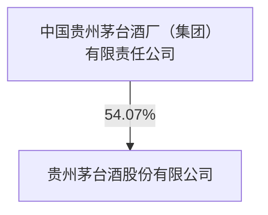
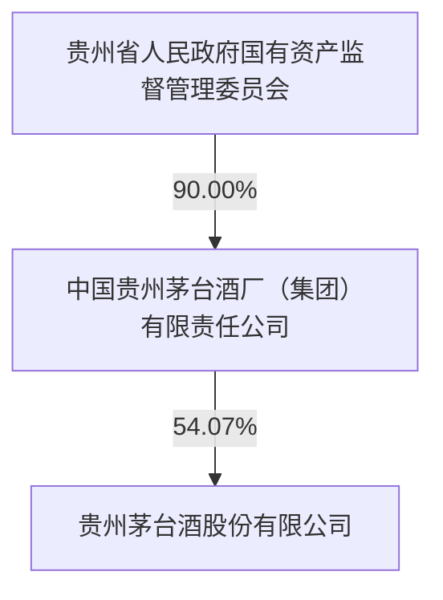

# 第七节 股份变动及股东情况

## 一、股本变动情况

### (一) 股份变动情况表

#### 1、 股份变动情况表

报告期内，公司股份总数及股本结构未发生变化。

#### 2、 股份变动情况说明

□适用 √不适用

#### 3、 股份变动对最近一年和最近一期每股收益、每股净资产等财务指标的影响（如有）

□适用 √不适用

#### 4、 公司认为必要或证券监管机构要求披露的其他内容

□适用 √不适用

### (二) 限售股份变动情况

□适用 √不适用

## 二、证券发行与上市情况

### (一)截至报告期内证券发行情况

□适用 √不适用

截至报告期内证券发行情况的说明（存续期内利率不同的债券，请分别说明）：

□适用 √不适用

### (二)公司股份总数及股东结构变动及公司资产和负债结构的变动情况

□适用 √不适用

### (三)现存的内部职工股情况

□适用 √不适用

## 三、股东和实际控制人情况

(一) 股东总数

<table><tr><td>截至报告期末普通股股东总数(户)</td><td>207,894</td></tr><tr><td>年度报告披露日前上一月末的普通股股东总数(户)</td><td>192,430</td></tr></table>

(二) 截至报告期末前十名股东、前十名流通股东（或无限售条件股东）持股情况表

单位：股

<table><tr><td colspan="8">前十名股东持股情况(不含通过转融通出借股份)</td></tr><tr><td rowspan="2">股东名称(全称)</td><td rowspan="2">报告期内增减</td><td rowspan="2">期末持股数量</td><td rowspan="2">比例(%)</td><td rowspan="2">持有有限售条件股份数量</td><td colspan="2">质押、标记或冻结情况</td><td rowspan="2">股东性质</td></tr><tr><td>股份状态</td><td>数量</td></tr><tr><td>中国贵州茅台酒厂(集团)有限责任公司</td><td></td><td>679,211,576</td><td>54.07</td><td></td><td>无</td><td></td><td>国有法人</td></tr><tr><td>香港中央结算有限公司</td><td>-8,801,297</td><td>77,511,622</td><td>6.17</td><td></td><td>未知</td><td></td><td>未知</td></tr><tr><td>贵州省国有资本运营有限责任公司</td><td></td><td>56,996,777</td><td>4.54</td><td></td><td>未知</td><td></td><td>国有法人</td></tr><tr><td>贵州茅台酒厂(集团)技术开发有限公司</td><td></td><td>27,849,688</td><td>2.22</td><td></td><td>无</td><td></td><td>国有法人</td></tr><tr><td>中国工商银行-上证50交易型开放式指数证券投资基金</td><td>4,143,808</td><td>11,798,210</td><td>0.94</td><td></td><td>未知</td><td></td><td>未知</td></tr><tr><td>中国工商银行股份有限公司-华泰柏瑞沪深300交易型开放式指数证券投资基金</td><td>6,253,657</td><td>10,862,818</td><td>0.86</td><td></td><td>未知</td><td></td><td>未知</td></tr><tr><td>中央汇金资产管理有限责任公司</td><td></td><td>10,397,104</td><td>0.83</td><td></td><td>未知</td><td></td><td>国有法人</td></tr><tr><td>中国证券金融股份有限公司</td><td></td><td>8,039,447</td><td>0.64</td><td></td><td>未知</td><td></td><td>未知</td></tr><tr><td>中国建设银行股份有限公司-易方达沪深300交易型开放式指数发起式证券投资基金</td><td>5,751,664</td><td>7,486,490</td><td>0.60</td><td></td><td>未知</td><td></td><td>未知</td></tr><tr><td>中国人寿保险股份有限公司-传统-普通保险产品-005L-CT001沪</td><td>1,052,217</td><td>5,535,110</td><td>0.44</td><td></td><td>未知</td><td></td><td>未知</td></tr><tr><td colspan="8">前十名无限售条件股东持股情况(不含通过转融通出借股份)</td></tr><tr><td colspan="2" rowspan="2">股东名称</td><td colspan="3" rowspan="2">持有无限售条件流通股的数量</td><td colspan="3">股份种类及数量</td></tr><tr><td>种类</td><td colspan="2">数量</td></tr><tr><td colspan="2">中国贵州茅台酒厂(集团)有限责任公司</td><td colspan="3">679,211,576</td><td>人民币普通股</td><td colspan="2">679,211,576</td></tr><tr><td colspan="2">香港中央结算有限公司</td><td colspan="3">77,511,622</td><td>人民币普通股</td><td colspan="2">77,511,622</td></tr><tr><td colspan="2">贵州省国有资本运营有限责任公司</td><td colspan="3">56,996,777</td><td>人民币普通股</td><td colspan="2">56,996,777</td></tr><tr><td colspan="2">贵州茅台酒厂(集团)技术开发有限公司</td><td colspan="3">27,849,688</td><td>人民币普通股</td><td colspan="2">27,849,688</td></tr><tr><td colspan="2">中国工商银行-上证50交易型开放式指数证券投资基金</td><td colspan="3">11,798,210</td><td>人民币普通股</td><td colspan="2">11,798,210</td></tr><tr><td colspan="2">中国工商银行股份有限公司-华泰柏瑞沪深300交易型开放式指数证券投资基金</td><td colspan="3">10,862,818</td><td>人民币普通股</td><td colspan="2">10,862,818</td></tr><tr><td colspan="2">中央汇金资产管理有限责任公司</td><td colspan="3">10,397,104</td><td>人民币普通股</td><td colspan="2">10,397,104</td></tr><tr><td colspan="2">中国证券金融股份有限公司</td><td colspan="3">8,039,447</td><td>人民币普通股</td><td colspan="2">8,039,447</td></tr><tr><td colspan="2">中国建设银行股份有限公司-易方达沪深300交易型开放式指数发起式证券投资基金</td><td colspan="3">7,486,490</td><td>人民币普通股</td><td colspan="2">7,486,490</td></tr><tr><td colspan="2">中国人寿保险股份有限公司-传统-普通保险产品-005L-CT001沪</td><td colspan="3">5,535,110</td><td>人民币普通股</td><td colspan="2">5,535,110</td></tr><tr><td colspan="2">上述股东关联关系或一致行动的说明</td><td colspan="6">在上述股东中,中国贵州茅台酒厂(集团)有限责任公司与贵州茅台酒厂(集团)技术开发有限公司之间存在关联关系,除此之外,本公司未知其它股东之间的关联关系、是否为一致行动人。</td></tr></table>

持股5%以上股东、前十名股东及前十名无限售流通股股东参与转融通业务出借股份情况

√适用 □不适用

单位：股

持股5%以上股东、前十名股东及前十名无限售流通股股东参与转融通业务出借股份情况

<table><tr><td rowspan="2">股东名称(全称)</td><td colspan="2">期初普通账户、信用账户持股</td><td colspan="2">期初转融通出借股份且尚未归还</td><td colspan="2">期末普通账户、信用账户持股</td><td colspan="2">期末转融通出借股份且尚未归还</td></tr><tr><td>数量合计</td><td>比例(%)</td><td>数量合计</td><td>比例(%)</td><td>数量合计</td><td>比例(%)</td><td>数量合计</td><td>比例(%)</td></tr><tr><td>中国工商银行-上证50交易型开放式指数证券投资基金</td><td>7,654,402</td><td>0.61</td><td>54,400</td><td>0.0043</td><td>11,798,210</td><td>0.94</td><td>0</td><td>0</td></tr><tr><td>中国工商银行股份有限公司-华泰柏瑞沪深300交易型开放式指数证券投资基金</td><td>4,609,161</td><td>0.37</td><td>2,200</td><td>0.0002</td><td>10,862,818</td><td>0.86</td><td>0</td><td>0</td></tr><tr><td>中国建设银行股份有限公司-易方达沪深300交易型开放式指数发起式证券投资基金</td><td>1,734,826</td><td>0.14</td><td>1,000</td><td>0.0001</td><td>7,486,490</td><td>0.60</td><td>0</td><td>0</td></tr></table>

前十名股东及前十名无限售流通股股东因转融通出借/归还原因导致较上期发生变化

□适用 √不适用

前十名有限售条件股东持股数量及限售条件

□适用 √不适用

(三) 战略投资者或一般法人因配售新股成为前 10 名股东

□适用 √不适用

## 四、控股股东及实际控制人情况

### (一) 控股股东情况

#### 1、 法人

√适用 □不适用

<table><tr><td>名称</td><td>中国贵州茅台酒厂(集团)有限责任公司</td></tr><tr><td>单位负责人或法定代表人</td><td>张德芹</td></tr><tr><td>成立日期</td><td>1998-01-24</td></tr><tr><td>主要经营业务</td><td>酒类产品的生产经营(主营);酒类产品的生产技术咨询与服务;包装材料、饮料的生产销售;餐饮、住宿、旅游、物流运输;进出口贸易业务;互联网产业;房地产开发及租赁、停车场管理;教育、卫生;生态农业。</td></tr><tr><td>报告期内控股和参股的其他境内外上市公司的股权情况</td><td>持有交通银行股份有限公司0.24%的股份;持有华创云信数字技术股份有限公司3.97%的股份;持有贵阳银行股份有限公司1.45%的股份;持有贵州省广播电视信息网络股份有限公司10.03%的股份;持有贵州银行股份有限公司12%的股份。</td></tr></table>

#### 2、 自然人

□适用 √不适用

#### 3、 公司不存在控股股东情况的特别说明

□适用 √不适用

#### 4、 报告期内控股股东变更情况的说明

□适用 √不适用

#### 5、 公司与控股股东之间的产权及控制关系的方框图

√适用 □不适用

flowchart

### (二) 实际控制人情况

#### 1、 法人

√适用 □不适用

<table><tr><td>名称</td><td>贵州省人民政府国有资产监督管理委员会</td></tr><tr><td>单位负责人或法定代表人</td><td>阳向东</td></tr></table>

#### 2、 自然人

□适用 √不适用

#### 3、 公司不存在实际控制人情况的特别说明

□适用 √不适用

#### 4、 报告期内公司控制权发生变更的情况说明

□适用 √不适用

#### 5、 公司与实际控制人之间的产权及控制关系的方框图

√适用 □不适用

flowchart

#### 6、 实际控制人通过信托或其他资产管理方式控制公司

□适用 √不适用

### (三) 控股股东及实际控制人其他情况介绍

□适用 √不适用

## 五、公司控股股东或第一大股东及其一致行动人累计质押股份数量占其所持公司股份数量比例达到80%以上

□适用 √不适用

## 六、其他持股在百分之十以上的法人股东

□适用 √不适用

## 七、股份限制减持情况说明

□适用 √不适用

## 八、股份回购在报告期的具体实施情况

√适用 □不适用

单位：元 币种：人民币

<table><tr><td>回购股份方案名称</td><td>《关于以集中竞价交易方式回购公司股份的方案》</td></tr><tr><td>回购股份方案披露时间</td><td>2024/9/21</td></tr><tr><td>拟回购金额</td><td>人民币30亿元(含)~人民币60亿元(含)</td></tr><tr><td>拟回购期间</td><td>公司股东大会审议通过回购方案之日起12个月内</td></tr><tr><td>回购用途</td><td>减少注册资本</td></tr></table>
