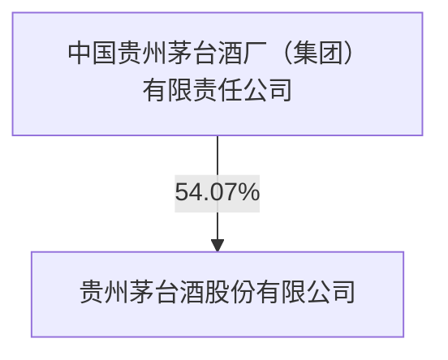
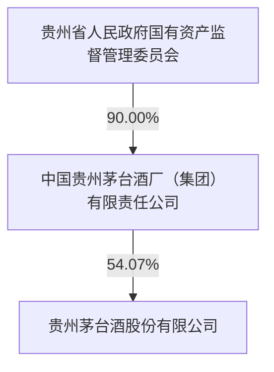

公司代码：600519

公司简称：贵州茅台

# 贵州茅台酒股份有限公司2023 年年度报告

## 重要提示

一、 本公司董事会、监事会及董事、监事、高级管理人员保证年度报告内容的真实性、准确性、完整性，不存在虚假记载、误导性陈述或重大遗漏，并承担个别和连带的法律责任。  
二、 公司全体董事出席董事会会议。  
三、 天职国际会计师事务所（特殊普通合伙）为本公司出具了标准无保留意见的审计报告。  
四、 公司负责人丁雄军、主管会计工作负责人蒋焰及会计机构负责人（会计主管人员）蔡聪应声明：保证年度报告中财务报告的真实、准确、完整。

## 五、 董事会决议通过的本报告期利润分配预案或公积金转增股本预案

公司以实施权益分派股权登记日公司总股本为基数实施2023年度利润分配，向全体股东每10股派发现金红利308.76元（含税）。截至2023年12月31日，公司总股本为125,619.78万股，以此计算合计拟派发现金红利38,786,363,272.80元（含税）。在实施权益分派的股权登记日前公司总股本如发生变动的，将维持分红总额不变，相应调整每股分红比例。以上利润分配预案需提交公司股东大会审议通过后实施。

## 六、 前瞻性陈述的风险声明

√适用 □不适用

本年度报告中所涉及的未来计划、发展战略等前瞻性陈述因存在不确定性，不构成本公司对投资者的实质承诺，敬请投资者注意投资风险。

## 七、 是否存在被控股股东及其他关联方非经营性占用资金情况

否

## 八、 是否存在违反规定决策程序对外提供担保的情况

否

## 九、 是否存在半数以上董事无法保证公司所披露年度报告的真实性、准确性和完整性

否

## 十、 重大风险提示

本公司已在本年度报告中“公司关于公司未来发展的讨论与分析”章节阐述公司可能面对的风险，敬请投资者予以关注。

## 十一、 其他

□适用 √不适用

## 目录

第一节  
第二节 公司简介和主要财务指标..  
第三节 管理层讨论与分析......  
第四节 公司治理..... 2  
第五节 环境与社会责任...... .35  
第六节 重要事项.. .39  
第七节 股份变动及股东情况.. .50  
第八节 优先股相关情况....... .54  
第九节 债券相关情况..... .55  
第十节 财务报告.. .55

<table><tr><td rowspan="3">备查文件目录</td><td>载有公司负责人、主管会计工作负责人及会计机构负责人(会计主管人员)签名并盖章的会计报表。</td></tr><tr><td>载有会计师事务所盖章、注册会计师签名并盖章的审计报告原件。</td></tr><tr><td>报告期内,本公司在《中国证券报》《上海证券报》上公开披露过的公司文件正本及公告的原稿。</td></tr></table>

## 第一节 释义

## 一、 释义

在本报告书中，除非文义另有所指，下列词语具有如下含义：

<table><tr><td colspan="3">常用词语释义</td></tr><tr><td>证监会</td><td>指</td><td>中国证券监督管理委员会</td></tr><tr><td>上交所</td><td>指</td><td>上海证券交易所</td></tr><tr><td>本公司、公司</td><td>指</td><td>贵州茅台酒股份有限公司</td></tr><tr><td>控股股东、集团公司</td><td>指</td><td>中国贵州茅台酒厂(集团)有限责任公司</td></tr><tr><td>报告期</td><td>指</td><td>2023年度</td></tr><tr><td>本报告</td><td>指</td><td>2023年年度报告</td></tr></table>

## 第二节 公司简介和主要财务指标

## 一、 公司信息

<table><tr><td>公司的中文名称</td><td>贵州茅台酒股份有限公司</td></tr><tr><td>公司的中文简称</td><td>贵州茅台</td></tr><tr><td>公司的外文名称</td><td>Kweichow Moutai Co., Ltd.</td></tr><tr><td>公司的法定代表人</td><td>丁雄军</td></tr></table>

## 二、 联系人和联系方式

<table><tr><td></td><td>董事会秘书</td><td>证券事务代表</td></tr><tr><td>姓名</td><td>蒋焰</td><td>蔡聪应</td></tr><tr><td>联系地址</td><td>贵州省仁怀市茅台镇</td><td>贵州省仁怀市茅台镇</td></tr><tr><td>电话</td><td>0851-22386002</td><td>0851-22386002</td></tr><tr><td>传真</td><td>0851-22386193</td><td>0851-22386193</td></tr><tr><td>电子信箱</td><td>mtdm@moutaichina.com</td><td>mtdm@moutaichina.com</td></tr></table>

## 三、 基本情况简介

<table><tr><td>公司注册地址</td><td>贵州省仁怀市茅台镇</td></tr><tr><td>公司办公地址</td><td>贵州省仁怀市茅台镇</td></tr><tr><td>公司办公地址的邮政编码</td><td>564501</td></tr><tr><td>公司网址</td><td>http://www.moutaichina.com/</td></tr><tr><td>电子信箱</td><td>mtdm@moutaichina.com</td></tr></table>

## 四、 信息披露及备置地点

<table><tr><td>公司披露年度报告的媒体名称及网址</td><td>《中国证券报》《上海证券报》</td></tr><tr><td>公司披露年度报告的证券交易所网址</td><td>http://www.sse.com.cn/</td></tr><tr><td>公司年度报告备置地点</td><td>公司董事会办公室</td></tr></table>

## 五、 公司股票简况

<table><tr><td colspan="5">公司股票简况</td></tr><tr><td>股票种类</td><td>股票上市交易所</td><td>股票简称</td><td>股票代码</td><td>变更前股票简称</td></tr><tr><td>A股</td><td>上海证券交易所</td><td>贵州茅台</td><td>600519</td><td></td></tr></table>

## 六、 其他相关资料

<table><tr><td rowspan="3">公司聘请的会计师事务所(境内)</td><td>名称</td><td>天职国际会计师事务所(特殊普通合伙)</td></tr><tr><td>办公地址</td><td>北京市海淀区车公庄西路19号外文文化创意园12号楼</td></tr><tr><td>签字会计师姓名</td><td>唐洪春 刘宗磊 杨舒</td></tr></table>

## 七、 近三年主要会计数据和财务指标

## (一) 主要会计数据

单位：元 币种：人民币

<table><tr><td rowspan="2">主要会计数据</td><td rowspan="2">2023年</td><td colspan="2">2022年</td><td rowspan="2">本期比上年同期增减(%)</td><td colspan="2">2021年</td></tr><tr><td>调整后</td><td>调整前</td><td>调整后</td><td>调整前</td></tr><tr><td>营业收入</td><td>147,693,604,994.14</td><td>124,099,843,771.99</td><td>124,099,843,771.99</td><td>19.01</td><td>106,190,154,843.76</td><td>106,190,154,843.76</td></tr><tr><td>归属于上市公司股东的净利润</td><td>74,734,071,550.75</td><td>62,717,467,870.12</td><td>62,716,443,738.27</td><td>19.16</td><td>52,435,506,622.16</td><td>52,460,144,378.16</td></tr><tr><td>归属于上市公司股东的扣除非经常性损益的净利润</td><td>74,752,564,425.52</td><td>62,792,896,829.57</td><td>62,791,872,697.72</td><td>19.05</td><td>52,556,464,900.24</td><td>52,581,102,656.24</td></tr><tr><td>经营活动产生的现金流量净额</td><td>66,593,247,721.09</td><td>36,698,595,830.03</td><td>36,698,595,830.03</td><td>81.46</td><td>64,028,676,147.37</td><td>64,028,676,147.37</td></tr><tr><td rowspan="2"></td><td rowspan="2">2023年末</td><td colspan="2">2022年末</td><td rowspan="2">本期末比上年同期末增减(%)</td><td colspan="2">2021年末</td></tr><tr><td>调整后</td><td>调整前</td><td>调整后</td><td>调整前</td></tr><tr><td>归属于上市公司股东的净资产</td><td>215,668,571,607.43</td><td>197,480,041,239.46</td><td>197,506,672,396.00</td><td>9.21</td><td>189,511,713,508.90</td><td>189,539,368,797.29</td></tr><tr><td>总资产</td><td>272,699,660,092.25</td><td>254,500,826,096.02</td><td>254,364,804,995.25</td><td>7.15</td><td>255,315,103,017.82</td><td>255,168,195,159.90</td></tr><tr><td>股本</td><td>1,256,197,800.00</td><td>1,256,197,800.00</td><td>1,256,197,800.00</td><td></td><td>1,256,197,800.00</td><td>1,256,197,800.00</td></tr></table>

注：根据财政部2022年11月30日发布《企业会计准则解释16号》，其中 “关于单项交易产生的资产和负债相关的递延所得税不适用初始确认豁免的会计处理”的相关内容自2023年1月1日起施行。本公司对比较期间相关财务数据进行追溯调整，具体详见第十节财务报告五、重要会计政策及会计估计24.重要会计政策和会计估计的变更。本年度报告下文中相关财务数据均为追溯后的数据。

## (二) 主要财务指标

<table><tr><td rowspan="2">主要财务指标</td><td rowspan="2">2023年</td><td colspan="2">2022年</td><td rowspan="2">本期比上年同期增减(%)</td><td colspan="2">2021年</td></tr><tr><td>调整后</td><td>调整前</td><td>调整后</td><td>调整前</td></tr><tr><td>基本每股收益(元/股)</td><td>59.49</td><td>49.93</td><td>49.93</td><td>19.16</td><td>41.74</td><td>41.76</td></tr><tr><td>稀释每股收益(元/股)</td><td>59.49</td><td>49.93</td><td>49.93</td><td>19.16</td><td>41.74</td><td>41.76</td></tr><tr><td>扣除非经常性损益后的基本每股收益(元/股)</td><td>59.51</td><td>49.99</td><td>49.99</td><td>19.05</td><td>41.84</td><td>41.86</td></tr><tr><td>加权平均净资产收益率(%)</td><td>34.19</td><td>30.26</td><td>30.26</td><td>增加3.93个百分点</td><td>29.89</td><td>29.90</td></tr><tr><td>扣除非经常性损益后的加权平均净资产收益率(%)</td><td>34.20</td><td>30.29</td><td>30.29</td><td>增加3.91个百分点</td><td>29.95</td><td>29.97</td></tr></table>

报告期末公司前三年主要会计数据和财务指标的说明

□适用 √不适用

## 八、 境内外会计准则下会计数据差异

## (一) 同时按照国际会计准则与按中国会计准则披露的财务报告中净利润和归属于上市公司股东的净资产差异情况

□适用 √不适用

## (二)同时按照境外会计准则与按中国会计准则披露的财务报告中净利润和归属于上市公司股东的净资产差异情况

□适用 √不适用

## (三)境内外会计准则差异的说明：

□适用 √不适用

## 九、 2023 年分季度主要财务数据

单位：元 币种：人民币

<table><tr><td></td><td>第一季度(1-3月份)</td><td>第二季度(4-6月份)</td><td>第三季度(7-9月份)</td><td>第四季度(10-12月份)</td></tr><tr><td>营业收入</td><td>38,755,812,096.89</td><td>30,820,207,348.88</td><td>33,692,335,242.67</td><td>44,425,250,305.70</td></tr><tr><td>归属于上市公司股东的净利润</td><td>20,794,882,754.55</td><td>15,185,532,336.22</td><td>16,895,801,973.35</td><td>21,857,854,486.63</td></tr><tr><td>归属于上市公司股东的扣除非经常性损益后的净利润</td><td>20,778,475,545.61</td><td>15,168,973,659.84</td><td>16,868,191,551.41</td><td>21,936,923,668.66</td></tr><tr><td>经营活动产生的现金流量净额</td><td>5,244,796,293.93</td><td>25,142,381,901.03</td><td>19,614,828,823.70</td><td>16,591,240,702.43</td></tr></table>

季度数据与已披露定期报告数据差异说明

□适用 √不适用

## 十、 非经常性损益项目和金额

√适用 □不适用

单位:元 币种:人民币

<table><tr><td>非经常性损益项目</td><td>2023年金额</td><td>附注(如适用)</td><td>2022年金额</td><td>2021年金额</td></tr><tr><td>非流动性资产处置损益,包括已计提资产减值准备的冲销部分</td><td>1,152,516.17</td><td></td><td>-20,567,757.19</td><td>-11,920,829.77</td></tr><tr><td>计入当期损益的政府补助,但与公司正常经营业务密切相关、符合国家政策规定、按照确定的标准享有、对公司损益产生持续影响的政府补助除外</td><td>17,137,523.89</td><td></td><td>14,973,304.55</td><td>4,616,000.00</td></tr><tr><td>除同公司正常经营业务相关的有效套期保值业务外,非金融企业持有金融资产和金融负债产生的公允价值变动损益以及处置金融资产和金融负债产生的损益</td><td>2,439,902.57</td><td></td><td></td><td>-3,750,122.23</td></tr><tr><td>除上述各项之外的其他营业外收入和支出</td><td>-47,733,771.71</td><td></td><td>-157,251,041.33</td><td>-210,928,052.99</td></tr><tr><td>其他符合非经常性损益定义的损益项目</td><td>4,710,466.67</td><td></td><td>63,840,000.00</td><td>61,031,069.26</td></tr><tr><td>减:所得税影响额</td><td>-5,573,340.60</td><td></td><td>-24,751,373.49</td><td>-40,237,983.93</td></tr><tr><td>少数股东权益影响额(税后)</td><td>1,772,852.96</td><td></td><td>1,174,838.97</td><td>244,326.28</td></tr><tr><td>合计</td><td>-18,492,874.77</td><td></td><td>-75,428,959.45</td><td>-120,958,278.08</td></tr></table>

对公司将《公开发行证券的公司信息披露解释性公告第 1号——非经常性损益》未列举的项目认定为的非经常性损益项目且金额重大的，以及将《公开发行证券的公司信息披露解释性公告第 1 号——非经常性损益》中列举的非经常性损益项目界定为经常性损益的项目，应说明原因。

□适用 √不适用

## 十一、 采用公允价值计量的项目

√适用 □不适用

单位：元 币种：人民币

<table><tr><td>项目名称</td><td>期初余额</td><td>期末余额</td><td>当期变动</td><td>对当期利润的影响金额</td></tr><tr><td>交易性金融资产</td><td></td><td>400,712,059.93</td><td>400,712,059.93</td><td>24,072,241.71</td></tr><tr><td>其他非流动金融资产</td><td></td><td>4,002,439,902.57</td><td>4,002,439,902.57</td><td>2,439,902.57</td></tr><tr><td>合计</td><td></td><td>4,403,151,962.50</td><td>4,403,151,962.50</td><td>26,512,144.28</td></tr></table>

## 十二、 其他

□适用 √不适用

## 第三节 管理层讨论与分析

## 一、经营情况讨论与分析

2023年，公司坚持以习近平新时代中国特色社会主义思想为指导，深入学习贯彻党的二十大精神和习近平总书记视察贵州重要讲话精神，主动抢抓国发〔2022〕2 号文件机遇，全面落实省委、省政府决策部署，聚焦集团公司“双一流、三突破、五跨越”战略目标，持续走好以茅台美学为价值内涵的“五线”高质量发展道路，“棋心”拼搏，团结奋斗，圆满完成各项目标任务，推动公司高质量发展取得了重要进展，现代化建设迈出了坚实步伐。

## 二、报告期内公司所处行业情况

详见本报告第 14 页“行业基本情况”及第19页“行业格局和趋势”。

## 三、报告期内公司从事的业务情况

公司主要业务是茅台酒及系列酒的生产与销售。主导产品“贵州茅台酒”是我国大曲酱香型白酒的鼻祖和典型代表，集国家地理标志产品、有机食品和国家非物质文化遗产于一身，公司营销网络覆盖国内市场及五大洲 64个国家和地区。多年来，公司始终以对产品品质的极致追求，对酿造生态的精心呵护，对传统工法的传承创新，对企业文化的赓续发展，持续为企业赋能，推动企业高质量发展、现代化建设。

公司经营模式为：采购原料—生产产品—销售产品。原料采购模式为:茅台酒用高粱采取“公司+地方政府+供应商+合作社或农户”的模式，小麦采取“公司+供应商+合作社或农场”的模式，其他原辅料及包装材料采购主要根据公司生产和销售计划，通过集中采购方式向市场采购；产品生产工艺流程为：制曲—制酒—贮存—勾兑—包装；销售模式为：公司产品通过直销和批发代理渠道进行销售。直销渠道指自营和“i 茅台”等数字营销平台渠道，批发代理渠道指社会经销商、商超、电商等渠道。

## 四、报告期内核心竞争力分析

√适用 □不适用

公司拥有环境、工法、品质、品牌、文化组成的“五大核心竞争力”，并拥有独一无二的原产地保护、不可复制的微生物菌落群、传承千年的独特酿造工艺、长期贮存的基酒资源组成的“四个核心势能”。报告期内公司核心竞争力未发生重大变化。

## 五、报告期内主要经营情况

一是经营业绩再创新高。年度内公司实现营业总收入 1,505.60 亿元，同比增长 18.04%；归属于上市公司股东的净利润 747.34 亿元，同比增长 19.16%，主要经济指标保持两位数增长，高质量完成年度战略目标。贵州茅台酒全球唯一千亿级酒类大单品地位持续巩固，茅台 1935 造就“行业奇迹”，上市仅两年成为营收百亿级大单品，茅台王子酒单品营收超 40 亿元，汉酱、贵州大曲、赖茅单品营收分别超 10亿元，形成了千、百、十亿级大单品格局，产品矩阵全面构建。

二是品牌影响持续增大。年内公司市值稳定在 2 万亿元以上，稳居 A 股上市公司第一。茅台以 501 亿美元的品牌价值位列《Brand Finance 2024 年全球品牌价值 500 强》第 24 位，以 884.27亿美元的品牌价值位列《2023年BrandZ 最具价值中国品牌 100强榜》第3 位，稳居“世界酒类品牌”榜首。以10,500亿元的品牌价值和唯一万亿级品牌的绝对优势，第六次登顶胡润榜“最具价值中国品牌”。

三是治理效能不断提升。董事会顺利完成换届工作，新一届董事会成员组成多元、专业互补，以多样化的视角保障董事会决策的科学性；全年董事会召集召开 3 次股东大会审议通过 17 项议案，召开 13 次董事会会议审议通过 45 项议案，董事会“六大职权”得到有效落实。推进全面风险管理体系建设，风险管理生态初步形成。成功入选了国务院国资委新一批“双百企业”名单，获评中国上市公司协会公司治理最佳实践，第三次荣获全国质量奖，高分通过欧洲质量奖评审，管理基础进一步夯实，企业现代化治理能力和水平进一步提升。

四是 ESG管理提质增效。全面、全域践行 ESG 理念，将 ESG理念深度融入生产经营、改革发展各环节。健全 ESG 治理架构，成立 ESG 推进委员会，同步设立环境、社会、治理三个分委会和9个工作小组，对标国际规范和先进实践，按照议题识别、整体规划、融入实施、改进创新四个步骤，系统梳理核心议题和重点项目，建立 ESG 实质性议题矩阵，优化公司整体的 ESG 管理体系，充分发挥管理机制效能，ESG管理水平有效提升。

五是股东回报稳中有升。切实提升信息披露质量，增强信息披露的针对性、有效性和可读性，通过披露生产经营数据等自愿性公告，及时向市场展现公司高质量发展现状，获得上海证券交易所信息披露 A 级（优秀）评价。以坦诚、开放态度积极与投资者交流，频次创历年之最，交流形式极大丰富，首次在上海证券交易所交易大厅召开业绩说明会，视频观看人次居 A 股前列，获评中国上市公司协会业绩说明会最佳实践。再次实施特别分红，全年共计派发现金红利 565.5亿元，占公司2023年归母净利润的 75.67%，分红金额较上年提高约 18亿元，再创历史新高，以实际行动回报投资者。

## (一) 主营业务分析

## 1. 利润表及现金流量表相关科目变动分析表

单位：元 币种：人民币

<table><tr><td>科目</td><td>本期数</td><td>上年同期数</td><td>变动比例(%)</td></tr><tr><td>营业收入</td><td>147,693,604,994.14</td><td>124,099,843,771.99</td><td>19.01</td></tr><tr><td>营业成本</td><td>11,867,273,851.78</td><td>10,093,468,616.63</td><td>17.57</td></tr><tr><td>销售费用</td><td>4,648,613,585.82</td><td>3,297,724,190.94</td><td>40.96</td></tr><tr><td>管理费用</td><td>9,729,389,252.31</td><td>9,012,191,073.63</td><td>7.96</td></tr><tr><td>财务费用</td><td>-1,789,503,701.48</td><td>-1,391,805,826.72</td><td>不适用</td></tr><tr><td>研发费用</td><td>157,371,873.01</td><td>135,185,680.40</td><td>16.41</td></tr><tr><td>经营活动产生的现金流量净额</td><td>66,593,247,721.09</td><td>36,698,595,830.03</td><td>81.46</td></tr><tr><td>投资活动产生的现金流量净额</td><td>-9,724,414,015.16</td><td>-5,536,826,334.90</td><td>不适用</td></tr><tr><td>筹资活动产生的现金流量净额</td><td>-58,889,101,991.94</td><td>-57,424,528,979.83</td><td>不适用</td></tr></table>

营业收入变动原因说明：主要是本期销量增加、销售渠道、产品结构变化及主要产品销售价格调整。

营业成本变动原因说明：主要是本期销量增加、生产成本增加及产品结构变化。

销售费用变动原因说明：主要是本期广告及市场拓展费用增加。

管理费用变动原因说明：主要是本期商标许可使用费、固定资产折旧费增加。

财务费用变动原因说明：主要是本期商业银行存款利息收入增加。

研发费用变动原因说明：主要是本期研发项目增加。

经营活动产生的现金流量净额变动原因说明：主要是本期公司销售商品收到的现金增加及公司控股子公司贵州茅台集团财务有限公司不可提前支取的定期存款净增加额减少。

投资活动产生的现金流量净额变动原因说明：主要是本期公司控股子公司贵州茅台集团财务有限公司购买同业存单增加及公司新增产业发展基金投资。

筹资活动产生的现金流量净额变动原因说明：主要是分配现金红利增加。

本期公司业务类型、利润构成或利润来源发生重大变动的详细说明

□适用 √不适用

## 2. 收入和成本分析

√适用 □不适用

## (1).主营业务分行业、分产品、分地区、分销售模式情况

单位:元 币种:人民币

<table><tr><td colspan="7">主营业务分行业情况</td></tr><tr><td>分行业</td><td>营业收入</td><td>营业成本</td><td>毛利率(%)</td><td>营业收入比上年增减(%)</td><td>营业成本比上年增减(%)</td><td>毛利率比上年增减(%)</td></tr><tr><td>酒类</td><td>147,218,996,281.04</td><td>11,620,203,653.32</td><td>92.11</td><td>18.94</td><td>17.42</td><td>0.11</td></tr><tr><td colspan="7">主营业务分产品情况</td></tr><tr><td>分产品</td><td>营业收入</td><td>营业成本</td><td>毛利率(%)</td><td>营业收入比上年增减(%)</td><td>营业成本比上年增减(%)</td><td>毛利率比上年增减(%)</td></tr><tr><td>茅台酒</td><td>126,589,066,691.89</td><td>7,445,470,669.11</td><td>94.12</td><td>17.39</td><td>18.83</td><td>-0.07</td></tr><tr><td>其他系列酒</td><td>20,629,929,589.15</td><td>4,174,732,984.21</td><td>79.76</td><td>29.43</td><td>15.00</td><td>2.54</td></tr><tr><td colspan="7">主营业务分地区情况</td></tr><tr><td>分地区</td><td>营业收入</td><td>营业成本</td><td>毛利率(%)</td><td>营业收入比上年增减(%)</td><td>营业成本比上年增减(%)</td><td>毛利率比上年增减(%)</td></tr><tr><td>国内</td><td>142,868,885,823.91</td><td>11,280,212,551.30</td><td>92.10</td><td>19.52</td><td>18.01</td><td>0.10</td></tr><tr><td>国外</td><td>4,350,110,457.13</td><td>339,991,102.02</td><td>92.18</td><td>2.61</td><td>0.76</td><td>0.14</td></tr><tr><td colspan="7">主营业务分销售模式情况</td></tr><tr><td>销售模式</td><td>营业收入</td><td>营业成本</td><td>毛利率(%)</td><td>营业收入比上年增减(%)</td><td>营业成本比上年增减(%)</td><td>毛利率比上年增减(%)</td></tr><tr><td>批发代理</td><td>79,986,119,397.90</td><td>8,569,360,111.66</td><td>89.29</td><td>7.52</td><td>6.82</td><td>0.07</td></tr><tr><td>直销</td><td>67,232,876,883.14</td><td>3,050,843,541.66</td><td>95.46</td><td>36.16</td><td>62.78</td><td>-0.74</td></tr></table>

## (2).产销量情况分析表

√适用 □不适用

<table><tr><td>主要产品</td><td>单位</td><td>生产量</td><td>销售量</td><td>库存量</td><td>生产量比上年增减(%)</td><td>销售量比上年增减(%)</td><td>库存量比上年增减(%)</td></tr><tr><td>酒类</td><td>吨</td><td>100,141.15</td><td>73,274.04</td><td>293,790.03</td><td>8.98</td><td>7.48</td><td>6.21</td></tr></table>

## (3).重大采购合同、重大销售合同的履行情况

□适用 √不适用

## (4).成本分析表

单位：元

<table><tr><td colspan="9">分行业情况</td></tr><tr><td colspan="2">分行业</td><td>成本构成项目</td><td>本期金额</td><td>本期占总成本比例(%)</td><td>上年同期金额</td><td>上年同期占总成本比例(%)</td><td>本期金额较上年同期变动比例(%)</td><td>情况说明</td></tr><tr><td colspan="2">酒类</td><td></td><td>11,620,203,653.32</td><td>100.00</td><td>9,896,113,336.80</td><td>100.00</td><td>17.42</td><td></td></tr><tr><td colspan="9">分产品情况</td></tr><tr><td>分产品</td><td colspan="2">成本构成项目</td><td>本期金额</td><td>本期占总成本比例(%)</td><td>上年同期金额</td><td>上年同期占总成本比例(%)</td><td>本期金额较上年同期变动比例(%)</td><td>情况说明</td></tr><tr><td rowspan="6">酒类</td><td colspan="2">直接材料</td><td>5,984,160,283.88</td><td>51.50</td><td>5,344,548,452.24</td><td>54.00</td><td>11.97</td><td></td></tr><tr><td colspan="2">直接人工</td><td>4,372,013,596.08</td><td>37.63</td><td>3,395,434,595.85</td><td>34.31</td><td>28.76</td><td></td></tr><tr><td colspan="2">制造费用</td><td>640,613,571.24</td><td>5.51</td><td>558,168,244.61</td><td>5.64</td><td>14.77</td><td></td></tr><tr><td colspan="2">燃料动力</td><td>351,386,305.23</td><td>3.02</td><td>342,073,450.40</td><td>3.46</td><td>2.72</td><td></td></tr><tr><td colspan="2">运输费</td><td>272,029,896.89</td><td>2.34</td><td>255,888,593.70</td><td>2.59</td><td>6.31</td><td></td></tr><tr><td colspan="2">合计</td><td>11,620,203,653.32</td><td>100.00</td><td>9,896,113,336.80</td><td>100.00</td><td>17.42</td><td></td></tr></table>

## (5).报告期主要子公司股权变动导致合并范围变化

□适用 √不适用

## (6).公司报告期内业务、产品或服务发生重大变化或调整有关情况

□适用 √不适用

## (7).主要销售客户及主要供应商情况

A.公司主要销售客户情况

√适用 □不适用

前五名客户销售额 1,470,945.68 万元，占年度销售总额 9.99%；其中前五名客户销售额中关联方销售额550,892.63万元，占年度销售总额 3.74%。

报告期内向单个客户的销售比例超过总额的50%、前 5名客户中存在新增客户的或严重依赖于少数客户的情形

□适用 √不适用

## B.公司主要供应商情况

√适用 □不适用

前五名供应商采购额 290,769.31 万元，占年度采购总额 36.45%；其中前五名供应商采购额中关联方采购额114,681.31万元，占年度采购总额14.38%。

报告期内向单个供应商的采购比例超过总额的 50%、前 5名供应商中存在新增供应商的或严重依赖于少数供应商的情形

□适用 √不适用

## 3. 费用

√适用 □不适用

销售费用本期 4,648,613,585.82 元，上期 3,297,724,190.94 元，同比增加主要是本期广告及市场拓展费用增加。

财务费用本期-1,789,503,701.48 元，上期-1,391,805,826.72 元，同比变动主要是本期商业银行存款利息收入增加。

## 4. 研发投入

## (1).研发投入情况表

√适用 □不适用

单位：元

<table><tr><td>本期费用化研发投入</td><td>477,957,725.95</td></tr><tr><td>本期资本化研发投入</td><td>143,549,809.92</td></tr><tr><td>研发投入合计</td><td>621,507,535.87</td></tr><tr><td>研发投入总额占营业收入比例(%)</td><td>0.42</td></tr><tr><td>研发投入资本化的比重(%)</td><td>23.10</td></tr></table>

注：本期费用化研发支出包括列入生产成本的研发支出及科研人员工资等支出。

## (2).研发人员情况表

√适用 □不适用

<table><tr><td>公司研发人员的数量</td><td>800</td></tr><tr><td>研发人员数量占公司总人数的比例(%)</td><td>2.40</td></tr><tr><td colspan="2">研发人员学历结构</td></tr><tr><td>学历结构类别</td><td>学历结构人数</td></tr><tr><td>博士研究生</td><td>85</td></tr><tr><td>硕士研究生</td><td>178</td></tr><tr><td>本科</td><td>460</td></tr><tr><td>专科</td><td>63</td></tr><tr><td>高中及以下</td><td>14</td></tr><tr><td colspan="2">研发人员年龄结构</td></tr><tr><td>年龄结构类别</td><td>年龄结构人数</td></tr><tr><td>30岁以下(不含30岁)</td><td>154</td></tr><tr><td>30-40岁(含30岁,不含40岁)</td><td>422</td></tr><tr><td>40-50岁(含40岁,不含50岁)</td><td>157</td></tr><tr><td>50-60岁(含50岁,不含60岁)</td><td>52</td></tr><tr><td>60岁及以上</td><td>15</td></tr></table>

## (3).情况说明

□适用 √不适用

## (4).研发人员构成发生重大变化的原因及对公司未来发展的影响

□适用 √不适用

## 5. 现金流

√适用 □不适用

单位：元 币种：人民币

<table><tr><td>项目</td><td>本期发生额</td><td>上期发生额</td><td>本期比上年同期增减(%)</td></tr><tr><td>△客户存款和同业存放款项净增加额</td><td>-810,223,002.76</td><td>-8,916,033,228.67</td><td>不适用</td></tr><tr><td>收到的税费返还</td><td>1,500,047.04</td><td>33,191,912.56</td><td>-95.48</td></tr><tr><td>购买商品、接受劳务支付的现金</td><td>11,029,476,036.21</td><td>8,357,859,151.03</td><td>31.97</td></tr><tr><td>△客户贷款及垫款净增加额</td><td>-2,051,930,316.19</td><td>723,778,672.00</td><td>不适用</td></tr><tr><td>拆出资金净增加额</td><td>2,500,000,000.00</td><td>0.00</td><td>不适用</td></tr><tr><td>△存放中央银行和同业款项净增加额</td><td>1,570,003,429.01</td><td>13,037,761,321.90</td><td>-87.96</td></tr><tr><td>△支付利息、手续费及佣金的现金</td><td>142,896,151.21</td><td>79,226,410.98</td><td>80.36</td></tr><tr><td>支付其他与经营活动有关的现金</td><td>7,943,709,518.14</td><td>5,123,087,432.89</td><td>55.06</td></tr><tr><td>收回投资收到的现金</td><td>7,549,947,301.15</td><td>0.00</td><td>不适用</td></tr><tr><td>取得投资收益收到的现金</td><td>140,715,000.00</td><td>5,880,000.00</td><td>2,293.11</td></tr><tr><td>处置固定资产、无形资产和其他长期资产收回的现金净额</td><td>24,948,352.95</td><td>355,149.00</td><td>6,924.76</td></tr><tr><td>购建固定资产、无形资产和其他长期资产支付的现金</td><td>2,619,755,888.79</td><td>5,306,546,416.54</td><td>-50.63</td></tr><tr><td>投资支付的现金</td><td>14,817,852,800.00</td><td>210,000,000.00</td><td>6,956.12</td></tr><tr><td>支付其他与投资活动有关的现金</td><td>7,021,867.10</td><td>31,486,829.54</td><td>-77.70</td></tr><tr><td>支付其他与筹资活动有关的现金</td><td>134,315,261.93</td><td>54,332,788.37</td><td>147.21</td></tr><tr><td>汇率变动对现金及现金等价物的影响</td><td>1,718,255.65</td><td>911,088.01</td><td>88.59</td></tr></table>

（1）客户存款和同业存放款项净增加额变动主要是上期集团公司划转贵州习酒股份有限公司股权，贵州习酒股份有限公司不再是公司控股子公司贵州茅台集团财务有限公司成员单位，公司上期吸收存款减少较多。  
（2）收到的税费返还减少主要是公司控股子公司贵州茅台酒销售有限公司上期收到留抵退税款。  
（3）购买商品、接受劳务支付的现金增加主要是公司采购材料等支付的现金增加。  
（4）客户贷款及垫款净增加额减少主要是公司控股子公司贵州茅台集团财务有限公司收回发放贷款。  
（5）拆出资金净增加额增加主要是公司控股子公司贵州茅台集团财务有限公司向同业拆出资金增加。  
（6）存放中央银行和同业款项净增加额减少主要是公司控股子公司贵州茅台集团财务有限公司存入的不可提前支取的同业定期存款净增加额较上期减少。  
（7）支付利息、手续费及佣金的现金增加主要是公司控股子公司贵州茅台集团财务有限公司支付利息较上期增加。  
（8）支付其他与经营活动有关的现金增加主要是支付市场投入增加。

（9）收回投资收到的现金增加主要是本期收回大额存单及公司控股子公司贵州茅台集团财务有限公司收回同业存单。  
（10）取得投资收益收到的现金增加主要是公司收到大额存单利息增加。  
（11）处置固定资产、无形资产和其他长期资产收回的现金净额增加主要是本期收到处置固定资产的现金较上期增加。  
（12）购建固定资产、无形资产和其他长期资产支付的现金减少主要是支付基本建设工程款较上期减少。  
（13）投资支付的现金增加主要是本期公司控股子公司贵州茅台集团财务有限公司购买同业存单及公司新增产业发展基金投资。  
（14）支付其他与投资活动有关的现金减少是退付的基本建设履约保证金较上期减少。  
（15）支付其他与筹资活动有关的现金增加是本期支付的租赁费用较上期增加。  
(16) 汇率变动对现金及现金等价物的影响增加是公司全资子公司贵州茅台酒巴黎贸易有限公司境外经营财务报表折算为记账本位币报表产生的外币折算差额。

## (二) 非主营业务导致利润重大变化的说明

□适用 √不适用

## (三) 资产、负债情况分析

√适用 □不适用

## 1. 资产及负债状况

单位：元

<table><tr><td>项目名称</td><td>本期期末数</td><td>本期期末数占总资产的比例(%)</td><td>上期期末数</td><td>上期期末数占总资产的比例(%)</td><td>本期期末金额较上期期末变动比例(%)</td><td>情况说明</td></tr><tr><td>货币资金</td><td>69,070,136,376.12</td><td>25.33</td><td>58,274,318,733.23</td><td>22.90</td><td>18.53</td><td></td></tr><tr><td>交易性金融资产</td><td>400,712,059.93</td><td>0.15</td><td></td><td></td><td>不适用</td><td>主要是公司控股子公司贵州茅台集团财务有限公司债务工具投资增加</td></tr><tr><td>应收票据</td><td>13,933,440.00</td><td>0.01</td><td>105,453,212.00</td><td>0.04</td><td>-86.79</td><td>主要是公司全资子公司贵州茅台酱香酒营销有限公司银行承兑汇票办理销售业务减少</td></tr><tr><td>应收账款</td><td>60,373,410.41</td><td>0.02</td><td>20,937,144.00</td><td>0.01</td><td>188.36</td><td>主要是公司控股子公司贵州茅台酒销售有限公司通过线上平台销售,平台系统采用T+7模式进行货款结算。</td></tr><tr><td>预付账款</td><td>34,585,111.79</td><td>0.01</td><td>897,377,162.27</td><td>0.35</td><td>-96.15</td><td>主要是预付土地挂牌保证金转无形资产</td></tr><tr><td>买入返售金融资产</td><td>3,504,849,885.05</td><td>1.29</td><td></td><td></td><td>不适用</td><td>是公司控股子公司贵州茅台集团财务有限公司开展国债逆回购业务</td></tr><tr><td>存货</td><td>46,435,185,061.53</td><td>17.03</td><td>38,824,374,236.24</td><td>15.26</td><td>19.60</td><td></td></tr><tr><td>其他流动资产</td><td>71,403,906.57</td><td>0.03</td><td>160,843,674.42</td><td>0.06</td><td>-55.61</td><td>主要是留抵增值税进项税额减少</td></tr><tr><td>一年内到期的非流动资产</td><td></td><td></td><td>2,123,601,333.33</td><td>0.83</td><td>-100.00</td><td>主要是大额存单到期</td></tr><tr><td>发放贷款及垫款</td><td>2,130,818,189.27</td><td>0.78</td><td>4,134,744,407.92</td><td>1.62</td><td>-48.47</td><td>主要是公司控股子公司贵州茅台集团财务有限公司收回发放给成员单位的贷款</td></tr><tr><td>债权投资</td><td>5,323,002,071.02</td><td>1.95</td><td>380,685,319.09</td><td>0.15</td><td>1,298.27</td><td>主要是公司控股子公司贵州茅台集团财务有限公司购买债券增加</td></tr><tr><td>固定资产</td><td>19,909,280,655.97</td><td>7.30</td><td>19,742,622,547.86</td><td>7.76</td><td>0.84</td><td></td></tr><tr><td>其他非流动金融资产</td><td>4,002,439,902.57</td><td>1.47</td><td></td><td></td><td>不适用</td><td>公司新增产业基金投资</td></tr><tr><td>其他非流动资产</td><td>109,563,497.23</td><td>0.04</td><td></td><td></td><td>不适用</td><td>主要是新增在建信息化项目</td></tr><tr><td>一年内到期的非流动负债</td><td>57,054,879.48</td><td>0.02</td><td>109,351,155.28</td><td>0.04</td><td>-47.82</td><td>主要是应付租赁费用减少</td></tr><tr><td>递延所得税负债</td><td>78,943,062.19</td><td>0.03</td><td>162,628,090.99</td><td>0.06</td><td>-51.46</td><td>主要是实施《企业会计准则解释第16号》影响</td></tr><tr><td>其他综合收益</td><td>-6,061,727.51</td><td></td><td>-10,776,907.33</td><td></td><td>不适用</td><td>公司全资子公司贵州茅台酒巴黎贸易有限公司境外经营财务报表折算为记账本位币报表产生的差额</td></tr></table>

## 2. 境外资产情况

√适用 □不适用

## (1) 资产规模

其中：境外资产87,432,153.36（单位：元 币种：人民币），占总资产的比例为 0.03%。

## (2) 境外资产占比较高的相关说明

□适用 √不适用

## 3. 截至报告期末主要资产受限情况

□适用 √不适用

## 4. 其他说明

□适用 √不适用

## (四) 行业经营性信息分析

√适用 □不适用

## 酒制造行业经营性信息分析

## 1 行业基本情况

√适用 □不适用

根据国家统计局、中国酒业协会数据，2023年全国规模以上白酒企业完成酿酒总产量 449.2万千升，同比下降2.8%；实现销售收入7563亿元，同比增长 9.7%；实现利润总额 2328亿元，同比增长7.5%。

## 2 产能状况

现有产能  
√适用 □不适用

<table><tr><td>主要工厂名称</td><td>设计产能</td><td>实际产能</td></tr><tr><td>茅台酒制酒车间</td><td>42,795.00</td><td>57,204.11</td></tr><tr><td>系列酒制酒车间</td><td>44,460.00</td><td>42,937.04</td></tr></table>

说明：（1）2023 年茅台酒基酒设计产能为 42,795.00 吨，同比新增基酒产能 52.50 吨，新增产能于 2023 年 10 月投产，由于茅台酒的生产工艺特点，将在 2024 年释放；2023 年系列酒基酒设计产能为44,460.00吨，同比新增基酒产能6,400.00吨，新增产能于2023 年 11月投产，由于系列酒的生产工艺特点，将在2024年释放。（2）按照公司惯例,本报告中设计产能、实际产能的计量单位为“吨”。

## 在建产能

√适用 □不适用

单位：万元 币种：人民币

<table><tr><td>在建产能名称</td><td>计划投资金额</td><td>报告期内投资金额</td><td>累积投资金额</td></tr><tr><td>3万吨酱香系列酒技改工程及其配套设施项目</td><td>838,400.00</td><td>63,490.00</td><td>550,116.00</td></tr><tr><td>“十四五”酱香酒习水同民坝一期建设项目</td><td>411,000.00</td><td>45,310.00</td><td>88,160.00</td></tr><tr><td>茅台酒“十四五”技改建设项目</td><td>1,551,600.00</td><td>120,203.00</td><td>120,288.00</td></tr></table>

产能计算标准

√适用 □不适用

上述“现有产能”表格中，设计产能按生产工艺要求，结合厂房规格、窖池数量计算，实际产能按报告期实际基酒产量计算。

## 3 产品期末库存量

√适用 □不适用

单位:吨

<table><tr><td>成品酒</td><td>半成品酒(含基础酒)</td></tr><tr><td>13,985.07</td><td>279,804.96</td></tr></table>

注：成品酒为公司已包装的库存商品（含酱香系列酒）。

存货减值风险提示

□适用 √不适用

## 4 产品情况

√适用 □不适用

单位:万元 币种:人民币

<table><tr><td>产品档次</td><td>产量(吨)</td><td>同比(%)</td><td>销量(吨)</td><td>同比(%)</td><td>产销率(%)</td><td>销售收入</td><td>同比(%)</td><td>主要代表品牌</td></tr><tr><td>茅台酒</td><td>57,204.11</td><td>0.69</td><td>42,109.50</td><td>11.10</td><td></td><td>12,658,906.67</td><td>17.39</td><td>贵州茅台酒</td></tr><tr><td>其他系列酒</td><td>42,937.04</td><td>22.41</td><td>31,164.54</td><td>2.94</td><td></td><td>2,062,992.96</td><td>29.43</td><td>茅台王子酒、茅台1935酒、汉酱酒、赖茅酒</td></tr></table>

注：（1）为保证公司可持续发展，每年需留存一定量的基酒，按生产工艺，茅台酒从生产到出厂至少需要五年。（2）茅台酒是由不同年份、不同轮次、不同浓度的基酒相互勾兑而成，是技术和艺术的完美结合，因此某一年份的基酒可能在未来数年都会作为产品出现。（3）公司坚持质量是生命之魂，坚持五匠质量观，坚持“崇本守道，坚守工艺，贮足陈酿，不卖新酒”，茅台酒的生产属于自然固态发酵，传统工艺酿造，成品率具有一定波动性。（4）基于上述原因，茅台酒基酒产销率不能精准计算。系列酒的产品形成过程近似于茅台酒。

产品档次划分标准

√适用 □不适用

按产品品质划分。

产品结构变化情况及经营策略

□适用 √不适用

## 5 原料采购情况

## (1).采购模式

√适用 □不适用

茅台酒用高粱采取“公司+地方政府+供应商+合作社或农户”的模式，小麦采取“公司+供应商+合作社或农场”的模式，其他原辅料及包装材料采购主要根据公司生产和销售计划，通过集中采购方式向市场采购。

## (2).采购金额

√适用 □不适用

单位:万元 币种:人民币

<table><tr><td>原料类别</td><td>当期采购金额</td><td>上期采购金额</td><td>占当期总采购额的比重(%)</td></tr><tr><td>酿酒原材料</td><td>352,140.58</td><td>248,398.92</td><td>44.15</td></tr><tr><td>包装材料</td><td>396,702.84</td><td>290,243.05</td><td>49.73</td></tr><tr><td>能源</td><td>35,724.12</td><td>48,982.94</td><td>4.48</td></tr><tr><td>车间辅助材料</td><td>13,122.59</td><td>6,898.38</td><td>1.36</td></tr></table>

## 6 销售情况

## (1).销售模式

√适用 □不适用

公司产品通过直销和批发代理渠道进行销售。直销渠道指自营和“i茅台”等数字营销平台渠道，批发代理渠道指社会经销商、商超、电商等渠道。

## (2).销售渠道

√适用 □不适用

单位：万元 币种：人民币

<table><tr><td>渠道类型</td><td>本期销售收入</td><td>上期销售收入</td><td>本期销售量(吨)</td><td>上期销售量(吨)</td></tr><tr><td>直销</td><td>6,723,287.69</td><td>4,937,873.77</td><td>15,634.95</td><td>11,186.57</td></tr><tr><td>批发代理</td><td>7,998,611.94</td><td>7,439,359.47</td><td>57,639.09</td><td>56,989.75</td></tr></table>

## (3).区域情况

√适用 □不适用

单位：万元 币种：人民币

<table><tr><td>区域名称</td><td>本期销售收入</td><td>上期销售收入</td><td>本期占比(%)</td><td>本期销售量(吨)</td><td>上期销售量(吨)</td><td>本期占比(%)</td></tr><tr><td>国内</td><td>14,286,888.58</td><td>11,953,275.29</td><td>97.05</td><td>71,295.43</td><td>66,162.41</td><td>97.30</td></tr><tr><td>国外</td><td>435,011.05</td><td>423,957.95</td><td>2.95</td><td>1,978.61</td><td>2,013.91</td><td>2.70</td></tr></table>

区域划分标准

□适用 √不适用

## (4).经销商情况

√适用 □不适用

单位:个

<table><tr><td>区域名称</td><td>报告期末经销商数量</td><td>报告期内增加数量</td><td>报告期内减少数量</td></tr><tr><td>国内</td><td>2080</td><td>1</td><td>5</td></tr><tr><td>国外</td><td>106</td><td>1</td><td></td></tr></table>

情况说明

□适用 √不适用

经销商管理情况

□适用 √不适用

## (5).线上销售情况

√适用 □不适用

单位：万元 币种：人民币

<table><tr><td>线上销售平台</td><td>线上销售产品档次</td><td>本期销售收入</td><td>上期销售收入</td><td>同比(%)</td><td>毛利率(%)</td></tr><tr><td>“i 茅台”数字营销平台</td><td>中、高档酒</td><td>2,237,432.35</td><td>1,188,270.28</td><td>88.29</td><td>96.09</td></tr><tr><td>其他线上平台</td><td>中、高档酒</td><td>183,125.55</td><td></td><td>不适用</td><td>95.95</td></tr></table>

未来线上经营战略

□适用 √不适用

## 7 公司收入及成本分析

## (1).按不同类型披露公司主营业务构成

√适用 □不适用

单位：元 币种：人民币

<table><tr><td>划分类型</td><td>营业收入</td><td>同比(%)</td><td>营业成本</td><td>同比(%)</td><td>毛利率(%)</td><td>同比(%)</td></tr><tr><td colspan="7">按产品档次</td></tr><tr><td>茅台酒</td><td>126,589,066,691.89</td><td>17.39</td><td>7,445,470,669.11</td><td>18.83</td><td>94.12</td><td>-0.07</td></tr><tr><td>其他系列酒</td><td>20,629,929,589.15</td><td>29.43</td><td>4,174,732,984.21</td><td>15.00</td><td>79.76</td><td>2.54</td></tr><tr><td>小计</td><td>147,218,996,281.04</td><td>18.94</td><td>11,620,203,653.32</td><td>17.42</td><td>92.11</td><td>0.11</td></tr><tr><td colspan="7">按销售渠道</td></tr><tr><td>批发代理</td><td>79,986,119,397.90</td><td>7.52</td><td>8,569,360,111.66</td><td>6.82</td><td>89.29</td><td>0.07</td></tr><tr><td>直销</td><td>67,232,876,883.14</td><td>36.16</td><td>3,050,843,541.66</td><td>62.78</td><td>95.46</td><td>-0.74</td></tr><tr><td>小计</td><td>147,218,996,281.04</td><td>18.94</td><td>11,620,203,653.32</td><td>17.42</td><td>92.11</td><td>0.11</td></tr><tr><td colspan="7">按地区分部</td></tr><tr><td>国内</td><td>142,868,885,823.91</td><td>19.52</td><td>11,280,212,551.30</td><td>18.01</td><td>92.10</td><td>0.10</td></tr><tr><td>国外</td><td>4,350,110,457.13</td><td>2.61</td><td>339,991,102.02</td><td>0.76</td><td>92.18</td><td>0.14</td></tr><tr><td>小计</td><td>147,218,996,281.04</td><td>18.94</td><td>11,620,203,653.32</td><td>17.42</td><td>92.11</td><td>0.11</td></tr></table>

情况说明

□适用 √不适用

## (2).成本情况

√适用 □不适用

情况说明

√适用 □不适用

详见第三节管理层讨论与分析(一)主营业务分析（4）成本分析表

## (五) 投资状况分析

## 对外股权投资总体分析

□适用 √不适用

## 1. 重大的股权投资

□适用 √不适用

## 2. 重大的非股权投资

√适用 □不适用

非募集资金项目情况（投资总额超过公司上年度末经审计净资产10%的项目）

根据公司2011年度股东大会决议，公司拟用 358,316.00万元投资建设酱香型系列酒制酒技改工程及配套设施项目。截止报告期末，共投入资金 205,354.57万元。

## 3. 以公允价值计量的金融资产

√适用 □不适用

单位：元 币种：人民币

<table><tr><td>资产类别</td><td>期初数</td><td>本期公允价值变动损益</td><td>计入权益的累计公允价值变动</td><td>本期计提的减值</td><td>本期购买金额</td><td>本期出售/赎回金额</td><td>其他变动</td><td>期末数</td></tr><tr><td>债券</td><td></td><td>24,072,241.71</td><td></td><td></td><td>3,900,000,000.00</td><td>3,523,360,181.78</td><td></td><td>400,712,059.93</td></tr><tr><td>私募基金</td><td></td><td>2,439,902.57</td><td></td><td></td><td>4,000,000,000.00</td><td></td><td></td><td>4,002,439,902.57</td></tr><tr><td>合计</td><td></td><td>26,512,144.28</td><td></td><td></td><td>7,900,000,000.00</td><td>3,523,360,181.78</td><td></td><td>4,403,151,962.50</td></tr></table>

证券投资情况

□适用 √不适用

证券投资情况的说明

□适用 √不适用

私募基金投资情况

√适用 □不适用

1. 茅台招华（贵州）产业发展基金合伙企业（有限合伙）。已完成私募基金备案。详见公司临2023-014，临 2023-028 号公告，www.sse.com.cn.；  
2. 茅台金石（贵州）产业发展基金合伙企业（有限合伙）。已完成私募基金备案。详见公司临2023-014，临 2023-028 号公告，www.sse.com.cn.。

衍生品投资情况

□适用 √不适用

## 4. 报告期内重大资产重组整合的具体进展情况

□适用 √不适用

## (六) 重大资产和股权出售

□适用 √不适用

## (七) 主要控股参股公司分析

√适用 □不适用

单位：万元 币种：人民币

<table><tr><td>子公司全称</td><td>所处行业</td><td>注册资本</td><td>总资产</td><td>净资产</td><td>营业收入</td><td>营业利润</td><td>净利润</td></tr><tr><td>贵州茅台酒销售有限公司</td><td>酒、饮料及茶叶批发</td><td>1,000.00</td><td>8,774,200.15</td><td>5,457,173.45</td><td>12,225,461.71</td><td>5,680,845.69</td><td>4,259,628.69</td></tr></table>

## (八) 公司控制的结构化主体情况

□适用 √不适用

## 六、公司关于公司未来发展的讨论与分析

## (一)行业格局和趋势

√适用 □不适用

1.行业格局与趋势。宏观方面，我国经济回升向好、长期向好的基本趋势没有改变也不会改变，随着加大宏观调控力度，推动经济运行持续好转，促消费政策效果持续显现，消费场景不断拓展，居民收入持续增长，消费将继续保持平稳较快增长，有利于白酒消费。行业方面，2016年以来，全国白酒行业进入了“存量竞争”时期，虽面临不少难题，但有利条件强于不利因素，行业总体发展态势向好。

2.公司竞争优势。

一是产品品质卓越。公司坚持“质量是生命之魂”，坚守“五匠”质量观，实施从“良种”到“美产品”的全生命周期质量严管控。公司大力维护平衡的产区生态独特性，创新传承料精、艺好、器美的科学工法，每一批次产品都利用长期贮存的基酒资源和应用精湛勾兑技艺造就的多样性基酒风格，形成贵州茅台酒典型风味品质表达特征。30道工序165个环节精益求精、精雕细琢，打造集美的感官、美的感知、美的感受、美的感悟于一体的卓越品质。

二是品牌美誉度高。历经百年，茅台酒已从 1915 年无人问津的土特产，成长为“单品营收过千亿、市值上万亿”的全球烈性酒第一品牌。公司着力打造品牌矩阵，以党建品牌为引领，不断做美产品品牌、做优服务品牌、做实公益品牌、做精活动品牌、做强工匠品牌，持续增强品牌动能，着力彰显中国茅台香飘世界的品牌张力，品牌影响力和美誉度大大提升，品牌价值持续攀升。

三是文化辐射力强。茅台文化从“濮人善酿”的农耕文明中走来，于现代文明中赓续发展，完善形成“九大系列”文化体系，引领中国白酒文化发展潮流，成为中国酒文化的极致。公司以“天人共酿”的酿造传统、精益求精的工匠精神为内核，充分结合时令节律，开展二十四节气系列活动，彰显“顺天敬人”文化特色，拓展丰富了茅台文化外延。构建“线上线下·一呼百应”传播矩阵，讲好品牌故事，传播茅台声音，让独具特色的茅台文化熠熠生辉。

四是传统工法独特。公司拥有传承千年的独特酿造工艺，坚持茅台酒酿造顺天应时，让传承的更传统。公司全面构建酿造原料品质评价体系，从产地、品质指标等方面保障高粱、小麦的高质量供给，彰显“料精”；遵循一年一个生产周期、端午踩曲、重阳下沙、纯粮酿造、开放式固态化发酵、陶坛长期贮存、以酒勾酒的传统工法，彰显“艺好”；坚守三合土晾堂、小青瓦发酵仓、窖条石、紫红泥等传统元素供给，彰显“器美”；坚持传承与创新并重，让创新的更现代。持续增强原始创新能力，深入解析传统技艺科学内涵，归纳形成制曲、制酒、贮存、勾兑工法体系，建立五大核心技术体系，永葆传统工法生命活力。

五是生态环境不可复制。特殊的地形地貌、气候环境，优质的酿酒水源，独一无二的原产地保护和不可复制的微生物菌落群是 15.03 平方公里贵州茅台酒核心产区的独特特征。公司通过实施增水、提气、固土、护微、维护生态系统平衡“五大专项工程”，开展节能降碳增效、绿色产品设计、产业链绿色转型、绿色科技创新、绿色低碳生活“五大专项行动”，构建“山水林土河微”生命共同体，全力维护茅台酒赖以生存的生态系统平衡。在生产经营中，还把对自然生态的维护拓展到商业生态，以卓越“茅台标准”引导相关方形成坚韧、敏捷、高效的产供销生态体系，共同追求专业化、绿色化、数字化的现代化建设目标。

## (二)公司发展战略

√适用 □不适用

2024年，是实现“十四五”规划目标的关键一年。公司将坚持以习近平新时代中国特色社会主义思想为指导，深入学习贯彻党的二十大和习近平总书记视察贵州重要讲话精神，按照集团公司党代会精神和总体部署，坚持以高质量发展统揽全局，主动融入新发展格局，秉持“质量是生命之魂”，锚定集团公司“双一流、三突破、五跨越”目标，深度践行ESG理念，全面优化战略、预算、流程、绩效、风险管理，持续走好以茅台美学为价值内涵的“五线”高质量发展道路，聚焦“酒”主业，增强改革、开放、创新三大动力，推动创新链、产业链、人才链三链融合，突出价值创造、价值管理、价值共享三大任务，加强战略统筹，促进工作协同，全力推动茅台高质量发展、现代化建设。

## (三)经营计划

√适用 □不适用

2024年主要目标是：实现营业总收入较上年度增长15%左右，完成固定资产投资 61.79亿元。围绕年度目标任务，重点抓好以下工作：

（一）坚持“蓝线”道路，夯实主业发展基础。一是着力聚焦行业引领力、品牌影响力、渠道管控力提升，持续巩固茅台酒千亿级大单品地位，持续增强高端市场“领导力”；强化酱香系列酒企业品牌塑造，巩固大单品品牌培育和推广。二是坚持质量是生命之魂，持续践行“五匠”质量观，健全完善“365”质量管理体系，深化实施“时空法”匠心质量管理模式，持续提升从原料供应到生产质量全链条、各环节“茅台标准”的先进性和适用性。三是持续践行“五合营销法”，坚持产品、渠道、品牌、终端“四端”齐抓，终端形态、业态、生态“三态”共建，以我无止境的奋斗努力，开拓美无止境的市场新篇。深化国际市场机构改革和加强国际化人才队伍建设，坚持“一国一策”，提升国际化水平。四是坚持高起点规划、高标准设计、高质量建设、高水平管理，加快推进茅台酒“十四五”中华技改建设项目、坛厂包装物流园、习水同民等重大项目建设，强化项目全生命周期管理。

（二）坚持“绿线”道路，打造可持续发展样本。充分发挥 ESG 推进委员会职责和功能，制定总体规划，努力提升整体评价等级。环境方面。深入践行“山水林土河微”生命共同体理念，聚焦“双碳”目标，持续优化园区“三生空间”布局，强化节水、排水、治水和中水回用，抓好节能和能源结构调整，推进先进绿色低碳节能技术研究应用推广，高质量建好国家级“两山”实践创新基地。社会方面。围绕产品质量与安全、职业健康安全、相关方利益、负责任营销等重点方面，引领行业提升技术标准水平，推进全员职业健康安全入脑入心入行；积极投身社会公益、文化保护和乡村振兴，大力倡导理性饮酒，守正创新讲好中国酒文化故事。治理方面。重点聚焦公司治理、商业道德、风险管理等内容，以“三会一层”为视角完善公司治理，健全完善“六大风险”管理机制。深入推进业财一体化、三重一大运行决策、审计监督、智慧园区等方面数字化转型，带动合作方共同践行 ESG理念，全面提升价值创造能力。

（三）坚持“白线”道路，增强改革创新动能。科技创新方面，深入践行“科学传承美、科技创新美”，围绕“让传承的越来越传统，让创新的越来越现代”，持续强化“两室两中心一站”建设，大力推动技术中心法人化，加强高层次人才引进，完善人才培养和激励机制体制，打造高素质科创人才队伍。数字赋能方面，按照“智慧茅台 2.0”顶层规划，实施营销数字化系统、供应链管理系统、全面质量管理系统等项目，进一步拉通集成供应链体系，推进工业互联网示范场景规模应用，推动“一码通管”，融合防伪溯源、产业链协同等场景应用，提升上下游产业链接能力。深化改革方面，牢牢把握新一轮国企改革深化提升行动机遇，坚持对标世界一流，不断优化完善战略管理体系，全面强化流程管理，运行组织绩效指标测量分析和全新绩效考核体系，实施薪酬体制改革，进一步提升现代企业治理能力和水平。人才队伍建设方面，统筹制定公司人力资源规划，围绕拓宽引人选人渠道、加大人才培训教育力度、突出用人效果、完善人才留用机制等方面，努力提高专业人才当量密度，推动人才强企、人企共进。

（四）坚持“紫线”道路，构筑品牌文化高地。坚持以“茅台美学”为企业哲学，深入挖掘企业文化和品牌文化，持续推动茅台文化“九大系列”建设，不断丰富茅台文化的表达形态、价值内涵与体验场景，积蓄强劲文化动能。持续挖掘二十四节气、生肖、传统节日等中国传统文化精髓，推动企业文化、产品文化与传统文化、茅台文化有机融合，高标准办好清明感恩、端午敬麦、重阳祭酒等传统活动，用好甲辰年主题色，持续开展东方美学色彩体系研究工作，推动中国传统文化、酒文化和茅台文化创造性转化、创新性发展。持续办好“茅粉嘉年华”“美馔之夜”等文化IP活动，讲好茅台故事。积极融入国家“一带一路”倡议和“品牌强国工程”，主动亮相国内外重要会议、活动平台，参与全球对话，输出茅台观点，传递茅台声音。  
（五）坚持“红线”道路，保障企业本质安全。聚焦“六大风险”，全力推动全面风险管理体系建设，从顶层设计到岗位末端开展全面风险管理，确保生产经营安全稳定运行。安全生产方面，围绕“火、电、土、房、水、车、物”七大领域，深入开展安全生产风险分级管控、动态管理，持续巩固安全生产专项排查整治成果。实施“智慧安全”“智慧消防”工程，一体化推进人防、物防、技防建设，全面提升安全管理专业水平。合规经营方面，聚焦依法治理、风险防范、合规管理、权益维护、队伍建设等重点任务，进一步完善法治建设五大体系，持续提升依法治企五大能力。持续健全风险管理体系，完善重点领域风险库建设，及时有效防范化解各类风险挑战。

## (四)可能面对的风险

√适用 □不适用

一是宏观经济风险；二是安全风险；三是舆情风险；四是环境保护风险。

## (五)其他

□适用 √不适用

## 七、公司因不适用准则规定或国家秘密、商业秘密等特殊原因，未按准则披露的情况和原因说明

□适用 √不适用

## 第四节 公司治理

## 一、 公司治理相关情况说明

√适用 □不适用

公司严格按照《公司法》《证券法》《上市公司治理准则》等法律法规和有关公司治理的规范性文件要求，结合公司实际情况，建立健全公司法人治理结构，规范公司运作。公司设有党委会、股东大会、董事会、监事会、经理层，实施党委成员和治理机构成员“双向进入、交叉任职”的领导体制，形成了各司其职、各负其责、协调运转、有效制衡的公司治理体系。公司持续优化治理机制，充分发挥股东大会作为公司权力机构、党委会把方向管大局促落实、董事会定战略作决策防风险和经理层谋经营抓落实强管理作用，强化监事会监督职能。

1.股东大会情况。按照《公司章程》《公司股东大会议事规则》要求，公司规范召集召开股东大会，确保所有股东、特别是中小股东享有平等地位并能够充分地行使权利，聘请法律顾问对股东大会出具法律意见书。2023 年度，公司共召开了 3 次股东大会，审议通过 17 项议案，各项决议均得到认真执行。  
2.董事会情况。公司董事会目前由 7 名董事组成，其中 3 名为独立董事，1 名为职工董事，董事会人员构成符合法律、法规的要求。公司董事会下设战略、审计、风险与合规管理、提名、薪酬与考核五个专门委员会，各委员会分工明确，权责分明，运作有效。公司全体董事能够从公司和全体股东的利益出发，诚信、忠实、勤勉、专业、尽职地履行职责，切实维护公司和全体股东的合法权益。

3.监事会情况。公司监事会目前由 3 名监事组成，其中 1 名为职工监事，监事会人员构成符合法律、法规的要求。公司监事会能够勤勉尽责，本着对股东负责的精神，行使监督检查职能，对公司财务状况和经营情况、关联交易以及高级管理人员履行职责情况等进行监督，维护公司和全体股东的合法权益。  
4.经理层工作情况。公司经理层按照法定职权和董事会授权开展日常生产经营事项，负责组织实施董事会决议，并向董事会报告工作。2023 年度圆满完成了生产经营和改革发展等工作，切实发挥了谋经营、抓落实、强管理的作用。  
5.控股股东与上市公司情况。控股股东严格按《公司法》要求依法行使出资人的权利并承担义务。公司具有独立的业务及自主经营能力，控股股东与上市公司之间实现了业务、人员、资产、机构、财务的独立，公司董事会、监事会和内部机构均独立运作，确保公司重大决策由公司独立作出和实施。  
6.公司信息披露情况。公司严格按照法律、法规、《公司章程》以及《公司信息披露管理办法》的规定，真实、准确、完整、及时、公平地披露有关信息，并确保所有股东和其他利益相关者能平等获得公司信息。报告期内，公司披露了42份临时公告、4份定期报告。经上海证券交易所综合考评，公司2022至2023年度信息披露工作评价结果为A（优秀）。  
7.关联交易情况。公司与控股股东中国贵州茅台酒厂（集团）有限责任公司等关联方之间存在关联交易，这些关联交易均是为了确保公司正常生产经营和业务开展而进行，具体内容通过相关协议予以规范，并且履行了决策程序，遵循了公开、公平、公正的原则，定价公允，对本公司经营不存在不利影响。  
8.内部控制建设情况。报告期内，公司按照《企业内部控制基本规范》的要求继续开展内部控制相关工作，持续推进内部控制建设、评价、审计等相关工作，保证公司内部控制目标的实现，进一步提升公司治理水平。

公司治理与法律、行政法规和中国证监会关于上市公司治理的规定是否存在重大差异；如有重大差异，应当说明原因

□适用 √不适用

## 二、 公司控股股东、实际控制人在保证公司资产、人员、财务、机构、业务等方面独立性的具体措施，以及影响公司独立性而采取的解决方案、工作进度及后续工作计划

□适用 √不适用

控股股东、实际控制人及其控制的其他单位从事与公司相同或者相近业务的情况，以及同业竞争或者同业竞争情况发生较大变化对公司的影响、已采取的解决措施、解决进展以及后续解决计划□适用 √不适用

三、 股东大会情况简介

<table><tr><td>会议届次</td><td>召开日期</td><td>决议刊登的指定网站的查询索引</td><td>决议刊登的披露日期</td><td>会议决议</td></tr><tr><td>2022年度股东大会</td><td>2023-06-13</td><td>上海证券交易所www.sse.com.cn</td><td>2023-06-14</td><td>详见《贵州茅台2022年度股东大会决议公告》(公告编号:临2023-016)。</td></tr><tr><td>2023年第一次临时股东大会</td><td>2023-09-07</td><td>上海证券交易所www.sse.com.cn</td><td>2023-09-08</td><td>详见《贵州茅台2023年第一次临时股东大会决议公告》(公告编号:临2023-029)。</td></tr><tr><td>2023年第二次临时股东大会</td><td>2023-12-06</td><td>上海证券交易所www.sse.com.cn</td><td>2023-12-07</td><td>详见《贵州茅台2023年第二次临时股东大会决议公告》(公告编号:临2023-039)。</td></tr></table>

表决权恢复的优先股股东请求召开临时股东大会

□适用 √不适用

股东大会情况说明

□适用 √不适用

## 四、 董事、监事和高级管理人员的情况

## (一) 现任及报告期内离任董事、监事和高级管理人员持股变动及报酬情况

√适用 □不适用

单位：股

<table><tr><td>姓名</td><td>职务</td><td>性别</td><td>年龄</td><td>任期起始日期</td><td>任期终止日期</td><td>年初持股数</td><td>年末持股数</td><td>年度内股份增减变动量</td><td>增减变动原因</td><td>报告期内从公司获得的税前报酬总额(万元)</td><td>是否在公司关联方获取报酬</td></tr><tr><td rowspan="2">丁雄军</td><td>党委书记</td><td rowspan="2">男</td><td rowspan="2">49</td><td>2022年09月28日</td><td rowspan="2"></td><td rowspan="2"></td><td rowspan="2"></td><td rowspan="2"></td><td rowspan="2"></td><td rowspan="2">0</td><td rowspan="2">是</td></tr><tr><td>董事长、董事</td><td>2021年09月24日</td></tr><tr><td rowspan="3">王莉</td><td>党委副书记</td><td rowspan="3">女</td><td rowspan="3">51</td><td>2023年08月17日</td><td rowspan="3"></td><td rowspan="3"></td><td rowspan="3"></td><td rowspan="3"></td><td rowspan="3"></td><td rowspan="3">0</td><td rowspan="3">是</td></tr><tr><td>董事</td><td>2023年09月07日</td></tr><tr><td>代行总经理职责</td><td>2023年08月19日</td></tr><tr><td>郭田勇</td><td>独立董事</td><td>男</td><td>55</td><td>2022年06月16日</td><td></td><td></td><td></td><td></td><td></td><td>20</td><td>否</td></tr><tr><td>盛雷鸣</td><td>独立董事</td><td>男</td><td>53</td><td>2022年06月16日</td><td></td><td></td><td></td><td></td><td></td><td>20</td><td>否</td></tr><tr><td>王鑫</td><td>独立董事</td><td>男</td><td>46</td><td>2023年12月06日</td><td></td><td></td><td></td><td></td><td></td><td>1.41</td><td>否</td></tr><tr><td>刘世仲</td><td>董事</td><td>男</td><td>48</td><td>2022年06月16日</td><td></td><td></td><td></td><td></td><td></td><td>0</td><td>是</td></tr><tr><td>谢钦卿</td><td>职工董事</td><td>女</td><td>41</td><td>2022年10月07日</td><td></td><td></td><td></td><td></td><td></td><td>96.27</td><td>否</td></tr><tr><td rowspan="2">游亚林</td><td>党委副书记、工会主席</td><td rowspan="2">男</td><td rowspan="2">54</td><td>2022年10月07日</td><td rowspan="2"></td><td rowspan="2"></td><td rowspan="2"></td><td rowspan="2"></td><td rowspan="2"></td><td rowspan="2">84.17</td><td rowspan="2">否</td></tr><tr><td>监事会主席、监事</td><td>2020年03月20日</td></tr><tr><td>李强清</td><td>监事</td><td>男</td><td>42</td><td>2023年06月13日</td><td></td><td></td><td></td><td></td><td></td><td>85.86</td><td>否</td></tr><tr><td>闻勇</td><td>职工监事</td><td>男</td><td>41</td><td>2023年06月13日</td><td></td><td></td><td></td><td></td><td></td><td>81.39</td><td>否</td></tr><tr><td rowspan="2">涂华彬</td><td>党委委员</td><td rowspan="2">男</td><td rowspan="2">48</td><td>2022年11月03日</td><td rowspan="2"></td><td rowspan="2"></td><td rowspan="2"></td><td rowspan="2"></td><td rowspan="2"></td><td rowspan="2">71.12</td><td rowspan="2">是</td></tr><tr><td>副总经理</td><td>2020年02月27日</td></tr><tr><td rowspan="2">王晓维</td><td>党委委员</td><td rowspan="2">男</td><td rowspan="2">52</td><td>2022年11月03日</td><td rowspan="2"></td><td rowspan="2"></td><td rowspan="2"></td><td rowspan="2"></td><td rowspan="2"></td><td rowspan="2">71.12</td><td rowspan="2">是</td></tr><tr><td>副总经理</td><td>2020年02月27日</td></tr><tr><td rowspan="2">钟正强</td><td>党委委员</td><td rowspan="2">男</td><td rowspan="2">52</td><td>2022年11月03日</td><td rowspan="2"></td><td rowspan="2"></td><td rowspan="2"></td><td rowspan="2"></td><td rowspan="2"></td><td rowspan="2">83.94</td><td rowspan="2">否</td></tr><tr><td>副总经理</td><td>2015年07月13日</td></tr><tr><td>蒋焰</td><td>党委委员副总经理、财务总监</td><td>女</td><td>46</td><td>2022年11月03日2021年11月15日</td><td></td><td></td><td></td><td></td><td></td><td>84.18</td><td>否</td></tr><tr><td></td><td>董事会秘书</td><td></td><td></td><td>2022年01月25日</td><td></td><td></td><td></td><td></td><td></td><td></td><td></td></tr><tr><td rowspan="3">李静仁</td><td>党委副书记</td><td rowspan="3">男</td><td rowspan="3">59</td><td>2022年11月03日</td><td>2023年08月17日</td><td rowspan="3"></td><td rowspan="3"></td><td rowspan="3"></td><td rowspan="3"></td><td rowspan="3">0</td><td rowspan="3">是</td></tr><tr><td>董事</td><td>2018年11月28日</td><td rowspan="2">2023年08月19日</td></tr><tr><td>代行总经理职责</td><td>2019年07月02日</td></tr><tr><td>姜国华</td><td>独立董事</td><td>男</td><td>52</td><td>2022年06月16日</td><td>2023年12月06日</td><td></td><td></td><td></td><td></td><td>15</td><td>否</td></tr><tr><td>车兴禹</td><td>监事</td><td>男</td><td>56</td><td>2020年06月10日</td><td>2023年06月13日</td><td></td><td></td><td></td><td></td><td>82.28</td><td>否</td></tr><tr><td>刘成龙</td><td>职工监事</td><td>男</td><td>46</td><td>2020年06月10日</td><td>2023年06月13日</td><td></td><td></td><td></td><td></td><td>92.17</td><td>否</td></tr><tr><td>合计</td><td>/</td><td>/</td><td>/</td><td>/</td><td>/</td><td></td><td></td><td></td><td>/</td><td>888.91</td><td>/</td></tr></table>

说明：1.上述董事（不含独立董事）、监事、高级管理人员获得的报酬为报告期内从公司获得的所有税前报酬总额，包括：个人获得的基本年薪（或基本工资）、绩效年薪（或奖金）以及公司缴存的社会保险、企业年金、补充医疗保险及住房公积金等。2.独立董事获得的报酬为报告期内从公司获得的所有税前津贴。3.丁雄军、王莉、李静仁在公司控股股东茅台集团获得报酬，不在本公司获得报酬；刘世仲在公司控股股东茅台集团子公司获得报酬，不在本公司获得报酬。4.涂华彬、王晓维2023年9月起在公司控股股东茅台集团获得报酬，不在本公司获得报酬。

<table><tr><td>姓名</td><td>主要工作经历</td></tr><tr><td>丁雄军</td><td>曾任贵州省政府副秘书长、办公厅党组成员,贵州省委全面深化改革领导小组办公室副主任,贵州省毕节市委常委、副市长(分管市政府常务工作),贵州省能源局党组书记、局长。现任中国贵州茅台酒厂(集团)有限责任公司党委书记、董事长、董事,贵州茅台酒股份有限公司党委书记、董事长、董事,茅台学院董事长、董事。</td></tr><tr><td>王莉</td><td>曾任中国贵州茅台酒厂(集团)有限责任公司副总经理、总工程师,贵州茅台酒股份有限公司副总经理、总工程师。现任中国贵州茅台酒厂(集团)有限责任公司党委副书记、副董事长、董事、总经理,贵州茅台酒股份有限公司党委副书记、董事、代行总经理职责。</td></tr><tr><td>郭田勇</td><td>曾任职于中国人民银行烟台分行。现任中央财经大学金融学院教授、博士生导师,平安健康医疗科技有限公司独立非执行董事,平安银行股份有限公司独立董事,贵州茅台酒股份有限公司独立董事。</td></tr><tr><td>盛雷鸣</td><td>曾任上海市中茂律师事务所律师。现任北京观韬中茂(上海)律师事务所律师,中华全国律师协会副会长,上海振华重工(集团)股份有限公司、青岛啤酒股份有限公司、上海外服控股集团股份有限公司、上海联影医疗科技股份有限公司、贵州茅台酒股份有限公司独立董事。</td></tr><tr><td>王鑫</td><td>曾在香港中文大学任教。现为香港大学经管学院会计与法学系系主任、会计学教授,首程控股有限公司独立非执行董事、贵州茅台酒股份有限公司独立董事。</td></tr><tr><td>刘世仲</td><td>曾任中国贵州茅台酒厂(集团)有限责任公司法律知保处处长,贵州茅台酒股份有限公司法律知保部主任。现任贵州茅台酒厂(集团)置业投资发展有限公司党委书记、董事长,贵州茅台酒厂(集团)贵阳商务有限责任公司董事长,贵州茅台酒股份有限公司董事。</td></tr><tr><td>谢钦卿</td><td>曾任贵州茅台酱香酒营销有限公司党委委员、纪委书记、监事会主席,贵州茅台酱香酒营销有限公司党委副书记、董事、工会主席。现任中国贵州茅台酒厂(集团)有限责任公司企业管理部主任,贵州茅台酒股份有限公司职工董事、企业发展部部长。</td></tr><tr><td>游亚林</td><td>曾任中国贵州茅台酒厂(集团)有限责任公司总经理助理、党委办公室主任、机关党委书记、国安办公室主任、保密办公室主任、信访办公室主任。现任贵州茅台酒股份有限公司党委副书记、监事会主席、监事、工会主席。</td></tr><tr><td>李强清</td><td>曾任中国贵州茅台酒厂(集团)有限责任公司办公室副主任、党委办公室副主任、董事会办公室主任、数字与信息化管理中心主任,贵州茅台酱香酒营销有限公司党委委员、副书记、董事、总经理。现任贵州茅台酒股份有限公司纪委委员、党委办公室(公司办公室)主任、机关党委委员、常务副书记。</td></tr><tr><td>闻勇</td><td>曾任共青团贵州省委办公室一级主任科员、四级调研员,中国贵州茅台酒厂(集团)有限责任公司法律合规部副主任,贵州茅台酒股份有限公司法律合规部副部长。现任贵州茅台酒股份有限公司职工监事、法律合规部部长。</td></tr><tr><td>涂华彬</td><td>曾任贵州茅台酒股份有限公司总经理助理、生产管理部主任、新车间筹备组组长、生产党支部书记,中国贵州茅台酒厂(集团)有限责任公司总经理助理,贵州茅台酒厂(集团)习酒有限责任公司党委副书记、副董事长、总经理,贵州茅台酒股份有限公司和义兴酒业分公司总经理。现任中国贵州茅台酒厂(集团)有限责任公司党委委员、副总经理,贵州茅台酒股份有限公司党委委员、副总经理。</td></tr><tr><td>王晓维</td><td>曾任贵州茅台酒股份有限公司制酒四车间党支部副书记、副主任,贵州茅台酒股份有限公司制酒二十三车间党支部书记、副主任,贵州茅台酒股份有限公司制酒二十五车间党支部书记、副主任。现任中国贵州茅台酒厂(集团)有限责任公司党委委员、副总经理,贵州茅台酒股份有限公司党委委员、副总经理,贵州茅台酒销售有限公司党委书记、董事长。</td></tr><tr><td>钟正强</td><td>曾任贵州茅台酒股份有限公司制酒十三车间主任兼支部副书记、总经理助理兼生产管理部主任。现任贵州茅台酒股份有限公司党委委员、副总经理。</td></tr><tr><td>蒋焰</td><td>曾任茅台(贵州)私募基金管理有限公司董事长、总经理,茅台(上海)融资租赁有限公司董事长、党支部书记,贵阳贵银金融租赁有限责任公司副董事长。现任贵州茅台酒股份有限公司党委委员、副总经理、财务总监、董事会秘书,贵州茅台集团财务有限公司党支部书记、董事长。</td></tr></table>

其它情况说明  
□适用 √不适用

## (二) 现任及报告期内离任董事、监事和高级管理人员的任职情况

## 1. 在股东单位任职情况

√适用 □不适用

<table><tr><td>任职人员姓名</td><td>股东单位名称</td><td>在股东单位担任的职务</td><td>任期起始日期</td><td>任期终止日期</td></tr><tr><td>丁雄军</td><td>中国贵州茅台酒厂(集团)有限责任公司</td><td>党委书记、董事长、董事</td><td>2021年08月</td><td></td></tr><tr><td>王莉</td><td>中国贵州茅台酒厂(集团)有限责任公司</td><td>党委副书记、副董事长、董事、总经理</td><td>2023年08月</td><td></td></tr><tr><td>涂华彬</td><td>中国贵州茅台酒厂(集团)有限责任公司</td><td>党委委员、副总经理</td><td>2023年08月</td><td></td></tr><tr><td>王晓维</td><td>中国贵州茅台酒厂(集团)有限责任公司</td><td>党委委员、副总经理</td><td>2023年08月</td><td></td></tr><tr><td>谢钦卿</td><td>中国贵州茅台酒厂(集团)有限责任公司</td><td>企业管理部主任</td><td>2021年12月</td><td></td></tr></table>

## 2. 在其他单位任职情况

√适用 □不适用

<table><tr><td>任职人员姓名</td><td>其他单位名称</td><td>在其他单位担任的职务</td><td>任期起始日期</td><td>任期终止日期</td></tr><tr><td>丁雄军</td><td>茅台学院</td><td>董事长、董事</td><td>2022年03月</td><td></td></tr><tr><td rowspan="3">郭田勇</td><td>中央财经大学</td><td>金融学院教授、博士生导师</td><td>1999年09月</td><td></td></tr><tr><td>平安银行股份有限公司</td><td>独立董事</td><td>2016年08月</td><td></td></tr><tr><td>平安健康医疗科技有限公司</td><td>独立非执行董事</td><td>2018年05月</td><td></td></tr><tr><td rowspan="5">盛雷鸣</td><td>北京观韬中茂律师事务所</td><td>律师</td><td>2016年04月</td><td></td></tr><tr><td>上海振华重工(集团)股份有限公司</td><td>独立董事</td><td>2019年06月</td><td></td></tr><tr><td>青岛啤酒股份有限公司</td><td>独立董事</td><td>2020年06月</td><td></td></tr><tr><td>上海外服控股集团股份有限公司</td><td>独立董事</td><td>2021年09月</td><td></td></tr><tr><td>上海联影医疗科技股份有限公司</td><td>独立董事</td><td>2020年11月</td><td></td></tr><tr><td rowspan="2">王鑫</td><td>香港大学</td><td>教授</td><td>2019年04月</td><td></td></tr><tr><td>首程控股有限公司</td><td>独立非执行董事</td><td>2018年05月</td><td></td></tr><tr><td rowspan="2">刘世仲</td><td>贵州茅台酒厂(集团)置业投资发展有限公司</td><td>董事长、董事</td><td rowspan="2">2020年05月</td><td></td></tr><tr><td>贵州茅台酒厂(集团)贵阳商务有限责任公司</td><td>董事长、董事</td><td></td></tr><tr><td>谢钦卿</td><td>贵州贵阳龙洞堡国际机场股份有限公司</td><td>董事</td><td>2023年04月</td><td></td></tr><tr><td rowspan="2">闻勇</td><td>贵州遵义茅台机场有限责任公司</td><td>董事</td><td>2022年04月</td><td></td></tr><tr><td>贵州茅台酱香酒营销有限公司</td><td>董事</td><td>2021年09月</td><td></td></tr><tr><td>蒋焰</td><td>贵州茅台集团财务有限公司</td><td>党支部书记、董事、董事长</td><td>2022年06月</td><td></td></tr></table>

## (三) 董事、监事、高级管理人员报酬情况

√适用 □不适用

<table><tr><td>董事、监事、高级管理人员报酬的决策程序</td><td>在本公司领取薪酬的董事、监事、高级管理人员报酬决策程序,一是高级管理人员报酬是结合公司年度经营状况及业绩考评结果,经公司董事会审议决定;二是独立董事薪酬经公司股东大会审议决定;三是其他在公司获得报酬的职工董事、监事等,按照公司薪酬管理制度,结合个人绩效考评结果综合确定报酬。</td></tr><tr><td>董事、监事、高级管理人员报酬确定依据</td><td>一是公司《经理层成员业绩考核管理办法》《经理层成员薪酬管理办法》《经营业绩责任书》等;二是公司《工资管理实施办法》等;三是独立董事报酬按照股东大会决议执行。</td></tr><tr><td>董事、监事和高级管理人员报酬的实际支付情况</td><td>详见本报告“现任及报告期内离任董事、监事和高级管理人员持股变动及报酬情况”。</td></tr><tr><td>报告期末全体董事、监事和高级管理人员实际获得的报酬合计</td><td>详见本报告“现任及报告期内离任董事、监事和高级管理人员持股变动及报酬情况”。</td></tr></table>

## (四) 公司董事、监事、高级管理人员变动情况

√适用 □不适用

<table><tr><td>姓名</td><td>担任的职务</td><td>变动情形</td><td>变动原因</td></tr><tr><td rowspan="2">王莉</td><td>董事</td><td>选举</td><td>股东大会选举。详见2023年9月8日披露的《贵州茅台2023年第一次临时股东大会决议公告》(公告编号:临2023-029)。</td></tr><tr><td>代行总经理职责</td><td>聘任</td><td>董事会聘任。详见2023年8月21日披露的《贵州茅台第四届董事会2023年度第三次会议决议公告》(公告编号:临2023-025)。</td></tr><tr><td>王鑫</td><td>独立董事</td><td>选举</td><td>股东大会选举。详见2023年12月7日披露的《贵州茅台2023年第二次临时股东大会决议公告》(公告编号:临2023-039)。</td></tr><tr><td>李强清</td><td>监事</td><td>选举</td><td>股东大会选举。详见2023年6月14日披露的《贵州茅台2022年度股东大会决议公告》(公告编号:临2023-016)。</td></tr><tr><td>闻勇</td><td>职工监事</td><td>选举</td><td>职工代表选举。详见2023年6月14日披露的《贵州茅台关于职工监事选举结果的公告》(公告编号:临2023-020)。</td></tr><tr><td>李静仁</td><td>董事、代行总经理职责</td><td>离任</td><td>辞职。详见2023年8月21日披露的《贵州茅台关于董事辞职的公告》(公告编号:临2023-027)。</td></tr><tr><td>姜国华</td><td>独立董事</td><td>离任</td><td>辞职。详见2023年10月27日披露的《贵州茅台关于独立董事辞职的公告》(公告编号:临2023-031)。</td></tr><tr><td>车兴禹</td><td>监事</td><td>离任</td><td rowspan="2">监事会换届离任。</td></tr><tr><td>刘成龙</td><td>职工监事</td><td>离任</td></tr></table>

## (五) 近三年受证券监管机构处罚的情况说明

□适用 √不适用

## (六) 其他

□适用 √不适用

五、 报告期内召开的董事会有关情况

<table><tr><td>会议届次</td><td>召开日期</td><td>会议决议</td></tr><tr><td>第三届董事会2023年度第一次会议</td><td>2023年03月29日</td><td>详见2023年3月31日披露的《贵州茅台第三届董事会2023年度第一次会议决议公告》(公告编号:临2023-002)。</td></tr><tr><td>第三届董事会2023年度第二次会议</td><td>2023年04月07日</td><td>会议审议通过了《关于投资建设业财一体化项目的议案》。</td></tr><tr><td>第三届董事会2023年度第三次会议</td><td>2023年04月24日</td><td>详见2023年4月26日披露的《贵州茅台第三届董事会2023年度第三次会议决议公告》(公告编号:临2023-008)。</td></tr><tr><td>第三届董事会2023年度第四次会议</td><td>2023年05月17日</td><td>详见2023年5月19日披露的《贵州茅台第三届董事会2023年度第四次会议决议公告》(公告编号:临2023-011)。</td></tr><tr><td>第四届董事会2023年度第一次会议</td><td>2023年06月13日</td><td>详见2023年6月14日披露的《贵州茅台第四届董事会2023年度第一次会议决议公告》(公告编号:临2023-017)。</td></tr><tr><td>第四届董事会2023年度第二次会议</td><td>2023年08月01日</td><td>详见2023年8月3日披露的《贵州茅台第四届董事会2023年度第二次会议决议公告》(公告编号:临2023-024)。</td></tr><tr><td>第四届董事会2023年度第三次会议</td><td>2023年08月19日</td><td>详见2023年8月21日披露的《贵州茅台第四届董事会2023年度第三次会议决议公告》(公告编号:临2023-025)。</td></tr><tr><td>第四届董事会2023年度第四次会议</td><td>2023年09月07日</td><td>详见2023年9月8日披露的《贵州茅台第四届董事会2023年度第四次会议决议公告》(公告编号:临2023-030)。</td></tr><tr><td>第四届董事会2023年度第五次会议</td><td>2023年10月20日</td><td>会议审议通过了《2023年第三季度报告》《关于审议公司经理层2022年度考核结果及2023年度经营业绩责任书的议案》《关于购买交通综合停车场建设用地使用权的议案》。</td></tr><tr><td>第四届董事会2023年度第六次会议</td><td>2023年11月20日</td><td>详见2023年11月21日披露的《贵州茅台第四届董事会2023年度第六次会议决议公告》(公告编号:临2023-033)。</td></tr><tr><td>第四届董事会2023年度第七次会议</td><td>2023年12月06日</td><td>会议审议通过了《关于公司董事会专门委员会成员调整的议案》《关于审议公司2022年工资总额预算执行情况和2023年工资总额预算方案的议案》</td></tr><tr><td>第四届董事会2023年度第八次会议</td><td>2023年12月19日</td><td>会议审议通过了《关于勾兑灌装酒库区域乙醇浓度检测报警装置及联动风机系统整改项目的议案》</td></tr><tr><td>第四届董事会2023年度第九次会议</td><td>2023年12月19日</td><td>详见2023年12月20日披露的《贵州茅台第四届董事会2023年度第九次会议决议公告》(公告编号:临2023-041)。</td></tr></table>

## 六、 董事履行职责情况

(一) 董事参加董事会和股东大会的情况

<table><tr><td rowspan="2">董事姓名</td><td rowspan="2">是否独立董事</td><td colspan="6">参加董事会情况</td><td>参加股东大会情况</td></tr><tr><td>本年应参加董事会次数</td><td>亲自出席次数</td><td>以通讯方式参加次数</td><td>委托出席次数</td><td>缺席次数</td><td>是否连续两次未亲自参加会议</td><td>出席股东大会的次数</td></tr><tr><td>丁雄军</td><td>否</td><td>13</td><td>13</td><td>5</td><td>0</td><td>0</td><td>否</td><td>3</td></tr><tr><td>王莉</td><td>否</td><td>6</td><td>6</td><td>4</td><td>0</td><td>0</td><td>否</td><td>1</td></tr><tr><td>郭田勇</td><td>是</td><td>13</td><td>13</td><td>10</td><td>0</td><td>0</td><td>否</td><td>3</td></tr><tr><td>盛雷鸣</td><td>是</td><td>13</td><td>13</td><td>9</td><td>0</td><td>0</td><td>否</td><td>3</td></tr><tr><td>王鑫</td><td>是</td><td>3</td><td>3</td><td>2</td><td>0</td><td>0</td><td>否</td><td>0</td></tr><tr><td>刘世仲</td><td>否</td><td>13</td><td>13</td><td>7</td><td>0</td><td>0</td><td>否</td><td>3</td></tr><tr><td>谢钦卿</td><td>否</td><td>13</td><td>13</td><td>5</td><td>0</td><td>0</td><td>否</td><td>3</td></tr><tr><td>李静仁</td><td>否</td><td>7</td><td>7</td><td>2</td><td>0</td><td>0</td><td>否</td><td>1</td></tr><tr><td>姜国华</td><td>是</td><td>10</td><td>10</td><td>8</td><td>0</td><td>0</td><td>否</td><td>2</td></tr></table>

连续两次未亲自出席董事会会议的说明

□适用 √不适用

<table><tr><td>年内召开董事会会议次数</td><td>13</td></tr><tr><td>其中:现场会议次数</td><td>3</td></tr><tr><td>通讯方式召开会议次数</td><td>5</td></tr><tr><td>现场结合通讯方式召开会议次数</td><td>5</td></tr></table>

## (二) 董事对公司有关事项提出异议的情况

□适用 √不适用

## (三) 其他

□适用 √不适用

## 七、 董事会下设专门委员会情况

√适用 □不适用

## (一) 董事会下设专门委员会成员情况

<table><tr><td>专门委员会类别</td><td>成员姓名</td></tr><tr><td>审计委员会</td><td>王鑫、郭田勇、盛雷鸣</td></tr><tr><td>提名委员会</td><td>盛雷鸣、丁雄军、郭田勇</td></tr><tr><td>薪酬与考核委员会</td><td>郭田勇、王鑫、刘世仲</td></tr><tr><td>战略委员会</td><td>丁雄军、王莉、郭田勇、盛雷鸣、王鑫、刘世仲、谢钦卿</td></tr><tr><td>风险与合规管理委员会</td><td>王莉、盛雷鸣、王鑫</td></tr></table>

## (二)报告期内审计委员会召开五次会议

<table><tr><td>召开日期</td><td>会议内容</td><td>重要意见和建议</td></tr><tr><td>2023年03月28日</td><td>第三届审计委员会2023年度第一次会议</td><td>审议通过《2022年度董事会审计委员会履职情况报告》《2022年年度报告(全文及摘要)》《2022年度财务决算报告》《2023年度财务预算方案》《2022年度内部控制评价报告》《关于聘请2023年度财务审计机构和内控审计机构的议案》《关于日常关联交易的议案》等议案,并同意按规定将有关议案提交公司董事会审议。</td></tr><tr><td>2023年04月23日</td><td>第三届审计委员会2023年度第二次会议</td><td>审议通过《2023年第一季度报告》,并同意按规定将有关议案提交公司董事会审议。</td></tr><tr><td>2023年05月16日</td><td>第三届审计委员会2023年度第三次会议</td><td>审议通过《关于与关联方签订&lt;商标许可协议&gt;的议案》《关于出资参与设立产业发展基金的议案》,并同意按规定将有关议案提交公司董事会审议。</td></tr><tr><td>2023年07月31日</td><td>第四届审计委员会2023年度第一次会议</td><td>审议通过《2023年半年度报告》,并同意按规定将有关议案提交公司董事会审议。</td></tr><tr><td>2023年10月19日</td><td>第四届审计委员会2023年度第二次会议</td><td>审议通过《2023年第三季度报告》,并同意按规定将有关议案提交公司董事会审议。</td></tr></table>

(三)报告期内提名委员会召开三次会议

<table><tr><td>召开日期</td><td>会议内容</td><td>重要意见和建议</td></tr><tr><td>2023年05月16日</td><td>第三届提名委员会2023年度第一次会议</td><td>审议通过《关于董事会换届选举的议案》,并同意按规定将有关议案提交公司董事会审议。</td></tr><tr><td>2023年08月19日</td><td>第四届提名委员会2023年度第一次会议</td><td>审议通过《关于提名董事候选人的议案》《关于确定代行总经理职责人选的议案》,并同意按规定将有关议案提交公司董事会审议。</td></tr><tr><td>2023年11月19日</td><td>第四届提名委员会2023年度第二次会议</td><td>审议通过《关于提名独立董事候选人的议案》,并同意按规定将有关议案提交公司董事会审议。</td></tr></table>

(四)报告期内薪酬与考核委员会召开两次会议

<table><tr><td>召开日期</td><td>会议内容</td><td>重要意见和建议</td></tr><tr><td>2023年10月19日</td><td>第四届薪酬与考核委员会 2023 年度第一次会议</td><td>审议通过《关于审议公司经理层 2022 年度考核结果及 2023 年度经营业绩责任书的议案》,并同意按规定将有关议案提交公司董事会审议。</td></tr><tr><td>2023年12月5日</td><td>第四届薪酬与考核委员会 2023 年度第二次会议</td><td>审议通过《关于审议公司 2022 年工资总额预算执行情况和 2023 年工资总额预算方案的议案》,并同意按规定将有关议案提交公司董事会审议。</td></tr></table>

(五)报告期内战略委员会召开七次会议

<table><tr><td>召开日期</td><td>会议内容</td><td>重要意见和建议</td></tr><tr><td>2023年04月06日</td><td>第三届战略委员会2023年度第一次会议</td><td>审议通过《关于投资建设业财一体化项目的议案》,并同意按规定将有关议案提交公司董事会审议。</td></tr><tr><td>2023年04月23日</td><td>第三届战略委员会2023年度第二次会议</td><td>审议通过《国酒茅台定制营销(贵州)有限公司清算方案》,并同意按规定将有关议案提交公司董事会审议。</td></tr><tr><td>2023年05月16日</td><td>第三届战略委员会2023年度第三次会议</td><td>审议通过《关于出资参与设立产业发展基金的议案》,并同意按规定将有关议案提交公司董事会审议。</td></tr><tr><td>2023年07月31日</td><td>第四届战略委员会2023年度第一次会议</td><td>审议通过《关于投资建设中华6万吨勾调中心及危普货停车场综合项目的议案》,并同意按规定将有关议案提交公司董事会审议。</td></tr><tr><td>2023年10月19日</td><td>第四届战略委员会2023年度第二次会议</td><td>审议通过《关于购买交通综合停车场建设用地使用权的议案》,并同意按规定将有关议案提交公司董事会审议。</td></tr><tr><td>2023年11月19日</td><td>第四届战略委员会2023年度第三次会议</td><td>审议通过《关于采购2023年实验仪器设备的议案》,并同意按规定将有关议案提交公司董事会审议。</td></tr><tr><td>2023年12月18日</td><td>第四届战略委员会2023年度第四次会议</td><td>审议通过《关于勾兑灌装酒库区域乙醇浓度检测报警装置及联动风机系统整改项目的议案》,并同意按规定将有关议案提交公司董事会审议。</td></tr></table>

(六)报告期内风险与合规管理委员会召开三次会议

<table><tr><td>召开日期</td><td>会议内容</td><td>重要意见和建议</td></tr><tr><td>2023年03月28日</td><td>第三届风险管理委员会2023年度第一次会议</td><td>审议通过《2022年度内部控制评价报告》,并同意按规定将有关议案提交公司董事会审议。</td></tr><tr><td>2023年04月23日</td><td>第三届风险管理委员会2023年度第二次会议</td><td>审议通过《关于制定&lt;公司全面风险管理办法&gt;的议案》《关于制定&lt;公司合规管理办法&gt;的议案》,并同意按规定将有关议案提交公司董事会审议。</td></tr><tr><td>2023年07月31日</td><td>第四届风险管理委员会2023年度第一次会议</td><td>审议通过《关于董事会风险管理委员会更名并修订议事规则的议案》,并同意按规定将有关议案提交公司董事会审议。</td></tr></table>

## (七)存在异议事项的具体情况

□适用 √不适用

## 八、 监事会发现公司存在风险的说明

□适用 √不适用

监事会对报告期内的监督事项无异议。

## 九、 报告期末母公司和主要子公司的员工情况

## (一) 员工情况

<table><tr><td>母公司在职员工的数量</td><td>31,916</td></tr><tr><td>主要子公司在职员工的数量</td><td>1,386</td></tr><tr><td>在职员工的数量合计</td><td>33,302</td></tr><tr><td>母公司及主要子公司需承担费用的离退休职工人数</td><td>2,074</td></tr><tr><td colspan="2">专业构成</td></tr><tr><td>专业构成类别</td><td>专业构成人数</td></tr><tr><td>生产人员</td><td>27,616</td></tr><tr><td>销售人员</td><td>1,198</td></tr><tr><td>技术人员</td><td>740</td></tr><tr><td>财务人员</td><td>261</td></tr><tr><td>行政人员</td><td>1,867</td></tr><tr><td>其他</td><td>1,620</td></tr><tr><td>合计</td><td>33,302</td></tr><tr><td colspan="2">教育程度</td></tr><tr><td>教育程度类别</td><td>数量(人)</td></tr><tr><td>研究生以上学历</td><td>491</td></tr><tr><td>本科学历</td><td>10,535</td></tr><tr><td>大专学历</td><td>4,402</td></tr><tr><td>中专、高中及以下</td><td>17,874</td></tr><tr><td>合计</td><td>33,302</td></tr></table>

## (二) 薪酬政策

√适用 □不适用

一是高级管理人员实行年薪制，年薪由基本年薪、绩效年薪和任期激励三部分构成，原则上不享受其他工资性支出，例如津补贴等；二是中级管理人员实行准年薪制，根据不同系统的工作性质、责任权益、风险、业绩等因素综合确定相应的薪酬水平。三是一般员工主要实行岗位绩效工资制，具体根据各岗位的技术含量、知识含量、个人能力、工作业绩、劳动强度等要素确定其薪酬水平。

## (三) 培训计划

√适用 □不适用

2024年培训计划共 124项（238 期），其中公司级培训 43 项，部门级培训 81 项。公司级培训是指公司层面举办的培训，部门级培训是指各单位结合实际及员工成长需要组织实施的培训。按照培训内容分为人才专项、通用能力、业务技能共 3 个大类，其中人才专项 6 项、通用能力10项、业务技能 108 项。人才专项类着力加强对重点人才培训，包括对“传承计划”人员、中级管理人员、内部培训师、品评后备人才、生产系统后备骨干等组织开展培训，不断提升其能力素质和技术技能。通用能力类围绕提升员工通用能力素质，构建可重复使用、参与群体广泛、标准化程度较高的课程，设立公司通用类培训课程，包括综合素质、法律规章、文化教育等 3 个小类通用性培训。业务技能类着力提升员工专业能力素质，结合岗位特质，统筹了安全管理、财务金融、采购管理、供应管理、纪检监察、技术研发、品评技能、设备管理、生产工艺、质量管理、资格取证、生态环保、人力资源、数字与信息化等19个小类的专业性培训。

## (四) 劳务外包情况

√适用 □不适用

2023年，公司劳务外包支付的报酬总额 3.47亿元（含税）。

## 十、 利润分配或资本公积金转增预案

## (一) 现金分红政策的制定、执行或调整情况

√适用 □不适用

公司《章程》中明确了利润分配的原则、条件、方式、周期、现金分红比例、利润分配的决策及调整程序、机制等。

1.根据公司2022 年度股东大会审议通过的《2022年度利润分配方案》，公司以 2022年年末总股本125,619.78万股为基数，向公司全体股东每 10股派发现金红利259.11元（含税）。该利润分配方案由公司独立董事发表意见，经公司董事会审议通过之后，提交公司股东大会审议通过。股东大会审议该议案时，对中小股东进行了单独计票。该利润分配已于2023年 6 月实施完毕。  
2.根据公司2023 年第二次临时股东大会审议通过的《回报股东特别分红方案》，公司以实施权益分派股权登记日总股本 125,619.78 万股为基数，向公司全体股东每 10 股派发现金红利191.06元（含税）。经公司董事会审议通过之后，提交公司股东大会审议通过。股东大会审议该议案时，对中小股东进行了单独计票。该利润分配已于 2023年 12月实施完毕。

报告期内，公司利润分配符合公司《章程》的规定。

## (二) 现金分红政策的专项说明

√适用 □不适用

<table><tr><td>是否符合公司章程的规定或股东大会决议的要求</td><td>√是 □否</td></tr><tr><td>分红标准和比例是否明确和清晰</td><td>√是 □否</td></tr><tr><td>相关的决策程序和机制是否完备</td><td>√是 □否</td></tr><tr><td>独立董事是否履职尽责并发挥了应有的作用</td><td>√是 □否</td></tr><tr><td>中小股东是否有充分表达意见和诉求的机会,其合法权益是否得到了充分保护</td><td>√是 □否</td></tr></table>

## (三) 报告期内盈利且母公司可供股东分配利润为正，但未提出现金利润分配方案预案的，公司应当详细披露原因以及未分配利润的用途和使用计划

□适用 √不适用

## (四) 本报告期利润分配及资本公积金转增股本预案

√适用 □不适用

单位:元 币种:人民币

<table><tr><td>每10股派息数(元)(含税)</td><td>308.76</td></tr><tr><td>现金分红金额(含税)</td><td>38,786,363,272.80</td></tr><tr><td>分红年度合并报表中归属于上市公司普通股股东的净利润</td><td>74,734,071,550.75</td></tr><tr><td>占合并报表中归属于上市公司普通股股东的净利润的比率(%)</td><td>51.90</td></tr></table>

## 十一、 公司股权激励计划、员工持股计划或其他员工激励措施的情况及其影响

## (一) 相关激励事项已在临时公告披露且后续实施无进展或变化的

□适用 √不适用

## (二) 临时公告未披露或有后续进展的激励情况

股权激励情况

□适用 √不适用

其他说明

□适用 √不适用

员工持股计划情况

□适用 √不适用

其他激励措施

□适用 √不适用

## (三) 董事、高级管理人员报告期内被授予的股权激励情况

□适用 √不适用

## (四) 报告期内对高级管理人员的考评机制，以及激励机制的建立、实施情况

√适用 □不适用

根据《贵州省国资委监管企业负责人薪酬管理办法》《贵州省国资委监管企业负责人经营业绩考核办法》及公司《经理层成员业绩考核管理办法》《经理层成员薪酬管理办法》等有关规定，公司与高级管理人员签订了《经营业绩责任书》，按照责任书考核指标及业绩完成情况等方面，综合确定高级管理人员的报酬。

## 十二、 报告期内的内部控制制度建设及实施情况

√适用 □不适用

根据《企业内部控制基本规范》及其配套指引的规定和其他内部控制监管要求，结合本公司内部控制制度和评价办法，在内部控制日常监督和专项监督的基础上，董事会对本公司 2023年12月31日（内部控制评价报告基准日）的内部控制有效性进行了评价。详见与本报告同时在上海证券交易所网站（网址：www.sse.com.cn）披露的《公司 2023 年度内部控制评价报告》。

报告期内部控制存在重大缺陷情况的说明

□适用 √不适用

## 十三、 报告期内对子公司的管理控制情况

√适用 □不适用

为加强公司对子公司的管理，规范其议事机构及议事程序，公司不定期召开制度评审会，遵照管理的合法性原则、适用性原则、适时性原则、问题导向改进原则，前置评审子公司《章程》及“三会”议事规则，对其《章程》及“三会”议事规则的整体框架、职责职权及具体的议事范围进行研究、讨论。通过评审子公司章程及“三会”议事规则，强化公司对子公司领导班子权力运行的制约和监督，提高工作效率和工作水平，促进议事机构决策的合法化、制度化及科学化。

## 十四、 内部控制审计报告的相关情况说明

√适用 □不适用

详见与本报告同时在上海证券交易所网站（网址：www.sse.com.cn）披露的《公司 2023年度内部控制审计报告》。

是否披露内部控制审计报告：是

内部控制审计报告意见类型：标准的无保留意见

## 十五、 上市公司治理专项行动自查问题整改情况

根据《中国证监会关于开展上市公司治理专项行动的公告》《贵州证监局关于上市公司治理自查有关事项的通知》要求，公司按要求对照上市公司治理专项自查清单，认真开展治理专项自查工作。针对自查发现的问题，公司高度重视，认真进行整改。截至本报告期末，尚存在两个问题：一是控股股东尚未履行实施股权激励计划的承诺；二是公司高级管理人员在控股股东兼职。公司将按要求继续加强公司治理能力和治理水平现代化建设，不断完善公司治理体制机制，持续优化内部控制体系，稳步提升公司治理有效性，推动公司高质量发展。

## 十六、 其他

□适用 √不适用

## 第五节 环境与社会责任

## 一、环境信息情况

<table><tr><td>是否建立环境保护相关机制</td><td>是</td></tr><tr><td>报告期内投入环保资金(单位:万元)</td><td>20,836.99</td></tr></table>

## (一) 属于环境保护部门公布的重点排污单位的公司及其主要子公司的环保情况说明

√适用 □不适用

## 1. 排污信息

√适用 □不适用

（1）主要污染物：废水、废气、固体废物。  
（2）特征污染物的名称：COD、氨氮、总磷、总氮、二氧化硫、氮氧化物、烟（粉）尘。  
（3）2023年度污染物排放情况：

①废水

公司共有5个污水处理厂，每个污水处理厂设置 1 个排放口，分布在公司本部老厂区及中华片区，司进行资源化处置，生活垃圾委托第三单位运至垃圾焚烧发电厂等单位进行焚烧处理，危险废物委托具备资质单位进行规范化处置。

和义兴酒业分公司大地片区、新寨片区、二合片区，排放方式为废水处理达标后直排。

<table><tr><td rowspan="2" colspan="2">污水处理厂名称</td><td colspan="2">COD</td><td colspan="2">氨氮</td><td colspan="2">总磷</td><td colspan="2">总氮</td><td rowspan="2">执行标准</td></tr><tr><td>平均排放浓度(毫克/升)</td><td>排放总量(吨)</td><td>平均排放浓度(毫克/升)</td><td>排放总量(吨)</td><td>平均排放浓度(毫克/升)</td><td>排放总量(吨)</td><td>平均排放浓度(毫克/升)</td><td>排放总量(吨)</td></tr><tr><td rowspan="2">茅台本部</td><td>7000t/d污水处理厂</td><td>19.0541</td><td>14.7365</td><td>0.0954</td><td>0.0612</td><td>0.0451</td><td>0.0339</td><td>2.8729</td><td>1.9683</td><td rowspan="4">《发酵酒精和白酒工业污染物排放标准》(GB27631-2011)表3直排标准</td></tr><tr><td>4000t/d污水处理厂</td><td>26.2134</td><td>8.71</td><td>0.7886</td><td>0.27</td><td>0.0851</td><td>0.03</td><td>6.1055</td><td>2.09</td></tr><tr><td rowspan="3">和义兴酒业分公司</td><td>新寨污水处理厂</td><td>28.62</td><td>14.986</td><td>0.53</td><td>0.271</td><td>0.117</td><td>0.057</td><td>5.019</td><td>2.656</td></tr><tr><td>大地污水处理厂</td><td>25.15</td><td>7.395</td><td>0.20</td><td>0.061</td><td>0.046</td><td>0.012</td><td>4.307</td><td>1.217</td></tr><tr><td>二合污水处理厂</td><td>21.93</td><td>7.69</td><td>1.37</td><td>0.48</td><td>0.100</td><td>0.035</td><td>6.625</td><td>2.323</td><td>《城镇污水处理厂污染物排放标准》(GB18918-2002)中的一级A标准。</td></tr></table>

②废气  
公司燃气锅炉分布于公司本部老厂区及中华片区，和义兴酒业分公司大地片区、新寨片区、二合片区。公司燃气锅炉采用的是天然气作为能源，锅炉废气排放方式为直排。

<table><tr><td colspan="9">燃气锅炉排放情况</td></tr><tr><td rowspan="2" colspan="2">区域</td><td colspan="2">二氧化硫</td><td colspan="2">氮氧化物</td><td colspan="2">烟(粉)</td><td rowspan="2">执行标准</td></tr><tr><td>平均排放浓度(毫克/立方米)</td><td>排放量(吨)</td><td>平均排放浓度(毫克/立方米)</td><td>排放量(吨)</td><td>平均排放浓度(毫克/立方米)</td><td>排放量(吨)</td></tr><tr><td colspan="2">茅台本部(老区和中华片区)</td><td>4.5</td><td>3.48</td><td>66.36</td><td>52.66384</td><td>4.7</td><td>7.064</td><td rowspan="4">《锅炉大气污染物排放标准》(GB13271-2014)表2</td></tr><tr><td rowspan="3">和义兴酒业分公司</td><td>新寨片区</td><td>3</td><td>0.8682</td><td>53.25</td><td>15.63306</td><td>10.88</td><td>2.24432</td></tr><tr><td>大地片区</td><td>3</td><td>0.26593</td><td>50.79</td><td>4.08931</td><td>10.09</td><td>0.72944</td></tr><tr><td>二合片区</td><td>3</td><td>0.27012</td><td>55.03</td><td>4.99795</td><td>10.61</td><td>0.99872</td></tr></table>

③固废处理情况  
公司固体废弃物酒糟、废窖泥、废曲草交由贵州茅台酒厂（集团）循环经济产业开发有限公

## （4）核定排放总量

公司根据《排污许可证管理办法（试行）》及相关要求申报取得各片区排污许可证，报告期核定许可排放总量为：COD66.648 吨；氨氮 6.665 吨；总磷 0.667 吨；总氮 19.994 吨；氮氧化物231.001 吨；二氧化硫和（粉）尘均按《锅炉大气污染物排放标准》（GB13271-2014）表 2标准执行浓度管控。

## 2. 防治污染设施的建设和运行情况

## √适用 □不适用

公司污染防治设施主要包括废水、废气等污染防治设施，均正常运行。2023年，公司废水污染防治设施试点开展提标升级改造，为进一步减少污染物排放夯实基础；废气污染防治设施持续开展燃气锅炉低氮改造，从源头上有效降低主要污染物排放。

## 3. 建设项目环境影响评价及其他环境保护行政许可情况

## √适用 □不适用

（1）公司依法对新、改、扩建项目开展环境影响评价，2023年本部取得环境影响评价行政许可批复3项。  
（2）公司依法对竣工项目开展环境保护验收并完成网上备案，2023年已完成7 项。

## 4. 突发环境事件应急预案

## √适用 □不适用

根据国家环境保护部《企业事业单位突发环境事件应急预案备案管理办法（试行）》（环发【2015】4号）等相关文件规定，公司本部、和义兴酒业分公司均已编制突发环境应急预案并报生态环境主管部门备案。组织开展了 2023年度应急演练，提高公司应急处置能力。

## 5. 环境自行监测方案

## √适用 □不适用

公司根据《企业事业单位环境信息公开办法》（环境保护部令部令第 31 号）《排污单位自行监测技术指南总则》（HJ819-2017）等文件要求，为掌握本企业污染物排放状况及其对周边环境质量的影响，履行企业法定义务和社会责任，确保自行监测满足环境管理要求，已制定自行监测方案。

## 6. 报告期内因环境问题受到行政处罚的情况

□适用 √不适用

## 7. 其他应当公开的环境信息

□适用 √不适用

## (二) 重点排污单位之外的公司环保情况说明

□适用 √不适用

## (三) 有利于保护生态、防治污染、履行环境责任的相关信息

√适用 □不适用

公司始终坚持以习近平新时代中国特色社会主义思想为指导，深入贯彻习近平生态文明思想，积极践行“绿水青山就是金山银山”理念，坚守发展和生态两条底线，紧紧围绕生态优先、绿色发展总体要求，聚焦“一基地一标杆”总体目标，深入推进顶层设计、污染防治、双碳管理等各项工作，成功创建“绿水青山就是金山银山”实践创新基地；成功申报并获得国家级、省级“绿色工厂”称号。

（一）提升污染防治水平。按照“分级分质、分类处理、资源化利用”思路，对厂区管网和污水处理设施进行系统建设和升级改造，形成 2.3 万吨废水日处理能力，同步规划建设中华生态湿地，对达标“尾水”净化回用，降低对赤水河的生态影响，全力保障污染防治实效。同时，深入开展生产废水特征分析、高浓度污水综合利用、燃气锅炉超低氮改造、绿色低碳等方面研究，增强技术力量，掌握关键核心技术研发攻关和创新应用，为污染物治理提升奠定基础。  
（二）强化过程监督管控。按照“在线监测+自行监测+分级监测”思路，在污水处理厂排口、锅炉烟气排口、厂区雨洪排口等节点建设监测站，同时，建设赤水河流域野外科学观测研究站，系统构建“天空地”一体化生态系统监测网络和环境监测综合数据管理平台。  
（三）加强生态环境修复。积极与国内顶级设计单位开展交流合作，对厂区生态进行总体设计。

## (四) 在报告期内为减少其碳排放所采取的措施及效果

<table><tr><td>是否采取减碳措施</td><td>是</td></tr><tr><td>减少排放二氧化碳当量(单位:吨)</td><td>52,297.65</td></tr><tr><td>减碳措施类型(如使用清洁能源发电、在生产过程中使用减碳技术、研发生产助于减碳的新产品等)</td><td>公司持续优化能源使用结构,积极开发节能环保技术,制定碳排放管理方案,构建完善以新能源为主体的新型电力系统。公司响应国家双碳战略,于2023年12月印发“碳达峰·碳中和”行动方案,通过实施九大重点任务,逐步细化分解各项减排措施。</td></tr></table>

具体说明

□适用 √不适用

## 二、社会责任工作情况

## (一)是否单独披露社会责任报告、可持续发展报告或 ESG报告

√适用 □不适用

详见与本报告同时在上海证券交易所网站（网址：www.sse.com.cn）披露的《公司 2023年环境、社会及治理（ESG）报告》。

## (二)社会责任工作具体情况

□适用 √不适用

具体说明

□适用 √不适用

## 三、巩固拓展脱贫攻坚成果、乡村振兴等工作具体情况

√适用 □不适用

详见与本报告同时在上海证券交易所网站（网址：www.sse.com.cn）披露的《公司 2023年环境、社会及治理（ESG）报告》。

具体说明

□适用 √不适用

## 第六节 重要事项

## 一、承诺事项履行情况

## (一) 公司实际控制人、股东、关联方、收购人以及公司等承诺相关方在报告期内或持续到报告期内的承诺事项

√适用 □不适用

<table><tr><td>承诺背景</td><td>承诺类型</td><td>承诺方</td><td>承诺内容</td><td>承诺时间</td><td>是否有履行期限</td><td>承诺期限</td><td>是否及时严格履行</td><td>如未能及时履行应说明未完成履行的具体原因</td><td>如未能及时履行应说明下一步计划</td></tr><tr><td>与股改相关的承诺</td><td>其他</td><td>中国贵州茅台酒厂(集团)有限责任公司</td><td>股权激励承诺:股权分置改革完成后,公司将根据国家相关政策和规定制定对管理层和核心技术团队的股权激励办法。</td><td></td><td>是</td><td>2017年12月底前推进制定对公司管理层和核心技术团队的股权激励办法。</td><td>否</td><td>上级主管部门未出台相关指导意见和具体措施。</td><td></td></tr></table>

## (二) 公司资产或项目存在盈利预测，且报告期仍处在盈利预测期间，公司就资产或项目是否达到原盈利预测及其原因作出说明

□已达到 □未达到 √不适用

## (三) 业绩承诺的完成情况及其对商誉减值测试的影响

□适用 √不适用

## 二、报告期内控股股东及其他关联方非经营性占用资金情况

□适用 √不适用

## 三、违规担保情况

□适用 √不适用

## 四、公司董事会对会计师事务所“非标准意见审计报告”的说明

□适用 √不适用

## 五、公司对会计政策、会计估计变更或重大会计差错更正原因和影响的分析说明

## （一）公司对会计政策、会计估计变更原因及影响的分析说明

□适用 √不适用

## （二）公司对重大会计差错更正原因及影响的分析说明

□适用 √不适用

## （三）与前任会计师事务所进行的沟通情况

□适用 √不适用

## （四）审批程序及其他说明

□适用 √不适用

## 六、聘任、解聘会计师事务所情况

单位：万元 币种：人民币

<table><tr><td></td><td>现聘任</td></tr><tr><td>境内会计师事务所名称</td><td>天职国际会计师事务所(特殊普通合伙)</td></tr><tr><td>境内会计师事务所报酬</td><td>120.00</td></tr><tr><td>境内会计师事务所审计年限</td><td>6</td></tr><tr><td>境内会计师事务所注册会计师审计服务的累计年限</td><td>5</td></tr></table>

<table><tr><td></td><td>名称</td><td>报酬</td></tr><tr><td>内部控制审计会计师事务所</td><td>天职国际会计师事务所(特殊普通合伙)</td><td>41.00</td></tr></table>

聘任、解聘会计师事务所的情况说明

□适用 √不适用

审计期间改聘会计师事务所的情况说明

□适用 √不适用

审计费用较上一年度下降20%以上（含20%）的情况说明

□适用 √不适用

## 七、面临退市风险的情况

## (一)导致退市风险警示的原因

□适用 √不适用

## (二)公司拟采取的应对措施

□适用 √不适用

## (三)面临终止上市的情况和原因

□适用 √不适用

## 八、破产重整相关事项

□适用 √不适用

## 九、重大诉讼、仲裁事项

□本年度公司有重大诉讼、仲裁事项 √本年度公司无重大诉讼、仲裁事项

## 十、上市公司及其董事、监事、高级管理人员、控股股东、实际控制人涉嫌违法违规、受到处罚及整改情况

□适用 √不适用

## 十一、报告期内公司及其控股股东、实际控制人诚信状况的说明

√适用 □不适用

报告期内公司及控股股东诚信状况良好。

## 十二、重大关联交易

## (一)与日常经营相关的关联交易

## 1、 已在临时公告披露且后续实施无进展或变化的事项

□适用 √不适用

## 2、 已在临时公告披露，但有后续实施的进展或变化的事项

□适用 √不适用

## 3、 临时公告未披露的事项

√适用 □不适用

（1）经董事会审议通过的与同一关联人发生的关联交易

单位:元 币种:人民币

<table><tr><td>关联交易方</td><td>关联关系</td><td>关联交易类型</td><td>关联交易内容</td><td>关联交易定价原则</td><td>关联交易价格</td><td>关联交易金额</td><td>占同类交易金额的比例(%)</td><td>关联交易结算方式</td><td>市场价格</td><td>交易价格与市场参考价格差异较大的原因</td></tr><tr><td>贵州茅台酒厂(集团)物流有限责任公司</td><td>母公司的控股子公司</td><td>接受劳务</td><td>货物运输服务</td><td>参照独立第三方交易价格执行</td><td></td><td>216,497,975.59</td><td>64.45</td><td>现金支付</td><td></td><td></td></tr><tr><td>珠海经济特区龙狮瓶盖有限公司</td><td>其他</td><td>购买商品</td><td>购买商品</td><td>采购价格与公司其他非关联供应商的供货价格相同</td><td></td><td>353,391,541.98</td><td>10.52</td><td>现金支付</td><td></td><td></td></tr><tr><td>贵州省仁怀市申仁包装印务有限责任公司</td><td>其他</td><td>购买商品</td><td>购买商品</td><td>采购价格与公司其他非关联供应商的供货价格相同</td><td></td><td>259,369,377.21</td><td>7.72</td><td>现金支付</td><td></td><td></td></tr><tr><td>贵州茅台酒厂(集团)循环经济产业投资开发有限公司</td><td>母公司的全资子公司</td><td>购买商品</td><td>购买商品</td><td>协议价</td><td></td><td>141,561,000.00</td><td>100.00</td><td>现金支付</td><td></td><td></td></tr><tr><td>贵州茅台物流园区粮食收储有限公司</td><td>其他</td><td>购买商品</td><td>购买商品</td><td>采购价格与公司其他非关联供应商的供货价格相同</td><td></td><td>125,734,378.80</td><td>2.52</td><td>现金支付</td><td></td><td></td></tr><tr><td>贵州富明行包装有限公司</td><td>其他</td><td>购买商品</td><td>购买商品</td><td>采购价格与公司其他非关联供应商的供货价格相同</td><td></td><td>79,633,744.86</td><td>2.37</td><td>现金支付</td><td></td><td></td></tr><tr><td>贵州新华羲玻璃有限责任公司</td><td>其他</td><td>购买商品</td><td>购买商品</td><td>采购价格与公司其他非关联供应商的供货价格相同</td><td></td><td>74,837,333.43</td><td>2.23</td><td>现金支付</td><td></td><td></td></tr><tr><td>贵州茅台酒厂(集团)红缨子农业科技发展有限公司</td><td>母公司的控股子公司</td><td>购买商品</td><td>购买商品</td><td>采购价格与公司其他非关联供应商的供货价格相同</td><td></td><td>50,223,736.00</td><td>1.01</td><td>现金支付</td><td></td><td></td></tr><tr><td>贵州茅台医院</td><td>其他</td><td>购买商品</td><td>购买商品</td><td>协议价</td><td></td><td>29,504,681.72</td><td>98.14</td><td>现金支付</td><td></td><td></td></tr><tr><td>中国贵州茅台酒厂(集团)文化旅游有限责任公司</td><td>母公司的全资子公司</td><td>购买商品</td><td>购买商品</td><td>协议价</td><td></td><td>26,270,887.61</td><td>0.78</td><td>现金支付</td><td></td><td></td></tr><tr><td>贵州茅台酒厂(集团)保健酒业销售有限公司</td><td>其他</td><td>购买商品</td><td>购买商品</td><td>采购价格与关联方销售给经销商的价格相同</td><td></td><td>2,656,847.80</td><td>45.77</td><td>现金支付</td><td></td><td></td></tr><tr><td>昌黎茅台葡萄酒经贸有限公司</td><td>其他</td><td>购买商品</td><td>购买商品</td><td>采购价格与关联方销售给经销商的价格相同</td><td></td><td>2,656,035.41</td><td>45.76</td><td>现金支付</td><td></td><td></td></tr><tr><td>贵州茅台生态农业销售有限责任公司</td><td>其他</td><td>购买商品</td><td>购买商品</td><td>采购价格与关联方销售给经销商的价格相同</td><td></td><td>951,669.03</td><td>16.40</td><td>现金支付</td><td></td><td></td></tr><tr><td>中国贵州茅台酒厂(集团)有限责任公司</td><td>母公司</td><td>购买商品</td><td>购买商品</td><td>采购价格与公司其他非关联供应商的供货价格相同</td><td></td><td>21,875.33</td><td>0.001</td><td>现金支付</td><td></td><td></td></tr><tr><td>贵州茅台酒厂(集团)保健酒业有限公司</td><td>母公司的全资子公司</td><td>接受劳务</td><td>劳务费</td><td>协议价</td><td></td><td>284,953,843.63</td><td>21.11</td><td>现金支付</td><td></td><td></td></tr><tr><td>巽风科技(贵州)有限公司</td><td>其他</td><td>接受劳务</td><td>劳务费</td><td>协议价</td><td></td><td>108,936,867.84</td><td>8.07</td><td>现金支付</td><td></td><td></td></tr><tr><td>贵州茅台酒厂(集团)酒店经营管理有限公司</td><td>母公司的全资子公司</td><td>接受劳务</td><td>劳务费</td><td>协议价</td><td></td><td>74,332,293.77</td><td>5.51</td><td>现金支付</td><td></td><td></td></tr><tr><td>贵州茅台医院</td><td>其他</td><td>接受劳务</td><td>劳务费</td><td>协议价</td><td></td><td>62,578,627.93</td><td>4.64</td><td>现金支付</td><td></td><td></td></tr><tr><td>贵州茅台物流园区粮食收储有限公司</td><td>其他</td><td>接受劳务</td><td>劳务费</td><td>协议价</td><td></td><td>60,334,658.08</td><td>4.47</td><td>现金支付</td><td></td><td></td></tr><tr><td>中国贵州茅台酒厂(集团)文化旅游有限责任公司</td><td>母公司的全资子公司</td><td>接受劳务</td><td>劳务费</td><td>协议价</td><td></td><td>51,569,712.68</td><td>3.82</td><td>现金支付</td><td></td><td></td></tr><tr><td>贵州茅台(集团)国际旅行社有限公司</td><td>其他</td><td>接受劳务</td><td>劳务费</td><td>协议价</td><td></td><td>40,540,182.49</td><td>3.00</td><td>现金支付</td><td></td><td></td></tr><tr><td>贵州茅台酒厂(集团)循环经济产业投资开发有限公司</td><td>母公司的全资子公司</td><td>接受劳务</td><td>劳务费</td><td>协议价</td><td></td><td>4,485,361.28</td><td>0.33</td><td>现金支付</td><td></td><td></td></tr><tr><td>茅台学院</td><td>其他</td><td>接受劳务</td><td>劳务费</td><td>协议价</td><td></td><td>2,065,849.07</td><td>0.15</td><td>现金支付</td><td></td><td></td></tr><tr><td>贵州遵义茅台机场有限责任公司</td><td>母公司的控股子公司</td><td>接受劳务</td><td>劳务费</td><td>协议价</td><td></td><td>610,344.02</td><td>0.05</td><td>现金支付</td><td></td><td></td></tr><tr><td>中国贵州茅台酒厂(集团)有限责任公司</td><td>母公司</td><td>接受劳务</td><td>劳务费</td><td>协议价</td><td></td><td>136,649.00</td><td>0.01</td><td>现金支付</td><td></td><td></td></tr><tr><td>贵州茅台酒厂(集团)贵阳高新置业投资发展有限公司</td><td>其他</td><td>接受劳务</td><td>劳务费</td><td>协议价</td><td></td><td>116,120.77</td><td>0.01</td><td>现金支付</td><td></td><td></td></tr><tr><td>贵州茅台酒厂(集团)技术开发有限公司</td><td>母公司的全资子公司</td><td>接受劳务</td><td>劳务费</td><td>协议价</td><td></td><td>25,429.03</td><td>0.002</td><td>现金支付</td><td></td><td></td></tr><tr><td>贵州茅台酒厂(集团)红缨子农业科技发展有限公司</td><td>母公司的控股子公司</td><td>接受劳务</td><td>劳务费</td><td>协议价</td><td></td><td>10,000.00</td><td>0.001</td><td>现金支付</td><td></td><td></td></tr><tr><td>华贵人寿保险股份有限公司</td><td>母公司的控股子公司</td><td>购买保险</td><td>购买保险</td><td>协议价</td><td></td><td>512,911.13</td><td>2.01</td><td>现金支付</td><td></td><td></td></tr><tr><td>中国贵州茅台酒厂(集团)有限责任公司</td><td>母公司</td><td>租入租出</td><td>租赁费</td><td>协议价</td><td></td><td>42,906,029.72</td><td>31.81</td><td>现金支付</td><td></td><td></td></tr><tr><td>贵州茅台酒厂(集团)贵阳高新置业投资发展有限公司</td><td>其他</td><td>租入租出</td><td>租赁费</td><td>协议价</td><td></td><td>4,136,575.64</td><td>3.07</td><td>现金支付</td><td></td><td></td></tr><tr><td>贵州茅台酒厂(集团)三亚投资实业有限公司</td><td>其他</td><td>租入租出</td><td>租赁费</td><td>协议价</td><td></td><td>1,507,254.44</td><td>1.12</td><td>现金支付</td><td></td><td></td></tr><tr><td>贵州茅台酒厂(集团)贵阳高新置业投资发展有限公司</td><td>其他</td><td>水电汽等其他公用事业费用(购买)</td><td>接受供水服务</td><td>协议价</td><td></td><td>43,442.45</td><td>0.05</td><td>现金支付</td><td></td><td></td></tr><tr><td>贵州茅台集团营销有限公司</td><td>母公司的全资子公司</td><td>销售商品</td><td>销售商品</td><td>销售价格与公司其他非关联经销商的购货价格相同</td><td></td><td>5,384,603,095.58</td><td>3.66</td><td>现金支付</td><td></td><td></td></tr><tr><td>贵州茅台酒厂(集团)酒店经营管理有限公司</td><td>母公司的全资子公司</td><td>销售商品</td><td>销售商品</td><td>销售价格与公司其他非关联经销商的购货价格相同</td><td></td><td>38,081,330.95</td><td>0.03</td><td>现金支付</td><td></td><td></td></tr><tr><td>中国贵州茅台酒厂贸易(香港)有限公司</td><td>母公司的全资子公司</td><td>销售商品</td><td>销售商品</td><td>销售价格与公司其他非关联经销商的购货价格相同</td><td></td><td>23,478,824.28</td><td>0.02</td><td>现金支付</td><td></td><td></td></tr><tr><td>中国贵州茅台酒厂(集团)文化旅游有限责任公司</td><td>母公司的全资子公司</td><td>销售商品</td><td>销售商品</td><td>销售价格与公司其他非关联经销商的购货价格相同</td><td></td><td>15,409,493.26</td><td>0.01</td><td>现金支付</td><td></td><td></td></tr><tr><td>上海贵州茅台实业有限公司</td><td>母公司的全资子公司</td><td>销售商品</td><td>销售商品</td><td>销售价格与公司其他非关联经销商的购货价格相同</td><td></td><td>13,524,966.35</td><td>0.01</td><td>现金支付</td><td></td><td></td></tr><tr><td>贵州茅台酒厂(集团)三亚投资实业有限公司</td><td>其他</td><td>销售商品</td><td>销售商品</td><td>销售价格与公司其他非关联经销商的购货价格相同</td><td></td><td>12,807,170.94</td><td>0.01</td><td>现金支付</td><td></td><td></td></tr><tr><td>贵州遵义茅台机场有限责任公司</td><td>母公司的控股子公司</td><td>销售商品</td><td>销售商品</td><td>销售价格与公司其他非关联经销商的购货价格相同</td><td></td><td>8,999,745.12</td><td>0.01</td><td>现金支付</td><td></td><td></td></tr><tr><td>北京茅台贸易有限责任公司</td><td>母公司的全资子公司</td><td>销售商品</td><td>销售商品</td><td>销售价格与公司其他非关联经销商的购货价格相同</td><td></td><td>6,364,991.14</td><td>0.004</td><td>现金支付</td><td></td><td></td></tr><tr><td>巽风科技(贵州)有限公司</td><td>其他</td><td>销售商品</td><td>销售商品</td><td>销售价格与公司其他非关联经销商的购货价格相同</td><td></td><td>4,969,911.50</td><td>0.003</td><td>现金支付</td><td></td><td></td></tr><tr><td>中国贵州茅台酒厂(集团)有限责任公司</td><td>母公司</td><td>销售商品</td><td>销售商品</td><td>销售价格与公司其他非关联经销商的购货价格相同</td><td></td><td>686,773.73</td><td>0.0005</td><td>现金支付</td><td></td><td></td></tr><tr><td>贵州茅台酒厂(集团)保健酒业有限公司</td><td>母公司的全资子公司</td><td>提供劳务</td><td>劳务费</td><td>协议价</td><td></td><td>432,178.18</td><td>45.62</td><td>现金支付</td><td></td><td></td></tr><tr><td>贵州茅台酒厂(集团)保健酒业销售有限公司</td><td>其他</td><td>提供劳务</td><td>劳务费</td><td>协议价</td><td></td><td>258,066.00</td><td>27.24</td><td>现金支付</td><td></td><td></td></tr><tr><td>中国贵州茅台酒厂(集团)有限责任公司</td><td>母公司</td><td>提供劳务</td><td>劳务费</td><td>协议价</td><td></td><td>89,391.24</td><td>9.44</td><td>现金支付</td><td></td><td></td></tr><tr><td>中国贵州茅台酒厂(集团)文化旅游有限责任公司</td><td>母公司的全资子公司</td><td>提供劳务</td><td>劳务费</td><td>协议价</td><td></td><td>84,696.23</td><td>8.94</td><td>现金支付</td><td></td><td></td></tr><tr><td>贵州茅台(集团)国际旅行社有限公司</td><td>其他</td><td>提供劳务</td><td>劳务费</td><td>协议价</td><td></td><td>38,254.72</td><td>4.04</td><td>现金支付</td><td></td><td></td></tr><tr><td>贵州茅台集团营销有限公司</td><td>母公司的全资子公司</td><td>提供劳务</td><td>劳务费</td><td>协议价</td><td></td><td>28,516.98</td><td>3.01</td><td>现金支付</td><td></td><td></td></tr><tr><td>巽风科技(贵州)有限公司</td><td>其他</td><td>提供劳务</td><td>劳务费</td><td>协议价</td><td></td><td>13,913.21</td><td>1.47</td><td>现金支付</td><td></td><td></td></tr><tr><td>昌黎茅台葡萄酒经贸有限公司</td><td>其他</td><td>提供劳务</td><td>劳务费</td><td>协议价</td><td></td><td>2,353.47</td><td>0.25</td><td>现金支付</td><td></td><td></td></tr><tr><td>贵州茅台集团营销有限公司</td><td>母公司的全资子公司</td><td>租入租出</td><td>租赁费</td><td>协议价</td><td></td><td>371,359.82</td><td>45.97</td><td>现金支付</td><td></td><td></td></tr><tr><td>昌黎茅台葡萄酒经贸有限公司</td><td>其他</td><td>租入租出</td><td>租赁费</td><td>协议价</td><td></td><td>201,834.86</td><td>24.99</td><td>现金支付</td><td></td><td></td></tr><tr><td>中国贵州茅台酒厂(集团)有限责任公司</td><td>母公司</td><td>租入租出</td><td>租赁费</td><td>协议价</td><td></td><td>234,564.22</td><td>29.04</td><td>现金支付</td><td></td><td></td></tr><tr><td>中国贵州茅台酒厂(集团)有限责任公司</td><td>母公司</td><td>其他流入</td><td>资产转让费</td><td>协议价</td><td></td><td>13,925,889.91</td><td>100.00</td><td>现金支付</td><td></td><td></td></tr><tr><td colspan="4">合计</td><td>/</td><td>/</td><td>7,627,720,559.42</td><td></td><td>/</td><td>/</td><td>/</td></tr><tr><td colspan="5">大额销货退回的详细情况</td><td colspan="6"></td></tr><tr><td colspan="5">关联交易的说明</td><td colspan="6"></td></tr></table>

（2）经股东大会审议通过的与同一关联人发生的关联交易

公司使用母公司中国贵州茅台酒厂（集团）有限责任公司注册商标，本报告期发生商标使用权费 180,581.86 万元。

（3）与其他关联方的关联交易

A.公司在贵州银行的期末存款余额为 2,409,693.12万元，本期利息收入为 65,342.99万元，已到期大额存单投资收益407.87万元。公司控股子公司贵州茅台集团财务有限公司从公开市场申购贵州银行股份有限公司发行的债券，支付总价50,000.00万元，本期确认利息收入  
1,622.67万元，截至期末，该债权投资减值准备余额 10.37万元，应计利息余额 630.21万元，账面价值50,619.84万元。公司控股子公司贵州茅台酒销售有限公司委托贵州银行代收代付“i茅台”数字营销平台的第三方支付渠道交易手续费7,337.47万元。  
B.公司向上海仁彩印务有限公司购买包装材料，本期发生金额 10.67万元。

## (二)资产或股权收购、出售发生的关联交易

## 1、 已在临时公告披露且后续实施无进展或变化的事项

□适用 √不适用

## 2、 已在临时公告披露，但有后续实施的进展或变化的事项

□适用 √不适用

## 3、 临时公告未披露的事项

□适用 √不适用

## 4、 涉及业绩约定的，应当披露报告期内的业绩实现情况

□适用 √不适用

## (三)共同对外投资的重大关联交易

## 1、 已在临时公告披露且后续实施无进展或变化的事项

□适用 √不适用

## 2、 已在临时公告披露，但有后续实施的进展或变化的事项

√适用 □不适用

<table><tr><td>项目</td><td>期初余额</td><td>本期投资金额</td><td>本期公允价值变动</td><td>期末余额</td></tr><tr><td>茅台招华(贵州)产业发展基金合伙企业(有限合伙)</td><td></td><td>2,000,000,000.00</td><td>1,383,129.22</td><td>2,001,383,129.22</td></tr><tr><td>茅台金石(贵州)产业发展基金合伙企业(有限合伙)</td><td></td><td>2,000,000,000.00</td><td>1,056,773.35</td><td>2,001,056,773.35</td></tr><tr><td>合计</td><td></td><td>4,000,000,000.00</td><td>2,439,902.57</td><td>4,002,439,902.57</td></tr></table>

## 3、 临时公告未披露的事项

□适用 √不适用

## (四)关联债权债务往来

## 1、 已在临时公告披露且后续实施无进展或变化的事项

□适用 √不适用

## 2、 已在临时公告披露，但有后续实施的进展或变化的事项

□适用 √不适用

## 3、 临时公告未披露的事项

□适用 √不适用

## (五)公司与存在关联关系的财务公司、公司控股财务公司与关联方之间的金融业务

√适用 □不适用

## 1. 存款业务

√适用 □不适用

单位：元 币种：人民币

<table><tr><td rowspan="2">关联方</td><td rowspan="2">关联关系</td><td rowspan="2">每日最高存款限额</td><td rowspan="2">存款利率范围</td><td rowspan="2">期初余额</td><td colspan="2">本期发生额</td><td rowspan="2">期末余额</td></tr><tr><td>本期合计存入金额</td><td>本期合计取出金额</td></tr><tr><td>中国贵州茅台酒厂（集团）有限责任公司</td><td>母公司</td><td></td><td></td><td>3,334,281,673.28</td><td>252,535,693,870.38</td><td>252,397,840,528.93</td><td>3,472,135,014.73</td></tr><tr><td>贵州茅台集团营销有限公司</td><td>母公司的全资子公司</td><td></td><td></td><td>4,349,581,600.42</td><td>8,299,958,412.44</td><td>10,321,234,198.33</td><td>2,328,305,814.53</td></tr><tr><td>贵州茅台酒厂（集团）技术开发有限公司</td><td>母公司的全资子公司</td><td></td><td></td><td>1,655,007,713.02</td><td>6,499,906,475.48</td><td>6,299,814,668.62</td><td>1,855,099,519.88</td></tr><tr><td>贵州茅台酒厂（集团）置业投资发展有限公司</td><td>母公司的全资子公司</td><td></td><td></td><td>23,867,085.01</td><td>726,878,978.96</td><td>252,979,804.19</td><td>497,766,259.78</td></tr><tr><td>贵州尊朋酒业有限公司</td><td>其他</td><td></td><td></td><td>294,795,599.01</td><td>2,905,934,358.27</td><td>2,733,713,361.46</td><td>467,016,595.82</td></tr><tr><td>中国贵州茅台酒厂（集团）文化旅游有限责任公司</td><td>母公司的全资子公司</td><td></td><td></td><td>300,901,972.62</td><td>1,442,906,657.77</td><td>1,289,566,178.70</td><td>454,242,451.69</td></tr><tr><td>昌黎茅台葡萄酒经贸有限公司</td><td>其他</td><td></td><td></td><td>233,713,993.20</td><td>1,595,534,063.80</td><td>1,510,134,457.11</td><td>319,113,599.89</td></tr><tr><td>巽风科技（贵州）有限公司</td><td>其他</td><td></td><td></td><td>-</td><td>451,308,247.64</td><td>200,103,157.21</td><td>251,205,090.43</td></tr><tr><td>贵州茅台酒厂（集团）循环经济产业投资开发有限公司</td><td>母公司的全资子公司</td><td></td><td></td><td>244,758,921.61</td><td>695,719,399.82</td><td>705,060,995.42</td><td>235,417,326.01</td></tr><tr><td>贵州茅台生态农业销售有限责任公司</td><td>其他</td><td></td><td></td><td>19,698,475.42</td><td>1,200,322,459.99</td><td>998,324,821.18</td><td>221,696,114.23</td></tr><tr><td>贵州遵义茅台机场有限责任公司</td><td>母公司的控股子公司</td><td></td><td></td><td>286,597,483.86</td><td>817,234,168.50</td><td>889,889,546.75</td><td>213,942,105.61</td></tr><tr><td>贵州茅台醇营销公司</td><td>其他</td><td></td><td></td><td>208,380,623.01</td><td>2,539,428.72</td><td>16,874,886.70</td><td>194,045,165.03</td></tr><tr><td>贵州省仁怀市仁帅酒业有限公司</td><td>其他</td><td></td><td></td><td>11,670,729.18</td><td>433,151,519.46</td><td>286,847,303.41</td><td>157,974,945.23</td></tr><tr><td>北京茅台贸易有限责任公司</td><td>母公司的全资子公司</td><td></td><td></td><td>113,853,429.58</td><td>843,204,744.74</td><td>819,949,743.53</td><td>137,108,430.79</td></tr><tr><td>贵州茅台酒厂（集团）保健酒业销售有限公司</td><td>其他</td><td></td><td></td><td>633,074,824.51</td><td>3,786,747,745.10</td><td>4,293,028,444.09</td><td>126,794,125.52</td></tr><tr><td>贵州茅台酒厂（集团）昌黎葡萄酒业有限公司</td><td>母公司的控股子公司</td><td></td><td></td><td>6,874,199.52</td><td>736,461,977.00</td><td>617,570,013.24</td><td>125,766,163.28</td></tr><tr><td>贵州省仁怀市申仁包装印务有限责任公司</td><td>其他</td><td></td><td></td><td>152,061,971.18</td><td>958,067,031.87</td><td>990,996,370.26</td><td>119,132,632.79</td></tr><tr><td>贵州茅台酒厂（集团）保健酒业有限公司</td><td>母公司的全资子公司</td><td></td><td></td><td>157,012,780.22</td><td>5,246,540,909.41</td><td>5,288,416,827.08</td><td>115,136,862.55</td></tr><tr><td>上海贵州茅台实业有限公司</td><td>母公司的全资子公司</td><td></td><td></td><td>43,579,726.72</td><td>422,872,926.11</td><td>368,627,431.93</td><td>97,825,220.90</td></tr><tr><td>贵州茅台酒厂（集团）物流有限责任公司</td><td>母公司的控股子公司</td><td></td><td></td><td>382,233,628.98</td><td>1,893,596,780.09</td><td>2,180,145,571.97</td><td>95,684,837.10</td></tr><tr><td>上海茅台贸易有限公司</td><td>其他</td><td></td><td></td><td>52,064,594.69</td><td>542,318,554.66</td><td>509,841,849.44</td><td>84,541,299.91</td></tr><tr><td>贵州茅台（集团）生态农业产业发展有限公司</td><td>母公司的全资子公司</td><td></td><td></td><td>208,512.26</td><td>144,907,430.02</td><td>64,020,779.40</td><td>81,095,162.88</td></tr><tr><td>贵州茅台酒厂（集团）酒店经营管理有限公司</td><td>母公司的全资子公司</td><td></td><td></td><td>50,995,943.44</td><td>103,583,795.75</td><td>76,160,438.22</td><td>78,419,300.97</td></tr><tr><td>珠海经济特区龙狮瓶盖有限公司</td><td>其他</td><td></td><td></td><td>48,833,771.36</td><td>217,903,822.27</td><td>204,551,721.96</td><td>62,185,871.67</td></tr><tr><td>贵州双龙飞天供应链管理有限公司</td><td>其他</td><td></td><td></td><td>-</td><td>240,693,026.57</td><td>193,251,441.72</td><td>47,441,584.85</td></tr><tr><td>贵州茅台(集团)国际旅行社有限公司</td><td>其他</td><td></td><td></td><td>26,094,729.25</td><td>137,195,605.54</td><td>119,428,716.37</td><td>43,861,618.42</td></tr><tr><td>贵州茅台医院</td><td>其他</td><td></td><td></td><td>-</td><td>100,354,955.39</td><td>58,092,528.49</td><td>42,262,426.90</td></tr><tr><td>贵州久远物业有限公司</td><td>其他</td><td></td><td></td><td>29,753,148.43</td><td>61,927,854.22</td><td>63,101,720.16</td><td>28,579,282.49</td></tr><tr><td>贵州富明行包装有限公司</td><td>其他</td><td></td><td></td><td>11,394,642.58</td><td>108,772,469.02</td><td>95,970,295.15</td><td>24,196,816.45</td></tr><tr><td>贵州茅台酒厂(集团)三亚投资实业有限公司</td><td>其他</td><td></td><td></td><td>89,086,167.96</td><td>153,388,809.08</td><td>219,281,050.40</td><td>23,193,926.64</td></tr><tr><td>贵州茅台物流园区粮食收储有限公司</td><td>其他</td><td></td><td></td><td>7,340,557.09</td><td>277,270,775.22</td><td>271,358,002.81</td><td>13,253,329.50</td></tr><tr><td>贵州新华羲玻璃有限责任公司</td><td>其他</td><td></td><td></td><td>24,457,923.23</td><td>121,836,019.69</td><td>136,464,129.76</td><td>9,829,813.16</td></tr><tr><td>贵州茅台酒厂(集团)贵定晶琪玻璃制品有限公司</td><td>其他</td><td></td><td></td><td>60,916,598.81</td><td>542,500,251.89</td><td>597,215,918.04</td><td>6,200,932.66</td></tr><tr><td>贵州茅台集团健康产业有限公司</td><td>其他</td><td></td><td></td><td>19,125,210.06</td><td>121,127,127.23</td><td>137,210,898.79</td><td>3,041,438.50</td></tr><tr><td>贵州茅台酒厂(集团)贵阳商务有限责任公司</td><td>母公司的全资子公司</td><td></td><td></td><td>1,094,520.85</td><td>727,295.98</td><td>1,192,966.24</td><td>628,850.59</td></tr><tr><td>贵州茅台酒厂(集团)红缨子农业科技发展有限公司</td><td>母公司的控股子公司</td><td></td><td></td><td>5,107.60</td><td>150,397,054.08</td><td>150,198,516.90</td><td>203,644.78</td></tr><tr><td>茅台学院</td><td>其他</td><td></td><td></td><td>-</td><td>407,444,159.82</td><td>407,305,203.00</td><td>138,956.82</td></tr><tr><td>茅台(上海)融资租赁有限公司</td><td>母公司的全资子公司</td><td></td><td></td><td>5,287.91</td><td>145.93</td><td>22.93</td><td>5,410.91</td></tr><tr><td>茅台(贵州)私募基金管理有限公司</td><td>母公司的控股子公司</td><td></td><td></td><td>4,032.97</td><td>34.44</td><td>17.20</td><td>4,050.21</td></tr><tr><td>茅台(贵州)投资基金合伙企业(有限合伙)</td><td>母公司的控股子公司</td><td></td><td></td><td>846.41</td><td>7.23</td><td>3.61</td><td>850.03</td></tr><tr><td>贵州茅台酒厂(集团)绿生有机肥有限责任公司</td><td>其他</td><td></td><td></td><td>711,787.31</td><td>2,085,863.99</td><td>2,797,613.55</td><td>37.75</td></tr><tr><td>贵州恒道丹林农业科技开发有限公司</td><td>其他</td><td></td><td></td><td>27.95</td><td>0.24</td><td>0.12</td><td>28.07</td></tr><tr><td>贵州遵义茅台机场空港生态园区投资开发有限责任公司</td><td>其他</td><td></td><td></td><td>3,514.91</td><td>11,845,112.76</td><td>11,848,627.67</td><td></td></tr><tr><td>合计</td><td>/</td><td>/</td><td>/</td><td>12,874,043,355.42</td><td>294,940,860,326.57</td><td>295,780,410,772.04</td><td>12,034,492,909.95</td></tr></table>

注：以上存款利率范围为0.35%-1.50%。

向关联方支付的利息

<table><tr><td>关联方</td><td>本报告期</td></tr><tr><td>贵州茅台酒厂(集团)技术开发有限公司</td><td>31,339,938.02</td></tr><tr><td>中国贵州茅台酒厂(集团)有限责任公司</td><td>29,708,003.52</td></tr><tr><td>贵州茅台集团营销有限公司</td><td>21,399,365.25</td></tr><tr><td>贵州尊朋酒业有限公司</td><td>4,017,175.57</td></tr><tr><td>贵州茅台酒厂(集团)物流有限责任公司</td><td>3,189,584.79</td></tr><tr><td>贵州茅台酒厂(集团)循环经济产业投资开发有限公司</td><td>3,111,083.63</td></tr><tr><td>昌黎茅台葡萄酒经贸有限公司</td><td>2,458,664.23</td></tr><tr><td>贵州茅台醇营销公司</td><td>2,425,584.26</td></tr><tr><td>中国贵州茅台酒厂(集团)文化旅游有限责任公司</td><td>2,052,349.58</td></tr><tr><td>贵州遵义茅台机场有限责任公司</td><td>1,970,595.88</td></tr><tr><td>贵州茅台生态农业销售有限责任公司</td><td>1,636,584.81</td></tr><tr><td>贵州省仁怀市申仁包装印务有限责任公司</td><td>1,619,805.58</td></tr><tr><td>巽风科技(贵州)有限公司</td><td>1,205,090.43</td></tr><tr><td>贵州茅台酒厂(集团)保健酒业销售有限公司</td><td>1,036,722.16</td></tr><tr><td>上海贵州茅台实业有限公司</td><td>934,193.97</td></tr><tr><td>贵州茅台酒厂(集团)昌黎葡萄酒业有限公司</td><td>840,830.43</td></tr><tr><td>北京茅台贸易有限责任公司</td><td>600,646.94</td></tr><tr><td>上海茅台贸易有限公司</td><td>535,645.74</td></tr><tr><td>贵州茅台酒厂(集团)保健酒业有限公司</td><td>466,072.54</td></tr><tr><td>贵州久远物业有限公司</td><td>446,008.34</td></tr><tr><td>贵州茅台酒厂(集团)贵定晶琪玻璃制品有限公司</td><td>391,570.92</td></tr><tr><td>茅台学院</td><td>321,413.03</td></tr><tr><td>贵州茅台酒厂(集团)置业投资发展有限公司</td><td>278,820.47</td></tr><tr><td>珠海经济特区龙狮瓶盖有限公司</td><td>200,840.35</td></tr><tr><td>贵州茅台酒厂(集团)红缨子农业科技发展有限公司</td><td>198,537.18</td></tr><tr><td>贵州茅台物流园区粮食收储有限公司</td><td>194,364.37</td></tr><tr><td>贵州茅台酒厂(集团)三亚投资实业有限公司</td><td>180,636.29</td></tr><tr><td>贵州茅台酒厂(集团)酒店经营管理有限公司</td><td>151,598.58</td></tr><tr><td>贵州富明行包装有限公司</td><td>139,139.95</td></tr><tr><td>贵州双龙飞天供应链管理有限公司</td><td>119,459.65</td></tr><tr><td>贵州省仁怀市仁帅酒业有限公司</td><td>87,955.56</td></tr><tr><td>贵州茅台(集团)国际旅行社有限公司</td><td>68,154.66</td></tr><tr><td>贵州新华羲玻璃有限责任公司</td><td>36,615.62</td></tr><tr><td>贵州茅台医院</td><td>75,730.99</td></tr><tr><td>贵州茅台集团健康产业有限公司</td><td>27,025.67</td></tr><tr><td>贵州茅台(集团)生态农业产业发展有限公司</td><td>26,650.62</td></tr><tr><td>贵州茅台酒厂(集团)贵阳商务有限责任公司</td><td>7,050.74</td></tr><tr><td>贵州茅台酒厂(集团)绿生有机肥有限责任公司</td><td>570.90</td></tr><tr><td>茅台(上海)融资租赁有限公司</td><td>23.00</td></tr><tr><td>茅台(贵州)私募基金管理有限公司</td><td>17.24</td></tr><tr><td>贵州遵义茅台机场空港生态园区投资开发有限责任公司</td><td>4.46</td></tr><tr><td>茅台(贵州)投资基金合伙企业(有限合伙)</td><td>3.62</td></tr><tr><td>贵州恒道丹林农业科技开发有限公司</td><td>0.12</td></tr><tr><td>合计</td><td>113,500,129.66</td></tr></table>

## 2. 贷款业务

√适用 □不适用

单位：元 币种：人民币

<table><tr><td rowspan="2">关联方</td><td rowspan="2">关联关系</td><td rowspan="2">贷款额度</td><td rowspan="2">贷款利率范围</td><td rowspan="2">期初余额</td><td colspan="2">本期发生额</td><td rowspan="2">期末余额</td></tr><tr><td>本期合计贷款金额</td><td>本期合计还款金额</td></tr><tr><td>中国贵州茅台酒厂(集团)有限责任公司</td><td>母公司</td><td>3,500,000,000.00</td><td>3.65%</td><td>3,500,000,000.00</td><td></td><td>3,500,000,000.00</td><td></td></tr><tr><td>贵州茅台酒厂(集团)保健酒业有限公司</td><td>母公司的全资子公司</td><td>499,963,530.81</td><td>2.30%</td><td></td><td>499,963,530.81</td><td></td><td>499,963,530.81</td></tr><tr><td>贵州茅台物流园区粮食收储有限公司</td><td>其他</td><td>78,180,000.00</td><td>3.65%</td><td>57,730,000.00</td><td>20,450,000.00</td><td>20,140,000.00</td><td>58,040,000.00</td></tr><tr><td>合计</td><td>/</td><td>/</td><td>/</td><td>3,557,730,000.00</td><td>520,413,530.81</td><td>3,520,140,000.00</td><td>558,003,530.81</td></tr></table>

向关联方收取的利息

<table><tr><td>项目</td><td>关联方</td><td>本报告期</td></tr><tr><td>贷款利息收入</td><td>中国贵州茅台酒厂(集团)有限责任公司</td><td>60,502,489.52</td></tr><tr><td>贷款利息收入</td><td>贵州茅台酒厂(集团)保健酒业有限公司</td><td>2,732,535.18</td></tr><tr><td>贷款利息收入</td><td>贵州茅台物流园区粮食收储有限公司</td><td>2,019,139.63</td></tr><tr><td></td><td>合计</td><td>65,254,164.33</td></tr></table>

## 3. 授信业务或其他金融业务

√适用 □不适用

单位：元 币种：人民币

<table><tr><td>关联方</td><td>关联关系</td><td>业务类型</td><td>总额</td><td>实际发生额</td></tr><tr><td>贵州茅台酒厂(集团)红缨子农业科技发展有限公司</td><td>母公司的控股子公司</td><td>信用贷款</td><td>150,000,000.00</td><td></td></tr><tr><td>贵州茅台物流园区粮食收储有限公司</td><td>其他</td><td>抵押贷款</td><td>285,000,000.00</td><td>58,040,000.00</td></tr><tr><td>贵州茅台酒厂(集团)保健酒业有限公司</td><td>母公司的全资子公司</td><td>信用贷款</td><td>2,000,000,000.00</td><td>499,963,530.81</td></tr><tr><td>贵州茅台(集团)生态农业产业发展有限公司</td><td>母公司的全资子公司</td><td>信用贷款</td><td>10,000,000.00</td><td></td></tr></table>

## 4. 其他说明

√适用 □不适用

公司控股子公司贵州茅台集团财务有限公司从公开市场申购贵阳贵银金融租赁有限责任公司发行的债券，支付总价 2,000.00万元，本期确认利息收入70.68万元，截至期末，该债券投资及应收利息已全部收回。

## (六)其他

□适用 √不适用

## 十三、重大合同及其履行情况

## (一) 托管、承包、租赁事项

## 1、 托管情况

□适用 √不适用

## 2、 承包情况

□适用 √不适用

## 3、 租赁情况

□适用 √不适用

## (二) 担保情况

□适用 √不适用

## (三) 委托他人进行现金资产管理的情况

## 1. 委托理财情况

## (1)委托理财总体情况

□适用 √不适用

## 其他情况

□适用 √不适用

## (2)单项委托理财情况

□适用 √不适用

## 其他情况

□适用 √不适用

## (3) 委托理财减值准备

□适用 √不适用

## 2. 委托贷款情况

## (1)委托贷款总体情况

□适用 √不适用

## 其他情况

□适用 √不适用

## (2)单项委托贷款情况

□适用 √不适用

## 其他情况

□适用 √不适用

## (3)委托贷款减值准备

□适用 √不适用

## 3. 其他情况

□适用 √不适用

## (四) 其他重大合同

□适用 √不适用

## 十四、募集资金使用进展说明

□适用 √不适用

## 十五、其他对投资者作出价值判断和投资决策有重大影响的重大事项的说明

□适用 √不适用

## 第七节 股份变动及股东情况

## 一、 股本变动情况

## (一) 股份变动情况表

## 1、 股份变动情况表

报告期内，公司股份总数及股本结构未发生变化。

## 2、 股份变动情况说明

□适用 √不适用

## 3、 股份变动对最近一年和最近一期每股收益、每股净资产等财务指标的影响（如有）

□适用 √不适用

## 4、 公司认为必要或证券监管机构要求披露的其他内容

□适用 √不适用

## (二) 限售股份变动情况

□适用 √不适用

## 二、 证券发行与上市情况

## (一)截至报告期内证券发行情况

□适用 √不适用

截至报告期内证券发行情况的说明（存续期内利率不同的债券，请分别说明）：

□适用 √不适用

## (二)公司股份总数及股东结构变动及公司资产和负债结构的变动情况

□适用 √不适用

## (三)现存的内部职工股情况

□适用 √不适用

## 三、 股东和实际控制人情况

## (一) 股东总数

<table><tr><td>截至报告期末普通股股东总数(户)</td><td>161,640</td></tr><tr><td>年度报告披露日前上一月末的普通股股东总数(户)</td><td>161,009</td></tr></table>

## (二) 截至报告期末前十名股东、前十名流通股东（或无限售条件股东）持股情况表

单位:股

<table><tr><td colspan="8">前十名股东持股情况(不含通过转融通出借股份)</td></tr><tr><td rowspan="2">股东名称(全称)</td><td rowspan="2">报告期内增减</td><td rowspan="2">期末持股数量</td><td rowspan="2">比例(%)</td><td rowspan="2">持有有限售条件股份数量</td><td colspan="2">质押、标记或冻结情况</td><td>股东性质</td></tr><tr><td>股份状态</td><td>数量</td><td></td></tr><tr><td>中国贵州茅台酒厂(集团)有限责任公司</td><td>919,621</td><td>679,211,576</td><td>54.07</td><td></td><td>无</td><td></td><td>国有法人</td></tr><tr><td>香港中央结算有限公司</td><td>1,514,277</td><td>86,312,919</td><td>6.87</td><td></td><td>未知</td><td></td><td>未知</td></tr><tr><td>贵州省国有资本运营有限责任公司</td><td>0</td><td>56,996,777</td><td>4.54</td><td></td><td>未知</td><td></td><td>国有法人</td></tr><tr><td>贵州茅台酒厂(集团)技术开发有限公司</td><td>37,600</td><td>27,849,688</td><td>2.22</td><td></td><td>无</td><td></td><td>国有法人</td></tr><tr><td>中央汇金资产管理有限责任公司</td><td>0</td><td>10,397,104</td><td>0.83</td><td></td><td>未知</td><td></td><td>国有法人</td></tr><tr><td>中国证券金融股份有限公司</td><td>0</td><td>8,039,447</td><td>0.64</td><td></td><td>未知</td><td></td><td>未知</td></tr><tr><td>深圳市金汇荣盛财富管理有限公司-金汇荣盛三号私募证券投资基金</td><td>318,199</td><td>7,922,478</td><td>0.63</td><td></td><td>未知</td><td></td><td>未知</td></tr><tr><td>中国工商银行-上证50交易型开放式指数证券投资基金</td><td>2,275,242</td><td>7,654,402</td><td>0.61</td><td></td><td>未知</td><td></td><td>未知</td></tr><tr><td>珠海市瑞丰汇邦资产管理有限公司-瑞丰汇邦三号私募证券投资基金</td><td>-752,637</td><td>6,751,030</td><td>0.54</td><td></td><td>未知</td><td></td><td>未知</td></tr><tr><td>中国银行股份有限公司-招商中证白酒指数分级证券投资基金</td><td>-523,086</td><td>4,922,717</td><td>0.39</td><td></td><td>未知</td><td></td><td>未知</td></tr><tr><td colspan="8">前十名无限售条件股东持股情况</td></tr><tr><td colspan="2" rowspan="2">股东名称</td><td colspan="3" rowspan="2">持有无限售条件流通股的数量</td><td colspan="3">股份种类及数量</td></tr><tr><td>种类</td><td colspan="2">数量</td></tr><tr><td colspan="2">中国贵州茅台酒厂(集团)有限责任公司</td><td colspan="3">679,211,576</td><td>人民币普通股</td><td colspan="2">679,211,576</td></tr><tr><td colspan="2">香港中央结算有限公司</td><td colspan="3">86,312,919</td><td>人民币普通股</td><td colspan="2">86,312,919</td></tr><tr><td colspan="2">贵州省国有资本运营有限责任公司</td><td colspan="3">56,996,777</td><td>人民币普通股</td><td colspan="2">56,996,777</td></tr><tr><td colspan="2">贵州茅台酒厂(集团)技术开发有限公司</td><td colspan="3">27,849,688</td><td>人民币普通股</td><td colspan="2">27,849,688</td></tr><tr><td colspan="2">中央汇金资产管理有限责任公司</td><td colspan="3">10,397,104</td><td>人民币普通股</td><td colspan="2">10,397,104</td></tr><tr><td colspan="2">中国证券金融股份有限公司</td><td colspan="3">8,039,447</td><td>人民币普通股</td><td colspan="2">8,039,447</td></tr><tr><td colspan="2">深圳市金汇荣盛财富管理有限公司-金汇荣盛三号私募证券投资基金</td><td colspan="3">7,922,478</td><td>人民币普通股</td><td colspan="2">7,922,478</td></tr><tr><td colspan="2">中国工商银行-上证50交易型开放式指数证券投资基金</td><td colspan="3">7,654,402</td><td>人民币普通股</td><td colspan="2">7,654,402</td></tr><tr><td colspan="2">珠海市瑞丰汇邦资产管理有限公司-瑞丰汇邦三号私募证券投资基金</td><td colspan="3">6,751,030</td><td>人民币普通股</td><td colspan="2">6,751,030</td></tr><tr><td colspan="2">中国银行股份有限公司-招商中证白酒指数分级证券投资基金</td><td colspan="3">4,922,717</td><td>人民币普通股</td><td colspan="2">4,922,717</td></tr><tr><td>上述股东关联关系或一致行动的说明</td><td colspan="7">在上述股东中,中国贵州茅台酒厂(集团)有限责任公司与贵州茅台酒厂(集团)技术开发有限公司之间存在关联关系,除此之外,本公司未知其它股东之间的关联关系、是否为一致行动人。</td></tr></table>

前十名股东参与转融通业务出借股份情况

√适用 □不适用

单位:股

<table><tr><td colspan="9">前十名股东参与转融通出借股份情况</td></tr><tr><td rowspan="2">股东名称(全称)</td><td colspan="2">期初普通账户、信用账户持股</td><td colspan="2">期初转融通出借股份且尚未归还</td><td colspan="2">期末普通账户、信用账户持股</td><td colspan="2">期末转融通出借股份且尚未归还</td></tr><tr><td>数量合计</td><td>比例(%)</td><td>数量合计</td><td>比例(%)</td><td>数量合计</td><td>比例(%)</td><td>数量合计</td><td>比例(%)</td></tr><tr><td>中国工商银行-上证50交易型开放式指数证券投资基金</td><td>5,379,160</td><td>0.43</td><td>0</td><td>0</td><td>7,654,402</td><td>0.61</td><td>54400</td><td>0.0043</td></tr></table>

前十名股东较上期发生变化

□适用 √不适用

前十名有限售条件股东持股数量及限售条件

□适用 √不适用

## (三) 战略投资者或一般法人因配售新股成为前 10名股东

□适用 √不适用

## 四、 控股股东及实际控制人情况

## (一) 控股股东情况

## 1 法人

√适用 □不适用

<table><tr><td>名称</td><td>中国贵州茅台酒厂(集团)有限责任公司</td></tr><tr><td>单位负责人或法定代表人</td><td>丁雄军</td></tr><tr><td>成立日期</td><td>1998-01-24</td></tr><tr><td>主要经营业务</td><td>酒类产品的生产经营(主营);酒类产品的生产技术咨询与服务;包装材料、饮料的生产销售;餐饮、住宿、旅游、物流运输;进出口贸易业务;互联网产业;房地产开发及租赁、停车场管理;教育、卫生;生态农业。</td></tr><tr><td>报告期内控股和参股的其他境内外上市公司的股权情况</td><td>持有交通银行股份有限公司0.24%的股份;持有华创云信数字技术股份有限公司3.97%的股份;持有贵阳银行股份有限公司1.45%的股份;持有贵州省广播电视信息网络股份有限公司10.05%的股份;持有贵州银行股份有限公司12%的股份。</td></tr></table>

## 2 自然人

□适用 √不适用

## 3 公司不存在控股股东情况的特别说明

□适用 √不适用

## 4 报告期内控股股东变更情况的说明

□适用 √不适用

## 5 公司与控股股东之间的产权及控制关系的方框图

√适用 □不适用

flowchart

## (二) 实际控制人情况

## 1 法人

√适用 □不适用

<table><tr><td>名称</td><td>贵州省人民政府国有资产监督管理委员会</td></tr><tr><td>单位负责人或法定代表人</td><td>阳向东</td></tr></table>

## 2 自然人

□适用 √不适用

## 3 公司不存在实际控制人情况的特别说明

□适用 √不适用

## 4 报告期内公司控制权发生变更的情况说明

□适用 √不适用

## 5 公司与实际控制人之间的产权及控制关系的方框图

√适用 □不适用

flowchart

## 6 实际控制人通过信托或其他资产管理方式控制公司

□适用 √不适用

## (三) 控股股东及实际控制人其他情况介绍

□适用 √不适用

## 五、 公司控股股东或第一大股东及其一致行动人累计质押股份数量占其所持公司股份数量比例达到80%以上

□适用 √不适用

## 六、 其他持股在百分之十以上的法人股东

□适用 √不适用

## 七、 股份限制减持情况说明

□适用 √不适用

## 八、 股份回购在报告期的具体实施情况

□适用 √不适用

## 第八节 优先股相关情况

□适用 √不适用