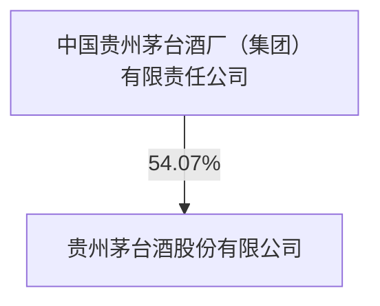
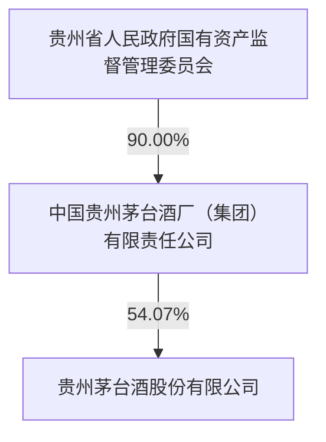

公司代码：600519

公司简称：贵州茅台

# 贵州茅台酒股份有限公司2024 年年度报告

## 重要提示

一、 本公司董事会、监事会及董事、监事、高级管理人员保证年度报告内容的真实性、准确性、完整性，不存在虚假记载、误导性陈述或重大遗漏，并承担个别和连带的法律责任。

二、 公司全体董事出席董事会会议。

三、 天健会计师事务所(特殊普通合伙)为本公司出具了标准无保留意见的审计报告。

四、 公司负责人张德芹、主管会计工作负责人蒋焰及会计机构负责人（会计主管人员）蔡聪应声明：保证年度报告中财务报告的真实、准确、完整。

## 五、 董事会决议通过的本报告期利润分配预案或公积金转增股本预案

公司拟以实施权益分派股权登记日登记的总股本扣除回购专用账户中的股份为基数，实施2024年年度利润分配，向全体股东每10股派发现金红利276.24元（含税）。截至2025年3月31日，公司总股本1,256,197,800股，回购专用证券账户中股份数1,082,700股，总股本扣除回购专用证券账户中的股份数为1,255,115,100股，以此计算合计派发现金红利34,671,299,522.40元（含税）。在实施权益分派的股权登记日前公司总股本扣除回购专用证券账户内的股份数如发生变动的，将维持分配总额不变，相应调整每股分红比例。以上利润分配预案需提交公司股东大会审议通过后实施。

## 六、 前瞻性陈述的风险声明

√适用 □不适用

本年度报告中所涉及的未来计划、发展战略等前瞻性陈述因存在不确定性，不构成本公司对投资者的实质承诺，敬请投资者注意投资风险。

## 七、 是否存在被控股股东及其他关联方非经营性占用资金情况

否

八、 是否存在违反规定决策程序对外提供担保的情况

否

九、 是否存在半数以上董事无法保证公司所披露年度报告的真实性、准确性和完整性

否

## 十、 重大风险提示

本公司已在本年度报告中“公司关于公司未来发展的讨论与分析”章节阐述公司可能面对的风险，敬请投资者予以关注。

## 十一、 其他

□适用 √不适用

## 目录

第一节 释义 ............  
第二节 公司简介和主要财务指标....  
第三节 管理层讨论与分析...  
第四节 公司治理 ..... .22  
第五节 环境与社会责任... .36  
第六节 重要事项 ...... .... 40  
第七节 股份变动及股东情况. 49  
第八节 优先股相关情况... .54  
第九节 债券相关情况... 55  
第十节 财务报告 ...... 55

<table><tr><td rowspan="3">备查文件目录</td><td>载有公司负责人、主管会计工作负责人及会计机构负责人(会计主管人员)签名并盖章的会计报表。</td></tr><tr><td>载有会计师事务所盖章、注册会计师签名并盖章的审计报告原件。</td></tr><tr><td>报告期内,本公司在《中国证券报》《上海证券报》上公开披露过的公司文件正本及公告的原稿。</td></tr></table>

## 第一节 释义

## 一、 释义

在本报告书中，除非文义另有所指，下列词语具有如下含义：

<table><tr><td colspan="3">常用词语释义</td></tr><tr><td>证监会</td><td>指</td><td>中国证券监督管理委员会</td></tr><tr><td>上交所</td><td>指</td><td>上海证券交易所</td></tr><tr><td>本公司、公司</td><td>指</td><td>贵州茅台酒股份有限公司</td></tr><tr><td>控股股东、集团公司</td><td>指</td><td>中国贵州茅台酒厂(集团)有限责任公司</td></tr><tr><td>报告期</td><td>指</td><td>2024年度</td></tr><tr><td>本报告</td><td>指</td><td>2024年年度报告</td></tr></table>

## 第二节 公司简介和主要财务指标

## 一、 公司信息

<table><tr><td>公司的中文名称</td><td>贵州茅台酒股份有限公司</td></tr><tr><td>公司的中文简称</td><td>贵州茅台</td></tr><tr><td>公司的外文名称</td><td>Kweichow Moutai Co., Ltd.</td></tr><tr><td>公司的法定代表人</td><td>张德芹</td></tr></table>

## 二、 联系人和联系方式

<table><tr><td></td><td>董事会秘书</td><td>证券事务代表</td></tr><tr><td>姓名</td><td>蒋焰</td><td>蔡聪应</td></tr><tr><td>联系地址</td><td>贵州省仁怀市茅台镇</td><td>贵州省仁怀市茅台镇</td></tr><tr><td>电话</td><td>0851-22386002</td><td>0851-22386002</td></tr><tr><td>传真</td><td>0851-22386193</td><td>0851-22386193</td></tr><tr><td>电子信箱</td><td>mtdm@moutaichina.com</td><td>mtdm@moutaichina.com</td></tr></table>

## 三、 基本情况简介

<table><tr><td>公司注册地址</td><td>贵州省仁怀市茅台镇</td></tr><tr><td>公司办公地址</td><td>贵州省仁怀市茅台镇</td></tr><tr><td>公司办公地址的邮政编码</td><td>564501</td></tr><tr><td>公司网址</td><td>http://www.moutaichina.com/</td></tr><tr><td>电子信箱</td><td>mtdm@moutaichina.com</td></tr></table>

## 四、 信息披露及备置地点

<table><tr><td>公司披露年度报告的媒体名称及网址</td><td>《中国证券报》《上海证券报》</td></tr><tr><td>公司披露年度报告的证券交易所网址</td><td>http://www.sse.com.cn/</td></tr><tr><td>公司年度报告备置地点</td><td>公司董事会办公室</td></tr></table>

## 五、 公司股票简况

<table><tr><td colspan="5">公司股票简况</td></tr><tr><td>股票种类</td><td>股票上市交易所</td><td>股票简称</td><td>股票代码</td><td>变更前股票简称</td></tr><tr><td>A股</td><td>上海证券交易所</td><td>贵州茅台</td><td>600519</td><td></td></tr></table>

## 六、 其他相关资料

<table><tr><td rowspan="3">公司聘请的会计师事务所(境内)</td><td>名称</td><td>天健会计师事务所(特殊普通合伙)</td></tr><tr><td>办公地址</td><td>浙江省杭州市西湖区灵隐街道西溪路128号</td></tr><tr><td>签字会计师姓名</td><td>李青龙 梁正勇 曾志</td></tr></table>

## 七、 近三年主要会计数据和财务指标

## (一) 主要会计数据

单位：元 币种：人民币

<table><tr><td>主要会计数据</td><td>2024年</td><td>2023年</td><td>本期比上年同期增减(%)</td><td>2022年</td></tr><tr><td>营业收入</td><td>170,899,152,276.34</td><td>147,693,604,994.14</td><td>15.71</td><td>124,099,843,771.99</td></tr><tr><td>归属于上市公司股东的净利润</td><td>86,228,146,421.62</td><td>74,734,071,550.75</td><td>15.38</td><td>62,717,467,870.12</td></tr><tr><td>归属于上市公司股东的扣除非经常性损益的净利润</td><td>86,240,905,977.42</td><td>74,752,564,425.52</td><td>15.37</td><td>62,792,896,829.57</td></tr><tr><td>经营活动产生的现金流量净额</td><td>92,463,692,168.43</td><td>66,593,247,721.09</td><td>38.85</td><td>36,698,595,830.03</td></tr><tr><td></td><td>2024年末</td><td>2023年末</td><td>本期末比上年同期末增减(%)</td><td>2022年末</td></tr><tr><td>归属于上市公司股东的净资产</td><td>233,105,984,399.47</td><td>215,668,571,607.43</td><td>8.09</td><td>197,480,041,239.46</td></tr><tr><td>总资产</td><td>298,944,579,918.70</td><td>272,699,660,092.25</td><td>9.62</td><td>254,500,826,096.02</td></tr><tr><td>股本</td><td>1,256,197,800.00</td><td>1,256,197,800.00</td><td></td><td>1,256,197,800.00</td></tr></table>

## (二) 主要财务指标

<table><tr><td>主要财务指标</td><td>2024年</td><td>2023年</td><td>本期比上年同期增减(%)</td><td>2022年</td></tr><tr><td>基本每股收益(元/股)</td><td>68.64</td><td>59.49</td><td>15.38</td><td>49.93</td></tr><tr><td>稀释每股收益(元/股)</td><td>68.64</td><td>59.49</td><td>15.38</td><td>49.93</td></tr><tr><td>扣除非经常性损益后的基本每股收益(元/股)</td><td>68.65</td><td>59.51</td><td>15.37</td><td>49.99</td></tr><tr><td>加权平均净资产收益率(%)</td><td>36.02</td><td>34.19</td><td>增加1.83个百分点</td><td>30.26</td></tr><tr><td>扣除非经常性损益后的加权平均净资产收益率(%)</td><td>36.03</td><td>34.20</td><td>增加1.83个百分点</td><td>30.29</td></tr></table>

报告期末公司前三年主要会计数据和财务指标的说明

□适用 √不适用

## 八、 境内外会计准则下会计数据差异

## (一) 同时按照国际会计准则与按中国会计准则披露的财务报告中净利润和归属于上市公司股东的净资产差异情况

□适用 √不适用

## (二) 同时按照境外会计准则与按中国会计准则披露的财务报告中净利润和归属于上市公司股东的净资产差异情况

□适用 √不适用

## (三)境内外会计准则差异的说明：

□适用 √不适用

## 九、 2024 年分季度主要财务数据

单位：元 币种：人民币

<table><tr><td></td><td>第一季度(1-3月份)</td><td>第二季度(4-6月份)</td><td>第三季度(7-9月份)</td><td>第四季度(10-12月份)</td></tr><tr><td>营业收入</td><td>45,775,517,043.29</td><td>36,155,460,624.46</td><td>38,845,154,206.94</td><td>50,123,020,401.65</td></tr><tr><td>归属于上市公司股东的净利润</td><td>24,065,262,374.15</td><td>17,630,348,609.22</td><td>19,131,941,135.14</td><td>25,400,594,303.11</td></tr><tr><td>归属于上市公司股东的扣除非经常性损益后的净利润</td><td>24,051,471,185.69</td><td>17,618,626,634.30</td><td>19,108,543,634.77</td><td>25,462,264,522.66</td></tr><tr><td>经营活动产生的现金流量净额</td><td>9,187,422,415.09</td><td>27,434,411,397.54</td><td>7,799,552,404.82</td><td>48,042,305,950.98</td></tr></table>

季度数据与已披露定期报告数据差异说明

□适用 √不适用

## 十、 非经常性损益项目和金额

√适用 □不适用

单位：元 币种：人民币

<table><tr><td>非经常性损益项目</td><td>2024年金额</td><td>附注(如适用)</td><td>2023年金额</td><td>2022年金额</td></tr><tr><td>非流动性资产处置损益,包括已计提资产减值准备的冲销部分</td><td>-6,898,481.82</td><td></td><td>1,152,516.17</td><td>-20,567,757.19</td></tr><tr><td>计入当期损益的政府补助,但与公司正常经营业务密切相关、符合国家政策规定、按照确定的标准享有、对公司损益产生持续影响的政府补助除外</td><td>4,539,419.20</td><td></td><td>17,137,523.89</td><td>14,973,304.55</td></tr><tr><td>除同公司正常经营业务相关的有效套期保值业务外,非金融企业持有金融资产和金融负债产生的公允价值变动损益以及处置金融资产和金融负债产生的损益</td><td>26,539,092.99</td><td></td><td>2,439,902.57</td><td></td></tr><tr><td>除上述各项之外的其他营业外收入和支出</td><td>-42,713,924.90</td><td></td><td>-47,733,771.71</td><td>-157,251,041.33</td></tr><tr><td>其他符合非经常性损益定义的损益项目</td><td>2,395,600.72</td><td></td><td>4,710,466.67</td><td>63,840,000.00</td></tr><tr><td>减:所得税影响额</td><td>-4,034,573.45</td><td></td><td>-5,573,340.60</td><td>-24,751,373.49</td></tr><tr><td>少数股东权益影响额(税后)</td><td>655,835.44</td><td></td><td>1,772,852.96</td><td>1,174,838.97</td></tr><tr><td>合计</td><td>-12,759,555.80</td><td></td><td>-18,492,874.77</td><td>-75,428,959.45</td></tr></table>

对公司将《公开发行证券的公司信息披露解释性公告第 1 号——非经常性损益》未列举的项目认定为非经常性损益项目且金额重大的，以及将《公开发行证券的公司信息披露解释性公告第 1 号非经常性损益》中列举的非经常性损益项目界定为经常性损益的项目，应说明原因。

□适用 √不适用

## 十一、 采用公允价值计量的项目

√适用 □不适用

单位：元 币种：人民币

<table><tr><td>项目名称</td><td>期初余额</td><td>期末余额</td><td>当期变动</td><td>对当期利润的影响金额</td></tr><tr><td>交易性金融资产</td><td>400,712,059.93</td><td>248,513,280.00</td><td>-152,198,779.93</td><td>43,571,971.73</td></tr><tr><td>其他非流动金融资产</td><td>4,002,439,902.57</td><td>4,028,978,995.56</td><td>26,539,092.99</td><td>26,539,092.99</td></tr><tr><td>合计</td><td>4,403,151,962.50</td><td>4,277,492,275.56</td><td>-125,659,686.94</td><td>70,111,064.72</td></tr></table>

## 十二、 其他

□适用 √不适用

## 第三节 管理层讨论与分析

## 一、经营情况讨论与分析

2024年，公司坚持以习近平新时代中国特色社会主义思想为指导，深入贯彻党的二十大和二十届二中、三中全会精神，习近平总书记视察贵州重要讲话精神，全面落实省委、省政府决策部署，锚定年度目标，统筹生产经营和改革发展各项任务，凝心聚力、全力拼搏、攻坚克难，圆满完成各项目标任务，推动公司高质量发展、现代化建设再上新台阶。

## 二、报告期内公司所处行业情况

详见本报告第14 页“行业基本情况”及第20页“行业格局和趋势”。

## 三、报告期内公司从事的业务情况

公司主要业务是茅台酒及系列酒的生产与销售。主导产品“贵州茅台酒”是我国大曲酱香型白酒的鼻祖和典型代表，集国家地理标志产品、有机食品和国家非物质文化遗产于一身，公司营销网络覆盖国内市场及五大洲 64个国家和地区。

公司经营模式为：采购原料—生产产品—销售产品。原料采购模式为:茅台酒用高粱采取“公司+地方政府+供应商+合作社或农户”的模式，小麦采取“公司+供应商+合作社或农场”的模式，其他原辅料及包装材料采购主要根据公司生产和销售计划，通过集中采购方式向市场采购；产品生产工艺流程为：制曲—制酒—贮存—勾兑—包装；销售模式为：公司产品通过直销和批发代理渠道进行销售。直销渠道指自营和“i茅台”等数字营销平台渠道，批发代理渠道指社会经销商、商超、电商等渠道。

## 四、报告期内核心竞争力分析

√适用 □不适用

公司坚持“顺天敬人、明理厚德”的企业核心价值观，拥有“品质、品牌、工艺、环境、文化”组成的“五大核心竞争力”。报告期内公司核心竞争力未发生重大变化。

## 五、报告期内主要经营情况

一是经营业绩稳健增长。年度内公司实现营业总收入 1,741.44亿元，同比增长 15.66%；归属于上市公司股东的净利润862.28亿元，同比增长15.38%，主要经济指标持续保持两位数增长，高质量完成年度战略目标。贵州茅台酒在成为千亿级单品后，前三季度营收首次突破千亿，出口营收首次突破50亿元大关，继续彰显世界级大单品的独特魅力，系列酒营收站稳 200亿元台阶。

二是治理效能不断提升。有效落实董事会“六大职权”，全年董事会召集召开 2 次股东大会，审议通过16项议案，召开13次董事会会议，审议通过 39项议案。持续推进全面风险管理体系建设，实现风险防控效能全面提升。深化创奖成果运用，构建完善预算、绩效管理体系并顺利运行；深度践行 ESG 理念，ESG 评级位列当前中国白酒行业最高评级，荣获“中国 ESG 榜样企业”；获得EFQM全球奖（七钻）暨“鼓舞人心的文化”杰出成就奖。

三是文化赋能持续深化。深入挖掘茅台文化内涵，优化提升茅台文化体系，发布《茅台玖章》，以“酿造高品质生活”的使命、“让世界爱上茅台、让茅台香飘世界”的愿景、“顺天敬人、明理厚德”的企业核心价值观、“爱我茅台，为国争光”的企业精神、“质量是生命之魂”的质量信仰，共同构筑茅台人团结奋进的精神纽带，汇聚推动茅台持续稳定健康发展的内在动力。

四是品牌影响稳居榜首。贵州茅台以 872.98 亿美元的品牌价值，连续七年稳居凯度“BrandZ最具价值中国品牌100 强”酒类品牌第一，首次跃升至中国品牌 100强第二位；以 501亿美元的品牌价值，第9次蝉联英国“Brand Finance全球烈酒品牌价值榜”榜首，品牌价值依然领跑行业。

五是市值管理再创新绩。首次制定《市值管理办法》，提升管理规范化水平；发布 2024－2026三年分红规划，建立长效回报机制，有效稳定投资者预期；首次启动股份回购计划，公司以自有资金通过集中竞价交易方式回购股份，回购股份用于注销并减少公司注册资本，回购金额不低于30亿元（含）且不超过 60亿元（含），持续践行真金白银回报股东。

## (一) 主营业务分析

## 1、 利润表及现金流量表相关科目变动分析表

单位：元 币种：人民币

<table><tr><td>科目</td><td>本期数</td><td>上年同期数</td><td>变动比例(%)</td></tr><tr><td>营业收入</td><td>170,899,152,276.34</td><td>147,693,604,994.14</td><td>15.71</td></tr><tr><td>营业成本</td><td>13,789,482,367.98</td><td>11,867,273,851.78</td><td>16.20</td></tr><tr><td>销售费用</td><td>5,639,300,059.49</td><td>4,648,613,585.82</td><td>21.31</td></tr><tr><td>管理费用</td><td>9,315,650,060.38</td><td>9,729,389,252.31</td><td>-4.25</td></tr><tr><td>财务费用</td><td>-1,470,219,863.34</td><td>-1,789,503,701.48</td><td>不适用</td></tr><tr><td>研发费用</td><td>218,375,472.87</td><td>157,371,873.01</td><td>38.76</td></tr><tr><td>经营活动产生的现金流量净额</td><td>92,463,692,168.43</td><td>66,593,247,721.09</td><td>38.85</td></tr><tr><td>投资活动产生的现金流量净额</td><td>-1,785,202,630.71</td><td>-9,724,414,015.16</td><td>不适用</td></tr><tr><td>筹资活动产生的现金流量净额</td><td>-71,067,506,484.81</td><td>-58,889,101,991.94</td><td>不适用</td></tr></table>

营业收入变动原因说明：主要是本期销量增加及茅台酒主要产品销售价格调整。  
营业成本变动原因说明：主要是本期销量增加、原材料及人工成本上涨。  
销售费用变动原因说明：主要是本期市场推广及服务费增加。

财务费用变动原因说明：主要是本期商业银行存款利率下降。

研发费用变动原因说明：主要是本期研发项目增加。

经营活动产生的现金流量净额变动原因说明：主要是本期公司销售商品收到的现金增加及控股子公司贵州茅台集团财务有限公司归集集团公司其他成员单位资金较上期增加。

投资活动产生的现金流量净额变动原因说明：主要是上期公司支付产业发展基金投资及本期公司控股子公司贵州茅台集团财务有限公司同业存单等投资业务减少。

筹资活动产生的现金流量净额变动原因说明：主要是本期分配现金股利增加。

本期公司业务类型、利润构成或利润来源发生重大变动的详细说明

□适用 √不适用

## 2、 收入和成本分析

√适用 □不适用

## (1). 主营业务分行业、分产品、分地区、分销售模式情况

单位：元 币种：人民币

<table><tr><td colspan="7">主营业务分行业情况</td></tr><tr><td>分行业</td><td>营业收入</td><td>营业成本</td><td>毛利率(%)</td><td>营业收入比上年增减(%)</td><td>营业成本比上年增减(%)</td><td>毛利率比上年增减</td></tr><tr><td>酒类</td><td>170,611,838,052.02</td><td>13,629,995,812.89</td><td>92.01</td><td>15.89</td><td>17.30</td><td>减少0.1个百分点</td></tr><tr><td colspan="7">主营业务分产品情况</td></tr><tr><td>分产品</td><td>营业收入</td><td>营业成本</td><td>毛利率(%)</td><td>营业收入比上年增减(%)</td><td>营业成本比上年增减(%)</td><td>毛利率比上年增减</td></tr><tr><td>茅台酒</td><td>145,928,075,955.31</td><td>8,662,079,388.78</td><td>94.06</td><td>15.28</td><td>16.34</td><td>减少0.06个百分点</td></tr><tr><td>其他系列酒</td><td>24,683,762,096.71</td><td>4,967,916,424.11</td><td>79.87</td><td>19.65</td><td>19.00</td><td>增加0.11个百分点</td></tr><tr><td colspan="7">主营业务分地区情况</td></tr><tr><td>分地区</td><td>营业收入</td><td>营业成本</td><td>毛利率(%)</td><td>营业收入比上年增减(%)</td><td>营业成本比上年增减(%)</td><td>毛利率比上年增减</td></tr><tr><td>国内</td><td>165,423,308,808.24</td><td>13,226,875,459.60</td><td>92.00</td><td>15.79</td><td>17.26</td><td>减少0.1个百分点</td></tr><tr><td>国外</td><td>5,188,529,243.78</td><td>403,120,353.29</td><td>92.23</td><td>19.27</td><td>18.57</td><td>增加0.05个百分点</td></tr><tr><td colspan="7">主营业务分销售模式情况</td></tr><tr><td>销售模式</td><td>营业收入</td><td>营业成本</td><td>毛利率(%)</td><td>营业收入比上年增减(%)</td><td>营业成本比上年增减(%)</td><td>毛利率比上年增减</td></tr><tr><td>批发代理</td><td>95,768,511,021.23</td><td>10,136,042,973.30</td><td>89.42</td><td>19.73</td><td>18.28</td><td>增加0.13个百分点</td></tr><tr><td>直销</td><td>74,843,327,030.79</td><td>3,493,952,839.59</td><td>95.33</td><td>11.32</td><td>14.52</td><td>减少0.13个百分点</td></tr></table>

## (2). 产销量情况分析表

√适用 □不适用

<table><tr><td>主要产品</td><td>单位</td><td>生产量</td><td>销售量</td><td>库存量</td><td>生产量比上年增减(%)</td><td>销售量比上年增减(%)</td><td>库存量比上年增减(%)</td></tr><tr><td>酒类</td><td>吨</td><td>104,384.50</td><td>83,332.76</td><td>310,008.02</td><td>4.24</td><td>13.73</td><td>5.52</td></tr></table>

## (3). 重大采购合同、重大销售合同的履行情况

□适用 √不适用

## (4). 成本分析表

单位：元

<table><tr><td colspan="8">分行业情况</td></tr><tr><td>分行业</td><td>成本构成项目</td><td>本期金额</td><td>本期占总成本比例(%)</td><td>上年同期金额</td><td>上年同期占总成本比例(%)</td><td>本期金额较上年同期变动比例(%)</td><td>情况说明</td></tr><tr><td>酒类</td><td></td><td>13,629,995,812.89</td><td>100.00</td><td>11,620,203,653.32</td><td>100.00</td><td>17.30</td><td></td></tr><tr><td colspan="8">分产品情况</td></tr><tr><td>分产品</td><td>成本构成项目</td><td>本期金额</td><td>本期占总成本比例(%)</td><td>上年同期金额</td><td>上年同期占总成本比例(%)</td><td>本期金额较上年同期变动比例(%)</td><td>情况说明</td></tr><tr><td rowspan="6">酒类</td><td>直接材料</td><td>6,895,320,421.92</td><td>50.59</td><td>5,984,160,283.88</td><td>51.50</td><td>15.23</td><td></td></tr><tr><td>直接人工</td><td>5,224,448,485.08</td><td>38.32</td><td>4,372,013,596.08</td><td>37.63</td><td>19.50</td><td></td></tr><tr><td>制造费用</td><td>776,373,890.79</td><td>5.70</td><td>640,613,571.24</td><td>5.51</td><td>21.19</td><td></td></tr><tr><td>燃料动力</td><td>422,328,634.52</td><td>3.10</td><td>351,386,305.23</td><td>3.02</td><td>20.19</td><td></td></tr><tr><td>运输费</td><td>311,524,380.58</td><td>2.29</td><td>272,029,896.89</td><td>2.34</td><td>14.52</td><td></td></tr><tr><td>合计</td><td>13,629,995,812.89</td><td>100.00</td><td>11,620,203,653.32</td><td>100.00</td><td>17.30</td><td></td></tr></table>

## (5). 报告期主要子公司股权变动导致合并范围变化

□适用 √不适用

## (6). 公司报告期内业务、产品或服务发生重大变化或调整有关情况

□适用 √不适用

## (7). 主要销售客户及主要供应商情况

## A.公司主要销售客户情况

√适用 □不适用

前五名客户销售额 1,964,793.93 万元，占年度销售总额 11.52%；其中前五名客户销售额中关联方销售额656,041.77万元，占年度销售总额 3.85%。

报告期内向单个客户的销售比例超过总额的50%、前 5名客户中存在新增客户的或严重依赖于少数客户的情形

□适用 √不适用

## B.公司主要供应商情况

√适用 □不适用

前五名供应商采购额 304,247.59万元，占年度采购总额 35.43%；其中前五名供应商采购额中关联方采购额130,712.33 万元，占年度采购总额15.22%。

报告期内向单个供应商的采购比例超过总额的 50%、前 5名供应商中存在新增供应商的或严重依赖于少数供应商的情形

□适用 √不适用

## 3、 费用

√适用 □不适用

销售费用本期 5,639,300,059.49 元，上期 4,648,613,585.82 元，同比增加主要是本期市场推广及服务费增加。

财务费用本期-1,470,219,863.34 元，上期-1,789,503,701.48 元，同比变动主要是本期商业银行存款利率下降。

## 4、 研发投入

## (1).研发投入情况表

√适用 □不适用

单位：元

<table><tr><td>本期费用化研发投入</td><td>593,779,816.96</td></tr><tr><td>本期资本化研发投入</td><td>101,596,918.85</td></tr><tr><td>研发投入合计</td><td>695,376,735.81</td></tr><tr><td>研发投入总额占营业收入比例(%)</td><td>0.41</td></tr><tr><td>研发投入资本化的比重(%)</td><td>14.61</td></tr></table>

注：本期费用化研发支出包括列入生产成本的研发支出及科研人员工资等支出。

## (2).研发人员情况表

√适用 □不适用

<table><tr><td>公司研发人员的数量</td><td>801</td></tr><tr><td>研发人员数量占公司总人数的比例(%)</td><td>2.31</td></tr><tr><td colspan="2">研发人员学历结构</td></tr><tr><td>学历结构类别</td><td>学历结构人数</td></tr><tr><td>博士研究生</td><td>84</td></tr><tr><td>硕士研究生</td><td>174</td></tr><tr><td>本科</td><td>467</td></tr><tr><td>专科</td><td>63</td></tr><tr><td>高中及以下</td><td>13</td></tr><tr><td colspan="2">研发人员年龄结构</td></tr><tr><td>年龄结构类别</td><td>年龄结构人数</td></tr><tr><td>30岁以下(不含30岁)</td><td>150</td></tr><tr><td>30-40岁(含30岁,不含40岁)</td><td>413</td></tr><tr><td>40-50岁(含40岁,不含50岁)</td><td>183</td></tr><tr><td>50-60岁(含50岁,不含60岁)</td><td>43</td></tr><tr><td>60岁及以上</td><td>12</td></tr></table>

## (3).情况说明

□适用 √不适用

## (4).研发人员构成发生重大变化的原因及对公司未来发展的影响

□适用 √不适用

## 5、 现金流

√适用 □不适用

单位：元 币种：人民币

<table><tr><td>项目</td><td>本期发生额</td><td>上期发生额</td><td>本期比上年同期增减(%)</td></tr><tr><td>客户存款和同业存放款项净增加额</td><td>11,060,205,782.10</td><td>-810,223,002.76</td><td>不适用</td></tr><tr><td>收到的税费返还</td><td></td><td>1,500,047.04</td><td>-100.00</td></tr><tr><td>收到其他与经营活动有关的现金</td><td>3,258,097,705.14</td><td>2,346,196,470.63</td><td>38.87</td></tr><tr><td>客户贷款及垫款净增加额</td><td>262,376,929.65</td><td>-2,051,930,316.19</td><td>不适用</td></tr><tr><td>存放中央银行和同业款项净增加额</td><td>-4,585,245,646.29</td><td>1,570,003,429.01</td><td>不适用</td></tr><tr><td>拆出资金净增加额</td><td>-400,000,000.00</td><td>2,500,000,000.00</td><td>不适用</td></tr><tr><td>支付利息、手续费及佣金的现金</td><td>97,061,751.28</td><td>142,896,151.21</td><td>-32.08</td></tr><tr><td>取得投资收益收到的现金</td><td>92,382,151.66</td><td>140,715,000.00</td><td>-34.35</td></tr><tr><td>处置固定资产、无形资产和其他长期资产收回的现金净额</td><td>715,708.44</td><td>24,948,352.95</td><td>-97.13</td></tr><tr><td>购建固定资产、无形资产和其他长期资产支付的现金</td><td>4,678,712,053.56</td><td>2,619,755,888.79</td><td>78.59</td></tr><tr><td>投资支付的现金</td><td>5,745,136,000.00</td><td>14,817,852,800.00</td><td>-61.23</td></tr><tr><td>支付其他与投资活动有关的现金</td><td>9,984,973.67</td><td>7,021,867.10</td><td>42.20</td></tr><tr><td>汇率变动对现金及现金等价物的影响</td><td>-1,082,747.55</td><td>1,718,255.65</td><td>不适用</td></tr></table>

（1）客户存款和同业存放款项净增加额变动主要是公司控股子公司贵州茅台集团财务有限公司归集集团公司其他成员单位资金较上期增加。  
（2）收到的税费返还减少主要是公司控股子公司北京友谊使者商贸有限公司上期收到税费返还。  
（3）收到其他与经营活动有关的现金增加主要是公司收到到期商业银行存款利息增加。  
（4）客户贷款及垫款净增加额增加主要是公司控股子公司贵州茅台集团财务有限公司上期收回发放成员单位贷款及本期买方信贷业务增加。  
（5）存放中央银行和同业款项净增加额减少主要是公司控股子公司贵州茅台集团财务有限公司存入的不可提前支取的同业定期存款净增加额较上期减少。  
（6）拆出资金净增加额减少主要是公司控股子公司贵州茅台集团财务有限公司收回同业拆出资金。  
（7）支付利息、手续费及佣金的现金减少主要是公司控股子公司贵州茅台集团财务有限公司支付利息较上期减少。  
（8）取得投资收益收到的现金减少主要是公司上期收到到期大额存单利息。  
（9）处置固定资产、无形资产和其他长期资产收回的现金净额减少主要是本期处置固定资产较上期减少。  
（10）购建固定资产、无形资产和其他长期资产支付的现金增加主要是支付基本建设工程款较上期增加。  
（11）投资支付的现金减少主要是上期公司支付产业发展基金投资及本期公司控股子公司贵州茅台集团财务有限公司同业存单等投资业务减少。  
（12）支付其他与投资活动有关的现金增加是退付的基本建设履约保证金较上期增加。  
（13）汇率变动对现金及现金等价物的影响增加是公司全资子公司贵州茅台酒巴黎贸易有限公司境外经营财务报表折算为记账本位币报表产生的外币折算差额。

## (二) 非主营业务导致利润重大变化的说明

□适用 √不适用

## (三) 资产、负债情况分析

√适用 □不适用

## 1、 资产及负债状况

单位：元

<table><tr><td>项目名称</td><td>本期期末数</td><td>本期期末数占总资产的比例(%)</td><td>上期期末数</td><td>上期期末数占总资产的比例(%)</td><td>本期期末金额较上期期末变动比例(%)</td><td>情况说明</td></tr><tr><td>货币资金</td><td>59,295,822,956.89</td><td>19.84</td><td>69,070,136,376.12</td><td>25.33</td><td>-14.15</td><td></td></tr><tr><td>拆出资金</td><td>127,187,293,298.17</td><td>42.55</td><td>105,553,836,462.58</td><td>38.71</td><td>20.50</td><td></td></tr><tr><td>交易性金融资产</td><td>248,513,280.00</td><td>0.08</td><td>400,712,059.93</td><td>0.15</td><td>-37.98</td><td>主要是公司控股子公司贵州茅台集团财务有限公司上期债务工具投资到期收回</td></tr><tr><td>应收票据</td><td>1,984,407,967.50</td><td>0.66</td><td>13,933,440.00</td><td>0.01</td><td>14,142.05</td><td>主要是公司全资子公司贵州茅台酱香酒营销有限公司银行承兑汇票办理销售业务增加</td></tr><tr><td>应收账款</td><td>18,974,192.75</td><td>0.01</td><td>60,373,410.41</td><td>0.02</td><td>-68.57</td><td>主要是公司控股子公司贵州茅台酒销售有限公司线上平台应收货款减少</td></tr><tr><td>买入返售金融资产</td><td>7,220,310,691.10</td><td>2.42</td><td>3,504,849,885.05</td><td>1.29</td><td>106.01</td><td>主要是公司控股子公司贵州茅台集团财务有限公司国债逆回购增加</td></tr><tr><td>存货</td><td>54,343,285,157.47</td><td>18.18</td><td>46,435,185,061.53</td><td>17.03</td><td>17.03</td><td></td></tr><tr><td>其他流动资产</td><td>160,176,582.69</td><td>0.05</td><td>71,403,906.57</td><td>0.03</td><td>124.32</td><td>主要是留抵增值税进项税额增加</td></tr><tr><td>一年内到期的非流动资产</td><td>1,210,959,803.42</td><td>0.41</td><td></td><td></td><td>不适用</td><td>主要是公司控股子公司贵州茅台集团财务有限公司部分债权投资将于1年内到期</td></tr><tr><td>债权投资</td><td>1,515,174,439.92</td><td>0.51</td><td>5,323,002,071.02</td><td>1.95</td><td>-71.54</td><td>主要是公司控股子公司贵州茅台集团财务有限公司购买债券投资到期收回</td></tr><tr><td>固定资产</td><td>21,871,446,747.14</td><td>7.32</td><td>19,909,280,655.97</td><td>7.30</td><td>9.86</td><td></td></tr><tr><td>投资性房地产</td><td>7,625,167.83</td><td>0.003</td><td>4,138,545.33</td><td>0.002</td><td>84.25</td><td>主要是公司对外出租房屋增加</td></tr><tr><td>使用权资产</td><td>410,594,173.53</td><td>0.14</td><td>314,205,484.56</td><td>0.12</td><td>30.68</td><td>主要是公司控股子公司贵州茅台酒销售有限公司新增租赁</td></tr><tr><td>开发支出</td><td>98,522,878.42</td><td>0.03</td><td>218,015,555.49</td><td>0.08</td><td>-54.81</td><td>主要是部分资本化项目结题转无形资产</td></tr><tr><td>其他非流动资产</td><td>232,395,817.46</td><td>0.08</td><td>109,563,497.23</td><td>0.04</td><td>112.11</td><td>主要是公司支付工程安全文明措施费及信息化建设项目款</td></tr><tr><td>合同负债</td><td>9,592,453,014.66</td><td>3.21</td><td>14,125,755,802.29</td><td>5.18</td><td>-32.09</td><td>主要是经销商预付货款减少</td></tr><tr><td>吸收存款及同业存放</td><td>23,102,858,820.97</td><td>7.73</td><td>12,034,492,909.95</td><td>4.41</td><td>91.97</td><td>主要是公司控股子公司贵州茅台集团财务有限公司吸收集团成员单位存款较年初增加</td></tr><tr><td>一年内到期的非流动负债</td><td>111,951,112.20</td><td>0.04</td><td>57,054,879.48</td><td>0.02</td><td>96.22</td><td>主要是1年内到期的租赁负债增加</td></tr><tr><td>其他流动负债</td><td>1,222,693,799.51</td><td>0.41</td><td>1,822,498,012.30</td><td>0.67</td><td>-32.91</td><td>主要是经销商预付货款减少,待转销项税相应减少</td></tr><tr><td>递延所得税负债</td><td>103,367,763.38</td><td>0.03</td><td>78,943,062.19</td><td>0.03</td><td>30.94</td><td>主要是公司控股子公司贵州茅台酒销售有限公司新增库房租赁,递延所得税相应增加</td></tr><tr><td>其他综合收益</td><td>-9,916,224.69</td><td></td><td>-6,061,727.51</td><td></td><td>不适用</td><td>公司全资子公司贵州茅台酒巴黎贸易有限公司境外经营财务报表折算为记账本位币报表产生的差额</td></tr></table>

## 2、 境外资产情况

√适用 □不适用

## (1) 资产规模

其中：境外资产93,664,037.53（单位：元 币种：人民币），占总资产的比例为 0.03%。

## (2) 境外资产占比较高的相关说明

□适用 √不适用

## 3、 截至报告期末主要资产受限情况

√适用 □不适用

详见第十节财务报告七、合并财务报表项目注释24、所有权或使用权受限资产

## (四) 行业经营性信息分析

√适用 □不适用

## 酒制造行业经营性信息分析

## 1、 行业基本情况

√适用 □不适用

根据国家统计局、中国酒业协会数据，2024年全国规模以上白酒企业累计白酒产量 414.5万千升；实现销售收入7,963.84亿元；实现利润总额2,508.65亿元。

## 2、 产能状况

## 现有产能

√适用 □不适用

<table><tr><td>主要工厂名称</td><td>设计产能</td><td>实际产能</td></tr><tr><td>茅台酒制酒车间</td><td>44,595.00</td><td>56,271.99</td></tr><tr><td>系列酒制酒车间</td><td>52,460.00</td><td>48,112.51</td></tr></table>

说明：（1）2024 年茅台酒基酒设计产能为 44,595.00 吨，同比新增基酒产能 1,800.00 吨，新增产能于 2024 年 10 月投产，由于茅台酒的生产工艺特点，将在 2025 年释放；2024 年系列酒基酒设计产能为 52,460.00 吨，同比新增基酒产能 8,000.00吨，新增产能于 2024年 11月投产，由于系列酒的生产工艺特点，将在 2025年释放。（2）按照公司惯例,本报告中设计产能、实际产能的计量单位为“吨”。

## 在建产能

√适用 □不适用

单位：万元 币种：人民币

<table><tr><td>在建产能名称</td><td>计划投资金额</td><td>报告期内投资金额</td><td>累积投资金额</td></tr><tr><td>3万吨酱香系列酒技改工程及其配套设施项目</td><td>1,018,000.00</td><td>121,954.68</td><td>672,070.68</td></tr><tr><td>“十四五”酱香酒习水同民坝一期建设项目</td><td>411,000.00</td><td>83,325.28</td><td>171,485.28</td></tr><tr><td>茅台酒“十四五”技改建设项目</td><td>1,551,600.00</td><td>56,143.54</td><td>176,431.54</td></tr></table>

产能计算标准

√适用 □不适用

上述“现有产能”表格中，设计产能按生产工艺要求，结合厂房规格、窖池数量计算，实际产能按报告期实际基酒产量计算。

## 3、 产品期末库存量

√适用 □不适用

单位：吨

<table><tr><td>成品酒</td><td>半成品酒(含基础酒)</td></tr><tr><td>17,760.00</td><td>292,248.02</td></tr></table>

注：成品酒为公司已包装的库存商品（含酱香系列酒）。

存货减值风险提示

□适用 √不适用

## 4、 产品情况

√适用 □不适用

单位：万元 币种：人民币

<table><tr><td>产品档次</td><td>产量(吨)</td><td>同比(%)</td><td>销量(吨)</td><td>同比(%)</td><td>产销率(%)</td><td>销售收入</td><td>同比(%)</td><td>主要代表品牌</td></tr><tr><td>茅台酒</td><td>56,271.99</td><td>-1.63</td><td>46,412.95</td><td>10.22</td><td></td><td>14,592,807.60</td><td>15.28</td><td>贵州茅台酒</td></tr><tr><td>其他系列酒</td><td>48,112.51</td><td>12.05</td><td>36,919.81</td><td>18.47</td><td></td><td>2,468,376.21</td><td>19.65</td><td>茅台王子酒、茅台1935酒、汉酱酒、赖茅酒</td></tr></table>

注：（1）为保证公司可持续发展，每年需留存一定量的基酒，按生产工艺，茅台酒从生产到出厂至少需要五年。（2）茅台酒是由不同年份、不同轮次、不同浓度的基酒相互勾兑而成，是技术和艺术的完美结合，因此某一年份的基酒可能在未来数年都会作为产品出现。（3）公司坚持质量是生命之魂，坚持“崇本守道，坚守工艺，贮足陈酿，不卖新酒”，茅台酒的生产属于自然固态发酵，传统工艺酿造，成品率具有一定波动性。（4）基于上述原因，茅台酒基酒产销率不能精准计算。系列酒的产品形成过程近似于茅台酒。

产品档次划分标准

√适用 □不适用

按产品品质划分。

产品结构变化情况及经营策略

□适用 √不适用

## 5、 原料采购情况

## (1).采购模式

√适用 □不适用

茅台酒用高粱采取“公司+地方政府+供应商+合作社或农户”的模式，小麦采取“公司+供应商+合作社或农场”的模式，其他原辅料及包装材料采购主要根据公司生产和销售计划，通过集中采购方式向市场采购。

## (2).采购金额

√适用 □不适用

单位：万元 币种：人民币

<table><tr><td>原料类别</td><td>当期采购金额</td><td>上期采购金额</td><td>占当期总采购额的比重(%)</td></tr><tr><td>酿酒原材料</td><td>384,290.51</td><td>352,140.58</td><td>44.75</td></tr><tr><td>包装材料</td><td>419,421.77</td><td>396,702.84</td><td>48.84</td></tr><tr><td>能源</td><td>42,323.56</td><td>35,724.12</td><td>4.92</td></tr><tr><td>车间辅助材料</td><td>12,806.32</td><td>13,122.59</td><td>1.49</td></tr></table>

## 6、 销售情况

## (1).销售模式

√适用 □不适用

公司产品通过直销和批发代理渠道进行销售。直销渠道指自营和“i茅台”等数字营销平台渠道，批发代理渠道指社会经销商、商超、电商等渠道。

## (2).销售渠道

√适用 □不适用

单位：万元 币种：人民币

<table><tr><td>渠道类型</td><td>本期销售收入</td><td>上期销售收入</td><td>本期销售量(吨)</td><td>上期销售量(吨)</td></tr><tr><td>直销</td><td>7,484,332.71</td><td>6,723,287.69</td><td>18,221.93</td><td>15,634.95</td></tr><tr><td>批发代理</td><td>9,576,851.10</td><td>7,998,611.94</td><td>65,110.83</td><td>57,639.09</td></tr></table>

## (3).区域情况

√适用 □不适用

单位：万元 币种：人民币

<table><tr><td>区域名称</td><td>本期销售收入</td><td>上期销售收入</td><td>本期占比(%)</td><td>本期销售量(吨)</td><td>上期销售量(吨)</td><td>本期占比(%)</td></tr><tr><td>国内</td><td>16,542,330.88</td><td>14,286,888.58</td><td>96.96</td><td>81,219.89</td><td>71,295.43</td><td>97.46</td></tr><tr><td>国外</td><td>518,852.93</td><td>435,011.05</td><td>3.04</td><td>2,112.87</td><td>1,978.61</td><td>2.54</td></tr></table>

区域划分标准

□适用 √不适用

## (4).经销商情况

√适用 □不适用

单位：个

<table><tr><td>区域名称</td><td>报告期末经销商数量</td><td>报告期内增加数量</td><td>报告期内减少数量</td></tr><tr><td>国内</td><td>2,143</td><td>67</td><td>4</td></tr><tr><td>国外</td><td>104</td><td></td><td>2</td></tr></table>

情况说明

√适用 □不适用

增加的是酱香系列酒的经销商。

## (5).线上销售情况

√适用 □不适用

单位：万元 币种：人民币

<table><tr><td>线上销售平台</td><td>线上销售产品档次</td><td>本期销售收入</td><td>上期销售收入</td><td>同比(%)</td><td>毛利率(%)</td></tr><tr><td>“i茅台”数字营销平台</td><td>中、高档酒</td><td>2,002,366.62</td><td>2,237,432.35</td><td>-10.51</td><td>94.50</td></tr><tr><td>其他线上平台</td><td>中、高档酒</td><td>209,561.85</td><td>183,125.55</td><td>14.44</td><td>94.93</td></tr></table>

未来线上经营战略

□适用 √不适用

## 7、 公司收入及成本分析

## (1).按不同类型披露公司主营业务构成

√适用 □不适用

单位：元 币种：人民币

<table><tr><td>划分类型</td><td>营业收入</td><td>同比(%)</td><td>营业成本</td><td>同比(%)</td><td>毛利率(%)</td><td>同比(%)</td></tr><tr><td colspan="7">按产品档次</td></tr><tr><td>茅台酒</td><td>145,928,075,955.31</td><td>15.28</td><td>8,662,079,388.78</td><td>16.34</td><td>94.06</td><td>-0.06</td></tr><tr><td>其他系列酒</td><td>24,683,762,096.71</td><td>19.65</td><td>4,967,916,424.11</td><td>19.00</td><td>79.87</td><td>0.11</td></tr><tr><td>小计</td><td>170,611,838,052.02</td><td>15.89</td><td>13,629,995,812.89</td><td>17.30</td><td>92.01</td><td>-0.10</td></tr><tr><td colspan="7">按销售渠道</td></tr><tr><td>批发代理</td><td>95,768,511,021.23</td><td>19.73</td><td>10,136,042,973.30</td><td>18.28</td><td>89.42</td><td>0.13</td></tr><tr><td>直销</td><td>74,843,327,030.79</td><td>11.32</td><td>3,493,952,839.59</td><td>14.52</td><td>95.33</td><td>-0.13</td></tr><tr><td>小计</td><td>170,611,838,052.02</td><td>15.89</td><td>13,629,995,812.89</td><td>17.30</td><td>92.01</td><td>-0.10</td></tr><tr><td colspan="7">按地区分部</td></tr><tr><td>国内</td><td>165,423,308,808.24</td><td>15.79</td><td>13,226,875,459.60</td><td>17.26</td><td>92.00</td><td>-0.10</td></tr><tr><td>国外</td><td>5,188,529,243.78</td><td>19.27</td><td>403,120,353.29</td><td>18.57</td><td>92.23</td><td>0.05</td></tr><tr><td>小计</td><td>170,611,838,052.02</td><td>15.89</td><td>13,629,995,812.89</td><td>17.30</td><td>92.01</td><td>-0.10</td></tr></table>

情况说明

□适用 √不适用

## (2).成本情况

√适用 □不适用

情况说明

√适用 □不适用

详见第三节管理层讨论与分析(一)主营业务分析（4）成本分析表

## (五) 投资状况分析

## 对外股权投资总体分析

□适用 √不适用

## 1、 重大的股权投资

□适用 √不适用

## 2、 重大的非股权投资

√适用 □不适用

非募集资金项目情况（投资总额超过公司上年度末经审计净资产 10%的项目）

根据公司2024年第一次临时股东大会决议，公司调整酱香型系列酒制酒技改工程及配套设施项目投资额，项目总投资由 358,316.00万元调整至241,900.00 万元。截至报告期末，共投入资金 213,171.66 万元。

## 3、 以公允价值计量的金融资产

√适用 □不适用

单位：元 币种：人民币

<table><tr><td>资产类别</td><td>期初数</td><td>本期公允价值变动损益</td><td>计入权益的累计公允价值变动</td><td>本期计提的减值</td><td>本期购买金额</td><td>本期出售/赎回金额</td><td>其他变动</td><td>期末数</td></tr><tr><td>债券</td><td>400,712,059.93</td><td>34,441,631.36</td><td></td><td></td><td>4,245,136,000.00</td><td>4,440,906,751.66</td><td>9,130,340.37</td><td>248,513,280.00</td></tr><tr><td>私募基金</td><td>4,002,439,902.57</td><td>26,539,092.99</td><td></td><td></td><td></td><td></td><td></td><td>4,028,978,995.56</td></tr><tr><td>合计</td><td>4,403,151,962.50</td><td>60,980,724.35</td><td></td><td></td><td>4,245,136,000.00</td><td>4,440,906,751.66</td><td>9,130,340.37</td><td>4,277,492,275.56</td></tr></table>

证券投资情况

□适用 √不适用

证券投资情况的说明

□适用 √不适用

私募基金投资情况

√适用 □不适用

(1).茅台招华（贵州）产业发展基金合伙企业（有限合伙）（以下简称“茅台招华基金”）

茅台招华基金于2023年8月2 日完成工商登记，2023年 8月 25日完成基金备案，基金首期认缴规模22.04亿元，截至2024年12 月 31 日，茅台招华基金累计实缴出资总额 22.04亿元，累计投资1 个项目、1个子基金，合计投资金额 3.97亿元。

(2).茅台金石（贵州）产业发展基金合伙企业（有限合伙）（以下简称“茅台金石基金”）

茅台金石基金于 2023 年 8月 2 日完成工商登记，2023 年 8 月 25 日完成基金备案，基金首期认缴规模 22.04 亿元，截至 2024 年 12 月 31 日，茅台金石基金累计实缴出资总额 22.04亿元，累计投资3 个项目、1个子基金，合计投资金额 8.29亿元。

衍生品投资情况

□适用 √不适用

## 4、 报告期内重大资产重组整合的具体进展情况

□适用 √不适用

## (六) 重大资产和股权出售

□适用 √不适用

## (七) 主要控股参股公司分析

√适用 □不适用

单位：万元 币种：人民币

<table><tr><td>子公司全称</td><td>所处行业</td><td>注册资本</td><td>总资产</td><td>净资产</td><td>营业收入</td><td>营业利润</td><td>净利润</td></tr><tr><td>贵州茅台酒销售有限公司</td><td>酒、饮料及茶叶批发</td><td>1,000.00</td><td>8,711,823.21</td><td>6,357,248.05</td><td>14,082,317.30</td><td>6,475,217.37</td><td>4,852,174.60</td></tr><tr><td>贵州茅台酱香酒营销有限公司</td><td>酒、饮料及茶叶批发</td><td>20,000.00</td><td>2,132,307.00</td><td>1,699,750.78</td><td>2,420,037.06</td><td>1,029,931.34</td><td>762,484.23</td></tr></table>

## (八) 公司控制的结构化主体情况

□适用 √不适用

## 六、公司关于公司未来发展的讨论与分析

## (一)行业格局和趋势

√适用 □不适用

1.行业格局与趋势。

一是宏观方面。我国经济长期向好的基本趋势没有改变也不会改变。2025 年，随着各项宏观政策持续发力，消费场景不断拓展，消费将继续保持平稳、可持续增长。二是行业方面。白酒行业正处于宏观经济周期与产业调整周期的双重叠加时期，未来发展虽面临不少难题，但有利因素强于不利因素，总体发展态势依然向好。

2.公司竞争优势。

一是产品品质卓越。公司坚守“质量是生命之魂”，实施全域、全链、全员质量管控，大力维护平衡、独特的产区生态。传承“料精、艺好、器美”传统生产工艺，每一批次产品都利用长期贮存的基酒资源、应用高超精湛的勾兑技艺，打造基酒多样性风格，形成贵州茅台酒典型风味品质表达。坚持30道工序165 个环节精益求精、精雕细琢，永葆卓越品质，树牢在变局中谋发展的根本优势。

二是品牌美誉度高。历经百年，茅台酒已跃升为“世界蒸馏酒第一品牌”。公司坚持“品价匹配”和“大单品”策略，已成长为“单品营收过千亿、市值上万亿”的全球烈性酒第一品牌。长期以来，公司努力讲好品牌故事，积极践行社会责任，持续增强品牌竞争力，不断擦亮民族品牌荣光，着力彰显“中国茅台，香飘世界”品牌张力，品牌影响力和美誉度大大提升，品牌价值持续攀升。

三是生产工艺独特。公司拥有传承千年的独特酿造工艺，坚持顺天应时、因地制宜、循法而成，以对自然生态、微生态和人文生态和谐平衡的不懈追求，持续增强工艺核心竞争力。坚持“料精”，全面构建酿造原料品质评价体系，从产地、品质指标等方面保障高粱、小麦高质量供给；“艺好”，遵循一年一个生产周期、端午踩曲、重阳下沙、纯粮酿造、开放式固态化发酵、陶坛长期贮存、以酒勾酒传统工法；“器美”，坚守三合土晾堂、小青瓦发酵仓、窖条石、紫红泥等传统元素供给。持续增强创新能力，深入解析传统技艺科学内涵，永葆传统工艺生命活力。

四是文化辐射力强。茅台文化从“濮人善酿”的农耕文明中走来，于现代文明中赓续发展，引领中国白酒文化发展潮流，成为中国酒文化极致。在不断的发展中，公司持续优化茅台文化体系，形成了“酿造高品质生活”的企业使命，“让世界爱上茅台，让茅台香飘世界”的企业愿景，“爱我茅台，为国争光”的企业精神，“顺天敬人、明理厚德”的企业核心价值观，“品质、品牌、工艺、文化、环境”的五大核心竞争力。

五是环境不可复制。特殊的地形地貌、气候环境，优质的酿酒水源，独一无二的原产地保护和不可复制的微生物菌落群是贵州茅台酒核心产区的独特特征。公司坚持“生态优先、绿色发展”，坚持走好科技创新驱动发展的绿色发展道路，引领打造赤水河生态名片，用更先进方法和技术永葆环境竞争力。建立生态环保制度地图，加大新技术新工艺引进研发，完善生态环境一体化监控网络，走出了国家级“绿色工厂”科技创新驱动的“双碳”路径。持续开展流域微生物、水生物、植物植被的科学研究，全力守护流域生物多样性和稳定性，全力维护茅台酒赖以生存的生态系统平衡。

## (二)公司发展战略

## √适用 □不适用

2025年是“十四五”发展规划收官之年，也是公司把全面深化改革推向纵深的关键之年。公司将坚持以习近平新时代中国特色社会主义思想为指导，全面贯彻落实党的二十大和二十届二中、三中全会精神，习近平总书记视察贵州重要讲话精神，坚持稳中求进工作总基调，完整准确全面贯彻新发展理念，服务和融入新发展格局，坚持以高质量发展、现代化建设为统领，践行“顺天敬人、明理厚德”的企业核心价值观和 ESG 理念，持续巩固增强酒主业核心地位，强基固本、克难攻坚，全力打好“十四五”收官战，奋力推动茅台稳定、健康、可持续发展。

## (三)经营计划

## √适用 □不适用

2025年主要目标是：实现营业总收入较上年度增长9%左右，完成固定资产投资 47.11亿元。

（一）筑牢核心业务根基，巩固发展主航道。一是持续树牢“质量是生命之魂”质量信仰，以“崇本守道、坚守工艺、贮足陈酿、不卖新酒”的质量观为引领，生产过程坚持质量为先、坚守传统工艺、坚定创新赋能，扎实精细开展过程管理，精益求精抓好生产质量，全力保障“优质稳产”。二是坚持以消费者为中心，将“顺天敬人，明理厚德”企业核心价值观融入市场营销工作全过程，推动从“卖酒”向“卖生活方式”转变。持续增强战略定力、品牌张力、市场活力，做好“三个转型”，不断强化渠道协同、增强消费触达、促进消费转化，着力解决“供需适配”的根本问题。持续筑牢系列酒市场基础，有效提升品牌竞争力。重点从“市场、渠道、服务、品牌”四端发力，构建“T”型多元化产品矩阵，完善国际化表达体系。三是聚焦公司战略目标，强化项目全生命周期管理，优化核心产区规划建设布局，持续推进茅台酒“十四五”中华技改建设项目、坛厂包装物流园、习水同民坝一期项目、中华 6 万吨勾调中心、茅台酒用原料储备库等重大项目建设，不断夯实企业发展基础，增强酒业发展后劲。

（二）构建 ESG 生态体系，引领绿色发展。聚焦“共生、共享、共赢”的 ESG 理念，建立健全 ESG 管理制度，构建深化 ESG 体系建设，保持公司在白酒行业内的领先地位。环境方面，深入践行“山水林土河微”生命共同体理念，聚焦“两山”“双碳”等重点工作，建立气候变化治理架构，强化废弃物管理，加快推进管网维修改造、污水处理厂新建和提质增效改造；立足“三生空间”规划，持续推动绿化专项规划与标准编制、厂区生态多样性调查、厂区绿化提升方案制定等工作。社会方面，坚持“大品牌大担当”，围绕产品质量与安全、职业健康安全、相关方利益、负责任营销、传承创新的平衡等重点议题，引领行业提升技术标准水平，推进全员职业健康安全入脑入心入行；积极投身社会公益、文化保护和乡村振兴，大力倡导理性饮酒，守正创新讲好中国酒文化故事。治理方面，强化商业道德和反腐败，积极进行合规管理体系标准认证；强化与相关方沟通，积极回应各利益相关方的诉求；强化合规和风险管理，持续开展相关尽职调查，强化对废弃物、数据安全、商业伦理道德、风险管理等内部审计；将践行 ESG 理念纳入供应商考核内容，带动更多合作方共同践行 ESG理念，全面提升价值创造能力。

（三）驱动数智创新引擎，激活增长动能。坚持传承与创新协调发展，在坚守传统酿造技艺的同时，强化科技引领、数字赋能，积极为推动中国白酒产业标准化、现代化注入新动能。科技创新方面，持续加强自主创新平台建设，推动制造业创新中心通过省级认定验收；推进窖底水绿色低碳综合利用及污泥资源化、封窖泥循环利用中试研究，构建酒用高粱种质资源 DNA 指纹图谱库，持续优化并构建全面的生产评价体系，持续推进产品开发研究。数字赋能方面，加强数字化专业人才的引进、培养和激励，持续提升数字化团队专业能力。围绕“智慧茅台 2.0”规划，建设集产品设计、生产、质量、物流系统集成的数字化供应链，构建园区智能化管理运营平台。深化改革方面，以“双百行动”为主要载体，抓好组织实施，确保高质量完成改革任务；持续优化制度建设，开展制度地图梳理工作并形成长效机制，进一步提升工作质效；持续提升绩效管理水平，优化完善内部相关方满意度测评及配套制度；持续优化管理创新全周期管理，强化创新项目成果落地转化；动态优化完善对标管理体系，促进体系实效落地，进一步提升现代企业治理能力和水平。人才队伍建设方面，围绕“德才兼备、人尽其才、人企共进”的人才理念，聚焦人才“引、育、用、留”，制定人力资源规划，围绕全员劳动生产率启动人力资源体制改革，不断提高专业人才当量密度，夯实企业发展基础。

（四）塑强品牌文化势能，赋能战略布局。围绕“顺天敬人，明理厚德”的企业核心价值观，以“文化建设年”为抓手，不断丰富茅台文化的表达形态、价值内涵与体验场景，积蓄强劲文化动能。一是强化文化内部建设。持续完善企业文化建设顶层设计，建立健全相关制度体系，加大企业文化管控力度，确保文化建设的持续性与稳定性；积极开展文化研究、策划，抓好企业文化艺术创作，营造良好文化氛围，推动茅台文化深入人心，凝聚全体干部员工干事创业的合力。二是持续推动品牌文化传播。持续开展“中国茅台·国之栋梁”“茅台 1935·国之大医”“贵州大曲·点滴有爱”等公益活动；持续开展东方美学色彩体系研究，发布 2025 年度主题色——“绛纱色”，应用于蛇年生肖酒包装；积极推进茅台酒酿制技艺申报“人类非物质文化遗产代表作名录”，配合地方政府申报省级“文化生态保护区”。三是提升品牌国际形象。坚定文化自信，制定“一国一策”文化传播叙事体系，以《茅台玖章》为基础制定多语言版本文化宣传资料，持续打造茅台之夜等海外IP，构建茅台文化国际传播体系；积极参加达沃斯世界经济论坛、企业家博鳌论坛、华商大会、财富世界500强峰会等国内、国际活动，向世界讲好中国白酒故事，强化“民族企业”标签，持续提升知名度，放大茅台国际声量。

（五）守牢发展底线思维，护航行稳致远。开展全面风险管理，确保生产经营安全稳定运行。安全生产方面，始终把安全置于生产之前、发展之上，贯穿生产经营管理全过程，聚焦问题“消存量”，强化源头“控增量”，持续推进隐患整改“动态清零”和常态化“打非治违”，一体化推进人防、物防、技防建设，完成治本攻坚既定任务和标准化一级定级复评。合规管理方面，聚焦依法治理、风险防范、合规管理、市场维权、队伍建设等重点任务，进一步完善法治体系建设，持续提升依法治企能力；持续强化合规审核质量、合同全生命周期管理，建立合规义务清单，制定重点领域合规管理指南，切实增强合规风险洞察力，有效提升合规意识和管理水平。

## (四)可能面对的风险

√适用 □不适用

一是宏观经济风险；二是安全风险；三是舆情风险；四是环境保护风险。

## (五)其他

□适用 √不适用

## 七、公司因不适用准则规定或国家秘密、商业秘密等特殊原因，未按准则披露的情况和原因说明

□适用 √不适用

## 第四节 公司治理

## 一、公司治理相关情况说明

√适用 □不适用

公司严格按照《公司法》《证券法》《上市公司治理准则》等法律法规和有关公司治理的规范性文件要求，结合公司实际情况，建立健全公司法人治理结构，规范公司运作。公司设有党委会、股东大会、董事会、监事会、经理层，实施党委成员和治理机构成员“双向进入、交叉任职”的领导体制，形成了各司其职、各负其责、协调运转、有效制衡的公司治理体系。公司持续优化治理机制，充分发挥股东大会、党委会、董事会和经理层管理作用，强化监事会监督职能。

1.股东大会情况。按照《公司章程》《公司股东大会议事规则》要求，公司规范召集召开股东大会，确保所有股东、特别是中小股东享有平等地位并能够充分地行使权利，聘请法律顾问对股东大会出具法律意见书。2024 年度，公司共召开了 2 次股东大会，审议通过 16 项议案，各项决议均得到认真执行。  
2.董事会情况。公司董事会目前由 7 名董事组成，其中 3 名为独立董事，1 名为职工董事，董事会人员构成符合法律、法规的要求。公司董事会下设战略、审计、风险与合规管理、提名、薪酬与考核五个专门委员会，各委员会分工明确，权责分明，运作有效。公司全体董事能够从公司和全体股东的利益出发，诚信、忠实、勤勉、专业地履行职责，切实维护公司和全体股东的合法权益。  
3.监事会情况。公司监事会目前由 3 名监事组成，其中 1 名为职工监事，监事会人员构成符合法律、法规的要求。公司监事会能够勤勉尽责，本着对股东负责的精神，行使监督检查职能，对公司财务状况和经营情况、关联交易以及高级管理人员履行职责情况等进行监督，维护公司和全体股东的合法权益。  
4.经理层工作情况。公司经理层按照法定职权和董事会授权开展日常生产经营事项，负责组织实施董事会决议，并向董事会报告工作。2024年度圆满完成了生产经营和改革发展等工作，切实发挥了“谋经营、抓落实、强管理”的作用。  
5.控股股东与上市公司情况。控股股东严格按《公司法》要求依法行使出资人的权利并承担义务。公司具有独立的业务及自主经营能力，控股股东与上市公司之间实现了业务、人员、资产、机构、财务的独立，公司董事会、监事会和内部机构均独立运作，确保公司重大决策由公司独立作出和实施。  
6.公司信息披露情况。公司严格按照法律、法规、《公司章程》以及《公司信息披露管理办法》的规定，真实、准确、完整、及时、公平地披露有关信息，并确保所有股东和其他利益相关者能平等获得公司信息。报告期内，公司披露了41份临时公告、4份定期报告。经上海证券交易所综合考评，公司2023至2024年度信息披露工作评价结果为A（优秀）。  
7.关联交易情况。公司与控股股东中国贵州茅台酒厂（集团）有限责任公司等关联方之间存在关联交易，这些关联交易均是为了确保公司正常生产经营和业务开展而进行，具体内容通过相关协议予以规范，并且履行了决策程序，遵循了公开、公平、公正的原则，定价公允，对本公司经营不存在不利影响。  
8.内部控制建设情况。报告期内，公司按照《企业内部控制基本规范》的要求继续开展内部控制相关工作，持续推进内部控制建设、评价、审计等相关工作，保证公司内部控制目标的实现，进一步提升公司治理水平。

公司治理与法律、行政法规和中国证监会关于上市公司治理的规定是否存在重大差异；如有重大差异，应当说明原因

□适用 √不适用

## 二、公司控股股东、实际控制人在保证公司资产、人员、财务、机构、业务等方面独立性的具体措施，以及影响公司独立性而采取的解决方案、工作进度及后续工作计划

□适用 √不适用

控股股东、实际控制人及其控制的其他单位从事与公司相同或者相近业务的情况，以及同业竞争或者同业竞争情况发生较大变化对公司的影响、已采取的解决措施、解决进展以及后续解决计划□适用 √不适用

## 三、股东大会情况简介

<table><tr><td>会议届次</td><td>召开日期</td><td>决议刊登的指定网站的查询索引</td><td>决议刊登的披露日期</td><td>会议决议</td></tr><tr><td>2023年度股东大会</td><td>2024-05-29</td><td>上海证券交易所www.sse.com.cn</td><td>2024-05-30</td><td>详见《贵州茅台 2023年度股东大会决议公告》(公告编号:临2024-015)。</td></tr><tr><td>2024年第一次临时股东大会</td><td>2024-11-27</td><td>上海证券交易所www.sse.com.cn</td><td>2024-11-28</td><td>详见《贵州茅台2024年第一次临时股东大会决议公告》(公告编号:临2024-036)。</td></tr></table>

表决权恢复的优先股股东请求召开临时股东大会

□适用 √不适用

股东大会情况说明

□适用 √不适用

## 四、董事、监事和高级管理人员的情况

## (一) 现任及报告期内离任董事、监事和高级管理人员持股变动及报酬情况

√适用 □不适用

单位：股

<table><tr><td>姓名</td><td>职务</td><td>性别</td><td>年龄</td><td>任期起始日期</td><td>任期终止日期</td><td>年初持股数</td><td>年末持股数</td><td>年度内股份增减变动量</td><td>增减变动原因</td><td>报告期内从公司获得的税前报酬总额(万元)</td><td>是否在公司关联方获取报酬</td></tr><tr><td rowspan="2">张德芹</td><td>党委书记</td><td rowspan="2">男</td><td rowspan="2">52</td><td>2024年04月30日</td><td></td><td rowspan="2"></td><td rowspan="2"></td><td rowspan="2"></td><td rowspan="2"></td><td rowspan="2"></td><td rowspan="2">是</td></tr><tr><td>董事长、董事</td><td>2024年05月29日</td><td></td></tr><tr><td rowspan="3">王莉</td><td>党委副书记</td><td rowspan="3">女</td><td rowspan="3">52</td><td>2023年08月17日</td><td></td><td rowspan="3"></td><td rowspan="3"></td><td rowspan="3"></td><td rowspan="3"></td><td rowspan="3"></td><td rowspan="3">是</td></tr><tr><td>董事</td><td>2023年09月07日</td><td></td></tr><tr><td>代行总经理职责</td><td>2023年08月19日</td><td></td></tr><tr><td>郭田勇</td><td>独立董事</td><td>男</td><td>56</td><td>2022年06月16日</td><td></td><td></td><td></td><td></td><td></td><td>20</td><td>否</td></tr><tr><td>盛雷鸣</td><td>独立董事</td><td>男</td><td>54</td><td>2022年06月16日</td><td></td><td></td><td></td><td></td><td></td><td>20</td><td>否</td></tr><tr><td>王鑫</td><td>独立董事</td><td>男</td><td>47</td><td>2023年12月06日</td><td></td><td></td><td></td><td></td><td></td><td>20</td><td>否</td></tr><tr><td>刘世仲</td><td>董事</td><td>男</td><td>49</td><td>2022年06月16日</td><td></td><td></td><td></td><td></td><td></td><td></td><td>是</td></tr><tr><td>韦芳</td><td>职工董事</td><td>女</td><td>52</td><td>2024年10月18日</td><td></td><td></td><td></td><td></td><td></td><td>71.73</td><td>否</td></tr><tr><td rowspan="2">游亚林</td><td>党委副书记、工会主席</td><td rowspan="2">男</td><td rowspan="2">55</td><td>2022年10月07日</td><td></td><td rowspan="2"></td><td rowspan="2"></td><td rowspan="2"></td><td rowspan="2"></td><td rowspan="2">81.84</td><td rowspan="2">否</td></tr><tr><td>监事会主席、监事</td><td>2020年03月20日</td><td></td></tr><tr><td>郑尚勋</td><td>监事</td><td>男</td><td>41</td><td>2024年11月27日</td><td></td><td></td><td></td><td></td><td></td><td>20.01</td><td>是</td></tr><tr><td>闻勇</td><td>职工监事</td><td>男</td><td>42</td><td>2023年06月13日</td><td></td><td></td><td></td><td></td><td></td><td>85.66</td><td>否</td></tr><tr><td rowspan="2">钟正强</td><td>党委委员</td><td rowspan="2">男</td><td rowspan="2">53</td><td>2022年11月03日</td><td></td><td rowspan="2"></td><td rowspan="2"></td><td rowspan="2"></td><td rowspan="2"></td><td rowspan="2">81.75</td><td rowspan="2">否</td></tr><tr><td>副总经理</td><td>2015年07月13日</td><td></td></tr><tr><td rowspan="3">蒋焰</td><td>党委委员</td><td rowspan="3">女</td><td rowspan="3">47</td><td>2022年11月03日</td><td></td><td rowspan="3"></td><td rowspan="3"></td><td rowspan="3"></td><td rowspan="3"></td><td rowspan="3">81.84</td><td rowspan="3">否</td></tr><tr><td>副总经理、财务总监</td><td>2021年11月15日</td><td></td></tr><tr><td>董事会秘书</td><td>2022年01月25日</td><td></td></tr><tr><td>向平</td><td>党委委员副总经理</td><td>男</td><td>52</td><td>2024年08月16日</td><td></td><td></td><td></td><td></td><td></td><td>17.26</td><td>否</td></tr><tr><td rowspan="2">张旭</td><td>党委委员</td><td rowspan="2">男</td><td rowspan="2">51</td><td rowspan="2">2024年08月16日</td><td></td><td rowspan="2"></td><td rowspan="2"></td><td rowspan="2"></td><td rowspan="2"></td><td rowspan="2">16.84</td><td rowspan="2">否</td></tr><tr><td>副总经理</td><td></td></tr><tr><td rowspan="2">丁雄军</td><td>党委书记</td><td rowspan="2">男</td><td rowspan="2">50</td><td>2022年09月28日</td><td rowspan="2">2024年04月30日</td><td rowspan="2"></td><td rowspan="2"></td><td rowspan="2"></td><td rowspan="2"></td><td rowspan="2"></td><td rowspan="2">是</td></tr><tr><td>董事长、董事</td><td>2021年09月24日</td></tr><tr><td>谢钦卿</td><td>职工董事</td><td>女</td><td>42</td><td>2022年10月07日</td><td>2024年10月18日</td><td></td><td></td><td></td><td></td><td>73.00</td><td>是</td></tr><tr><td>李强清</td><td>监事</td><td>男</td><td>43</td><td>2023年06月13日</td><td>2024年11月27日</td><td></td><td></td><td></td><td></td><td>91.00</td><td>否</td></tr><tr><td rowspan="2">涂华彬</td><td>党委委员</td><td rowspan="2">男</td><td rowspan="2">49</td><td>2022年11月03日</td><td rowspan="2">2024年08月16日</td><td rowspan="2"></td><td rowspan="2"></td><td rowspan="2"></td><td rowspan="2"></td><td rowspan="2"></td><td rowspan="2">是</td></tr><tr><td>副总经理</td><td>2020年02月27日</td></tr><tr><td rowspan="2">王晓维</td><td>党委委员</td><td rowspan="2">男</td><td rowspan="2">53</td><td>2022年11月03日</td><td rowspan="2">2024年08月16日</td><td rowspan="2"></td><td rowspan="2"></td><td rowspan="2"></td><td rowspan="2"></td><td rowspan="2"></td><td rowspan="2">是</td></tr><tr><td>副总经理</td><td>2020年02月27日</td></tr><tr><td>合计</td><td>/</td><td>/</td><td>/</td><td>/</td><td>/</td><td></td><td></td><td></td><td>/</td><td>680.93</td><td>/</td></tr></table>

说明：1.上述董事（不含独立董事）、监事、高级管理人员获得的报酬为报告期内从公司获得的所有税前报酬总额，包括：个人获得的基本年薪（或基本工资）、绩效年薪（或奖金）以及公司缴存的社会保险、企业年金、补充医疗保险及住房公积金等。2.独立董事获得的报酬为报告期内从公司获得的所有税前津贴。

<table><tr><td>姓名</td><td>主要工作经历</td></tr><tr><td>张德芹</td><td>曾任贵州茅台酒厂(集团)习酒有限责任公司党委书记、董事长,贵州现代物流产业(集团)有限责任公司党委委员、副总经理,贵州习酒投资控股集团有限责任公司党委书记、董事长。现任中国贵州茅台酒厂(集团)有限责任公司党委书记、董事长、董事,贵州茅台酒股份有限公司党委书记、董事长、董事,茅台学院董事长、董事。</td></tr><tr><td>王莉</td><td>曾任中国贵州茅台酒厂(集团)有限责任公司副总经理、总工程师,贵州茅台酒股份有限公司副总经理、总工程师。现任中国贵州茅台酒厂(集团)有限责任公司党委副书记、副董事长、董事、总经理,贵州茅台酒股份有限公司党委副书记、董事、代行总经理职责。</td></tr><tr><td>郭田勇</td><td>曾任职于中国人民银行烟台分行。现任中央财经大学金融学院教授、博士生导师,平安健康医疗科技有限公司独立非执行董事,贵州茅台酒股份有限公司独立董事。</td></tr><tr><td>盛雷鸣</td><td>曾任上海市中茂律师事务所律师。现任北京观韬中茂(上海)律师事务所律师,中华全国律师协会副会长,青岛啤酒股份有限公司、上海联影医疗科技股份有限公司、贵州茅台酒股份有限公司独立董事。</td></tr><tr><td>王鑫</td><td>曾在香港中文大学任教。现为香港大学经管学院会计与法学系系主任、会计学教授,首程控股有限公司独立非执行董事、贵州茅台酒股份有限公司独立董事。</td></tr><tr><td>刘世仲</td><td>曾任中国贵州茅台酒厂(集团)有限责任公司法律知保处处长,贵州茅台酒股份有限公司法律知保部主任、贵州茅台酒厂(集团)置业投资发展有限公司党委书记、董事长,贵州茅台酒厂(集团)贵阳商务有限责任公司董事长。现任中国贵州茅台酒厂(集团)有限责任公司党委委员、副总经理,贵州茅台酒股份有限公司董事。</td></tr><tr><td>韦芳</td><td>曾任贵州茅台酒股份有限公司制曲一车间党支部委员、副书记、副主任,贵州茅台酒股份有限公司制曲七车间党支部委员、副书记、副主任,中国贵州茅台酒厂(集团)有限责任公司工会副主席。现任贵州茅台酒股份有限公司职工董事,工会委员、常委、副主席,群团工作部部长,机关党委委员、副书记。</td></tr><tr><td>游亚林</td><td>曾任中国贵州茅台酒厂(集团)有限责任公司总经理助理、党委办公室主任、机关党委书记、国安办公室主任、保密办公室主任、信访办公室主任。现任贵州茅台酒股份有限公司党委副书记、监事会主席、监事、工会主席。</td></tr><tr><td>郑尚勋</td><td>曾任中国贵州茅台酒厂(集团)有限责任公司融媒体中心副主任,贵州茅台酒股份有限公司融媒体中心党支部委员、副主任,中国贵州茅台酒厂(集团)有限责任公司办公室常务副主任,贵州茅台酒股份有限公司办公室常务副主任。现任贵州茅台酒股份有限公司监事,机关党委委员、副书记,党委办公室(公司办公室)主任。</td></tr><tr><td>闻勇</td><td>曾任共青团贵州省委办公室一级主任科员、四级调研员,中国贵州茅台酒厂(集团)有限责任公司法律合规部副主任,贵州茅台酒股份有限公司法律合规部副部长。现任贵州茅台酒股份有限公司职工监事、法律合规部部长。</td></tr><tr><td>钟正强</td><td>曾任贵州茅台酒股份有限公司制酒十三车间主任兼支部副书记、总经理助理兼生产管理部主任。现任贵州茅台酒股份有限公司党委委员、副总经理。</td></tr><tr><td>蒋焰</td><td>曾任茅台(贵州)私募基金管理有限公司董事长、总经理,茅台(上海)融资租赁有限公司董事长、党支部书记,贵阳贵银金融租赁有限责任公司副董事长,贵州茅台集团财务有限公司党支部书记、董事长。现任贵州茅台酒股份有限公司党委委员、副总经理、财务总监、董事会秘书。</td></tr><tr><td>向平</td><td>曾任贵州茅台酒股份有限公司总经理助理,勾贮车间党委委员、副书记、主任,生产管理部主任,贵州茅台集团营销有限公司党委委员、书记、董事、董事长,贵州茅台酒销售有限公司党委委员、书记、董事、董事长。现任贵州茅台酒股份有限公司党委委员、副总经理。</td></tr><tr><td>张旭</td><td>曾任贵州茅台酒销售有限公司副经理兼销售二部经理,贵州茅台酱香酒营销有限公司党委委员、副书记、书记、董事、董事长、副总经理、总经理。现任贵州茅台酒股份有限公司党委委员、副总经理,贵州茅台酒销售有限公司党委委员、书记、董事、董事长。</td></tr></table>

其它情况说明  
□适用 √不适用

## (二) 现任及报告期内离任董事、监事和高级管理人员的任职情况

## 1、 在股东单位任职情况

√适用 □不适用

<table><tr><td>任职人员姓名</td><td>股东单位名称</td><td>在股东单位担任的职务</td><td>任期起始日期</td><td>任期终止日期</td></tr><tr><td>张德芹</td><td>中国贵州茅台酒厂(集团)有限责任公司</td><td>党委书记、董事长、董事</td><td>2024年04月</td><td></td></tr><tr><td>王莉</td><td>中国贵州茅台酒厂(集团)有限责任公司</td><td>党委副书记、副董事长、董事、总经理</td><td>2023年08月</td><td></td></tr><tr><td>涂华彬</td><td>中国贵州茅台酒厂(集团)有限责任公司</td><td>党委委员、副总经理</td><td>2023年08月</td><td></td></tr><tr><td>王晓维</td><td>中国贵州茅台酒厂(集团)有限责任公司</td><td>党委委员、副总经理</td><td>2023年08月</td><td></td></tr><tr><td>刘世仲</td><td>中国贵州茅台酒厂(集团)有限责任公司</td><td>党委委员、副总经理</td><td>2025年02月</td><td></td></tr></table>

## 2、 在其他单位任职情况

√适用 □不适用

<table><tr><td>任职人员姓名</td><td>其他单位名称</td><td>在其他单位担任的职务</td><td>任期起始日期</td><td>任期终止日期</td></tr><tr><td>张德芹</td><td>茅台学院</td><td>董事长、董事</td><td>2024年08月</td><td></td></tr><tr><td rowspan="3">郭田勇</td><td>中央财经大学</td><td>金融学院教授、博士生导师</td><td>1999年09月</td><td></td></tr><tr><td>平安银行股份有限公司</td><td>独立董事</td><td>2016年08月</td><td>2024年05月</td></tr><tr><td>平安健康医疗科技有限公司</td><td>独立非执行董事</td><td>2018年05月</td><td></td></tr><tr><td rowspan="5">盛雷鸣</td><td>北京观韬中茂(上海)律师事务所</td><td>律师</td><td>2016年04月</td><td></td></tr><tr><td>上海振华重工(集团)股份有限公司</td><td>独立董事</td><td>2019年06月</td><td>2024年06月</td></tr><tr><td>青岛啤酒股份有限公司</td><td>独立董事</td><td>2020年06月</td><td></td></tr><tr><td>上海外服控股集团股份有限公司</td><td>独立董事</td><td>2021年09月</td><td>2024年06月</td></tr><tr><td>上海联影医疗科技股份有限公司</td><td>独立董事</td><td>2020年11月</td><td></td></tr><tr><td rowspan="2">王鑫</td><td>香港大学</td><td>教授</td><td>2019年04月</td><td></td></tr><tr><td>首程控股有限公司</td><td>独立非执行董事</td><td>2018年05月</td><td></td></tr><tr><td rowspan="2">刘世仲</td><td>贵州茅台酒厂(集团)置业投资发展有限公司</td><td>董事长、董事</td><td rowspan="2">2020年05月</td><td rowspan="2">2025年03月</td></tr><tr><td>贵州茅台酒厂(集团)贵阳商务有限责任公司</td><td>董事长、董事</td></tr><tr><td rowspan="2">闻勇</td><td>贵州遵义茅台机场有限责任公司</td><td>董事</td><td>2022年04月</td><td>2025年03月</td></tr><tr><td>贵州茅台酱香酒营销有限公司</td><td>董事</td><td>2021年09月</td><td></td></tr><tr><td>蒋焰</td><td>贵州茅台集团财务有限公司</td><td>党支部书记、董事、董事长</td><td>2022年06月</td><td>2024年08月</td></tr></table>

## (三) 董事、监事、高级管理人员报酬情况

√适用 □不适用

<table><tr><td>董事、监事、高级管理人员报酬的决策程序</td><td>在本公司领取薪酬的董事、监事、高级管理人员报酬决策程序,一是高级管理人员报酬是结合公司年度经营状况及业绩考评结果,经公司董事会审议决定;二是独立董事薪酬经公司股东大会审议决定;三是其他在公司获得报酬的职工董事、监事等,按照公司薪酬管理制度,结合个人绩效考评结果综合确定报酬。</td></tr><tr><td>董事、监事、高级管理人员报酬确定依据</td><td>一是公司《经理层成员业绩考核管理办法》《经理层成员薪酬管理办法》《经营业绩责任书》等;二是公司《薪酬管理办法》等;三是独立董事报酬按照股东大会决议执行。</td></tr><tr><td>董事、监事和高级管理人员报酬的实际支付情况</td><td>详见本报告“现任及报告期内离任董事、监事和高级管理人员持股变动及报酬情况”。</td></tr><tr><td>报告期末全体董事、监事和高级管理人员实际获得的报酬合计</td><td>详见本报告“现任及报告期内离任董事、监事和高级管理人员持股变动及报酬情况”</td></tr></table>

## (四) 公司董事、监事、高级管理人员变动情况

√适用 □不适用

<table><tr><td>姓名</td><td>担任的职务</td><td>变动情形</td><td>变动原因</td></tr><tr><td>张德芹</td><td>董事长、董事</td><td>选举</td><td>股东大会、董事会选举。详见2024年5月30日披露的《贵州茅台2023年度股东大会决议公告》(公告编号:临2024-015)和2024年5月30日披露的《贵州茅台第四届董事会2024年度第六次会议决议公告》(公告编号:临2024-016)。</td></tr><tr><td>韦芳</td><td>职工董事</td><td>选举</td><td>职工代表选举。详见2024年10月22日披露的《贵州茅台关于职工董事选举结果的公告》(公告编号:临2024-027)。</td></tr><tr><td>郑尚勋</td><td>监事</td><td>选举</td><td>股东大会选举。详见2024年11月28日披露的《贵州茅台2024年第一次临时股东大会决议公告》(公告编号:临2024-036)。</td></tr><tr><td>向平</td><td>副总经理</td><td>聘任</td><td>董事会聘任。详见2024年8月17日披露的《贵州茅台第四届董事会2024年度第十次会议决议公告》(公告编号:临2024-022)。</td></tr><tr><td>张旭</td><td>副总经理</td><td>聘任</td><td>董事会聘任。详见2024年8月17日披露的《贵州茅台第四届董事会2024年度第十次会议决议公告》(公告编号:临2024-022)。</td></tr><tr><td>丁雄军</td><td>董事长、董事</td><td>离任</td><td>辞职。详见2024年5月1日披露的《贵州茅台关于董事长辞职的公告》(公告编号:临2024-011)。</td></tr><tr><td>谢钦卿</td><td>职工董事</td><td>离任</td><td>离任。详见2024年10月22日披露的《贵州茅台关于职工董事选举结果的公告》(公告编号:临2024-027)。</td></tr><tr><td>李强清</td><td>监事</td><td>离任</td><td>离任。详见2024年11月28日披露的《贵州茅台2024年第一次临时股东大会决议公告》(公告编号:临2024-036)。</td></tr><tr><td>涂华彬</td><td>副总经理</td><td>离任</td><td>离任。详见2024年8月17日披露的《贵州茅台第四届董事会2024年度第十次会议决议公告》(公告编号:临2024-022)。</td></tr><tr><td>王晓维</td><td>副总经理</td><td>离任</td><td>离任。详见2024年8月17日披露的《贵州茅台第四届董事会2024年度第十次会议决议公告》(公告编号:临2024-022)。</td></tr></table>

## (五) 近三年受证券监管机构处罚的情况说明

□适用 √不适用

## (六) 其他

□适用 √不适用

五、报告期内召开的董事会有关情况

<table><tr><td>会议届次</td><td>召开日期</td><td>会议决议</td></tr><tr><td>第四届董事会2024年度第一次会议</td><td>2024年02月28日</td><td>会议审议通过了《关于中华污水处理厂系统改造项目有关事宜的议案》。</td></tr><tr><td>第四届董事会2024年度第二次会议</td><td>2024年03月22日</td><td>会议审议通过了《关于审议&lt;贵州茅台酒股份有限公司岗位管理办法(试行)&gt;等办法的议案》。</td></tr><tr><td>第四届董事会2024年度第三次会议</td><td>2024年04月02日</td><td>详见2024年4月3日披露的《贵州茅台第四届董事会2024年度第三次会议决议公告》(公告编号:临2024-001)。</td></tr><tr><td>第四届董事会2024年度第四次会议</td><td>2024年04月25日</td><td>详见2024年4月27日披露的《贵州茅台第四届董事会2024年度第四次会议决议公告》(公告编号:临2024-006)。</td></tr><tr><td>第四届董事会2024年度第五次会议</td><td>2024年05月07日</td><td>详见2024年5月9日披露的《贵州茅台第四届董事会2024年度第五次会议决议公告》(公告编号:临2024-012)。</td></tr><tr><td>第四届董事会2024年度第六次会议</td><td>2024年05月29日</td><td>详见2024年5月30日披露的《贵州茅台第四届董事会2024年度第六次会议决议公告》(公告编号:临2024-016)。</td></tr><tr><td>第四届董事会2024年度第七次会议</td><td>2024年05月30日</td><td>会议审议通过了《关于公司茅台本部制酒车间(一片区)排水管网维修改造项目的议案》。</td></tr><tr><td>第四届董事会2024年度第八次会议</td><td>2024年06月27日</td><td>会议审议通过了《关于制定&lt;公司战略管理办法&gt;的议案》。</td></tr><tr><td>第四届董事会2024年度第九次会议</td><td>2024年08月07日</td><td>详见2024年8月9日披露的《贵州茅台第四届董事会2024年度第九次会议决议公告》(公告编号:临2024-018)。</td></tr><tr><td>第四届董事会2024年度第十次会议</td><td>2024年08月16日</td><td>详见2024年8月17日披露的《贵州茅台第四届董事会2024年度第十次会议决议公告》(公告编号:临2024-022)。</td></tr><tr><td>第四届董事会2024年度第十一次会议</td><td>2024年09月20日</td><td>详见2024年9月21日披露的《贵州茅台第四届董事会2024年度第十一次会议决议公告》(公告编号:临2024-024)。</td></tr><tr><td>第四届董事会2024年度第十二次会议</td><td>2024年10月24日</td><td>详见2024年10月26日披露的《贵州茅台第四届董事会2024年度第十二次会议决议公告》(公告编号:临2024-028)。</td></tr><tr><td>第四届董事会2024年度第十三次会议</td><td>2024年11月07日</td><td>详见2024年11月9日披露的《贵州茅台第四届董事会2024年度第十三次会议决议公告》(公告编号:临2024-031)。</td></tr></table>

## 六、董事履行职责情况

## (一) 董事参加董事会和股东大会的情况

<table><tr><td rowspan="2">董事姓名</td><td rowspan="2">是否独立董事</td><td colspan="6">参加董事会情况</td><td>参加股东大会情况</td></tr><tr><td>本年应参加董事会次数</td><td>亲自出席次数</td><td>以通讯方式参加次数</td><td>委托出席次数</td><td>缺席次数</td><td>是否连续两次未亲自参加会议</td><td>出席股东大会的次数</td></tr><tr><td>张德芹</td><td>否</td><td>8</td><td>8</td><td>6</td><td>0</td><td>0</td><td>否</td><td>1</td></tr><tr><td>王莉</td><td>否</td><td>13</td><td>13</td><td>10</td><td>0</td><td>0</td><td>否</td><td>2</td></tr><tr><td>郭田勇</td><td>是</td><td>13</td><td>13</td><td>10</td><td>0</td><td>0</td><td>否</td><td>2</td></tr><tr><td>盛雷鸣</td><td>是</td><td>13</td><td>13</td><td>10</td><td>0</td><td>0</td><td>否</td><td>2</td></tr><tr><td>王鑫</td><td>是</td><td>13</td><td>13</td><td>10</td><td>0</td><td>0</td><td>否</td><td>2</td></tr><tr><td>刘世仲</td><td>否</td><td>13</td><td>13</td><td>8</td><td>0</td><td>0</td><td>否</td><td>1</td></tr><tr><td>韦芳</td><td>否</td><td>2</td><td>2</td><td>2</td><td>0</td><td>0</td><td>否</td><td>0</td></tr><tr><td>丁雄军</td><td>否</td><td>4</td><td>4</td><td>1</td><td>0</td><td>0</td><td>否</td><td>0</td></tr><tr><td>谢钦卿</td><td>否</td><td>11</td><td>10</td><td>6</td><td>1</td><td>0</td><td>否</td><td>0</td></tr></table>

连续两次未亲自出席董事会会议的说明

□适用 √不适用

<table><tr><td>年内召开董事会会议次数</td><td>13</td></tr><tr><td>其中:现场会议次数</td><td>1</td></tr><tr><td>通讯方式召开会议次数</td><td>8</td></tr><tr><td>现场结合通讯方式召开会议次数</td><td>4</td></tr></table>

## (二) 董事对公司有关事项提出异议的情况

□适用 √不适用

## (三) 其他

□适用 √不适用

## 七、董事会下设专门委员会情况

√适用 □不适用

## (一) 董事会下设专门委员会成员情况

<table><tr><td>专门委员会类别</td><td>成员姓名</td></tr><tr><td>审计委员会</td><td>王鑫、郭田勇、盛雷鸣</td></tr><tr><td>提名委员会</td><td>盛雷鸣、张德芹、郭田勇</td></tr><tr><td>薪酬与考核委员会</td><td>郭田勇、王鑫、刘世仲</td></tr><tr><td>战略委员会</td><td>张德芹、王莉、郭田勇、盛雷鸣、王鑫、刘世仲、韦芳</td></tr><tr><td>风险与合规管理委员会</td><td>王莉、盛雷鸣、王鑫</td></tr></table>

## (二)报告期内审计委员会召开六次会议

<table><tr><td>召开日期</td><td>会议内容</td><td>重要意见和建议</td></tr><tr><td>2024年04月01日</td><td>第四届审计委员会2024年度第一次会议</td><td>审议通过《2023年度董事会审计委员会履职情况报告》。</td></tr><tr><td>2024年04月01日</td><td>第四届审计委员会2024年度第二次会议</td><td>审议通过《2023年年度报告(全文及摘要)》《2023年度财务决算报告》《2024年度财务预算方案》《2023年度内部控制评价报告》《关于聘请2024年度财务审计机构和内控审计机构的议案》《关于日常关联交易的议案》,并同意按规定将有关议案提交公司董事会审议。</td></tr><tr><td>2024年04月24日</td><td>第四届审计委员会2024年度第三次会议</td><td>审议通过《2024年第一季度报告》《关于贵州茅台集团财务有限公司日常关联交易的议案》,并同意按规定将有关议案提交公司董事会审议。</td></tr><tr><td>2024年08月06日</td><td>第四届审计委员会2024年度第四次会议</td><td>审议通过《2024年半年度报告》《2024-2026年度现金分红回报规划》,并同意按规定将有关议案提交公司董事会审议。</td></tr><tr><td>2024年10月23日</td><td>第四届审计委员会2024年度第五次会议</td><td>审议通过《2024年第三季度报告》,并同意按规定将有关议案提交公司董事会审议。</td></tr><tr><td>2024年11月06日</td><td>第四届审计委员会2024年度第六次会议</td><td>审议通过《2024年中期利润分配方案》,并同意按规定将有关议案提交公司董事会审议。</td></tr></table>

## (三)报告期内提名委员会召开两次会议

<table><tr><td>召开日期</td><td>会议内容</td><td>重要意见和建议</td></tr><tr><td>2024年05月06日</td><td>第四届提名委员会2024年度第一次会议</td><td>审议通过《关于提名董事候选人的议案》,并同意按规定将有关议案提交公司董事会审议。</td></tr><tr><td>2024年08月15日</td><td>第四届提名委员会2024年度第二次会议</td><td>审议通过《关于聘任高级管理人员的议案》,并同意按规定将有关议案提交公司董事会审议。</td></tr></table>

## (四)报告期内薪酬与考核委员会召开三次会议

<table><tr><td>召开日期</td><td>会议内容</td><td>重要意见和建议</td></tr><tr><td>2024年03月21日</td><td>第四届薪酬与考核委员会2024年度第一次会议</td><td>审议通过《关于审议&lt;贵州茅台酒股份有限公司岗位管理办法(试行)&gt;等办法的议案》,并同意按规定将有关议案提交公司董事会审议。</td></tr><tr><td>2024年04月01日</td><td>第四届薪酬与考核委员会2024年度第二次会议</td><td>审议通过《关于&lt;公司经理层成员业绩考核管理办法&gt;的议案》,并同意按规定将有关议案提交公司董事会审议。</td></tr><tr><td>2024年10月23日</td><td>第四届薪酬与考核委员会2024年度第三次会议</td><td>审议通过《关于审议公司2023年工资总额预算执行情况和2024年工资总额预算方案的议案》《关于审议公司经理层2023年度考核结果及2024年度经营业绩责任书的议案》,并同意按规定将有关议案提交公司董事会审议。</td></tr></table>

## (五)报告期内战略委员会召开四次会议

<table><tr><td>召开日期</td><td>会议内容</td><td>重要意见和建议</td></tr><tr><td>2024年02月27日</td><td>第四届战略委员会2024年度第一次会议</td><td>审议通过《关于中华污水处理厂系统改造项目有关事宜的议案》,并同意按规定将有关议案提交公司董事会审议。</td></tr><tr><td>2024年05月29日</td><td>第四届战略委员会2024年度第二次会议</td><td>审议通过《关于公司茅台本部制酒车间(一片区)排水管网维修改造项目的议案》,并同意按规定将有关议案提交公司董事会审议。</td></tr><tr><td>2024年08月06日</td><td>第四届战略委员会2024年度第三次会议</td><td>审议通过《关于调整酱香型系列酒制酒技改工程及配套设施项目建设规模及总投资的议案》《关于调整3万吨酱香系列酒技改工程及其配套设施项目投资额的议案》《关于投资建设银滩二期污水处理厂项目的议案》,并同意按规定将有关议案提交公司董事会审议。</td></tr><tr><td>2024年09月19日</td><td>第四届战略委员会2024年度第四次会议</td><td>审议通过《关于以集中竞价交易方式回购公司股份的方案》,并同意按规定将有关议案提交公司董事会审议。</td></tr></table>

## (六)存在异议事项的具体情况

□适用 √不适用

## 八、监事会发现公司存在风险的说明

□适用 √不适用

监事会对报告期内的监督事项无异议。

## 九、报告期末母公司和主要子公司的员工情况

## (一) 员工情况

<table><tr><td>母公司在职员工的数量</td><td>33,314</td></tr><tr><td>主要子公司在职员工的数量</td><td>1,436</td></tr><tr><td>在职员工的数量合计</td><td>34,750</td></tr><tr><td>母公司及主要子公司需承担费用的离退休职工人数</td><td>2,310</td></tr><tr><td colspan="2">专业构成</td></tr><tr><td>专业构成类别</td><td>专业构成人数</td></tr><tr><td>生产人员</td><td>28,900</td></tr><tr><td>销售人员</td><td>1,239</td></tr><tr><td>技术人员</td><td>934</td></tr><tr><td>财务人员</td><td>267</td></tr><tr><td>行政人员</td><td>1,794</td></tr><tr><td>其他</td><td>1,616</td></tr><tr><td>合计</td><td>34,750</td></tr><tr><td colspan="2">教育程度</td></tr><tr><td>教育程度类别</td><td>数量(人)</td></tr><tr><td>研究生以上学历</td><td>791</td></tr><tr><td>本科学历</td><td>12,079</td></tr><tr><td>大专学历</td><td>4,120</td></tr><tr><td>中专、高中及以下</td><td>17,760</td></tr><tr><td>合计</td><td>34,750</td></tr></table>

## (二) 薪酬政策

√适用 □不适用

一是高级管理人员实行年薪制，年薪由基本年薪、绩效年薪和任期激励三部分构成，原则上不享受其他工资性支出，例如津补贴等；二是其他人员主要实行岗位绩效工资制，具体根据各岗位的技术含量、知识含量、个人能力、工作业绩、劳动强度等要素确定其薪酬水平。

## (三) 培训计划

√适用 □不适用

2025年培训计划，主要分为公司级培训和部门级培训两个层级，各级培训涵盖基础能力、专业技术技能和专项培训等3个大类。其中，公司级培训 54项，主要将公司发展战略、员工职业发展规划等作为培训计划制定的依据，包括企业文化、法律合规、党群纪检、战略企管、生产、质量、安全、环保、后备人才培养等；部门级培训90项，由各职能部门及车间根据业务及生产需要提出培训需求，各职能部门主要针对业务领域相关的知识能力等开展培训，生产系统主要包括企业文化、法律规章、职业健康、生产质量、安全环保等方面培训。

## (四) 劳务外包情况

√适用 □不适用

2024年，公司劳务外包支付的报酬总额 4.79亿元（含税）。

## 十、利润分配或资本公积金转增预案

## (一) 现金分红政策的制定、执行或调整情况

√适用 □不适用

1.根据公司2023 年度股东大会审议通过的《2023年度利润分配方案》，公司以 2023年末总股本125,619.78万股为基数，向公司全体股东每 10股派发现金红利308.76元（含税）。该利润分配方案由公司独立董事发表意见，经公司董事会审议通过之后，提交公司股东大会审议通过。股东大会审议该议案时，对中小股东进行了单独计票。该利润分配已于 2024年 6 月实施完毕。  
2.根据公司 2024 年第一次临时股东大会审议通过的《2024 年中期利润分配方案》，公司以实施权益分派股权登记日总股本 125,619.78万股为基数，向公司全体股东每 10 股派发现金红利238.82元（含税）。经公司董事会审议通过之后，提交公司股东大会审议通过。股东大会审议议案时，对中小股东进行了单独计票。该利润分配已于 2024年12 月实施完毕。

报告期内，公司利润分配符合公司《章程》的规定。

## (二) 现金分红政策的专项说明

√适用 □不适用

<table><tr><td>是否符合公司章程的规定或股东大会决议的要求</td><td>√是 □否</td></tr><tr><td>分红标准和比例是否明确和清晰</td><td>√是 □否</td></tr><tr><td>相关的决策程序和机制是否完备</td><td>√是 □否</td></tr><tr><td>独立董事是否履职尽责并发挥了应有的作用</td><td>√是 □否</td></tr><tr><td>中小股东是否有充分表达意见和诉求的机会,其合法权益是否得到了充分保护</td><td>√是 □否</td></tr></table>

## (三) 报告期内盈利且母公司可供股东分配利润为正，但未提出现金利润分配方案预案的，公司应当详细披露原因以及未分配利润的用途和使用计划

□适用 √不适用

## (四) 本报告期利润分配及资本公积金转增股本预案

√适用 □不适用

单位：元 币种：人民币

<table><tr><td>每10股派息数(元)(含税)</td><td>276.24</td></tr><tr><td>现金分红金额(含税)</td><td>34,671,299,522.40</td></tr><tr><td>合并报表中归属于上市公司普通股股东的净利润</td><td>86,228,146,421.62</td></tr><tr><td>现金分红金额占合并报表中归属于上市公司普通股股东的净利润的比率(%)</td><td>40.21</td></tr></table>

## (五) 最近三个会计年度现金分红情况

√适用 □不适用

单位：元 币种：人民币

<table><tr><td>最近三个会计年度累计现金分红金额(含税)(1)</td><td>187,531,728,815.40</td></tr><tr><td>最近三个会计年度累计回购并注销金额(2)</td><td></td></tr><tr><td>最近三个会计年度现金分红和回购并注销累计金额(3)=(1)+(2)</td><td>187,531,728,815.40</td></tr><tr><td>最近三个会计年度年均净利润金额(4)</td><td>74,559,895,280.83</td></tr><tr><td>最近三个会计年度现金分红比例(%)(5)=(3)/(4)</td><td>251.52</td></tr><tr><td>最近一个会计年度合并报表中归属于上市公司普通股股东的净利润</td><td>86,228,146,421.62</td></tr><tr><td>最近一个会计年度母公司报表年度末未分配利润</td><td>115,219,987,975.81</td></tr></table>

## 十一、公司股权激励计划、员工持股计划或其他员工激励措施的情况及其影响

## (一) 相关激励事项已在临时公告披露且后续实施无进展或变化的

□适用 √不适用

## (二) 临时公告未披露或有后续进展的激励情况

股权激励情况

□适用 √不适用

其他说明：

□适用 √不适用

员工持股计划情况

□适用 √不适用

其他激励措施

□适用 √不适用

## (三) 董事、高级管理人员报告期内被授予的股权激励情况

□适用 √不适用

## (四) 报告期内对高级管理人员的考评机制，以及激励机制的建立、实施情况

√适用 □不适用

根据《贵州省国资委监管企业负责人薪酬管理办法》《贵州省国资委监管企业负责人经营业绩考核办法》及公司《经理层成员业绩考核管理办法》《经理层成员薪酬管理办法》等有关规定，公司与高级管理人员签订了《经营业绩责任书》，按照责任书考核指标及业绩完成情况等方面，综合确定高级管理人员的报酬。

## 十二、报告期内的内部控制制度建设及实施情况

√适用 □不适用

根据《企业内部控制基本规范》及其配套指引的规定和其他内部控制监管要求，结合本公司内部控制制度和评价办法，在内部控制日常监督和专项监督的基础上，董事会对本公司 2024年12月31日（内部控制评价报告基准日）的内部控制有效性进行了评价。详见与本报告同时在上海证券交易所网站（网址：www.sse.com.cn）披露的《公司 2024 年度内部控制评价报告》。

报告期内部控制存在重大缺陷情况的说明

□适用 √不适用

## 十三、报告期内对子公司的管理控制情况

√适用 □不适用

为加强公司对子公司的管理，规范其议事机构及议事程序，公司不定期召开制度评审会，遵照管理的合法性原则、适用性原则、适时性原则、问题导向改进原则，前置评审子公司《章程》及三会”议事规则，对其《章程》及“三会”议事规则的整体框架、职责职权及具体的议事范围进行研究、讨论。通过评审子公司章程及“三会”议事规则，强化公司对子公司领导班子权力运行的制约和监督，提高工作效率和工作水平，促进议事机构决策的合法化、制度化及科学化。

## 十四、内部控制审计报告的相关情况说明

√适用 □不适用

详见与本报告同时在上海证券交易所网站（网址：www.sse.com.cn）披露的《公司 2024年度内部控制审计报告》。

是否披露内部控制审计报告：是

内部控制审计报告意见类型：标准的无保留意见

## 十五、上市公司治理专项行动自查问题整改情况

根据《中国证监会关于开展上市公司治理专项行动的公告》《贵州证监局关于上市公司治理自查有关事项的通知》要求，公司按要求对照上市公司治理专项自查清单，认真开展治理专项自查工作。截至本报告期末，尚存在两个问题：一是控股股东尚未履行实施股权激励计划的承诺；二是公司一名高级管理人员在控股股东兼职。

## 十六、其他

□适用 √不适用

## 第五节 环境与社会责任

## 一、环境信息情况

<table><tr><td>是否建立环境保护相关机制</td><td>是</td></tr><tr><td>报告期内投入环保资金(单位:万元)</td><td>30,158</td></tr></table>

## (一) 属于环境保护部门公布的重点排污单位的公司及其主要子公司的环保情况说明

√适用 □不适用

## 1、 排污信息

√适用 □不适用

（1）主要污染物：废水、废气、固体废物。  
（2）特征污染物的名称：COD、氨氮、总磷、总氮、二氧化硫、氮氧化物、烟（粉）尘。  
（3）2024年度污染物排放情况：

①废水

公司共有 5 个污水处理厂，每个污水处理厂设置 1个排放口，分布在公司本部老厂区及中华片区，和义兴酒业分公司大地生产区、新寨生产区、二合生产区，排放方式为废水处理达标后直排。

<table><tr><td rowspan="2" colspan="2">污水处理厂名称</td><td colspan="2">COD</td><td colspan="2">氨氮</td><td colspan="2">总磷</td><td colspan="2">总氮</td><td rowspan="2">执行标准</td></tr><tr><td>平均排放浓度(毫克/升)</td><td>排放总量(吨)</td><td>平均排放浓度(毫克/升)</td><td>排放总量(吨)</td><td>平均排放浓度(毫克/升)</td><td>排放总量(吨)</td><td>平均排放浓度(毫克/升)</td><td>排放总量(吨)</td></tr><tr><td rowspan="2">茅台本部</td><td>7000t/d污水处理厂</td><td>15.830</td><td>14.858</td><td>0.160</td><td>0.144</td><td>0.058</td><td>0.055</td><td>2.110</td><td>1.987</td><td rowspan="4">《发酵酒精和白酒工业污染物排放标准》(GB27631-2011)表3直排标准</td></tr><tr><td>4000t/d污水处理厂</td><td>14.930</td><td>4.955</td><td>0.450</td><td>0.161</td><td>0.040</td><td>0.012</td><td>4.570</td><td>1.627</td></tr><tr><td rowspan="3">和义兴酒业分公司</td><td>新寨污水处理厂</td><td>27.140</td><td>15.254</td><td>0.377</td><td>0.206</td><td>0.080</td><td>0.040</td><td>4.287</td><td>2.584</td></tr><tr><td>大地污水处理厂</td><td>24.493</td><td>5.193</td><td>0.177</td><td>0.026</td><td>0.057</td><td>0.011</td><td>4.860</td><td>1.094</td></tr><tr><td>二合污水处理厂</td><td>20.201</td><td>6.737</td><td>0.124</td><td>0.042</td><td>0.078</td><td>0.026</td><td>7.231</td><td>2.412</td><td>《城镇污水处理厂污染物排放标准》(GB18918-2002)中的一级A标准</td></tr></table>

②废气

公司燃气锅炉分布于公司本部老厂区及中华片区，和义兴酒业分公司大地生产区、新寨生产区、二合生产区。公司燃气锅炉采用的是天然气作为能源，锅炉废气排放方式为直排。

<table><tr><td colspan="8">燃气锅炉排放情况</td></tr><tr><td rowspan="2">区域</td><td colspan="2">二氧化硫</td><td colspan="2">氮氧化物</td><td colspan="2">烟(粉)尘</td><td rowspan="2">执行标准</td></tr><tr><td>平均排放浓度(毫克/立方米)</td><td>排放量(吨)</td><td>平均排放浓度(毫克/立方米)</td><td>排放量(吨)</td><td>平均排放浓度(毫克/立方米)</td><td>排放量(吨)</td></tr><tr><td>茅台本部(老区和中华片区)</td><td>3.580</td><td>2.603</td><td>56.71</td><td>51.578</td><td>3.450</td><td>2.321</td><td>《锅炉大气污染物排放标准》</td></tr></table>

<table><tr><td rowspan="3">和义兴酒业分公司</td><td>新寨片区</td><td>3.000</td><td>0.985</td><td>36.649</td><td>9.950</td><td>4.748</td><td>1.335</td><td rowspan="3">(GB1327 1-2014)表2</td></tr><tr><td>大地片区</td><td>3.000</td><td>0.299</td><td>48.417</td><td>5.103</td><td>5.160</td><td>0.636</td></tr><tr><td>二合片区</td><td>3.000</td><td>0.258</td><td>56.314</td><td>4.812</td><td>3.983</td><td>0.345</td></tr></table>

③固废处理情况

公司固体废弃物酒糟、废窖泥、废曲草交由贵州茅台酒厂（集团）循环经济产业投资开发有限公司进行资源化处置，生活垃圾委托第三方单位运至垃圾焚烧发电厂等单位进行焚烧处理，危险废物委托具备资质单位进行规范化处置。

## （4）排污许可证管理

公司根据《排污许可证管理办法》及相关要求依法申报取得各片区排污许可证，落实排污许可证证后执行管理，定期提交执行报告，报告排放情况、监测数据、污染防治措施等；同时建立环境管理台账，记录排放数据、设施运行、监测结果等信息。2024年度公司实际排放污染物总量小于许可总量，排放符合法律法规要求。

## 2、 防治污染设施的建设和运行情况

√适用 □不适用

公司污染防治设施主要包括废水、废气等污染防治设施，均正常运行。2024年，公司实施管网改造，进一步完善污水收集设施；公司开展废水污染治理设施提标升级改造，为进一步减少污染物排放夯实基础，保障污水处理厂稳定运行；废气污染防治设施平稳有效运行，污染物排放优于标准限值。

## 3、 建设项目环境影响评价及其他环境保护行政许可情况

√适用 □不适用

（1）公司本部完成茅台酒“十四五”技改建设项目、茅台酒用原辅材料储备库、中华 6万吨勾调中心及危普货停车场、新建危废贮存库、茅台本部制酒车间(一片区)排水管网维修改造项目5项环境影响报告手续；和义兴酒业分公司取得柑子坪污水处理厂项目1项环境影响报告手续。  
（2）公司本部完成酱香系列低度酒体配套设施建设工程项目、老厂区和中华片区制酒生产及其配套设施技改项目一期、茅台酒“十二五”扩建技改项目纯净水生产车间 3 个项目竣工环保验收。和义兴酒业分公司完成柑子坪、大地“9改 7”项目2项竣工环保验收。

## 4、 突发环境事件应急预案

√适用 □不适用

根据《企业事业单位突发环境事件应急预案备案管理办法（试行）》（环发〔2015〕4号）等相关文件规定，公司本部、和义兴酒业分公司均已编制突发环境应急预案并报生态环境主管部门备案。其中，公司本部于 2024年6月3 日组织开展了年度突发环境事件应急演练，和义兴酒业分公司分别于 2024 年 7 月 17 日和 9 月 15 日组织开展了两次年度突发环境事件应急演练，有效提高了员工的环保风险防范意识和应急处置能力。

## 5、 环境自行监测方案

√适用 □不适用

公司根据《企业事业单位环境信息公开办法》（环境保护部令第 31 号）《排污单位自行监测技术指南总则》（HJ819-2017）等文件要求，为掌握本企业污染物排放状况及其对周边环境质量的影响，履行企业法定义务和社会责任，确保自行监测满足环境管理要求，已制定自行监测方案。

## 6、 报告期内因环境问题受到行政处罚的情况

□适用 √不适用

## 7、 其他应当公开的环境信息

□适用 √不适用

## (二) 重点排污单位之外的公司环保情况说明

□适用 √不适用

## (三) 有利于保护生态、防治污染、履行环境责任的相关信息

√适用 □不适用

公司始终坚持以习近平新时代中国特色社会主义思想为指导，深入贯彻习近平生态文明思想，积极践行“绿水青山就是金山银山”理念，坚守发展和生态两条底线，紧紧围绕生态优先、绿色发展总体要求，聚焦“一基地一标杆”总体目标，深入推进“两山”基地建设、“双碳”管理等各项工作，获得国家级、省级“绿色工厂”称号，ESG评级跃升至BBB级。

1.强化顶层设计。构建生态环保绿色发展体系，搭建生态环保领域“制度地图”，设立生态发展指数评价体系，不断提升公司绿色发展水平。  
2.深化污染防治。系统推进厂区管网改造和污水处理设施提档升级，加强水资源“取供用排”全过程管理，绘制公司水平衡图，系统推进中水回用和初期雨水收集，强化污水处理厂运营管理。深入开展生产废水深度脱氮实验项目、酱香型废水关键污染物特征解析及工艺技术研发等方面研究，增强技术力量，掌握关键核心技术研发攻关和创新应用，为污染物治理提升奠定基础。  
3.优化监督管理。按照“在线监测+自行监测+分级监测”思路，在污水处理厂排口、锅炉烟气排口、厂区雨洪排口等节点建设监测站，同时，建设赤水河流域野外科学观测研究站，系统构建“天空地”一体化生态系统监测网络和环境监测综合数据管理平台。  
4.推进生态绿化。与国内顶级设计单位开展交流合作，对厂区生态进行总体设计，积极开展茅台厂区植物多样性调查及植物生态系统建设，大力实施生态修复，着力改善区域环境。

## (四) 在报告期内为减少其碳排放所采取的措施及效果

<table><tr><td>是否采取减碳措施</td><td>是</td></tr><tr><td>减少排放二氧化碳当量(单位:吨)</td><td>65,231.24</td></tr><tr><td>减碳措施类型(如使用清洁能源发电、在生产过程中使用减碳技术、研发生产助于减碳的新产品等)</td><td>2024年,公司积极探索蒸馏余热回收技术,推进试点建设;积极推进能源结构,全年签订一亿度绿电框架采购协议,实现全厂100%使用绿电。</td></tr></table>

具体说明

□适用 √不适用

## 二、社会责任工作情况

## (一)是否单独披露社会责任报告、可持续发展报告或 ESG报告

√适用 □不适用

详见与本报告同时在上海证券交易所网站（网址：www.sse.com.cn）披露的《公司 2024年环境、社会及治理（ESG）报告》。

## (二)社会责任工作具体情况

□适用 √不适用

具体说明

□适用 √不适用

## 三、巩固拓展脱贫攻坚成果、乡村振兴等工作具体情况

√适用 □不适用

详见与本报告同时在上海证券交易所网站（网址：www.sse.com.cn）披露的《公司 2024年环境、社会及治理（ESG）报告》。

具体说明

□适用 √不适用

## 第六节 重要事项

## 一、承诺事项履行情况

## (一) 公司实际控制人、股东、关联方、收购人以及公司等承诺相关方在报告期内或持续到报告期内的承诺事项

√适用 □不适用

<table><tr><td>承诺背景</td><td>承诺类型</td><td>承诺方</td><td>承诺内容</td><td>承诺时间</td><td>是否有履行期限</td><td>承诺期限</td><td>是否及时严格履行</td><td>如未能及时履行应说明未完成履行的具体原因</td><td>如未能及时履行应说明下一步计划</td></tr><tr><td>与股改相关的承诺</td><td>其他</td><td>中国贵州茅台酒厂(集团)有限责任公司</td><td>股权激励承诺:股权分置改革完成后,公司将根据国家相关政策和规定制定对管理层和核心技术团队的股权激励办法。</td><td></td><td>是</td><td>2017年12月底前推进制定对公司管理层和核心技术团队的股权激励办法。</td><td>否</td><td>上级主管部门未出台相关指导意见和具体措施。</td><td></td></tr></table>

## (二) 公司资产或项目存在盈利预测，且报告期仍处在盈利预测期间，公司就资产或项目

是否达到原盈利预测及其原因作出说明

□已达到 □未达到 √不适用

## (三) 业绩承诺的完成情况及其对商誉减值测试的影响

□适用 √不适用

## 二、报告期内控股股东及其他关联方非经营性占用资金情况

□适用 √不适用

## 三、违规担保情况

□适用 √不适用

## 四、公司董事会对会计师事务所“非标准意见审计报告”的说明

□适用 √不适用

## 五、公司对会计政策、会计估计变更或重大会计差错更正原因和影响的分析说明

## （一）公司对会计政策、会计估计变更原因及影响的分析说明

□适用 √不适用

## （二）公司对重大会计差错更正原因及影响的分析说明

□适用 √不适用

## （三）与前任会计师事务所进行的沟通情况

□适用 √不适用

## （四）审批程序及其他说明

□适用 √不适用

## 六、聘任、解聘会计师事务所情况

单位：万元 币种：人民币

<table><tr><td></td><td>原聘任</td><td>现聘任</td></tr><tr><td>境内会计师事务所名称</td><td>天职国际会计师事务所(特殊普通合伙)</td><td>天健会计师事务所(特殊普通合伙)</td></tr><tr><td>境内会计师事务所报酬</td><td>120.00</td><td>125</td></tr><tr><td>境内会计师事务所审计年限</td><td>6</td><td>1</td></tr><tr><td>境内会计师事务所注册会计师姓名</td><td>/</td><td>李青龙 梁正勇 曾志</td></tr><tr><td>境内会计师事务所注册会计师审计服务的累计年限</td><td>/</td><td>1</td></tr><tr><td>境外会计师事务所名称</td><td></td><td></td></tr><tr><td>境外会计师事务所报酬</td><td></td><td></td></tr><tr><td>境外会计师事务所审计年限</td><td></td><td></td></tr></table>

<table><tr><td></td><td>名称</td><td>报酬</td></tr><tr><td>内部控制审计会计师事务所</td><td>天健会计师事务所(特殊普通合伙)</td><td>41</td></tr></table>

## 聘任、解聘会计师事务所的情况说明

√适用 □不适用

天职国际会计师事务所（特殊普通合伙）已连续多年为公司提供审计服务，根据《国有企业、上市公司选聘会计师事务所管理办法》等相关要求，按照《公司法》《证券法》《公司章程》等有关规定，公司经全面且审慎的综合评估，并报公司 2023年度股东大会审议通过后，公司聘请天健会计师事务所（特殊普通合伙）担任公司 2024年度财务审计机构和内部控制审计机构。2024年度财务审计费用为125 万元，内部控制审计费用为41 万元。

审计期间改聘会计师事务所的情况说明

□适用 √不适用

审计费用较上一年度下降20%以上（含20%）的情况说明

□适用 √不适用

## 七、面临退市风险的情况

## (一)导致退市风险警示的原因

□适用 √不适用

## (二)公司拟采取的应对措施

□适用 √不适用

## (三)面临终止上市的情况和原因

□适用 √不适用

## 八、破产重整相关事项

□适用 √不适用

## 九、重大诉讼、仲裁事项

□本年度公司有重大诉讼、仲裁事项 √本年度公司无重大诉讼、仲裁事项

## 十、上市公司及其董事、监事、高级管理人员、控股股东、实际控制人涉嫌违法违规、受到处罚及整改情况

□适用 √不适用

## 十一、报告期内公司及其控股股东、实际控制人诚信状况的说明

√适用 □不适用

报告期内公司及控股股东诚信状况良好。

## 十二、重大关联交易

## (一)与日常经营相关的关联交易

## 1、 已在临时公告披露且后续实施无进展或变化的事项

□适用 √不适用

## 2、 已在临时公告披露，但有后续实施的进展或变化的事项

□适用 √不适用

## 3、 临时公告未披露的事项

√适用 □不适用

（1）经董事会审议通过的与同一关联人发生的关联交易

单位：元 币种：人民币

<table><tr><td>关联交易方</td><td>关联关系</td><td>关联交易类型</td><td>关联交易内容</td><td>关联交易定价原则</td><td>关联交易价格</td><td>关联交易金额</td><td>占同类交易金额的比例(%)</td><td>关联交易结算方式</td><td>市场价格</td><td>交易价格与市场参考价格差异较大的原因</td></tr><tr><td>贵州茅台酒厂(集团)物流有限责任公司</td><td>母公司的控股子公司</td><td>接受劳务</td><td>货物运输服务</td><td>参照独立第三方交易价格执行</td><td></td><td>242,909,426.03</td><td>67.15</td><td>现金支付</td><td></td><td></td></tr><tr><td>珠海经济特区龙狮瓶盖有限公司</td><td>其他</td><td>购买商品</td><td>购买商品</td><td>采购价格与公司其他非关联供应商的供货价格相同</td><td></td><td>392,724,190.99</td><td>10.05</td><td>现金支付</td><td></td><td></td></tr><tr><td>贵州省仁怀市申仁包装印务有限责任公司</td><td>其他</td><td>购买商品</td><td>购买商品</td><td>采购价格与公司其他非关联供应商的供货价格相同</td><td></td><td>311,692,891.52</td><td>7.98</td><td>现金支付</td><td></td><td></td></tr><tr><td>贵州茅台酒厂(集团)贵定晶琪玻璃制品有限公司</td><td>其他</td><td>购买商品</td><td>购买商品</td><td>采购价格与公司其他非关联供应商的供货价格相同</td><td></td><td>131,577,569.97</td><td>3.37</td><td>现金支付</td><td></td><td></td></tr><tr><td>贵州茅台酒厂(集团)循环经济产业投资开发有限公司</td><td>母公司的全资子公司</td><td>购买商品</td><td>购买商品</td><td>协议价</td><td></td><td>131,280,975.00</td><td>100.00</td><td>现金支付</td><td></td><td></td></tr><tr><td>贵州茅台物流园区粮食收储有限公司</td><td>其他</td><td>购买商品</td><td>购买商品</td><td>采购价格与公司其他非关联供应商的供货价格相同</td><td></td><td>159,164,224.07</td><td>2.95</td><td>现金支付</td><td></td><td></td></tr><tr><td>贵州茅台酒厂(集团)红缨子农业科技发展有限公司</td><td>母公司的控股子公司</td><td>购买商品</td><td>购买商品</td><td>采购价格与公司其他非关联供应商的供货价格相同</td><td></td><td>91,571,319.20</td><td>1.69</td><td>现金支付</td><td></td><td></td></tr><tr><td>贵州新华羲玻璃有限责任公司</td><td>其他</td><td>购买商品</td><td>购买商品</td><td>采购价格与公司其他非关联供应商的供货价格相同</td><td></td><td>50,723,017.23</td><td>1.30</td><td>现金支付</td><td></td><td></td></tr><tr><td>贵州富明行包装有限公司</td><td>其他</td><td>购买商品</td><td>购买商品</td><td>采购价格与公司其他非关联供应商的供货价格相同</td><td></td><td>38,389,121.95</td><td>0.98</td><td>现金支付</td><td></td><td></td></tr><tr><td>中国贵州茅台酒厂(集团)文化旅游有限责任公司</td><td>母公司的全资子公司</td><td>购买商品</td><td>购买商品</td><td>协议价</td><td></td><td>25,126,546.60</td><td>0.64</td><td>现金支付</td><td></td><td></td></tr><tr><td>贵州茅台酒厂(集团)保健酒业销售有限公司</td><td>其他</td><td>购买商品</td><td>购买商品</td><td>采购价格与关联方销售给经销商的价格相同</td><td></td><td>10,733,800.07</td><td>7.21</td><td>现金支付</td><td></td><td></td></tr><tr><td>昌黎茅台葡萄酒经贸有限公司</td><td>其他</td><td>购买商品</td><td>购买商品</td><td>采购价格与关联方销售给经销商的价格相同</td><td></td><td>2,656,035.40</td><td>1.78</td><td>现金支付</td><td></td><td></td></tr><tr><td>贵州茅台生态农业销售有限责任公司</td><td>其他</td><td>购买商品</td><td>购买商品</td><td>采购价格与关联方销售给经销商的价格相同</td><td></td><td>885,111.50</td><td>0.59</td><td>现金支付</td><td></td><td></td></tr><tr><td>贵州茅台医院</td><td>其他</td><td>购买商品</td><td>购买商品</td><td>协议价</td><td></td><td>506,056.46</td><td>79.09</td><td>现金支付</td><td></td><td></td></tr><tr><td>贵州茅台酒厂(集团)保健酒业有限公司</td><td>母公司的全资子公司</td><td>接受劳务</td><td>劳务费</td><td>协议价</td><td></td><td>364,282,785.91</td><td>31.67</td><td>现金支付</td><td></td><td></td></tr><tr><td>贵州茅台医院</td><td>其他</td><td>接受劳务</td><td>劳务费</td><td>协议价</td><td></td><td>109,786,470.85</td><td>9.54</td><td>现金支付</td><td></td><td></td></tr><tr><td>中国贵州茅台酒厂(集团)文化旅游有限责任公司</td><td>母公司的全资子公司</td><td>接受劳务</td><td>劳务费</td><td>协议价</td><td></td><td>109,560,813.31</td><td>9.52</td><td>现金支付</td><td></td><td></td></tr><tr><td>贵州茅台酒厂(集团)酒店经营管理有限公司</td><td>母公司的全资子公司</td><td>接受劳务</td><td>劳务费</td><td>协议价</td><td></td><td>99,918,709.05</td><td>8.69</td><td>现金支付</td><td></td><td></td></tr><tr><td>贵州茅台(集团)国际旅行社有限公司</td><td>其他</td><td>接受劳务</td><td>劳务费</td><td>协议价</td><td></td><td>81,664,884.30</td><td>7.10</td><td>现金支付</td><td></td><td></td></tr><tr><td>巽风科技(贵州)有限公司</td><td>其他</td><td>接受劳务</td><td>劳务费</td><td>协议价</td><td></td><td>54,026,057.50</td><td>4.70</td><td>现金支付</td><td></td><td></td></tr><tr><td>贵州茅台酒厂(集团)物流有限责任公司</td><td>母公司的控股子公司</td><td>接受劳务</td><td>劳务费</td><td>协议价</td><td></td><td>10,904,482.09</td><td>0.95</td><td>现金支付</td><td></td><td></td></tr><tr><td>贵州茅台酒厂(集团)循环经济产业投资开发有限公司</td><td>母公司的全资子公司</td><td>接受劳务</td><td>劳务费</td><td>协议价</td><td></td><td>5,905,719.20</td><td>0.51</td><td>现金支付</td><td></td><td></td></tr><tr><td>贵州遵义茅台机场有限责任公司</td><td>母公司的控股子公司</td><td>接受劳务</td><td>劳务费</td><td>协议价</td><td></td><td>1,525,726.08</td><td>0.13</td><td>现金支付</td><td></td><td></td></tr><tr><td>贵州茅台酒厂(集团)技术开发有限公司</td><td>母公司的全资子公司</td><td>接受劳务</td><td>劳务费</td><td>协议价</td><td></td><td>1,509,433.96</td><td>0.13</td><td>现金支付</td><td></td><td></td></tr><tr><td>贵州双龙飞天供应链管理有限公司</td><td>其他</td><td>接受劳务</td><td>劳务费</td><td>协议价</td><td></td><td>479,838.72</td><td>0.0417</td><td>现金支付</td><td></td><td></td></tr><tr><td>茅台学院</td><td>其他</td><td>接受劳务</td><td>劳务费</td><td>协议价</td><td></td><td>344,528.30</td><td>0.0300</td><td>现金支付</td><td></td><td></td></tr><tr><td>北京茅台贸易有限责任公司</td><td>母公司的全资子公司</td><td>接受劳务</td><td>劳务费</td><td>协议价</td><td></td><td>207,547.17</td><td>0.0180</td><td>现金支付</td><td></td><td></td></tr><tr><td>贵州茅台酒厂(集团)贵阳高新置业投资发展有限公司</td><td>其他</td><td>接受劳务</td><td>劳务费</td><td>协议价</td><td></td><td>125,946.26</td><td>0.0109</td><td>现金支付</td><td></td><td></td></tr><tr><td>贵州茅台酒厂(集团)置业投资发展有限公司</td><td>母公司的全资子公司</td><td>接受劳务</td><td>劳务费</td><td>协议价</td><td></td><td>54,622.64</td><td>0.0047</td><td>现金支付</td><td></td><td></td></tr><tr><td>贵州茅台酒厂(集团)三亚投资实业有限公司</td><td>其他</td><td>接受劳务</td><td>劳务费</td><td>协议价</td><td></td><td>23,369.81</td><td>0.002</td><td>现金支付</td><td></td><td></td></tr><tr><td>贵州茅台物流园区粮食收储有限公司</td><td>其他</td><td>接受劳务</td><td>管理费</td><td>协议价</td><td></td><td>63,756,467.40</td><td>5.54</td><td>现金支付</td><td></td><td></td></tr><tr><td>贵州茅台酒厂(集团)酒店经营管理有限公司</td><td>母公司的全资子公司</td><td>接受劳务</td><td>管理费</td><td>协议价</td><td></td><td>4,188,647.80</td><td>0.36</td><td>现金支付</td><td></td><td></td></tr><tr><td>华贵人寿保险股份有限公司</td><td>母公司的控股子公司</td><td>购买保险</td><td>购买保险</td><td>协议价</td><td></td><td>29,250,803.45</td><td>97.70</td><td>现金支付</td><td></td><td></td></tr><tr><td>贵州茅台酒厂(集团)贵阳高新置业投资发展有限公司</td><td>其他</td><td>水电汽等其他公用事业费用(购买)</td><td>接受供水服务</td><td>协议价</td><td></td><td>55,500.83</td><td>0.72</td><td>现金支付</td><td></td><td></td></tr><tr><td>贵州茅台酒厂(集团)物流有限责任公司</td><td>母公司的控股子公司</td><td>租入租出</td><td>租赁费</td><td>协议价</td><td></td><td>40,032,740.30</td><td>30.26</td><td>现金支付</td><td></td><td></td></tr><tr><td>中国贵州茅台酒厂(集团)有限责任公司</td><td>母公司</td><td>租入租出</td><td>租赁费</td><td>协议价</td><td></td><td>26,960,718.02</td><td>20.38</td><td>现金支付</td><td></td><td></td></tr><tr><td>贵州茅台酒厂(集团)贵阳高新置业投资发展有限公司</td><td>其他</td><td>租入租出</td><td>租赁费</td><td>协议价</td><td></td><td>4,146,833.70</td><td>3.13</td><td>现金支付</td><td></td><td></td></tr><tr><td>贵州茅台酒厂(集团)循环经济产业投资开发有限公司</td><td>母公司的全资子公司</td><td>租入租出</td><td>租赁费</td><td>协议价</td><td></td><td>2,123,159.54</td><td>1.60</td><td>现金支付</td><td></td><td></td></tr><tr><td>贵州双龙飞天供应链管理有限公司</td><td>其他</td><td>租入租出</td><td>租赁费</td><td>协议价</td><td></td><td>2,700,412.27</td><td>2.04</td><td>现金支付</td><td></td><td></td></tr><tr><td>贵州茅台酒厂(集团)三亚投资实业有限公司</td><td>其他</td><td>租入租出</td><td>租赁费</td><td>协议价</td><td></td><td>1,466,673.89</td><td>1.11</td><td>现金支付</td><td></td><td></td></tr><tr><td>上海贵州茅台实业有限公司</td><td>母公司的全资子公司</td><td>租入租出</td><td>租赁费</td><td>协议价</td><td></td><td>144,000.00</td><td>0.11</td><td>现金支付</td><td></td><td></td></tr><tr><td>贵州茅台集团营销有限公司</td><td>母公司的全资子公司</td><td>销售商品</td><td>销售商品</td><td>销售价格与公司其他非关联经销商的购货价格相同</td><td></td><td>6,339,486,387.61</td><td>3.72</td><td>现金支付</td><td></td><td></td></tr><tr><td>中国贵州茅台酒厂(集团)文化旅游有限责任公司</td><td>母公司的全资子公司</td><td>销售商品</td><td>销售商品</td><td>销售价格与公司其他非关联经销商的购货价格相同</td><td></td><td>138,837,804.65</td><td>0.0814</td><td>现金支付</td><td></td><td></td></tr><tr><td>巽风科技(贵州)有限公司</td><td>其他</td><td>销售商品</td><td>销售商品</td><td>销售价格与公司其他非关联经销商的购货价格相同</td><td></td><td>32,304,424.78</td><td>0.0189</td><td>现金支付</td><td></td><td></td></tr><tr><td>贵州茅台酒厂(集团)酒店经营管理有限公司</td><td>母公司的全资子公司</td><td>销售商品</td><td>销售商品</td><td>销售价格与公司其他非关联经销商的购货价格相同</td><td></td><td>26,785,138.02</td><td>0.0157</td><td>现金支付</td><td></td><td></td></tr><tr><td>上海贵州茅台实业有限公司</td><td>母公司的全资子公司</td><td>销售商品</td><td>销售商品</td><td>销售价格与公司其他非关联经销商的购货价格相同</td><td></td><td>16,675,614.12</td><td>0.0098</td><td>现金支付</td><td></td><td></td></tr><tr><td>贵州茅台酒厂(集团)三亚投资实业有限公司</td><td>其他</td><td>销售商品</td><td>销售商品</td><td>销售价格与公司其他非关联经销商的购货价格相同</td><td></td><td>16,249,417.82</td><td>0.0095</td><td>现金支付</td><td></td><td></td></tr><tr><td>北京茅台贸易有限责任公司</td><td>母公司的全资子公司</td><td>销售商品</td><td>销售商品</td><td>销售价格与公司其他非关联经销商的购货价格相同</td><td></td><td>13,557,408.83</td><td>0.0079</td><td>现金支付</td><td></td><td></td></tr><tr><td>中国贵州茅台酒厂贸易(香港)有限公司</td><td>母公司的全资子公司</td><td>销售商品</td><td>销售商品</td><td>销售价格与公司其他非关联经销商的购货价格相同</td><td></td><td>6,114,000.00</td><td>0.0036</td><td>现金支付</td><td></td><td></td></tr><tr><td>贵州遵义茅台机场有限责任公司</td><td>母公司的控股子公司</td><td>销售商品</td><td>销售商品</td><td>销售价格与公司其他非关联经销商的购货价格相同</td><td></td><td>2,999,915.04</td><td>0.0018</td><td>现金支付</td><td></td><td></td></tr><tr><td>贵州茅台(集团)生态农业产业发展有限公司</td><td>母公司的全资子公司</td><td>销售商品</td><td>销售商品</td><td>销售价格与公司其他非关联经销商的购货价格相同</td><td></td><td>804,488.49</td><td>0.0005</td><td>现金支付</td><td></td><td></td></tr><tr><td>中国贵州茅台酒厂(集团)有限责任公司</td><td>母公司</td><td>销售商品</td><td>销售商品</td><td>销售价格与公司其他非关联经销商的购货价格相同</td><td></td><td>781,492.04</td><td>0.0005</td><td>现金支付</td><td></td><td></td></tr><tr><td>贵州茅台酒厂(集团)保健酒业有限公司</td><td>母公司的全资子公司</td><td>销售商品</td><td>销售商品</td><td>销售价格与公司其他非关联经销商的购货价格相同</td><td></td><td>94,088.50</td><td>0.0001</td><td>现金支付</td><td></td><td></td></tr><tr><td>贵州茅台酒厂(集团)物流有限责任公司</td><td>母公司的控股子公司</td><td>销售商品</td><td>销售商品</td><td>销售价格与公司其他非关联经销商的购货价格相同</td><td></td><td>16,717.70</td><td>0.00001</td><td>现金支付</td><td></td><td></td></tr><tr><td>昌黎茅台葡萄酒经贸有限公司</td><td>其他</td><td>提供劳务</td><td>劳务费</td><td>协议价</td><td></td><td>1,098,530.85</td><td>66.94</td><td>现金支付</td><td></td><td></td></tr><tr><td>贵州茅台酒厂(集团)保健酒业销售有限公司</td><td>其他</td><td>提供劳务</td><td>劳务费</td><td>协议价</td><td></td><td>251,747.96</td><td>15.34</td><td>现金支付</td><td></td><td></td></tr><tr><td>贵州茅台生态农业销售有限责任公司</td><td>其他</td><td>提供劳务</td><td>劳务费</td><td>协议价</td><td></td><td>189,869.81</td><td>11.57</td><td>现金支付</td><td></td><td></td></tr><tr><td>中国贵州茅台酒厂(集团)文化旅游有限责任公司</td><td>母公司的全资子公司</td><td>提供劳务</td><td>劳务费</td><td>协议价</td><td></td><td>95,566.04</td><td>5.82</td><td>现金支付</td><td></td><td></td></tr><tr><td>贵州茅台酒厂(集团)昌黎葡萄酒业有限公司</td><td>母公司的控股子公司</td><td>提供劳务</td><td>劳务费</td><td>协议价</td><td></td><td>5,366.04</td><td>0.33</td><td>现金支付</td><td></td><td></td></tr><tr><td>中国贵州茅台酒厂(集团)有限责任公司</td><td>母公司</td><td>租入租出</td><td>租赁费</td><td>协议价</td><td></td><td>328,389.91</td><td>15.90</td><td>现金支付</td><td></td><td></td></tr><tr><td>贵州茅台酒厂(集团)酒店经营管理有限公司</td><td>母公司的全资子公司</td><td>租入租出</td><td>租赁费</td><td>协议价</td><td></td><td>299,009.18</td><td>14.48</td><td>现金支付</td><td></td><td></td></tr><tr><td>昌黎茅台葡萄酒经贸有限公司</td><td>其他</td><td>租入租出</td><td>租赁费</td><td>协议价</td><td></td><td>201,834.86</td><td>9.77</td><td>现金支付</td><td></td><td></td></tr><tr><td>贵州茅台酒厂(集团)保健酒业销售有限公司</td><td>其他</td><td>租入租出</td><td>租赁费</td><td>协议价</td><td></td><td>51,192.66</td><td>2.48</td><td>现金支付</td><td></td><td></td></tr><tr><td colspan="4">合计</td><td>/</td><td>/</td><td>9,202,315,583.25</td><td></td><td>/</td><td>/</td><td>/</td></tr></table>

## （2）经股东大会审议通过的与同一关联人发生的关联交易

公司使用母公司中国贵州茅台酒厂（集团）有限责任公司注册商标，本报告期发生商标使用权费 246,605.22 万元。

## （3）与其他关联方的关联交易

公司在贵州银行的期末存款余额为 1,673,482.12万元，本期利息收入为 59,998.03万元。公司控股子公司贵州茅台集团财务有限公司本期到期赎回从公开市场申购贵州银行有限公司发行的债券本金 10,000.00 万元，本期确认利息收入 1,678.85 万元。截止期末，该债权投资本金余额40,000.00 万元，债券投资减值准备余额 10.21 万元，应计利息余额 614.05 万元，账面价值40,603.84 万元；公司委托贵州银行代收代付“i 茅台”数字营销平台的第三方支付渠道交易手续费 9,882.05 万元。

## (二)资产或股权收购、出售发生的关联交易

## 1、 已在临时公告披露且后续实施无进展或变化的事项

□适用 √不适用

## 2、 已在临时公告披露，但有后续实施的进展或变化的事项

□适用 √不适用

## 3、 临时公告未披露的事项

□适用 √不适用

## 4、 涉及业绩约定的，应当披露报告期内的业绩实现情况

□适用 √不适用

## (三)共同对外投资的重大关联交易

## 1、 已在临时公告披露且后续实施无进展或变化的事项

□适用 √不适用

## 2、 已在临时公告披露，但有后续实施的进展或变化的事项

√适用 □不适用

单位：元 币种：人民币

<table><tr><td>项目</td><td>期初余额</td><td>本期投资金额</td><td>本期公允价值变动</td><td>期末余额</td></tr><tr><td>茅台招华(贵州)产业发展基金合伙企业(有限合伙)</td><td>2,001,383,129.22</td><td></td><td>7,408,903.33</td><td>2,008,792,032.55</td></tr><tr><td>茅台金石(贵州)产业发展基金合伙企业(有限合伙)</td><td>2,001,056,773.35</td><td></td><td>19,130,189.66</td><td>2,020,186,963.01</td></tr><tr><td>合计</td><td>4,002,439,902.57</td><td></td><td>26,539,092.99</td><td>4,028,978,995.56</td></tr></table>

## 3、 临时公告未披露的事项

□适用 √不适用

## (四)关联债权债务往来

## 1、 已在临时公告披露且后续实施无进展或变化的事项

□适用 √不适用

## 2、 已在临时公告披露，但有后续实施的进展或变化的事项

□适用 √不适用

## 3、 临时公告未披露的事项

□适用 √不适用

## (五)公司与存在关联关系的财务公司、公司控股财务公司与关联方之间的金融业务

√适用 □不适用

## 1、 存款业务

√适用 □不适用

单位：元 币种：人民币

<table><tr><td rowspan="2">关联方</td><td rowspan="2">关联关系</td><td rowspan="2">每日最高存款限额</td><td rowspan="2">存款利率范围</td><td rowspan="2">期初余额</td><td colspan="2">本期发生额</td><td rowspan="2">期末余额</td></tr><tr><td>本期合计存入金额</td><td>本期合计取出金额</td></tr><tr><td>中国贵州茅台酒厂(集团)有限责任公司</td><td>母公司</td><td></td><td></td><td>3,472,135,014.73</td><td>65,049,004,094.36</td><td>54,041,024,335.38</td><td>14,480,114,773.71</td></tr><tr><td>贵州茅台酒厂(集团)技术开发有限公司</td><td>母公司的全资子公司</td><td></td><td></td><td>1,855,099,519.88</td><td>8,847,234,928.42</td><td>7,552,544,621.42</td><td>3,149,789,826.88</td></tr><tr><td>贵州茅台集团营销有限公司</td><td>母公司的全资子公司</td><td></td><td></td><td>2,328,305,814.53</td><td>12,120,301,993.23</td><td>12,748,261,127.44</td><td>1,700,346,680.32</td></tr><tr><td>贵州茅台酒厂(集团)置业投资发展有限公司</td><td>母公司的全资子公司</td><td></td><td></td><td>497,766,259.78</td><td>1,326,025,802.84</td><td>1,288,956,909.20</td><td>534,835,153.42</td></tr><tr><td>贵州茅台酒厂(集团)循环经济产业投资开发有限公司</td><td>母公司的全资子公司</td><td></td><td></td><td>235,417,326.01</td><td>1,076,584,556.67</td><td>989,567,483.31</td><td>322,434,399.37</td></tr><tr><td>巽风科技(贵州)有限公司</td><td>其他</td><td></td><td></td><td>251,205,090.43</td><td>724,207,151.91</td><td>655,645,596.67</td><td>319,766,645.67</td></tr><tr><td>昌黎茅台葡萄酒经贸有限公司</td><td>其他</td><td></td><td></td><td>319,113,599.89</td><td>1,539,941,628.55</td><td>1,607,411,823.54</td><td>251,643,404.90</td></tr><tr><td>中国贵州茅台酒厂(集团)文化旅游有限责任公司</td><td>母公司的全资子公司</td><td></td><td></td><td>454,242,451.69</td><td>2,039,429,187.73</td><td>2,259,055,298.17</td><td>234,616,341.25</td></tr><tr><td>贵州茅台醇营销公司</td><td>其他</td><td></td><td></td><td>194,045,165.03</td><td>1,342,997,331.81</td><td>1,341,796,363.39</td><td>195,246,133.45</td></tr><tr><td>贵州茅台生态农业销售有限责任公司</td><td>其他</td><td></td><td></td><td>221,696,114.23</td><td>1,180,004,521.64</td><td>1,212,338,862.28</td><td>189,361,773.59</td></tr><tr><td>贵州遵义茅台机场有限责任公司</td><td>母公司的控股子公司</td><td></td><td></td><td>213,942,105.61</td><td>618,613,652.06</td><td>643,535,152.17</td><td>189,020,605.50</td></tr><tr><td>北京茅台贸易有限责任公司</td><td>母公司的全资子公司</td><td></td><td></td><td>137,108,430.79</td><td>908,282,058.48</td><td>881,957,505.71</td><td>163,432,983.56</td></tr><tr><td>上海茅台贸易有限公司</td><td>其他</td><td></td><td></td><td>84,541,299.91</td><td>597,545,041.67</td><td>530,941,081.60</td><td>151,145,259.98</td></tr><tr><td>上海贵州茅台实业有限公司</td><td>母公司的全资子公司</td><td></td><td></td><td>97,825,220.90</td><td>363,223,165.74</td><td>333,250,285.05</td><td>127,798,101.59</td></tr><tr><td>贵州尊朋酒业有限公司</td><td>其他</td><td></td><td></td><td>341,210,331.52</td><td>1,111,650,110.51</td><td>1,329,962,856.29</td><td>122,897,585.74</td></tr><tr><td>贵州茅台酒厂(集团)保健酒业销售有限公司</td><td>其他</td><td></td><td></td><td>126,794,125.52</td><td>1,980,251,654.79</td><td>2,001,670,054.51</td><td>105,375,725.80</td></tr><tr><td>贵州茅台酒厂(集团)红缨子农业科技发展有限公司</td><td>母公司的控股子公司</td><td></td><td></td><td>203,644.78</td><td>405,356,593.45</td><td>317,515,211.45</td><td>88,045,026.78</td></tr><tr><td>贵州茅台酒厂(集团)保健酒业有限公司</td><td>母公司的全资子公司</td><td></td><td></td><td>115,136,862.55</td><td>3,095,534,487.63</td><td>3,123,603,861.67</td><td>87,067,488.51</td></tr><tr><td>贵州省仁怀市申仁包装印务有限责任公司</td><td>其他</td><td></td><td></td><td>119,132,632.79</td><td>492,772,384.54</td><td>543,080,059.27</td><td>68,824,958.06</td></tr><tr><td>贵州茅台酒厂(集团)贵阳高新置业投资发展有限公司</td><td>其他</td><td></td><td></td><td></td><td>262,518,538.68</td><td>195,501,808.86</td><td>67,016,729.82</td></tr><tr><td>茅台学院</td><td>其他</td><td></td><td></td><td>138,956.82</td><td>738,501,424.43</td><td>673,105,660.27</td><td>65,534,720.98</td></tr><tr><td>珠海经济特区龙狮瓶盖有限公司</td><td>其他</td><td></td><td></td><td>62,185,871.67</td><td>202,514,457.64</td><td>201,050,390.76</td><td>63,649,938.55</td></tr><tr><td>贵州尊朋酒业销售有限公司</td><td>其他</td><td></td><td></td><td>125,806,264.30</td><td>617,677,898.55</td><td>682,731,895.18</td><td>60,752,267.67</td></tr><tr><td>贵州茅台酒厂(集团)物流有限责任公司</td><td>母公司的控股子公司</td><td></td><td></td><td>95,684,837.10</td><td>558,635,862.74</td><td>595,469,516.61</td><td>58,851,183.23</td></tr><tr><td>贵州茅台酒厂(集团)酒店经营管理有限公司</td><td>母公司的全资子公司</td><td></td><td></td><td>78,419,300.97</td><td>78,819,939.43</td><td>101,908,523.84</td><td>55,330,716.56</td></tr><tr><td>贵州富明行包装有限公司</td><td>其他</td><td></td><td></td><td>24,196,816.45</td><td>56,081,510.85</td><td>28,943,698.07</td><td>51,334,629.23</td></tr><tr><td>贵州茅台(集团)生态农业产业发展有限公司</td><td>母公司的全资子公司</td><td></td><td></td><td>81,095,162.88</td><td>141,473,282.52</td><td>187,088,043.54</td><td>35,480,401.86</td></tr><tr><td>贵州茅台物流园区粮食收储有限公司</td><td>其他</td><td></td><td></td><td>13,253,329.50</td><td>309,039,632.51</td><td>292,631,896.74</td><td>29,661,065.27</td></tr><tr><td>贵州新华羲玻璃有限责任公司</td><td>其他</td><td></td><td></td><td>9,829,813.16</td><td>61,698,356.51</td><td>43,634,680.12</td><td>27,893,489.55</td></tr><tr><td>贵州久远物业有限公司</td><td>其他</td><td></td><td></td><td>28,579,282.49</td><td>60,796,043.71</td><td>63,159,266.85</td><td>26,216,059.35</td></tr><tr><td>贵州茅台(集团)国际旅行社有限公司</td><td>其他</td><td></td><td></td><td>43,861,618.42</td><td>144,996,324.47</td><td>164,225,932.54</td><td>24,632,010.35</td></tr><tr><td>贵州茅台酒厂(集团)昌黎葡萄酒业有限公司</td><td>母公司的控股子公司</td><td></td><td></td><td>125,766,163.28</td><td>370,312,210.56</td><td>473,227,805.65</td><td>22,850,568.19</td></tr><tr><td>贵州茅台酒厂(集团)贵定晶琪玻璃制品有限公司</td><td>其他</td><td></td><td></td><td>6,200,932.66</td><td>303,949,698.02</td><td>299,107,787.58</td><td>11,042,843.10</td></tr><tr><td>贵州仁怀龙狮瓶盖有限公司</td><td>其他</td><td></td><td></td><td></td><td>28,104,825.53</td><td>19,821,249.86</td><td>8,283,575.67</td></tr><tr><td>贵州双龙飞天供应链管理有限公司</td><td>其他</td><td></td><td></td><td>47,441,584.85</td><td>78,933,244.76</td><td>121,330,707.95</td><td>5,044,121.66</td></tr><tr><td>贵州茅台酒厂(集团)三亚投资实业有限公司</td><td>其他</td><td></td><td></td><td>23,193,926.64</td><td>9,872,302.75</td><td>30,506,412.70</td><td>2,559,816.69</td></tr><tr><td>贵州茅台集团健康产业有限公司</td><td>其他</td><td></td><td></td><td>3,041,438.50</td><td>47,102,772.93</td><td>47,664,718.42</td><td>2,479,493.01</td></tr><tr><td>贵州茅台医院</td><td>其他</td><td></td><td></td><td>42,262,426.90</td><td>33,240,263.91</td><td>73,440,655.40</td><td>2,062,035.41</td></tr><tr><td>贵州茅台酒厂(集团)贵阳商务有限责任公司</td><td>母公司的全资子公司</td><td></td><td></td><td>628,850.59</td><td>735,220.22</td><td>992,822.40</td><td>371,248.41</td></tr><tr><td>贵州茅台酒厂(集团)绿生有机肥有限责任公司</td><td>其他</td><td></td><td></td><td>37.75</td><td>733,793.58</td><td>695,140.88</td><td>38,690.45</td></tr><tr><td>茅台(上海)融资租赁有限公司</td><td>母公司的全资子公司</td><td></td><td></td><td>5,410.91</td><td>38.56</td><td>19.28</td><td>5,430.19</td></tr><tr><td>茅台(贵州)私募基金管理有限公司</td><td>母公司的控股子公司</td><td></td><td></td><td>4,050.21</td><td>28.86</td><td>14.43</td><td>4,064.64</td></tr><tr><td>茅台(贵州)投资基金合伙企业(有限合伙)</td><td>母公司的控股子公司</td><td></td><td></td><td>850.03</td><td>6.04</td><td>3.02</td><td>853.05</td></tr><tr><td>贵州恒道丹林农业科技开发有限公司</td><td>其他</td><td></td><td></td><td>28.07</td><td>0.14</td><td>28.21</td><td></td></tr><tr><td>贵州茅台集团健康产业销售有限公司</td><td>其他</td><td></td><td></td><td></td><td>309,200.10</td><td>309,200.10</td><td></td></tr><tr><td>贵州省仁怀市仁帅酒业有限公司</td><td>其他</td><td></td><td></td><td>157,974,945.23</td><td>4,349,940.13</td><td>162,324,885.36</td><td></td></tr><tr><td>合计</td><td>/</td><td>/</td><td>/</td><td>12,034,492,909.95</td><td>108,929,357,164.16</td><td>97,860,991,253.14</td><td>23,102,858,820.97</td></tr></table>

注：以上存款利率范围为0.35%-2.00%。

向关联方支付的利息

<table><tr><td>关联方</td><td>本报告期</td></tr><tr><td>贵州茅台酒厂(集团)技术开发有限公司</td><td>32,635,728.66</td></tr><tr><td>贵州茅台集团营销有限公司</td><td>19,249,255.02</td></tr><tr><td>中国贵州茅台酒厂(集团)有限责任公司</td><td>18,790,858.64</td></tr><tr><td>巽风科技(贵州)有限公司</td><td>4,205,955.24</td></tr><tr><td>昌黎茅台葡萄酒经贸有限公司</td><td>3,844,405.83</td></tr><tr><td>贵州茅台酒厂(集团)置业投资发展有限公司</td><td>3,759,635.41</td></tr><tr><td>贵州茅台酒厂(集团)循环经济产业投资开发有限公司</td><td>3,019,443.51</td></tr><tr><td>贵州尊朋酒业有限公司</td><td>2,466,064.15</td></tr><tr><td>中国贵州茅台酒厂(集团)文化旅游有限责任公司</td><td>2,277,586.38</td></tr><tr><td>贵州茅台醇营销公司</td><td>2,204,093.54</td></tr><tr><td>贵州茅台生态农业销售有限责任公司</td><td>2,189,126.24</td></tr><tr><td>贵州遵义茅台机场有限责任公司</td><td>1,595,448.47</td></tr><tr><td>茅台学院</td><td>990,748.54</td></tr><tr><td>上海贵州茅台实业有限公司</td><td>904,585.92</td></tr><tr><td>贵州省仁怀市申仁包装印务有限责任公司</td><td>834,526.05</td></tr><tr><td>贵州尊朋酒业销售有限公司</td><td>796,486.17</td></tr><tr><td>贵州茅台酒厂(集团)昌黎葡萄酒业有限公司</td><td>767,415.85</td></tr><tr><td>北京茅台贸易有限责任公司</td><td>667,701.30</td></tr><tr><td>上海茅台贸易有限公司</td><td>596,097.55</td></tr><tr><td>贵州茅台酒厂(集团)物流有限责任公司</td><td>588,985.29</td></tr><tr><td>贵州茅台酒厂(集团)贵阳高新置业投资发展有限公司</td><td>435,439.68</td></tr><tr><td>贵州久远物业有限公司</td><td>435,120.27</td></tr><tr><td>贵州茅台酒厂(集团)保健酒业销售有限公司</td><td>289,236.84</td></tr><tr><td>贵州茅台酒厂(集团)贵定晶琪玻璃制品有限公司</td><td>278,935.28</td></tr><tr><td>贵州茅台酒厂(集团)保健酒业有限公司</td><td>162,913.51</td></tr><tr><td>贵州茅台酒厂(集团)红缨子农业科技发展有限公司</td><td>147,094.16</td></tr><tr><td>贵州茅台酒厂(集团)酒店经营管理有限公司</td><td>130,166.79</td></tr><tr><td>贵州茅台物流园区粮食收储有限公司</td><td>121,243.53</td></tr><tr><td>贵州茅台(集团)国际旅行社有限公司</td><td>118,352.61</td></tr><tr><td>贵州富明行包装有限公司</td><td>114,406.92</td></tr><tr><td>贵州双龙飞天供应链管理有限公司</td><td>114,208.81</td></tr><tr><td>贵州茅台(集团)生态农业产业发展有限公司</td><td>90,839.09</td></tr><tr><td>贵州新华羲玻璃有限责任公司</td><td>66,616.63</td></tr><tr><td>贵州省仁怀市仁帅酒业有限公司</td><td>62,621.36</td></tr><tr><td>珠海经济特区龙狮瓶盖有限公司</td><td>57,637.62</td></tr><tr><td>贵州仁怀龙狮瓶盖有限公司</td><td>52,474.67</td></tr><tr><td>贵州茅台医院</td><td>31,014.47</td></tr><tr><td>贵州茅台酒厂(集团)三亚投资实业有限公司</td><td>20,043.08</td></tr><tr><td>贵州茅台集团健康产业有限公司</td><td>9,195.74</td></tr><tr><td>贵州茅台酒厂(集团)贵阳商务有限责任公司</td><td>5,664.26</td></tr><tr><td>贵州茅台酒厂(集团)绿生有机肥有限责任公司</td><td>127.74</td></tr><tr><td>贵州茅台集团健康产业销售有限公司</td><td>24.05</td></tr><tr><td>茅台(上海)融资租赁有限公司</td><td>19.28</td></tr><tr><td>茅台(贵州)私募基金管理有限公司</td><td>14.43</td></tr><tr><td>茅台(贵州)投资基金合伙企业(有限合伙)</td><td>3.02</td></tr><tr><td>贵州恒道丹林农业科技开发有限公司</td><td>0.07</td></tr><tr><td>合计</td><td>105,127,561.67</td></tr></table>

## 2、 贷款业务

√适用 □不适用

单位：元 币种：人民币

<table><tr><td rowspan="2">关联方</td><td rowspan="2">关联关系</td><td rowspan="2">贷款额度</td><td rowspan="2">贷款利率范围</td><td rowspan="2">期初余额</td><td colspan="2">本期发生额</td><td rowspan="2">期末余额</td></tr><tr><td>本期合计贷款金额</td><td>本期合计还款金额</td></tr><tr><td>贵州茅台酒厂(集团)保健酒业有限公司</td><td>母公司的全资子公司</td><td>499,963,530.81</td><td>2.30%</td><td>499,963,530.81</td><td></td><td>499,963,530.81</td><td></td></tr><tr><td>贵州茅台物流园区粮食收储有限公司</td><td>其他</td><td>58,040,000.00</td><td>3.65%</td><td>58,040,000.00</td><td></td><td>15,280,000.00</td><td>42,760,000.00</td></tr><tr><td>贵州茅台酒厂(集团)红缨子农业科技发展有限公司</td><td>母公司的控股子公司</td><td>97,172,822.60</td><td>2.80%</td><td></td><td>97,172,822.60</td><td>97,172,822.60</td><td></td></tr><tr><td>合计</td><td>/</td><td>/</td><td>/</td><td>558,003,530.81</td><td>97,172,822.60</td><td>612,416,353.41</td><td>42,760,000.00</td></tr></table>

向关联方收取的利息

<table><tr><td>项目</td><td>关联方</td><td>本报告期</td></tr><tr><td>贷款利息收入</td><td>贵州茅台酒厂(集团)保健酒业有限公司</td><td>8,242,260.70</td></tr><tr><td>贷款利息收入</td><td>贵州茅台物流园区粮食收储有限公司</td><td>1,815,184.37</td></tr><tr><td>贷款利息收入</td><td>贵州茅台酒厂(集团)红缨子农业科技发展有限公司</td><td>1,089,658.00</td></tr><tr><td></td><td>合 计</td><td>11,147,103.07</td></tr></table>

## 3、 授信业务或其他金融业务

√适用 □不适用

单位：元 币种：人民币

<table><tr><td>关联方</td><td>关联关系</td><td>业务类型</td><td>总额</td><td>实际发生额</td></tr><tr><td>贵州茅台酒厂(集团)红缨子农业科技发展有限公司</td><td>母公司的控股子公司</td><td>信用贷款</td><td>150,000,000.00</td><td></td></tr><tr><td>贵州茅台物流园区粮食收储有限公司</td><td>其他</td><td>抵押贷款</td><td>108,040,000.00</td><td>42,760,000.00</td></tr><tr><td>贵州茅台酒厂(集团)保健酒业有限公司</td><td>母公司的全资子公司</td><td>信用贷款</td><td>2,000,000,000.00</td><td></td></tr></table>

## 4、 其他说明

□适用 √不适用

## (六)其他

□适用 √不适用

## 十三、重大合同及其履行情况

## (一) 托管、承包、租赁事项

## 1、 托管情况

□适用 √不适用

## 2、 承包情况

□适用 √不适用

## 3、 租赁情况

□适用 √不适用

## (二) 担保情况

□适用 √不适用

## (三) 委托他人进行现金资产管理的情况

## 1、 委托理财情况

## (1)委托理财总体情况

□适用 √不适用

其他情况

□适用 √不适用

## (2)单项委托理财情况

□适用 √不适用

其他情况

□适用 √不适用

## (3)委托理财减值准备

□适用 √不适用

## 2、 委托贷款情况

## (1) 委托贷款总体情况

□适用 √不适用

其他情况

□适用 √不适用

## (2) 单项委托贷款情况

□适用 √不适用

其他情况

□适用 √不适用

## (3) 委托贷款减值准备

□适用 √不适用

## 3、 其他情况

□适用 √不适用

## (四) 其他重大合同

□适用 √不适用

## 十四、募集资金使用进展说明

□适用 √不适用

## 十五、其他对投资者作出价值判断和投资决策有重大影响的重大事项的说明

□适用 √不适用

## 第七节 股份变动及股东情况

## 一、股本变动情况

## (一) 股份变动情况表

## 1、 股份变动情况表

报告期内，公司股份总数及股本结构未发生变化。

## 2、 股份变动情况说明

□适用 √不适用

## 3、 股份变动对最近一年和最近一期每股收益、每股净资产等财务指标的影响（如有）

□适用 √不适用

## 4、 公司认为必要或证券监管机构要求披露的其他内容

□适用 √不适用

## (二) 限售股份变动情况

□适用 √不适用

## 二、证券发行与上市情况

## (一)截至报告期内证券发行情况

□适用 √不适用

截至报告期内证券发行情况的说明（存续期内利率不同的债券，请分别说明）：

□适用 √不适用

## (二)公司股份总数及股东结构变动及公司资产和负债结构的变动情况

□适用 √不适用

## (三)现存的内部职工股情况

□适用 √不适用

## 三、股东和实际控制人情况

(一) 股东总数

<table><tr><td>截至报告期末普通股股东总数(户)</td><td>207,894</td></tr><tr><td>年度报告披露日前上一月末的普通股股东总数(户)</td><td>192,430</td></tr></table>

## (二) 截至报告期末前十名股东、前十名流通股东（或无限售条件股东）持股情况表

单位：股

<table><tr><td colspan="8">前十名股东持股情况(不含通过转融通出借股份)</td></tr><tr><td rowspan="2">股东名称(全称)</td><td rowspan="2">报告期内增减</td><td rowspan="2">期末持股数量</td><td rowspan="2">比例(%)</td><td rowspan="2">持有有限售条件股份数量</td><td colspan="2">质押、标记或冻结情况</td><td rowspan="2">股东性质</td></tr><tr><td>股份状态</td><td>数量</td></tr><tr><td>中国贵州茅台酒厂(集团)有限责任公司</td><td></td><td>679,211,576</td><td>54.07</td><td></td><td>无</td><td></td><td>国有法人</td></tr><tr><td>香港中央结算有限公司</td><td>-8,801,297</td><td>77,511,622</td><td>6.17</td><td></td><td>未知</td><td></td><td>未知</td></tr><tr><td>贵州省国有资本运营有限责任公司</td><td></td><td>56,996,777</td><td>4.54</td><td></td><td>未知</td><td></td><td>国有法人</td></tr><tr><td>贵州茅台酒厂(集团)技术开发有限公司</td><td></td><td>27,849,688</td><td>2.22</td><td></td><td>无</td><td></td><td>国有法人</td></tr><tr><td>中国工商银行-上证50交易型开放式指数证券投资基金</td><td>4,143,808</td><td>11,798,210</td><td>0.94</td><td></td><td>未知</td><td></td><td>未知</td></tr><tr><td>中国工商银行股份有限公司-华泰柏瑞沪深300交易型开放式指数证券投资基金</td><td>6,253,657</td><td>10,862,818</td><td>0.86</td><td></td><td>未知</td><td></td><td>未知</td></tr><tr><td>中央汇金资产管理有限责任公司</td><td></td><td>10,397,104</td><td>0.83</td><td></td><td>未知</td><td></td><td>国有法人</td></tr><tr><td>中国证券金融股份有限公司</td><td></td><td>8,039,447</td><td>0.64</td><td></td><td>未知</td><td></td><td>未知</td></tr><tr><td>中国建设银行股份有限公司-易方达沪深300交易型开放式指数发起式证券投资基金</td><td>5,751,664</td><td>7,486,490</td><td>0.60</td><td></td><td>未知</td><td></td><td>未知</td></tr><tr><td>中国人寿保险股份有限公司-传统-普通保险产品-005L-CT001沪</td><td>1,052,217</td><td>5,535,110</td><td>0.44</td><td></td><td>未知</td><td></td><td>未知</td></tr><tr><td colspan="8">前十名无限售条件股东持股情况(不含通过转融通出借股份)</td></tr><tr><td colspan="2" rowspan="2">股东名称</td><td colspan="3" rowspan="2">持有无限售条件流通股的数量</td><td colspan="3">股份种类及数量</td></tr><tr><td>种类</td><td colspan="2">数量</td></tr><tr><td colspan="2">中国贵州茅台酒厂(集团)有限责任公司</td><td colspan="3">679,211,576</td><td>人民币普通股</td><td colspan="2">679,211,576</td></tr><tr><td colspan="2">香港中央结算有限公司</td><td colspan="3">77,511,622</td><td>人民币普通股</td><td colspan="2">77,511,622</td></tr><tr><td colspan="2">贵州省国有资本运营有限责任公司</td><td colspan="3">56,996,777</td><td>人民币普通股</td><td colspan="2">56,996,777</td></tr><tr><td colspan="2">贵州茅台酒厂(集团)技术开发有限公司</td><td colspan="3">27,849,688</td><td>人民币普通股</td><td colspan="2">27,849,688</td></tr><tr><td colspan="2">中国工商银行-上证50交易型开放式指数证券投资基金</td><td colspan="3">11,798,210</td><td>人民币普通股</td><td colspan="2">11,798,210</td></tr><tr><td colspan="2">中国工商银行股份有限公司-华泰柏瑞沪深300交易型开放式指数证券投资基金</td><td colspan="3">10,862,818</td><td>人民币普通股</td><td colspan="2">10,862,818</td></tr><tr><td colspan="2">中央汇金资产管理有限责任公司</td><td colspan="3">10,397,104</td><td>人民币普通股</td><td colspan="2">10,397,104</td></tr><tr><td colspan="2">中国证券金融股份有限公司</td><td colspan="3">8,039,447</td><td>人民币普通股</td><td colspan="2">8,039,447</td></tr><tr><td colspan="2">中国建设银行股份有限公司-易方达沪深300交易型开放式指数发起式证券投资基金</td><td colspan="3">7,486,490</td><td>人民币普通股</td><td colspan="2">7,486,490</td></tr><tr><td colspan="2">中国人寿保险股份有限公司-传统-普通保险产品-005L-CT001沪</td><td colspan="3">5,535,110</td><td>人民币普通股</td><td colspan="2">5,535,110</td></tr><tr><td colspan="2">上述股东关联关系或一致行动的说明</td><td colspan="6">在上述股东中,中国贵州茅台酒厂(集团)有限责任公司与贵州茅台酒厂(集团)技术开发有限公司之间存在关联关系,除此之外,本公司未知其它股东之间的关联关系、是否为一致行动人。</td></tr></table>

持股5%以上股东、前十名股东及前十名无限售流通股股东参与转融通业务出借股份情况

√适用 □不适用

单位：股

持股5%以上股东、前十名股东及前十名无限售流通股股东参与转融通业务出借股份情况

<table><tr><td rowspan="2">股东名称(全称)</td><td colspan="2">期初普通账户、信用账户持股</td><td colspan="2">期初转融通出借股份且尚未归还</td><td colspan="2">期末普通账户、信用账户持股</td><td colspan="2">期末转融通出借股份且尚未归还</td></tr><tr><td>数量合计</td><td>比例(%)</td><td>数量合计</td><td>比例(%)</td><td>数量合计</td><td>比例(%)</td><td>数量合计</td><td>比例(%)</td></tr><tr><td>中国工商银行-上证50交易型开放式指数证券投资基金</td><td>7,654,402</td><td>0.61</td><td>54,400</td><td>0.0043</td><td>11,798,210</td><td>0.94</td><td>0</td><td>0</td></tr><tr><td>中国工商银行股份有限公司-华泰柏瑞沪深300交易型开放式指数证券投资基金</td><td>4,609,161</td><td>0.37</td><td>2,200</td><td>0.0002</td><td>10,862,818</td><td>0.86</td><td>0</td><td>0</td></tr><tr><td>中国建设银行股份有限公司-易方达沪深300交易型开放式指数发起式证券投资基金</td><td>1,734,826</td><td>0.14</td><td>1,000</td><td>0.0001</td><td>7,486,490</td><td>0.60</td><td>0</td><td>0</td></tr></table>

前十名股东及前十名无限售流通股股东因转融通出借/归还原因导致较上期发生变化

□适用 √不适用

前十名有限售条件股东持股数量及限售条件

□适用 √不适用

## (三) 战略投资者或一般法人因配售新股成为前 10 名股东

□适用 √不适用

## 四、控股股东及实际控制人情况

## (一) 控股股东情况

## 1、 法人

√适用 □不适用

<table><tr><td>名称</td><td>中国贵州茅台酒厂(集团)有限责任公司</td></tr><tr><td>单位负责人或法定代表人</td><td>张德芹</td></tr><tr><td>成立日期</td><td>1998-01-24</td></tr><tr><td>主要经营业务</td><td>酒类产品的生产经营(主营);酒类产品的生产技术咨询与服务;包装材料、饮料的生产销售;餐饮、住宿、旅游、物流运输;进出口贸易业务;互联网产业;房地产开发及租赁、停车场管理;教育、卫生;生态农业。</td></tr><tr><td>报告期内控股和参股的其他境内外上市公司的股权情况</td><td>持有交通银行股份有限公司0.24%的股份;持有华创云信数字技术股份有限公司3.97%的股份;持有贵阳银行股份有限公司1.45%的股份;持有贵州省广播电视信息网络股份有限公司10.03%的股份;持有贵州银行股份有限公司12%的股份。</td></tr></table>

## 2、 自然人

□适用 √不适用

## 3、 公司不存在控股股东情况的特别说明

□适用 √不适用

## 4、 报告期内控股股东变更情况的说明

□适用 √不适用

## 5、 公司与控股股东之间的产权及控制关系的方框图

√适用 □不适用

flowchart

## (二) 实际控制人情况

## 1、 法人

√适用 □不适用

<table><tr><td>名称</td><td>贵州省人民政府国有资产监督管理委员会</td></tr><tr><td>单位负责人或法定代表人</td><td>阳向东</td></tr></table>

## 2、 自然人

□适用 √不适用

## 3、 公司不存在实际控制人情况的特别说明

□适用 √不适用

## 4、 报告期内公司控制权发生变更的情况说明

□适用 √不适用

## 5、 公司与实际控制人之间的产权及控制关系的方框图

√适用 □不适用

flowchart

## 6、 实际控制人通过信托或其他资产管理方式控制公司

□适用 √不适用

## (三) 控股股东及实际控制人其他情况介绍

□适用 √不适用

## 五、公司控股股东或第一大股东及其一致行动人累计质押股份数量占其所持公司股份数量比例达到80%以上

□适用 √不适用

## 六、其他持股在百分之十以上的法人股东

□适用 √不适用

## 七、股份限制减持情况说明

□适用 √不适用

## 八、股份回购在报告期的具体实施情况

√适用 □不适用

单位：元 币种：人民币

<table><tr><td>回购股份方案名称</td><td>《关于以集中竞价交易方式回购公司股份的方案》</td></tr><tr><td>回购股份方案披露时间</td><td>2024/9/21</td></tr><tr><td>拟回购金额</td><td>人民币30亿元(含)~人民币60亿元(含)</td></tr><tr><td>拟回购期间</td><td>公司股东大会审议通过回购方案之日起12个月内</td></tr><tr><td>回购用途</td><td>减少注册资本</td></tr></table>

## 第八节 优先股相关情况

□适用 √不适用